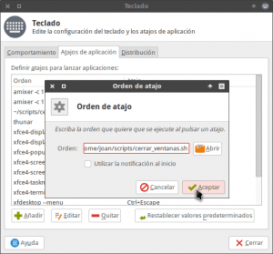
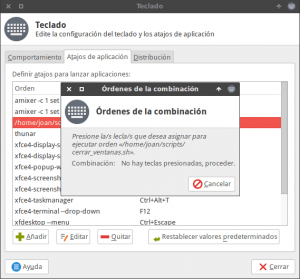
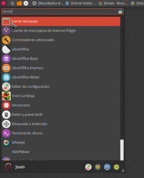

Cuando cambio de tarea o cuando cierro el ordenador acostumbro a cerrar todas las ventanas y programas abiertos uno por uno. Esto sin duda es una pérdida de tiempo.

Con el fin de evitar este problema en el siguiente artículo veremos la forma de cerrar todas las ventanas que tenemos abiertas de forma inmediata y con una sola acción. Para ello tan solo tenemos que seguir las siguientes instrucciones.<!--more-->

## INSTALAR WMCTRL

El primer paso a realizar es asegurar que tengamos instalado la herramienta wmctrl.

La herramienta wmctrl será la encargada de interactuar con nuestro gestor de ventanas y cerrar la totalidad de aplicaciones gráficas que tengamos abiertas.

Para instalar wmctrl tenemos que ejecutar el siguiente comando en la terminal:

> ```
> sudo apt-get install wmctrl
> ```

## CREAR EL SCRIPT PARA CERRAR TODAS LAS VENTANAS DE GOLPE

Una vez instalada la herramienta wmctrl construiremos un script para poder cerrar la totalidad de aplicaciones gráficas que tenemos abiertas de un plumazo y de forma inmediata.

### Creación del script para cerrar las ventanas

Los pasos a seguir para armar el script son los siguientes:

Crearemos una carpeta llamada scripts ejecutando el siguiente comando en la terminal:

> ```
> mkdir ~/scripts
> ```

Dentro de la carpeta scripts crearemos el archivo **cerrar\_ventanas.sh** que contendrá el código del script. Para ello ejecutamos el siguiente comando en la terminal:

> ```
> touch ~/scripts/cerrar_ventanas.sh
> ```

Una vez creado el archivo lo abrimos con el editor de texto nano ejecutando el siguiente comando en la terminal:

> ```
> nano ~/scripts/cerrar_ventanas.sh
> ```

A continuación pegamos el siguiente código dentro del archivo:

> ```
> for xid in $(wmctrl -l | grep -e "-1" -v | awk '{print $1}'); do wmctrl -i -c $xid ; done
> ```

Seguidamente guardamos los cambios y cerramos el archivo.

###### Nota: El código pegado en el archivo cerrar\_ventanas.sh cerrará la totalidad de ventanas abiertas en absolutamente todos nuestros escritorios virtuales.

### Explicación del script que acabamos de generar

Lo que realiza el script que acabamos de crear es lo siguiente:

1. Con el comando **wmctrl -l** sacamos un listado con información de todas las ventanas que tenemos abiertas en nuestro escritorio.
2. Del listado obtenido en el punto uno, con el el comando **grep -e "-1" -v**, borramos las sticky windows. De esta forma al aplicar el script evitaremos cerrar programas como por ejemplo Conky.
3. A partir del listado filtrado del punto 2 aplicamos el comando **awk '{print $1}'**. De esta forma obtenemos un listado que únicamente contiene la identificación en formato hexadecimal de cada una de las ventanas que queremos cerrar.
4. Finalmente con el comando **wmctrl -i -c** lo cerramos la totalidad de ventanas que quedan en el listado filtrado del punto 3.

###### Nota: El resto de partes no comentadas del script forman parte de la estructura típica de un bucle.

### Dar permisos al script

Finalmente damos permisos de ejecución al script que acabamos de crear ejecutando el siguiente código en la terminal:

> ```
> chmod +x ~/scripts/cerrar_ventanas.sh
> ```

En estos momentos la creación del script ha finalizado y seguidamente veremos como podemos usarlo.

### Modificaciones del script original

Con ligeras modificaciones del código podemos modificar el comportamiento del script y realizar las siguientes acciones:

**1-** Cerrar todas las ventanas abiertas de un determinado programa como por ejemplo Libreoffice Writer:

> ```
> for xid in $(wmctrl -l | grep -e "LibreOffice Writer" | awk '{print $1}'); do wmctrl -i -c $xid ; done
> ```

**2-** Cerrar las ventanas abiertas de un escritorio en concreto como por ejemplo el escritorio virtual 2:

> ```
> for xid in $(wmctrl -l | grep \ 1 | awk '{print $1}'); do wmctrl -i -c $xid ; done
> ```

**3-** Cerrar todas las ventanas abiertas de un escritorio en concreto como por ejemplo el escritorio virtual 1:

> ```
> for xid in $(wmctrl -l | grep \ 0 | awk '{print $1}'); do wmctrl -i -c $xid ; done
> ```

**4-** Cerrar todas las ventanas abiertas de Google Chrome en el escritorio 3:

> ```
> for xid in $(wmctrl -l | grep -e "Google Chrome" | grep \ 2 | awk '{print $1}'); do wmctrl -i -c $xid ; done
> ```

###### Nota: Las partes en color rojo de los comandos de este apartado son las podéis modificar para cambiar el comportamiento del script.

## CERRAR LA TOTALIDAD DE PROGRAMAS Y CARPETAS DESDE LA TERMINAL

### Ejecutando el script desde la terminal

Para cerrar la totalidad de ventanas abiertas desde la terminal tan solo tenemos que usar el script que acabamos de crear ejecutando el siguiente comando en la terminal:

> ```
> sh ~/scripts/cerrar_ventanas.sh
> ```

Después de ejecutar el comando se cerrarán todas las ventanas que tenemos abiertas en nuestros escritorios.

### Ejecutando un alias desde la terminal

Para ejecutar de forma más fácil el script podemos construir un alias de la siguiente forma:

#### Crear un alias para cerrar todas las ventanas abiertas

Abrimos una terminal y ejecutamos el siguiente comando:

> ```
> echo alias cerrar='"sh ~/scripts/cerrar_ventanas.sh"' >> ~/.bashrc && . ~/.bashrc
> ```

###### Nota: El comando ejecutado para crear el alias introduce el texto alias cerrar="sh ~/scripts/cerrar\_ventanas.sh" al final del archivo ~/.bashrc. Una vez introducido el texto recarga el fichero ~/.bashrc para que el alias esté disponible al instante.

###### Nota: La palabra cerrar la podéis sustituir por la que vosotros queráis. La palabra que uséis será la encargada de ejecutar el script para cerrar todas nuestras ventanas.

#### Ejecutar el alias para cerrar todas las ventanas abiertas

Una finalizado el proceso tan solo tenemos que abrir una terminal y ejecutar el nombre del alias que acabamos de crear que en mi caso es:

> ```
> cerrar
> ```

Después de ejecutar el alias se cerrarán la totalidad de programas y ventanas abiertas en la totalidad de nuestros escritorios virtuales.

#### Eliminar el alias creado para cerrar todas las ventanas

Si algún día queremos borrar el alias que acabamos de crear tan solo tendríamos que ejecutar el siguiente comando:

> ```
> unalias cerrar
> ```

## CERRAR TODAS LAS VENTANAS CON UN ATAJO DE TECLADO

Otra opción disponible para ejecutar el script que acabamos de crear es mediante una combinación de teclas.

Para crear un atajo de teclado con el fin de usar el script que creamos ejecutamos el siguiente comando en la terminal:

> ```
> xfce4-keyboard-settings
> ```

Una vez ejecutado el comando aparecerá la siguiente ventana:

[](images/Pestaña-de-atajos-de-teclado.png)

Tal y como se puede ver en la captura de pantalla, presionamos encima de la pestaña **Atajos de Aplicación**. Seguidamente presionamos en el botón **Añadir**.

Después de presionar en Añadir aparecerá la siguiente ventana:

[](images/Orden-del-atajo-de-teclado.png)

Tal y como podemos ver en la captura de pantalla, en la ventana **Orden de atajo** introducimos el comando que usaríamos para ejecutar el script que en mi caso es:

> ```
> /home/joan/scripts/cerrar_ventanas.sh
> ```

Presionamos el botón **Aceptar**. Después de presionar el botón Aceptar aparecerá la siguiente pantalla:

[](images/Combinació-de-teclas-para-cerrar-todas-las-ventanas.png)

En estos momentos presionamos la combinación de teclas que deseamos para cerrar todas las ventanas abiertas de forma simultánea.

En mi caso la combinación de teclas elegida es **Ctrl+Alt+Escape**. Por lo tanto presiono la combinación de teclas **Crtl+Alt+Escape**

A partir de estos momentos, cada vez que presione la combinación de teclas **Crtl+Alt+Escape**, se cerrarán de forma inmediata la totalidad de ventanas que tenemos abiertas en nuestros escritorios.

## CERRAR TODAS LAS VENTANAS DE GOLPE A TRAVÉS DE NUESTRO MENÚ

Si queremos integrar el script en nuestro escritorio como si se tratara de un programa lo podemos hacer de la siguiente forma.

### Creación del archivo .desktop cerrar todas las ventanas

Primeramente creamos un archivo .desktop con el nombre **Cerrar Ventanas** ejecutando el siguiente comando en la terminal:

> ```
> touch ~/"Cerrar Ventanas.desktop"
> ```

Seguidamente editamos el archivo que acabamos de crear ejecutando el siguiente comando en la terminal:

> ```
> nano “Cerrar Ventanas.desktop”
> ```

A continuación pegamos el siguiente código dentro de archivo .desktop :

> ```
> [Desktop Entry]
> #Nombre de la aplicación
> Name=Cerrar Ventanas
> #Comentario que aparece al seleccionar el lanzador
> Comment=Cierra todas las ventanas abiertas
> #Comando que usaríamos para ejecutar el script desde la terminal
> Exec=sh /home/joan/scripts/cerrar_ventanas.sh
> #Ruta del icono que queremos que tenga el lanzador
> Icon=/usr/share/icons/Numix/128/apps/window-manager.svg
> #Para que el programa no se abra en una terminal
> Terminal=false
> #Indicación del tipo de archivo .desktop
> Type=Application
> #Para que el programa se ubique en el apartado Accesorios de nuestro menú
> Categories=Utility
> #Desactivar la notificación de inicio del script
> StartupNotify=false
> ```

###### Nota: Los comentarios del código contienen la explicación de cada una de las líneas.

###### Nota: La líneas de color rojo son las únicas susceptibles de modificación

Una vez hayamos pegado y modificado el código guardamos los cambios y cerramos el archivo.

### Dar los permisos correspondientes al archivo .desktop

El siguiente paso será dar permisos de ejecución al archivo .desktop ejecutando el siguiente comando en la terminal:

> ```
> chmod +x 'Cerrar Ventanas.desktop'
> ```

### Integrar el Script en el menú de nuestra distro

Finalmente copiaremos el archivo .desktop en la ubicación **~/.local/share/applications** ejecutando el siguiente comando en la terminal:

```
cp ~/"Cerrar Ventanas.desktop" ~/.local/share/applications
```

Una vez realizados todos los pasos tendremos el script que creamos inicialmente en el menú de nuestra distribución.

Por lo tanto para cerrar la totalidad de ventanas abiertas en nuestro escritorio tan solo tenemos que ir al menú de nuestra distro y clicar encima encima del icono **Cerrar Ventanas**.

[](images/Script-cerrar-ventanas-integrado-en-el-menú.png)

Después de clicar se cerrarán la totalidad de programas y ventanas abiertas en la totalidad de nuestros escritorios virtuales.

## ENTORNOS DE ESCRITORIO EN LOS QUE PODEMOS APLICAR EL MÉTODO DEL ARTÍCULO

He podido comprobar que el script elaborado en este artículo funciona a la perfección en los siguientes entornos de escritorio:

1. XFCE
2. Gnome
3. LXDE
4. Icewm

Espero vuestro feedback en los comentarios para comprobar si en el resto de entornos de escritorio también funciona.

## VÍDEO DEMOSTRATIVO DEL FUNCIONAMIENTO

En el siguiente vídeo pueden ver una muestra del funcionamiento de la totalidad de operaciones que hemos realizado a lo largo de este artículo:

https://www.youtube.com/watch?v=5mKa4uRAT4w
