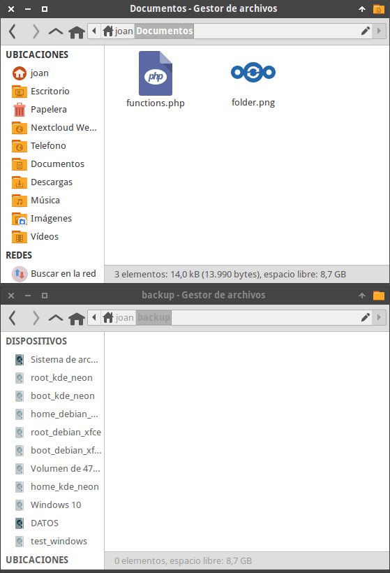
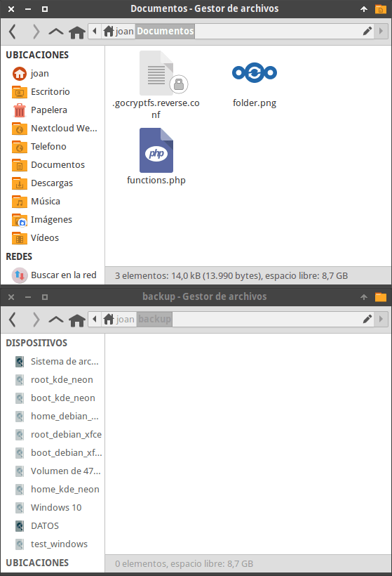
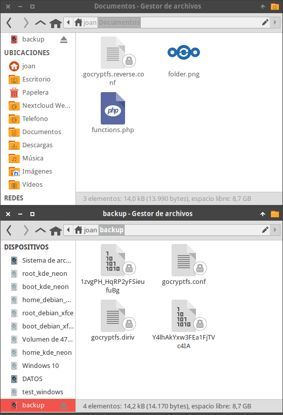
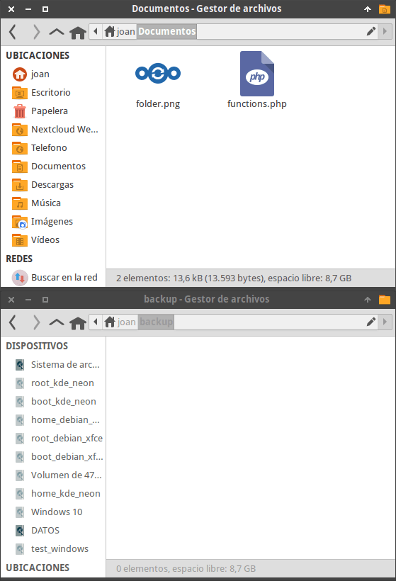
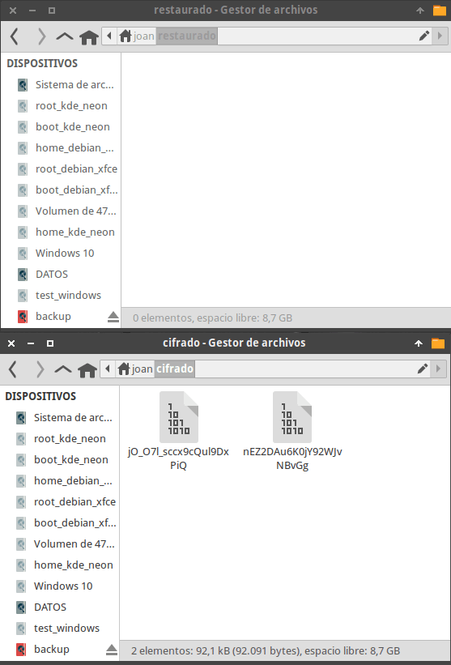
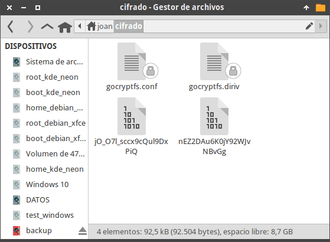
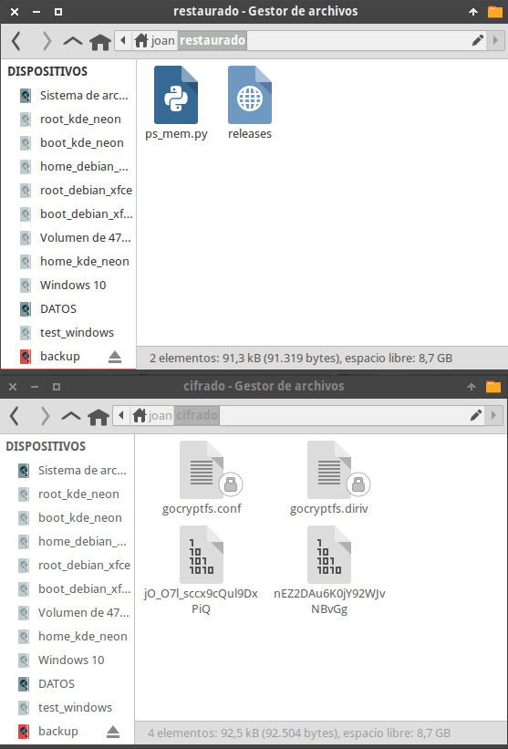
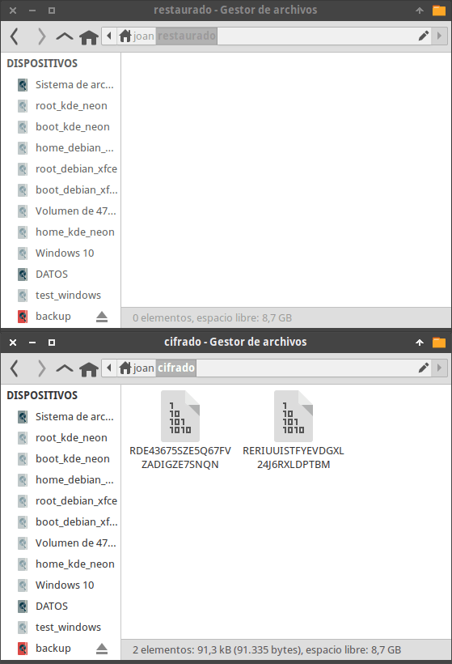
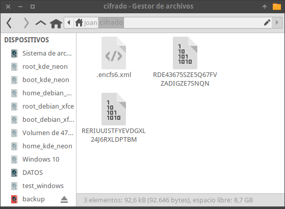
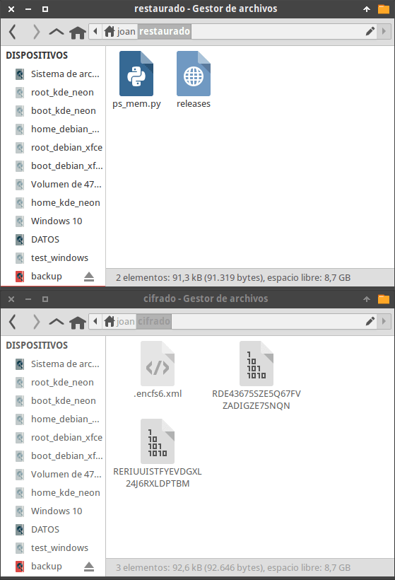

En el artículo anterior vimos [ejemplos de utilización de CryFS, EncFS y gocryptfs](). En los ejemplos partíamos de un directorio con contenido cifrado y lo que hacíamos era montar un volumen descifrado que contenía la misma información que el directorio cifrado. No obstante gocryptfs y EncFS permiten realizar lo opuesto. Por lo tanto en nuestro equipo podemos tener un directorio sin cifrar con multitud de ficheros y directorios. A partir del directorio sin cifrar podemos montar un volumen cifrado que contenga la misma información que el directorio sin cifrar. Una vez montado podemos subir la información cifrada a una nube pública o privada de forma segura. A continuación veremos como usar la opción de cifrado inverso con gocryptfs y EncFS.<!--more-->

## CIFRADO INVERSO DE INFORMACIÓN EN LINUX USANDO GOCRYPTFS Y ENCFS

Los pasos a seguir para un cifrado inverso de información con gocryptfs y EncFS son los siguientes:

### Instalar EncFS y/o GoCryptFS

Obviamente el primer paso consiste en instalar el software que usaremos para el cifrado inverso de ficheros y directorios. Para ello instalaremos gocryptfs y EncFS ejecutando los siguientes comandos en la terminal.

 
|   **Software**   |   **Comando de instalación**   |
| --- | --- |
|   EncFS   |   sudo apt install encfs fuse   |
|   GocryptFS   |   sudo apt install gocryptfs fuse   |

**Nota:** En artículos previos hablamos de los vulnerabilidades de seguridad de EncFS

**Nota:** Los comandos mencionados únicamente son válidos para las distribuciones que usen el gestor de paquetes apt.

### Crear los directorios que almacenarán el contenido cifrado y el contenido sin cifrar

Para conseguir un cifrado inverso de archivos y directorios necesitamos 2 directorios.

- El primer directorio que contendrá la totalidad de información sin cifrar. En mi caso el directorio será el /home/joan/Documentos.
- El segundo directorio en el que montaremos la información cifrada. En mi caso el directorio será el /home/joan/backup.

Para crear los directorios usaremos los siguientes comandos:

 
|  |   **Comando** **para crear directorios**   |
| --- | --- |
|   **Contenido descifrado**   |   mkdir /home/joan/Documentos   |
|   **Contenido cifrado**   |   mkdir /home/joan/backup   |

Una vez finalizada la preparación ya podemos iniciar el proceso de cifrado inverso.

### Cifrado inverso de archivos y directorios con gogryptfs

Según lo comentado hasta el momento disponemos de 2 directorios en nuestro equipo. En mi caso son los siguientes:

[](images/situacion-inicial-cifrado-inverso-archivos-gocryptfs.png)

En el directorio /home/joan/Documentos/ es donde almacenaré la totalidad de archivos y directorios sin cifrar. Estos archivos estarán siempre disponibles y es donde trabajaré con mis documentos. Actualmente este directorio únicamente contiene 2 ficheros.

En el directorio /home/joan/backup/ es donde montaré el contenido cifrado del directorio /home/joan/Documentos/.

Lo primero que tenemos que realizar es configurar el volumen cifrado. Para ello deberemos ejecutar el siguiente comando:

> ```
> gocryptfs -init -reverse /home/joan/Documentos/
> ```

**Nota:** Deberéis reemplazar la parte verde del comando por la ruta que almacenará el contenido sin cifrar.

Una vez ejecutado el comando deberemos definir una contraseña para cifrar y descifrar el contenido.

> Choose a password for protecting your files. Password: 1234 Repeat: 1234

**Nota:** Considerando que usáis letras mayúsculas y minúsculas es recomendable elegir una contraseña de entre 11 y 22 dígitos.

Acto seguido visualizaremos nuestra master key. Apuntadla porque si se nos corrompen los archivos .gocrypt.reverse.conf, gocryptfs.conf o gocryptfs.diriv será el único medio que tendremos para volver a descifrar/montar el volumen cifrado.

> Your master key is:
> 
> 9df3f204-90403ca8-4cb78172-0dd9da3d- d6523052-0d1fd524-a505z56b-82de4461
> 
> If the gocryptfs.conf file becomes corrupted or you ever forget your password, there is only one hope for recovery: The master key. Print it to a piece of paper and store it in a drawer. This message is only printed once. The gocryptfs-reverse filesystem has been created successfully. You can now mount it using: gocryptfs -reverse Documentos MOUNTPOINT

Una vez finalizada la configuración aparecerá el archivo oculto .gogryptfs.conf en el directorio que almacena contenido sin cifrar. **No perdáis nunca este archivo y haced una copia de seguridad** ya que para montar el volumen cifrado necesitaremos este archivo más la contraseña que acabamos de definir.

[](images/volumen-de-cifrado-gocryptfs-configurado.png)

A continuación ya podemos montar el volumen cifrado ejecutando el siguiente comando en la terminal:

> ```
> gocryptfs -reverse /home/joan/Documentos/ /home/joan/backup/
> ```

**Nota:** Deberéis reemplazar el texto en verde por la ruta del directorio que contendrá la información sin cifrar. El texto en color rojo lo deberéis reemplazar por la ruta del directorio en que montaremos el volumen cifrado.

Justo después de ejecutar el comando tendréis que introducir la contraseña para montar el volumen cifrado.

> Password: 1234 Decrypting master key Filesystem mounted and ready.

Una vez finalizado el proceso, en el directorio /home/joan/backup aparecerán el mismo número de ficheros que en el directorio /home/joan/Documentos/, pero estarán cifrados. Además en el volumen cifrado aparecerán los ficheros gocryptfs.conf y gocryptfs.diriv. **No perdáis nunca estos archivos y haced una copia de seguridad** ya que para restaurar los ficheros cifrados necesitaremos estos 2 archivos más la contraseña que acabamos de definir.

[](images/volumen-cifrado-montado-con-gocryptfs.png)

A partir de este momento, con rsync o rclone podremos subir la información cifrada incluso en una nube que nosotros consideremos insegura. De esta forma simple y segura podemos realizar copias de seguridad cifradas en la nube.

Para desmontar el volumen cifrado tan solo tendremos que ejecutar el siguiente comando:

> ```
> fusermount -u /home/joan/backup
> ```

**Nota:** Deberéis reemplazar el texto rojo por lo ruta del directorio en que hayáis montado la información cifrada.

Si en un futuro quieran volver a montar el volumen cifrado tan solo tendrán que ejecutar el siguiente comando e introducir la correspondiente contraseña.

> ```
> gocryptfs -reverse /home/joan/Documentos/ /home/joan/backup/
> ```

### Cifrado inverso de ficheros y directorios con EncFS

Al igual que gocryptfs, EncFS también permite la opción de cifrado inverso. Por lo tanto partiremos del directorio /home/joan/Documentos/ que almacenará nuestros archivos y directorios sin cifrar. Estos archivos estarán siempre disponibles y es donde trabajaré con mis documentos.

En el directorio /home/joan/backup/ es donde montaremos el contenido cifrado del directorio /home/joan/Documentos/. Por lo tanto al igual que en el caso anterior partimos de la siguiente situación:

[](images/situacion-inicial-cifrado-inverso-archivos-encfs.png)

Para montar/cifrar el contenido del directorio /home/joan/Documentos/ en /home/joan/backup tendremos que ejecutar el siguiente comando.

> ```
> encfs --reverse /home/joan/Documentos/ /home/joan/backup
> ```

**Nota:** El texto en color verde corresponde a la ubicación donde guardamos y editamos los ficheros sin cifrar. La parte roja define la ubicación donde montaremos el contenido cifrado.

La primera vez que ejecutemos el comando tendremos que definir la configuración del tipo de cifrado que se aplicará. Desafortunadamente la opción de pre-configurado no está soportada, por lo tanto tendremos que elegir la opción x “modo experto de configuración”

> Creando nuevo volumen cifrado. Por favor, elige una de las siguientes opciones: pulsa "x" para modo experto de configuracion, pulsa "p" para modo paranoia pre-configurado, cualquier otra, o una linea vacia elegira el modo estandar. ?> x

Acto seguido nos preguntaran diversos parámetros para realizar el cifrado. En mi caso selecciono los siguientes:

- Algoritmo de cifrado: AES 16 byte block cipher
- Tamaño de la clave: 256
- Tamaño de bloque en bytes: 2048
- Algoritmos de cifrado de nombres: Block32
- Habilitar vectores de inicialización para cada archivo: Sí

Una vez seleccionadas todas las opciones tendremos que definir la contraseña para montar el volumen cifrado:

> Nueva contraseña Encfs: 1234 Verifique la contraseña Encfs: 1234

**Nota:** La contraseña se puede cambiar a posteriori mediante el comando encfsctl. No obstante al igual que en el caso anterior elegid una contraseña de 11 a 22 caracteres que contenga mayúsculas y minúsculas.

Una vez finalizado el proceso veremos que los 2 archivos que teníamos en el directorio Documentos aparecen de forma cifrada en el directorio de copias de seguridad. Además en el directorio que contiene la información sin cifrar aparece el fichero oculto de configuración de EncFS (.encfs6.xml). **Es indispensable que hagan una copia de seguridad de este archivo oculto** porque sin el será literalmente imposible montar de nuevo el volumen cifrado o restaurar una copia de seguridad cifrada que hayamos almacenado en un medio externo.

[](images/volumen-cifrado-descifrado-con-encfs.png)

A partir de este momento, con rsync o rclone podremos subir la información cifrada incluso en una nube que nosotros consideremos insegura. De esta forma simple y segura podemos realizar copias de seguridad cifradas en la nube.

Cuando ya no necesitemos el volumen cifrado lo podemos desmontar ejecutando el siguiente comando:

> ```
> fusermount -u /home/joan/backup
> ```

**Nota:** Deberéis reemplazar el texto rojo por lo ruta del directorio en que hayáis montado la información cifrada.

Si en un futuro quieran volver a montar el volumen cifrado tan solo tendrán que ejecutar el siguiente comando e introducir la correspondiente contraseña.

> ```
> encfs --reverse /home/joan/Documentos/ /home/joan/backup
> ```

## DESCIFRAR EL CONTENIDO DEL VOLUMEN CIFRADO

El cifrado inverso de archivos con gocryptfs y EncFS es ideal para realizar copias de seguridad cifradas en la nube.

Por lo tanto es de vital importancia saber descifrar el contenido del volumen cifrado.

Imaginemos que el dispositivo de almacenamiento de nuestro ordenador se ha estropeado y únicamente disponemos de la copia de seguridad cifrada en un medio externo.

### Descifrar una copia de seguridad cifrada con gocryptfs

En mi equipo dispongo del directorio /home/joan/cifrado que contiene los ficheros cifrados que quiero restaurar. Los ficheros los voy a restaurar en la ubicación /home/joan/restaurado

[](images/estado-inicial-descifrar-con-gocryptfs.png)

Lo primero que tendremo que realizar es asegurar que gocryptfs está instalado en nuestro equipo. Para ello ejecutaremos el siguiente comando en la terminal:

> ```
> sudo apt install gocryptfs fuse
> ```

A continuación tendremos que obtener los archivos gocryptfs.conf y gocryptfs.diriv. Los rescatan de su copia de seguridad y los ubican dentro del directorio que contiene el contenido cifrado. Recuerden que antes dije que teníamos que hacer una copia de estos archivos.

**Nota:** Si quieren pueden almacenar los ficheros gocryptfs.conf y gocryptfs.diriv en la copia de seguridad cifrada. Es más práctico pero el nivel de seguridad será menor.

[](images/archivos-configuracion-gocryptfs.png)

Finalmente tan solo tenemos que ejecutar el siguiente comando para restaurar la copia de seguridad.

> ```
> gocryptfs /home/joan/cifrado /home/joan/restaurado/
> ```

**Nota:** El texto en color rojo corresponde a la ubicación donde guardamos la copia de seguridad cifrada. La parte verde corresponde a la ubicación donde restauraremos el contenido cifrado.

Después de ejecutar el comando se nos preguntará la contraseña que definimos para montar el volumen. La introducimos y pulsamos Enter.

> Password: 1234 Decrypting master key Filesystem mounted and ready.

Acto seguido se restaurará el contenido de nuestra copia de seguridad.

[](images/volumen-cifrado-descifrado-con-gocryptfs.png)

### Descifrar una copia de seguridad cifrada con EncFS

En mi equipo dispongo del directorio /home/joan/cifrado que contiene los ficheros cifrados que quiero restaurar. Los ficheros los voy a restaurar en la ubicación /home/joan/restaurado

[](images/estado-inicial-descifrar-con-encfs.png)

Acto seguido tenemos que asegurar que EncFS está instalado en nuestro equipo. Para ello ejecutaremos el siguiente comando en la terminal:

> ```
> sudo apt install encfs fuse
> ```

Es indispensable disponer del archivo de configuración oculto .encfs6.xml para descifrar el contenido. Por lo tanto rescatan el archivo .encfs6.xml de su copia de seguridad y lo ubican dentro del directorio donde contiene todo el contenido cifrado. Recuerden que en apartados anteriores les advertí que era crucial tener una copia de seguridad del archivo .encfs6.xml.

**Nota:** Si quieren pueden almacenar el fichero .encfs6.xml en la copia de seguridad cifrada. Es más práctico pero el nivel de seguridad será menor.

[](images/archivos-configuracion-encfs.png)

Finalmente ya podemos restaurar la copia de seguridad. Para ello tan solo tenemos que ejecutar el siguiente comando.

> ```
> encfs /home/joan/cifrado /home/joan/restaurado/
> ```

**Nota:** El texto en color rojo corresponde a la ubicación donde guardamos la copia de seguridad cifrada. La parte verde corresponde a la ubicación donde restauraremos el contenido cifrado.

Después de ejecutar el comando se nos preguntará la contraseña que usabamos para montar el volumen. La introducimos y pulsamos Enter.

> Contraseña EncFS: 1234

Acto seguido se restaurará nuestra copia de seguridad.

[](images/volumen-cifrado-descifrado-con-encfs-1.png)
