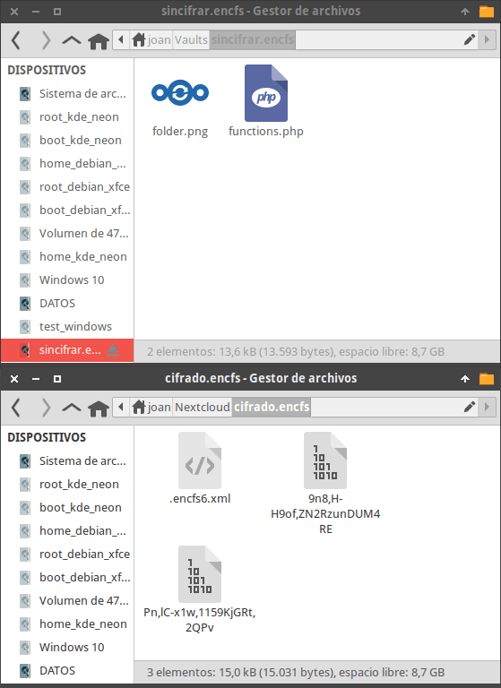
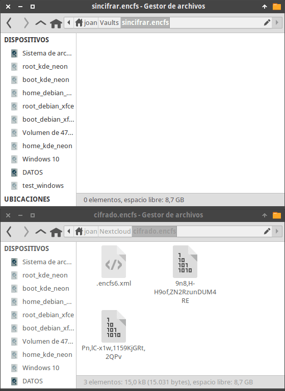
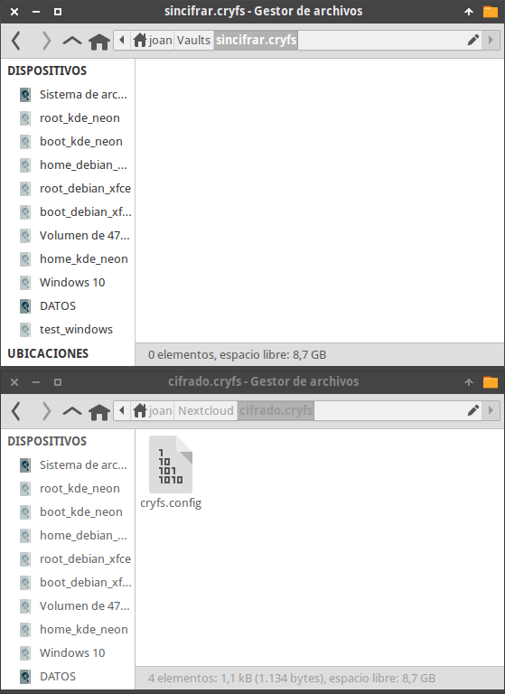
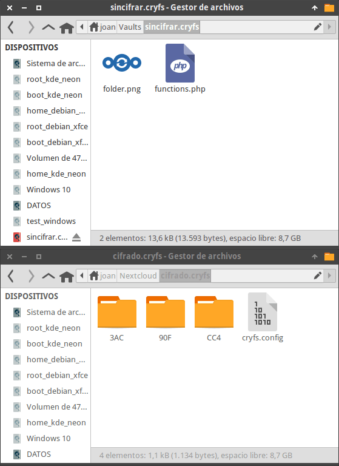
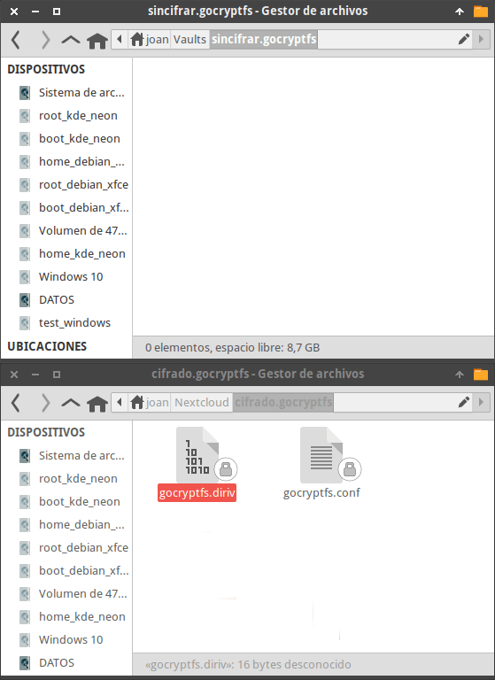
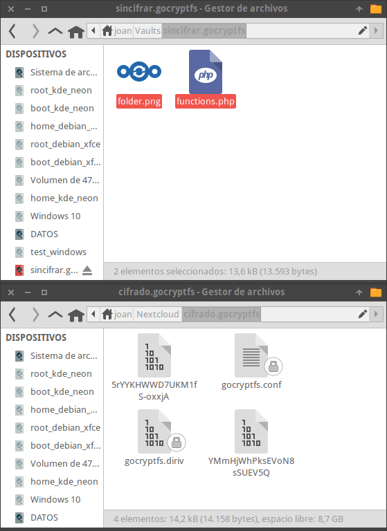

En pasados artículos vimos opciones de Software Libre para poder [cifrar archivos en la nube](). A continuación veremos como podemos cifrar archivos en Linux con [EncFS](https://github.com/vgough/encfs), [CryFS](https://www.cryfs.org/) y [gocryptfs](https://nuetzlich.net/gocryptfs/) de forma detallada.<!--more-->

Pero antes iniciar la explicación de como cifrar los archivos en linux es interesante detallar brevemente como funcionan los programas que acabo de citar.

## ¿CÓMO FUNCIONAN ENCFS, CryFS Y Gocryptfs?

Desde del punto de vista del usuario los 3 software funcionan de forma similar. Su funcionamiento se puede resumir del siguiente modo:

1. Para trabajar necesitan dos directorios. El directorio 1 contendrá la totalidad de la información cifrada. El directorio 2 contendrá el mismo contenido que el directorio 1, pero sin cifrar.
2. Mediante FUSE montaremos el contenido cifrado del directorio 1 en el directorio 2. Una vez montado, el directorio 2 contendrá toda la información del directorio 1, pero sin cifrar.
3. Todo el contenido que tenemos descifrado en el directorio 2 lo podremos visualizar, eliminar y editar sin ningún tipo de problema.
4. Con Gocryptfs y EncFS, el directorio 2 será un espejo del directorio 1. Por lo tanto si creamos o pegamos un documento en el directorio 2 se creará el mismo documento en el directorio 1 pero cifrado. En CryFS por cada archivo que pegamos en el directorio 2 aparecerán multitud de pequeños directorios cifrados en el directorio 1.
5. Una vez finalizado el trabajo desmontaremos el sistema de archivos que donde está el directorio 2. De este modo ya no podremos ver el contenido del directorio 2 y por lo tanto solo podremos ver la información cifrada almacenada en el directorio 1.

Según lo comentado, EncFS, CryFS, y Gocryptfs crean un sistema de archivos que contiene la totalidad de contenido descifrado de un directorio cifrado. Pero EncFS y Gocryptfs también pueden realizar lo opuesto a lo que acabo de describir. Por lo tanto pueden montar un sistema de archivos que contiene la totalidad información cifrada de un directorio que está sin cifrar. Esta opción resultará útil para realizar copias de seguridad cifradas en la nube.

**Nota:** Todas las acciones que acabo de describir las puede realizar un usuario sin necesidad de tener permisos de administración.

## CIFRAR ARCHIVOS EN LINUX CON ENCFS, CRYFS Y GOCRYPTFS USANDO LA TERMINAL

Los pasos para cifrar un directorio mediante EncFS y la terminal son los siguientes.

### Instalar EncFS, CryFS o GoCryptFS

Obviamente el primer paso consiste en instalar el software que usaremos para cifrar los ficheros y directorios. Los comandos a usar para instalar cada uno de los programas en Debian o en distribuciones derivadas de Debian son los siguientes:

 
|   **Software**   |   **Comando de instalación**   |
| --- | --- |
|   EncFS   |   ``` sudo apt install encfs fuse ```   |
|   CryFS   |   ``` sudo apt install cryfs fuse ```   |
|   GocryptFS   |   ``` sudo apt install gocryptfs fuse ```   |

**Nota:** En artículos previos hablamos de los [vulnerabilidades de seguridad]() de EncFS.

### Crear los directorios que contendrán el contenido cifrado y el contenido sin cifrar

Inicialmente crearemos los directorios que almacenarán el contenido cifrado. Crearé un directorio para cada uno de los software que analizaremos. Los directorios los crearé en mi nube Nextcloud y tendrán los nombres cifrado.encfs cifrado.cryfs y cifrado.gocryptfs. Los comandos a usar para crear los directorios que acabo de citar son los siguientes:

 
|   **Software**   |   **Comando para crear directorios**   |
| --- | --- |
|   EncFS   |   mkdir /home/joan/Nextcloud/cifrado.encfs/   |
|   CryFS   |   mkdir /home/joan/Nextcloud/cifrado.cryfs/   |
|   GocryptFS   |   mkdir /home/joan/Nextcloud/cifrado.gocryptfs/   |

**Nota:** Si usamos EncFS les recomiendo que el nombre del directorio termine con .encfs. De esta forma podremos descifrar y editar la información desde nuestro dispositivo Android de forma mucho más sencilla. **Nota:** El propósito es cifrar archivos en la nube. Por lo tanto los directorios que acabamos de crear tienen que estar en una nube tipo Dropbox, Nextcloud, etc.

Finalmente crearemos los directorios donde montaremos el contenido descifrado. En mi caso crearé los siguiente directorios:

 
|   **Software**   |   **Comando para crear directorios**   |
| --- | --- |
|   EncFS   |   mkdir /home/joan/Vaults/sincifrar.encfs   |
|   CryFS   |   mkdir /home/joan/Vaults/sincifrar.cryfs   |
|   GocryptFS   |   mkdir /home/joan/Vaults/sincifrar.gocryptfs   |

### Cifrar archivos en Linux con EncFS usando la terminal

Con los 2 directorios creados ya podemos usar EncFS. Para ello ejecutaremos el comando encfs seguido de la ubicación del directorio que contendrá el contenido cifrado y a continuación el directorio donde montaremos el contenido descifrado. Por lo tanto en mi caso ejecutaré el siguiente comando:

> ```
> encfs /home/joan/Nextcloud/cifrado.encfs/ /home/joan/Vaults/sincifrar.encfs
> ```

Solo la primera vez que ejecutemos el comando se nos preguntará la configuración de cifrado que queremos usar. Nos propone la opción preconfigurada o la manual. Les recomiendo que elijan la preconfigurada. Por lo tanto escriban la latra p y presionen enter.

> ```
> Creando nuevo volumen cifrado.
> Por favor, elige una de las siguientes opciones:
> pulsa "x" para modo experto de configuracion,
> pulsa "p" para modo paranoia pre-configurado,
> cualquier otra, o una linea vacia elegira el modo estandar.
> ?> p
> ```

**Nota:** La configuración de cifrado predeterminada usa AES de 256 bytes con un bloque de 1024 bytes.

Acto seguido nos preguntarán la contraseña que queremos usar para descifrar el contenido. Introduzcan la contraseña del siguiente modo y no la olviden jamas.

> ```
> Nueva contraseña Encfs: 1234
> Verifique la contraseña Encfs: 1234
> ```

**Nota:** Usad una buena contraseña. Recomiendo usar una contraseña de entre 11 y 22 dígitos que contenga mayúsculas y minúsculas.

En estos momentos el proceso ha finalizado y verán que en el volumen cifrado aparece el archivo oculto .encfs6.xml. Este archivo es importante y es recomendable que guarden una copia de seguridad. El motivos es que para descifrar nuestro contenido necesitamos este archivo más la contraseña de descifrado.

Una vez realizada la copia de seguridad podemos empezar a editar y crear contenido dentro del directorio home/joan/Nextcloud/cifrado.encfs/. Por ejemplo vemos que si generamos 2 archivos en /home/joan/Nextcloud/cifrado.encfs/ aparecerán 2 archivos cifrados en /home/joan/Vaults/sincifrar.encfs.

[](images/informacion-cifrada-usando-encfs.png)

Además los 2 archivos cifrados que se acaban de generar subirán automáticamente a la nube de forma cifrada consiguiendo así nuestro objetivo.

Como usuarios solo deberemos generar, borrar y editar ficheros en el directorio que está sin cifrar. Para evitar problemas es mejor que ni entréis en el directorio que está cifrado.

Una vez finalicéis el trabajo podéis desmontar el directorio que está sin cifrar ejecutando el siguiente comando:

> ```
> fusermount -u /home/joan/Vaults/sincifrar.encfs
> ```

Una vez desmontado veremos que únicamente hay contenido en la carpeta cifrada.

[](images/informacion-cifrada-despues-de-desmontar-volumen.png)

Si quisiéramos volver amontar el volumen que contiene el contenido sin cifrar deberíamos volver a ejecutar el comando que usamos al inicio de este apartado.

> ```
> encfs /home/joan/Nextcloud/cifrado.encfs/ /home/Vaults/nextcloud
> ```

A continuación tendríamos que introducir el password para descifrar el contenido y acto seguido se montaría el volumen.

### Cifrar archivos en linux con CryFS y la terminal

El procedimiento para cifrar ficheros y directorios con CryFS es exactamente el mismo que con EnCFS. Por lo tanto tan solo tenemos que ejecutar el comando cryfs seguido de la ubicación del directorio que contendrá el contenido cifrado y a continuación el directorio donde ubicaremos el contenido descifrado. Por lo tanto ejecutaremos el siguiente comando.

> ```
> cryfs /home/joan/Nextcloud/cifrado.cryfs/ /home/joan/Vaults/sincifrar.cryfs
> ```

La primera vez que ejecutemos el comando se nos preguntará si queremos usar la configuración de cifrado estándar. Responderemos que si y acto seguido definiremos la contraseña que usaremos para cifrar y descifrar el contenido. En mi caso el proceso ha sido del siguiente modo:

> ```
> CryFS Version 0.10.2
> 
> Use default settings?
> Your choice [y/n]: y
> 
> Password: 1234
> Confirm Password: 1234
> Deriving encryption key (this can take some time)...
> ```

Justo después de finalizar el proceso veremos que se ha creado el archivo de configuración cryfs.config en el volumen cifrado. Este archivo junto con la contraseña que acabamos de definir son necesarios para descifrar el contenido cifrado. Por lo tanto les recomiendo que realicen un copia de seguridad de este archivo.

[](images/archivo-de-configuracion-cryfs.png)

Si introducimos contenido a la carpeta sin cifrar veremos que en el directorio sin cifrar se generan multitud de directorios. En mi caso introduzco 2 ficheros y solo se crean 3 directorios porque el peso de los ficheros es muy pequeño.

[](images/archivos-cifrados-con-cryfs.png)

Además los directorios cifrados que se acaban de generar subirán automáticamente a la nube de forma cifrada consiguiendo así nuestro objetivo.

Al igual con que EncFS, al usar CryFS únicamente debemos manipular documentos en el volumen que está sin cifrar. Una vez hayamos finalizado de manipular nuestros archivos podemos desmontrar el volumen sin cifrar ejecutando el siguiente comando.

> ```
> fusermount -u /home/joan/Vaults/sincifrar.cryfs
> ```

Si a posteriori tienen necesidad de volver a montar el volumen cifrado tan solo tendrán que volver a ejecutar el siguiente comando:

> ```
> cryfs /home/joan/Nextcloud/cifrado.cryfs/ /home/joan/Vaults/sincifrar.cryfs
> ```

Una vez ejecutado tendrán que introducir la contraseña para montar el volumen descifrado.

### Cifrar archivos con gocryptfs usando la terminal de Linux

Si decidimos cifrar archivos con gocryptfs el proceso es ligeramente diferente, pero igual de sencillo.

Inicialmente generaremos la configuración para el volumen cifrado. Para ello ejecutaremos el el comando gocryptfs -init seguido de la ruta del directorio que queremos que tenga la información cifrada. Por lo tanto en nuestro caso ejecutaremos el siguiente comando:

> ```
> gocryptfs -init /home/joan/Nextcloud/cifrado.gocryptfs
> ```

Una vez ejecutado el comando se nos pedirá que definamos la contraseña para montar y desmontar el volumen que contendrá la información descifrada. En nuestro caso elegimos la contraseña 1234

> ```
> Choose a password for protecting your files.
> Password: 1234
> Repeat: 1234
> ```

Acto seguido visualizaremos nuestra master key. Apuntadla porque si se nos corrompe el archivo gocryptfs.conf será el único medio que tendremos para descifrar el contenido.

> ```
> Your master key is:
> 
> 32420asd-e704e557-244123d0-9ae9d0e0-
> c13299e5-c7d2e6e6-da33eyaf-5c1df55b
> 
> If the gocryptfs.conf file becomes corrupted or you ever forget your password,
> there is only one hope for recovery: The master key. Print it to a piece of
> paper and store it in a drawer. This message is only printed once.
> The gocryptfs filesystem has been created successfully.
> You can now mount it using: gocryptfs Nextcloud/cifrado.gocryptfs MOUNTPOINT
> ```

Una vez definido el volumen cifrado, montaremos el volumen descifrado del mismo modo que lo hacíamos en EncFS y CryFS.

Por lo tanto ejecutaremos le comando gocryptfs seguido de la ubicación del directorio que contendrá el contenido cifrado y a continuación el directorio donde ubicaremos el contenido descifrado. Por lo tanto ejecutaremos el siguiente comando.

> ```
> gocryptfs /home/joan/Nextcloud/cifrado.gocryptfs /home/joan/Vaults/sincifrar.gocryptfs
> ```

Justo al introducir el comando se nos preguntará la contraseña que acabamos de definir para descifrar el contenido.

> ```
> Password: 1234
> Decrypting master key
> Filesystem mounted and ready.
> ```

Una vez finalizado el proceso los directorios que almacenan el contenido cifrado y descifrado tendrán el siguiente contenido:

[](images/configuracion-cifrado-gocryptfs-realizada.png)

En el momento que añadamos 2 archivos en el volumen que almacena el contenido sin cifrar se generarán 2 archivos cifrados en el volumen que almacena el contenido cifrado.

[](images/cifrar-archivos-gocryptfs.png)

Del mismo modo que en los casos anteriores nunca deberemos añadir, borrar o editar información dentro del directorio que almacena el contenido cifrado. Siempre trabajaremos en el directorio que contiene información descifrada.

Una vez finalizado el trabajo desmontaremos el volumen que contiene el almacena el contenido descifrado ejecutando el siguiente comando en la terminal:

> ```
> fusermount -u /home/joan/Vaults/sincifrar.gocryptfs
> ```

Si en el futuro queremos volver a montar el volumen que acabamos de descifrar tan solo tendremos que volver a ejecutar el siguiente comando e introducir la contraseña correspondiente contraseña.

> ```
> gocryptfs /home/joan/Nextcloud/cifrado.gocryptfs /home/joan/Vaults/sincifrar.gocryptfs
> ```

## PRECAUCIONES Y PUNTOS A TENER EN CUENTA AL CIFRAR ARCHIVOS CON ENCFS, CRYFS Y GOCRYPTFS

Hay una serie de puntos que tenemos que tener en cuenta cuando trabajamos con estos 3 programas.

**El primero** de ellos es que únicamente tenemos que trabajar con el directorio que muestra la información sin cifrar. Por lo tanto solo podemos editar, borrar y generar nuevo contenido en los siguientes directorios:

> ```
> /home/joan/Nextcloud/cifrado.encfs/
> /home/joan/Nextcloud/cifrado.cryfs/
> /home/joan/Nextcloud/cifrado.gocryptfs/
> ```

Nunca debéis introducir información directamente en el directorio que contiene información cifrada. Si lo hacéis veréis que la información simplemente no se cifra y estará visible para todo el mundo.

**El segundo punto** es que dentro de cada uno de los directorios cifrados se crearan una serie de archivos ocultos y archivos de configuración. El nombre de estos archivos en función del software que usemos son los siguientes.

 
|   **Software**   |   **Nombre del archivo oculto para descifrar contenido**   |
| --- | --- |
|   EncFS   |   .encfs6.xml   |
|   CryFS   |   cryfs.config   |
|   GocryptFS   |   gocryptfs.conf y gocryptfs.diriv   |

Es de vital importancia hacer una copia de seguridad de los archivos ocultos que acabo de mencionar. Si los perdéis no podréis descifrar nunca más la información porque para descifrar la información necesitamos estos archivos más la contraseña de descifrado.

Los archivos ocultos y/o de configuración que acabamos de mencionar se pueden almacenar en la nube. No obstante si los guardamos en una ubicación diferente a la nube estaremos implementando un sistema de verificación en 2 pasos.

## CIFRADO INVERSO DE ARCHIVOS CON GOCRYPTFS Y ENCFS EN LINUX

En todos los ejemplos vistos hasta el momento partimos de contenido cifrado y lo desciframos. Una vez descifrado el contenido podemos editar la información sin ningún tipo de problema.

No obstante gocryptfs y EncFS permiten realizar lo opuesto. Por lo tanto en nuestro equipo podemos tener información sin cifrar y siempre disponible. A partir de la información sin cifrar podemos montar un volumen cifrado y una vez montado podemos subir la información cifrada a una nube pública o privada de forma segura. Para realizar lo que acabo de describir pueden visitar el siguiente enlace.

https://geekland.eu/cifrado-inverso-de-archivos-y-directorios-para-copias-de-seguridad/
