En el siguiente post veremos como cifrar mails con enigmail de forma fácil y prácticamente automática. Antes de proceder a aplicar el tutorial es altamente recomendable que consultéis y deis una lectura al siguiente post:

[https://geekland.eu/razones-para-cifrar-y-firmar-mail/]()

<!--more-->En el caso de no leer el post recomendado es posible que os perdáis y no os enteréis de lo que estáis realmente haciendo y porqué lo estamos haciendo.

###### Nota: El proceso de cifrado se realizará usando OpenPGP. Nos focalizaremos con OpenPGP por ser un protocolo no propietario que funciona a la perfección. Una alternativa a OenPGP puede ser S/MIME. S/MIME es soportado de serie por varios clientes de mail como pueden ser Outlook o Thunderbird.

## REQUISITOS PARA PODER CIFRAR MAILS

Los requisitos para poder cifrar mails y firmarlos de forma sencilla y de forma automática son los siguientes:

1. Tener instalado el gestor de correo [**Thunderbird**](http://www.mozilla.org/es-ES/thunderbird/ "Thundebird").
2. Instalar [**Enigmail**](https://www.enigmail.net/home/index.php "Enigmail"). Enigmail es una extensión del correo del gestor de correo de Thundebird.
3. Tener instalado el paquete [**GnuPG**](http://www.gnupg.org/ "GnuPG"). La totalidad de distros Linux disponen de este paquete en sus repositorios. Los más probable es que ya lo tengan instalado por defecto.

Por lo tanto solamente precisamos cumplir los requisitos mencionados en estos tres puntos. Los requerimientos son los mismos usemos el sistema operativo que usemos.

###### Nota: Si quisiéramos hacer el proceso de forma manual vía terminal únicamente necesitaríamos instalar el paquete GnuPG. Existen otras alternativas de cifrado que se pueden consultar al siguiente post: [https://geekland.eu/razones-para-cifrar-y-firmar-mail/]()

## INSTALAR THUNDERBIRD O ICEDOVE

Es probable que la distro que tengáis ya tenga Thunderbird instalado por defecto. En el caso que no lo tengáis instalado tan solo tenéis que abrir una terminal e introducir los siguientes comandos para su instalación:

> ```
> sudo apt-get install thunderbird thunderbird-­l10n­-es
> ```

En el caso de usar Debian usaremos [Icedove](http://es.wikipedia.org/wiki/Icedove "Gestor de correo Icedove") en vez de Thundebird. Para instalar Icedove simplemente tendremos que introducir las siguientes ordenes en la terminal:

> ```
> sudo apt-get install icedove icedoce-­l10n­-es
> ```

En el caso que queráis usar thunderbird y no esté en vuestros repositorios podéis instalarlo siguiendo los pasos que se mencionan en el siguiente tutorial:

[https://geekland.eu/instalar-firefox-y-thunderbird-en-debian-facilmente/]()

En el caso que tengáis Mac o Windows podéis descargar los binarios de Thunderbird del siguiente enlace:

[http://www.mozilla.org/es-ES/thunderbird/](http://www.mozilla.org/es-ES/thunderbird/ "Binarios de Thunderbird para Mac y Windows")

## CONFIGURAR NUESTRA CUENTA DE CORREO

A estas alturas ya tenemos instalado Thunderbird en nuestro ordenador. Ahora procederemos a configurar nuestra cuenta de correo para que podamos usar Thunderbird si ningún problema.

Acabamos de crear una cuenta de correo en Gmail que es la siguiente:

**aaurelio956"arroba"gmail.com**

Accedemos dentro de la cuenta de Gmail para asegurarnos que tenemos IMAP habilitado. Para ello como se puede ver en la captura de pantalla damos **clic encima del icono de configuración**.

[](images/2-Acceso-a-la-configuración-de-cuenta.png)

Después de dar un click sobre el icono de configuración se desplegará un menú y **elegiremos la opción Configuración**.

Seguidamente aparecerá la captura de pantalla que podéis ver a continuación:

[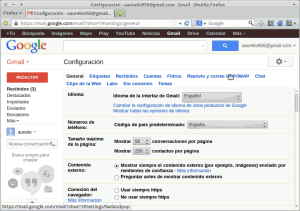](images/3-Acceso-a-configuracion-IMAP.png)

En esta pantalla tendremos que **elegir la opción reenvío de correo POP/IMAP**.

Justo al elegir esta opción aparecerá otra pantalla. En la otra pantalla, tal y como podemos ver en la captura de pantalla, tenemos que elegir **Habilitar IMAP** y seguidamente tenemos que **presionar el botón Guardar los cambios**.

[](images/4-Habilitar-IMAP.png)

## INTRODUCIR NUESTRA CUENTA EN THUNDERBIRD

Para introducir nuestra cuenta de correo en Thunderbird lo primero que tenemos que hacer **ejecutar Thunderbird**. Al ser la primera vez que lo ejecutamos no habrá ninguna cuenta configurada y os aparecerá una pantalla parecida a la siguiente:

[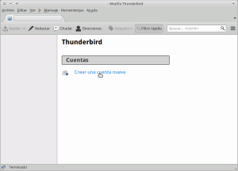](images/5-Añadir-cuenta-de-correo-a-Thunderbird.png)

Para introducir nuestro cuenta de correo en Thunderbird, como se puede ver en la captura de pantalla, tendremos que **apretar sobre el botón Crear una cuenta nueva**.

Seguidamente aparecerá una la siguiente ventana:

[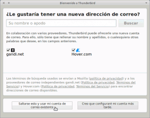](images/6-Saltarse-esto.png)

En esta ventana Thunderbird no está ofreciendo la posibilidad de hacernos una cuenta de correo en [gandi.net](http://www.gandi.net/ "Cuenta de correo en Gandi") o en [Hover.com](https://www.hover.com/ "Cuenta de correo en Hover.com"). Como nosotros ya tenemos nuestra cuenta con Gmail simplemente **apretaremos el botón Saltarse esto y usar mi cuenta de correo existente**.

Una vez seleccionada la opción aparecerá la siguiente pantalla donde tendremos que **introducir los datos de nuestra cuenta de gmail, hotmail, yahoo, etc**. Una vez introducidos los datos **apretamos el botón de continuar**.

[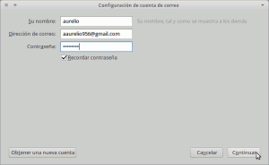](images/7-Configuración-de-la-cuenta-de-correo.png)

Entonces aparecerá la siguiente pantalla:

[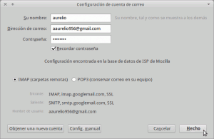](images/8-Cuenta-configurada-automaticamente.png)

En esta pantalla Thunderbird nos ofrecerá una configuración predefinida para el servidor entrante y para el servidor saliente. En el caso de usar Gmail la configuración standard funcionará a la perfección. Por lo tanto como se puede ver en la captura de pantalla tan solo tenemos que  **presionar el botón Hecho**.

###### Nota: En este último pasó comprobad que tengáis tildada la opción [IMAP](http://es.wikipedia.org/wiki/Internet_Message_Access_Protocol "Explicación de IMAP"). IMAP considero que es más interesante que [POP3](http://es.wikipedia.org/wiki/Post_Office_Protocol "Explicación de POP3") ya que el protocolo IMAP, ente otras cosas, nos permitirá que varios clientes puedan tener acceso a la misma cuenta de correo.

###### Nota: En el caso que la configuración estandard no funcione deberéis proceder a realizar una configuración manual de los servidores entrantes y salientes.

En estos momentos como se puede ver en la captura de pantalla nuestra cuenta está debidamente configurada y funcionando.

[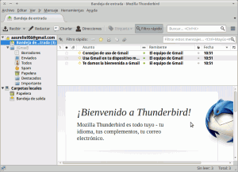](images/9-Cuenta-configurada.png)

## INSTALAR EL PAQUETE GnuPG

Para proceder al cifrado y firma de mails tendremos que instalar el paquete GnuPG. Para ello en Linux tenemos que abrir una terminal e introducir el siguiente comando:

> ```
> sudo apt-get install gnupg
> ```

[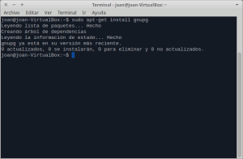](images/10-Instalación-de-gnupg.png)

Como pueden ver en la captura de pantalla en mi caso ya lo tenia instalado. Asegurad que lo tengáis instalado.

En el caso de tener Windows podéis descargar el archivo los ejecutable de GnuPG del siguiente link:

[ftp://ftp.gnupg.org/gcrypt/binary/](ftp://ftp.gnupg.org/gcrypt/binary/ "Instalar gnupg en windows")

En el caso de usar MAC podéis descargar el archivo binario del siguiente link:

[https://gpgtools.org/](https://gpgtools.org/ "Instalar Gnupg en Mac")

## INSTALAR LA EXTENSIÓN ENIGMAIL

Para instalar la extensión Enigmail en Thunderbird, como se puede ver en la captura de pantalla, tenemos que **seleccionar el menú** **Herramientas**:

[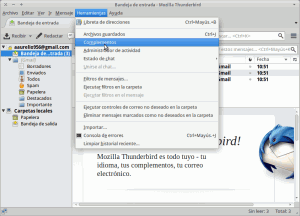](images/11-Instalación-de-enigmail.png)

Dentro del menú **Herramientas** elegiremos la opción **Complementos**. Seguidamente, tal y como se puede ver en la captura de pantalla, en el cuadro de búsqueda **buscaremos la extensión Enigmail**.

[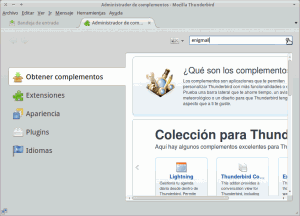](images/12-Buscar-Enigmail.png)

Una vez a encontrada la extensión Enigmail tal y como se puede ver en la captura **presionamos el botón de instalar**:

[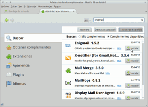](images/13-Instalar-Enigmail.png)

Una vez se haya instalada la extensión, tendremos que **reiniciar Thunderbird presionado el link Reiniciar ahora**.

[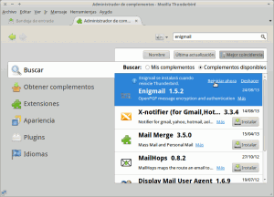](images/14-Reiniciar-Enigmail.png)

## GENERAR UN PAR DE CLAVES

Una vez reiniciado Thunberbird observareis que aparece un menú que se llama llama OpenPGP:

[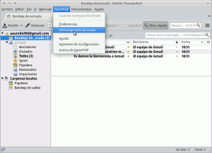](images/15-Administración-de-claves.png)

Tal y como se puede ver en la captura **abrimos el menú OpenPGP y seleccionamos la opción Administración de Claves** del desplegable. Justo al hacer esto aparecerá la siguiente pantalla:

[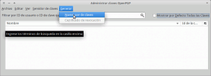](images/16-Generar-nuevo-par-de-llaves.png)

Como se puede ver en la captura de pantalla para generar la claves **tenemos que acceder al menú Generar y dentro del menú Generar elegiremos la opción Nuevo par de claves**. Seguidamente aparecerá el siguiente cuadro de dialogo para la configuración del par de claves:

[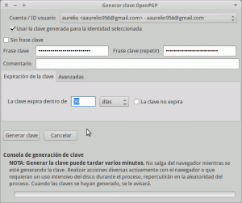](images/17-Opciones-de-configuración-para-crear-la-clave.png)

En el cuadro de diálogo que aparece tendremos que especificar las siguientes preferencias:

**Cuenta / ID usuario:** Asegurar que en este apartado tenemos seleccionado el email para el cual queremos usar el par de claves que vamos a crear. En mi caso el email es **aaurelio956"arroba"gmail.com**

**Usa la clave generada para la identidad seleccionada:** En este caso tildamos la casilla ya que las claves las queremos usar para el email **aaurelio956"arroba"gmail.com**.

**Frase Clave:** Tendremos que introducir una contraseña para nuestra clave privada. Siempre que tengamos que hacer uso de la clave privada se nos pedirá la contraseña. Considero importante que introduzcáis una contraseña. Es importante ya que si alguien os roba o quiere usar vuestra clave privada no podrá ya que cuando la vaya a usar le pedirá una contraseña y no la sabrá.

###### Nota: Si alguien considera engorroso tener que ir introduciendo la contraseña cada vez que se haga uso de la calve privada, puede tildar la opción Sin frase clave. La única pega que esto puede tener es que una tercera persona haga un uso fraudulento de vuestra clave privada como por ejemplo leer vuestros mails cifrados, enviar mails haciéndose pasar por vosotros, etc.

**Tiempo de expiración de la clave:** En este campo deberemos elegir el tiempo que serán válidas las claves que generaremos. Como esta cuenta de correo solo la he creado para redactar este post voy a elegir que las claves creadas caduquen en 30 días. Vosotros podéis elegir otras opciones como por ejemplo toda la vida, 5 años, etc.

Una vez seleccionadas estas opciones **clicaremos sobre la pestaña Avanzadas**. Después de clicar la pestaña Avanzadas aparecerán las siguientes opciones en el cuadro de dialogo:

[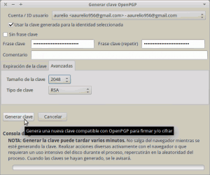](images/18-Opciones-de-configuración-avanzadas-para-crear-la-clave.png)

En el nuevo cuadro de diálogo **tenemos que seleccionar el tipo de cifrado que queremos aplicar a nuestro emails** y la fortaleza del cifrado. Para ello tenemos las siguientes opciones:

**Tamaño de la clave:** Podemos elegir las opciones 1024, 2048 y 4096. Cuanto más grande sea la clave mayor más segura será. En mi caso como tamaño he elegido 2048 ya que es más que suficiente.

**Tipo de la clave:** Tenemos 2 tipos de cifrado a elegir. El [RSA](http://es.wikipedia.org/wiki/RSA "Explicación del cifrado RSA") y el [DSA](http://es.wikipedia.org/wiki/DSA "Explicación del Cifrado DSA") [El Gamal](http://es.wikipedia.org/wiki/Cifrado_ElGamal "Explicación del cifrado El Gamal"). En mi caso he elegido el tipo RSA.

Una vez configurados los cuadros de diálogo tan solo tenemos que **presionar el botón** **Generar Clave**. El proceso para generar la clave se puede dilatar durante 5 o 10 minutos en función de la fortaleza del cifrado que hayas elegido.

Al terminar de generar la clave nos aparecerá la siguiente advertencia en pantalla:

[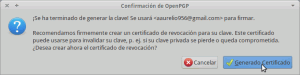](images/19-Generar-certificado-de-revocación.png)

La advertencia nos está preguntando si queremos generar un certificado de revocación del par de claves que acabamos de generar. Nosotros lo vamos a crear. Para crear el certificado tan solo tenemos que **presionar el botón Generado Certificado**. Después de presionar el botón nos preguntará la ubicación donde queremos guardar el certificado. Una vez elegida la ubicación **presionamos el botón Guardar**. Una vez presionado el botón guardar, si hemos decido introducir, una frase clave nos la preguntará. Una vez introducida la frase clave el certificado de revocación se descargará en la ubicación elegida.

###### Nota: El certificado de revocación es el único medio con el que podemos anular nuestro par de claves. Por lo tanto en el caso que perdamos nuestro par de claves o una tercera persona nos las robe con el certificado de revocación podremos anular las claves para que nadie pueda hacer un uso fraudulento de ellas.

A estas alturas ya nos podemos ir al administrador de claves de OpenPGP. Para acceder al administrador de claves **accedemos al menú OpenPGP y clicamos en Administración de claves**. Seguidamente veremos que nuestras claves ya han sido generadas:

[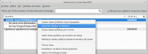](images/20-Exportar-Claves-Secretas.png)

En el caso que queramos guardar una copia de nuestra clave pública y privada tan solo tenemos que **seleccionar nuestra clave, presionar el botón derecho del ratón y seleccionar exportar claves a un fichero**. Seguidamente aparecerá el siguiente menú:

[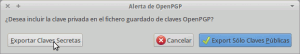](images/21-Exportar-Claves-Secretas.png)

Como queremos exportar tanto nuestra clave pública como nuestra clave privada **seleccionaremos la opción Exportar Claves Secretas**. Si quisiéramos exportar solo nuestra clave pública elegiríamos la opción exportar sólo Claves Públicas.

Finalmente seleccionamos la ubicación donde queremos exportar/descargar nuestras claves y listo.

## OPCIONES DE CONFIGURACIÓN EN LOS ENVÍOS DE MAILS

Seguidamente pasamos a configurar OpenPGP. Para configurar OpenPGP, tal y como podemos ver en la captura de pantalla, tenemos que **acceder al menú** **Editar**.

[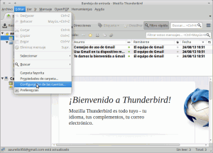](images/22-Configuración-Opciones-OpenPGP.png)

Seguidamente **Elegiremos la opción Configuración de las cuentas**. Una vez elegida está opción nos aparecerá la siguiente pantalla:

[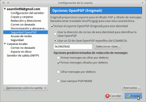](images/23-Configuración-Opciones-OpenPGP.png)

En la parte izquierda de la captura de pantalla **seleccionamos al opción Seguridad OpenPGP**. En la parte derecha de la pantalla aparecerán una serie de opciones para configurar de forma predeterminada el uso de OpenPGP.

Las opciones que aparecerán son las siguientes:

**Activar soporte OpenPGP para esta entidad:** Si queremos cifrar mails y firmar mensajes nos tenemos que asegurar que está opción está tildada.

**Usar un ID de clave OpenPGP específico:** Tenemos que asegurarnos que esta celda está marcada. También tenemos que asegurarnos que el número de ID sea el mismo que el de la clave que acabamos de generar. Para ello podemos apretar el botón seleccionar clave. Aparecerá una pantalla donde figuran todas las claves disponibles en nuestro sistema. Ahora tan solo tenemos que seleccionar la clave que acabamos de crear.

**Firmar mensajes sin cifrar por defecto:** Si tildamos esta opción cuando enviemos un mensaje se firmará automáticamente. Particularmente prefiero no tildar esta opción. Prefiero introducir la firma mientras estoy escribiendo el mail.

**Firmar mensajes cifrados por defecto:** Si tildamos esta opción cuando enviemos un mail cifrado se firmará automáticamente sin que nosotros tengamos que indicarselo manualmente. Personalmente tengo activada esta opción.

**Cifrar mensajes por defecto:** Si tildamos esta opción cuando enviemos un mail el proceso de cifrado se hará de forma automática. Personalmente prefiero no tildar esta opción ya que no hay mucha gente que disponga de claves públicas que nos permitirán cifrar mails. Por lo tanto en el caso que quiera cifrar un mail lo haré manualmente cuando esté redactando el correo.

**Usar siempre PGP/MIME:** Si tildamos esta opción nuestros mensajes se cifraran con **PGP/MIME** mientras que si no la tildamos se cifrarán con **PGP/INLINE**. Si usamos PGP/MIME los adjuntos de los mails y otras características se cifrarán juntamente con el mensaje. Esto tendrá la ventaja que al recepcionar un correo cifrado tan solo será necesario un proceso de descifrado para poder ver la totalidad del contenido del mail. Si usamos PGP/INLINE se cifrará cada parte del mail por separado, por lo tanto si el mail tiene texto plano y 2 documentos adjuntos cada uno se cifrará por separado y cuando el destinatario reciba el mail tendrá que descifrar el contenido por pasos. Primero descifrará el texto plano y a posteriori tendrá que ir descifrando adjunto por adjunto cosa que es un poco engorroso. A piori es mejor usar usar PGP/MIME pero hoy en día aún existen gestores de correo que no soportan PGP/MIME. Si usamos PGP/Inline tendremos la ventaja de tener total compatibilidad y tener la seguridad de poder descifrar siempre al vuelo los mensajes cifrados de texto plano. Particularmente tengo destilada esta opción ya que si alguien usa [k9mail](https://play.google.com/store/apps/details?id=com.fsck.k9&hl=es "Gestor de correo k9mail") en su teléfono le será mucho más fácil leer nuestros mensajes. Aquí tendréis que probar y elegir lo que más os convenga.

###### Nota:Algunos de los gestores de correo que soportan PGP/MIME son Apple Mail, [Kmail](http://userbase.kde.org/KMail "Correo Kmail"), [Evolution](https://projects.gnome.org/evolution/ "Correo Evolution"), [Sylpheed](http://sylpheed.sraoss.jp/en/ "Correo sylpheed"), [Thunderbird](http://www.mozilla.org/es-ES/thunderbird/ "Thunderbird"), etc.

###### Nota: No es necesario entrar en configuraciones avanzadas. En las opciones avanzadas simplemente tendremos la opción de configurar que se adjunte la clave pública en la totalidad de nuestros mensajes.

En el caso que queramos enviar un mail con una configuración distinta a la estándard que acabamos de definir es muy fácil:

[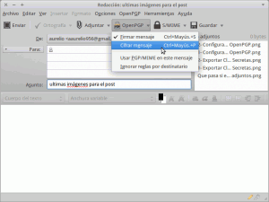](images/24-que-pasa-si-queremos-modificar-las-opciones-estandard.png)

Tal y como se puede ver en la captura de pantalla, mientras estamos redactando el mensaje tan solo tenemos que apretar al botón de OpenPGP y podremos elegir las opciones que creamos convenientes.

## INTRODUCIR CONFIGURACIONES EN FUNCIÓN DEL DESTINATARIO DEL EMAIL

Una vez sabemos que hay un usuario que no tiene problema en recibir y contestar mails cifrados podemos introducir reglas en función de los usuarios.

[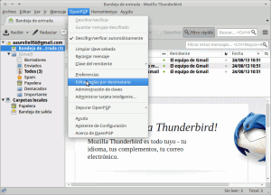](images/25-Introducción-de-reglas-por-usuario.png)

Para ello como podemos ver en la captura de pantalla **accedemos al Menú OpenPGP y elegimos la opción Editar reglas por destinatario**. Seguidamente aparecerá la siguiente pantalla:

[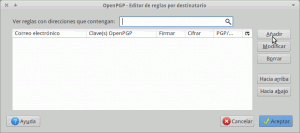](images/26-Introducir-Reglas-en-función-del-usuario.png)

En esta pantalla tan solo tenemos que **apretar el botón Añadir**. Una vez apretado el botón aparecerá el siguiente menú:

[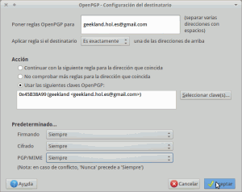](images/27-Introducción-de-reglas-por-usuario.png)

En el siguiente menú simplemente tenemos que introducir las reglas que queremos para cada uno de los usuarios. Tal y como se puede ver en la captura de pantalla cuando enviemos un correo a la cuenta **geekland.hol.es"arroba"gmail.com** usaremos la clave pública 0x45B38A99 para cifrar los correos. Los correos que enviaremos a esta cuenta siempre irán firmados, cifrados y usando PGP/MIME independientemente de la configuración estandard que tengamos. Este hecho ayuda a automatizar completamente el envío de mails cifrados y firmados en función del destinatario.

## COMO ENVIAR UN CORREO CIFRADO Y FIRMADO

Una vez finalizado el proceso de configuración ya podemos enviar nuestro primer mail cifrado y firmado.

[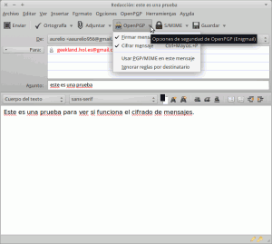](images/28-Prueba-envío-mail.png)

Para realizarlo es muy fácil. Tal y como vemos en la captura de pantalla simplemente **tenemos que redactar un mensaje normal y corriente**. Cuando terminemos **clicamos al botón de OpenPGP y elegimos si queremos firmar y cifrar el mensaje**.

###### Nota: En el caso que usemos reglas por usuarios, o en el caso que la configuración estandard sea la adecuada no será necesario clicar al botón de OpenPGP.

Ahora solamente nos falta **presionar el botón de Enviar** y listo. Si hemos elegido una contraseña para proteger nuestra clave privada aparecerá una ventana y seguidamente tendremos que **introducir la contraseña** que hayamos elegido.

Como vemos en la última captura de pantalla estamos enviando un mail a la cuenta **geekland.hol.es"arroba"gmail.com**. Al ser la primera vez que  enviamos un correo cifrado a esta cuenta veremos que cuando apretemos al botón de enviar nos aparecerá una advertencia de que no tenemos disponible la clave pública de esta cuenta de correo.

[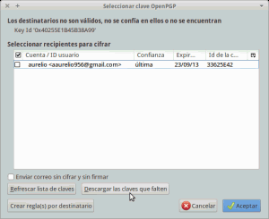](images/29-llaves-no-disponibles.png)

Cuando aparezca advertencia, tal y como se puede ver en la captura de pantalla, **presionamos al botón descargar las claves que faltan**.

Al presionar el botón descargar claves aparecerá el siguiente menú.

[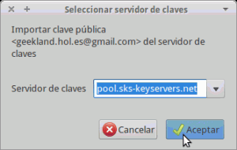](images/30-Seleccionar-el-servidor-de-claves-para-descargar.png)

En el siguiente menú tenemos que **seleccionar uno de los servidores de claves que Thunderbird trae preconfigurado**. Una vez elegido **presionamos aceptar y se intentará descargar la clave pública** de **geekland.hol.es"arroba"gmail.com** del servidor que hemos seleccionado.

Si la clave de **geekland.hol.es"arroba"gmail.com** esta disponible en el servidor de claves se descargará y aparecerá la siguiente pantalla:

[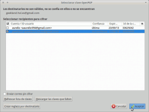](images/31-Seleccion-de-la-clave-pública.png)

Seguidamente **seleccionamos la clave pública del destinatario que acabamos de descargar y apretamos en el botón Aceptar.**  Seguidamente el mail saldrá de nuestra bandeja de salida.

###### Nota: La segunda vez que enviemos el mail el proceso será mucho más fácil porqué ya tendremos nuestra clave pública del destinatario. Por lo tanto la segunda vez que enviemos el mail será tan fácil como escribir el mensaje y presionar el botón de enviar. Recordad que la condición sine qua non para enviar mails cifrados y firmados es disponer de vuestra clave privada y de la clave pública del destinatario.

###### Nota: Para comprobar la firma de los mails recibidos será necesario establecer el nivel de confianza de la firma.

## COMO DESCIFRAR UN MENSAJE

Una vez el destinatario reciba **el correo se descifrará automáticamente**. En el caso que el usuario haya elegido una contraseña para proteger su clave privada, tendremos que introducir la contraseña para descifrar el mensaje. En el caso que el mensaje no se os descifre automáticamente podéis comprobar que tengáis tildada la opción que se muestra en la siguiente captura de pantalla:

[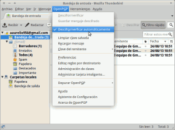](images/Descifrado-automático-de-correos.png)

## COMO DISTRIBUIR NUESTRA CLAVE PÚBLICA

Como vimos en el [pasado post]() y como hemos visto en este, es necesario que las personas que nos quieran enviar un mail dispongan de nuestra clave pública. **Algunas de las formas para distribuir nuestra clave pública son vía mail o subiéndola a un servidor de claves públicas.**

Para poder proporcionar nuestra clave pública a través de un servidor de claves o vía mail tenemos que **ir  al menú OpenPGP** **y seguidamente elegir la opción Administración de claves**. Al realizar está acción aparecerá la siguiente pantalla:

[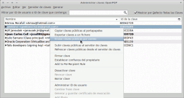](images/32-Enviar-claves-públicas.png)

Seleccionamos la clave que queremos exportar y presionamos el botón derecho del mouse. Como se puede ver en la captura de pantalla se desplegará un menú en el que tenemos las siguientes opciones:

**Copiar claves públicas al portapapeles:** Si elegimos esta opción nuestra clave pública se copiará en nuestro portapapeles y la podremos enviar por mail a quien queramos.

**Exportar claves a un fichero:** Si elegimos está opción nuestra clave pública se copiará en un archivo con extensión .asc que podremos proporcionar vía mail, pendrive, etc a quien queramos.

**Enviar Claves públicas por correo:** Si elegimos esta opción se creará un archivo .asc con nuestra clave pública y se adjuntará automáticamente en un mail que podremos enviar a nuestros contactos.

**Subir claves públicas al servidor de claves:** Si elegimos esta opción nuestra clave se subirá al servidor de claves que elijamos. De este modo cualquier persona que quiera enviarnos un mail cifrado o firmado podrá acceder al servidor y buscar nuestra clave.

## INFORMACIÓN QUE QUEDARÁ ALMACENADA EN LOS SERVIDORES DE GOOGLE

Como se puede ver en la captura de pantalla el contenido que tenemos almacenado en los servidores de google está completamente cifrado.

[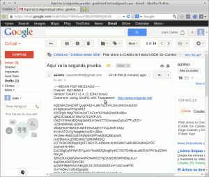](images/33-Lo-que-google-verá.png)

Por lo tanto podemos afirmar que google no podrá husmear en nuestro correo para según ellos ofrecer una publicidad adaptada a nuestros gustos y costumbres. Por lo tanto hemos comprobado que el cifrado y la firma aseguran la integridad de nuestros mensajes y nos proporcionan la privacidad que tanto estamos buscando.

###### Nota: Lo que digo para google es igualmente válido para el resto de servicios populares como pueden ser yahoo o hotmail.

## SEGURIDAD QUE NOS OFRECE EL TIPO DE CIFRADO QUE USAMOS

A día de hoy con la tecnología disponible **es prácticamente imposible romper el cifrado que hemos introducido en el mail** que acabamos de enviar.

Incluso **con la totalidad de ordenadores existentes en el mundo trabajando de forma simultanea para descifrar nuestro mail se puede decir que tardarían millones de años en conseguirlo**.

A pesar de todo es previsible que cuando existan los ordenadores cuánticos, mediante la aplicación del [algoritmo de Shor](http://es.wikipedia.org/wiki/Algoritmo_de_Shor "Explicación sobre el agoritmo de Shor"), se pueda descifrar fácilmente la encriptación que hemos introducido en nuestro mail. Afortunadamente aún quedan años para que esto pase.

Para quien tenga interés sobre este tema puede consultar el siguiente enlace:

[http://www.aunclicdelastic.com/el-ordenador-cuantico-la-piedra-filosofal-del-siglo-xxi/](http://www.aunclicdelastic.com/el-ordenador-cuantico-la-piedra-filosofal-del-siglo-xxi/ "Explicación relacionada con los ordenadores cuánticos")

Particularmente pienso que el enlace que acabo de proporcionar es un poco sensacionalista. Pero sin duda vale la pena leerlo.

## AYUDA PARA LAS PERSONAS QUE QUIERAN PROBAR EL MÉTODO DESCRITO

Cualquier persona que quiera hacer pruebas sobre el procedimiento de enviar mails cifrados y firmados me puede enviar un email a la siguiente dirección:

**geekland.hol.es"arroba"gmail.com**

Cuando reciba el email les responderé indicándoles si el proceso se ha realizado correctamente o no. Mi clave pública la encontrarán en los servidores que trae por defecto Enigmail.
