Acabo de llegar de viaje y necesito renombrar y clasificar mis fotos de forma rápida y adecuada en mi disco duro. Si disponemos del gestor de archivos Thunar y las fotos disponen de metadatos podemos conseguir nuestro propósito de forma fácil.<!--more-->

## REQUISITOS PARA PODER APLICAR EL CONTENIDO DEL TUTORIAL

Los requisitos necesarios para poder aplicar el método que verán a continuación son los siguientes:

1. Las fotos a clasificar tienen que disponer de metadatos. El metadato que usaremos para clasificar nuestras fotografías es la fecha y hora de disparo de la fotografía.
2. El gestor de archivos usado para renombrar y clasificar las fotografías tiene que ser Thunar.
3. El formato de las fotografías tiene que ser jpg o png. Desconozco si funciona en el formato de archivo .raw.

Una vez conocidos los requisitos podemos pasar a la acción.

## RENOMBRAR LAS FOTOGRAFÍAS DE FORMA COHERENTE

Los pasos que sigo para renombrar mis fotografías de forma adecuada son los que podéis ver a continuación.

### Añadir la fecha y hora de captura al nombre de la fotografía

En mi caso considero que una buena forma clasificar nuestras fotos es que su nombre contenga la fecha y la hora en que se tomo la fotografía.

Para ello abrimos Thunar y seleccionamos la totalidad de fotografías que queremos renombrar. Seguidamente presionamos la tecla F2, o si lo preferimos, presionamos el botón derecho del ratón y cuando aparezca el menú contextual clicamos en la opción Cambiar nombre.

[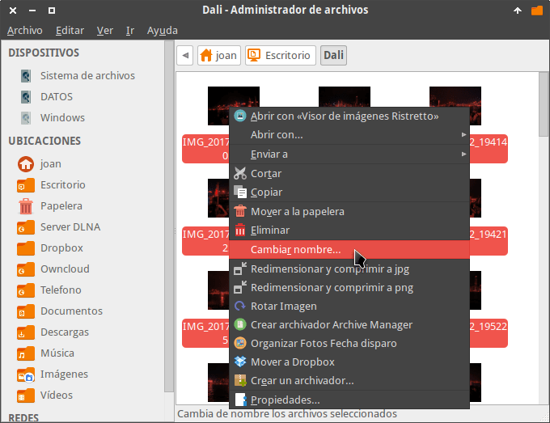](images/renombrar-lote-de-fotografias.png)

Finalmente aparecerá la ventana Cambia de nombre múltiples archivos en la que podremos insertar la fecha y hora en que tomamos la fotografía. Para ello:

1. En el campo **Tipo de transformación** seleccionamos Insertar fecha/hora.
2. En el desplegable **Insertar tiempo** seleccionamos la opción Fecha de captura de la foto.
3. Finalmente, si nos convencen los nuevos nombres que hemos creado presionamos el botón Cambiar de nombre archivos.

[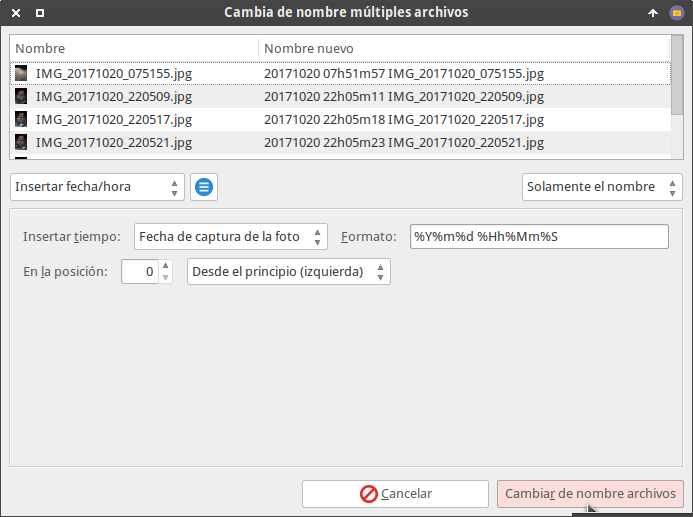](images/hora-y-fecha-captura-foto.png)

###### Nota: Otras opciones que teníamos disponibles eran seleccionar el formato de la fecha y la hora insertada, seleccionar la posición en que insertamos la fecha y la hora, etc.

Una vez realizados los cambios obtengo el siguiente resultado:

[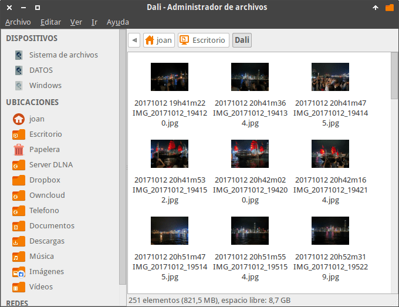](images/fecha-hora-disparo-insertada.png)

### Eliminar las partes de los nombres de las fotos que no nos gustan

Observaran que las fotos disponen de nombres del tipo mmexport o IMG. En mi caso prefiero eliminar este tipo de nombres procediendo del siguiente modo:

1. Con Thunar seleccionamos la totalidad de las fotos que queremos modificar su nombre.
2. A continuación presionamos la tecla F2, o si lo preferimos, presionamos el botón derecho del ratón y cuando aparezca el menú contextual clicamos en la opción Cambiar nombre.

Seguidamente aparecerá la pantalla de Cambia de nombre múltiples archivos en el que deberemos seleccionar las siguientes opciones:

[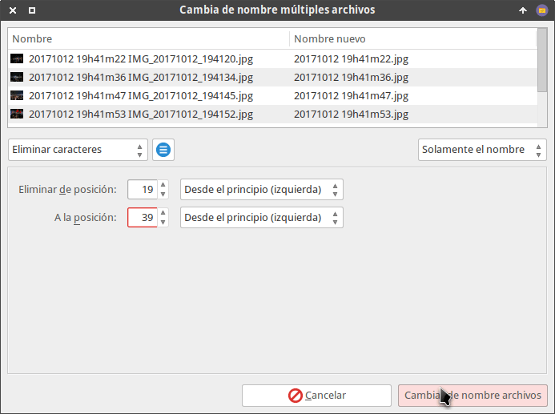](images/eliminar-partes-del-nombre.png)

1. En el campo **Tipo de transformación** seleccionamos Eliminar caracteres.
2. En el desplegable **Eliminar posición** seleccionamos el número de posición que queremos empezar a eliminar a partir de la izquierda.
3. A continuación, en el desplegable **A la posición** seleccionamos la última posición que queremos eliminar empezando a contar a partir de la izquierda.
4. Finalmente presionamos el botón Cambiar de nombre archivos. Al finalizar dispondremos de cientos de archivos en que su nombre será la fecha y hora de disparo de la fotografía.

[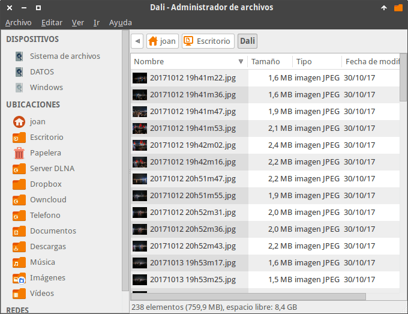](images/fotos-con-fecha-y-hora-de-disparo.png)

### Insertar un texto para ubicar donde capturamos las fotografías

Si quieren también podemos insertar el texto en el nombre de las fotografías. En mi caso acostumbro a insertar el lugar donde tome la fotografía. Para ello procedemos del siguiente modo:

1. Con Thunar seleccionamos la totalidad de fotos en que queremos insertar un texto determinado.
2. A continuación presionamos la tecla F2, o si lo preferimos, presionamos el botón derecho del ratón y cuando aparezca el menú contextual clicamos en la opción Cambiar nombre.

Al aparecer la ventana de Cambia de nombre múltiples archivos seleccionaré las siguientes opciones:

[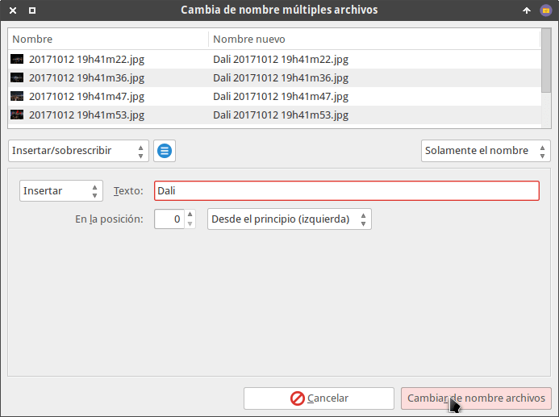](images/sitio-de-disparo-de-la-foto.png)

1. En el campo **Tipo de transformación** seleccionamos Insertar/sobrescribir.
2. En el siguiente desplegable seleccionamos la opción Insertar.
3. A continuación escribimos el nombre que queremos insertar que en mi caso es Dali.
4. A continuación seleccionamos la posición en que queremos insertar el nombre que en mi caso es a la izquierda empezando por la posición 0.
5. Finalmente presionamos el botón Cambiar de nombre archivos y los nombres de nuestras fotos quedarán del siguiente modo.

[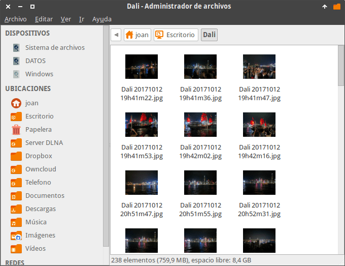](images/fotos-renombradas-segun-mi-criterio.png)

En estos momentos hemos renombrado la totalidad de nuestras fotos de forma lógica y coherente. Ahora tan solo nos falta clasificar cada una de los fotos en carpetas en función de la fecha en que se tomaron las fotografías.

###### Nota: Si lo precisan pueden consultar el siguiente enlace para obtener mas opciones para [modificar el nombre]() de sus fotos y sus archivos.

## CLASIFICAR Y ORGANIZAR NUESTRAS FOTOGRAFÍAS

Una vez renombradas nuestras fotografías las clasificaremos en carpetas de forma adecuada. Para ello seguiremos las siguientes instrucciones.

### Instalar Imagemagick

Para clasificar nuestras fotos tenemos que instalar el software imagemagick del siguiente modo:

Si usamos Debian o distribuciones derivadas de Debian abrimos una terminal y ejecutamos el siguiente comando:

> ```
> sudo apt-get install imagemagick
> ```

En el caso que seamos usuarios de Fedora o distros derivadas de Fedora tendremos que ejecutar el siguiente comando:

> ```
> sudo dnf install imagemagick
> ```

Si somos usuarios de opensuse ejecutaremos el siguiente comando en la terminal:

> ```
> sudo zypper in imagemagick
> ```

Finalmente, si somos usuarios de Arch o distros derivadas de Arch ejecutaremos el siguiente comando en la terminal:

> ```
> sudo pacman -Sy imagemagick
> ```

### Crear el script para clasificar nuestras fotos

A continuación crearemos el script que clasificará nuestras fotografías en función de la fecha en que se tomaron.

Inicialmente crearemos la carpeta que contendrá el script ejecutando el siguiente comando en la terminal:

> ```
> mkdir ~/.config/Thunar/custom_Actions
> ```

Seguidamente creamos el fichero que contendrá el código del script ejecutando el siguiente comando en la terminal:

> ```
> nano ~/.config/Thunar/custom_Actions/organize_shot
> ```

En el momento que se abra el editor de textos pegamos el siguiente código:

|   ``` #!/bin/sh    for fil in "$@"  do  datepath="$(identify -verbose “$fil” \| grep DateTimeOri \| awk '{print $2 }' \| sed s%:%-%g)"  if ! test -e "$datepath"; then  mkdir -pv "$datepath"  fi    mv -v “$fil” $datepath  Done ```   |
| --- |

Finalmente guardamos los cambios y cerramos el fichero que contiene el script.

### Dar permisos de ejecución al script para para clasificar nuestras fotos

Para dar permisos de ejecución al script que acabamos de crear tenemos que ejecutar el siguiente comando en la terminal:

> ```
> chmod +x ~/.config/Thunar/custom_Actions/organize_shot
> ```

###### Nota: El comando anterior tendrá que ser adaptado en función de la ruta donde tenemos guardado el script.

### Crear una acción personalizada para ejecutar el script en Thunar

Abrimos el gestor de archivos Thunar, accedemos al menú Editar y clicamos en la opción Configurar acciones personalizadas…

[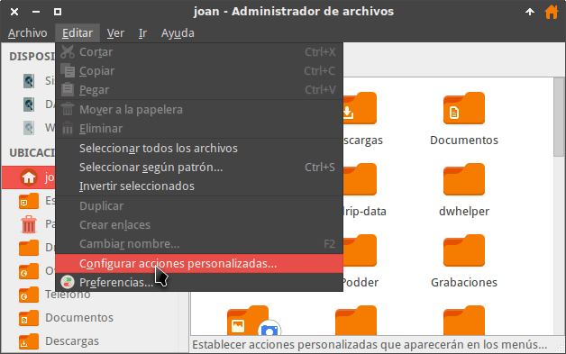](images/Configurar-una-acción-personalizada.png)

A continuación clicamos encima del botón + para Añadir una acción personalizada.

[](images/Añadir-nueva-acción-personalizada.png)

Seguidamente aparecerá la ventana Editar acción en la que deberemos configurar la acción personalizada.

[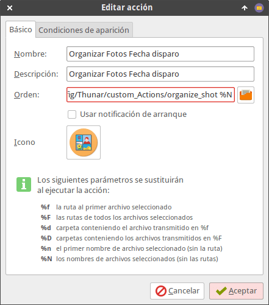](images/definir-la-accion-personalizada.png)

En los campos de la ventana Editar acción introducimos los siguientes valores:

**Campo Nombre:** Introducimos el nombre que queremos que aparezca en el menú contextual de Thunar. En mi caso elijo el siguiente:

> ```
> Clasificar fotos fecha disparo
> ```

**Campo Descripción:** Simplemente tenemos que escribir una descripción de lo que hace nuestra acción personalizada. En mi caso uso la siguiente descripción:

> ```
> Clasificar fotos por fecha de disparo
> ```

**Campo Orden:** Tenemos que introducir el comando para que se pueda ejecutar el script seguido de %N. Por lo tanto tenemos que introducir la siguiente orden:

> ```
> /home/joan/.config/Thunar/custom_Actions/organize_shot %N
> ```

###### Nota: Tendréis que adaptar la orden para ejecutar el script en función de la ruta donde tenéis guardado el script.

###### Nota: La ruta del script tiene que finalizar con %N para que podamos clasificar las fotografías en lotes.

**Campo Icono:** Si queremos podemos clicar encima del botón Sin icono. Si lo hacemos aparecerá una ventana en la que podremos seleccionar un icono para la acción personalizada que estamos creando.

Finalmente clicamos en la pestaña Condiciones de aparición. En esta pestaña modificamos los siguientes aspectos:

1. Destildamos la opción Archivos de texto.
2. Tildamos la opción Archivos de imagen.

[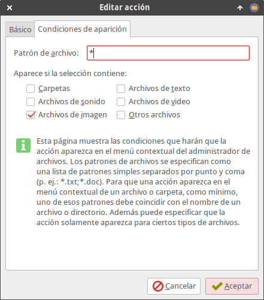](images/condiciones-aparacion-accion-personalizada.png)

Finalmente el proceso ha terminado. Ahora tan solo tenemos que presionar encima del botón Aceptar.

### Clasificar las fotos en carpetas en función de su fecha de captura

Una vez finalizado el trabajo tan solo tenemos que realizar los siguientes pasos para clasificar las fotos:

1. Seleccionar las fotos que queremos clasificar.
2. Una vez seleccionadas presionamos el botón derecho del mouse y cuando aparezca el menú contextual clicamos encima de la opción Clasificar Fotos Fecha disparo.

[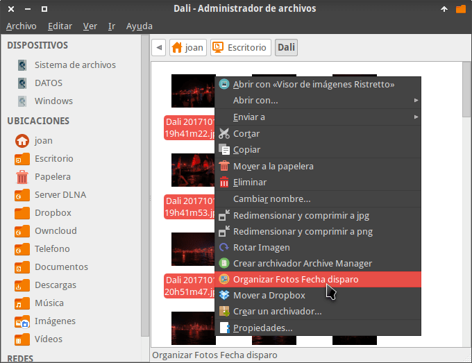](images/clasificar-fotos-fecha-disparo.png)

Al ejecutar la acción personalizada verán que nuestras fotos se clasificarán dentro de carpetas en función de la fecha en que tomamos cada una de las fotografías. En mi caso el resultado final es el siguiente:

[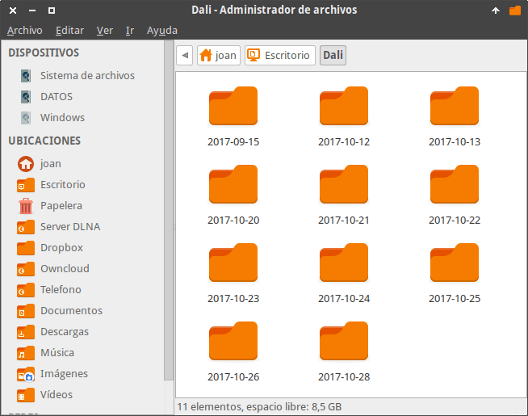](images/fotos-organizadas-fecha-disparo.png)

[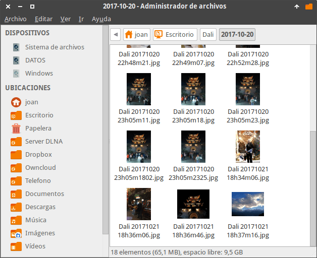](images/fotos-clasificadas-correctamente.png)

De esta forma podemos renombrar y clasificar grandes volúmenes de fotos de forma práctica, rápida y sin realizar ningún esfuerzo.

## SUBIR LAS FOTOS A GOOGLE FOTOS O CUALQUIER OTRA PLATAFORMA

Como último paso podemos subir las fotos a servicios en la nube como por ejemplo Google fotos. En el caso de subir las fotos a Google Fotos les recomiendo que tengan muy en cuenta las opciones de privacidad del servicio y calidad en que subimos las fotos.

[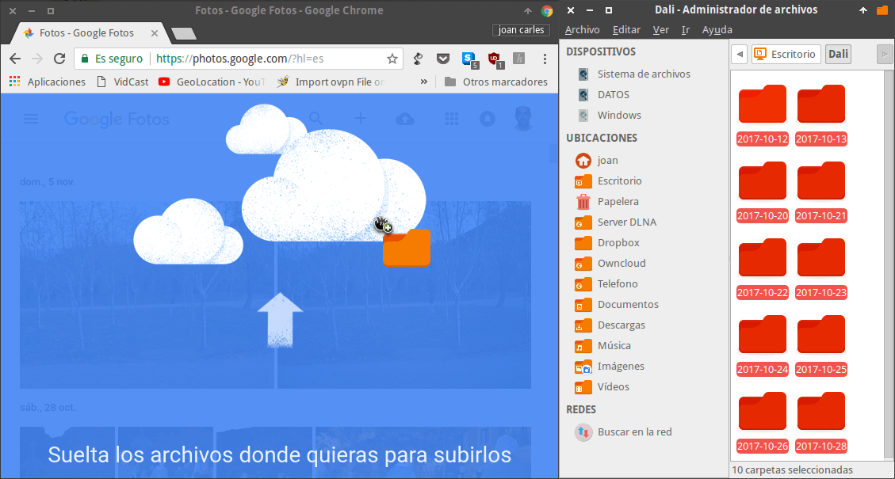](images/subir-fotos-google-fotos.png)

De este modo siempre dispondremos de una copia de seguridad y en caso que sea necesario podremos ahorrar espacio en disco de nuestro dispositivos.
