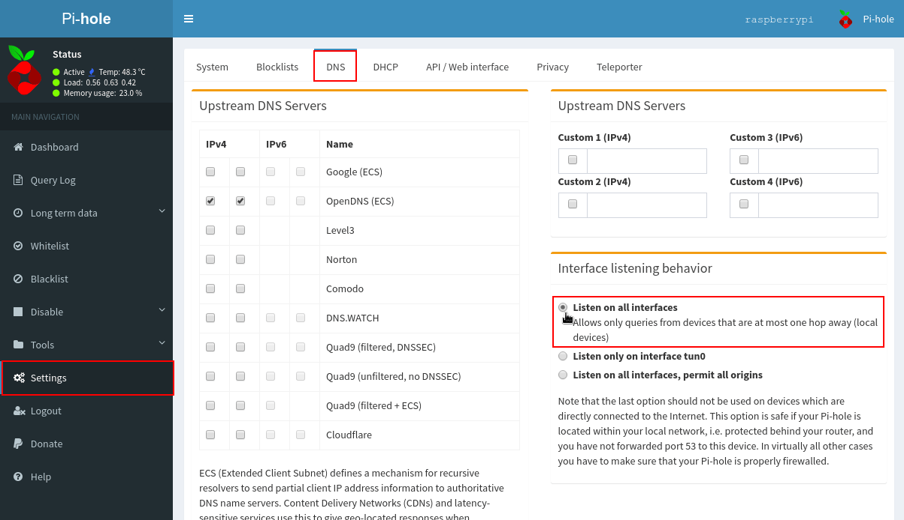

En su día detallamos el procedimiento para instalar Pi-hole y bloquear la publicidad de todos los dispositivos conectados a nuestra red local. Incluso dispositivos Android sin root y iOS sin jailbreak. El problema de Pi-Hole es que solo bloquea la publicidad a nivel de red local. Si queremos bloquear la publicidad cuando estamos fuera de nuestra casa tendremos que combinar Pi-hole con OpenVPN.<!--more-->

A continuación veremos el modo de combinar Pi-Hole y OpenVPN para conseguir los siguientes objetivos fuera de nuestra red local:

1. **Bloquear los anuncios** estemos donde estemos.
2. **Mejorar la privacidad** mientras navegamos. Pi-hole también es capaz de bloquear las cookies y botones sociales que acostumbran a trackearnos.
3. **Ahorrar datos** mediante el bloqueo de la publicidad. No hace falta recordar que los anuncios molestan y además consumen nuestros datos.
4. **Mejorar la seguridad** de navegación. En algunos casos los anuncios representan una amenaza contra la seguridad de los usuarios.

###### Nota: La totalidad de pasos mencionados en el artículo se han realizado en una Raspberry Pi. No obstante el procedimiento debería ser el mismo o prácticamente el mismo en distribuciones basadas en Debian.

## INSTALAR OPENVPN A TRAVÉS DE PIVPN Y PODERNOS CONECTAR A NUESTRA RED LOCAL

En su día detallamos el procedimiento para instalar y configurar OpenVPN en nuestra Raspberry Pi. Por lo tanto les dejo el siguiente enlace para que instalen y configuren OpenVPN en su equipo.

https://geekland.eu/instalar-servidor-openvpn-raspberry-pivpn/

## INSTALAR PI-HOLE PARA RESOLVER PETICIONES DNS Y BLOQUEAR LOS ANUNCIOS

En el pasado también vimos el procedimiento para instalar y configurar Pi-Hole. Por lo tanto les dejo el siguiente enlace para que puedan instalar y configurar Pi-Hole:

https://geekland.eu/instalar-configurar-pi-hole-raspberry-pi/

## COMBINAR OPENVPN Y PI-HOLE PARA BLOQUEAR LA PUBLICIDAD FUERA DE NUESTRA RED LOCAL

Cuando tengamos Pi-Hole y OpenVPN operativos los configuraremos para que trabajen de forma conjunta. Para ello seguiremos las siguientes instrucciones.

### Averiguar la interfaz de red de su Raspberry Pi o equipo

Necesitamos conocer la interfaz de red que está usando nuestra Raspberry Pi o equipo con Linux. Para ello ejecutaremos el siguiente comando en la terminal:

> ```
> ifconfig -s
> ```

El resultado obtenido en mi caso es el siguiente:

| Iface MTU Met RX-OK RX-ERR RX-DRP RX-OVR TX-OK TX-ERR TX-DRP TX-OVR Flg enxb827eb817a9d  1500    0 0 0 0 0 0 0 0 0 BMU lo                             65536  0 31447 0 0 0 31447 0 0 0 LRU tun0                         1500   0 7712 0 0 0 42743 0 0 0 MOPRU wlan0                       1500   0 167992 0 0 0 157278 0 0 0 BMRU |
| :-- |

La interfaz **tun0** corresponde a la del **servidor VPN** y la **lo** “Loopback” a nuestra **red local**. Por lo tanto mi Raspberry Pi está usando la interfaz **wlan0**. En el caso que tengan su equipo conectado por cable tendrán una interfaz diferente de wlan0.

### Averiguar la el rango de red e IP del servidor OpenVPN

A continuación averiguaremos el rango de red de la interfaz tun0. Para ello ejecutamos le siguiente comando en la terminal:

> ```
> ip a show dev tun0
> ```

Los valores obtenidos en mi caso son:

| 4: tun0: <POINTOPOINT,MULTICAST,NOARP,UP,LOWER\_UP> mtu 1500 qdisc pfifo\_fast state UNKNOWN group default qlen 100 link/none inet 10.8.0.1/24 brd 10.8.0.255 scope global tun0 valid\_lft forever preferred\_lft forever inet6 fe80::9591:9316:b25b:fee3/64 scope link flags 800 valid\_lft forever preferred\_lft forever |
| :-- |

El rango de red es 10.8.0.1/24. Y el valor que debo anotar para futuras configuraciones es **10.8.0.1**. 10.8.0.1 es la IP de nuestro servidor OpenVPN.

### Configurar OpenVPN para que use Pi-Hole como servidor DNS

Configuraremos OpenVPN para que use Pi-Hole como servidor DNS. De este modo, cuando nos conectemos a través de nuestro VPN se bloquearán la totalidad de anuncios. Para ello accedemos al fichero de configuración del servidor OpenVPN ejecutando el siguiente comando en la terminal:

> ```
> sudo nano /etc/openvpn/server.conf
> ```

Una vez se abra el fichero de texto comentaremos la totalidad de líneas que empiezan por:

> ```
> push "dhcp-option DNS ********
> ```

En mi caso he comentado las siguientes lineas:

> ```
> #push "dhcp-option DNS 8.8.8.8"
> #push "dhcp-option DNS 8.8.4.4"
> ```

Acto seguido añadiremos la siguiente línea:

> ```
> push "dhcp-option DNS 10.8.0.1"
> ```

Donde 10.8.0.1 corresponde a la IP del servidor VPN que hemos hallado en el apartado anterior. Realizando esta configuración conseguiremos que las peticiones DNS a través del servidor OpenVPN sean resueltas por Pi-Hole.

Una vez realizadas las modificaciones guardamos los cambios y cerramos el fichero.

### Configurar Pi-Hole para que pueda escuchar la interfaz tun0

Para que Pi-Hole pueda resolver las peticiones provenientes del servidor OpenVPN tendrá que escuchar la interfaz del servidor OpenVPN tun0. Para ello accedemos al fichero de configuración setupVars.conf ejecutando el siguiente comando en la terminal:

> ```
> sudo nano /etc/pihole/setupVars.conf
> ```

Una vez se abra el editor de textos localizamos una línea del siguiente tipo:

> ```
> PIHOLE_INTERFACE=*****
> ```

Justo por debajo de esta linea añadimos la siguiente:

> ```
> PIHOLE_INTERFACE=tun0
> ```

Una vez realizadas las modificaciones guardamos los cambios y cerramos el fichero.

Acto seguido crearemos el fichero 02-ovpn.conf ejecutando el siguiente comando en la terminal:

> ```
> sudo nano /etc/dnsmasq.d/02-ovpn.conf
> ```

Una vez se abra el editor de texto pegaremos el siguiente código:

> ```
> interface=tun0
> interface=wlan0
> ```

###### Nota: tun0 corresponde a la interfaz de red del servidor VPN. wlan0 corresponde a la interfaz de red de nuestra Raspberry Pi. Ambos valores se han hallado en apartados anteriores.

A continuación guardaremos los cambios y cerraremos el fichero.

Finalmente accedemos a la interfaz web de Pi-Hole y en el apartado de Settings clicamos la pestaña DNS. Acto seguido tildamos la opción Listen on all interfaces.

[](images/escuchar-todas-las-interfaces-pihole.png) Finalmente tan solo tendremos que presionar en el botón SAVE para guardar los cambios.

### Configuración del Firewall de nuestra Raspbery Pi o equipo

En el caso que tengan configurado el Firewall de su Raspberry Pi o sistema operativo Linux aseguren que tener las reglas correctas. En el caso de usar Iptables es preciso que apliquéis las siguientes reglas:

> ```
> #Peticiones DNS a traves de VPN
> iptables -A INPUT -p udp --dport 53 -j ACCEPT
> 
> # Abro el puerto para que me pueda conectar al servidor VPN
> iptables -A INPUT -p udp --dport 1194 -j ACCEPT
> ```

Donde 53 y 1194 corresponden a los puertos estándar usados para resolver las peticiones DNS y conectarnos al servidor OpenVPN. En caso que no uséis puertos estándar deberéis modificar los valores 53 y 1194.

Finalmente reiniciamos la Raspberry Pi u equipo con Linux ejecutando el siguiente comando en la terminal:

> ```
> sudo reboot
> ```

###### Nota: Si el servidor OpenVPN lo tenéis ubicado en vuestra casa es necesario que abráis el puerto correspondiente en el router.

## COMPROBAR QUE LA PUBLICIDAD SE ESTÉ BLOQUEANDO FUERA DE NUESTRA RED LOCAL

Para comprobar la efectividad de la configuración que acabamos de aplicar tenemos que entrar en una página web que tenga publicidad. En mi caso la siguiente:

[](images/web-con-anuncios.jpg)

Acto seguido nos conectamos a nuestro servidor VPN. Una vez conectados al servidor VPN volvemos a recargar la misma web. Si todo funciona bien verán que se bloquea la totalidad de publicidad que se mostraba anteriormente.

[](images/web-sin-anuncios.jpg)

## INCONVENIENTES DE COMBINAR PI-HOLE CON OPENVPN

Sin duda alguna se trata de una solución óptima para bloquear la publicidad en dispositivos móviles que no tienen acceso root ni jailbreak. No obstante está solución tiene los siguientes inconvenientes:

1. Al estar conectados a través de una red OpenVPN el **consumo de batería** de nuestro dispositivo móvil será mayor.
2. La velocidad de **conexión será más lenta**. Cuanto más buena sea la conexión de internet de nuestro domicilio, mejor rendimiento obtendremos. Si tenemos una fibra de 10MB simétricos el rendimiento será aceptable y si disponemos de 100MB el rendimiento será excelente.
