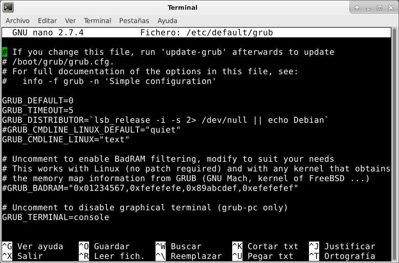

Existen ocasiones que nos puede interesar arrancar en modo consola nuestro ordenador. Ejemplos de algunas situaciones pueden ser los siguientes:

1. En el caso que puntualmente decidiéramos usar nuestro ordenador de sobremesa como un servidor.
2. En el caso de disponer de una Raspberry que es usada como servidor y entorno de escritorio.
3. Para intentar reparar algún problema relacionado con el entorno gráfico de nuestro equipo.
4. Etc.

<!--more-->

## ARRANCAR CUALQUIER DISTRIBUCIÓN LINUX EN MODO CONSOLA

Para que nuestro ordenador arranque en modo consola y evitar que se cargue el entorno gráfico tenemos que seguir las siguientes instrucciones:

### Realizar una copia de seguridad de /etc/default/grub

Para conseguir arrancar en modo consola modificaremos el contenido del fichero /etc/default/grub. Por lo tanto es recomendable que realicemos una copia de seguridad del fichero ejecutando el siguiente comando en la terminal:

> ```
> sudo cp -n /etc/default/grub /etc/default/grub.bak
> ```

A continuación ya podremos editar el fichero /etc/default/grub ejecutando el siguiente comando en la terminal:

> ```
> nano /etc/default/grub
> ```

### Deshabilitar la pantalla de inicio

Una vez se habrá el archivo /etc/default/grub deshabilitaremos la [pantalla de inicio](https://en.wikipedia.org/wiki/Splash_screen "Explicación de lo que es la pantalla de inicio en una distro Linux") (splash screen) en el arranque del sistema. Para ello deberemos buscar la línea que empieza por el siguiente contenido:

> ```
> GRUB_CMDLINE_LINUX_DEFAULT=”
> ```

Una vez encontrada la comentamos añadiendo el símbolo # al inicio de la línea:

> ```
> #GRUB_CMDLINE_LINUX_DEFAULT=”
> ```

De este modo, durante el arranque y el apagado iremos viendo como se habilita o deshabilita servicio por servicio.

### Hacer que nuestra distribución arranque en modo consola

El siguiente paso consiste en que nuestra distribución arranque en modo consola. Para ello dentro del archivo /etc/default/grub buscamos la siguiente línea:

> ```
> GRUB_CMDLINE_LINUX=""
> ```

Una vez encontrada la modificamos de forma que quede de la siguiente forma:

> ```
> GRUB_CMDLINE_LINUX="text"
> ```

### Hacer que el Grub se muestre sin ningún tipo de decoración

Para que el grub arranque sin ninguna imagen de fondo y con la apariencia que tendría un servidor, dentro del archivo /etc/default/grub buscamos la siguiente línea:

> ```
> #GRUB_TERMINAL=console
> ```

Una vez encontrada la descomentamos para que quede de la siguiente forma:

> ```
> GRUB_TERMINAL=console
> ```

Cuando hayamos finalizado las mordicaciones el fichero /etc/default/grub quedará de la siguiente forma:

[](images/configuracion-del-grub-modo-consola.png)

Ahora tan solo tenemos que guardar los cambios y cerrar el fichero.

### Activar el target multi-user en el caso que usemos Systemd

Este apartado solo se debe seguir en el caso que nuestra distribución utilice systemd.

En la actualidad la gran mayoría de distros usan systemd. Si quieren confirmar que su distribución tiene el sistema de inicio systemd deben abrir una terminal y ejecutar el siguiente comando:

> ```
> systemd --version
> ```

Si el comando les muestra una salida parecida a la siguiente es que disponen de systemd.

| joan@debian:~$ systemd --version systemd 234 +PAM +AUDIT +SELINUX +IMA +APPARMOR +SMACK +SYSVINIT +UTMP +LIBCRYPTSETUP +GCRYPT +GNUTLS +ACL +XZ +LZ4 +SECCOMP +BLKID +ELFUTILS +KMOD -IDN2 +IDN default-hierarchy=hybrid |
| :-- |

Una vez estamos seguros que nuestra sistema operativo usa systemd activaremos el modo target multi-user. Para ello ejecutaremos el siguiente comando en la terminal:

> ```
> sudo systemctl set-default multi-user.target
> ```

De este modo estamos diciendo al sistema de inicio que queremos arrancar nuestro sistema operativo del siguiente modo:

1. Sin que disponga de interfaz gráfica.
2. En modo multiusario.
3. Que los usuarios puedan acceder al sistema mediante consolas o a través de la red.

### Actualizar el grub

Para que los cambios se apliquen en el próximo arranque debemos actualizar la configuración del grub. Para ello ejecutamos el siguiente comando en la terminal:

> ```
> sudo update-grub
> ```

En estos momentos, la próxima vez que arranquemos el ordenador lo hará en modo consola y por lo tanto no se activará el servidor de las X.

Una vez hayamos iniciado en modo consola podremos arrancar el entorno gráfico ejecutando el siguiente comando en la terminal:

> ```
> startx
> ```

## REVERTIR LOS CAMBIOS REALIZADOS

Si llega el día en que ya no es necesario arrancar en modo consola podemos revertir los cambios muy fácilmente.

El primer paso es deshacer los cambios realizados en el fichero /etc/default/grub. Como en el inicio del artículo realizamos una copia de seguridad del fichero, desharemos los cambios ejecutando el siguiente comando en la terminal:

> ```
> sudo mv /etc/default/grub.bak /etc/default/grub && sudo update-grub
> ```

Finalmente, en el caso que estemos usando systemd tendremos que activar el target graphical. Para ello ejecutamos el siguiente comando en la terminal:

> ```
> sudo systemctl set-default graphical.target
> ```

Aplicando estos simples comandos, la próxima vez que arranquemos el ordenador lo volverá a realizar de forma habitual.
