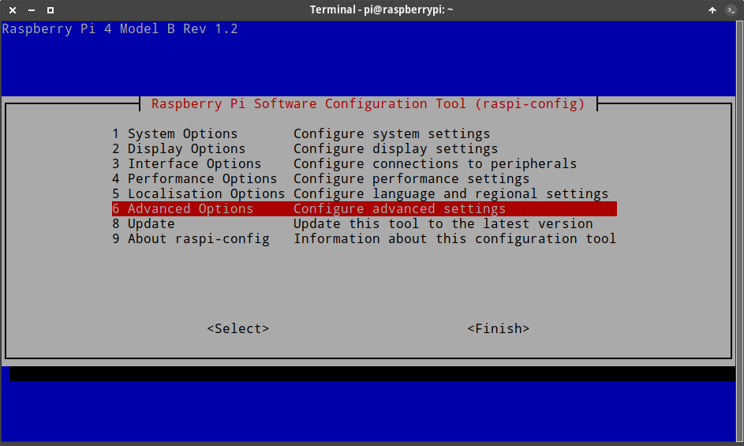
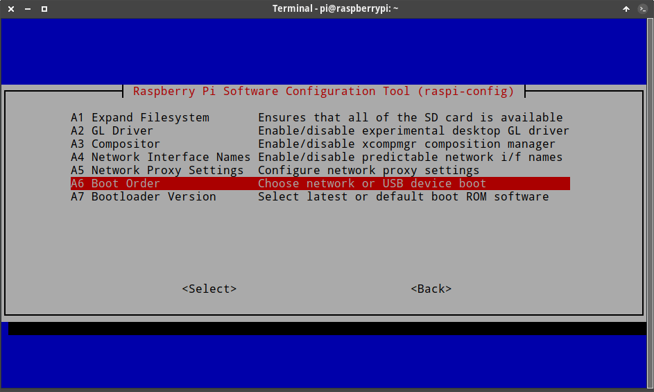
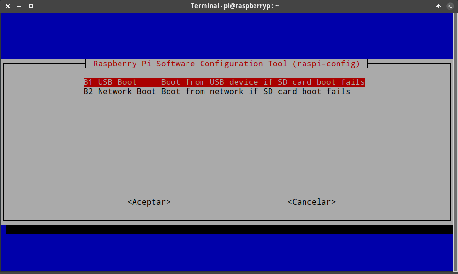
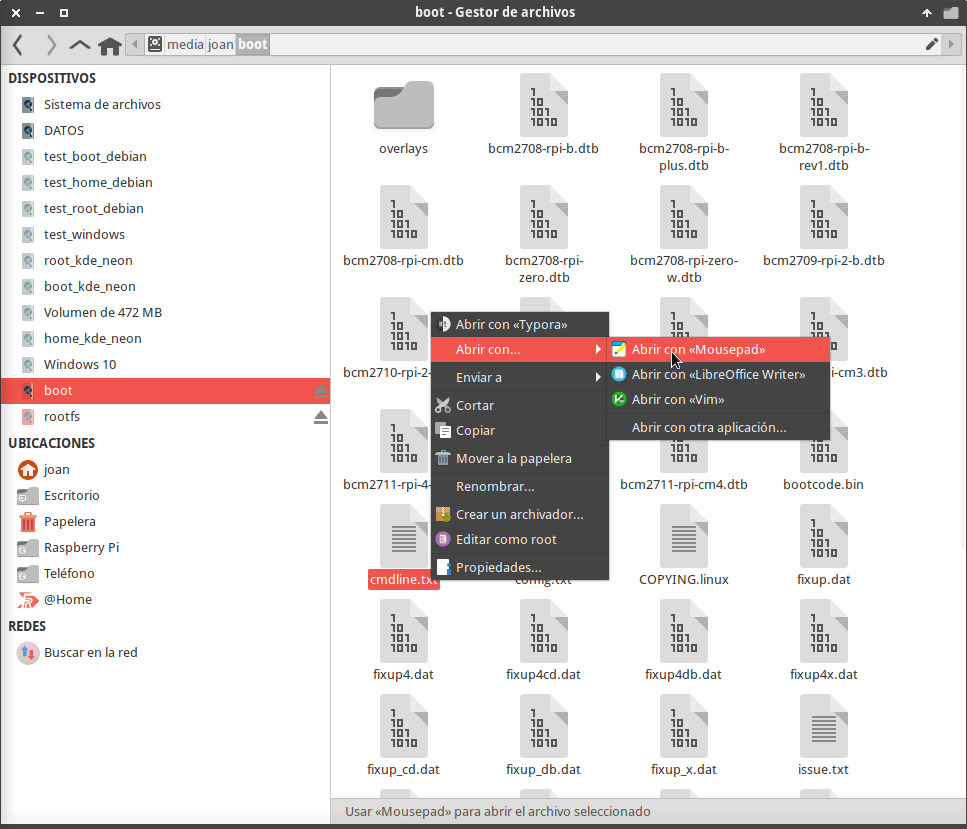
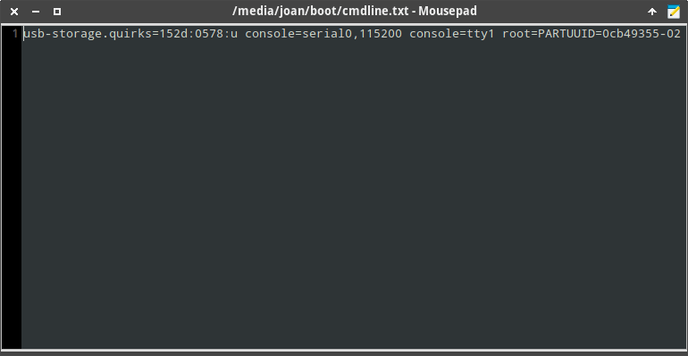

A día de hoy arrancar la Raspberry Pi 4 a través de una unidad de almacenamiento SSD es fácil gracias a su último firmware estable. Para ello no tenemos que hacer nada especial. Simplemente tenemos que quemar la imagen de Raspbian OS en la unidad de almacenamiento SSD, enchufarla a la Raspberry Pi y encenderla. No obstante detallaremos el procedimiento y que podemos hacer en el caso que se presenten problemas durante el proceso.<!--more-->

**Nota**: Si la Raspberry Pi no arranca con la unidad SSD posiblemente sea culpa del adaptador SATA - USB. La Raspberry Pi no se lleva bien con algunos tipos de adaptadores, por lo tanto les recomiendo que compren las unidades SSD y carcasas recomendadas en este artículo. Si compran otras opciones no mencionadas en el artículo miren por Internet para ver si se pueden generar problemas.

## MATERIAL NECESARIO PARA ARRANCAR LA RASPBERRY PI A TRAVÉS DE UNA UNIDAD DE ALMACENAMIENTO SSD

Lo único que necesitaremos es:

1. **Una unidad de almacenamiento SSD**. En mi caso [os recomiendo la compra de la unidad Kingston A400](https://amzn.to/2M2YVJq). Es la unidad SSD que uso y según mi experiencia y lo que he podido leer por la red funciona bien y es una solución relativamente económica.
2. **Una carcasa de disco duro con el correspondiente adaptador de SATA a USB 3.0 o simplemente un adaptador de SATA a USB 3.0**. En mi caso he comprado [esta referencia](https://www.amazon.es/gp/product/B00KW4T69A/ref=ppx_yo_dt_b_asin_title_o00_s00?ie=UTF8&psc=1), pero no recomiendo su compra porque no funciona out of the box. La opción ideal seria comprar un adaptador [StarTech StarTech USB 3.0 a 2.5″ SATA](https://amzn.to/3rvwvrI).

Algunas combinaciones de dispositivos de almacenamiento y adaptadores/carcasas funcionan son las siguientes:

| Combinación | Modelo SSD con link de compra | Modelo adaptador con link de compra |
| --- | --- | --- |
| 1 | [Kingston A400 SSD SA400S37/240G](https://www.amazon.es/gp/product/B01N5IB20Q/ref=as_li_tl?ie=UTF8&camp=3638&creative=24630&creativeASIN=B01N5IB20Q&linkCode=as2&tag=jayc202080-21&linkId=b8a31ea9b2355b2ef33546ae573b36de) | [StarTech StarTech USB 3.0 a 2.5″ SATA](https://www.amazon.es/gp/product/B00HJZJI84/ref=as_li_tl?ie=UTF8&camp=3638&creative=24630&creativeASIN=B00HJZJI84&linkCode=as2&tag=jayc202080-21&linkId=b438a50c96b3b0236f1c10ac10581733) |
| 3 | [Crucial MX500 250GB](https://www.amazon.es/gp/product/B0764WCXCV/ref=as_li_tl?ie=UTF8&camp=3638&creative=24630&creativeASIN=B0764WCXCV&linkCode=as2&tag=jayc202080-21&linkId=a80d463527802b8123e6995b48ce27bb) | [ELUTENG 2.5″ SATA a USB 3.0](https://www.amazon.es/gp/product/B06XCV1W97/ref=as_li_tl?ie=UTF8&camp=3638&creative=24630&creativeASIN=B06XCV1W97&linkCode=as2&tag=jayc202080-21&linkId=a382ea5b4b70f2c2c8066f58d07a2502) |
| 4 | [Crucial MX500 250GB](https://www.amazon.es/gp/product/B0764WCXCV/ref=as_li_tl?ie=UTF8&camp=3638&creative=24630&creativeASIN=B0764WCXCV&linkCode=as2&tag=jayc202080-21&linkId=a80d463527802b8123e6995b48ce27bb) | [StarTech StarTech USB 3.0 a 2.5″ SATA](https://www.amazon.es/gp/product/B00HJZJI84/ref=as_li_tl?ie=UTF8&camp=3638&creative=24630&creativeASIN=B00HJZJI84&linkCode=as2&tag=jayc202080-21&linkId=b438a50c96b3b0236f1c10ac10581733) |
| 5 | [Crucial BX500 120 GB CT120BX500SSD1(Z)](https://www.amazon.es/gp/product/B07G3L3DRK/ref=as_li_tl?ie=UTF8&camp=3638&creative=24630&creativeASIN=B07G3L3DRK&linkCode=as2&tag=jayc202080-21&linkId=27caff4225e5342933d2b2f0b02aa417) | [ELUTENG 2.5″ SATA a USB 3.0](https://www.amazon.es/gp/product/B06XCV1W97/ref=as_li_tl?ie=UTF8&camp=3638&creative=24630&creativeASIN=B06XCV1W97&linkCode=as2&tag=jayc202080-21&linkId=a382ea5b4b70f2c2c8066f58d07a2502) |
| 6 | [Samsung 860 EVO MZ-76E250B/EU](https://www.amazon.es/gp/product/B078WQJXNF/ref=as_li_tl?ie=UTF8&camp=3638&creative=24630&creativeASIN=B078WQJXNF&linkCode=as2&tag=jayc202080-21&linkId=e0c3ed227e46b7a70cccff46df457097) | [UGREEN Caja Disco Duro Externo 2.5"](https://www.amazon.es/gp/product/B07D2BHVBD/ref=as_li_tl?ie=UTF8&camp=3638&creative=24630&creativeASIN=B07D2BHVBD&linkCode=as2&tag=jayc202080-21&linkId=dedaab3599033b50ec27ecee09872632) |

**Nota**: Si tienen otras opciones que pueden garantizar que funcionan sin deshabilitar UASP por favor informen en los comentarios del artículo. **Nota**: En mi caso recomendaría encarecidamente la combinación 1. Es una opción económica, que funciona y que da buenos resultados en los benchmark.

## ASEGURAR QUE LA RASPBERRY PI ESTA CONFIGURADA PARA ARRANCAR A TRAVÉS DE LA UNIDAD SSD

Arrancamos la Raspberry Pi a través de la tradicional tarjeta MicroSD. Una vez arrancada actualizan el sistema operativo ejecutando los siguientes comandos en la terminal:

> ```shell
> sudo apt update
> sudo apt full-upgrade
> ```

Una vez ejecutada la actualización les recomiendo que reinicien el equipo mediante el comando:

> ```shell
> sudo reboot
> ```

A continuación ejecutamos el siguiente comando para instalar la última versión del bootloader y del firmware. En el más que probable caso que ya tengan las últimas versiones el comando no hará nada.

> ```shell
> pi@raspberrypi:~ $ sudo rpi-eeprom-update -d -a
> BCM2711 detected
> Dedicated VL805 EEPROM detected
> BOOTLOADER: up-to-date
> CURRENT: jue sep  3 12:11:43 UTC 2020 (1599135103)
>  LATEST: jue sep  3 12:11:43 UTC 2020 (1599135103)
>  FW DIR: /lib/firmware/raspberrypi/bootloader/critical
> VL805: up-to-date
> CURRENT: 000138a1
> LATEST: 000138a1
> ```

**Nota:** Si vemos la salida del comando podemos confirmar que tenemos instalada la última versión del firmware y del bootloader. Si tenéis esta versión, o una versión más actual, la Raspberry Pi debe arrancar desde una unidad SSD sin ningún tipo de problema.

Ahora de nuevo volvemos a reiniciar la Raspberry Pi. Una vez reiniciada tecleamos el siguiente comando en la terminal:

> **`sudo raspi-config`**

Cuando aparezca el menú de configuración seleccionamos la opción `6 Advanced options`

[](images/opciones-avanzadas-configuracion-raspbian.png)

Seguidamente en la segunda pantalla nos posicionamos en la opción `A6 Boot Order` y presionamos Enter.

[](images/modificar-dispositivo-arranque.png)

Finalmente seleccionamos la opción `B1 USB Boot` y presionamos Enter. De esta forma si no hay la tarjeta MicroSD insertada en la Raspberry se intentará arrancar des de la unidad de almacenamiento SSD.

[](images/hacer-que-rapberry-pi-4-arranque-por-SSD.png)

## QUEMAR EL SISTEMA OPERATIVO A LA UNIDAD DE ALMACENAMIENTO SSD

Una vez configurada la Raspberry Pi 4 ya pueden quemar el sistema operativo en la unidad SSD. Lo pueden realizar usando Raspberry Pi Imager siguiendo las instrucciones que les dejo en el siguiente enlace:

https://geeklandlinux.github.io/posts/instalar-raspbian-con-raspberry-pi-imager/

 **Nota**: Si pretenden arrancar Raspbian desde una unidad SSD les recomiendo que usen Raspbian OS. Es posible que otras distribuciones den problemas al arrancar desde la unidad SSD. Otro sistema alternativo a Raspbian que debería arrancar desde la unidad SSD es Ubuntu 20.10.

## CONECTAR LA UNIDAD DE ALMACENAMIENTO SSD Y ARRANCAR LA RASPBERRY PI

Con el sistema operativo quemado en la unidad SSD ha llegado la hora de la verdad. Para arrancar la Raspberry Pi con la unidad SSD seguiremos las siguientes instrucciones:

1. Apagaremos y desenchufaremos la Raspberry Pi.
2. Sacaremos la tarjeta MicroSD y todos los dispositivos de almacenamiento que tengamos en la Raspberry Pi.
3. Conectaremos la unidad de almacenamiento SSD en la Raspberry Pi. La unidad de almacenamiento SSD la tenéis que conectar a los puertos USB 3.0. Los puertos USB 3.0 son los que son de color azul. De esta forma obtendremos mayor rendimiento.
4. Finalmente arrancaremos la Raspberry Pi.

Si estáis usando un adaptador SATA a USB que no genera conflictos con la Raspberry Pi y una unidad de almacenamiento adecuada todo debería funcionar perfectamente. En el caso que tengan problemas de rendimiento o que la Raspberry no arranque pueden intentar lo siguiente.

**Nota**: Si queréis arrancar la Raspberry pi con varias unidades de almacenamiento conectadas deberéis indicar el orden de prioridad de arranque en el fichero `/etc/fstab`. De este modo la Raspberry Pi tendrá claro con el dispositivo de almacenamiento que tiene que realizar el arranque.

## ¿QUÉ PODEMOS HACER SI LA RASPBERRY PI NO ARRANCA CUANDO CONECTAMOS LA UNIDAD DE ALMACENAMIENTO SSD?

Si la Raspberry no arranca, da problemas o tiene un rendimiento malo posiblemente sea por el adaptador SATA a USB. Si se da el caso una solución que a mi me han funcionado ha sido deshabilitar el [modo UAS](https://raspberryparatorpes.net/compras/uasp-aprovechar-al-maximo-discos-usb/). Deshabilitando el modo UAS o UASP hará que el rendimiento sea un poco peor, pero aún y así el rendimiento y estabilidad obtenidos seguirá siendo infinitamente superior al de una tarjeta MicroSD.

Para deshabilitar UASP tenemos que averiguar el id de nuestro adaptador SATA a USB. Para ello enchufaremos la unidad SSD a un equipo con Linux o en la Raspberry Pi y ejecutaremos el comando `lsusb`.

> ```shell
> pi@raspberrypi:~ $ lsusb
> Bus 002 Device 002: ID 0781:5583 SanDisk Corp. Ultra Fit
> Bus 002 Device 003: ID 152d:0578 JMicron Technology Corp. / JMicron USA Technology Corp. JMS567 SATA 6Gb/s bridge
> Bus 002 Device 001: ID 1d6b:0003 Linux Foundation 3.0 root hub
> Bus 001 Device 002: ID 2109:3431 VIA Labs, Inc. Hub
> Bus 001 Device 001: ID 1d6b:0002 Linux Foundation 2.0 root hub
> ```

**Nota**: Para que el comando `lsusb` funcione tienen que tener instalado el paquete `usbutils`. Para instalarlo pueden ejecutar el comando `sudo apt install usbutils`

Si miran la salida del comando vemos que el ID de nuestro adaptador es `152d:0578`. Una vez sabemos el ID accedemos a la partición boot de la unidad de almacenamiento SSD y editamos el fichero `cmdline.txt` con nuestro editor de textos favorito.

[](images/editar-fichero-cmdline.png)

Una vez se abra el editor de textos tenemos que añadir un texto del siguiente tipo en la parte inicial del fichero:

> ```shell
> usb-storage.quirks=XXXX:XXXX:u
> ```

Donde `XXXX:XXXX` corresponde al ID de nuestro adaptador SATA a USB. Por lo tanto en mi caso deberé añadir el siguiente código en el fichero `cmdline.txt`

> ```shell
> usb-storage.quirks=152d:0578:u
> ```

y el contenido del fichero `cmdline.txt` quedará del siguiente modo:

[](images/cmdline-editado-para-deshabilitar-UASP.png)

Una vez realizados los cambios los guardan y cierran el editor de textos. A continuación ya pueden arrancar la Raspberry Pi con la unidad de almacenamiento SSD y ver si el problema se ha solucionado.

**Nota**: Otra solución es comprar un adaptador nuevo.

## QUE HACER UNA VEZ HAYAMOS ARRANCADO CON LA UNIDAD DE ALMACENAMIENTO SSD

Una vez la Raspberry Pi arranque con la unidad de almacenamiento SSD les recomiendo que realicen las siguientes comprobaciones.

### Comprobar que todo el espacio del disco está disponible

Para comprobar que la totalidad del espacio de la unidad está disponible ejecuten el comando `df -h` en la terminal. En mi caso los resultados obtenidos son los siguientes:

> ```shell
> pi@raspberrypi:~ $ df -h
> S.ficheros     Tamaño Usados  Disp Uso% Montado en
> /dev/root        110G   1,3G  105G   2% /
> devtmpfs         1,8G      0  1,8G   0% /dev
> tmpfs            1,9G      0  1,9G   0% /dev/shm
> tmpfs            1,9G   8,5M  1,9G   1% /run
> tmpfs            5,0M   4,0K  5,0M   1% /run/lock
> tmpfs            1,9G      0  1,9G   0% /sys/fs/cgroup
> /dev/sda1        253M    54M  199M  22% /boot
> tmpfs            383M      0  383M   0% /run/user/1000
> ```

La partición boot tiene un tamaño de 253M mientras que la partición root de 110G. Además de los 110G de la partición root 105G están disponibles. Por lo tanto podemos concluir que la totalidad de espacio del disco duro es usable. Por lo tanto está todo perfecto.

### Comprobar que los valores de carga de la CPU sean 0

Es importante ejecutar el comando uptime y comprobar que los valores de carga de la Raspberry sean 0. En caso que no sean cero y existan algún proceso que esté haciendo uso inapropiado de la CPU deben seguir las instrucciones del siguiente enlace:

https://geeklandlinux.github.io/posts/solucionar-el-consumo-alto-de-cpu-al-usar-la-raspberry-pi-con-ssd/

### Habilitar Trim

De forma predeterminada la función de TRIM viene desactivada. El proceso para habilitar TRIM es largo y no es simple. El procedimiento para activarlo es el que cito en el siguiente enlace:

https://geeklandlinux.github.io/posts/activar-el-trim-en-una-raspberry-pi-arrancada-por-un-ssd-externo/

### Medir el rendimiento de la unidad de almacenamiento SSD

Una vez tenemos nuestro SSD seguramente a todo el mundo le resultará interesante ver su rendimiento. Para ello en futuros artículos detallaré un par de métodos analizar el rendimiento de su unidad SSD.

#### Fuentes

[https://jamesachambers.com/raspberry-pi-4-usb-boot-config-guide-for-ssd-flash-drives/](https://jamesachambers.com/raspberry-pi-4-usb-boot-config-guide-for-ssd-flash-drives/)
