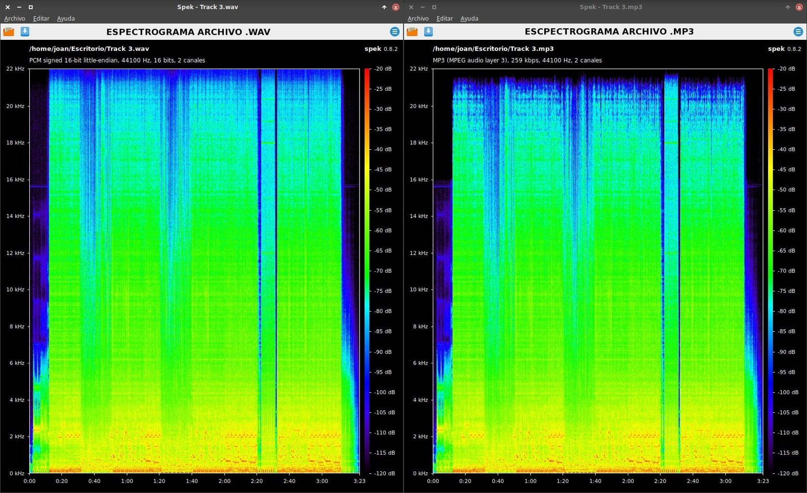
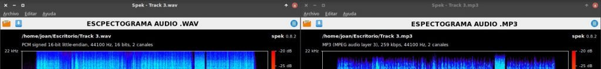
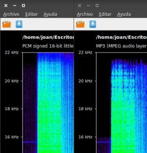
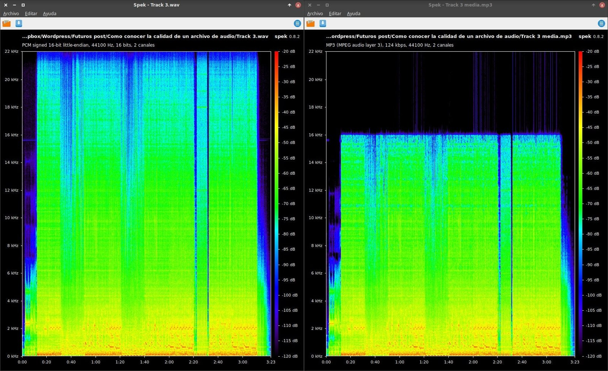

A petición de un lector del blog en el presente artículo veremos como conocer la calidad de un archivo de audio. Al mismo tiempo comprobaremos si la calidad obtenida con el script [convertir audio a mp3]() es buena.

Para cumplir con nuestro objetivo usaremos un programa de software libre llamado Spek. Este programa nos será útil para analizar el espectrograma de un archivo de sonido.<!--more-->

## INSTALAR EL PROGRAMA SPEK

Spek está disponible para los 3 grandes sistemas operativos existentes en la actualidad.

### Instalación de Spek en Linux

Los más posible es que Spek ya esté en sus repositorios. Por lo tanto tan solo tienen que abrir una terminal y ejecutar el siguiente comando:

En Debian y distros derivadas de Debian ejecutan:

> ```
> sudo apt-get install spek
> ```

En archlinux y en distribuciones derivadas de archlinux lo pueden instalar a través del repositorio aur ejecutando el siguiente comando en la terminal

> ```
> yaourt -S spek
> ```

Si el paquete no esté en sus repositorios, en el siguiente enlace encontraran el [procedimiento para compilar e instalar spek](https://github.com/alexkay/spek/blob/v0.8.2/INSTALL.md#bsd-and-gnulinux "Instrucciones para instalar Spek a partir del código fuente").

### Instalación de Spek en Windows

Desde la [página web de Spek](http://spek.cc/ "Web para descargar el archivo de instalación en Windows") pueden descargar el archivo de instalación .msi.

Una vez descargado lo instalamos de la misma forma que instalamos la totalidad de programas en Windows.

### Instalación de Spek en MAC OS

En la [página web de Spek](http://spek.cc/ "Web para descargar el archivo de instalación en Mac OS") pueden descargar el archivo .dmg necesario para la instalación de Spek.

## CONOCER SI LA CALIDAD DE UN ARCHIVO DE AUDIO COMPRIMIDO ES ACEPTABLE

Seguidamente compararemos un archivo .wav extraído de un CD de audio con un archivo .mp3 elaborado a partir del archivo .wav extraído del CD de audio.

###### Nota: La calidad de audio del archivo .wav es buena ya que el archivo ha sido generado a partir de un CD de audio y el formato .wav es un formato sin comprimir.

###### Nota: El archivo mp3 ha sido creado usando el siguiente procedimiento para [convertir audio a mp3](). El codificador usado para realizar la compresión es lame con un bitrate variable y usando el mejor algoritmo de compresión disponible.

Los resultados obtenidos con el software Spek se muestran en la captura de pantalla:

[](images/Espectrograma-wav-versus-mp3-alta.jpg)

###### Nota: El uso de Spek es sumamente sencillo. Tan solo tienen que abrir el programa y arrastran el archivo de audio dentro de la ventana. Para modificar la escala del nivel de presión sonora deben usar las teclas CTRL+UP, CTRL+DOWN, CTRL+MAYUS+UP y CTRL+MAYUS+DOWN

Analizando la totalidad de la información proporcionada por el programa podemos sacar las siguientes conclusiones.

### Análisis de la tasa de muestreo

Vemos que la tasa de muestreo del archivo .wav y del .mp3 es 44.100 Hz. Cuanto más alta sea la tasa de muestreo mejor será la calidad de un archivo de audio. Algunos valores de tasa de muestreo que es posible encontrar son por ejemplo 22.050 , 48.000 llegando hasta 192.000 Hz.

La tasa de muestreo que se acostumbra a usar para audios de buena calidad es igual o superior a 44.100 Hz.

En caso de usar una tasa de muestreo superior a 44.100 Hz podemos tener problemas ya que habrá reproductores que no serán capaces de reproducir el audio correctamente.

### Análisis del número de Canales

En ambos casos observamos que los archivos disponen de 2 canales. Esto quiere decir que el sonido es estéreo.

El tipo de audio en función del número de canales es el siguiente:

- 1 canal: Audio mono
- 2 canales: Audio stereo
- 3 canales: Audio tipo 2.1
- 4 canales: Audio tipo 3.1
- 6 canales: Audio tipo 5.1
- etc.

Si disponemos de los altavoces adecuados, a mayor número de canales el audio será más real y de mejor calidad.

###### Nota: Si usamos un audio de 2 canales en sistema te altavoces 5.1, únicamente obtendremos una calidad de audio stereo.

### Resolución o Profundidad de bit

Tanto el archivo .wav como el .mp3 tienen una resolución de 16bits. Una resolución de 16 bits es correcta.

Otras resoluciones existentes son 8 bits y 24 bits. La resolución de 24 bits se acostumbra a utilizar en ámbitos profesionales y es la que nos ofrece mejor calidad en archivos sin comprimir.

### Análisis del bitrate

Vemos que el archivo mp3 tiene un bitrate de 259 kbps (kilobits por segundo) y además es variable.

Si analizamos el archivo .wav vemos que tiene una tasa de muestreo de 44.100 Hz, una resolución de 16 bit y 2 canales. Por lo tanto la tasa de muestreo es del archivo .wav es de 1411,2 kbps.

Por lo tanto el bitrate del archivo .wav será mucho mejor que el del archivo mp3 y por lo tanto su calidad de sonido a priori es mejor.

### Análisis del espectrograma

El espectrograma es una de las parte más importantes para analizar la calidad de un archivo de audio comprimido.

En el eje de las X tenemos el tiempo en segundos que dura la canción

En el eje de las Y tenemos el nivel de presión sonora para cada una de las frecuencias de sonido.

Si comparamos el archivo .wav con el archivo .mp3 vemos claramente que a frecuencias altas entre 21.000 y 22.000 HZ han desaparecido sonidos. Obviamente si se pierden sonidos la calidad del sonido es peor.

[](images/Pérdida-sonido-frecuencias-altas.jpg)

El oído humano es capaz de percibir sonidos en un rango de 20 a 20.000 Hz. Por lo tanto la pérdida de audio no debería afectar mucho pero hay que tener en cuenta que que el sonido también se transmite a través de nuestros huesos y las frecuencias muy altas disponen de armónicos que si son perceptibles por el oído humano.

También observamos que hay una serie de sonidos que se pierden entre las frecuencias de 16.000 y 22.000 Hz porque la densidad de puntos es menor.

[](images/Pérdida-de-sonidos-en-los-segundos-iniciales.jpg)

Continuando con el análisis también podemos ver que al comprimir un archivo de audio se acostumbran a perder los sonidos graves (bajas frecuencias) y agudos (altas frecuencias).

De esto modo podremos ir viendo y evaluando la cantidad de sonidos que se han perdido y en las frecuencias que se han perdido.

El mp3 analizado considero que es de buena calidad y por lo tanto las diferencias con el audio original son pocas. Si comparamos el archivo .wav con un mp3 más comprimido vemos que la diferencia salta a la vista.

[](images/Espectrograma-wav-versus-mp3-media.jpg)

### Escuchar el audio con unos buenos auriculares o altavoces

Una vez finalizado el proceso de análisis tenemos que escuchar el audio y juzgar si el resultado obtenido es el que queremos.

Con los detalles mencionados en el artículo nos podemos hacer una idea clara de la calidad de un archivo de audio. Si quisiéramos profundizar más en el análisis podríamos analizar otros aspectos como por ejemplo [el rango dinámico del audio]().

###### Nota: Pueden visitar el siguiente enlace para comprender los [conceptos básicos de sonido](http://www.ite.educacion.es/formacion/materiales/107/cd/audio/audio0101.html "Explicación de los conceptos básicos de sonido") que se usan a lo largo del artículo.

## OTROS CONSEJOS RELACIONADOS CON LA CALIDAD DE UN ARCHIVO DE AUDIO

A estas alturas ya somos capaces de hacernos una idea si la calidad de un archivo de audio es aceptable. Para asegurar una escucha y compresión óptima del audio pueden seguir las siguientes recomendaciones.

### Trabaja siempre con audio sin comprimir

Cuando comprimimos un audio siempre lo tenemos que realizar a partir de un audio sin pérdida como por ejemplo el .wav, el .flac, etc.

Un audio comprimido pierde de forma permanente su calidad. Si a un audio comprimido le aumentamos su tasa de muestro y el bitrate, lo único que conseguiremos es aumentar el tamaño del archivo. Su calidad de sonido seguirá siendo la misma porque las frecuencias de sonido pérdidas del audio inicial nos las volveremos a recuperar.

### Calidades recomendadas para comprimir un archivo de sonido

Si queremos obtener un audio .mp3 de buena calidad se recomienda usar los siguientes parámetros:

1. Bitrate variable (VBR)
2. Bitrate cercano a los 320 kbps
3. Usar varios tipos de codificador o programas para ver cual es el que da mejor resultado. En mi caso acostumbro a utilizar lame.

Para obtener un audio .ogg de buena calidad los parámetros a usar son los siguientes:

1. Bitrate cercano a los 320 kbps
2. Si usáis el codificador oggeng recomiendo usar la calidad 9 y 10 que proporcionarán bitrates de 320 kbps y 500 kbps respectivamente.

### Usa unos buenos altavoces o unos buenos auriculares

De nada nos servirá tener un archivo de audio de buena calidad si los altavoces o auriculares que usamos no son buenos.

Si los altavoces y auriculares que usamos son de mala calidad da igual que el audio que escuchamos sea de buena o mala calidad.

## AGRADECIMIENTOS

Para finalizar simplemente dar las gracias al DJ Joan Rogriguez por ayudarme en la redacción y en las recomendaciones realizadas en el artículo.

Si quieren escuchar algunos de sus temas pueden visitar la página de [Soundcloud de Joan Rodríguez](https://soundcloud.com/dj-joan-rodriguez "Soundcloud del DJ Joan Rodríguez").
