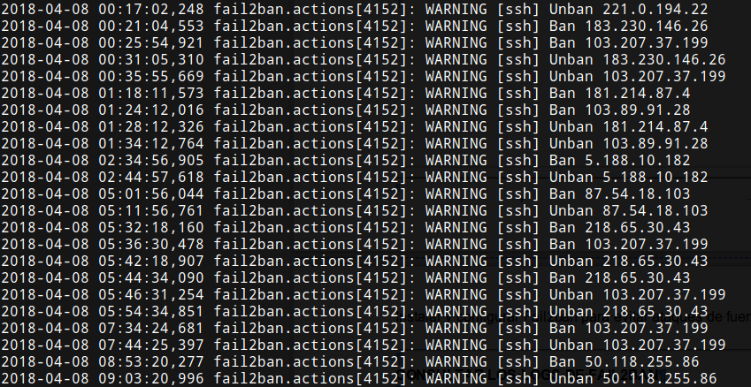

En el pasado artículo vimos como [instalar y configurar fail2ban](). A raíz de este artículo, a continuación veremos como podemos consultar los logs de fail2ban de forma fácil y sencilla.<!--more-->

## INSTRUCCIONES PARA CONSULTAR Y ANALIZAR LOS LOGS DE FAIL2BAN

Existen varios métodos para ver el histórico de IP que ha bloqueado fail2ban. El primer método es mediante los logs de fail2ban. El segundo de ellos es consultando la base de datos sqlite de Fail2ban.

###### Nota: Únicamente las versiones de fail2ban iguales o superiores a la 0.9 disponen de base de datos sqlite.

### Consultar y analizar los logs de de Fail2ban

Para realizar una consultar simple de los logs de fail2ban ejecutaremos el siguiente comando en la terminal:

> ```
> less /var/log/fail2ban.log
> ```

Acto seguido obtendrán un resultado parecido al siguiente:

[](images/intentos-acceso-servidor-ssh.png)

Como se puede observar en la captura de pantalla parece que existen numerosos bloqueos y desbloqueos de la misma IP. Esto significa que fail2ban está protegiendo mi servidor SSH contra ataques de fuerza bruta.

Por esto motivo, aparte de usar fail2ban se deberían tomar medidas adicionales como por ejemplo cambiar el puerto por defecto de nuestro servidor SSH, etc.

Si queremos obtener listados más detallados podemos ejecutar los siguientes comandos:

Para obtener un **listado con el número de veces que ha sido bloqueada cada una de las IP** ejecutaremos el siguiente comando en la terminal:

> ```
> zgrep -h "Ban " /var/log/fail2ban.log* | awk '{print $NF}' | sort | uniq -c
> ```

Si pretendemos obtener un **listado las IP que han sido bloqueadas durante el día** de hoy ejecutamos el siguiente comando:

> ```
> grep "Ban " /var/log/fail2ban.log | grep `date +%Y-%m-%d` | awk '{print $NF}' | sort | awk '{print $1,"("$1")"}' | logresolve | uniq -c | sort -n
> ```

En el caso que pretendamos obtener un **listado del número de bloqueos por día y por servicio** ejecutaremos el siguiente comando:

> ```
> zgrep -h "Ban " /var/log/fail2ban.log* | awk '{print $5,$1}' | sort | uniq -c
> ```

### Consultar los datos registrados en la base de datos sqlite

Si disponemos de una versión de fail2ban igual o superior a la 0.9 podemos consultar los bloqueos directamente de su base de datos.

Para saber la ubicación de la base de datos de fail2ban ejecutamos el siguiente comando en la terminal:

> ```
> sudo fail2ban-client get dbfile
> ```

El resultado obtenido en mi caso es el siguiente:

> ```
> Current database file is:
>  `- /var/lib/fail2ban/fail2ban.sqlite3
> ```

Por lo tanto mi base de datos está ubicada en /var/lib/fail2ban/fail2ban.sqlite3.

Para abrir y conectarnos con la base de datos ejecutaremos el siguiente comando:

> ```
> sudo sqlite3 /var/lib/fail2ban/fail2ban.sqlite3
> ```

Una vez conetactos a la base de datos ejecutaremos el siguiente comando para listar las tablas presentes en la base de datos:

> ```
> sqlite> .tables
> ```

El resultado obtenido en mi caso es el siguiente:

> ```
> bans fail2banDb jails logs
> ```

Por lo tanto tenemos disponibles 4 tablas. Para consultar la tabla logs ejecutaremos el siguiente comando en la terminal:

> ```
> sqlite> SELECT * FROM logs;
> ```

Y si quisiéramos consultar la tabla bans ejecutaríamos el siguiente comando:

> ```
> sqlite> SELECT * FROM bans;
> ```

Una vez realizadas las consultas nos desconectaremos de la base de datos ejecutando el siguiente comando:

> ```
> sqlite> .quit
> 
> ```

De esta forma tan fácil y tan sencilla podremos consultar el trabajo realizado por fail2ban.
