A continuación veremos un método para capturar o grabar el audio que reproducen los altavoces de nuestro ordenador en Linux y en Windows. Lo haremos usando el software Audacity porque tiene la ventaja de ser multiplataforma. Por lo tanto este método se puede usar en todos los sistemas operativos.<!--more-->

## UTILIDADES DE GRABAR EL AUDIO QUE SE REPRODUCE EN TU ORDENADOR

Podemos encontrar muchas utilidades a grabar el audio que se reproduce en nuestro ordenador. Las principales que se me ocurren son las siguientes:

1. **Grabar nuestras listas de música personalizada** de Spotify, Deezer, Youtube, etc
2. **Grabar una conversación** mantenida en una llamada o videollamada.
3. **Grabar cualquier sonido que no permite ser descargado** en nuestro navegador.

## COMO GRABAR EL AUDIO QUE REPRODUCEN NUESTROS ALTAVOCES EN LINUX

Los pasos a seguir para conseguir nuestro objetivo son los siguientes:

### Instalar audacity y el control de volumen de Pulseaudio

Para instalar audacity y el control de volumen de pulseaudio tan solo tenemos que ejecutar el siguiente comando en la terminal:

> ```
> sudo apt install audacity pavucontrol
> ```

**Nota:** Si usan otros gestores de paquetes diferentes a apt deberán reemplazar apt install por el comando pertinente.

### Iniciar la reproducción del contenido que queremos grabar

Empezaremos por iniciar la reproducción del contenido que queremos grabar. En mi caso es la siguiente lista de reproducción de Deezer:

[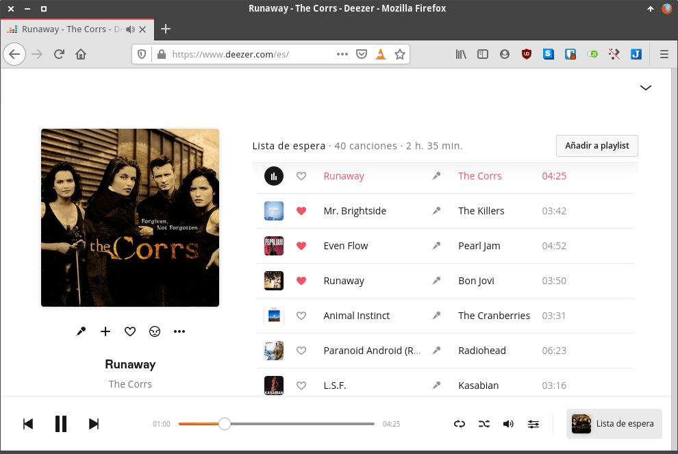](images/reproducir-audio-a-grabar-o-capturar.png)

### Configurar Audacity para grabar el audio que reproducen los altavoces de salida del ordenador

El siguiente paso consiste en abrir Audacity. Una vez iniciado aseguramos que la configuración sea la siguiente:

1. Tener seleccionado Alsa como servidor de audio.
2. Que el dispositivo de grabación sea Pulse. De este modo grabaremos el sonido del medio seleccionado en Pulseaudio.
3. Queremos un sonido con calidad Stereo. Por lo tanto seleccionamos la opción 2 canales de grabación (Stereo).
4. El dispositivo de reproducción es Pulse. De este modo el sonido de Audacity se reproducirá por el medio que seleccionemos en el control de volumen de Pulseaudio.

Una vez realizadas las comprobaciones clicamos encima de Clic para comenzar monitorización.

[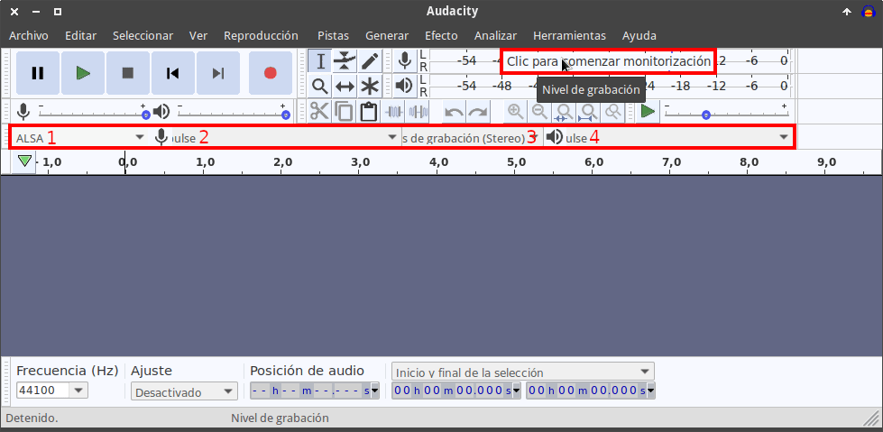](images/configurarar-audacity-linux.png)

### Configurar pulseaudio para grabar el audio que reproducen los altavoces de nuestro ordenador

El siguiente paso consistirá en abrir el control de volumen de Pulseadio. Encontrarán la entrada para abrirlo en el menú de inicio de su distro. En caso de no encontrarlo pueden abrir una terminal y ejecutar el siguiente comando:

> ```
> pavucontrol
> ```

Cuando se abra, en la pestaña **Reproducción** identificaremos el nombre de los altavoces que están reproduciendo el contenido que queremos grabar. En mi caso el nombre es CM102-A+/102S. Acto seguido clicamos en la pestaña **Dispositivos de Entrada**.

[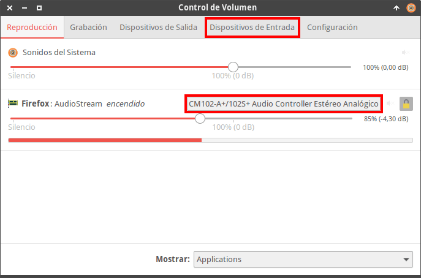](images/averiguar-nombre-altavoces.png)

Dentro de la pestaña seleccionamos la opción **Monitors** del desplegable Mostrar.

[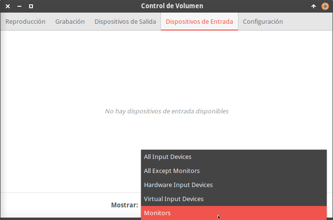](images/ver-dispositivos-monitoreo.png)

Acto seguido vemos que existe un dispositivo de entrada que captura sonido y contiene el nombre de nuestros altavoces. Apuntamos bien su nombre, que en mi caso es Monitor of CM102-a+/125S+ Audio Controller Estéreo Analógico.

[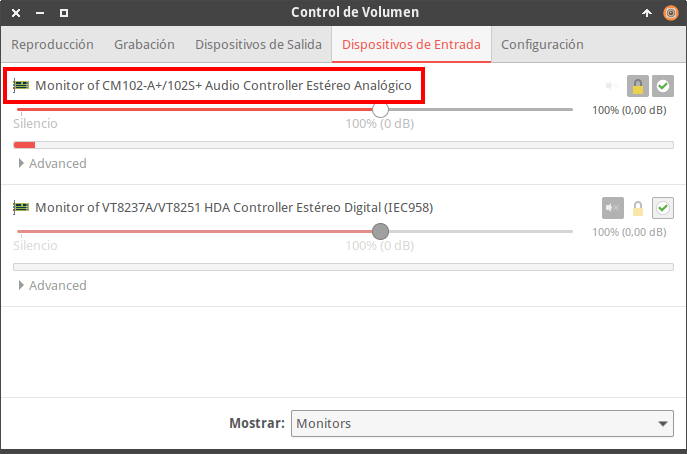](images/averiguar-el-dispositivo-que-captura-sonido.png)

En la pestaña **Grabación** seleccionamos el dispositivo de entrada que acabamos de anotar.

[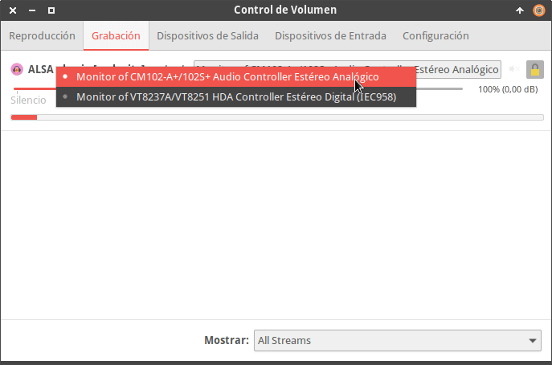](images/seleccionar-dispositivo-grabar-audio.png)

### Iniciar y detener la grabación de audio

En estos momentos ya podemos ir a Audacity e iniciar la grabación. Para ello tan solo tienen que presionar sobre el botón Grabar.

[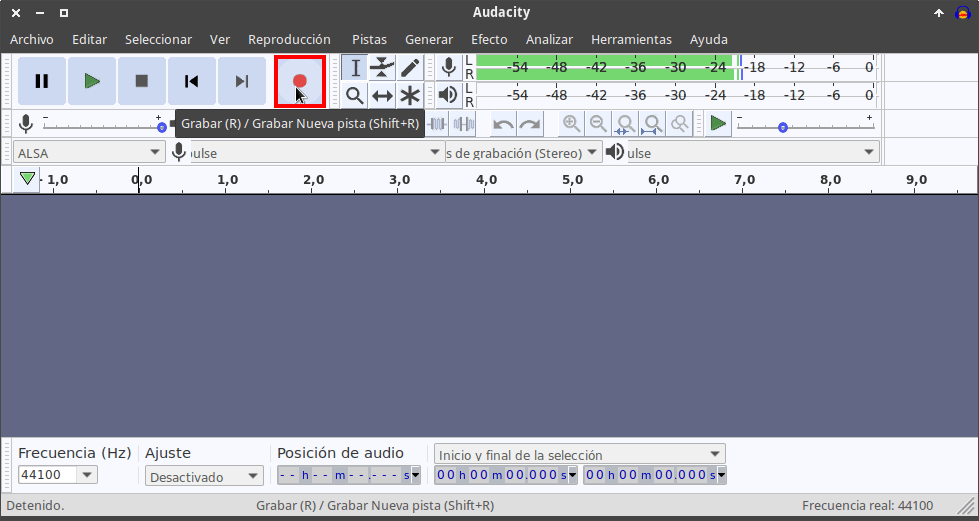](images/iniciar-grabación-linux.png)

Acto seguido se iniciará la grabación del audio que se está reproduciendo en nuestros altavoces. Cuando terminemos con la grabación presionamos en el botón Detener.

[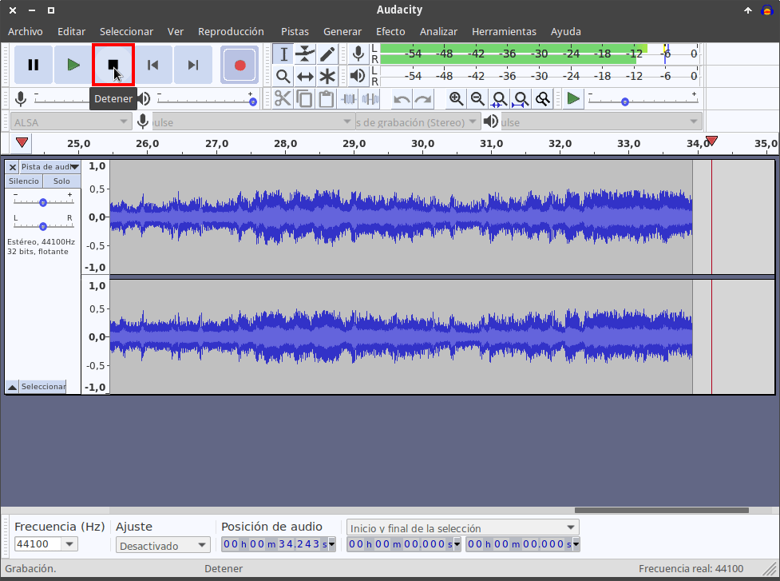](images/detener-grabacion-audio-linux.png)

### Almacenar el contenido grabado en un archivo de audio

A continuación tan solo tenemos que almacenar el contenido guardado en un archivo de audio. Para ello dentro del menú Archivo clicamos sobre la opción Exportar. Cuando se despliegue el submenú clicaremos sobre la opción que prefiramos. En mi caso selecciono Exportar el audio grabado como MP3.

[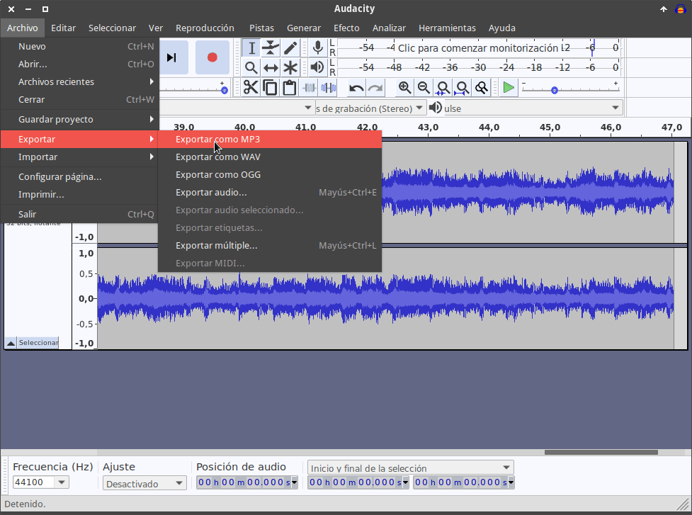](images/exportar-audio-a-mp3-linux.png)

Finalmente seleccionamos la ubicación donde queremos guardar el archivo mp3, definimos su nombre, configuramos las características que tenga el audio del fichero mp3 y presionamos el botón Guardar.

[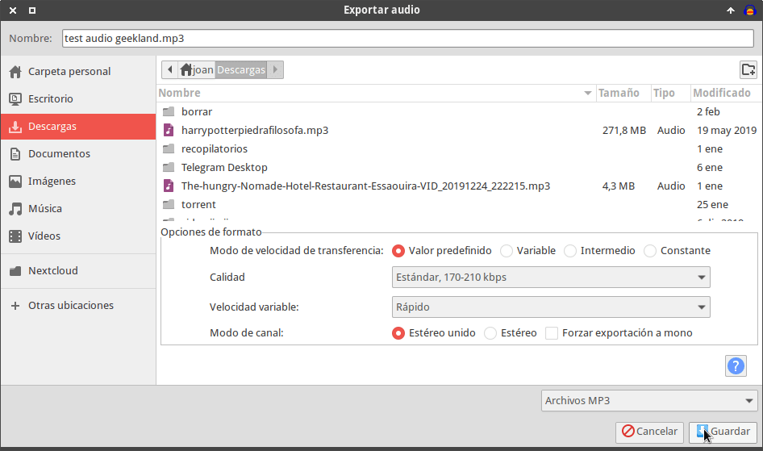](images/grabar-audio-formato-mp3-linux.png)

De este modo tan simple he conseguido guardar una lista de reproducción de Deezer. La calidad del audio capturado será excelente. No tendrá ningún ruido de fondo y la calidad dependerá únicamente de la calidad del streaming de música de Deezer.

**Nota:** Recuerden que puedan ajustar el nivel de volumen en el caso que el volumen de la grabación sea demasiado bajo.

## COMO GRABAR EL AUDIO QUE REPRODUCE EL ORDENADOR EN WINDOWS

El proceso en Windows es posiblemente un poco más sencillo. Hay diversos métodos para realizarlo, pero comentaré el que considero más sencillo y efectivo.

### Instalar el software Audacity en Windows

Obviamente lo primero que tenemos que realizar es instalar Audacity. Para instalarlo accedan a la siguiente [Web](https://www.fosshub.com/Audacity.html "Web para descargar Audacity"). Una vez dentro de la web podrán descargar el archivo binario de instalación de Windows clicando en el siguiente hiperenlace:

[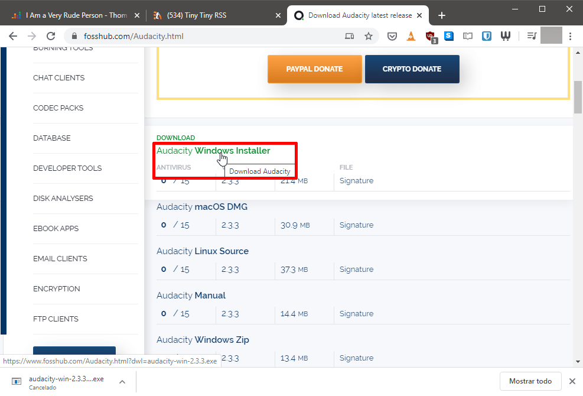](images/descargar-audacity-en-windows.png)

A continuación tienen que hacer doble click sobre el archivo descargado para iniciar la instalación.

### Iniciar la reproducción del contenido a grabar

Al igual que en el caso anterior iniciamos la reproducción del sonido que queremos grabar. En mi caso grabaré una lista de reproducción de Spotify.

[](images/reproducir-contenido-a-grabar-windows-spotify.png)

### Configurar Audacity para grabar el audio que reproducen los altavoces del ordenador

Abrimos el programa Audacity. La configuración que deberemos aplicar será la siguiente:

1. **Servidor de audio**: Seleccionamos la opción Windows WASAPI,
2. **Dispositivo de grabación**: Elegimos la opción que haga referencia los altavoces o auriculares que reproducen el sonido y que además contenga la palabra loopback.
3. **Canales de grabación**: Queremos sonido Stereo. Por lo tanto en este campo seleccionaremos la opción 2 canales de grabación (Stereo)
4. **Dispositivo de reproducción**: Tenemos que seleccionar el dispositivo de salida que queremos que use Audacity para reproducir sonido. En mi caso selecciono los altavoces standard de mi ordenador.

Una vez defina la configuración presionaremos sobre la opción Clic para comenzar monitorización.

[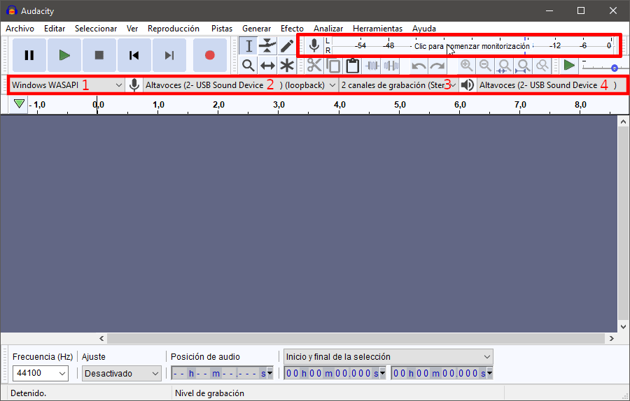](images/configurar-audacity-windows.png)

### Iniciar y parar el proceso de grabación de audio

A continuación presionamos sobre el botón de Grabar. Acto seguido se iniciará la grabación del audio que estén reproduciendo los altavoces de mi ordenador.

[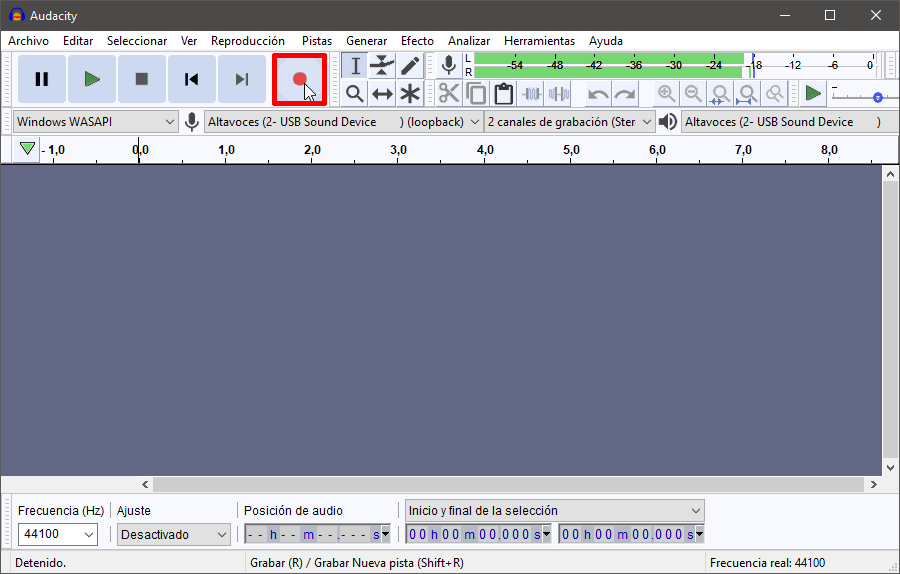](images/iniciar-grabacion-audio-windows.png)

Cuando finalizamos la grabación presionamos el botón Detener.

[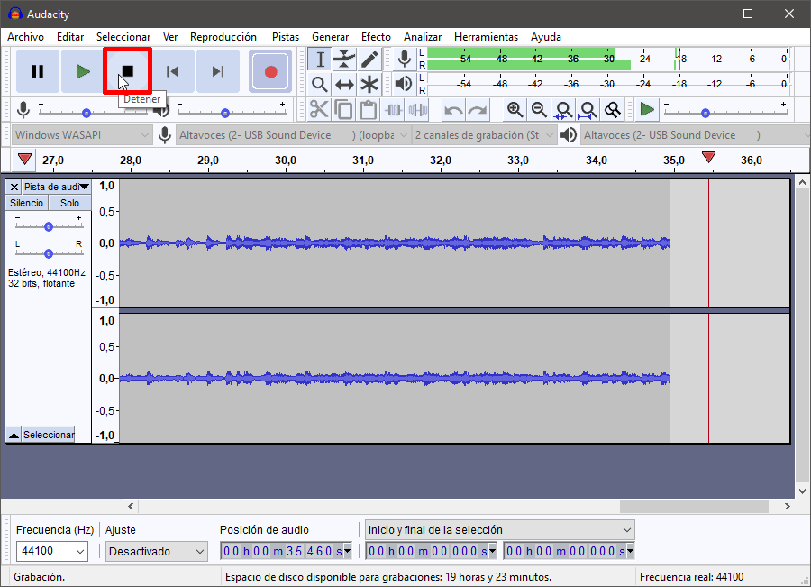](images/detener-grabacion-windows.png)

### Almacenar el audio capturado en un archivo mp3

Acto seguido podemos almacenar el audio capturado en un archivo mp3. Para ello en el menú Archivo nos vamos sobre la opción Exportar. A continuación clicamos sobre la opción Exportar como MP3.

[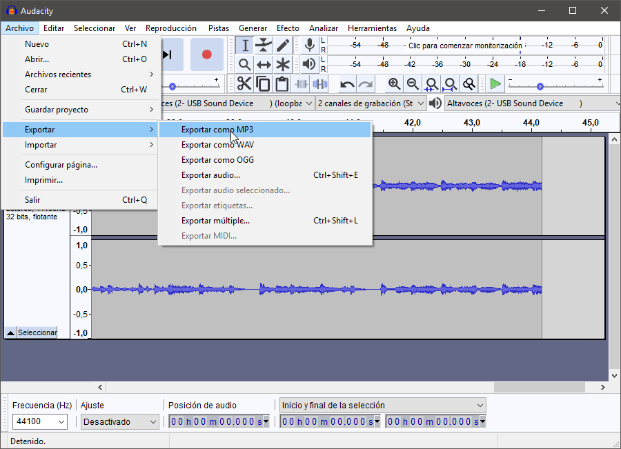](images/exportar-audio-a-mp3-windows.png)

Finalmente damos un nombre al fichero, seleccionamos las propiedades del archivo mp3 y presionamos el botón Guardar.

[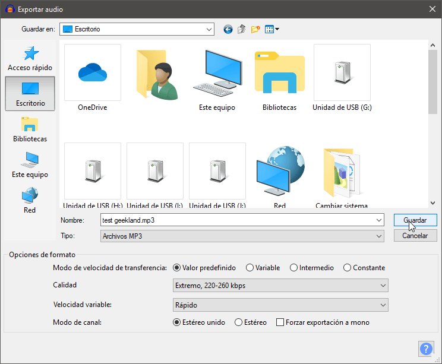](images/definir-propiedades-archivo-mp3.png)

Una vez generado el archivo lo pueden escuchar y podrán comprobar que la calidad de la grabación es excelente.

**Nota:** Recuerden que puedan ajustar el nivel de volumen en el caso que el volumen de la grabación sea demasiado bajo.
