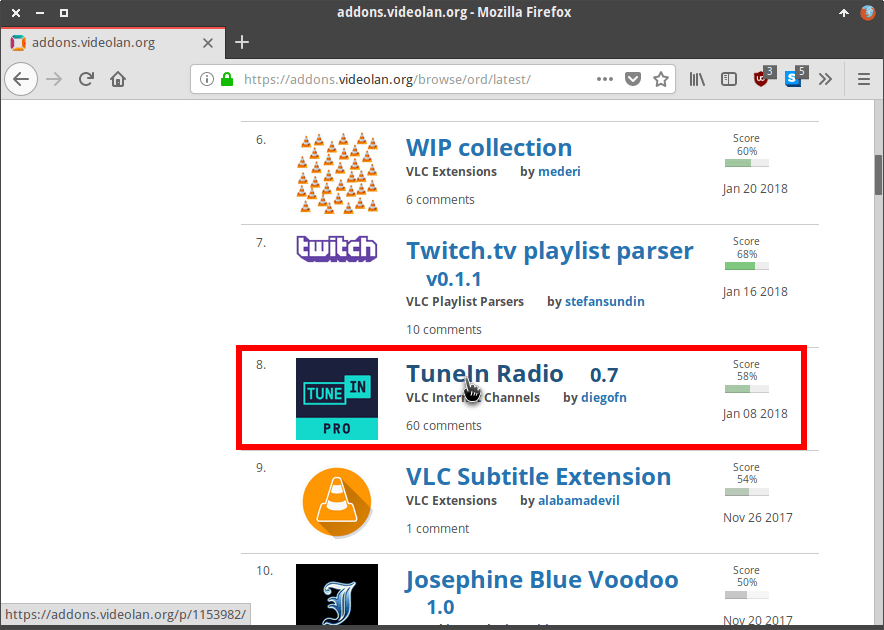
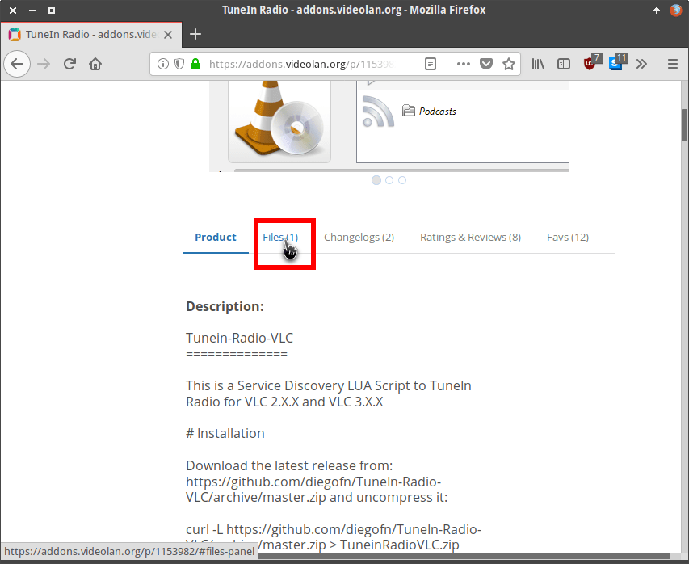
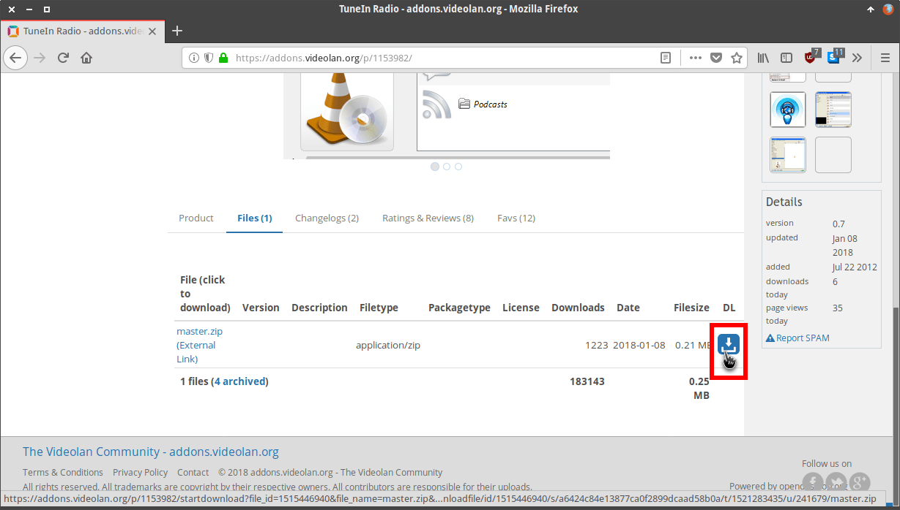
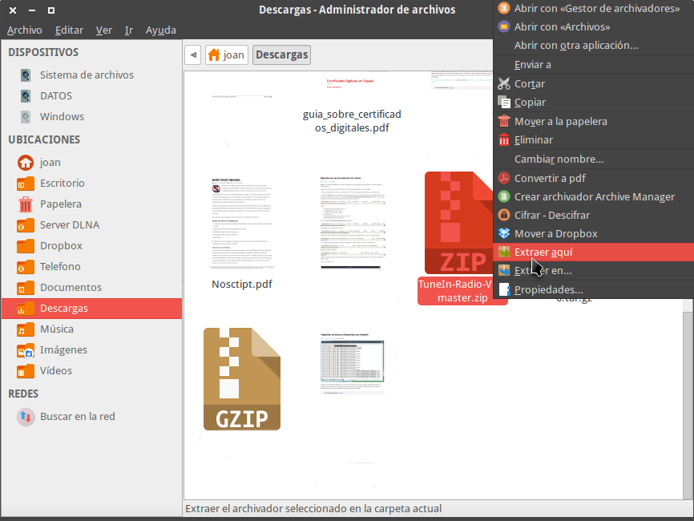
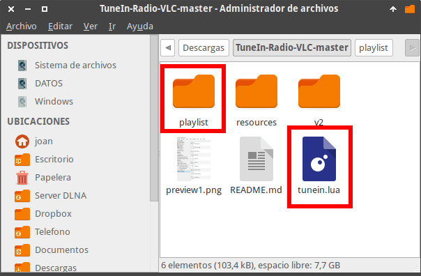
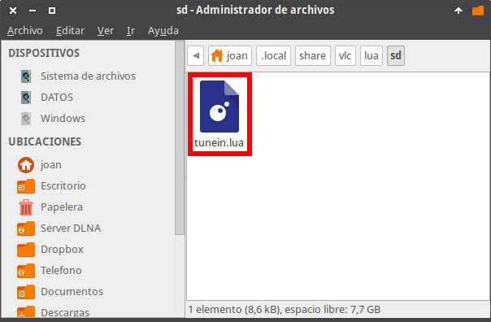
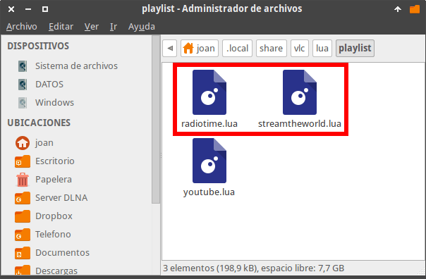
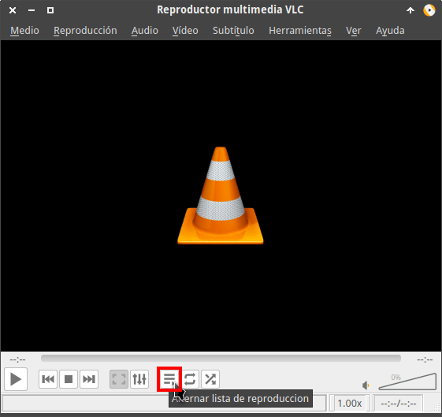
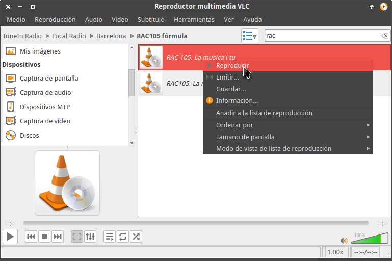

Sin duda alguna y con una diferencia abismal, VLC es el mejor reproductor de vídeo existente en cualquier sistema operativo. Los motivos por los cuales realizo esta afirmación con una seguridad absoluta son los siguientes:<!--more-->

1. El rendimiento del reproductor es perfecto. El consumo de CPU al reproducir los vídeos es menor que con la mayoría de programas existentes.
2. Es capaz de reproducir prácticamente la totalidad de formatos de vídeo y de audio. Incluso puede reproducir vídeos en HDR.
3. Desde de la versión 3.0 dispone de soporte para Chromecast.
4. Es multiplataforma y lo podemos usar en prácticamente cualquier sistema operativo existente en la actualidad. Lo podemos usar en Linux, Chromebooks, Windows, MacOS, Android, iOS, Xbox One, etc.
5. VLC no es tan solo un reproductor multimedia. Tiene otras funcionalidades como por ejemplo hacer screencast, convertir archivos de audio y vídeo, descargar subtítulos de series y películas, reproducir vídeos online como por ejemplo vídeos o listas de Youtube, descargar vídeos de Youtube, solucionar problemas de sincronización entre audio y vídeo, escuchar podcast, grabar vídeos mediante nuestra webcam, ver la televisión mediante enlaces RTMP, etc.
6. Puede reproducir vídeos con una resolución de hasta 8K.
7. Tiene la capacidad de reproducir vídeos almacenados en otros dispositivos de nuestra red local mediante protocolos como SMB, FTP, SFTP, NFS.
8. Podemos realizar capturas de pantalla de los vídeos que estamos visualizando.
9. Nos permite definir Bookmarks en ciertos partes de los vídeos. Así siempre que queramos podremos acceder a las partes de los vídeos que más nos interesen de forma inmediata.
10. Permite modificar la velocidad de reproducción de forma rápida y sencilla.
11. Etc.

Por si todas estas bondades no son suficientes a continuación veremos como podemos incluso ampliar las funcionalidades que aporta VLC mediante la instalación de complementos y extensiones.

## COMO INSTALAR COMPLEMENTOS Y EXTENSIONES DE VLC

El primero de los pasos es conocer las fuentes de donde podemos obtener complementos y extensiones. Para ello tan solo tienen que seguir las siguientes indicaciones.

### Fuentes para obtener complementes y extensiones de VLC

Desde el mismo programa de VLC podemos instalar los complementos y extensiones de forma fácil y cómoda. No obstante no es la opción más recomendable porque muchas de las extensiones y complementos que ofrecen no están actualizadas.

La mejor fuente para obtener e instalar complementos y extensiones es acceder a la web oficial de complementos y extensiones de VLC:

[https://addons.videolan.org/](https://addons.videolan.org/ "Web para descargar las extensiones disponibles")

Dentro de la web encontrarán el siguiente contenido:

1. La totalidad de extensiones clasificadas por popularidad, por categoría y por su fecha de actualización.
2. Los enlaces de algunas de las extensiones a su repositorio de desarrollo de Github. En el repositorio de desarrollo de Github siempre encontraremos la versión más actualizada de la extensión.

### Instalar complementes y extensiones de VLC

Como hemos dicho en el apartado anterior accedemos a la web para obtener los complementos y extensiones de VLC.

[https://addons.videolan.org/](https://addons.videolan.org/ "Web para descargar las extensiones y complementos disponibles")

Una vez dentro de la web navegan y seleccionan el complemento que que quieren instalar. En mi caso instalaré el complemento TuneIn Radio para poder escuchar prácticamente cualquier emisora de radio a través de Internet.

Una vez dentro de la página de la extensión tienen que leer y aplicar las instrucciones de instalación. En el caso de TuneIn Radio primero tenemos que descargar el Script que ampliará las funciones de VLC. Para ello clicamos en el menú **Files**.

A continuación pulsamos en el icono para descargar el script.

Seguidamente descomprimimos el archivo que acabamos de descargar.

El siguiente paso consiste en acceder dentro de la carpeta que acabamos de descomprimir. Una vez dentro vemos el siguiente contenido:

A continuación, en función del sistema operativo que usamos copiamos el archivo **tunein.lua** dentro de la siguiente ubicación:

 
|  |   **Ruta copia tunein.lua**   |
| --- | --- |
|   **GNU Linux**   |   ~/.local/share/vlc/lua/sd/   |
|   **Windows**   |   C:\\Archivos de programa\\VideoLAN\\VLC\\lua\\sd   |
|   **MacOS**   |   ~/Library/Application\\ Support/org.videolan.vlc/lua/sd/   |

Finalmente, en función del sistema operativo que usamos copiamos todo el contenido de la carpeta **playlist** en la siguiente ubicación:

 
|  |   **Ruta copia contenido carpeta playlist**   |
| --- | --- |
|   **GNU Linux**   |   ~/.local/share/vlc/lua/playlist/   |
|   **Windows**   |   C:\\Archivos de programa\\VideoLAN\\VLC\\lua\\playlist   |
|   **MacOS**   |   ~/Library/Application\\ Support/org.videolan.vlc/lua/   |

### Usar el complemento o extensión que acabamos de instalar

En estos momentos la instalación ha finalizado y podemos empezar a sacarle partido. Las instrucciones de uso se acostumbran a encontrar en la URL de donde nos hemos descargado la extensión.

En el caso de TuneIn Radio tenemos que acceder a la lista de reproducción de VLC. Si no acceden automáticamente a la lista de reproducción cliquen sobre el icono **Alternar lista de reproducción**.

En el apartado **Internet** de la lista de reproducción clican sobre la entrada TuneIn Radio y en el panel de la derecha tendrán todas las radios disponibles clasificadas por categorías. Además dispondrán de un buscador que facilitará la tarea de encontrar la emisora que están buscando.

## EXTENSIONES INTERESANTES QUE RECOMIENDO INSTALAR

Las extensiones de VLC son una gran idea, no obstante es una pena que gran parte de las extensiones existentes para VLC no funcionen y/o tengan un mantenimiento deficiente. Por este motivo en este apartado solo citaré 3 extensiones que son las que uso y por lo general acostumbran a funcionar.

### Escuchar la radio mediante la extensión TuneIn Radio

La extensión de TuneIn Radio nos permitirá escuchar la totalidad de emisoras que están presentes en la web de TuneIn Radio, pero a través de VLC. En apartados anteriores de este post hemos detallado su uso e instalación. Para descargar esta extensión pueden acceder a la siguiente:

[https://addons.videolan.org/p/1153982/](https://addons.videolan.org/p/1153982/)

### Reproducir listas de vídeos de Youtube

Esta extensión nos permitirá poder reproducir y descargar la totalidad de vídeos de una lista de reproducción de Youtube .Para poder instalar y usar esta extensión tendrán que acceder a la siguiente URL:

[https://addons.videolan.org/p/1154080/](https://addons.videolan.org/p/1154080/)

Si tienen paciencia pueden ir probando distintas extensiones para ver si son útiles y funciona.
