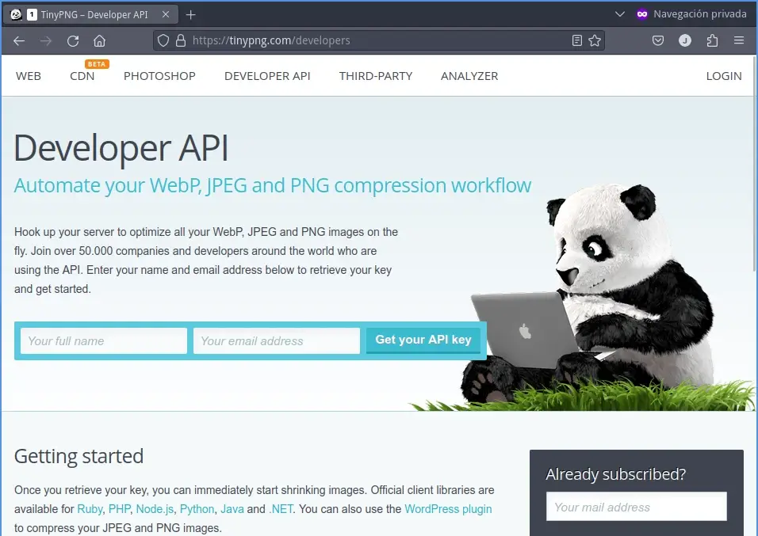
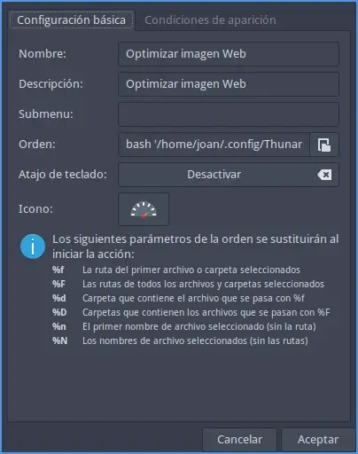
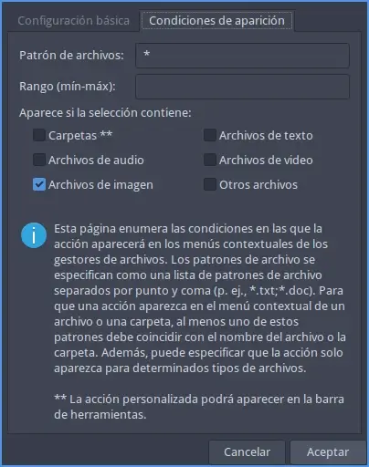
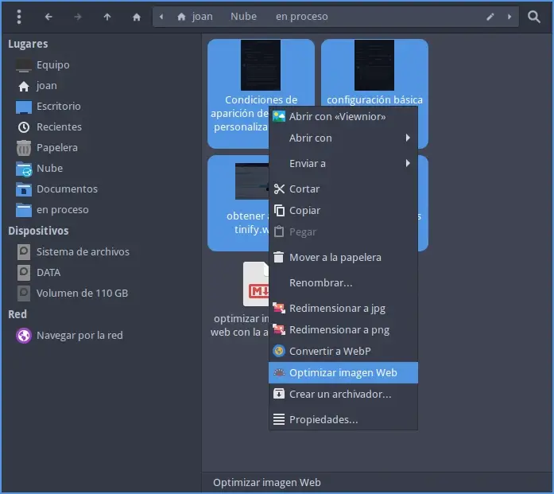
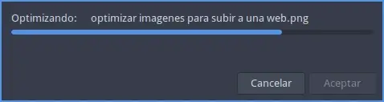
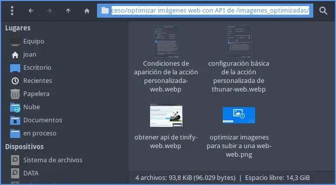

En el siguiente artículo verán el método que utilizo para optimizar mis imágenes antes de subirlas a mi sitio web. En mi caso, utilizo un simple script que me permite usar de forma cómoda y rápida la API de Tinify. El método que verán a continuación optimiza las imágenes para mostrarlas en la web y para ello se aplica un algoritmo de compresión con pérdida. De esta forma la carga del servidor Web será menor y funcionará de forma más rápida y fluida.<!--more-->

## VENTAJAS A LA HORA DE OPTIMIZAR IMÁGENES WEB CON LA API DE TINIFY

Las ventajas que obtendremos a la hora de optimizar imágenes web con la API de Tinify son las siguientes:

1. Es una opción cómoda. Tan solo tendrán que seleccionar las imágenes a optimizar y hacer un par de clicks con el ratón. Si no quieren usar el ratón también pueden usar un atajo de teclado.
2. De todas las opciones que he probado, la API de Tinify es la que ofrece la mejor relación entre el tamaño y la calidad de la imagen. He intentado usar herramientas como jpegoptim, guetzli, pngquant, etc., pero ninguna de estas herramientas ofrece un mejor resultado que la API de Tinify.
3. Mediante un solo y simple script podré optimizar imágenes .png, .jpg y webp para subir a una web.
4. En este artículo solo veremos como optimizar imágenes para uso web. No obstante la API permite otras operaciones como por ejemplo convertir imágenes a .png, .jpg o .web. También permite redimensionar imágenes o recortar imágenes de forma inteligente.
5. Todos los metadatos de las imágines originales se preservan en la imagen transformada.

## LIMITACIONES Y PUNTOS A TENER EN CUENTA DEL MÉTODO QUE VERÁN A CONTINUACIÓN

La única limitación de la API es que solamente podremos optimizar 500 imágenes por mes. En el caso que necesiten optimizar más de 500 imágenes por mes deberán pagar para poder usar la API. Los precios los encontrarán en el siguiente [link](https://tinypng.com/developers). Además tienen que tener en cuenta que para usar la API necesitarán tener conexión a Internet. Por lo tanto este método solo es útil si disponen de una conexión a Internet.

**Nota:** Las imágenes a optimizar de nuestro disco duro se transferirán a los servidores de Tinify, posteriormente se optimizarán y se volverán a descargar a nuestro disco duro. Por lo tanto la solución mostrada en el artículo no es apta para los "paranoicos" de la privacidad.

## OPTIMIZAR IMÁGENES PARA SUBIR UNA WEB CON LA API DE TINYFY

Los pasos a seguir para conseguir nuestro propósito son los siguientes.

### OBTENER UNA CLAVE API DE TINIFY

Para obtener la API de Tinyfy tendréis que acceder a la siguiente [URL](https://tinypng.com/developers). Una vez dentro tan solo tendréis que seguir las instrucciones para conseguir su número de API. Básicamente tendréis que introducir vuestro nombre y dirección de email.



**Nota:** En mi caso la API obtenida ha sido `6HiVtFGJt9By8fGWiiwmRXMLJSPsX3f`

### INSTALAR LAS DEPENDENCIAS NECESARIAS PARA PODER EJECUTAR EL SCRIPT PARA OPTIMIZAR IMÁGENES WEB

Para la correcta ejecución del script tan solo tenemos que asegurar que nuestro sistema operativo Linux tenga instalados los paquetes `zenity` y `curl`. Para ello ejecutaremos el siguiente comando en la terminal:

> ```shell
> sudo apt install zenity curl
> ```

**Nota:** El paquete Zenity servirá para mostrar cuadros de diálogo gráficos mientras se ejecuta el script. Curl servirá para hacer la llamada a la API de Tinify.

Además para seguir las instrucciones de este artículo tienen que usar el gestor de ficheros Thunar.

### SCRIPT PARA PARA USAR LA API DE TINYFY Y OPTIMIZAR IMÁGENES WEB MEDIANTE LA API DE TINIFY

Para poder usar la API de Tinify de forma cómoda he generado un pequeño script en bash. El script en mi caso tiene el nombre de `web_optimized.sh` y lo guardo en la ubicación `/home/joan/.config/Thunar/custom actions/images/`. Para generar el script en mi caso ejecuto el siguiente comando:

> ```shell
> nano /home/joan/.config/Thunar/custom\ actions/images/web_optimized.sh
> ```

Una vez de abra el editor de textos tan solo hay que pegar el siguiente código:

```shell
#!/bin/bash
guitool=zenity
apitiny=poner_tu_clave_de_API

exit_me(){
    rm -rf ${tempdir}
    exit 1
}

trap "exit_me 0" 0 1 2 5 15

LOCKFILE="/tmp/.${USER}-$(basename $0).lock"
[[ -r $LOCKFILE ]] && PROCESS=$(cat $LOCKFILE) || PROCESS=" "

if (ps -p $PROCESS) >/dev/null 2>&1
then
    echo "E: $(basename $0) is already running"
    $guitool --error --text="$(basename $0) is already running"
    exit 1
else
    rm -f $LOCKFILE
    echo $$ > $LOCKFILE
fi

# precache
PROGRESS=0
NUMBER_OF_FILES="$#"
let "INCREMENT=100/$NUMBER_OF_FILES"

( for f in "$@"
do
    echo "$PROGRESS"
    file="$f"

    # precache
    dd if="$file" of=/dev/null 2>/dev/null

    # increment progress
    let "PROGRESS+=$INCREMENT"
done
) | $guitool  --progress --title "Precaching..." --percentage=0 --auto-close --auto-kill

PROGRESS=0
NUMBER_OF_FILES="$#"
let "INCREMENT=100/$NUMBER_OF_FILES"
mkdir -p "imagenes_optimizadas"

( for f in "$@"
do
    imagename=$(echo "$f" | cut -f 1 -d '.')
    imagetype=$(echo "$f" | cut -f 2 -d '.')
    outfile=$imagename"-web."$imagetype

    echo "$PROGRESS"
    file="$f"
    filename="${file##*/}"
    filenameraw="${filename%.*}"
    echo -e "# Optimizando: \t ${filename}"

    Cfile=`curl https://api.tinify.com/shrink --user api:$apitiny --data-binary @"${f}" --dump-header /dev/stdout | awk -F "url" '{print $2}' | awk '{print substr($0, 4)}' | sed 's/"}}//'`
    curl ${Cfile} --user api:$apitiny --output "imagenes_optimizadas/""$outfile"

    let "PROGRESS+=$INCREMENT"
done) | $guitool  --progress --width=450 --title "Optimizando imagen..." --percentage=0 --auto-close --auto-kill

#notify-send "Se han optmizado las imágenes"
```

Una vez pegado el código tendréis que localizar la siguiente línea:

```shell
apitiny=poner_tu_clave_de_API
```

Una vez encontrada tendréis que reemplazar el texto `poner_tu_clave_de_API` por su clave de la API. En mi caso la clave API es `6HiVtFGJt9By8fGWiiwmRXMLJSPsX3f`. Una vez realizado este paso pueden guardar los cambios y cerrar el fichero.

A continuación darán permisos de ejecución al script ejecutando el siguiente comando en la terminal:

> ```shell
> chmod +x /home/joan/.config/Thunar/custom\ actions/images/web_optimized.sh
> ```

### CONFIGURAR UNA ACCIÓN PERSONALIZADA EN THUNAR PARA EJECUTAR EL SCRIPT Y ASÍ PODER OPTIMIZAR LAS IMÁGENES PARA LA WEB

Para realizar una acción personalizada en Thunar para ejecutar el script de forma cómoda y sencilla tienen que seguir las instrucciones del siguiente enlace:

[https://geeklandlinux.github.io/posts/acciones-personalizadas-en-thunar/]()

Cuando lleguéis a la configuración básica de la acción personalizada tendréis que introducir los parámetros que se muestran en la captura de pantalla.



Una breve explicación para rellenar los campos es la siguiente:

- **Nombre:** En mi caso escribo `Optimizar imagen Web`. En vuestro caso podéis elegir el nombre que queráis.
- **Descripción:** Al igual que en el campo anterior escribo `Optimizar imagen Web`. En vuestro caso podéis usar la descripción que creáis oportuna y que describa la función de la acción personalizada.
- **Orden:** Hay que introducir el comando para ejecutar el script que creamos en el apartado anterior. En mi caso el comando es `bash '/home/joan/.config/Thunar/custom actions/images/web_optimized.sh' %N` En vuestro caso es posible que tengáis que modificar la ruta y el nombre del script.
- **Icono:** Seleccionar un icono que haga referencia a la tareas que se ejecutará

A continuación en la pestaña **Condiciones de aparición** tenéis que tildar la opción `Archivos de imagen` tal y como se muestra en la captura de pantalla.



Una vez finalizado este apartado ya estamos en disposición de comprobar que todo funciona como es previsto.

## ¿CÓMO USAR EL SCRIPT PARA OPTIMIZAR IMÁGENES CON LA API DE TINFY?

En nuestro gestor de ficheros Thunar tenemos 4 imágenes que ocupan un tamaño de 180 kiB y las queremos optimizar para subir una web. Para ello las seleccionaremos, presionaremos el botón derecho del ratón y cuando aparezca el menú contextual ejecutaremos la acción personalizada `Optimizar imagen web`.



Acto seguido empezará la optimización de las imágenes:



Una vez finalizado el proceso se creará un directorio con el nombre `imagenes_optimizadas` que contendrá las imágenes optimizadas para posteriormente subir a un servidor web. Si se fijan el tamaño ahora es 93.8 KiB, por lo tanto el tamaño se ha reducido a la mitad.



## ACCEDER AL PANEL DE CONTROL DE LA API

En el caso que necesiten acceder al panel de administración de la API para por ejemplo mirar las fotos que habéis comprimido durante el presente mes, o para por ejemplo pagar por el uso de la API pueden hacerlo a través de la siguiente URL:

[https://tinify.com/dashboard/api](https://tinify.com/dashboard/api)

### Fuentes

[https://tinypng.com/developers/reference](https://tinypng.com/developers/reference)
