A pesar que Google Maps es una herramienta que vulnera nuestra privacidad también que hay remarcar que es una herramienta muy útil para organizar y planificar nuestros viajes. Por este motivo en el siguiente enlace veremos como podemos organizar y planificar nuestro viaje con Google Maps y My Maps en tan solo cuestión de minutos.<!--more-->

Google Maps es una herramientas que todo el mundo conoce, pero no sabe como exprimirla y sacarle el 100% de utilidad. En definitiva es una aplicación y servicio infrautilizado.

## VENTAJAS DE PREPARAR UN VIAJE CON GOOGLE MAPS Y MY MAPS

Las ventajas que nos proporcionará Google Maps para organizar nuestros viajes son numerosas. Algunas de ellas las destaco a continuación:

1. Nuestra ruta y puntos de visita quedan almacenados en Google Maps. De esta forma en un futuro podremos consultar y/o volver a visitar los puntos que definamos en el mapa.
2. Google Maps es un excelente navegador GPS. Una vez introducidos nuestros puntos de visita podremos llegar fácilmente a ellos a través de su navegador GPS.
3. Nos da indicaciones exactas y precisas para llegar a nuestros puntos de visita ya sea andando, en transporte público, en coche, etc.
4. Google Maps es capaz de proporcionar información sobre los sitios que estamos visitando. En caso que no proporcione información la podemos nosotros introducir manualmente antes del viaje.
5. Todos los sitios y monumentos donde queremos ir los tendremos ubicados sobre un mapa y los podremos consultar cuando necesitemos.
6. Quedan almacenados la totalidad de hoteles y restaurantes que visitamos. Podemos añadir anotaciones de que nos han parecido los hoteles y restaurantes.
7. Tenemos la posibilidad de compartir los mapas creados con nuestros amigos o simplemente hacerlos públicos para todo el mundo.

Todo esto da como resultado que el tiempo necesario para preparar nuestro viaje será mucho más rápido de lo habitual y además los resultados que obtendremos serán más satisfactorios.

## INSTRUCCIONES PARA PREPARAR UN VIAJE CON GOOGLE MAPS Y MY MAPS

A continuación podréis el método que acostumbro a utilizar para organizar la totalidad de mis viajes con Google Maps y Google My Maps.

### Crear un mapa de los puntos a visitar con My Maps

Para crear un mapa tenemos que abrir My Maps. Existe una aplicación de Android e iOS para My Maps, pero en mi caso prefiero usar el navegador web. Por lo tanto abrimos nuestro navegador web y entramos en la siguiente URL:

[https://www.google.com/maps/d/](https://www.google.com/maps/d/ "Link para acceder a My Maps")

Una vez dentro de la URL veremos la totalidad de mapas propios que tenemos disponibles. Para crear un nuevo mapa tan solo tenemos que presionar sobre el botón **+**.

[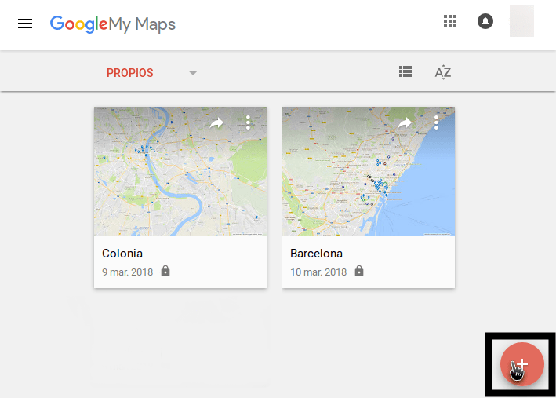](images/crear-mapa-en-my-maps.png)

El siguiente paso consiste en dar un nombre a nuestro mapa. Para ello haremos un clic encima del texto **mapa sin nombre**.

[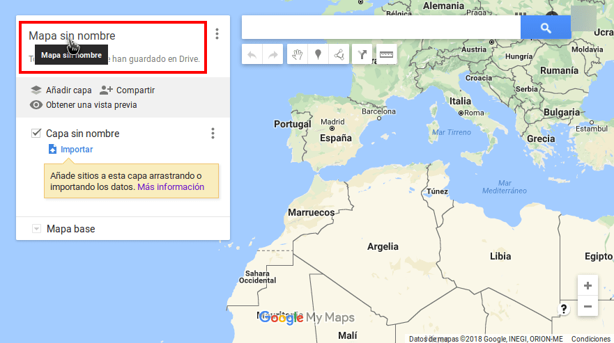](images/modificar-nombre-del-mapa.png)

Entonces se desplegará una ventana en la que deberemos escribir el nombre del mapa y una pequeña descripción. Acto seguido presionaremos el botón **Guardar**.

[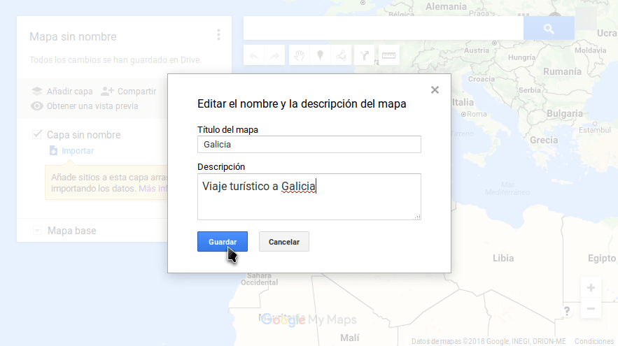](images/nombre-y-descripcion-del-mapa.png)

### Entrar las ubicaciones que queremos visitar en el mapa

Una vez creado el mapa tenemos que entrar la totalidad de ubicaciones que queremos visitar.

Algunas de las ubicaciones que considero interesantes introducir en el mapa son:

1. Hoteles.
2. Aeropuertos.
3. Estaciones de tren.
4. Puntos y monumentos que queremos visitar.
5. Direcciones o puntos en los que podemos estacionar nuestro medio de transporte de forma gratuita.
6. Restaurantes.
7. Etc.

Para añadir una ubicación tenemos que proceder del siguiente modo:

En el cuadro de búsqueda de My Maps tecleamos el punto que queremos localizar y una vez encontrado clicamos sobre él.

[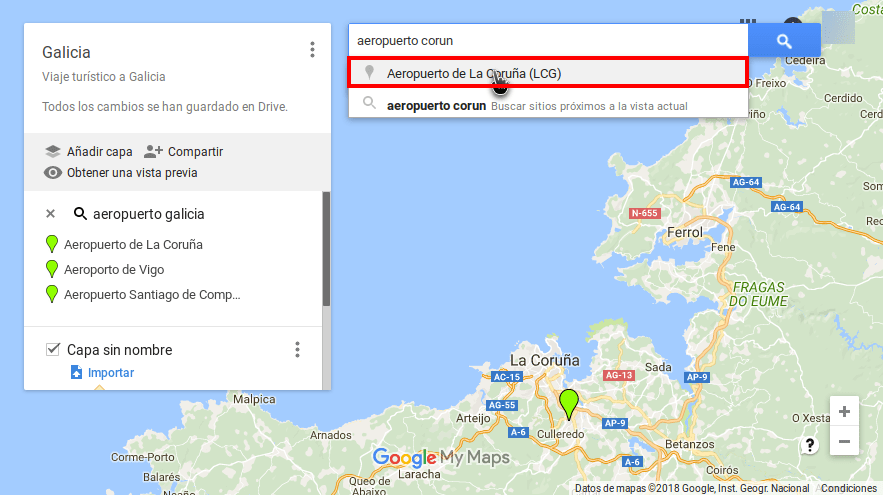](images/buscar-punto-de-visita.png)

Una vez localizado el punto que queremos visitar clicamos encima de la opción **Añadir al mapa**.

[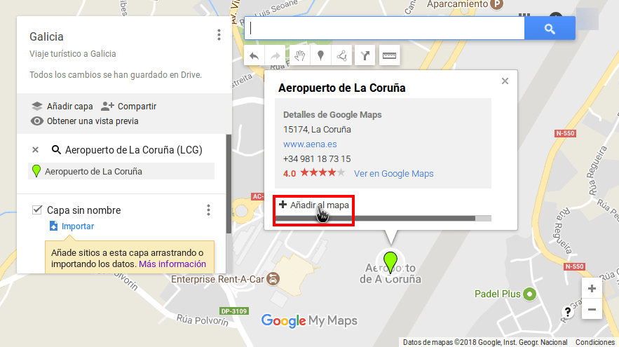](images/añadir-punto-al-mapa.png)

Con estos simples pasos ya hemos añadido el aeropuerto de la Coruña sobre el mapa. Ahora tan solo tenemos que repetir el proceso para añadir la totalidad de puntos de interés. En mi caso después de añadir la totalidad de puntos obtengo el siguiente resultado:

[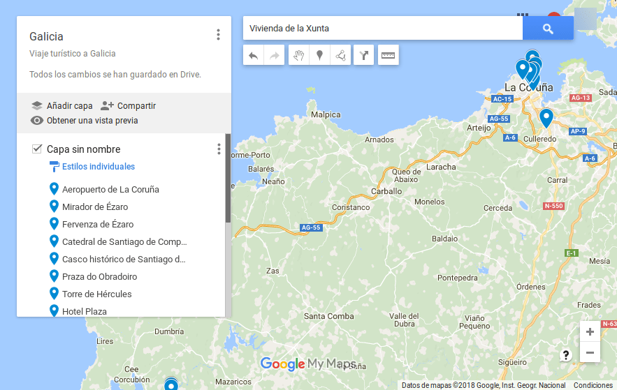](images/puntos-de-visita-introducidos-mapa.png)

###### Nota: Para elegir los puntos que se quieren visitar les recomiendo que busquen por internet. Existen miles de páginas web que nos recomendarán sitios para visitar de un determinado pueblo o ciudad. En caso que tengamos que elegir hoteles y restaurantes no serán tremendamente útiles apps como Trip Advisor, Trivago y Booking.

### Añadir comentarios a nuestro puntos de visita

Una vez introducidos los puntos de visita podemos añadir notas en cada uno de los puntos. Para ello clicamos en el icono de opciones de capa y cuando aparezca el menú desplegable clicamos encima de la opción **Abrir tabla de datos**.

[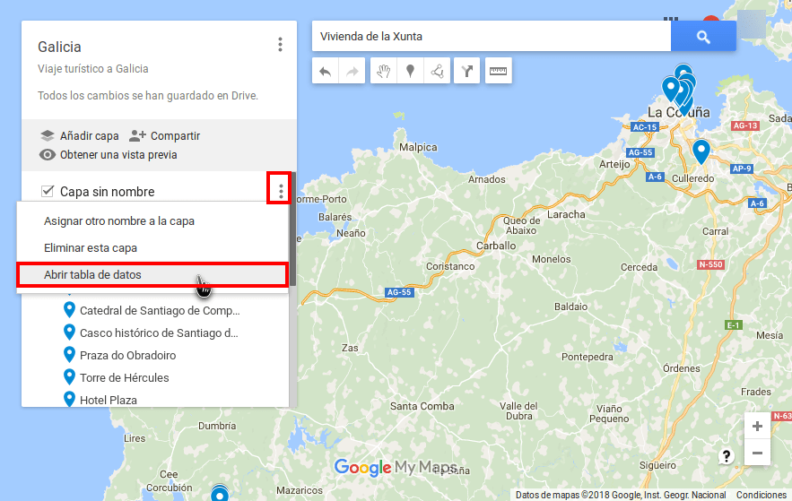](images/editar-comentarios-puntos-de-interes.png)

A continuación podremos ir añadiendo la totalidad de comentarios que creamos pertinentes en cada uno de los puntos que hemos introducido. Una vez introducidos la totalidad de comentarios podemos cerrar la ventana sin ningún tipo de problema.

[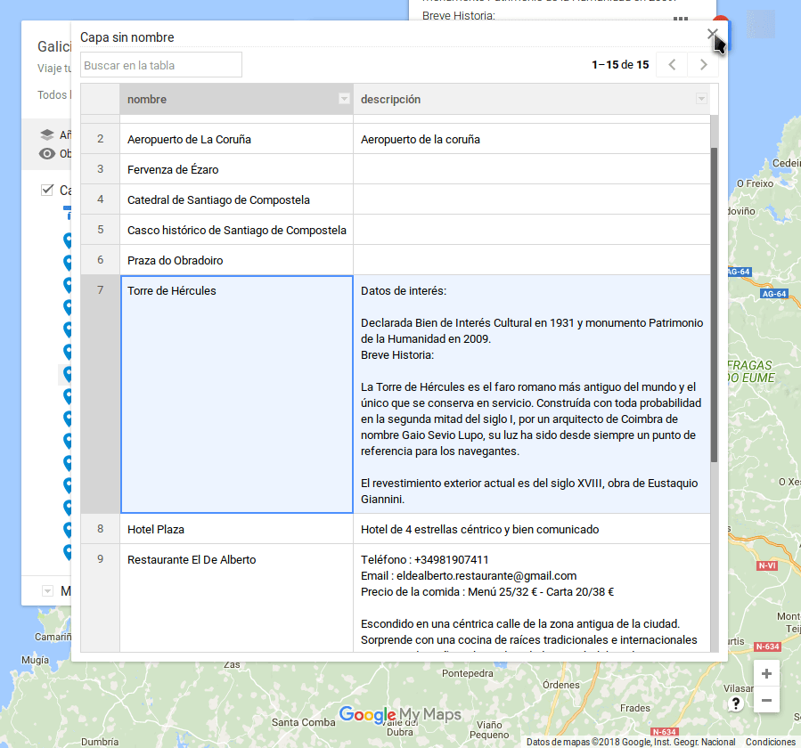](images/introducir-comentarios-puntos-de-visita.png)

### Creación de capas en My Maps para organizar nuestra viaje

Si lo consideramos necesario podemos organizar nuestros puntos de visita por capas.

La clasificación por capas que realizaremos es personal y puedo variar en función del propósito de nuestro viaje. En mi caso la clasificación realizada se basa en los puntos que visitaremos en un día y es las siguiente:

[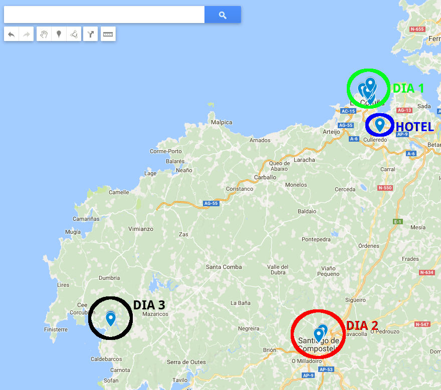](images/clasificacion-de-las-visitas-por-capas.png)

Una vez definidas las capas en que queremos clasificar nuestros puntos de interés las crearemos. Para ello pulsamos encima del botón **Añadir capa**.

[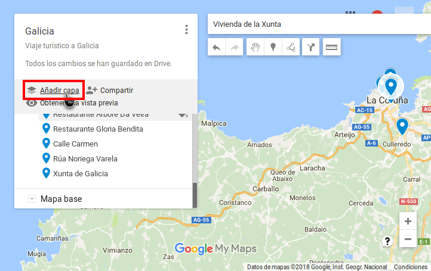](images/añadir-capa-mapa.png)

A continuación clicamos encima de la capa que acabamos de crear para darle un nombre:

[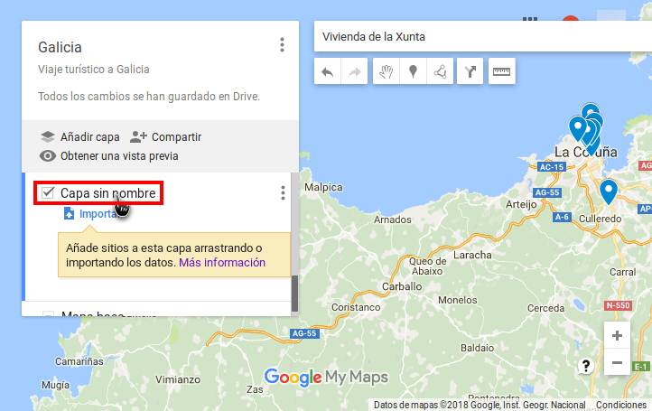](images/editar-nombre-de-una-capa.png)

Aparecerá una ventana en la que escribiremos el nombre que queremos que tenga la capa y acto seguido presionaremos el botón **Guardar**.

[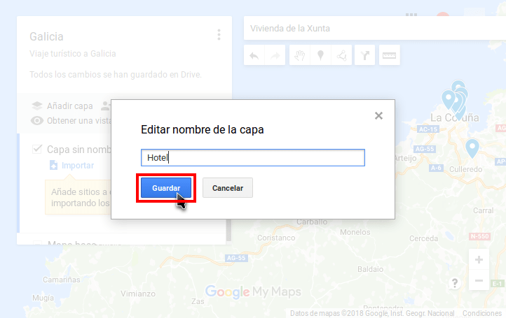](images/cambiar-el-nombre-de-la-capa.png)

Una vez creada la capa hotel repetiremos el proceso para crear las capas Día1, Día 2, etc.

Una vez creadas todas las capas tendréis una situación parecida a la siguiente:

[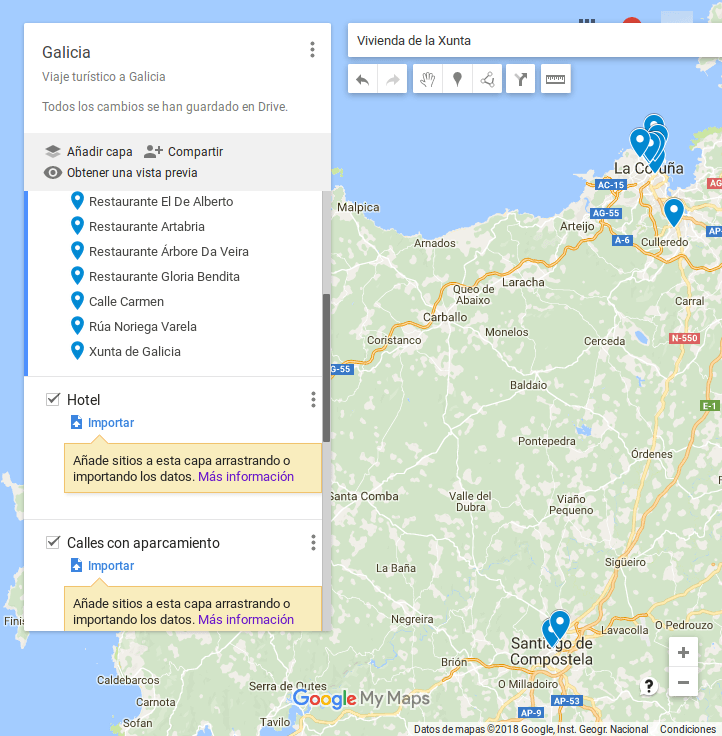](images/totalidad-de-capas-creadas.png)

### Añadir puntos de visita dentro de la capa correspondiente

El siguiente paso consiste en clasificar cada uno de los puntos introducidos en el mapa dentro de la capas que hemos creado. Para ello tan solo tenemos que arrastrar los puntos dentro de la capa correspondiente:

[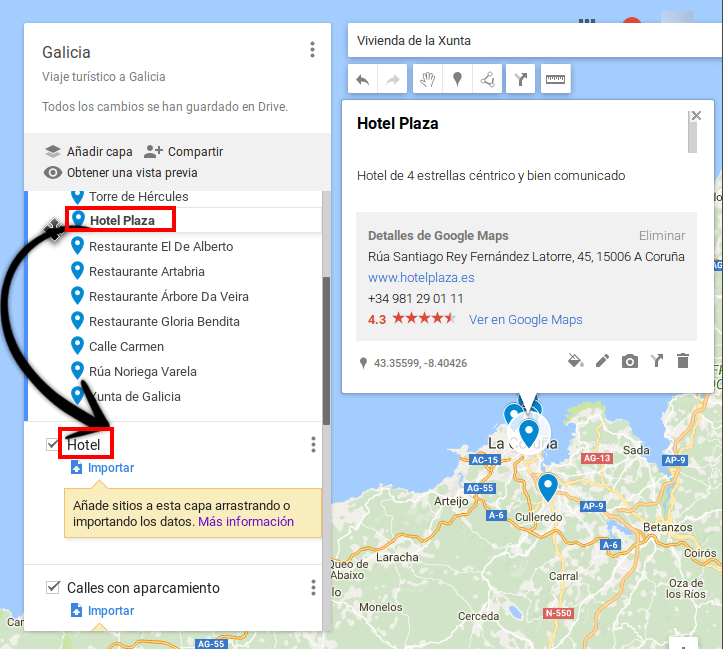](images/clasificar-sitios-en-capas.png)

Una vez clasificados la totalidad de puntos obtendremos un resultado parecido al siguiente:

[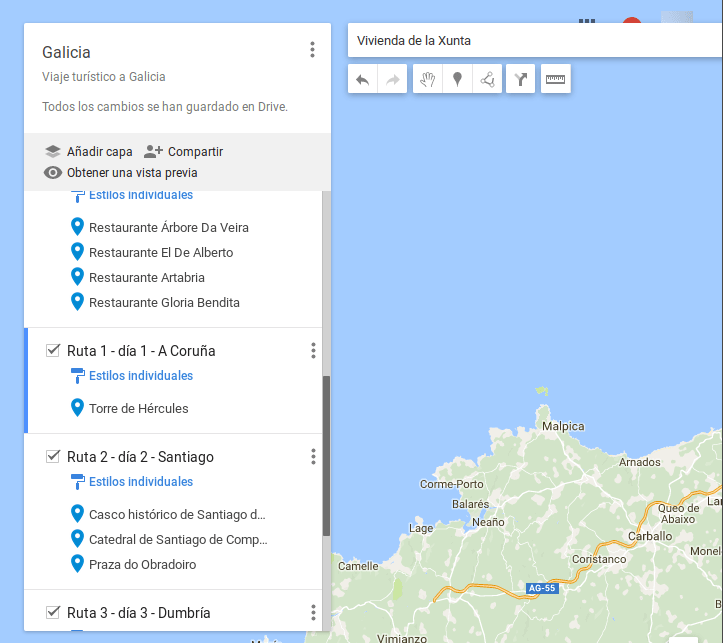](images/puntos-de-visita-clasificados-por-capa.png)

En estos momentos tengo todos los puntos que quiero visitar dentro de las capas que he creado. Por lo tanto, a estas altura ya tengo organizado mi viaje.

###### Nota: Las capas se pueden activar y desactivar. De este modo podremos ocultar los puntos de visita de una determinada capa cuando lo creamos conveniente.

### Personalizar gráficamente los puntos de visita introducidos en el mapa

Tenemos la posibilidad de personalizar cada uno de los puntos de los mapas con iconos y con colores. De esta forma podremos localizar más fácilmente los puntos que queremos visitar.

Los iconos que tenemos disponibles son:

1. Parking.
2. Casa.
3. Restaurante.
4. Monumento.
5. Llegada.
6. Etc.

###### Nota: Existen centenares de iconos y colores disponibles para poder elegir.

Para personalizar nuestros puntos de visita deberemos proceder del siguiente modo:

Clicamos sobre el punto al que queremos asignar un icono y a continuación presionamos sobre el icono de **Estilo**.

[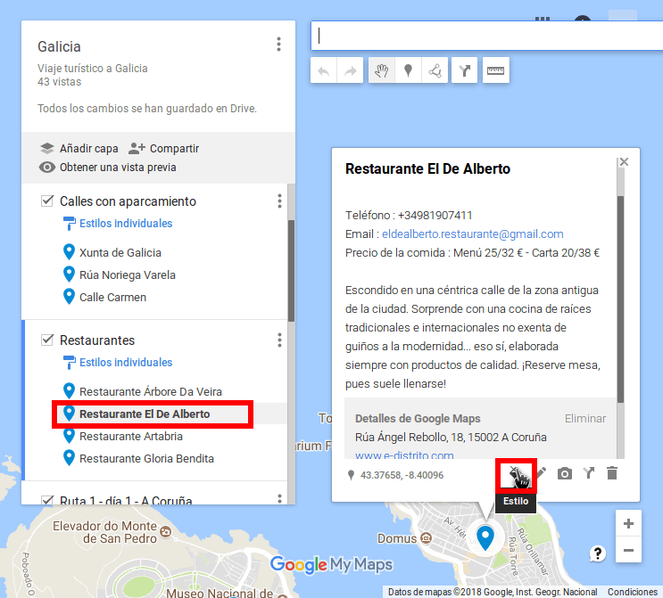](images/cambiar-icono-puntos-visita.png)

Seguidamente podremos seleccionar el icono y color que queramos.

[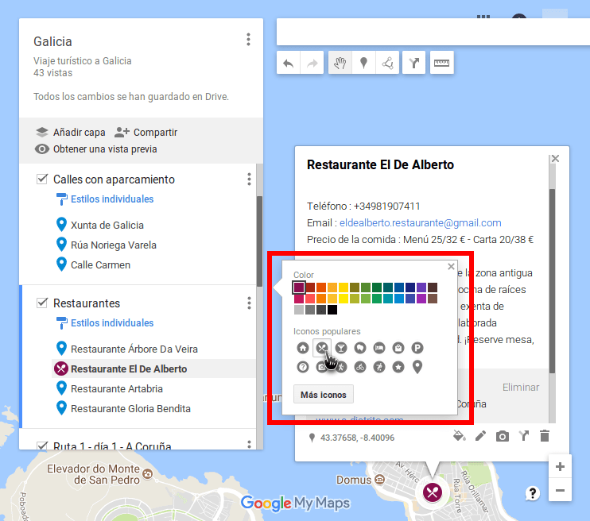](images/iconos-y-colores-cambiados.png)

Una vez personalizado uno de los puntos podemos personalizar el resto de puntos de nuestro mapa del mismo modo.

## COMO USAR NUESTRO DISPOSITIVO MÓVIL CON GOOGLE MAPS DURANTE EL VIAJE

Una vez finalizado el trabajo ya podemos pasar a la acción. Una vez llegados al sitio de destino abrimos abrimos la aplicación Google Maps en nuestro teléfono móvil. Seguidamente clicamos sobre la opción para **desplegar el menú**:

[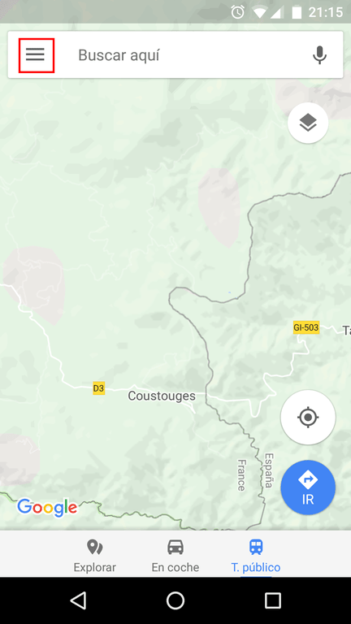](images/acceder-menu-google-maps.png)

Una vez desplegado el menú clicamos en la opción **Tus sitios**:

[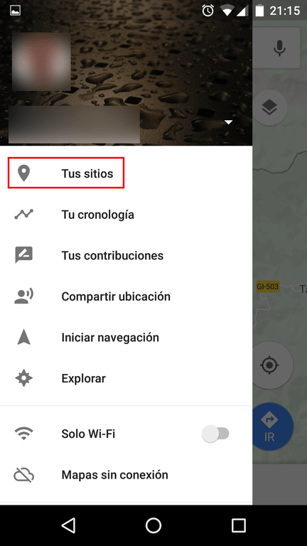](images/acceder-a-tus-sitios-google-maps.png)

Una vez desplegado el menú clicamos en la opción **MAPS**:

[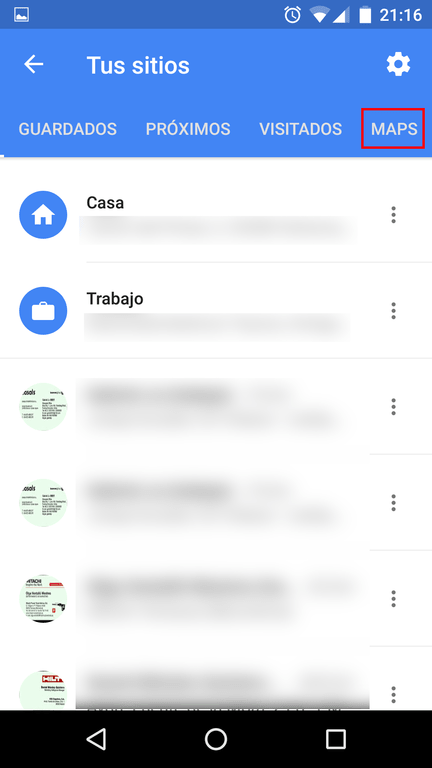](images/consultar-mapas-disponibles-google-maps.png)

A continuación clicamos encima del mapa que queremos visualizar:

[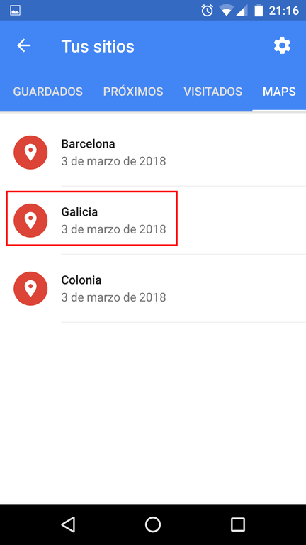](images/clicar-mapa-que-queremos-visualizar.png)

Una vez abierto el mapa clicamos en la opción **Ver Leyenda del Mapa**.

[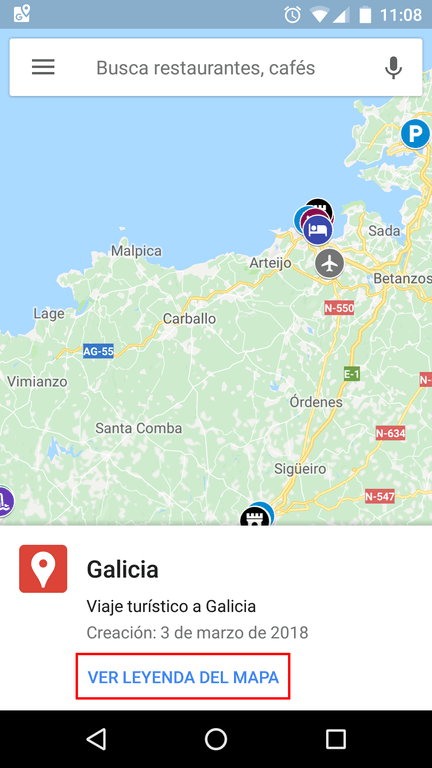](images/ver-la-leyenda-del-mapa-en-google-maps.png)

Seguidamente tildamos y/o destildamos las capas que queremos visualizar y/o ocultar en el mapa. Una vez seleccionados los puntos presionamos en el botón retroceder.

[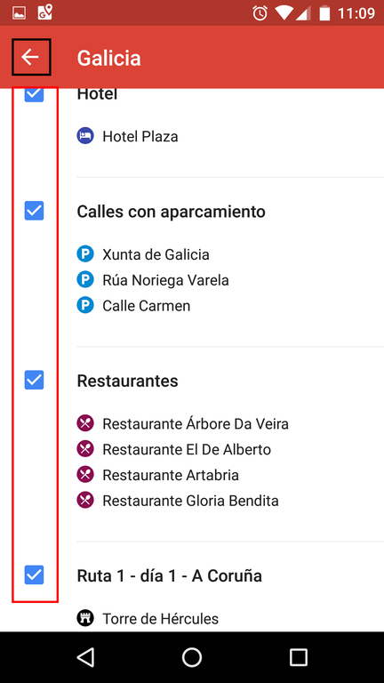](images/seleccionar-capas-queremos-ver.png)

El siguiente paso consiste en presionar encima del punto donde queremos ir. Una vez seleccionado presionamos el botón **Cómo Llegar**.

[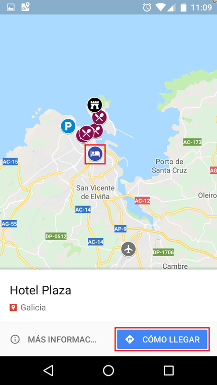](images/elegir-sitio-queremos-visitar.png)

A continuación presionamos en el campo **Elegir un punto de Partida**.

[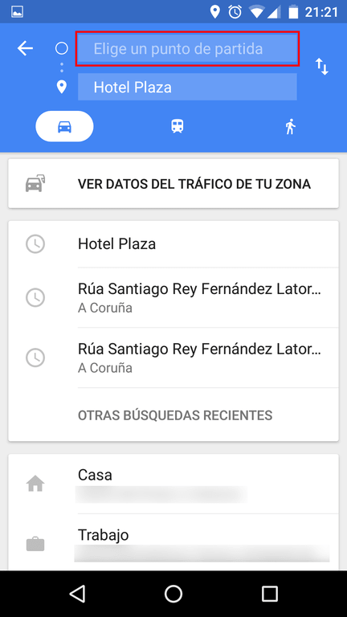](images/editar-punto-de-partida.png)

En el siguiente paso indicaremos el punto de origen que en mi caso quiero que sea mi ubicación actual. Por lo tanto presionaré encima de la opción **Tu ubicación**.

[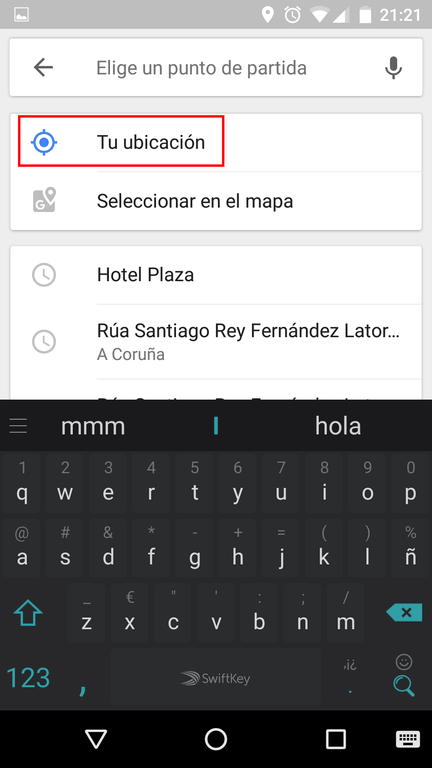](images/indicar-punto-de-partida.png)

Ya para terminar elegimos el medio de transporte que queremos usar para llegar a nuestro destino. En mi caso es elijo transporte público. Acto seguido aparecerán todas las combinaciones de transporte publico que podemos usar para llegar a nuestro destino. Una vez mostradas la opciones clicamos sobre la que más nos interese.

[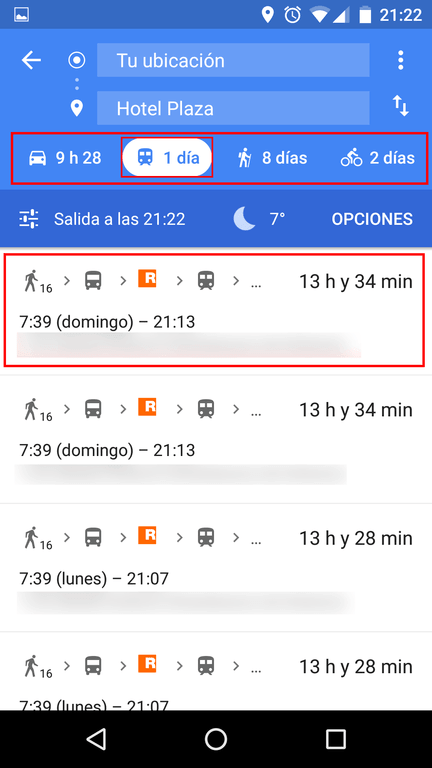](images/seleccionar-medio-transporte.png)

Finalmente tan solo tenemos que presionar sobre el botón **Iniciar**. Una vez presionado el botón se iniciará el navegador GPS de de Google Maps para irnos diciendo paso a paso el recorrido a seguir para llegar a nuestro destino.

[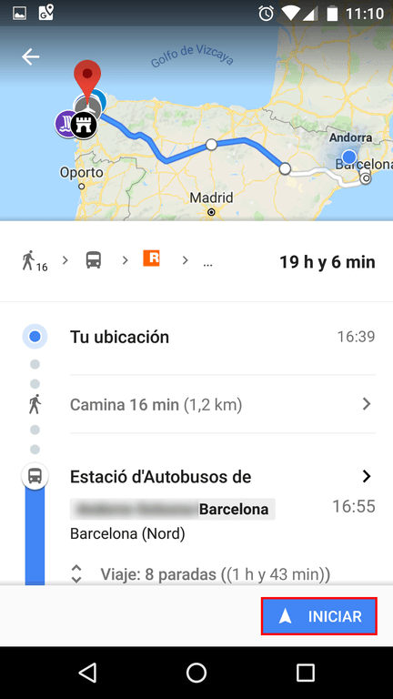](images/iniciar-navegacion-punto-destino.png)

## OTRAS FUNCIONALIDADES DE GOOGLE MAPS Y MY MAPS

Aparte de las funcionalidades vistas hasta el momento Google Maps y My Maps disponen de funcionalidades adicionales. Algunas de estas funcionalidades son las que veréis a continuación.

### Medir distancias en My Maps

En la barra de herramientas de My Maps podemos observar que tenemos una icono para medir distancias y superficies. Usar esta funcionalidad es sumamente sencillo y nos dará una idea bastante clara de la distancia del recorrido que deseamos realizar.

Para medir distancias en My Maps presionamos el icono para medir distancias. A continuación hacemos clic con el mouse en el punto de inicio. Seguidamente vamos siguiendo el camino hasta encontrar un giro. Al encontrar el giro volvemos a presionar el botón izquierdo del ratón y seguimos de nuevo el camino. Vamos siguiendo este proceso hasta llegar al punto de destino. En el punto de destino volvemos a apretar el botón del mouse y obtendremos de forma automática la distancia total del recorrido.

[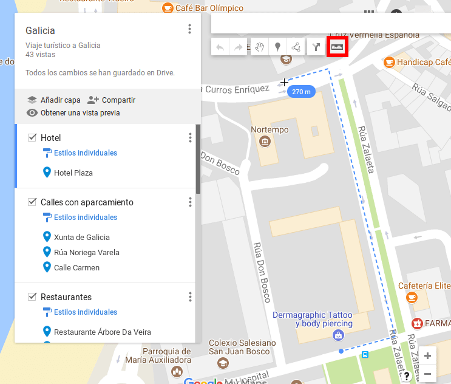](images/medir-distancia-de-un-punto-a-otro.png)

El proceso para medir superficies es exactamente igual que el de medir distancias. El único requisito es que el punto de partida también sea el punto final del recorrido formando así una superficie cerrada.

[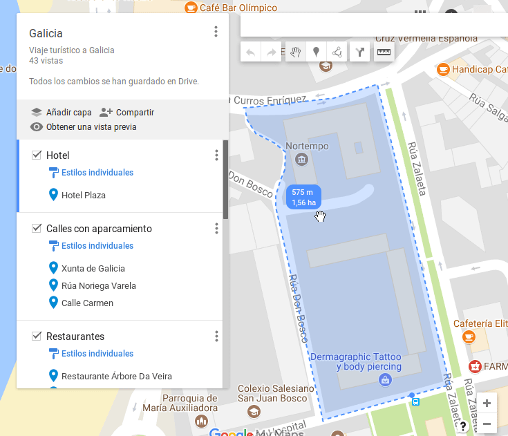](images/medir-distancia-y-superfice.png)

### Compartir nuestros mapas de Google Maps con nuestros amigos

De buenas a primeras los mapas se crean de forma privada. Por lo tanto si queremos que terceras personas tengan acceso a nuestros mapas deberemos compartirlos.

Para compartirlos tenemos que acceder a la siguiente URL:

[https://www.google.com/maps/d/](https://www.google.com/maps/d/ "Link para acceder a My Maps")

Una vez dentro de la URL veremos la totalidad de mapas que nosotros hemos creado. A continuación clicamos encima del mapa que queremos compartir.

[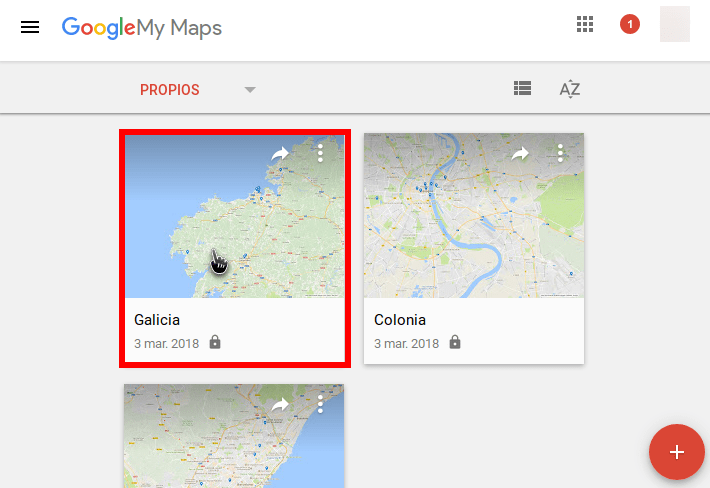](images/abrir-mapa-queremos-compartir.png)

Después de abrirse el mapa que queremos compartir clicamos en la opción **Compartir**.

[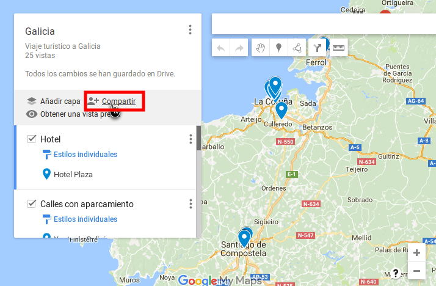](images/presionar-boton-compartir-mapa.png)

Seguidamente realizaremos el siguientes acciones:

1. En el campo **Invitar a personas** introducimos el email de la persona con que queremos compartir nuestro mapa. El email que introducimos para compartir el mapa tiene que estar asociado a una cuenta de Google.
2. A continuación estableceremos los permisos que tendrá la persona con que queremos compartir nuestro mapa. En mi caso otorgo permisos de **Editor**.
3. Si queremos también podemos clicar la opción **Evitar que los otros editores cambien el acceso y añadan nuevos usuarios**. De este modo las personas con que compartimos los mapas no podrán compartir el mapa con otros usuarios ni podrán modificar los permisos de los usuarios que tienen acceso al mapa.
4. Finalmente presionaremos sobre el botón el botón **Enviar**.

[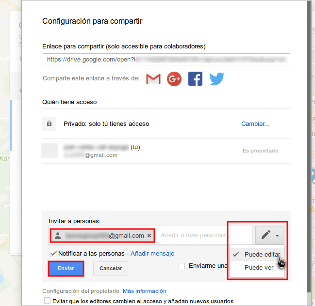](images/compartir-un-mapa-con-un-tercero.png)

Justo después de presionar el botón Enviar se compartirá el mapa. Cuando la persona con que hemos compartido el mapa abra google Maps o entre en My Maps tendrá disponible el mapa compartido para usarlo.

Si lo prefieren tienen otras opciones de compartición clicando en la opción **Cambiar**.

[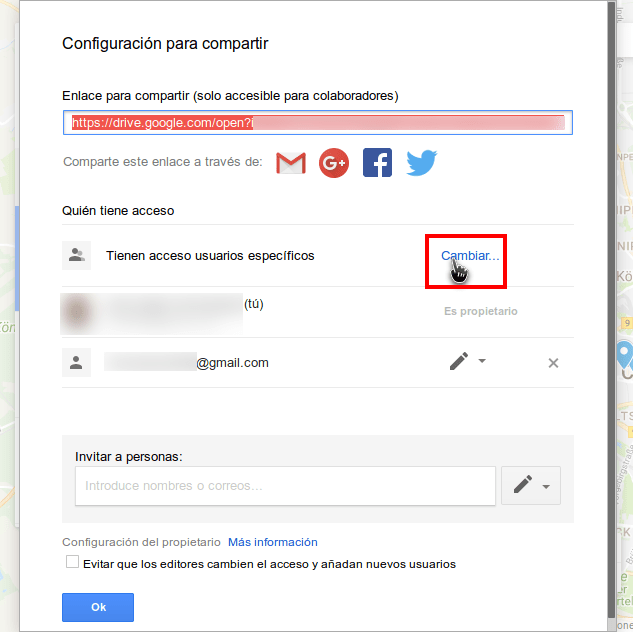](images/ver-otras-opciones-de-comparticion.png)

El hecho de compartir un mapa con determinadas personas proporcionará ciertas ventajas como por ejemplo que varios usuarios puedan y editar y trabajar sobre un mapa de forma simultánea.

Si lo creen conveniente también podrán hacer los mapas públicos publicándolos en la [galería](https://www.google.com/maps/d/?page=explore&hl=es "Link para acceder a la galería de Google My Maps") de Google Maps.

### Añadir desplazamientos dentro en My Maps

Si lo creemos oportuno podemos crear capas adicionales añadiendo rutas entre puntos introducidos en el mapa.

Para ello disponemos de 2 opciones en el panel de herramientas de My Maps. Podéis usar indistintamente cualquiera de las 2.

[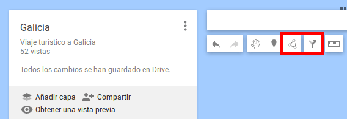](images/herramientas-para-indicar-rutas.png)

En este caso de ejemplo usaré la herramienta **Añadir indicaciones**. Por lo tanto inicialmente clico en el icono de Añadir indicaciones.

[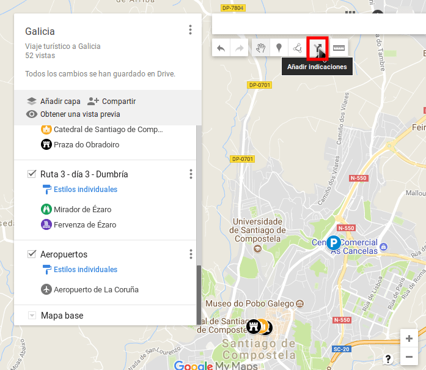](images/añadir-indicaciones-de-my-maps-de-google.png)

A continuación clico en el que queremos que sea el punto de partida de nuestra ruta.

[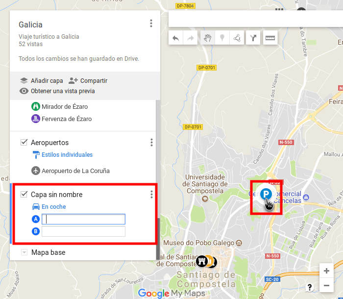](images/indicar-punto-de-partida-ruta.png)

Seguidamente clico en el punto de destino y de forma automática se calculará una ruta.

[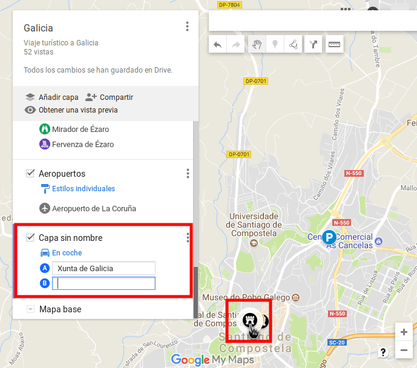](images/indicar-punto-de-destino-ruta.png)

Si queremos podemos tantos puntos como queramos a nuestra ruta. Si queremos añadir un tercer punto clicaremos en la opción **Añadir destino**.

[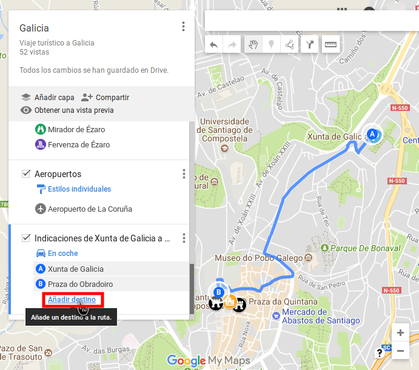](images/añadir-un-tercer-destino-ruta.png)

Seguidamente clicaremos en el tercer punto para obtener una ruta con 3 puntos de visita.

[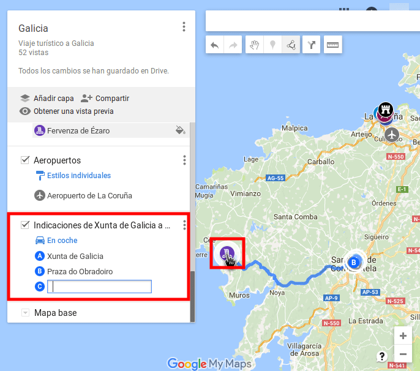](images/punto-final-ruta.png)

Finalmente indicaremos el medio de transporte en que queremos realizar la ruta indicada. En mi caso selecciono el coche como medio de transporte.

[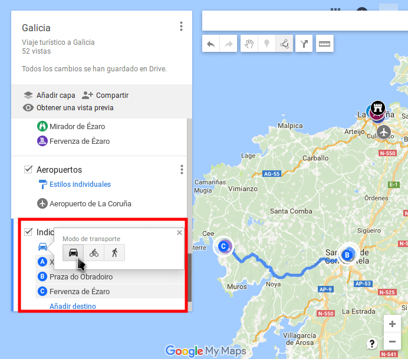](images/seleccionar-medio-transporte-ruta.png)

Si queremos, como forma opcional y para hacer más entendedor, podemos asignar un nombre a la capa que contiene la ruta de transporte que acabamos de crear.

Ya para finalizar solo decirles que siguiendo los simples consejos mencionados en este artículo podrán viajar donde crean conveniente de forma fácil y sencilla.
