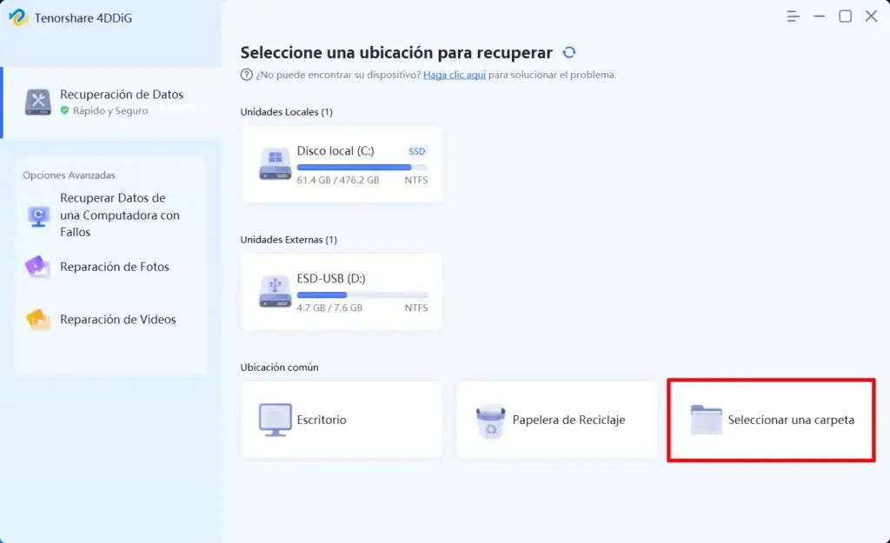
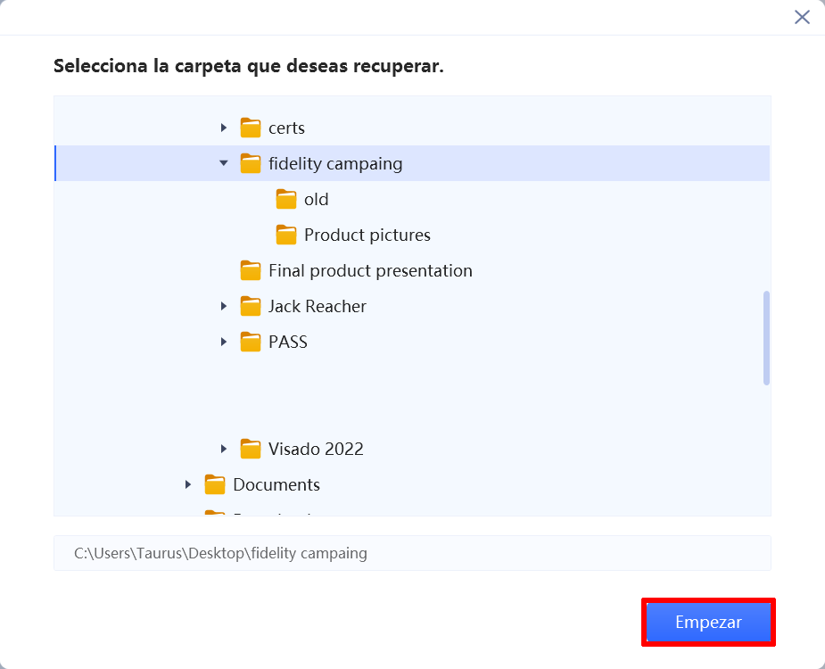
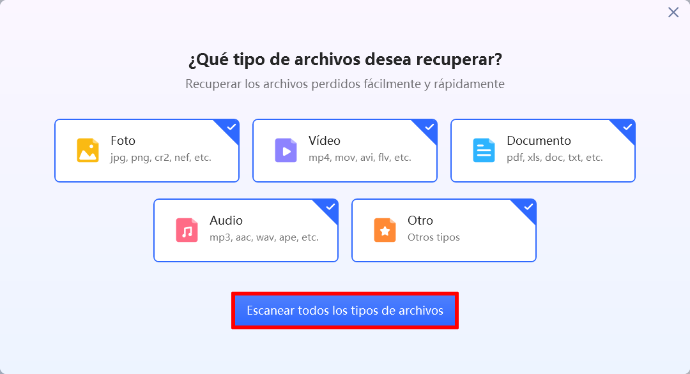
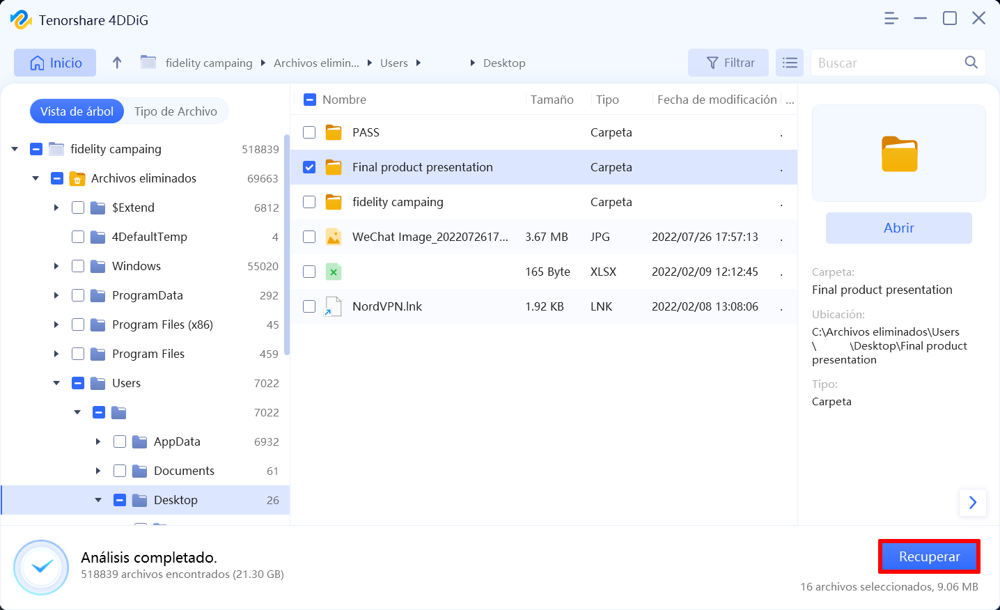
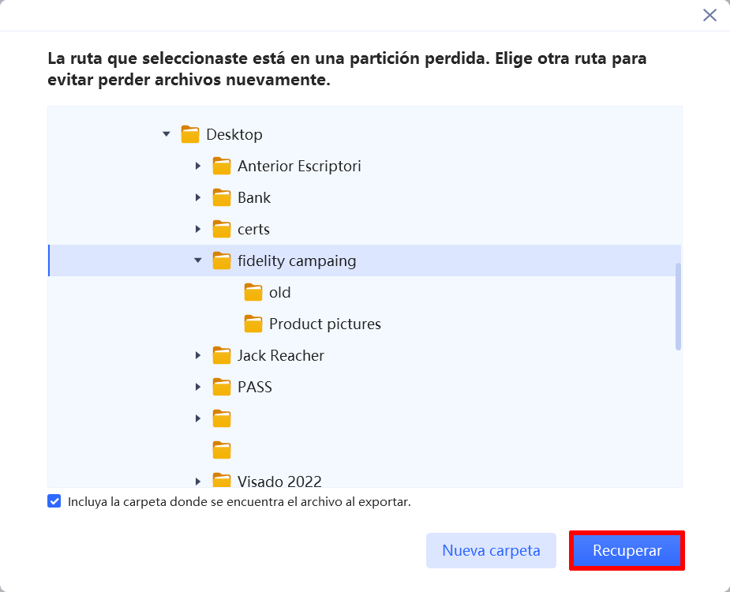
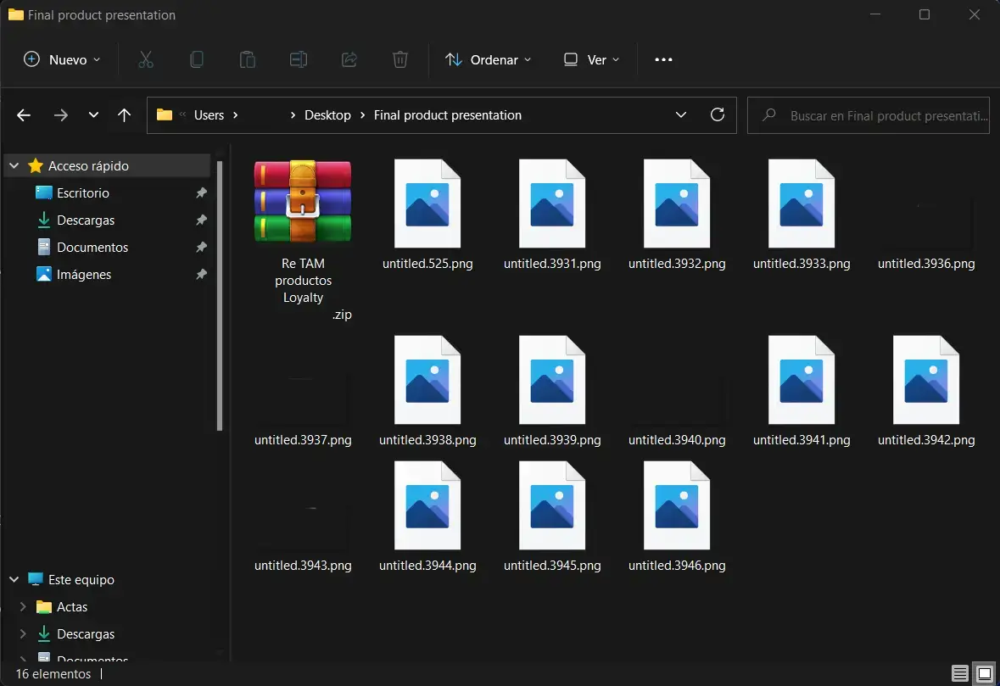
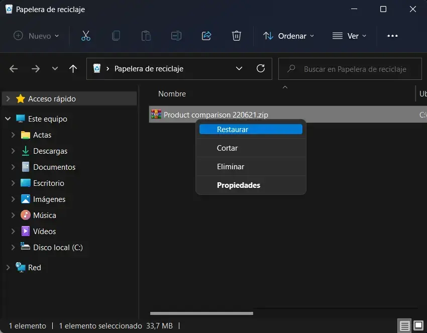
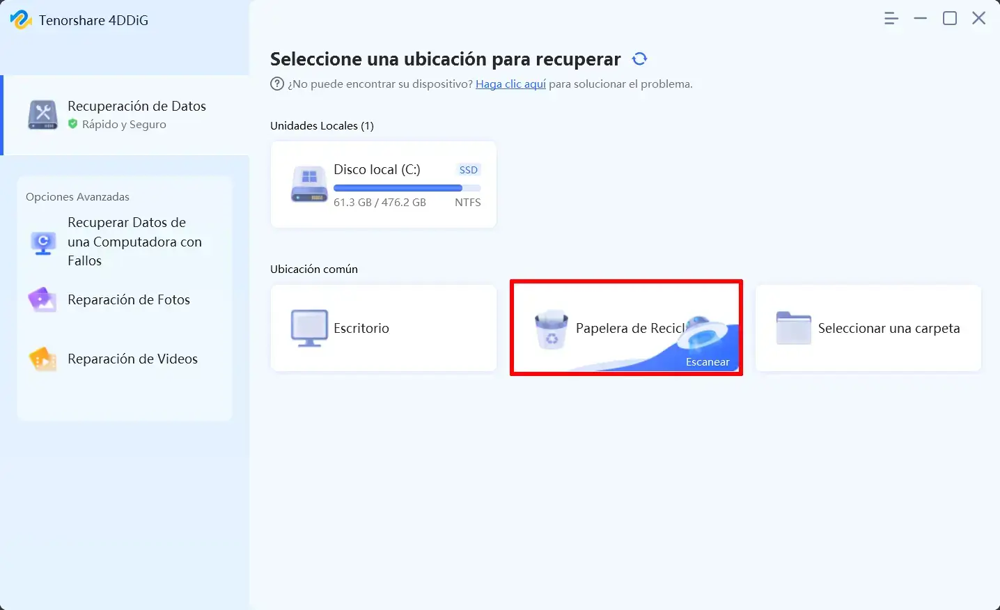
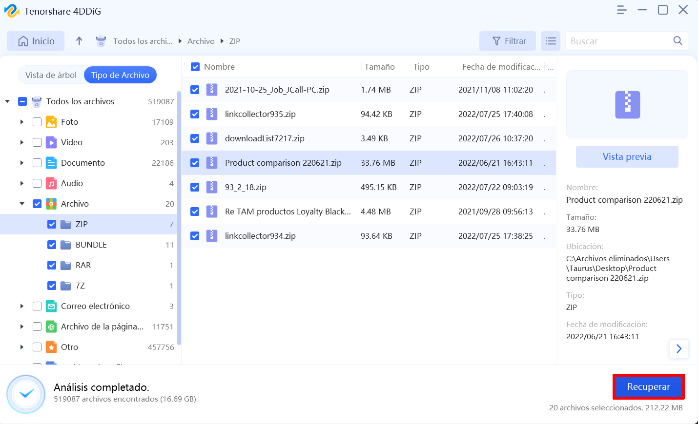

Por segunda vez en mi vida estaba buscando una carpeta en la que tenía unos documentos de trabajo y sorprendentemente no estaba donde tenia que estar. Antes de entrar en pánico he usado el buscador de Windows y a posteriori he mirado en la papelera de reciclaje, pero desafortunadamente la información no estaba. Frente esta situación he consultado el departamento de informática de mi empresa y como en este caso no había copia de seguridad han decidido usar un software profesional para intentar recuperar carpetas borradas. En este caso el software utilizado ha sido [4DDIG](https://4ddig.tenorshare.com/es/windows-data-recovery.html) y para mi suerte el resultado ha sido satisfactorio. El procedimiento que seguimos fue el siguiente.<!--more-->

## MÉTODO 1: UTILIZAR EL MEJOR PROGRAMA PARA RECUPERAR CARPETAS BORRADAS EN WINDOWS 10

El procedimiento a seguir para solucionar mi problema ha sido relativamente sencillo. Tan solo he tenido que [descargar 4DDIG](https://4ddig.tenorshare.com/es/windows-data-recovery.html) e instalarlo en el equipo.

**Nota:** Es recomendable instalar 4DDIG en una partición distinta a la que se han perdido los datos.

### Seleccionar la unidad o ubicación donde recuperar las carpetas borradas

Una vez finalizada la instalación abrimos el programa y aparecerá la siguiente pantalla en la que tendremos que seleccionar la unidad o ruta donde tendría que estar la carpeta borrada. En mi caso la información que he perdido se hallaba dentro del directorio `C:\Users\empresa\Desktop\fidelity campaing`. Por lo tanto en la primera pantalla selecciono la opción de `Seleccionar Carpeta.`

Seguidamente seleccionamos la ruta más cercana en la que estaba el contenido eliminado por accidente, que en mi caso es `C:\Users\empresa\Desktop\fidelity campaing`. Acto seguido presionaremos el botón `EMPEZAR` para iniciar el escaneo de información perdida.

### Seleccionar el tipo de fichero recuperar

A continuación tenemos que seleccionar el tipo de fichero que queremos recuperar. En mi caso no recordaba los tipos de ficheros almacenados en la carpeta borrada, por lo tanto lo mejor es clicar encima del botón `Escanear todos los tipos de archivos`

### Proceso de escaneo de los ficheros perdidos

Seguidamente empezará el escaneo para tratar de recuperar la información borrada accidentalmente. En mi caso, al dar una ruta muy concreta, el proceso de escaneo ha sido extremadamente corto. Los resultados obtenidos después del escaneo han sido los siguientes:

Si os fijáis los archivos a recuperar se clasifican por directorios. En la captura de pantalla anterior hay una explicación clara del contenido que encontraremos en cada uno de los directorios.

### Buscar la carpeta a restaurar e instrucciones de como recuperar una carpeta eliminada

Navegando dentro del directorio de `Archivos eliminados` he podido encontrar de forma rápida y sencilla la carpeta que borre accidentalmente. Una vez encontrada tan solo hay que seleccionarla y presionar encima del botón `Recuperar`.

Nótese 4DDIG ofrece varias herramientas para localizar la/s carpeta/s y/o fichero/s a restaurar. Algunas de ellas son:

1. Diferentes tipos de vista. Existe la vista por tipo de archivo y la vista de árbol.
2. Filtros por tipo de archivo, filtros por tamaño de archivo y por fecha de modificación.
3. Previsualización los ficheros antes de restaurarlos. De esta forma podemos asegurar que lo que vamos a restaurar es lo que necesitamos.

### Seleccionar la ruta de restauración

El último de los pasos consiste en definir el directorio en que queremos restaurar la carpeta que eliminé accidentalmente. Una vez seleccionada la unidad y la ruta en la que quieren recuperar el contenido tan solo hay que volver a clicar encima del botón `Recuperar`.

**Nota:** Es recomendable que la ruta de recuperación esté en una partición distinta a la que se han perdido los datos.

### Muestra del contenido restaurado

Finalmente tan solo tenemos que navegar en la ruta que seleccionamos para recuperar el contenido. En mi caso pueden ver el contenido recuperado en la siguiente captura de pantalla.

Les recomiendo que accedan al siguiente enlace para obtener una guía mucho más completa de como [recuperar carpetas borradas con 4DDIG](https://4ddig.tenorshare.com/es/4ddig-windows-data-recovery-guide.html)

## MÉTODO 2: CÓMO RECUPERAR UNA CARPETA ELIMINADA DESDE LA PAPELERA

Otra opción alternativa a la que he citado en el apartado anterior es intentar recuperar las carpetas eliminadas mediante la opción de la papelera de reciclaje del software 4DDIG.

Para ello lo primer que hay que realizar es entrar la papelera de reciclaje de Windows y mirar si el contenido borrado aún se encuentra dentro de la papelera de reciclaje. En el caso que el contenido se encuentra allí lo seleccionan y lo restauran del siguiente modo:

En el caso que no podamos encontrar el contenido borrado accidentalmente podemos usar de nuevo 4DDIG. Para ello tenemos que tener en cuenta que toda carpeta/fichero acostumbra a pasar por la papelera de reciclaje antes de ser borrado totalmente. Por lo tanto cuando abramos el programa 4DDIG tan solo tenemos que seleccionar la unidad `Papelera de Reciclaje`

Acto seguido seleccionamos el tipo de fichero a recuperar. Tal y como hicimos en apartados anteriores seleccionamos la opción `Escanear todos los tipos de archivos`.

Finalmente podremos seleccionar y recuperar el contenido que previamente haya sido eliminado de la Papelera de reciclaje.

## MÉTODO 3: RECUPERAR CARPETAS BORRADAS EN WINDOWS RESTAURÁNDOLO A VERSIONES ANTERIORES

Si no les funciona ninguna de las opciones anteriores les recomiendo usar la herramienta de versiones anteriores de su sistema operativo Windows 10 o Windows 11. Para saber como recuperar carpetas borradas mediante las versiones anteriores de Windows les recomiendo que visiten el siguiente [enlace]().

https://geekland.eu/recuperar-archivos-borrados-sin-programas-windows/

## CONCLUSIONES SOBRE RECUPERAR CARPETAS BORRADAS EN WINDOWS

Mis reflexiones después de usar el software 4DDIG para recuperar carpetas borradas son las siguientes:

1. Es un software con una interfaz intuitiva y es fácil de utilizar. Además dispone de herramientas que permiten filtrar y buscar con facilidad los ficheros y carpetas que quieren recuperar.
2. Permite recuperar más de 1000 tipos de archivos. Obviamente puede recuperar los tipos de archivo más comunes como por ejemplo archivos de vídeo, de imagen, de audio, etc.
3. En el artículo no mostramos el 100% de funcionalidades del software. Por ejemplo 4DDIG también permite crear un USB de arranque para poder recuperar datos e información de ordenadores que simplemente no arrancan. Del mismo modo permite recuperar fotos y vídeos dañados, puede recuperar datos de dispositivos de almacenamiento externo, etc.
4. Este software no elimina la necesidad de realizar copias de seguridad. Este software, al igual que todos sus homólogos, no garantiza al 100% la recuperación de ficheros y carpetas borrados. Cuando más antiguo sea el fichero o carpeta a recuperar menores serán las posibilidades de recuperación. Por lo tanto realicen copias de seguridad.
5. Hasta el momento no lo he citado, pero se trata de un software por el que hay que pasar por caja antes de usarlo. Su coste y política de precios no son de mi total agrado. Si quieres una licencia de por vida el coste es de 120,99 Euros lo cual no creo que esté mal. El problema viene en que si quieres adquirir una licencia de 1 mes el coste no es ni más ni menos que 55,65 Euros. Pueden dirigirse en el siguiente enlace en el caso que quieran adquirir una licencia de uso. (En la página web de [4DDIG](https://4ddig.tenorshare.com/es/buy-4ddig-windows-data-recovery.html) acostumbran a ofrecer cupones de descuento del 30%)
