En anteriores ocasiones he hablado de cómo recuperar datos perdidos en medios de almacenamiento como discos duros o memorias USB. En el caso que ninguno de los métodos mencionados les haya funcionado siempre tenemos la opción de usar una opción profesional como por ejemplo Disk Drill. Disk Drill es un software que ofrece las siguientes opciones.<!--more-->

## POSIBILIDADES Y FUNCIONALIDADES DE DISK DRILL

Disk Drill tiene varias utilidades. Algunas de ellas son las que se detallan a continuación:

1. Recuperar datos borrados o formateados por accidente o intencionadamente de una unidad de almacenamiento.
2. Intentar recuperar datos de un medio de almacenamiento que se ha corrompido como por ejemplo una memoria USB.
3. Para realizar imágenes de una unidad que posteriormente podremos quemar en cualquier otro medio de almacenamiento. Esta opción es útil para guardar una copia de seguridad del disco en el que estamos intentando recuperar los datos. También es útil en el caso que queramos clonar un disco duro o memoria USB.
4. Recuperación de particiones que hemos eliminado.
5. Incrementar las opciones de recuperación gracias a mecanismos como Recovery Vault.
6. Etc.

###### Nota: Estas son las funcionalidades del software para Windows. La versión para Mac dispone de más funciones que la de Windows. La versión de Mac OS dispone de características más avanzadas, como por ejemplo realizar una copia de seguridad de todos los ficheros que se van borrando.

Además Disk Drill es capaz de recuperar datos en las siguientes unidades de almacenamiento:

1. Discos duros internos y externos de un ordenador.
2. Dispositivos de almacenamiento USB.
3. Memorias Flash de por ejemplo cámaras fotográficas.
4. Memorias de almacenamiento de nuestros dispositivos móviles con iOS o Android
5. Etc.

Una vez vistas las posibilidades de Disk Drill pasaremos a ver las instrucciones de instalación y uso.

## INSTALAR DISK DRILL PARA RECUPERAR NUESTROS ARCHIVOS

Para descargar el programa tienen que visitar la siguiente web:

[https://www.cleverfiles.com/es/usb-flash-drive-recovery.html](https://www.cleverfiles.com/es/usb-flash-drive-recovery.html "Link para descargar e instalar Disk Drill")

Una vez dentro de la web tienen que descargar el software clicando sobre el botón Descarga Gratuita.

[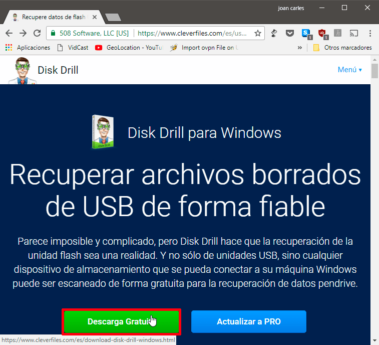](images/descargar-disk-drill.png)

A continuación, hacen doble clic sobre el archivo ejecutable que han descargado y empezará el proceso de instalación del programa.

[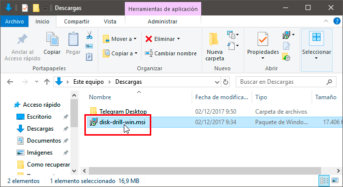](images/instalar-disk-drill.png)

El proceso de instalación no tiene ningún secreto. Al igual que la mayoría de programas en Windows tan solo tenemos que ir clicando la opción Siguiente.

Una vez finalizada la instalación estaremos listos para que usted recupere los archivos de la unidad flash o cualquier otro medio de almacenamiento. A modo de ejemplo veremos la recuperación de una unidad flash.

## RECUPERE DATOS DE LA UNIDAD FLASH O CUALQUIER OTRA UNIDAD DE ALMACENAMIENTO

Justo en el momento que detectemos que hemos borrado información por accidente tenemos que intentar recuperar nuestros datos. Es importante no aplazar el proceso de recuperación ya que cuanto más uso hagamos de nuestro dispositivo de almacenamiento, menores serán las posibilidades de recuperación de nuestros datos.

Por lo tanto, en el momento que detectemos la pérdida de archivos tenemos que abrir Disk Drill de inmediato. Al abrir el programa veremos de forma detallada los dispositivos de almacenamiento y particiones disponibles.

En el dispositivo de almacenamiento que contiene la información que hemos perdido clicamos encima de la flecha que señala hacia abajo y cuando aparezca el menú contextual clicamos en la opción Run all recovery methods.

[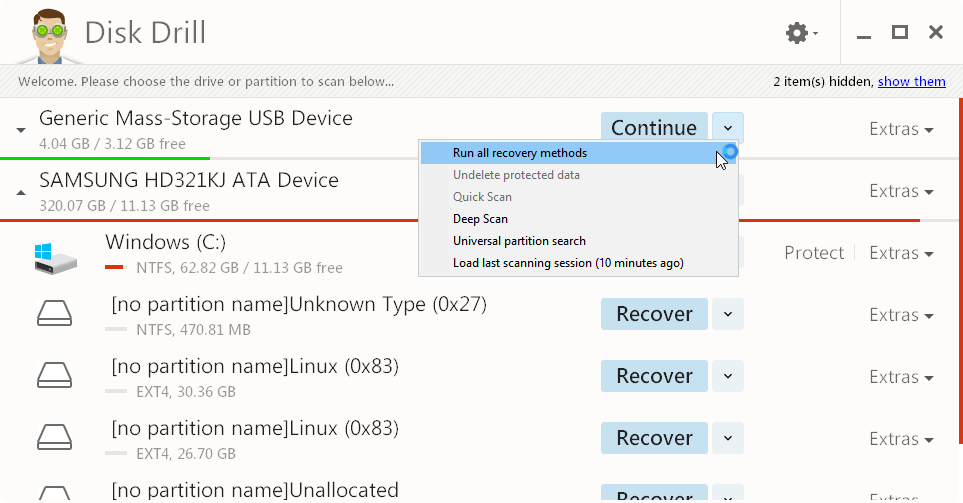](images/aplicar-todos-metodos-recuperacion-archivos.png)

A continuación, tan solo tenemos que dejar trabajar al programa. Con la opción seleccionada Disk Drill aplicará la totalidad de mecanismos disponibles para intentar recuperar nuestros archivos borrados. Una vez finalizado el proceso de recuperación obtendremos un resultado parecido al siguiente:

[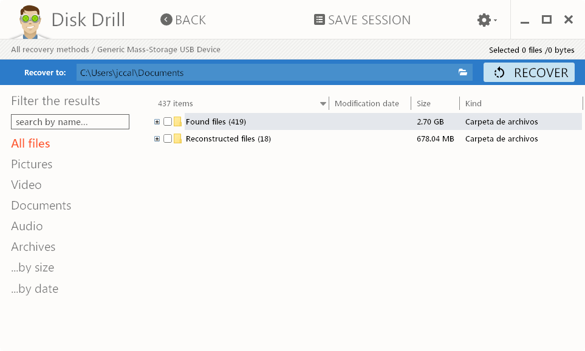](images/datos-recuperados-aplicando-todos-metodos.png)

En la carpeta found files encontraremos los archivos borrados que Disk Drill ha sido capaz de encontrar en nuestro dispositivo de almacenamiento. Estos archivos son susceptibles de ser recuperados sin perder ningún tipo de propiedad ni metadato. Por lo que he podido experimentar, gran parte de estos 419 archivos no han sido recuperables en mi caso.

[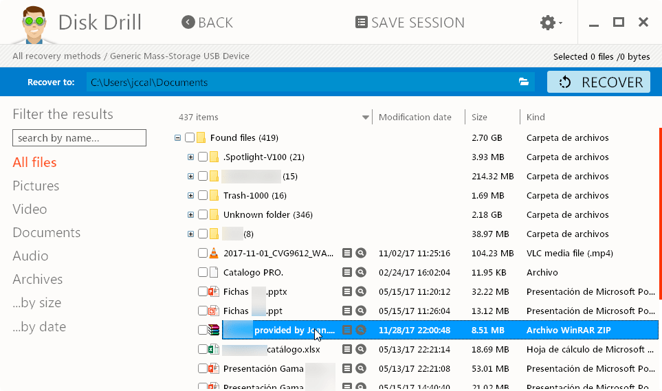](images/ficheros-recupearar-todas-las-propiedades.png)

En la carpeta Reconstructed files encontramos los archivos que Disk Drill puede recuperar usando sus algoritmos binarios. Los archivos recuperados mediante algoritmos binarios se podrán abrir prácticamente todos, pero perderán la totalidad de metadatos, por lo tanto los archivos recuperados perderán su nombre original.

[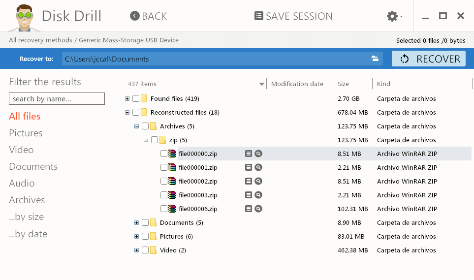](images/ficheros-recuperados-algoritmos-binarios.png)

Para intentar recuperar los archivos, tan solo tenemos que tildar los archivos que deseamos recuperar y presionar en el botón RECOVER. Acto seguido los archivos se restaurarán en la ubicación que nosotros hayamos definido que en mi caso es C:\\Users\\jccal\\Documents. En este momento podemos afirmar que ha terminado la recuperación de los datos del USB.

[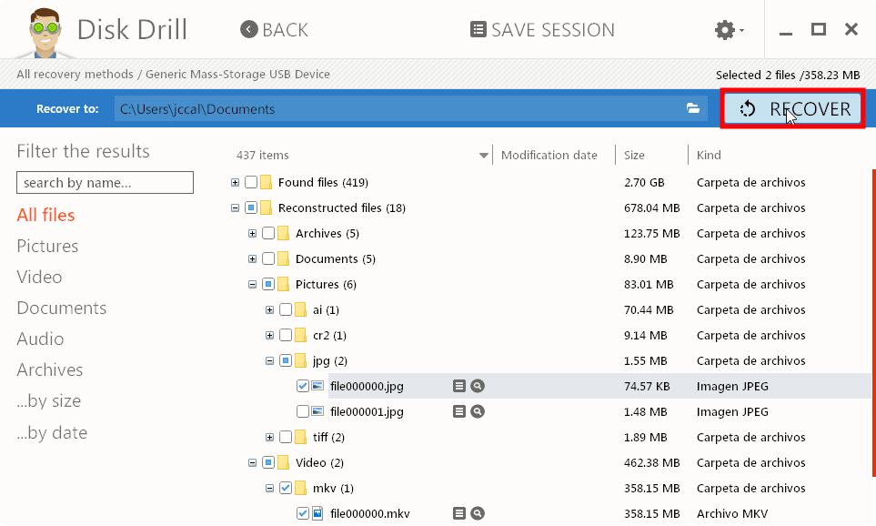](images/recuperar-ficheros-borrados.png)

###### Nota: Es recomendable que el contenido recuperado se almacene en una unidad distinta a la que estamos intentando recuperar los datos.

Si no habéis sido capaces de encontrar y restaurar los archivos eliminados, les recomiendo que inicien un simple escaneo profundo. Para ello, en la unidad en que queremos recuperar los datos clicamos en la flecha que apunta hacia abajo y cuando se despliegue el menú contextual clicamos encima de la opción Deep Scan.

[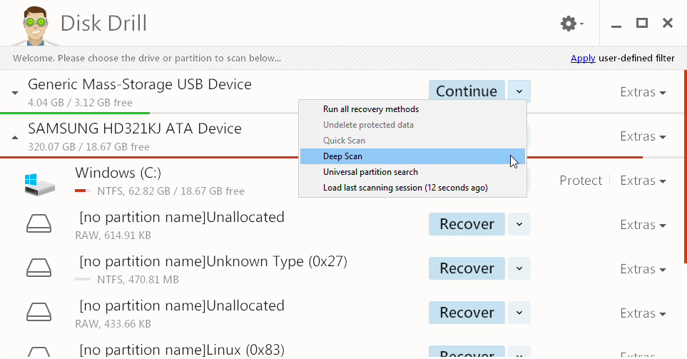](images/realizar-escaneo-profundo.png)

Acto seguido hay que dejar que el programa trabaje para intentar recuperar los archivos. En mi caso, una vez finalizado el proceso he encontrado 147 archivos borrados susceptibles de ser recuperados. Además, la gran mayoría de estos 147 archivos se pueden recuperar y abrir sin problema alguno.

[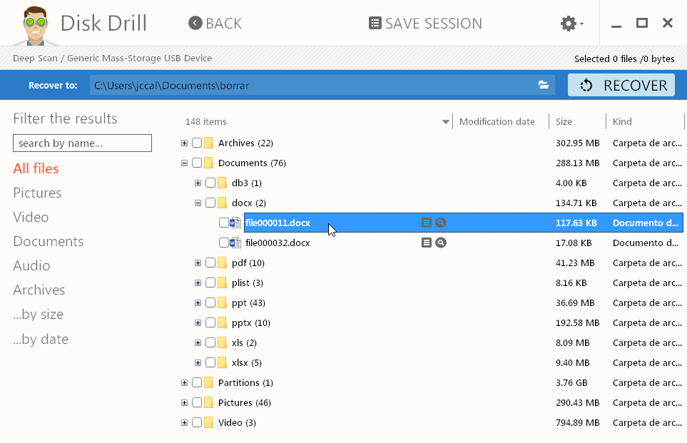](images/archivos-recuperados-escaneo-profundo.png)

El resultado es sorprendentemente porque un software reconocido como Recuva apenas es capaz de recuperar 14 archivos.

[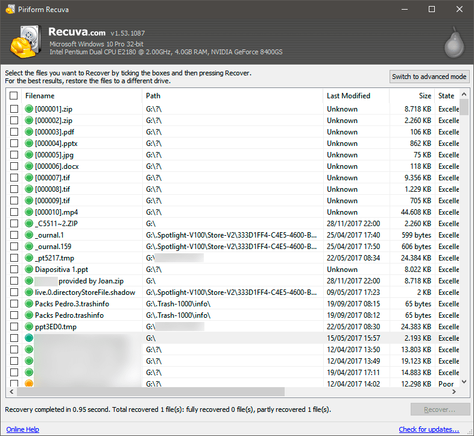](images/resultados-obtenidos-recuva.png)

## COMPARACIÓN ENTRE DISK DRILL Y RECUVA

Disk Drill es un software de pago con licencia propietaria. Además, cuando hay que recuperar datos borrados, lo primero que te viene a la mente es la versión gratuita de Recuva. Por lo tanto, ¿Vale la pena comprar una licencia de Disk Drill?

Para responder a esta pregunta he realizado una pequeña comparación entre la versión Gratuita de Recuva y Disk Drill. Los resultados obtenidos son los que se muestran a continuación:

  
|   |   **DISK DRILL**   |   **RECUVA**   |
| --- | --- | --- |
| _Facilidad de instalación_ |   Sí   |   Sí   |
| _Facilidad de uso_ |   Sí   |   Sí   |
| _Tiempo de recuperación (escaneo profundo)_ |   4 min 38 s   |   3 min 40 s   |
| _Consumo de CPU en escaneo profundo_ |   60%   |   6%   |
| _Ficheros encontrados susceptibles de ser recuperados_ |   419   |   411   |
| _Número archivos recuperados_ |   147   |   14   |
| _Extensiones de archivo que se pueden recuperar_ |   más de 300   |   39   |
| _Sistemas operativos en que puede recuperar datos_ |   Android, Windows, Linux, iOS, Mac OS   |   Windows, Linux   |
| _Multiplataforma_ |   Mac OS, Windows   |   Windows   |
| _Sistemas de ficheros soportados_ |   HFS/HFS, FAT, FAT32, ExFAT, NTFS, NTFS5, EXT2, EXT3, EXT4   |   FAT, FAT32, exFAT, NTFS, NTFS5 y NTFS + EFS, EXT2, EXT3, EXT4   |
| _Recuperación de datos perdidos en Raid_ |   Sí   |   No   |
| _Escaneo de archivos en una unidad virtual_ |   Sí   |   Disponible versión Pro   |
| _Capacidad para realizar imágenes de un disco_ |   Sí   |   No   |
| _Proteger carpetas y archivos importantes_ |   Sí   |   No   |
| _Recuperación de particiones borradas_ |   Sí   |   No   |
| _Pausar, grabar y reiniciar los escaneos_ |   Sí   |   No   |
| _Idiomas disponibles_ |   1 (Inglés)   |   45   |
| _Coste económico_ |   $89,00   |   Gratis o 24,95 €   |

###### Nota: Los resultados mostrados corresponden a la recuperación de una unidad flash USB de 4 GB. En ambos casos se ha realizado un escaneo profundo para intentar recuperar la máxima cantidad de archivos posible.

Como se puede observar, Disk Drill es capaz de recuperar más cantidad de información que Recuva. Además dispone de más opciones para poder recuperar nuestros datos de forma cómoda, efectiva y con menos riesgo de perderlos.

Por todos estos motivos pienso que Disk Drill es mucho mejor opción que Recuva tanto en el ámbito doméstico como en el profesional.

Por lo tanto, si lo creen conveniente pueden acceder a la siguiente URL:

[https://www.cleverfiles.com/es/free-data-recovery.html](https://www.cleverfiles.com/es/free-data-recovery.html "Link para comprar una licencia de Disk Drill")

Seguidamente clican encima del botón Actualizar a PRO y siguen las instrucciones para adquirir la licencia que más les convenga.

[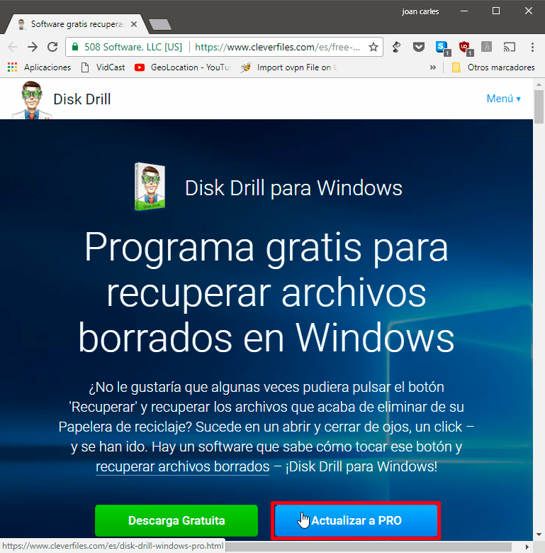](images/actualizar-licencia-pro.png)

## RECOMENDACIONES EN EL MOMENTO DE RECUPERAR DATOS BORRADOS

Para incrementar las posibilidades de éxito al recuperar datos eliminados es importante seguir las siguientes recomendaciones:

1. No hay que aplazar el proceso de recuperación de datos. Tan pronto seamos conscientes que se han perdido datos hay que iniciar el proceso de recuperación.
2. Hay que minimizar las escrituras y operaciones en los medios de almacenamiento que hay que recuperar datos. Para ello podemos proteger contra escritura los dispositivos en los que tenemos que recuperar datos.
3. Una buena práctica para realizar la recuperación de datos es trabajar en una imagen del medio de almacenamiento afectado. No es recomendable trabajar directamente sobre la unidad en que se han borrado los datos porque disminuye las posibilidades de recuperar los datos.
4. En el caso que no obtengamos resultados satisfactorios no se desesperen. Intenten probar otro software y quizás obtendrán mejores resultados.

Para finalizar solo decir que si están leyendo este artículo les deseo suerte en la recuperación de vuestros datos.
