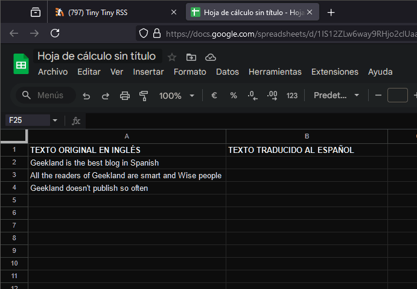
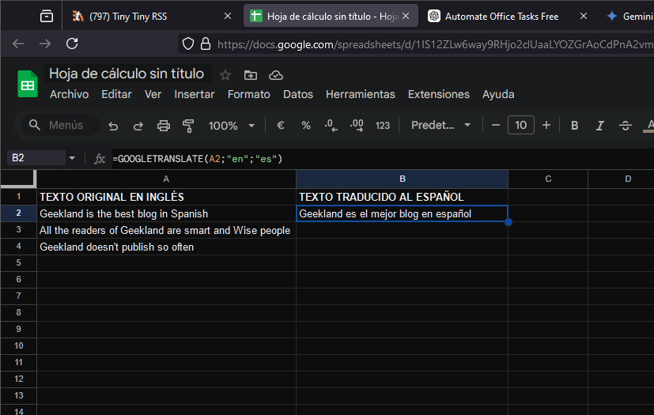
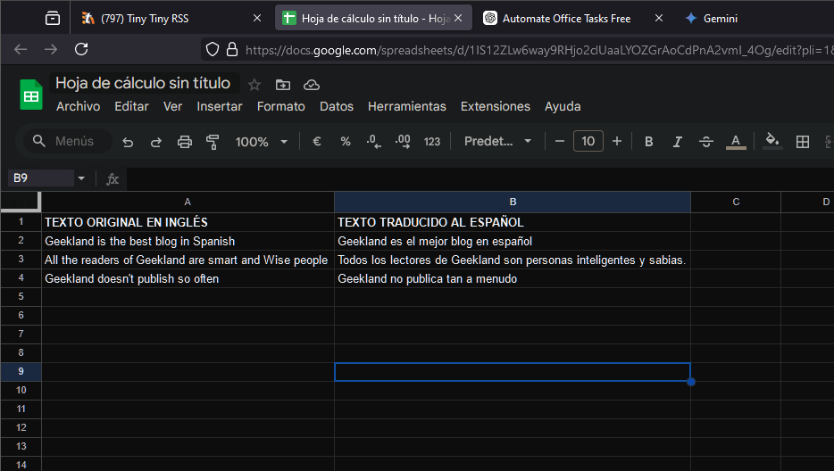

En este artículo, exploraremos cómo usar la hoja de cálculo Google Sheets para traducir textos de un idioma a otro de manera automática y eficiente. Esta herramienta puede ser especialmente útil y eficiente para proyectos multilingües, informes, y en el momento de traducir grandes volúmenes de texto automáticamente. Aquí te mostramos cómo hacerlo paso a paso.<!--more-->

## ¿ POR QUÉ USAR GOOGLE SHEETS PARA TRADUCIR?

Existen muchas formas de traducir textos, pero si necesitas traducir contenido ya presente en una hoja de cálculo, Google Sheets es una excelente opción. A continuación, te explico por qué:

1. **Eficiencia**: Con una sola fórmula, puedes traducir cientos de miles de líneas de manera extremadamente rápida, ahorrando tiempo y esfuerzo.
2. **Calidad**: Las habilidades de traducción de Google son bastante buenas y mejoran constantemente. En poco tiempo, podrían ofrecer traducciones similares a las de un humano.
3. **Actualización automática:** Las traducciones se actualizan automáticamente si modificas el texto original, facilitando la gestión de documentos multilingües.

## COMO TRADUCIR TEXTOS EN LA HOJA DE CÁLCULO GOOGLE SHEETS

Primero, abre una nueva hoja en Google Sheets y organiza tus textos originales en una columna, por ejemplo, en la columna A tenemos el texto en un idioma extranjero que en mi caso es el inglés:



A continuación utilizaremos la función o fórmula a `GOOGLETRANSLATE` para realizar las traducciones de cada una de las casillas. La sintaxis de la fórmula google translate es la siguiente:

> ```
> =GOOGLETRANSLATE(texto;"idioma_origen";"idioma_destino") 
> ```

- **texto:** El texto a traducir. Aquí tendremos que indicar la casilla que queremos traducir.
- **idioma\_origen:** Código del idioma original (por ejemplo, "en" para inglés). El texto a usar para definir el idioma de origen lo encontrarán en apartado `Código para definir cara uno de idiomas a traducir`.
- **idioma\_destino:** Código del idioma de destino (por ejemplo, "es" para español). El texto a usar para definir el idioma de destino lo encontrarán en apartado `Código para definir cara uno de idiomas a traducir`.

Por lo tanto En la celda donde quieres que aparezca la traducción, escribe la fórmula. Por ejemplo, para traducir el texto presente en la celda A2 del inglés al español:

> ```
> =GOOGLETRANSLATE(A2;"en";es") 
> ```



Su ahorra arrastramos la fórmula conseguiremos la totalidad de traducciones de forma extremadamente rápida y sencilla.



## CÓDIGO PARA DEFINIR CADA UNO DE LOS IDIOMAS A TRADUCIR

Pare definir los idiomas de origen y destino tienen que usar las siguientes nomenclaturas:

| Código | Idioma |
| --- | --- |
| af | Afrikaans |
| sq | Albanés |
| am | Amárico |
| ar | Árabe |
| hy | Armenio |
| az | Azerí |
| eu | Vasco |
| be | Bielorruso |
| bn | Bengalí |
| bs | Bosnio |
| bg | Búlgaro |
| ca | Catalán |
| ceb | Cebuano |
| ny | Chichewa |
| zh-CN | Chino (Simplificado) |
| zh-TW | Chino (Tradicional) |
| co | Corso |
| hr | Croata |
| cs | Checo |
| da | Danés |
| nl | Holandés |
| en | Inglés |
| eo | Esperanto |
| et | Estonio |
| tl | Filipino |
| fi | Finés |
| fr | Francés |
| fy | Frisón |
| gl | Gallego |
| ka | Georgiano |
| de | Alemán |
| el | Griego |
| gu | Guyaratí |
| ht | Criollo Haitiano |
| ha | Hausa |
| haw | Hawaiano |
| he | Hebreo |
| hi | Hindi |
| hmn | Hmong |
| hu | Húngaro |
| is | Islandés |
| ig | Igbo |
| id | Indonesio |
| ga | Irlandés |
| it | Italiano |
| ja | Japonés |
| jw | Javanés |
| kn | Canarés |
| kk | Kazajo |
| km | Jemer |
| rw | Kinyarwanda |
| ko | Coreano |
| ku | Kurdo |
| ky | Kirguís |
| lo | Lao |
| la | Latín |
| lv | Letón |
| lt | Lituano |
| lb | Luxemburgués |
| mk | Macedonio |
| mg | Malgache |
| ms | Malayo |
| ml | Malabar |
| mt | Maltés |
| mi | Maori |
| mr | Maratí |
| mn | Mongol |
| my | Birmano |
| ne | Nepalí |
| no | Noruego |
| or | Oriya |
| ps | Pastún |
| fa | Persa |
| pl | Polaco |
| pt | Portugués |
| pa | Punjabi |
| ro | Rumano |
| ru | Ruso |
| sm | Samoano |
| gd | Gaélico Escocés |
| sr | Serbio |
| st | Sesotho |
| sn | Shona |
| sd | Sindhi |
| si | Cingalés |
| sk | Eslovaco |
| sl | Esloveno |
| so | Somalí |
| es | Español |
| su | Sundanés |
| sw | Suajili |
| sv | Sueco |
| tg | Tayiko |
| ta | Tamil |
| tt | Tártaro |
| te | Telugu |
| th | Tailandés |
| tr | Turco |
| tk | Turcomano |
| uk | Ucraniano |
| ur | Urdu |
| ug | Uigur |
| uz | Uzbeko |
| vi | Vietnamita |
| cy | Galés |
| xh | Xhosa |
| yi | Yidis |
| yo | Yoruba |
| zu | Zulú |

Estos códigos permitirán definir los idiomas para traducir textos automáticamente entre diferentes idiomas utilizando Google Sheets.

## LIMITES DE USO

Aunque Google Sheets es una herramienta poderosa, existen limitaciones en la cantidad de traducciones que puedes realizar en un periodo de tiempo corto. No obstante puedo garantizar que en mi caso he realizado traducciones de 300.000 líneas y no he rebasado los límites. Por lo tanto el límite establecido es válido para el 99.99% de los mortales.

## CONCLUSIONES

Usar Google Sheets y su función GOOGLETRANSLATE es una manera eficiente y accesible de traducir grandes volúmenes de texto. Esta herramienta es ideal para proyectos que requieren manejo multilingüe, permitiendo ahorrar tiempo y esfuerzo. Experimenta con esta función y descubre cómo puede facilitar tu trabajo diario en un entorno globalizado.
