Existen muchos usuarios que usan uBlock Origin para unicamente bloquear la publicidad. Estos usuarios deberían saber que uBlock Origin tiene otras utilidades aparte de bloquear la publicidad. Por este motivo en el siguiente artículo veremos los usos alternativos que podemos dar al bloqueador de anuncios de uBlock Origin. Si en vuestro caso conocéis otros usos diferentes a los mencionados dejadlos en los comentarios del artículo.<!--more-->

## ELIMINAR ELEMENTOS MOLESTOS QUE APARECEN EN LA PANTALLA

En ciertas web visualizamos molestos elementos que no aportan nada y desaprovechan los pixeles de nuestro monitor. Un ejemplo de lo que acabo de comentar es el servicio de correo de Outlook.

[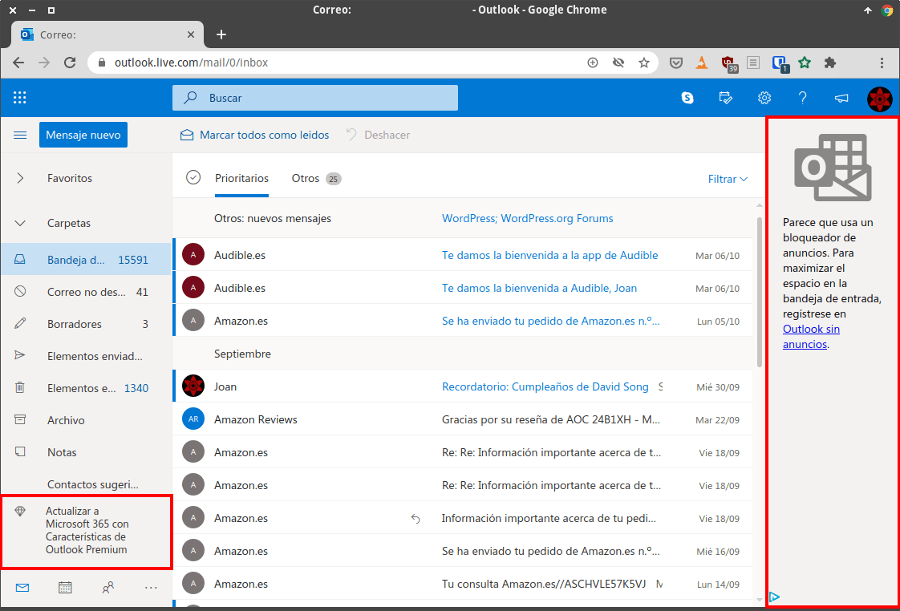](images/elementos-molestos-pantalla.png)

Para hacer desaparecer las partes señaladas en color rojo tendremos que clicar encima del icono de uBlock Origin y cuando aparezca el menú clicar encima del botón **Entrar al modo selección de elementos**.

[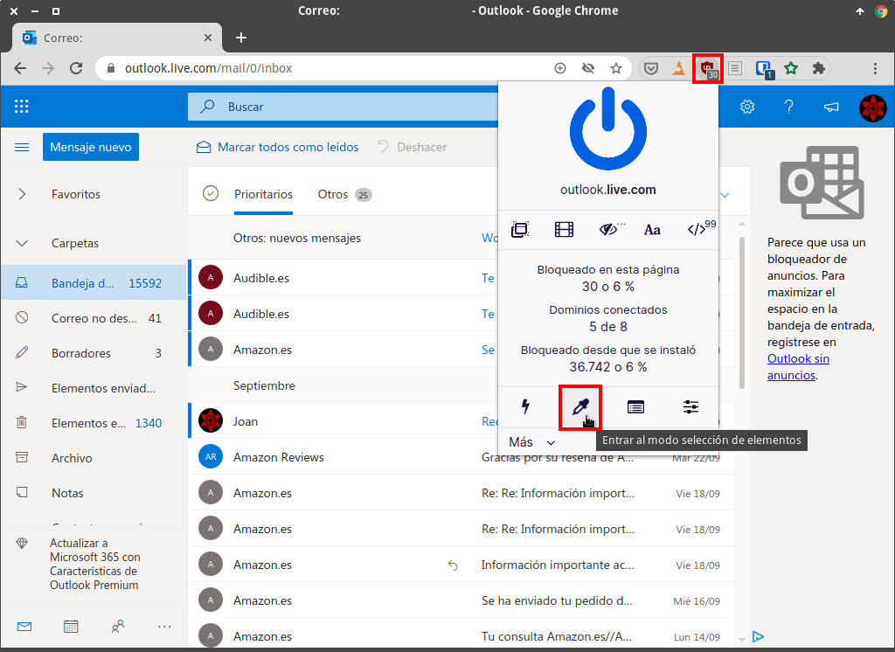](images/entrar-en-modo-seleccion-de-elementos.png)

A continuación seleccionamos uno de los elementos que queremos que desaparezca.

[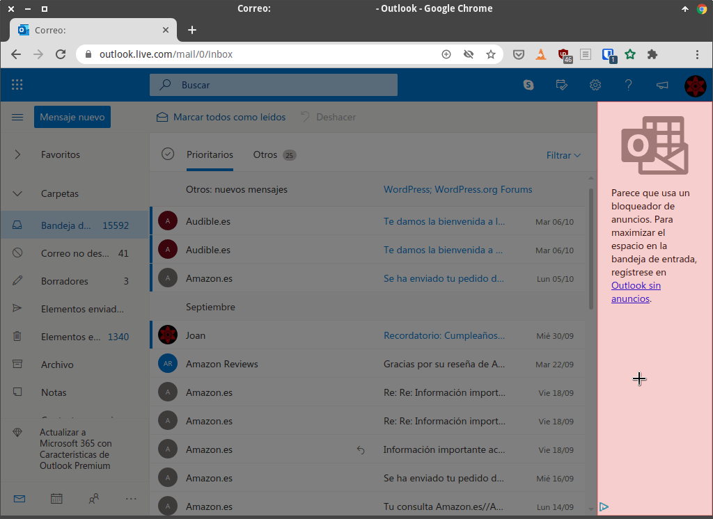](images/seleccionar-elemento.png)

Finalmente presionamos encima del botón **Crear** para que se cree un filtro para eliminar la parte seleccionada cada vez que se abra el correo outlook en nuestro navegador.

[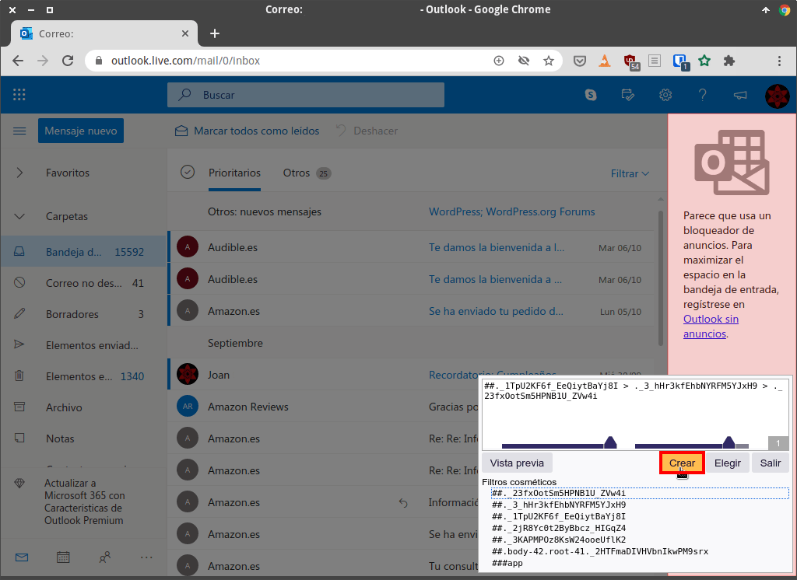](images/crear-el-filtro-para-eliminar-el-contenido.png)

Si vamos repitiendo el proceso en todos y cada uno de los elementos que queremos que no aparezcan en pantalla obtendremos el siguiente resultado:

[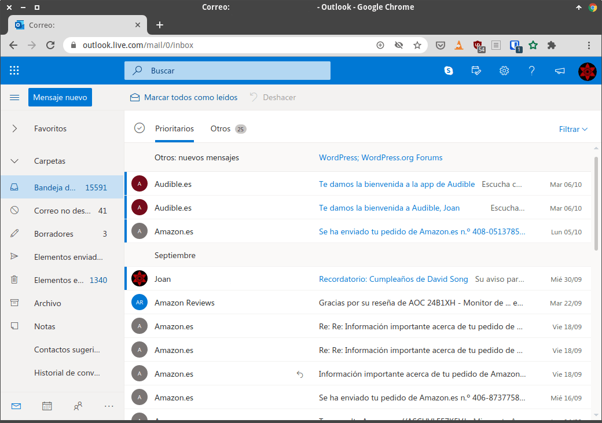](images/todos-elementos-molestos-eliminados.png)

Si acceden al panel de control de uBlock origin podrán ver, exportar y eliminar la reglas que acabamos de crear en caso necesario.

[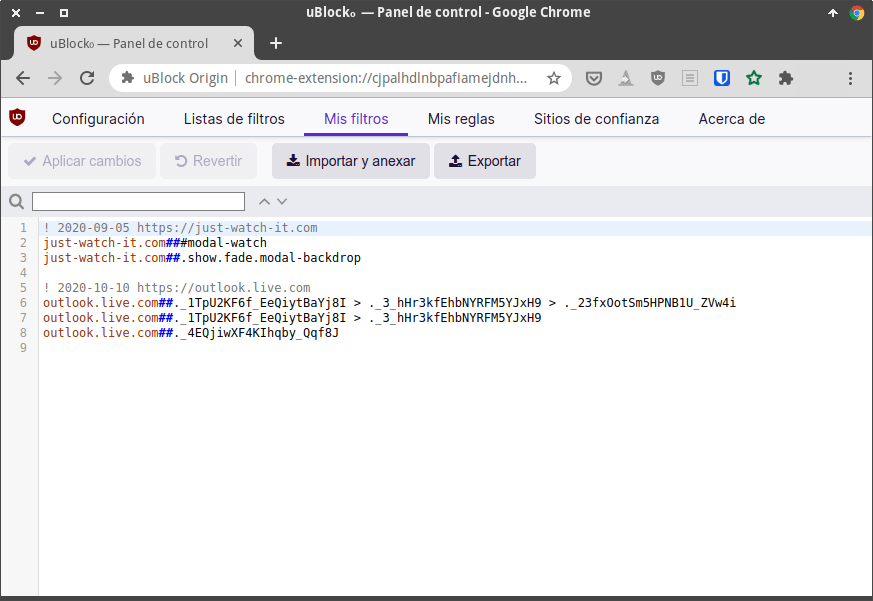](images/filtros-aplicados-en-outlook.png)

## BLOQUEAR EL JAVASCRIPT PARA EVITAR EL RASTREO Y QUE APAREZCAN BANNERS EN PANTALLA

Existen páginas web que están infestadas de banners y/o scripts para monitorearnos y saber lo que estamos haciendo en todo momento.

[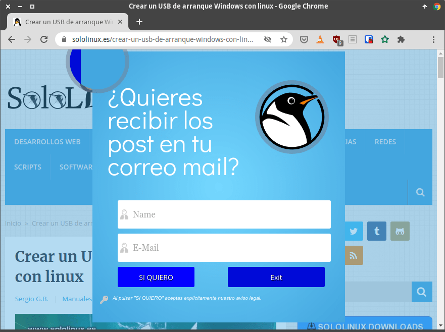](images/banner-invasivo.png)

Para evitar los molestos banners y scripts de seguimiento uBlock Origin nos permite deshabilitar javascript en las web que nosotros queramos. Por lo tanto en el ejemplo que acabamos de ver tan solo tenemos que clicar encima del icono de uBlock Origin y cuando se despliegue el menú cliquen encima del botón de **deshabilitar Javascript**.

[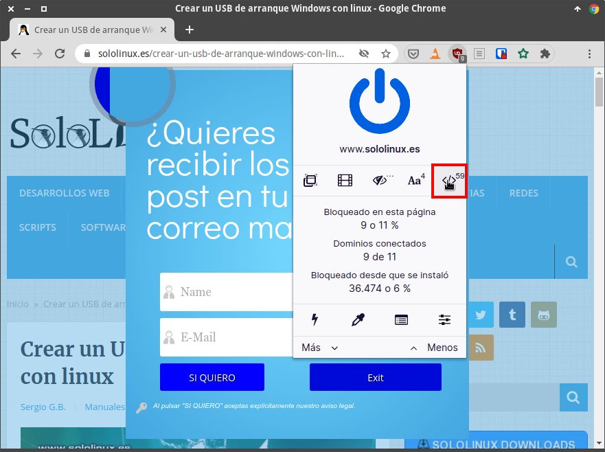](images/bloquear-javascript.png)

Una vez deshabilitado recarguen la página y verán que podemos visitar todos y cada uno de los artículos de está web y no aparecerán banners. Además todo script que sea usado para monitorear nuestro comportamiento o contabilizar las visitas dejará de ser efectivo.

**Nota**: Es posible que deshabilitando Javascript dejen de funcionar ciertos elementos de la página web. No obstante conseguiremos evitar los banners y que los scripts que monitorizan nuestras acciones.

**Nota**: Accediendo dentro del panel de control se puede deshabilitar Javascript de forma predeterminada en todas las web que visitamos.

## DESACTIVAR UBLOCK ORIGIN PARA PERMITIR LOS ANUNCIOS EN DETERMINADAS PÁGINAS WEB

No es mi caso, pero puede ser que algunos de vosotros queráis bloquear la totalidad de anuncios excepto los que aparezcan en una determinada página web. Si este es vuestro caso entrad dentro de la página web en la que no queráis bloquear los anuncios. Acto seguido cliquen sobre el icono de uBlock Origin y cuando aparezca el menú cliquen encima del botón de **apagar/encender**.

[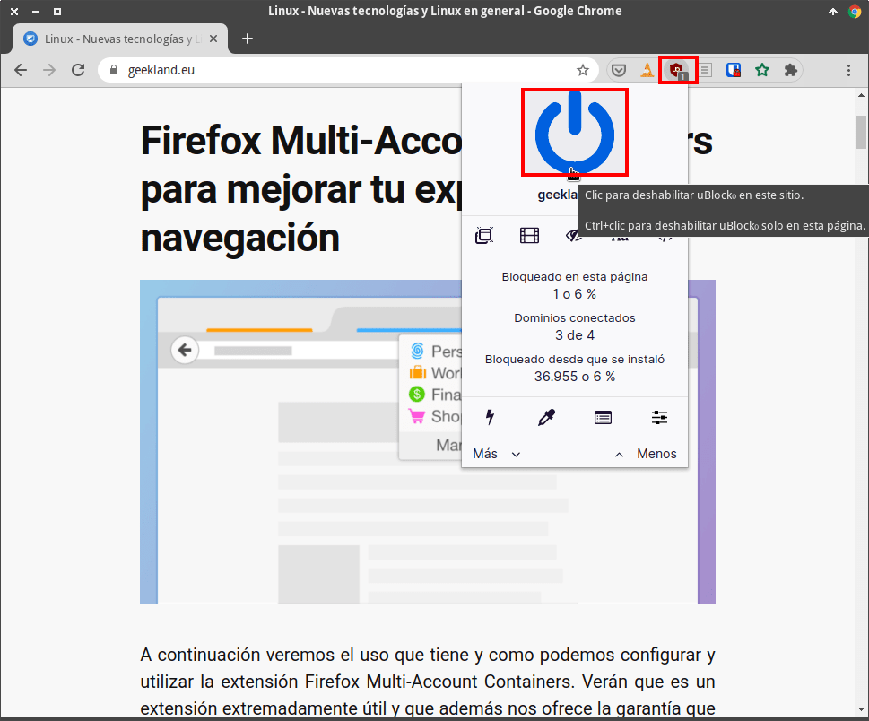](images/Desactivar-uBlock-origin.png)

A partir de estos momentos uBlock Origin funcionará en todos los sitios web excepto para el sitio en que acabamos de desactivarlo.

**Nota**: En mi caso soy partidario de bloquear los anuncios en el 100% de los sitios web porque los importes percibidos por un webmaster en concepto de publicidad son ridículos y ni de lejos les ayudan a cubrir costes. Los anuncios son una molestia innecesaria y en algunos casos incluso pueden llegar a ser un problema de seguridad. Hoy en día las web para hacer dinero publicitan productos y servicios en sus artículos.

## PERMITIR QUE NO SE FILTRE NUESTRA DIRECCIÓN IP LOCAL

WebRTC puede llegar a revelar nuestra IP Local y pública. Frente a este problemática uBlock origin tiene una herramienta para al menos evitar que se filtre nuestra IP local. Para activarla tienen que acceder al panel de control de uBlock Origin.

[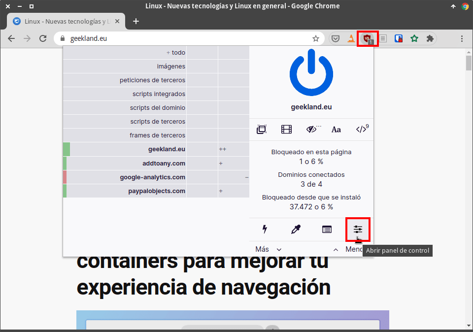](images/acceder-a-la-configuracion-de-ublock-origin.png)

Dentro de la pestaña configuración del panel de control tienen que activar la opción **Impedir que WebRTC divulgue la dirección IP local**.

[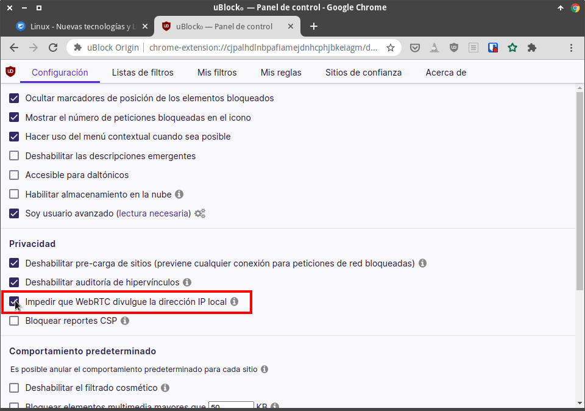](images/Impedir-WebRTC-divulgue-IP-local.png)

Al aplicar esta acción puede ser que algún servicio web que use WebRTC deje de funcionar. Si es este el caso tan solo tendrán que desactivar la opción que acabamos de activar. También les recomiendo que dentro del panel de control lean todas y cada una de las opciones presentes en las distintas pestañas para poder configurar uBlock Origin a su gusto.

## AÑADIR LISTAS DE BLOQUEO ADICIONALES A UBLOCK ORIGIN PARA CONSEGUIR OBJETIVOS ESPECÍFICOS

En uBlock Origin podemos añadir listas de bloqueo adicionales para conseguir los siguientes propósitos:

1. Hacer desaparecer las advertencias que las páginas web que visitamos usan cookies.
2. Evitar que las web que visitamos detecten que estamos usando un bloqueador de publicidad.
3. Bloquear más contenidos.

Para realizar lo que acabamos de mencionar tenemos que proceder del siguiente modo.

### Hacer desaparecer las advertencias de cookies con uBlock Origin

Para bloquear los mensajes de advertencia que las web que visitamos usan cookies sigan las instrucciones del siguiente enlace.

https://geekland.eu/quitar-las-advertencias-de-cookies-en-las-web-que-visitamos/

### Evitar que las web que visitamos detecten que usamos un bloqueador de anuncios

Para evitar que las webs detecten que estamos usando un bloqueador de anuncios podemos bloquear el javascript tal y como vimos en el inicio de este artículo. Otra opción es seguir los pasos indicados en el siguiente enlace.

https://geekland.eu/evitar-deteccion-adblock-con-anti-adblock-killer/

Otra alternativa diferente a la detalladas puede ser la siguiente:

[Alternativa a ser detectado por un bloqueador](https://jspenguin2017.github.io/uBlockProtector/#extra-installation-steps-for-ublock-origin)

### Añadir listas de bloqueo a uBlock Origin

uBlock Origin bloqueará prácticamente todos los anuncios, no obstante en caso que sea necesario podemos añadir listas de bloqueo adicionales. Por ejemplo si estamos en China la gran mayoría de anuncios chinos no serán bloqueados. Si queremos bloquearlos tenemos que acceder al panel de control de uBlock Origin.

Una vez dentro, en la pestaña **Lista de filtros** encontraremos multitud de listas a las que nos podemos suscribir. En nuestro caso tildamos las 2 listas de bloqueo que hacen referencia al país de China. Una vez tildadas las listas presionan el botón **Aplicar cambios**.

[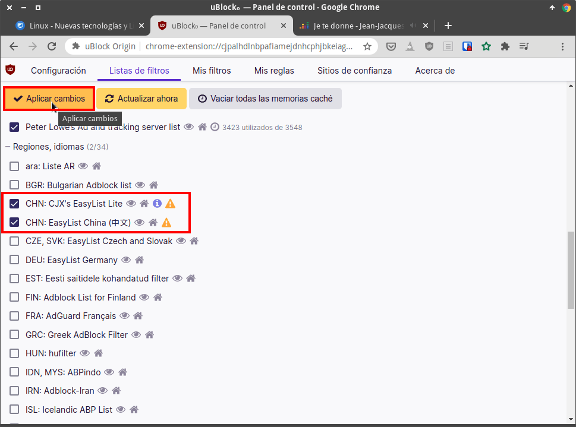](images/anadir-listas-adicionales.png)

A partir de estos momentos, la totalidad de anuncios que provienen de servicios de publicidad Chinos serán bloqueados. Si queréis también se pueden añadir listas externas que no estan presentes en las opciones predeterminadas, pero ya avanzo que en la 99.9% de casos no es necesario. No obstante si quieren consultar algunas listas de terceros que pueden añadir pueden visitar los siguientes enlaces:

[https://help.getadblock.com/support/solutions/articles/6000066909-introduction-to-filter-lists](https://help.getadblock.com/support/solutions/articles/6000066909-introduction-to-filter-lists)

[https://filterlists.com/](https://filterlists.com/)

**Nota**: No se suscriban a demasiadas listas. Cuantas más listas usemos mayor será el consumo de recursos al navegar. La listas que vienen activadas de serie acostumbran a ser suficiente para la gran mayoría de personas.

## BLOQUEAR ELEMENTOS DE FORMA MANUAL Y GRANULAR

uBlock Origin permite bloquear anuncios y cualquier otro elementos que aparecen en la web de forma selectiva. Para ello deberemos proceder del siguiente modo.

### Activar el modo avanzado en uBlock Origin

Para activar el modo avanzado cliaremos encima del icono de uBlock Origin. Cuando se despliegue el menú clicaremos encima del botón **Abrir panel de control**.

Una vez dentro del panel de configuración tildaremos la opción **Soy usuario avanzado** que está ubicada en la pestaña Configuración.

[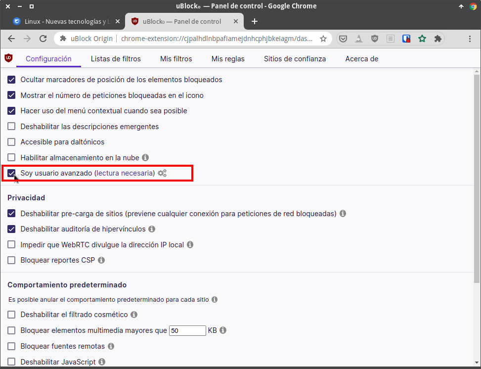](images/habilitar-configuracion-avanzada.png)

### Bloquear cualquier elemento de forma manual

Una vez activadas las opciones avanzadas ya podemos empezar a bloquear elementos de forma selectiva y manual. Para ello iremos a una de las páginas web en que nos aparece contenido multimedia no deseado. En la siguiente captura de pantalla hay un vídeo que se reproduce de forma automática en el inicio de la web. Además cuando avanzamos en la lectura y desaparece no se soluciona el problema porque continúa viéndose y reproduciendo en la parte lateral derecha.

[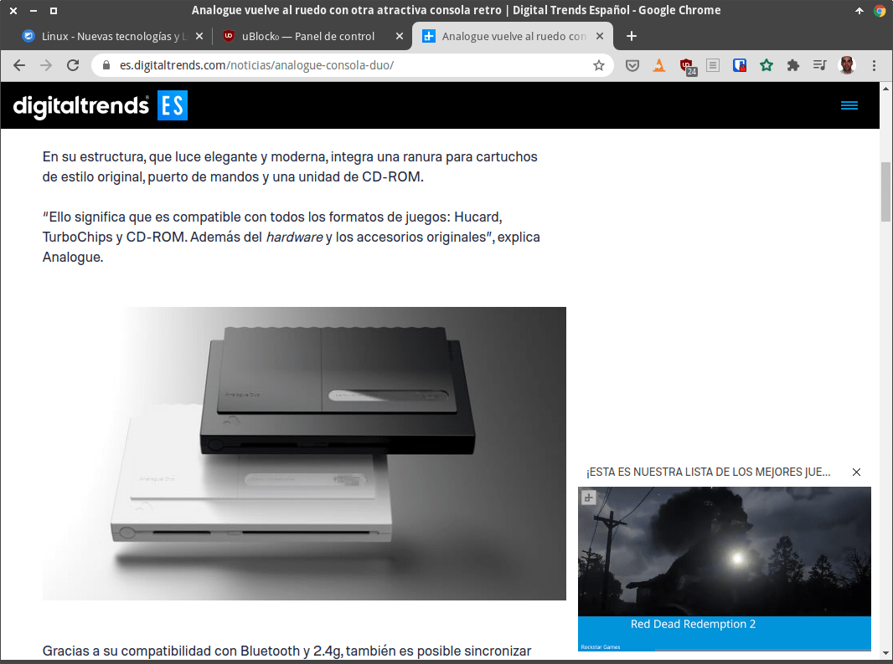](images/web-con-contenido-multimedia-no-deseado.png)

Para solucionar esta situación tenemos que averiguar la fuente del vídeo que queremos bloquear. Para ello en mi caso posiciono el puntero del ratón encima del vídeo y presiono el botón derecho del ratón. Haciendo esto veo que el contenido es ofrecido por Brightcove.

[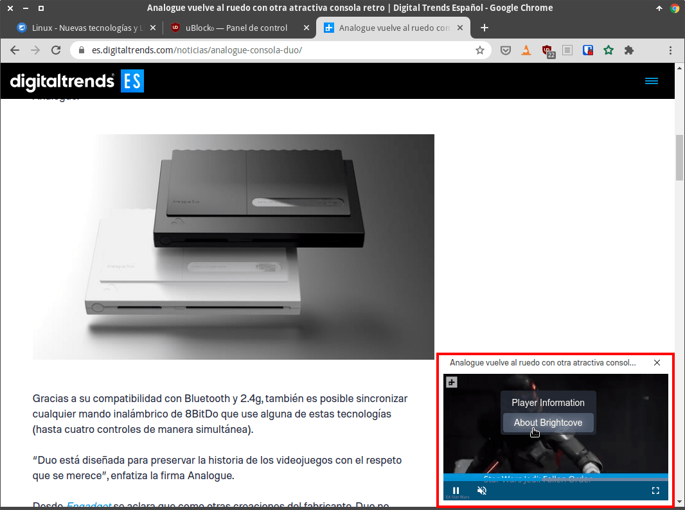](images/detectar-los-elementos-a-bloquear.png)

**Nota**: Otra forma de averiguar la fuente es posicionar el puntero del ratón encima del elemento que queremos eliminar y presionar el botón derecho del ratón. Entonces cuando aparezca el menú contextual hay que clicar sobre la opción **Inspeccionar elemento**

Acto seguido clicaremos encima del icono de uBlock Origin. En la parte izquierda del menú desplegado verán la totalidad de fuentes desde las que la web que visitamos carga el contenido. En nuestro caso buscaremos todas las fuentes que hacen referencia a Brightcove y en la segunda columna tildaremos la opción de color rojo. De esta forma bloquearemos por completo Brightcove en la totalidad de páginas web que visitemos.

[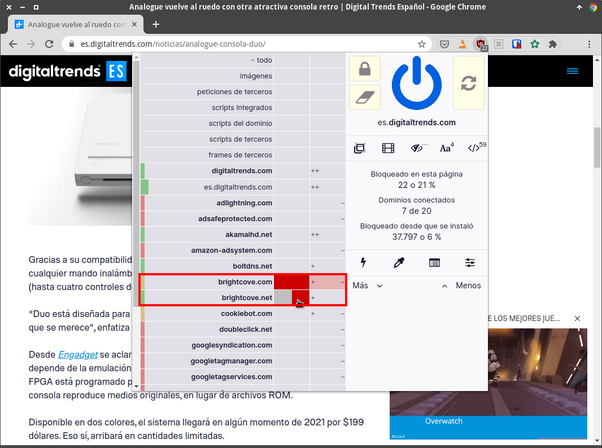](images/bloquear-los-elementos-indeseados.png)

**Nota**: Si solo quisiéramos bloquear Brightcove en la web que visitamos deberíamos activar la opción de color rojo en la tercera columna en vez de la segunda columna.

Para que los bloqueos que acabamos de aplicar sean permanentes y perduren en el tiempo presionen sobre el candado.

[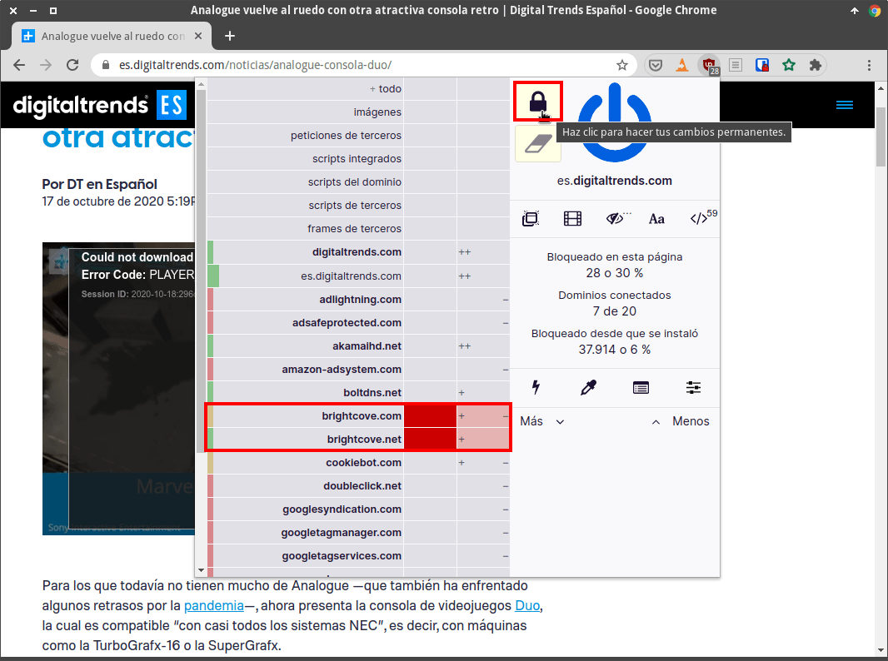](images/cambios-permanentes.png)

Una vez finalizado el proceso podemos recargar la página web y verán que ya no aparece vídeo alguno. En lugar del vídeo aparecerá un cuadro de color negro que si quieren podrán eliminar con la opción de eliminar elementos vista en el inicio de este artículo.

[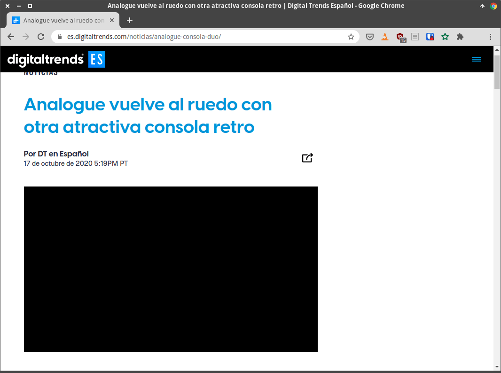](images/contenido-multimedia-bloqueado.png)

**Nota**: Si quisiéramos bloquear Brightcove en todas las web excepto en la web que estamos visitando entonces deberíamos tildar en rojo la columna 2 y en gris la columna 3

[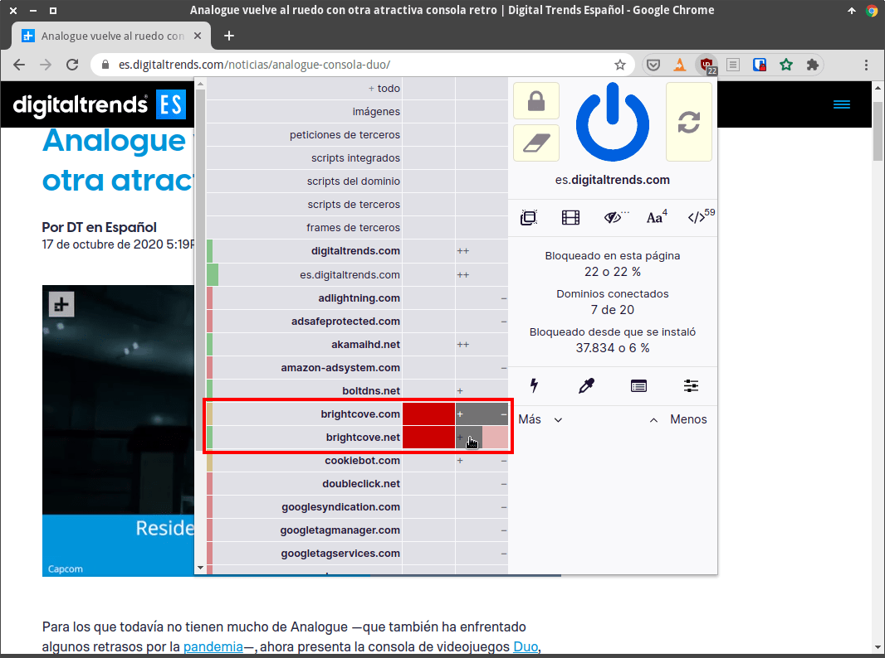](images/permitir-solo-en-una-web.png)

Esto que acabamos de detallar puede ser útil ya que por ejemplo permite bloquear globalmente los scripts y frames de terceros y en el caso que una web no funcione los podemos activar solo en la web que no funciona.

## SINCRONIZAR NUESTRAS LISTAS DE BLOQUEO ENTRE EQUIPOS

A medida de vayamos configurando uBlock Origin se originará una extensa lista de reglas personalizadas. Para que estas reglas y las listas estén presentes en todos y cada unos de nuestros equipos tenemos un par de opciones.

### Exportar e importar la configuración de uBlock Origin

uBlock Origin permite exportar e importar nuestras opciones de configuración de forma sencilla. Para ello en la pestaña **Configuración** del panel de control clicamos encima del botón **Respaldar archivo...** Acto seguido se procederá a la descarga de un archivo que contendrá la totalidad de nuestra configuración.

[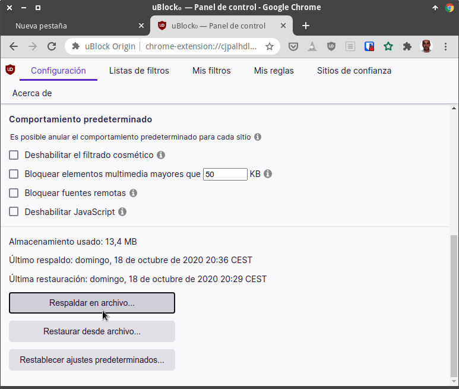](images/respaldar-configuracion-ublock-origin.png)

Una vez descargado el archivo se dirigen a otro equipo con el archivo que acaban de descargar. A continuación, en la pestaña Configuración del panel de uBlock Origin presionan el botón **Restaurar desde archivo...** y seleccionan el archivo que contiene la configuración que queremos importar. Acto seguido en el nuevo equipo se aplicará la nueva configuración.

### Sincronizar la configuración, listas y reglas de bloqueo entre equipos

La sincronización de las reglas de bloqueo entre equipos se realizará mediante las cuentas de usuario que tengamos en Firefox y en Chrome. Por lo tanto tenemos que tener en cuenta lo siguiente:

1. Las reglas de bloqueo aplicadas en Firefox no se aplicarán en Chrome y viceversa.
2. La sincronización solo se realizará entre 2 equipos que estén logueados a una misma cuenta.

Para habilitar la sincronización tan solo tendremos que tildar la opción **Habilitar almacenamiento en la nube** presente en la pestaña configuración del panel de configuración de uBlock Origin.

[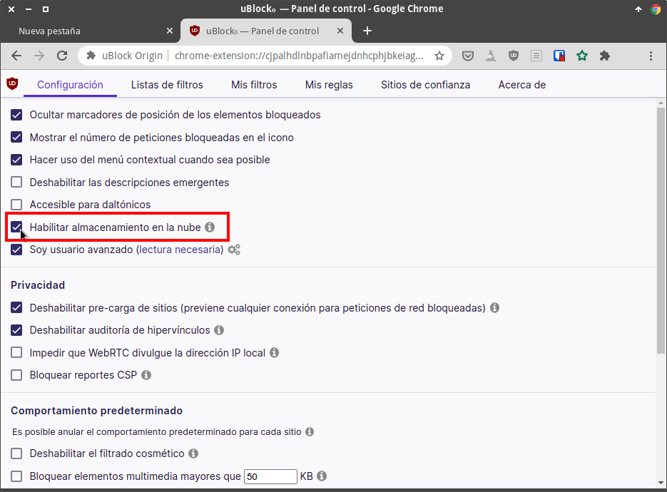](images/habilitar-sincronizacion-entre-equipos.png)

## CONCLUSIONES

uBlock origin no es una simple extensión que bloquea la publicidad. uBlock Origin permite tener un control total sobre todos y cada uno de los elementos que se cargan y aparecen en una web. Se trata de una herramienta muy potente que nos brinda multitud de posibilidades.
