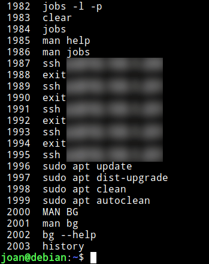
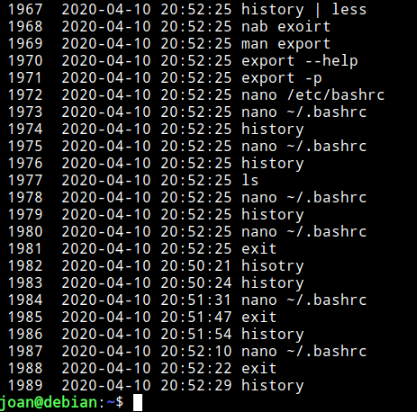
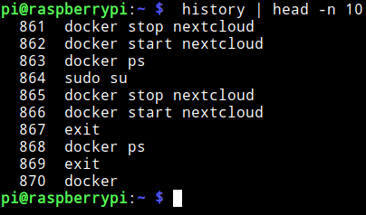
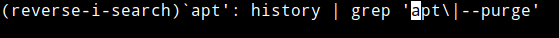

GNU-Linux es un sistema que registra prácticamente la totalidad de eventos y acciones que suceden. Como no podía ser de otra forma también almacena la totalidad de comandos que cada uno de los usuarios ejecuta en la terminal mediante un historial de comandos.<!--more-->

## INTRODUCCIÓN DEL HISTORIAL DE COMANDOS HISTORY

A continuación verán una pequeña muestra del contenido que es capaz de registrar el historial de comandos de Linux

### Mostrar los comandos que ha ejecutado un usuario

Cada vez que ejecutamos un comando en la terminal se registra en el archivo ~/.bash\_history.

**Nota:** Todos y cada uno de los usuarios de nuestro sistema operativo tienen el archivo oculto .bash\_history en su partición home.

Si queremos ver la totalidad de comandos almacenados dentro del archivo que acabamos de mencionar tan solo tenemos que ejecutar el siguiente comando:

> ```
> history
> ```

Acto seguido, y según la configuración que tengo en mi caso, veremos los últimos 1000 comandos que ha ejecutado el usuario con que estoy logueado.

[](images/resultados-historial-de-comandos-history.png)

**Nota:** Ejecutando el comando cat ~/.bash\_history obtendríamos unos resultados similares. La única diferencia es que según mi configuración el archivo ~/.bash\_history contendría los últimos 2000 comandos ejecutados.

### Puntos a tener en cuenta del historial de comandos history

Existen una serie de puntos sobre el funcionamiento del historial de comandos history que tenemos que tener en cuenta:

1. La configuración estándar de history hace que únicamente se almacenen 2000 comandos en el fichero ~/.bash\_history. Este aspecto se puede cambiar modificando la variable HISTFILESIZE
2. El número de comandos que history puede almacenar en memoria es 1000. Por lo tanto si ejecutamos history en la terminal, aunque el fichero ~/.bash\_history contenga 2000 comandos almacenados, la terminal únicamente mostrará los últimos 1000 comandos ejecutados. Este parámetro se puedo configurar mediante la variable HISTSIZE
3. La configuración predeterminada de history hace que no se registren 2 comandos repetidos que se ejecutan de forma consecutiva. Tampoco registra los comandos que empiezan por un espacio. Este comportamiento se puede modificar mediante la variable HISTCONTROL

## CONFIGURAR EL FUNCIONAMIENTO DEL HISTORIAL DE COMANDOS HISTORY

Si lo creemos necesario podemos cambiar el comportamiento predeterminado de history modificando los parámetros de su archivo de configuración. History tiene 2 archivos de configuración:

1. El primero de ellos está ubicado en la partición home de cada uno de los usuarios del sistema operativo y tiene el nombre .bashrc.
2. El otro archivo de configuración es equivalente al primero y está ubicado en /etc/bash.bashrc. La diferencia es que la configuración definida en /etc/bash.bashrc afectará a la totalidad de usuarios del sistema operativo.

En mi caso solo quiero modificar la configuración de mi usuario. Por lo tanto ejecutaré el siguiente comando en la terminal:

> ```
> nano ~/.bashrc
> ```

Cuando se abra el editor de textos podremos modificar los siguientes parámetros.

### Modificar la capacidad de registro de history

Dentro del fichero ~/.bashrc buscaremos las variables HISTSIZE y HISTFILESIZE. En mi caso son las siguientes:

> ```
> HISTSIZE=1000
> HISTFILESIZE=2000
> ```

Una vez encontradas podemos modificar sus parámetros. Por ejemplo podemos introducir los siguientes:

> ```
> HISTSIZE=30000
> HISTFILESIZE=40000
> ```

Una vez modificados los parámetros guardamos los cambios, cerramos el fichero y cerramos absolutamente todas las terminales. A partir de estos momentos:

1. El archivo ~/.bash\_history podrá almacenar los últimos 40.000 comandos ejecutados.
2. La terminal será capaz de mostrar los últimos 30.000 comandos ejecutados.

### Configurar los comandos que registrará el historial de comandos history

Dentro del mismo fichero de configuración busquen la variable HISTCONTROL. En mi caso vemos que tiene asignado el parámetro ignoreboth.

> ```
> HISTCONTROL=ignoreboth
> ```

**El parámetro ignoreboth** hace que history no registre los comandos que se ejecutan después de introducir un espacio. Tampoco registrará los comandos repetidos que se ejecuten de forma consecutiva.

**Si queremos registrar los comandos duplicados que se ejecutan de forma consecutiva, pero no queremos registrar los comandos que empiecen por espacio** deberemos reemplazar el parámetro ignoreboth por **ignorespace**

Para realizar lo opuesto a lo que justo acabamos de citar deberíamos reemplazar el comando ignoreboth por **ignoredups**

También existe **el parámetro erasedups**. Este parámetro hará que en ~/.bash\_history no haya un solo comando duplicado. Por ejemplo si hoy ejecutamos el comando ls se registrará. Si mañana lo volvemos a ejecutar se borrará el registro de ayer y quedará registrado solo la última vez que ha sido usado.

Finalmente citar que se pueden combinar los parámetros que acabamos de citar del siguiente modo:

> ```
> HISTCONTROL=ignorespace,erasedups
> ```

### Hacer que el historial de comandos muestre la hora y el día en que se ejecutaron los comandos

Para que history muestre la fecha y hora en que se ejecutaron los comandos tan solo tendremos que usar la variable HISTTIMEFORMAT.

Para ello al final del archivo de configuración ~/.bashrc añadiremos el siguiente código:

> ```
> HISTTIMEFORMAT="%F %T: "
> ```

Donde:

- **%F:** Para que aparezca la fecha en en modo año, mes y día.
- **%T:** Para que aparezca la hora en en modo hora, minuto y segundo

Acto seguido guardamos los cambios, cerramos el fichero y todas las terminales abiertas. Abrimos una nueva terminal y la próxima vez que ejecutaremos history obtendremos un resultado similar al siguiente:

[](images/historial-de-comandos-con-fecha-y-hora.png)

### Configurar el momento en que se registran los comandos

Para asegurar que se registran la totalidad de comandos lo primero que hay que realizar es asegurar que el fichero de configuración contiene el siguiente parámetro:

> ```
> shopt -s histappend
> ```

**Nota:** En caso de no estar presente se perderán algunos registros de comandos en el caso que trabajemos con más de una terminal de forma simultánea.

Con el parámetro shopt -s histappend todos los comandos ejecutados en distintas terminales se almacenarán en memoria. En el momento que cerremos cada una de las terminales los comandos ejecutados se guardarán en el fichero ~/.bash\_history según el orden con que cerremos la terminal. Esto puede ocasionar que los comandos no queden almacenados en el orden exacto de ejecución.

Si queremos que los comandos queden registrados exactamente por su orden de ejecución deberemos añadir el siguiente código en el fichero de configuración ~/.bashrc.

> ```
> unset PROMPT_COMMAND
> PROMPT_COMMAND=”history -a”
> ```

Lo que hace el código es ejecutar en segundo plano el comando history -a cada vez que ejecutamos un comando. Por lo tanto cada vez que ejecutamos un comando se almacena en memoria y se registra en el fichero ~/.bash\_history. De esta forma aseguramos que el orden de registro sea cronológico.

**Si además quisiéramos los comandos se registren en tiempo real en memoria y en el archivo** ~/.bash\_history tendríamos que introducir la siguiente línea en el fichero de configuración:

> ```
> PROMPT_COMMAND="history -a; history -c; history -r; $PROMPT_COMMAND"
> ```

Lo que hace el texto añadido es ejecutar los comandos history -a, history -c y history -r cada vez que ejecutamos un comando. Por lo tanto en el momento de ejecutar un comando sucederá lo siguiente:

1. Mediante **history -a** se añadirá cada uno de los comandos ejecutados al fichero ~/.bash\_history
2. Acto seguido se borrará el historial de comandos almacenado en memoria mediante el comando **history -c**
3. Finalmente se cargará el contenido de ~/.bash\_history en memoria mediante el comando **history -r**

## EJEMPLOS DE USO DEL HISTORIAL DE COMANDOS HISTORY

A continuación verán algunos ejemplos de uso del historial de comandos.

### Mostrar los últimos 20 comandos ejecutados

Para mostrar los últimos 20 comandos ejecutados tan solo tenemos que ejecutar el comando history seguido por número de comandos a visualizar.

> ```
> history 20
> ```

### Mostrar los 10 primeros comandos registrados en memoria

Para mostrar los 10 primeros comandos almacenados o cargados en memoria ejecutaremos el siguiente comando en la terminal:

> ```
> history | head -n 10
> ```

El resultado obtenido es el siguiente:

[](images/10-primeros-comandos-en-memoria.png)

Fíjense que el primer valor almacenado corresponde a la posición 861 del fichero ~/.bash\_history. Esto es así porque mi fichero ~/.bash\_history contiene 1861 registros.

### Obtener los comandos ejecutados que contienen una determinada palabra

Si queremos podemos usar history para recordar comandos que hemos escrito en el pasado. Por ejemplo para obtener la totalidad de comandos ejecutados que contienen la palabra apt ejecutaremos el siguiente comando:

> ```
> pi@raspberrypi:~ $ history | grep apt
> 1849 sudo apt remove --purge epiphany-browser
> 1884 sudo apt update
> 1885 sudo apt dist-upgrade
> 1996 sudo apt update
> 1997 sudo apt dist-upgrade
> 1998 sudo apt clean
> 1999 sudo apt autoclean
> ```

Si ahora queremos ejecutar uno de los comandos sin tener que escribirlo usamos el carácter ! seguido del número de comando a ejecutar.

> ```
> !1884
> ```

Si además queremos ejecutar 2 comandos de forma consecutiva lo podríamos realizar el siguiente modo:

> ```
> !1884 & !1885
> ```

Para ejecutar el último comando almacenado en memoria tan solo tendríamos que ejecutar el siguiente comando:

> ```
> !!
> ```

Otros ejemplos de búsqueda de comandos ejecutados serían los siguientes:

 
|   **Propósito**   |   **Comando**   |
| --- | --- |
|   ``` Ver todos los comandos que tengan la palabra apt y --purge ```   |   ``` history \| grep -E 'apt.*--purge' ```   |
|   ``` Ver todos los comandos que tengan la palabra apt o --purge ```   |   ``` history \| grep 'apt\\|--purge' ```   |

**Nota:** Aquí pueden jugar tanto como quieran con grep para obtener el resultado que necesiten.

### Buscar el último comando ejecutado que contiene una determinada palabra

Para buscar el último comando ejecutado que contiene una palabra determinada podemos presionar la combinación de teclas **Ctrl+R**

Acto seguido escriban una de las palabras que contiene el comando que quieren buscar. En mi caso escribo apt y una vez escrita la palabra podrán ver el último comando ejecutado que contiene la palabra apt.

[](images/ejemplo-busqueda-ctrl-r.png)

Si en vez del último comando quisieran ver el penúltimo tan solo tendrían que volver a presionar Ctrl+R. Una vez visualicen el penúltimo pueden volver a presionar Ctrl+R para visionar el antepenúltimo y así sucesivamente.

Una vez encontrado el comando que quieren ejecutar presionen enter y se ejecutará.

### Borrar el historial de comandos del sistema operativo

Para borrar el historial de comandos de la memoria tan solo tenemos que ejecutar el siguiente comando:

> ```
> history -c
> ```

Si queremos borrar tanto el contenido de la memoria como el contenido del archivo ~/.bash\_history tendremos que ejecutar el siguiente comando:

> ```
> history -c && history -w
> ```

Si únicamente pretendemos borrar la línea 500 del historial almacenado en memoria usaremos el siguiente comando:

> ```
> history -d 500
> ```

### Desactivar el historial de comandos history

Si una vez borrado el historial lo quisiéramos desactivar lo podríamos hacer del siguiente modo:

Inicialmente accederíamos al archivo de configuración ejecutando el siguiente comando:

> ```
> nano ~/.bashrc
> ```

Justo al final del archivo introduciríamos el siguiente comando:

> ```
> unset HISTFILE
> ```

Finalmente tan solo tendríamos que guardar los cambios y cerrar todas las terminales.

### Ejecutar un comando sin que quede registrado en el historial

Según la configuración estándar no se registran los comandos que empiezan por un espacio. Por lo tanto si queremos que no quede registrado un comando presionaremos la barra espaciadora y seguidamente ejecutaremos el comando de forma habitual.

### Visualizar el historial de comandos de una forma más sencilla

Si queremos paginar los comandos almacenados y verlos de una forma mucho más cómoda podemos usar el visualizador de archivos de texto less. Para ello tan solo tienen que ejecutar el siguiente comando:

> ```
> history | less
> ```

## PROTEGER EL HISTORIAL DE COMANDOS PARA QUE NO PUEDA SER MANIPULADO POR TERCEROS

Podemos proteger el historial de comandos para que ningún usuario pueda modificar su contenido. Para ello inicialmente modificaremos el permiso de los ficheros .bash\_history, .bash\_profile, .bash\_login, .profile, .bash\_logout y .bashrc ejecutando los siguientes comandos:

> ```
> sudo chattr +a /home/user/.bash_history
> sudo chattr +a /home/user/.bash_profile
> sudo chattr +a /home/user/.bash_login
> sudo chattr +a /home/user/.profile
> sudo chattr +a /home/user/.bash_logout
> sudo chattr +a /home/user/.bashrc
> ```

**Nota:** Deberéis reemplazar **user** por vuestro usuario. **Nota:** En estos momentos no se podrá eliminar ni modificar el contenido de los ficheros. Lo único que se podrá realizar es adjuntar información a los archivos. **Nota:** Si algún día quieren revertir los cambios deberán ejecutar el mismo comando reemplazando +a por \-a.

A continuación estableceremos que las variables de configuración de history sean solo de lectura. Para ello dentro del fichero de configuración de ~/.bashrc introduciremos el siguiente código al final del archivo:

> ```
> readonly HISTFILE
> readonly HISTFILESIZE
> readonly HISTSIZE
> readonly HISTCMD
> readonly HISTCONTROL
> readonly HISTIGNORE
> ```

**Nota:** En el caso que usen el parámetro PROMPT\_COMMAND=”history -a” lo deberán reemplazar por readonly PROMPT\_COMMAND=”history -a”

Una vez introducidos los cambios los guardan, cierran el archivo de configuración y todas las terminales.

Finalmente deshabilitaremos el acceso a otras shells ejecutando los siguientes comandos:

> ```
> sudo chmod 750 csh
> sudo chmod 750 tcsh
> sudo chmod 750 ksh
> ```

**Fuentes**

[https://www.busindre.com/historial\_en\_bash\_sin\_perder\_comandos](https://www.busindre.com/historial_en_bash_sin_perder_comandos)
