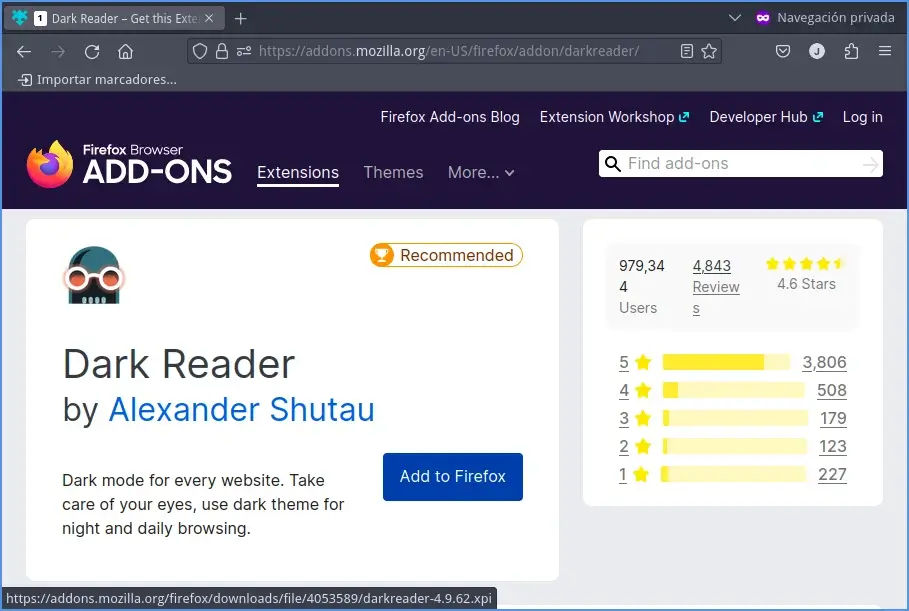
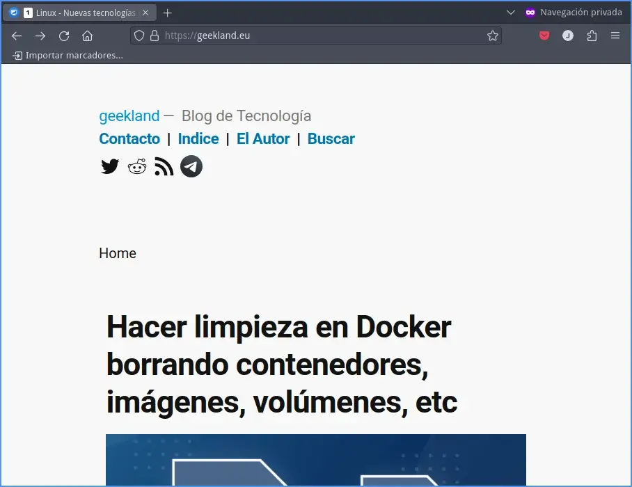
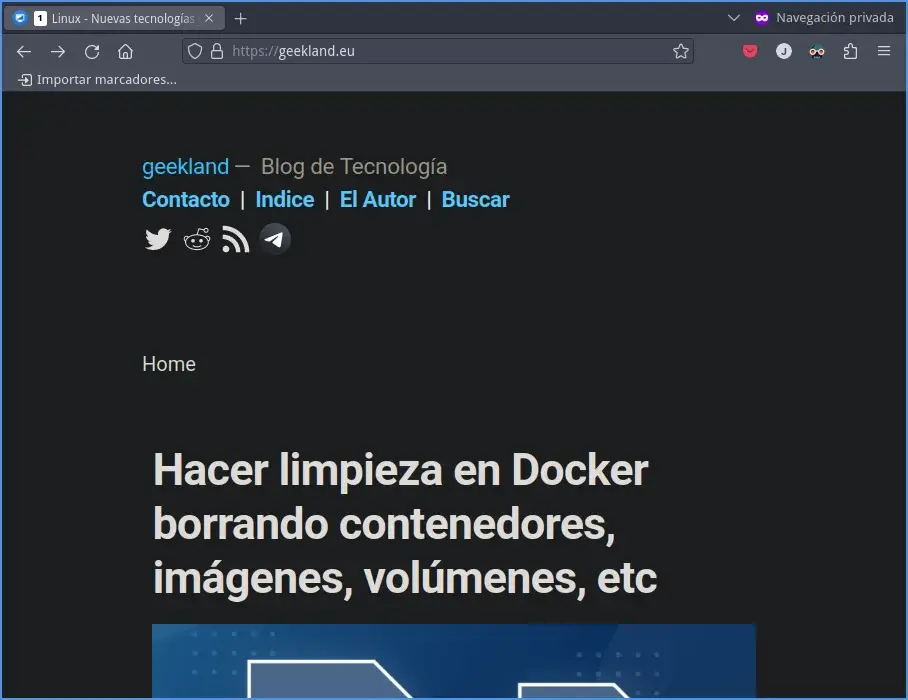
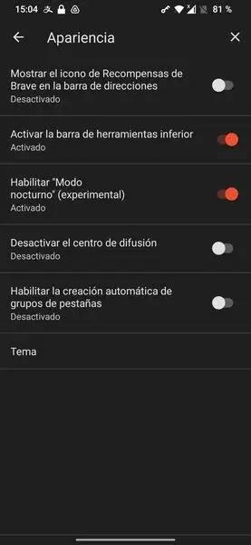

Cuando uso el ordenador o el teléfono me gusta usar el modo oscuro o temas oscuros. No obstante existen webs, como la mía y muchas otras, que únicamente tienen temas claros y rompen con la estética visual del entorno de escritorio. Para solucionar este problema les mostraré como instalar Dark Reader y de este modo ver la totalidad de web que visitamos con tema oscuro. Pero antes de detallar el proceso de instalación les detallaré las ventajas de usar el modo oscuro y las funcionalidades que ofrece Dark Reader.<!--more-->

## VENTAJAS DE USAR EL MODO OSCURO

Las ventajas proporcionadas por los temas oscuros son las siguientes:

1. Si su monitor o pantalla es OLED, el consumo de energía sea menor y por lo tanto **la duración de la batería será mayor**. Esto es así porque muchos de los led de la pantalla estarán apagados mientras usamos el modo oscuro.
2. **Reducción considerable de la [fatiga visual]()** y tensión ocular especialmente cuando usamos el equipo por un tiempo prolongado.
3. **Mayor comodidad de lectura** en ambientes donde hay poca luz.
4. Estéticamente prefiero los temas oscuros a los temas claros.

## FUNCIONALIDAD Y OPCIONES DE LA EXTENSIÓN DARK READER

Dark Reader es una extensión disponible para los navegadores web Firefox, Edge, Safari y Google Chrome. Sirve para modificar el tema de los sitios web que visitamos y de esto modo ver todas las páginas web con temas oscuros. Algunas de las funcionalidades y opciones que ofrece la extensión Dark Reader son:

1. **Cambiar la tipografía** de las páginas web que visitamos. De este modo siempre podremos leer las web que visitamos con la misma tipografía.
2. **Habilitar el tema oscuro** para todas las web o solo para determinadas web. Esto nos puede interesar porque existen web que ya implementan modos oscuros o existen web en que el modo oscuro de Dark Reader no se mostrará de forma correcta.
3. **Modificar el tema oscuro mostrada por la extensión** Dark Reader. Dark Reader permitirá mordicar parámetros como el brillo, el contraste, el tono sepia y la escala de grises. Dark Reader permite modificar estos parámetros de forma global o únicamente en un dominio determinado. Además Dark Reader también dispone de opciones avanzadas para usuarios más experimentados, como la capacidad de personalizar las hojas de estilo CSS de los sitios web y la capacidad de importar y exportar configuraciones personalizadas.
4. Otra característica importante de la extensión es que es Open Source y está liberada bajo la licencia MIT. Si miramos su política de privacidad también vemos que se comprometen a [no recolectar datos de sus usuarios](https://darkreader.org/privacy/).

**Nota:** Dark Reader también está disponible para el gestor de correo electrónico Thunderbird.

## INSTALAR LA EXTENSIÓN DARK READER EN FIREFOX

El proceso de instalación es extremadamente sencillo. Tan solo hay que visitar la siguiente [URL](https://addons.mozilla.org/en-US/firefox/addon/darkreader/) y presionar encima del botón Add to Firefox.

Una vez finalizada la instalación pasarán a visualizar la totalidad de páginas web en modo oscuro. Por lo tanto si antes visualizaban mi web de este modo:

Ahora la visualizarán con un tema oscuro:

Si quieren instalar Dark Reader para otros navegadores visiten los siguientes enlaces:

| Navegadores | URL para instalar la extensión |
| --- | --- |
| Edge | [https://microsoftedge.microsoft.com/addons/detail/dark-reader/ifoakfbpdcdoeenechcleahebpibofpc](https://microsoftedge.microsoft.com/addons/detail/dark-reader/ifoakfbpdcdoeenechcleahebpibofpc) |
| Chrome | [https://chrome.google.com/webstore/detail/dark-reader/eimadpbcbfnmbkopoojfekhnkhdbieeh](https://chrome.google.com/webstore/detail/dark-reader/eimadpbcbfnmbkopoojfekhnkhdbieeh) |
| Safari | [https://apps.apple.com/us/app/dark-reader-for-safari/id1438243180](https://apps.apple.com/us/app/dark-reader-for-safari/id1438243180) |

Su proceso de instalación es relativamente sencillo e intuitivo, por lo tanto no es necesaria una explicación detallada.

## ¿QUÉ SOLUCIONES EXISTEN PARA VER LAS WEB CON TEMA OSCURO EN ANDROID O IOS?

Existen diversas soluciones tanto para iOS como para Android que permiten visualizar todas las páginas web visitadas con un tema oscuro.

### Ver las web con tema oscuro en Android

1. El navegador Firefox permite la instalación de la extensión Dark Reader. De este modo conseguiréis que el 100% de web visitas tengan un tema oscuro.
2. Brave tiene opciones de configuración para forzar los temas oscuros en la totalidad de web. Por lo tanto tendrán que ir a la configuración de Brave y activar la opción **Habilitar "Modo nocturno" (Experimental)**

**Nota:** Si buscan seguramente existirán más navegadores que permitirán realizar lo mismo que pueden realizar Brave o Firefox. Si quieren pueden compartir sus métodos en los comentarios de este artículo.

### Ver las web con tema oscuro en iOS

En iOS, existen varias opciones para visualizar sitios web en modo oscuro, incluyendo la instalación de Brave o la descarga de la aplicación [Dark Reader](https://apps.apple.com/us/app/dark-reader-for-safari/id1438243180?platform=iphone) for Safari desde la App Store. Al utilizar esta aplicación, todos los sitios web que se visualicen a través del navegador Safari se mostrarán en modo oscuro de forma automática.

Si conocen algún método o solución alternativa más eficiente para lograr el mismo resultado, les agradecería que lo compartieran en los comentarios del blog.

### Fuentes

[https://darkreader.org/](https://darkreader.org/)
