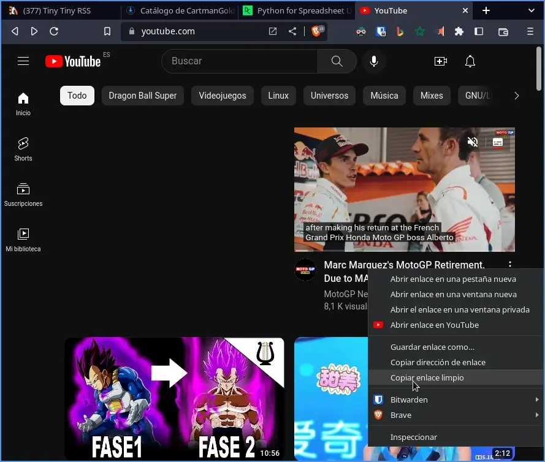

El reproductor de vídeo MPV es conocido por su eficiencia y simplicidad. Si eres un entusiasta de los vídeos en línea y deseas disfrutar de tus contenidos favoritos de YouTube, Twitch u otras plataformas directamente en MPV, estás de suerte. En este artículo, te mostraremos cómo ver los vídeos del navegador web en MPV mediante xclip, Yt-dlp y un simple atajo de teclado. Además lo haremos de forma transparente y sin necesidad de instalar ninguna extensión en el navegador web.<!--more-->

## BENEFICIOS DE VER LOS VÍDEOS EN MPV EN VEZ DE UN REPRODUCTOR WEB

Algunos de los beneficios obtenidos al usar MPV en vez de un reproductor web, como por ejemplo el de Youtube, son los siguientes:

1. **Eficiencia y bajo consumo de recursos:** MPV es conocido por su eficiencia y bajo consumo de recursos en comparación con los reproductores web. Esto se traduce en un menor uso de la CPU y la memoria de tu sistema, lo que puede ser beneficioso especialmente en equipos más antiguos o con recursos limitados.
2. **Mejor calidad de reproducción:** MPV utiliza tecnología de renderizado de alta calidad, lo que resulta en una reproducción más nítida y fluida. Además, al reproducir vídeos en MPV, no estás limitado por las restricciones o limitaciones de los reproductores de vídeo web, lo que puede resultar en una mejor calidad de imagen y sonido.
3. **Mayor control y personalización:** MPV te brinda un mayor control sobre la reproducción de vídeos. Puedes ajustar y personalizar aspectos como la velocidad de reproducción, la relación de aspecto, los filtros de vídeo, el audio, entre otros. Esto te permite adaptar la experiencia de visualización según tus preferencias.

## PLATAFORMAS DE VÍDEO COMPATIBLES CON EL MÉTODO QUE VERÁN A CONTINUACIÓN

El método que verán a continuación es útil para visualizar vídeos de la totalidad de [plataformas soportadas por Yt-dlp](https://github.com/yt-dlp/yt-dlp). Esto significa que podremos **visualizar vídeos y directos de Youtube y Twitch**. Además también podremos visualizar vídeos de otras plataformas como por ejemplo **DailyMotion, Vimeo, Pandora.tv, Odysee, TED, Archive.org, ESPN, Soundcloud, Mixcloud**, etc.

## INSTALAR LOS SIGUIENTES PAQUETES O PROGRAMAS PARA VER LOS VÍDEOS DEL NAVEGADOR EN MPV

Para poder visualizar los vídeos que normalmente veis en el navegador en MPV tendréis que instalar los siguientes programas.

### Instalación de xclip

Para instalar xclip tan solo tenéis que ejecutar el siguiente comando en la terminal.

> ```shell
> sudo apt install xclip libnotify-bin
> ```

La utilidad xclip es un herramienta sin entorno gráfico que nos ayudará a acceder al texto que tenemos copiado en el portapapeles. De esta forma podremos reproducir cualquier link de vídeo que tengamos copiado en nuestro papeles en el reproductor MPV u en otro reproductor.

### Instalación y configuración del reproductor de vídeo mpv

Para instalar y configurar el reproductor de vídeo mpv les recomiendo que sigan las instrucciones del siguiente enlace:

https://geeklandlinux.github.io/posts/instalar-y-configurar-el-reproductor-mpv-en-debian-y-derivados/

La configuración de MPV se halla en el fichero `~/.config/mpv/mpv.conf`. En mi caso el contenido del fichero de configuración para mi equipo de recursos limitados es el siguiente:

> ```shell
> [default]
> vo=gpu
> hwdec
> ao=pulse
> ```

- Las líneas `vo=gpu` y `hwdec` son para forzar que la decodificación gráfica se realice mediante hardware.
- El parámetro `ao=pulse` indica que quiero usar pulseaudio para la salida de audio.

### Instalación y configuración de Yt-dlp

Existen diversas formas para instalar Yt-dlp. No obstante en mi caso siempre acostumbro a usar el [gestor de paquetes pip](). Para ello ejecuto el siguiente comando en la terminal:

> ```shell
> python3 -m pip install -U yt-dlp --break-system-packages
> ```

Acto seguido introduzco el comando `@reboot (sleep 70 ; python3 -m pip install -U yt-dlp --break-system-packages)` en el crontab de mi distribución. De este modo aseguraré que siempre tengo la última versión de Yt-dlp instalada en mi equipo. Para introducir el comando en el crontab tan solo tenéis que ejecutar el siguiente comando:

> ```shell
> crontab -e
> ```

Cuando se abra el editor de textos os vais a la parte final del fichero y pegáis el siguiente código:

> ```shell
> @reboot  (sleep 70 ; python3 -m pip install -U yt-dlp --break-system-packages)
> ```

La configuración de Yt-dlp se halla en el fichero `~/.config/yt-dlp/config`. Para acceder al fichero de configuración tendrán que teclear el siguiente comando en la terminal:

> ```shell
> nano ~/.config/yt-dlp/config
> ```

Una vez se abra el editor de texto nano podremos realizar la configuración de Yt-dlp. En mi caso tan solo he añadido la siguiente opción en el fichero de configuración:

> ```shell
> -S "codec:h264"
> ```

Una vez añadida la opción hay que guardar los cambios y cerrar el fichero. Con esta opción de configuración forzaremos que la totalidad de vídeos que Yt-dlp descarga para posteriormente reproducirlos en el reproductor mpv sean con el codec h264. He forzado y seleccionado este codec porque mi tarjeta gráfica ofrece aceleración gráfica por hardware para este codec. No es necesario realizar este paso en el caso que tengan una tarjeta gráfica actual compatible con los codecs actuales.

## SCRIPT PARA REPRODUCIR LOS VIDEOS DEL NAVEGADOR EN MPV

Ahora tan solo tenemos que crear un script muy simple para reproducir los vídeos que normalmente visualizamos en el navegador web con mpv. Primero generaremos el fichero que contendrá el código ejecutando el siguiente comando en la terminal:

> ```shell
> touch ~/.local/bin/youtube-watch.sh
> ```

Acto seguido lo abrimos con el editor de textos ejecutando el siguiente comando en la terminal:

> ```shell
> nano ~/.local/bin/youtube-watch.sh
> ```

A continuación pegamos el siguiente código en el editor de textos:

> ```shell
> #!/bin/bash
> mpv "$(xclip -o)"
> ```

En el caso que quisieran que el vídeo se abra de forma automática en pantalla completa tendrían que añadir la opción `--fs` del siguiente modo:

> ```shell
> #!/bin/bash
> mpv --fs "$(xclip -o)"
> ```

Si además queréis que antes de reproducir el vídeo aparezca una notificación usando notify-send podéis usar el siguiente script:

> ```shell
> #!/bin/bash
> notify-send -t 3000 "Reproduciendo" "$(xclip -o)";
> mpv --fs "$(xclip -o)"
> ```

Una vez pegado el texto guardamos los cambios y cerramos el editor de textos. A continuación solo tenemos que dar permisos de ejecución al script ejecutando el siguiente comando en la terminal:

> ```shell
> chmod +x ~/.local/bin/youtube-watch.sh
> ```

## CONFIGURACIÓN PARA INICIAR LA REPRODUCCIÓN DEL VÍDEO MEDIANTE UN ATAJO DE TECLADO

Por temas de comodidad ejecutaré el script que acabo de crear mediante el atajo de teclado `windows+y`. Para conseguir lo que acabo de citar dependerá del entorno de escritorio que estemos usando. Como en mi caso uso el escritorio i3 añadiré la siguiente línea en el fichero de configuración de i3.

> ```shell
> bindsym $mod+y exec bash ~/.local/bin/youtube-watch.sh
> ```

En el caso que uséis el entorno XFCE podéis seguir los pasos detallados en el siguiente enlace:

[https://geeklandlinux.github.io/posts/crear-atajos-de-teclado-en-xfce/]()

## COMO VER LOS VÍDEOS DEL NAVEGADOR EN MPV

Una vez realizado todo el proceso de configuración podemos ir a cualquiera de los vídeos que queremos visualizar. Entonces copiamos el enlace o el enlace del hipervínculo que nos dirige al vídeo.



Una vez copiado el enlace tan solo tenéis que presionar la combinación de teclas para ejecutar el script que creamos en apartados anteriores. En mi caso esta combinación de teclas es `Windows+y`. Acto seguido empezará la reproducción del vídeo.


De esta forma tan simple podremos consumir vídeos de Youtube, Vimeo, Dailymotion, Twitch, etc.
