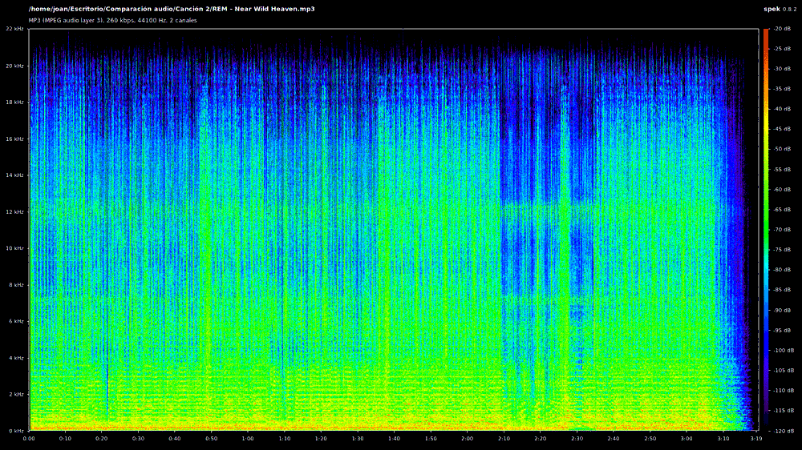
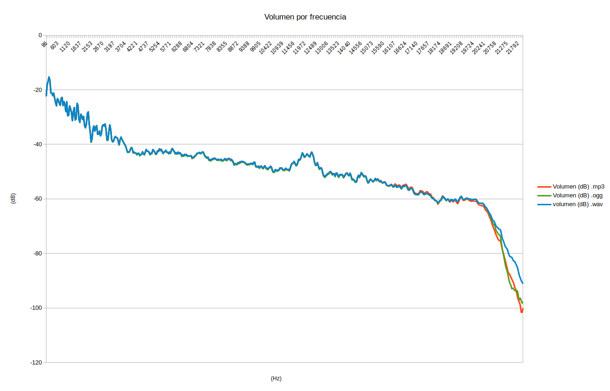
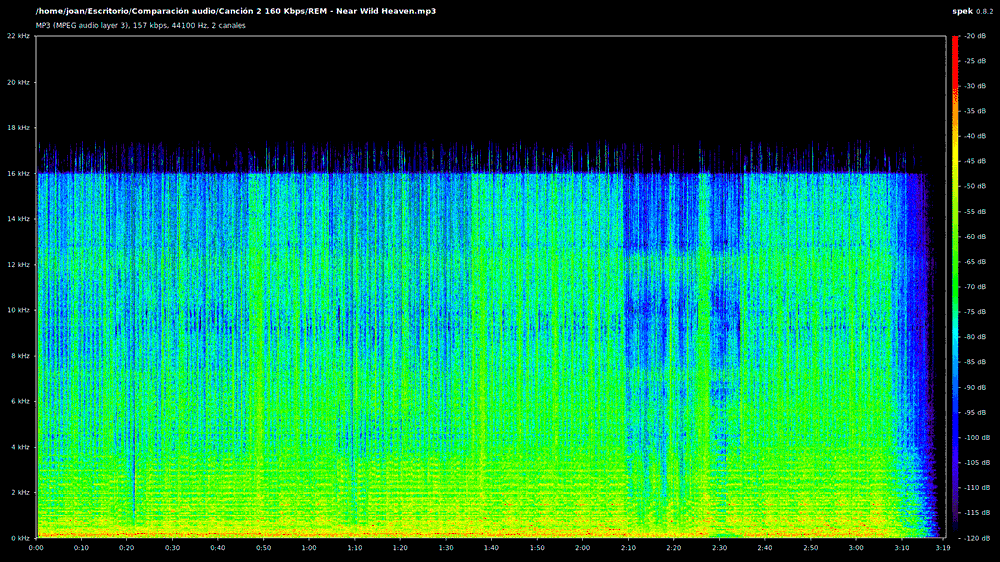
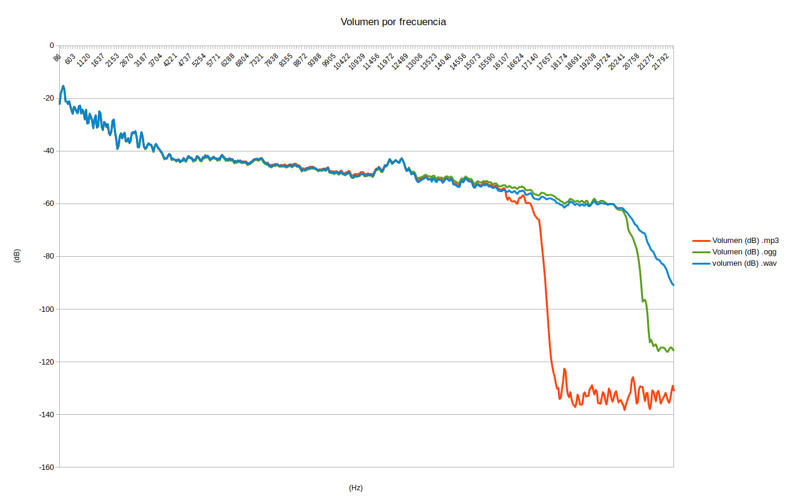

En semanas anteriores citamos y analizamos las [ventajas e inconvenientes del audio .ogg sobre el mp3](). En esta ocasión veremos una comparación práctica para confirmar que los formatos de audio .ogg son técnicamente superiores a los mp3.<!--more-->

## COMPRESORES USADOS EN LA COMPARACIÓN

Los compresores de audio usados en la comparación son los siguientes:

1. Lame para los archivos mp3.
2. Oggenc para los archivos ogg.

Es importante remarcar este detalle porque los compresores que usamos afectan de forma directa al resultado obtenido. A modo de ejemplo el compresor xing comprime el audio mp3 más rápido que lame, pero su calidad de sonido es peor.

## CRITERIOS USADOS EN LA COMPRESIÓN DEL AUDIO

En la compresión de los archivos de audio hemos elegido una tasa de muestreo variable (VBR). Los motivos son los siguientes:

1. Los archivos comprimidos con una tasa de bits variable proporcionan mejores resultados. Además ocupan menos espacio.
2. El compresor oggenc está diseñado para trabajar con una tasa de bits variable. Por lo tanto lo lógico es hacer comparaciones usando una tasa de bits variable.

###### Nota: El compresor oggenc tiene opciones para obtener un bitrate mas o menos constante. No obstante los resultados obtenidos son peores y además la compresión es más lenta.

Los archivos de audio que compararemos dispondrán de una tasa de bits muy similar. De este modo ambos formatos están compitiendo en igual de condiciones.

## COMPARACIÓN ENTRE UN AUDIO OGG Y MP3 A 260 Kpbs

A partir de un archivo de audio sin pérdida .wav, realizaremos 2 archivos comprimidos.

El primero de ellos será un archivo .mp3 y el segundo será un archivo .ogg.

### Parámetros usados para comprimir el archivo .wav a 260 Kbps

Teniendo en cuenta las condiciones fijadas en el inicio del post, los comandos usados para comprimir el archivo .wav a .mp3 y .ogg son los siguientes:

  
|  |   **Comando para comprimir a mp3**   |   **Comando para comprimir a ogg**   |
| --- | --- | --- |
|   Comparación 256-260 Kbps   |   lame -vbr-new -V 0 -q 0 '/home/joan/REM - Near Wild Heaven.wav'   |   oggenc -q 8 '/home/joan/REM - Near Wild Heaven.wav'   |

### Tiempo necesario para comprimir el archivo a 260 Kbps

El tiempo necesario para comprimir el archivo .wav a .mp3 y a .ogg ha sido el siguiente:

  
|  |   **Tiempo en comprimir a mp3 (s)**   |   **Tiempo en comprimir a ogg (s)**   |
| --- | --- | --- |
|   Archivo a 256-260 Kbps   |   12   |   8,8   |

En este caso resulta fácil concluir que la compresión del archivo .ogg es más rápida que la del archivo .mp3.

### Tamaño del archivo comprimido a 260 Kbps

El tamaño de cada uno de los archivos comprimidos es el siguiente:

  
|  |   **Tamaño del archivo mp3 (MB)**   |   **Tamaño del archivo ogg (MB)**   |
| --- | --- | --- |
|   Archivo a 256-260 Kbps   |   6,5   |   6,6   |

La compresión obtenida en ambos casos es de aproximadamente el 81%. Obviamente el resultado obtenido es prácticamente el mismo en los 2 casos. Esto es así y siempre será así porque los 2 archivos que comparamos tienen prácticamente la misma tasa de muestreo.

###### Nota: A mayor compresión obtendremos tamaños de archivo más pequeños, pero necesitaremos más tiempo tiempo comprimir los archivos.

### Comparación del Espectrograma de los 3 audios

En la siguiente imagen animada se pueden observar los espectrogramas de los archivos .wav, .mp3 y .ogg.

Las conclusiones que podemos extraer el espectrograma son las siguientes:

El espectrograma del archivo .ogg es bastante más cercano al del archivo original .wav.

A frecuencias altas se observa que el audio comprimido al formato .mp3 pierde más harmónicos que el que hemos comprimido a .ogg.

Por lo tanto queda claro que durante la compresión el audio .mp3 pierde más sonidos que el audio .ogg

### Nivel de sonido en cada una de las frecuencias a 260 Kbps

Si analizamos el nivel de sonido o volumen en cada una de las frecuencias obtenemos el siguiente resultado:

Los resultados de nivel sonido en cada una de las frecuencias son muy similares al audio original.

El nivel de sonido del .mp3 y el .ogg se ajustan a la perfección hasta los 20 Khz. A partir de los 20 Kz tanto el archivo .ogg como el .mp3 pierden nivel de sonido en comparación con el audio .wav. Esto es así porque una de las operaciones que realizan los compresores de audio es eliminar sonidos en frecuencias no perceptibles por el oído humano.

El nivel de sonido que pierde tanto el archivo .ogg como el archivo .mp3 es muy similar, pero parece que la pérdida es más acentuada en el archivo .mp3.

### Conclusiones de la comparación realizada a 260 Kbps

Los 2 audios comprimidos presentan buena calidad. Cualquiera de los 2 audios debería satisfacer a las personas que les gusta escuchar música en buena calidad.

Vemos que el tiempo de compresión y la calidad del sonido obtenida es mejor en el formato de archivo .ogg. No obstante la diferencia en este caso es muy pequeña.

El resultado mostrado para el archivo .mp3 corresponde a la máxima calidad que podemos obtener con el compresor Lame. El compresor oggenc aún nos ofrece 2 niveles de calidad superior. Por lo tanto Ogg aun nos permitiría obtener audios de mayor calidad a costa de incrementar el tamaño del archivo.

## COMPARACIÓN ENTRE UN AUDIO OGG Y MP3 A 160 Kpbs

A partir de un archivo de audio sin pérdida .wav, realizaremos 2 archivos comprimidos a 160 Kbps.

El primero de ellos será un archivo .mp3 y el segundo será un archivo .ogg.

### Parámetros usado para comprimir el archivo a 160 Kbps

Teniendo en cuenta las condiciones fijadas en el inicio del post, los comandos usados para comprimir el archivo .wav a .mp3 y .ogg son los siguientes:

  
|  |   **Comando para comprimir a mp3**   |   **Comando para comprimir a ogg**   |
| --- | --- | --- |
|   Comparación 160 Kbps   |   lame -vbr-new -V 4 -q 5 '/home/joan/REM - Near Wild Heaven.wav'   |   oggenc -q 5 '/home/joan/REM - Near Wild Heaven.wav'   |

### Tiempo necesario para comprimir el archivo a 160 Kbps

El tiempo necesario para comprimir el archivo .wav a .mp3 y a .ogg ha sido el siguiente:

  
|  |   **Tiempo en comprimir a mp3 (s)**   |   **Tiempo en comprimir a ogg (s)**   |
| --- | --- | --- |
|   Archivos a 160 Kbps   |   7   |   7,4   |

En este caso el tiempo es prácticamente el mismo. No puedo determinar cual de los 2 es el más rápido porque Lame no proporciona tiempos en valor decimal.

### Tamaño del archivo comprimido a 160 Kbps

El tamaño de cada uno de los archivos comprimidos es el siguiente:

  
|  |   **Tamaño del archivo mp3 (MB)**   |   **Tamaño del archivo ogg (MB)**   |
| --- | --- | --- |
|   Archivos a 160 Kbps   |   3,9   |   4   |

La compresión obtenida en ambos casos es de aproximadamente el 89%. Obviamente el resultado obtenido es prácticamente el mismo en los 2 casos. Esto es así y siempre será así porque los 2 archivos que comparamos tienen prácticamente la misma tasa de muestreo.

### Comparación del Espectrograma de los 3 audios

En la siguiente imagen animada se pueden observar los espectrogramas de los archivos .wav, .mp3 y .ogg.

Las conclusiones que podemos extraer del espectrograma son las siguientes:

En este caso la diferencias que podemos observar son muy grandes.

El archivo .mp3 prácticamente no contiene sonidos a partir de los 16 KHz. En cambio en el archivo .ogg existen sonidos hasta los 20 Khz y para ocupar tan solo 4 MB obtiene un resultado muy bueno.

En este caso queda muy claro claro que durante la compresión, el audio .mp3 pierde muchos más sonidos que el audio .ogg

Nivel de sonido en cada una de las frecuencias a 160 Kbps Si analizamos el nivel de sonido o volumen en cada uno de las frecuencias obtenemos el siguiente resultado:

En este caso existe una gran diferencia entre los distintos formatos de audio.

Vemos de forma muy clara entre 16 Khz y 22 KHz el audio .mp3 ha perdido la totalidad de sonidos.

En cambio el nivel de volumen del archivo .ogg es prácticamente el mismo que el .wav hasta los 20 Khz.

El nivel de sonido perdido por el archivo .mp3 es mucho mayor que el archivo .ogg. Por lo tanto los resultados obtenidos por el audio .ogg son mucho mejores en este caso.

### Conclusiones de la comparación realizada a 160 Kbps

Existe una gran diferencia de calidad entre los 2 archivos que estamos analizando.

A igualdad de tamaño y a igualdad de tiempo de compresión, el archivo .ogg ofrece unos resultados mucho mejores que un archivo .mp3.

Cualquier persona que tenga un oído fino y disponga de unos auriculares o altavoces en condiciones dirá que el audio .mp3 no tiene una calidad adecuada.

## CONCLUSIONES FINALES

La conclusión después de realizar varias pruebas son las siguientes:

1. Los archivos de audio .ogg a igualdad de condiciones ofrecen mejor calidad que los archivos .mp3.
2. Incluso con una tasa de muestreo inferior, los archivos .ogg son capaces de ofrecer mejor calidad de sonido que un archivo .mp3.
3. Cuanto más alta es la compresión de los archivos, mayor es la diferencia de calidad existente entre un audio .mp3 y .ogg. Cuando la tasa de muestreo es elevada la diferencia de calidad entre los 2 archivos es más pequeña.

En este artículo hemos realizado un análisis basándonos en parámetros técnicos de los archivos de audio. No obstante la mejor forma de llegar a conclusiones es disponer de un buen oído y unos buenos medios para poder escuchar las diferencias entre los 2 archivos de audio.
