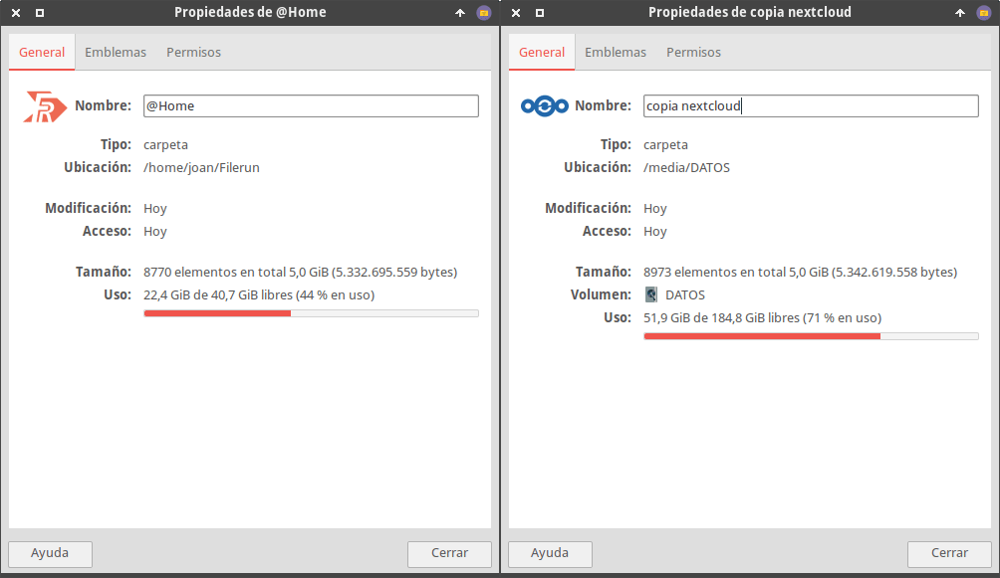
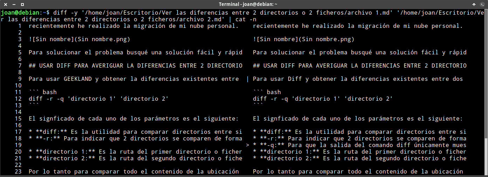

Recientemente he realizado una migración de mi nube personal y me he visto con la necesidad de comparar directorios y archivos para comprobar que la migración se ha realizado con éxito. Estaba usando Nextcloud y ahora mismo estoy probando Filerun. En el momento de traspasar la información de una nube a la otra todo fue a la perfección. Pero me encontré con la desagradable sorpresa que la copia de seguridad de la nube antigua tenia más ficheros que el contenido subido a la nube nueva.<!--more-->

[](images/directorios-diferentes-pendientes-analizar.png)

Para solucionar el problema busqué una solución fácil y rápida para ver las diferencias existentes entre el contenido que estaba almacenado en la copia de seguridad y el que estaba subido a la nube. Para ello use el comando Diff.

## USAR DIFF PARA COMPARAR DIFERENCIAS ENTRE 2 DIRECTORIOS

Para usar Diff y obtener la diferencias existentes entre dos directorios tan solo tenéis que ejecutar un comando del siguiente tipo:

> **`diff -r -q 'directorio 1' 'directorio 2'`**

El significado de cada uno de los parámetros es el siguiente:

- **diff:** Es la utilidad para comparar directorios entre si o ficheros entre sí.
- **\-r:** Para indicar que 2 directorios se comparen de forma recursiva. En otras palabras con la opción `-r` también se compararán todos los subdirectorios que están dentro del directorio analizado.
- **\-q:** Para que solo salgan en pantalla los ficheros que difieren de un directorio a otro.
- **directorio 1:** Es la ruta del primer directorio o fichero a comparar.
- **directorio 2:** Es la ruta del segundo directorio o fichero a comparar.

Por lo tanto para comparar todo el contenido de la ubicación `'/home/joan/Filerun/@Home'` con `'/media/DATOS/copia nextcloud'` ejecutaremos el siguiente comando:

> ```shell
> diff -rq '/home/joan/Filerun/@Home' '/media/DATOS/copia nextcloud' 
> ```

Y el resultado obtenido será similar al siguiente:

> ```shell
> joan@debian:~$ diff -rq '/home/joan/Filerun/@Home' '/media/DATOS/copia nextcloud' 
> Sólo en /media/DATOS/copia nextcloud: 2019
> Sólo en /media/DATOS/copia nextcloud/Docker/ttrss-docker: .git
> Sólo en /media/DATOS/copia nextcloud/Docker/ttrss-docker-traefik: .git
> Los ficheros /home/joan/Filerun/@Home/folder.png y /media/DATOS/copia nextcloud/folder.png son distintos
> Sólo en /media/DATOS/copia nextcloud: Nextcloud Manual.pdf
> Sólo en /media/DATOS/copia nextcloud/raspi/WireGuard: .git
> Sólo en /home/joan/Filerun/@Home/Wordpress/Copias de seguridad/Shareaholic Logo: sharing-caring.png.upload.temp
> Sólo en /media/DATOS/copia nextcloud/Wordpress/Post publicados/Crear un servidor sftp: Originales
> Sólo en /media/DATOS/copia nextcloud/Wordpress/Post publicados/historico de comandos en linux: .~lock.Como usar el históritco de comandos history.odt#
> Sólo en /media/DATOS/copia nextcloud/Wordpress/Post publicados/servidor gráfico de xfce se desconecta: .~lock.servidor grafico xfce se desconecta.odt#
> Sólo en /media/DATOS/copia nextcloud/Wordpress/scripts: init_nextcloud.sh
> ```

Si miran los resultados verán de forma clara e inequívoca las diferencias entre los 2 directorios. En mi caso no he tenido ningún problema importante en la migración. Las diferencias que vimos al inicio del apartado son debidas a los siguientes motivos:

1. Filerun no subió los ficheros `.~lock.` generados por LibreOffice. Que se copie o no se copie este fichero me es indiferente. Por lo tanto no es ningún problema.
2. En mi Nextcloud tenia directorios que estaban vacíos. Los directorios que estaban vacíos no se copiaron en la migración. Por lo tanto es un problema muy menor.
3. El resto de diferencias son cambios que yo mismo realice y no me deberían preocupar.
4. Algunos de los archivos ocultos o temporales no trasladaron. Por lo tanto si alguno es de mi interés lo tendré que subir manualmente a mi nube.

De este modo tan sencillo podemos ver sin problema las diferencias existentes entre el contenido de dos directorios.

## USAR DIFF PARA COMPARAR EL CONTENIDO DE DOS ARCHIVOS

Del mismo modo que hemos comparado las diferencias existentes entre el contenido de 2 directorios también podemos analizar las diferencias entre 2 archivos o ficheros. Diff en todos las ocasiones y en todos los formatos de archivo podrá detectar si 2 ficheros son iguales o diferentes. Pero únicamente podrá detallar las diferencias entre ficheros cuando estemos comparando ficheros de texto.

**Nota:** Como fichero de texto se incluyen por ejemplo ficheros Markdown, html, etc.

### Comparar si el contenido de 2 ficheros .odt es el mismo

Mediante la utilidad Diff podemos comparar si 2 ficheros son exactamente iguales. Para ello veremos un simple ejemplo. En el ejemplo compararemos el contenido de estos 2 archivos:

1. Borrar archivos temporales V1.odt
2. Borrar archivos temporales V2.odt

Ambos archivos son prácticamente iguales y la única diferencia es que en uno de los archivos he borrado un párrafo.

Para realizar la comparación abro una terminal y tecleo el comando diff seguido del nombre de los archivos que queremos comparar. Por lo tanto en mi caso ejecuto el siguiente comando:

> ```shell
> diff '/home/joan/Borrar archivos temporales V1.odt' '/home/joan/Borrar archivos temporales V2.odt'
> ```

Después de ejecutar el comando obtengo el siguiente resultado:

> ```shell
> Los ficheros binarios /home/joan/Borrar archivos temporales V1.odt y /home/joan/Borrar archivos temporales V2.odt son distintos
> ```

Por lo tanto los ficheros `/home/joan/Borrar archivos temporales V1.odt` y `/home/joan/Borrar archivos temporales V2.odt` son distintos. Como los ficheros que comparamos no son archivos de texto, Diff no es capaz de detallar las diferencia entre ellos. Pero almenos nos detalla que no son iguales.

**Nota**: Para ver las diferencias entre 2 ficheros .odt lo podríamos hacer con LibreOffice.

### Comparar las diferencias de contenido existentes entre 2 ficheros de texto o Markdown

Si comparamos 2 ficheros de texto podemos incluso obtener el detalle de las diferencias existentes entre los 2 ficheros. A continuación compararemos el contenido de los ficheros `/home/joan/archivo_1.md` y `/home/joan/archivo_2.md`. Para ello tan solo tendremos que ejecutar el siguiente comando:

> ```shell
> diff '/home/joan/archivo_1.md' '/home/joan/archivo_2.md'
> ```

El resultado obtenido en mi caso es el siguiente:

> ```shell
> joan@debian:~$ diff '/home/joan/archivo_1.md' '/home/joan/archivo_2.md'
> 9c9
> < Para usar GEEKLAND y obtener la diferencias existentes entre dos directorios tan solo tenéis que ejecutar un comando del siguiente tipo:
> ---
> > Para usar Diff y obtener la diferencias existentes entre dos directorios tan solo tenéis que ejecutar un comando del siguiente tipo:
> 18a19
> > * **-q:** Para que la salida del comando diff únicamente muestre las diferencias existentes entre los directorios o ficheros comparados.
> ```

El código usado para indicar las diferencias entre ficheros es del siguiente tipo:

> ```shell
> línea_fichero_1   tipo_de_cambio   línea_fichero_2   <   >
> ```

El significado de cada uno de los parámetros es el siguiente:

- **linea\_fichero\_1**: Corresponde a la línea del fichero 1 que ha cambiado respecto al fichero 2.
- **tipo\_de\_cambio**: Encontraremos 3 opciones. **a**: Añadir **c**: Cambiar y **d**: Borrar
- **linea\_fichero\_2**: Corresponde a la línea del fichero 2 que ha cambiado respecto al fichero 1.
- **<**: Hace referencia a la línea que presenta cambios en el fichero 1
- **\>**: Hace referencia a la línea que presenta cambios en el fichero 2.

Por lo tanto si interpretamos los resultados mostrados por el comando diff llegaremos a las siguientes conclusiones:

- La línea **9** del archivo\_1 ha cambiado (**c**) respecto la línea 9 del archivo\_2. A continuación y después de los símbolos **<** y **\>** se detalla el contenido de la línea 9 del archivo\_1 y de la línea 9 del archivo\_2. De este modo se pueden ver las diferencias.
- Comparando el archivo\_1 con el archivo\_2 podemos afirmar que después de la línea 18 de archivo\_2 se ha añadido (**a**) una nueva línea en el fichero\_2. La nueva línea añadida en el fichero 2 será la **19**. Acto seguido después del símbolo **\>** se muestra el nuevo contenido añadido a la línea 19 del archivo\_2.

Por lo tanto, en este caso podemos conocer de forma precisa y exacta las diferencias existentes entre los 2 ficheros.

### Ver las diferencias existentes entre 2 ficheros de forma más visual

Si pretendemos ver las diferencias entre 2 ficheros de una forma más visual tan solo tendríamos que añadir la opción `-y` y el parámetro `| cat -n` para que se muestren los número de línea. Por lo tanto si añadimos estos parámetros en el comando del apartado anterior acabaremos ejecutando el siguiente comando:

> ```shell
> diff -y '/home/joan/Escritorio/Ver las diferencias entre 2 directorios o 2 ficheros/archivo 1.md' '/home/joan/Escritorio/Ver las diferencias entre 2 directorios o 2 ficheros/archivo 2.md' | cat -n
> ```

Y el resultado del comando que acabamos de aplicar será el siguiente:

[](images/diferencias-entre-ficheros-forma-grafica.png)

**Nota:** Observe que la columna central se informa mediante símbolos de las líneas en que se ha introducido cambios.

Si únicamente quisiéramos ver las líneas que no coinciden podríamos usar la opción `--suppress-common-lines` del siguiente modo:

> ```shell
> diff -y --suppress-common-lines '/home/joan/Escritorio/Ver las diferencias entre 2 directorios o 2 ficheros/archivo 1.md' '/home/joan/Escritorio/Ver las diferencias entre 2 directorios o 2 ficheros/archivo 2.md'
> ```

Y el resultado obtenido sería el siguiente:

> ```shell
> joan@debian:~$ diff -y --suppress-common-lines '/home/joan/Escritorio/Ver las diferencias entre 2 directorios o 2 ficheros/archivo 1.md' '/home/joan/Escritorio/Ver las diferencias entre 2 directorios o 2 ficheros/archivo 2.md'
> Para usar GEEKLAND y obtener la diferencias existentes entre  |	Para usar Diff y obtener la diferencias existentes entre dos 
> 							      >	* **-q:** Para que la salida del comando diff únicamente mues
> ```

## OPCIONES QUE OFRECE EL COMANDO DIFF PARA COMPARAR DIRECTORIOS Y FICHEROS

A largo del artículo han visto que el comando diff tiene multitud de opciones/parámetros para modificar el contenido que nos muestra en pantalla. Algunas de las opciones más comunes son las siguientes:

| Opciones de diff | Explicación |
| --- | --- |
| **`-s`** | Unicamente nos notifica cuando 2 ficheros son idénticos. |
| **`-q`** | Para que solo salgan en pantalla los ficheros que difieren de un directorio a otro. |
| **`-r`** | Comprueba los directorios de forma recursiva. |
| **`--no-dereference`** | Para ignorar y no seguir los [enlaces simbólicos](). |
| **`--ignore-file-name-case`** | Se ignorar las diferencias entre mayúsculas y minúsculas en el caso que comparemos las diferencias entre nombres de fichero. |
| **`--no--ignore-file-name-case`** | Para que no se ignoren las diferencias entre mayúsculas y minúsculas en el caso que comparemos las diferencias entre nombres de fichero. |
| **`-i`** | Ignora las diferencias entre mayúsculas y minúsculas en el contenido de los ficheros. |
| **`-E`** | Ignora las diferencias de tabulaciones entre 2 ficheros. |
| **`-Z`** | Para ignorar los espacios en blanco al final de cada una de las líneas. |
| **`-B`** | Ignorar las líneas en blanco en la comparación de 2 ficheros. |
| **`-y`** | Para mostrar dos columnas y de esta forma poder comparar gráficamente las diferencias entre 2 ficheros. |
| **`--supress-common-lines`** | Cuando se comparan 2 ficheros de texto únicamente se muestran las líneas que son diferentes. |
| **`-b`** | Hacer una comparación omitiendo los espacios en blanco |

Si quieren obtener la totalidad de opciones de diff tan solo tienen que consultar las páginas man de diff ejecutando el siguiente comando en la terminal:

> ```shell
> man diff
> ```

Verán que existen muchas más opciones como por ejemplo no comparar archivos que empiecen con un nombre determinado, etc.

## ALTERNATIVAS AL COMANDO DIFF PARA COMPARAR DIRECTORIOS Y ARCHIVOS

Existen numerosas alternativas al comando diff como por ejemplo sdiff, rsync, meld, vimdiff, etc. Incluso existen alternativas con entorno gráfico como por ejemplo melt.

Meld es una mera interfaz gráfica de Diff. Por lo tanto Meld es una buena opción para los usuarios que odien la terminal. Meld nos mostrará gráficamente las diferencias entre archivos y directorios. Además nos permitirá editar estos archivos desde el propio programa.

Otras opciones como por ejemplo rsync o vimdiff destacan por ser capaces de comparar ficheros y directorios de forma remota mediante el protocolo SSH. Por lo tanto en función de sus necesidades o conocimientos tienen multitud de soluciones para comparar ficheros y directorios en Linux.
