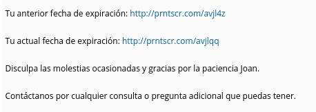
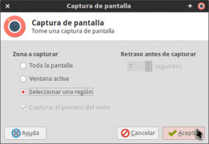
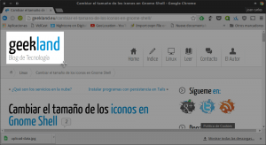
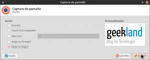
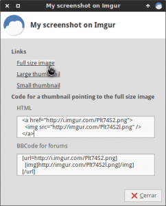
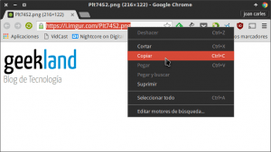
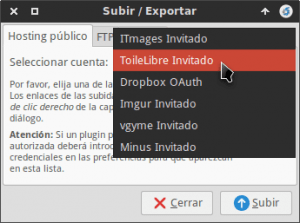

Tal y como se puede ver en la captura de pantalla, existen ocasiones en las que tenemos que realizar capturas de pantalla para posteriormente compartirlas en internet mediante un link.<!--more-->

[](images/Ejemplo-de-compartir-capturas-de-pantalla-mediante-enlaces.png)

El proceso para realizar lo que acabamos de ver puede ser tedioso, pero existen diversas soluciones para poder automatizar este proceso y realizarlo en cuestión de segundos. Algunas de estas opciones son las siguientes:

1. Utilizar el programa **Shutter**.
2. Utilizar el **capturador de pantallas del escritorio XFCE**.
3. Utilizar **el script imgur-screenshot**. Para encontrar información adicional de como usar este interesante script pueden consultar el siguiente [enlace](http://www.webupd8.org/2016/04/take-screenshots-and-upload-to-imgur.html "Subir capturas de pantalla de Imgur de forma automática").

Como mi entorno de escritorio habitual es XFCE empezaré detallando como compartir automáticamente nuestras capturas de pantalla mediante enlaces en XFCE.

## COMPARTIR CAPTURA DE PANTALLA MEDIANTE UN ENLACE EN XFCE

El proceso para crear enlaces para compartir nuestras capturas de pantalla es sumamente fácil. En el caso de ser usuarios del entorno de escritorio XFCE tan solo tenemos que **abrir una terminal y teclear el siguiente comando**:

> ```
> xfce4-screenshooter -u
> ```

###### Nota: Podemos crear un atajo de teclado para ejecutar automáticamente el capturador de pantalla presionando la tecla Impr Pant. Para ello tan solo tenemos que seguir las instrucciones del siguiente [enlace]().

Después de ejecutar el comando se abrirá la ventana del capturador de pantallas de XFCE para que podamos seleccionar la opción de captura que más nos convenga. En mi caso **selecciono la opción Seleccionar una región** y seguidamente **presiono el botón Aceptar**.

[](images/Seleccionar-el-tipo-de-captura-de-pantalla-a-realizar.png)

A continuación **seleccionamos la región de nuestra pantalla que queremos capturar**:

[](images/seleccionar-región-a-copiar.png)

Finalmente aparecerá la siguiente ventana en la que deberemos **seleccionar el servicio en la nube que queremos usar** para alojar nuestra imagen, los servicios ofrecidos son ZimageZ e Imgur. **En mi caso**, tal y como pueden observar en la captura de pantalla, **elijo** la opción alojarla en **Imgur** y finalmente **presiono el botón Aceptar**.

[](images/Seleccionar-el-servicio-a-usar.png)

Después de presionar el botón Aceptar se subirán las fotos a la nube y a continuación **aparecerá la siguiente ventana en la que podremos obtener de forma fácil los enlaces que estamos buscando**.

[](images/Links-disponibles-en-XFCE.png)

Si observamos la ventana podemos ver que existen los siguientes links:

> ```
> Full size image
> Large Thumbnail
> Small Thumbnail
> ```

Si **ciclamos en el primero de los links** se abrirá nuestro navegador predeterminado con la imagen a resolución completa de la captura de pantalla que hemos subido a la nube. Una vez abierta la imagen, tal y como se puede ver en la captura de pantalla, tan solo tenemos que **copiar el link del navegador habiendo cumplido nuestro objetivo**.

[](images/Obtención-del-link.png)

###### Nota: Si en vez de clicar en el primer link clicamos en el segundo o en el tercero también obtendremos un link de nuestra captura de pantalla, pero la resolución de la captura de pantalla obtenida será inferior a la captura a la original.

Además **si observamos la ventana que nos muestra los enlaces,** también **veremos que se nos muestra el código** a introducir **para insertar nuestra captura de pantalla en una página web o en un foro** mediante código HTML y BBcode respectivamente.

### Limitaciones del método usado

El método que hemos visto presenta limitaciones. Las limitaciones que presenta el método son los limites que tiene la nube en la que subimos nuestras capturas de pantalla.

Así por ejemplo en el caso de usar la nube Imgur sin realizar ningún tipo de registro tendremos las siguientes limitaciones:

1. Las **capturas** de pantalla subidas en la nube **desaparecerán si nadie accede a ellas en** un periodo de **6 meses**.
2. Al ser usuarios no registrados el **tamaño máximo de la captura** de pantalla que podremos subir a la nube **es de 20 Megas**.
3. Si subimos una **imagen con formato .png superior a 5 Megas será automáticamente transformada a jpeg**.
4. En el caso de subir **archivos .gif** el tamaño máximo que podemos subir a imgur son **200 megas**.
5. **Una vez subida la captura de pantalla se comprimirá y se optimizará** para visualizar la captura en entornos web. Si el tamaño de la captura que subimos es inferior a 5 Megas la pérdida de calidad será imperceptible. Si la captura de pantalla tiene un tamaño superior a 5 Megas se aplicará una algoritmo de compresión más agresivo.
6. El número **límite de capturas** de pantalla q**ue podemos subir a una cuenta de Imgur gratuita es de 255**.
7. **No se permite hotlinking**. Por lo tanto no se puede usar Imgur como un CDN.

**Si en vez de usar Imgur usamos ZimageZ** las limitaciones que tendremos serán diferentes a las que acabamos de citar. Algunas de las principales diferencias entre el uso de Imgur y ZimageZ son:

1. Para usar ZimageZ **necesitaremos crearnos una cuenta de usuario**. Esto en si es una molestia pero por contrapartida sabremos en todo momento las capturas que hemos subido a la nube y las podremos gestionar y administrar según nuestras necesidades.
2. **Podemos subir tantas capturas de pantalla como queramos** en este servicio.
3. Al tener que crear una cuenta **nuestras imágenes estarán siempre disponibles** y no se borrarán.
4. **No se pueden subir imágenes** o capturas de pantalla **con un tamaño superior a 7 Megas**.
5. **No se permite hotlinking**. Por lo tanto no se puede usar Imgur como un CDN.

## COMPARTIR CAPTURA DE PANTALLA MEDIANTE UN ENLACE CON SHUTTER

En el caso que hayan usuarios que no les guste usar el capturador de pantalla de XFCE "xfce4-screenshooter", pueden usar el Software Shutter para conseguir un resultado similar al que acabamos de ver. Para ello los pasos a seguir son los siguientes:

### Instalar Shutter

La gran mayoría de distribuciones que se precian disponen del software Shutter en sus repositorios. Por lo tanto **en el caso de usar Debian o distribuciones derivadas de Debian** tan solo tienen que abrir una terminal y teclear el siguiente comando:

> ```
> sudo apt-get install shutter
> ```

**En el caso de usar ArchLinux o distribuciones derivadas de Archlinux**, como por ejemplo Manjaro o Antergos, tan solo tienen que abrir una terminal y ejecutar el siguiente comando:

> ```
> sudo pacman -S shutter
> ```

**En el caso de usar Fedora o distribuciones derivadas de Fedora**, como por ejemplo Korora, tan solo tienen que abrir una terminal y ejecutar el siguiente comando:

> ```
> sudo dnf install shutter
> ```

Finalmente **si los usuarios de Ubuntu quieren disponer siempre de la última versión** de Shutter **deben instalarlo** a través repositorios **siguiendo las siguientes instrucciones**:

Para agregar el repositorio de shutter **abrimos una terminal y ejecutamos el siguiente comando**:

> ```
> sudo add-apt-repository ppa:shutter/ppa
> ```

Una vez añadido el repositorio tan solo tenemos **actualizar los repositorios actuales ejecutando el siguiente comando el terminal**:

> ```
> sudo apt-get update
> ```

Finalmente ya solo nos queda **instalar shutter ejecutando el siguiente comando en la terminal**:

> ```
> sudo apt-get install shutter
> ```

Una vez finalizada la instalación ya podemos pasar a realizar capturas de pantalla.

### Realizar la captura de pantalla con shutter

**Abrimos el programa** Shutter y **seleccionamos la opción que queremos para realizar la captura de pantalla**. En mi caso, tal y como se puede ver en la captura de pantalla, elijo capturar la ventana del navegador Instalar Spotify en Ubuntu y derivadas. **Una vez seleccionada la opción se realizará la captura de pantalla**.

[](images/Capturar-pantalla-con-shutter.png)

### Subir la captura de pantalla en la nube y obtener los enlaces

Una vez realizada la captura de pantalla, tal y como podemos ver en la siguiente imagen, **clicamos encima del botón Subir sus imágenes a un servicio de Alojamiento**.

[](images/Subir-la-imagen-a-la-nube-en-Shutter.png)

Después de presionar el botón aparecerá la siguiente ventana en la que **en la pestaña Hosting público** deberemos **seleccionar el servicio de almacenamiento que queremos usar** para subir nuestra captura de pantalla a internet.

[](images/Seleccionar-la-nube-a-usar-en-Shutter.png)

**En mi caso selecciono el servicio ToileLibre Invitado** **y presiono el botón Subir**. Después de presionar el botón **la imagen subirá automáticamente a la nube**. Una vez finalizado el proceso de subida nos **aparecerá una ventana que nos mostrará diversos enlaces para poder compartir nuestra captura de pantalla** en páginas web, en foros, etc.

[](images/Obtención-de-los-links-en-shutter.png)

###### Nota: Shutter no solo permite subir nuestras capturas de pantalla a hostings públicos predeterminados como por ejemplo Imgur. Shutter también nos permite subir nuestras capturas de pantalla a servidores privados ftp.

Con estos simples pasos podemos compartir nuestras capturas de pantalla de forma fácil rápida en Internet.
