En el siguiente post veremos como podemos compartir cualquier carpeta de nuestro sistema operativo mediante el gestor de archivos Thunar. Para conseguir nuestro propósito usaremos las herramientas samba, el plugin thunar-shares-plugin y seguiremos las siguientes instrucciones.<!--more-->

## INSTALAR THUNAR-SHARES-PLUGIN

Las instrucciones a seguir para instalar el [plugin](https://goodies.xfce.org/projects/thunar-plugins/thunar-shares-plugin "Web del plugin Thunar-shares-plugin") thunar-shares-plugin son las siguientes:

### Instalar Thunar-Shares-plugin en cualquier distro

Es más que posible que la gran mayoría de distros no dispongan del paquete thunar-shares-plugin en sus repositorios. Si este es vuestro caso deberéis compilar el plugin siguiendo las siguientes instrucciones:

Primero instalamos los paquetes necesarios para compilar el programa y para que thunar-shares-plugin funcione de forma adecuada. Para ello ejecutamos el siguiente comando en la terminal:

> ```
> sudo apt-get install xfce4-dev-tools libglib2.0-dev libgtk2.0-dev libthunarx-2-dev samba libpam-smbpass checkinstall wget build-essential git
> ```

Seguidamente creamos la carpeta donde descargaremos el código fuente del plugin thunar-shares-plugin ejecutando el siguiente comando en la terminal:

> ```
> mkdir ~/thunar_plugin
> ```

Accedemos a la carpeta que acabamos de crear ejecutando el siguiente comando:

> ```
> cd ~/thunar_plugin
> ```

A continuación descargamos el código fuente del plugin ejecutando el siguiente comando en la terminal:

> ```
> git clone git://git.xfce.org/thunar-plugins/thunar-shares-plugin
> ```

Accedemos dentro de la carpeta que acabamos de descargar ejecutando el siguiente comando en la terminal:

> ```
> cd thunar-shares-plugin
> ```

Comprobamos que tenemos instaladas todas las dependencias necesarias y creamos el makefile ejecutando el siguiente comando en la terminal:

> ```
> ./autogen.sh --prefix=$(pkg-config --variable prefix thunarx-2)
> ```

Seguidamente usaremos el makefile que acabamos de crear ejecutando el siguiente comando en la terminal:

> ```
> make
> ```

A continuación compilamos el programa y creamos un paquete .deb ejecutando el siguiente comando en la terminal:

> ```
> sudo checkinstall
> ```

En el momento que inicie el proceso de creación del paquete se os hará la siguiente pregunta:

> ```
> Should I create a default set of package docs?
> ```

Frente a está pregunta deberéis presionar Enter. De este modo responderéis que Sí porque es el valor por defecto.

[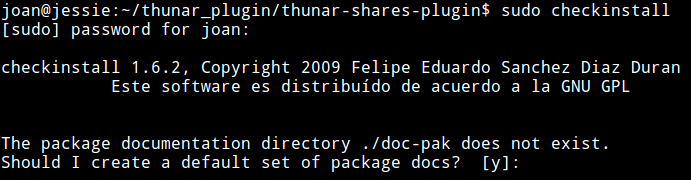](images/crear-documentacion-paquete.png)

A continuación se os pedirá que escribáis una descripción del paquete que estáis construyendo. En mi caso uso la descripción thunar-shares-plugin

[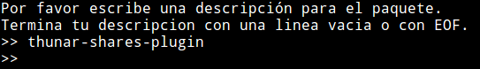](images/descripcion-del-paquete.png)

Seguidamente aparecerán los detalles con los que será creado el paquete. Observamos que el valor de la versión es plugin y esto es una problema porque el número de versión tiene que ser un número. Por lo tanto para cambiar la versión escribimos el número 3 y presionamos Enter.

[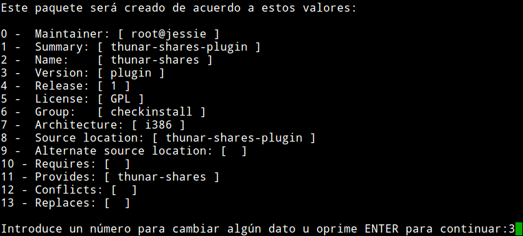](images/cambiar-la-version-del-paquete.png)

A continuación introducimos el número de versión que queramos que tenga el paquete. En mi caso escribo 1 y presiono Enter.

[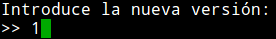](images/introducir-nueva-version.png)

Luego volverán a aparecer los detalles con los que se creará nuestro paquete. Como ahora los valores son correctos presionamos Enter.

[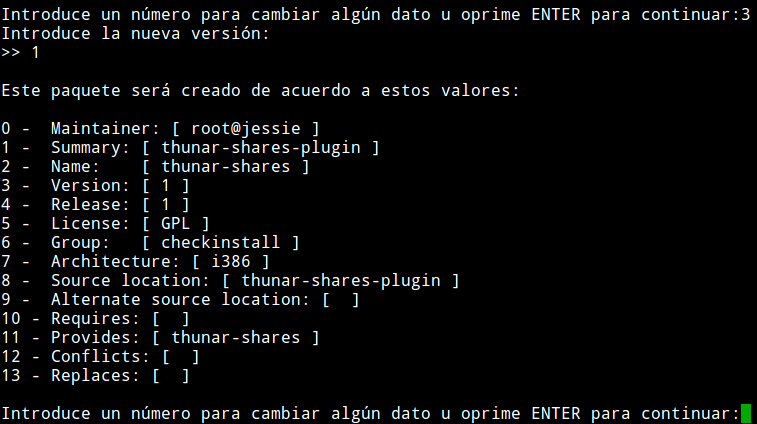](images/detalles-creacion-paquete-correctos.png)

Al cabo de unos segundos, el proceso de creación del paquete finalizará. Si el proceso se realiza con éxito obtendréis el siguiente mensaje:

[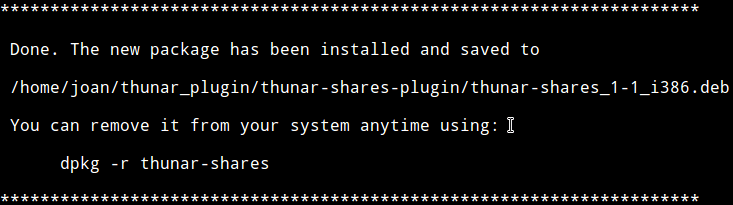](images/paquete-compilado-correctamente.png)

Finalmente instalamos el paquete binario .deb que acabamos de crear mediante el método que crean más conveniente. En mi caso, tal y como se puede ver en la captura de pantalla, lo hago mediante gdebi.

[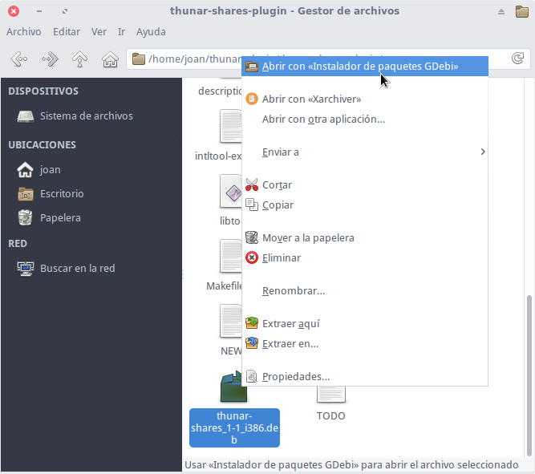](images/instalar-thunar-shares-plugin.png)

### Instalar Thunar-Shares-plugin en Manjaro o en Archlinux

Si pretenden instalar thunar-shares-plugin en Manjaro o Archlinux el procedimiento es mucho más sencillo.

En **archlinux** el paquete thunar-shares-plugin está presente en AUR. Por lo tanto tan solo hay que abrir una terminal y ejecutar el siguiente comando para proceder a su instalación:

> ```
> yaourt -S thunar-shares-plugin
> ```

Los usuarios de **Manjaro** aún lo tienen más fácil. Tan solo tienen que ejecutar el siguiente comando en la terminal:

> ```
> sudo pacman -S thunar-shares-plugin-manjaro
> ```

## CONFIGURAR THUNAR-SHARES-PLUGIN

Para empezar a compartir carpetas tenemos que configurar thunar-shares-plugin. Para ello tenemos que seguir los siguientes pasos:

Primero nos logueamos como root ejecutando el siguiente comando en la terminal:

> ```
> su
> ```

A continuación definimos que la variable USERSHARES\_DIR tenga el valor /var/lib/samba/usershares. La ruta /var/lib/samba/usershares será en la que se montarán las carpetas que queremos compartir. Para conseguir nuestro propósito ejecutamos el siguiente comando en la terminal:

> ```
> export USERSHARES_DIR="/var/lib/samba/usershares"
> ```

Seguidamente definimos que la variable USERSHARES\_GROUP tenga el valor sambashare. Sambashare será el grupo al que pertenecerá el directorio en el que se montarán las carpetas que queremos compartir. Para conseguir nuestro objetivo ejecutamos el siguiente comando en la terminal:

> ```
> export USERSHARES_GROUP="sambashare"
> ```

El siguiente paso consiste en crear la carpeta /var/lib/samba/usershares ejecutando el siguiente comando en la terminal:

> ```
> mkdir -p ${USERSHARES_DIR}
> ```

A continuación creamos el grupo sambashare ejecutando el siguiente comando en la terminal:

> ```
> groupadd ${USERSHARES_GROUP}
> ```

A la carpeta /var/lib/samba/usershares le asignamos el usuario root y el grupo sambashare introduciendo el siguiente comando en la terminal:

> ```
> chown root:${USERSHARES_GROUP} ${USERSHARES_DIR}
> ```

Finalmente asignamos los permisos 01770 al directorio /var/lib/samba/usershares ejecutando el siguiente comando en la terminal:

> ```
> chmod 01770 ${USERSHARES_DIR}
> ```

De esta forma, en el directorio /var/lib/samba/usershares únicamente podrán acceder y escribir el usuario root y los usuarios pertenecientes al grupo sambashare. Además todos los usuarios que tengan permiso de lectura y escritura tan solo podrán borrar los archivos y directorios en que ellos son los propietarios.

Para finalizar este apartado les dejo una captura de pantalla de los comandos ejecutados en este apartado:

[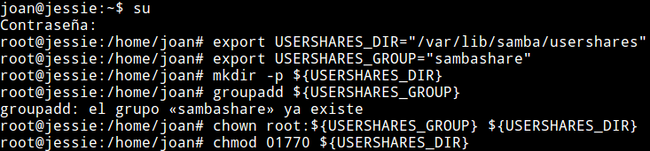](images/comandos-configurar-thunar-share-plugin.png)

## CONFIGURAR SAMBA PARA COMPARTIR CARPETAS CON THUNAR

Una vez configurado thunar-shares-plugin configuraremos samba. Para ello editamos el archivo smb.conf ejecutando el siguiente comando en la terminal:

> ```
> sudo nano /etc/samba/smb.conf
> ```

A continuación, dentro del apartado global del archivo de configuración tenemos que introducir y/o comprobar que estén disponibles los siguientes parámetros de configuración:

> ```
> [global]
>  usershare path = /var/lib/samba/usershares
>  usershare max shares = 100
>  usershare allow guests = yes
>  usershare owner only = yes
> 
> workgroup = WORKGROUP
> ```

[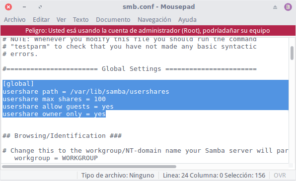](images/configuracion-samba.png)

El significado de cada uno de los parámetros del fichero configuración es el siguiente:

**Línea 1:** Se define la ruta donde se montarán las carpetas que queremos compartir. En nuestro caso la ruta es /var/lib/samba/usershares **Línea 2:** Se establece el número máximo de carpetas que puede compartir un usuario. En mi caso defino 100 carpetas. **Línea 3:** Seleccionando el valor yes se permite que en la carpetas compartidas puedan acceder usuarios sin introducir ningún tipo de contraseña. **Línea 4:** Elegimos el valor yes. De esta forma únicamente podremos compartir las carpetas en que seamos los propietarios. **Línea 5:** Introducimos el nombre del grupo de trabajo de nuestros equipos Windows. Por lo tanto en mi caso elijo WORKGROUP. En vuestro caso deberéis escribir el nombre de vuestro [grupo de trabajo]().

Seguidamente añadimos nuestro usuario al grupo sambashare. Para ello en mi caso tengo que ejecutar el siguiente comando en la terminal:

> ```
> usermod -a -G ${USERSHARES_GROUP} joan
> ```

###### Nota: En vuestro caso deberéis reemplazar joan por vuestro nombre de usuario.

Finalmente tan solo tenemos que reiniciar samba ejecutando el siguiente comando en la terminal:

> ```
> sudo service smbd restart
> ```

En estos momento el proceso ha finalizado y podemos empezar a compartir carpetas:

## COMPARTIR UNA CARPETA CON SAMBA

Los pasos para compartir una carpeta con thunar-shares-plugin son extremadamente simples y son los siguientes:

Abrimos el gestor de archivos Thunar. Seguidamente seleccionamos la carpeta que queremos compartir, presionamos el botón derecho del ratón y cuando aparezca el menú contextual clicamos en Propiedades.

[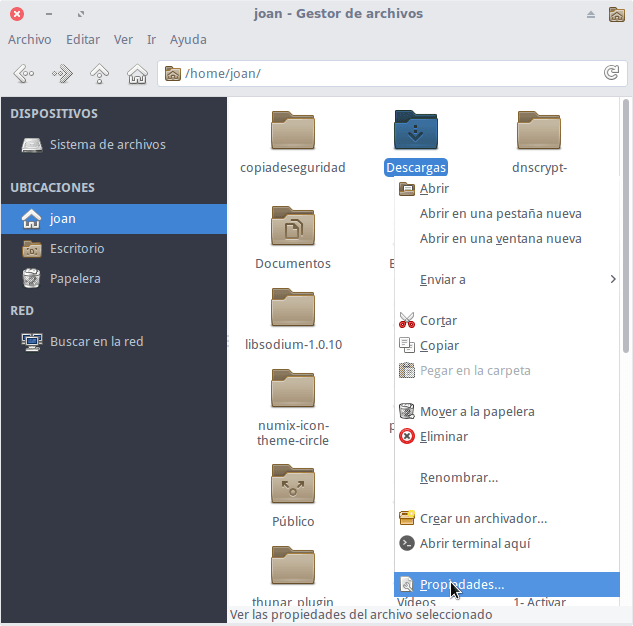](images/propiedades-de-una-carpeta.png)

A continuación se abrirá la ventana de propiedades y clicaremos encima de la pestaña Compartir. Seguidamente configuraremos los parámetros de compartición de la siguiente forma:

[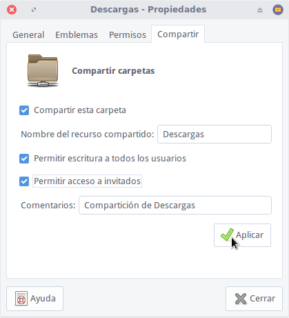](images/Compartiendo-la-carpeta-descargas.png)

La función de cada uno de los parámetros de compartición es la siguiente:

1. Para compartir la carpeta en cualquier equipo Windows, Linux o en una SmartTV tenemos que tildar la opción Compartir esta carpeta.
2. A continuación tenemos que escribir el nombre que queramos que tenga el recurso compartido. En mi caso simplemente escribo Descargas.
3. En mi caso tildo la opción Permitir escritura a todos los usuarios. De esta forma todos los usuarios que accedan a la carpeta de forma remota podrán tener permisos y escritura si el administrador del servidor lo permite. Si queremos que los usuarios no tengan acceso a modificar el contenido de nuestros archivos, no los puedan borrar ni cambiar de nombre simplemente dejaremos destilada esta opción.
4. El cuarto paso es definir si los usuarios tienen que introducir un nombre de usuario y contraseña para acceder a la carpeta de forma remota. Como en mi caso no quiero que tengan que introducir ningún usuario ni contraseña tildo la casilla Permitir acceso a invitados.
5. Finalmente en comentarios podemos introducir un texto para definir el contenido de la carpeta que compartimos.

Una vez seleccionadas las opciones de compartición tan solo tenemos que presionar el botón Aplicar. Después de presionar el botón estaremos compartiendo la carpeta con todos los usuarios Windows y Linux de nuestra red local.

### Otorgar permisos a los archivos compartidos

En estos momentos acabamos de compartir la carpeta Descargas dando la posibilidad que los usuarios remotos tengan permisos de escritura.

Para garantizar que los usuarios tendrán permisos de escritura realizamos las siguientes operaciones:

1. Nos vamos a la carpeta Descargas
2. Seleccionamos los archivos que queramos que tengan permisos de escritura.
3. Una vez seleccionamos presionamos el botón derecho del Mouse y cuando aparezca el menú contextual clicamos en Propiedades.

[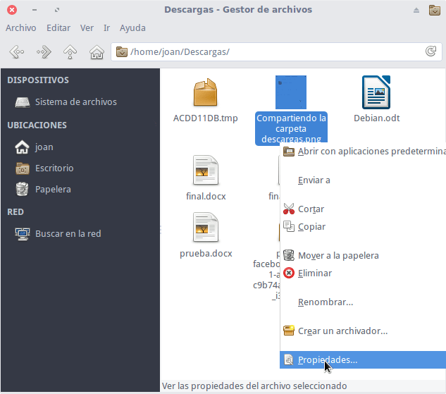](images/asignando-permisos.png)

Cuando aparezca la ventana de propiedades clicamos en la pestaña Permisos y definimos los permisos que tendrá cada uno de los usuarios. Si queremos que todos los usuarios tengan permisos de lectura y escritura es importante que en el apartado otros figuren los permisos de Lectura y escritura.

[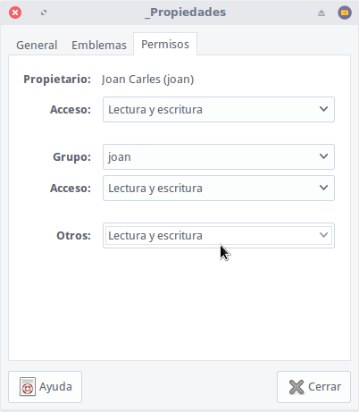](images/permisos-de-lectura-y-escritura-asignados.png)

## ACCEDER A LAS CARPETAS COMPARTIDAS DESDE LINUX

Existen varias formas para poder acceder a nuestras carpetas compartidas. A continuación veremos un par de ellas en Linux.

### Acceder a las carpetas compartidas de forma automática

Para poder acceder a nuestras carpetas compartidas de forma completamente automática tenemos que instalar el paquete smbclient. Para ello, en el ordenador cliente abrimos una terminal y ejecutamos el siguiente comando:

> ```
> sudo apt-get install smbclient
> ```

Una vez instalado el paquete abrimos el gestor de archivos que usamos habitualmente. Nos vamos al apartado de redes y clicamos encima del icono Red de Windows.

[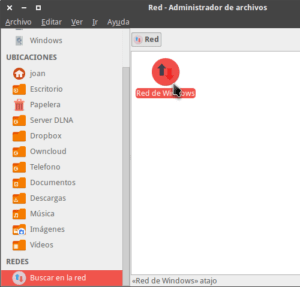](images/buscar-en-la-red.png)

A continuación les aparecerán la totalidad de equipos de disponen de un servidor samba. En mi caso clico sobre la carpeta JESSIE porque es el equipo que contiene las carpetas que he compartido.

[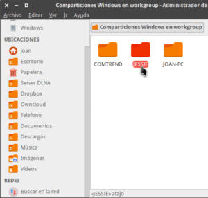](images/equipos-que-comparten-carpetas-en-red.png)

Finalmente, tal y como se puede ver en la captura de pantalla, ya tendré acceso a las carpetas que he compartido. Con los archivos de dentro de la carpetas podré aplicar todo tipo de operaciones en función de los permisos que haya otorgado en el servidor.

[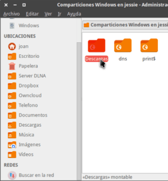](images/navegando-carpetas-compartidas.png)

###### Nota: Para que el cliente pueda ver las carpetas del servidor asegúrense de tener el firewall del cliente y del servidor debidamente configurados.

### Acceder a las carpetas compartidas de forma manual

En el caso que nuestro gestor de archivos no sea capaz de ver nuestras carpetas compartidas podemos forzar la conexión de forma manual.

Para ello tenemos que averiguar la IP de nuestro servidor de archivos. Por lo tanto en el ordenador encargado de compartir las carpetas abrimos una terminal y ejecutamos el siguiente comando en la terminal:

> ```
> sudo ifconfig
> ```

Después de ejecutar el comando veréis los siguientes resultados en los que se indica vuestra IP.

\[caption id="attachment\_8484" align="alignnone" width="410"\][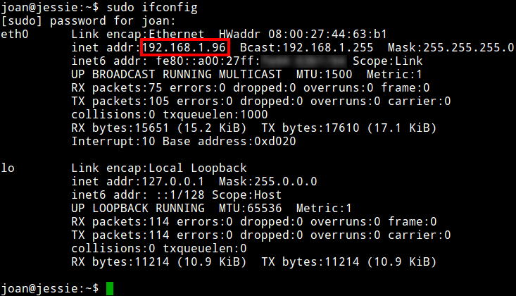](images/ip-servidor-samba.png) Se recomienda que el ordenador que comparta carpetas disponga de una IP fija\[/caption\]

En mi caso después de ver los resultados puedo afirmar que mi IP interna es la 192.168.1.96.

A continuación abro el gestor de archivos y presiono presiono la combinación teclas Ctrl+L para poder acceder a la barra de direcciones. Una vez abierta la barra de direcciones teclean el comando smb:// seguido de vuestra dirección IP. Por lo tanto en mi caso tecleo el siguiente comando y presiono Enter.

> ```
> smb://192.168.1.96
> ```

[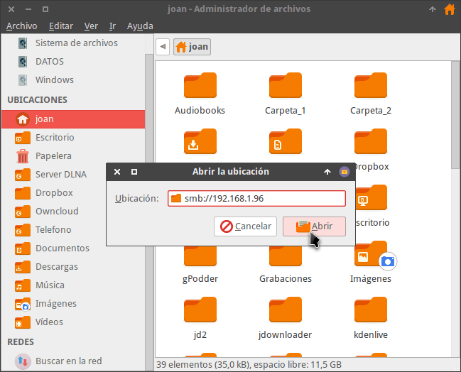](images/conectarse-servidor-samba.png)

###### Nota: 192.168.1.96 corresponde a la dirección IP de mi servidor de archivos Samba. En vuestro caso deberéis sustituir esta IP por la IP de vuestro servidor.

Seguidamente podremos navegar y realizar las operaciones que queramos con las carpetas que tenemos compartidas.

[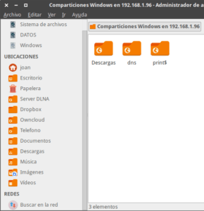](images/navegando-carpetas.png)

###### Nota: Para que el cliente puede acceder a las carpetas del servidor asegúrense de tener el firewall del cliente y del servidor debidamente configurados.

## VER LAS CARPETAS COMPARTIDAS DESDE WINDOWS

Acceder a las carpetas compartidas desde Windows es sumamente fácil y al igual que en Linux disponemos de varios métodos.

### Acceder a las carpetas compartidas de forma automática

Si el proceso de configuración se ha realizado correctamente tan solo tenemos que abrir el gestor de archivos de Windows.

Una vez abierto, en el panel izquierdo clicamos en el icono de red y seguidamente aparecerán la totalidad de equipos de disponen de un servidor samba. A continuación clico sobre el icono del ordenador con nombre JESSIE porque es el equipo que contiene las carpetas que he compartido.

[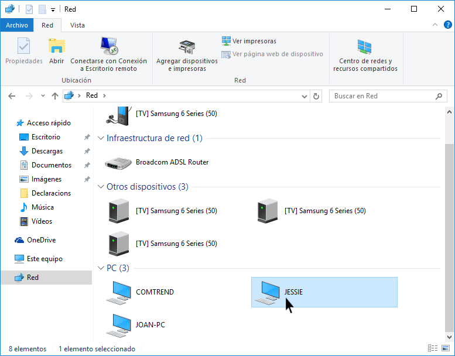](images/acceder-al-equipo-que-comparte-las-carpetas.png)

Finalmente, tal y como se puede ver en la captura de pantalla, ya tendré acceso a las carpetas que he compartido. Con los archivos de dentro de las carpetas podré aplicar todo tipo de operaciones en función de los permisos que nos haya otorgado el administrador del servidor.

[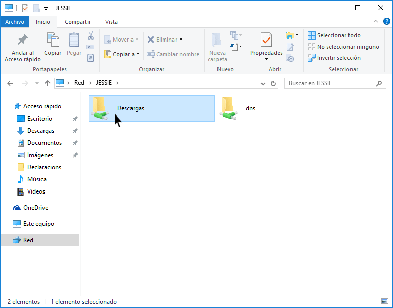](images/visualizacion-carpetas-compartidas.png)

En este punto es importante recordar que para que las carpetas se detecten de forma automática hay que cumplir los siguientes requisitos:

1. El firewall del cliente y del servidor deben estar debidamente configurados.
2. El grupo de trabajo de Windows tiene que ser el mismo que especificamos en el archivo de configuración de Samba del servidor.

### Acceder a las carpetas compartidas forzando la conexión

Si no conseguimos que las carpetas compartidas se detecten de forma automática podemos forzar la conexión. Para ello nos dirigimos a la barra de direcciones del explorador de archivos y ejecutamos el comando \\\\ seguido de la IP del ordenador que tiene las carpetas compartidas. Por lo tanto en mi caso escribo el siguiente comando y presiono Enter:

> ```
> \\192.168.1.96
> ```

[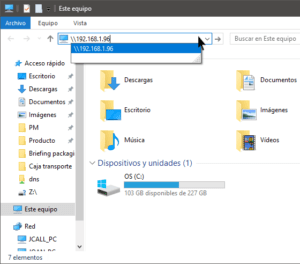](images/forzar-conexion-servidor-samba.png)

###### Nota: 192.168.1.96 corresponde a la dirección IP del servidor Samba. En vuestro caso deberéis sustituir esta IP por la IP que tenga el ordenador que está compartiendo la carpeta.

Seguidamente podremos acceder, navegar y realizar todo tipo de operaciones con los archivos de las carpetas compartidas.

[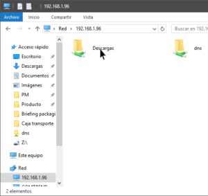](images/viendo-las-carpetas-compartidas.png)

Como han visto a lo largo del artículo, con el gestor de archivos Thunar y XFCE es extremadamente fácil compartir archivos en Linux. Estos archivos y carpetas los podremos compartir a cualquier sistema operativo existentes e incluso a nuestra smartTV.
