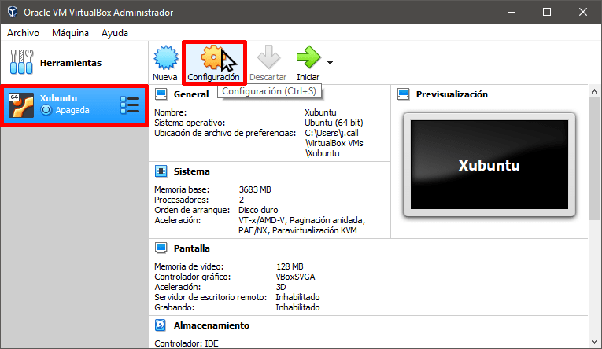
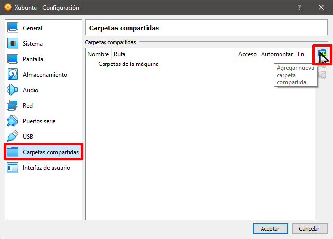
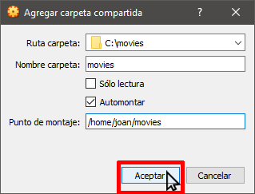
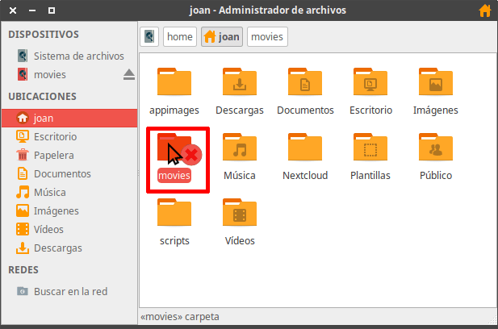
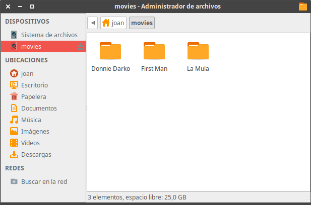
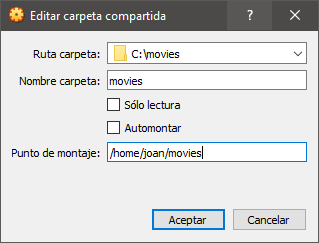

Al instalar una máquina virtual en VirtualBox es común que necesitemos compartir carpetas y archivos entre el sistema operativo anfitrión y el huésped. En el caso que se encuentren con esta situación lo podrán hacer del siguiente modo.<!--more-->

## CONSIDERACIONES ANTES DE INICIAR EL ARTÍCULO PARA COMPARTIR CARPETAS

El único requisito para seguir el tutorial es que el sistema operativo huésped sea GNU-Linux. El sistema operativo anfitrión puede ser el queramos. En mi caso:

1. El sistema operativo anfitrión es Windows 10.
2. El sistema operativo huésped es GNU Linux (Xubuntu)

A continuación iniciamos el tutorial.

## INSTALAR LAS GUEST ADDITIONS

El primer paso para compartir carpetas en VirutalBox es instalar las Guest Additions. Para instalarlas en un sistema operativo Linux deben seguir los pasos que encontrarán en el siguiente enlace:

https://geeklandlinux.github.io/posts/instalar-las-guest-additions-debian-derivadas/

## DEFINIR LAS CARPETAS QUE QUEREMOS COMPARTIR Y LOS PUNTOS DE MONTAJE

**Primero** tenemos que definir la carpeta del sistema operativo anfitrión que queremos compartir con el sistema operativo huésped. En mi caso quiero compartir la siguiente carpeta que contiene películas:

> ```
> C:\movies
> ```

**A continuación**, tenemos que definir el punto de montaje de la carpeta compartida en el sistema operativo huésped. En mi caso quiero que el punto de montaje sea:

> ```
> /home/joan/movies
> ```

## COMPARTIR CARPETAS EN VIRTUALBOX EN EL CASO QUE EL SISTEMA OPERATIVO HUÉSPED SEA LINUX

Abriremos la máquina virtual y aseguraremos que el punto de montaje definido en el apartado anterior esté creado. En mi caso no está creado, por lo tanto lo crearé ejecutando el siguiente comando en la terminal:

> ```
> mkdir /home/joan/movies
> ```

Una vez creado el punto de montaje apagaremos la máquina virtual.

Entonces seleccionaremos la máquina virtual en la que queremos compartir carpetas y archivos y presionaremos el botón de Configuración.

[](images/acceder-configuracion-maquina-virtual.png)

A continuación, en el panel de la izquierda clicaremos en la opción Carpetas Compartidas. Acto seguido en el panel de la derecha presionaremos el botón de Agregar nueva carpeta compartida.

[](images/agregar-nueva-carpeta-compartida.png)

### Definir las opciones de montaje de las carpetas compartidas

Cuando se abra la ventana Agregar carpeta compartida definiremos los siguientes parámetros:

**Ruta carpeta:** Introducimos la ruta de la carpeta que queremos montar en la máquina virtual. Anteriormente definimos que la carpeta que quiero montar es la **C:\\movies**.

**Nombre carpeta:** Escribir un nombre cualquiera que servirá para identificar en todo momento la carpeta que estamos compartiendo. En mi caso he elegido **movies**.

**Sólo lectura:** En mi caso no tildo esta opción. De esta forma, cuando acceda a la carpeta compartida dentro de la máquina virtual dispondré de la totalidad de permisos. En caso que tildará esta opción solo dispondría de permisos de lectura.

**Automontar:** Recomiendo tildar esta opción. De esta forma la carpeta compartida se automontará cada vez que arranquemos la máquina virtual.

**Punto de montaje:** Finalmente indicamos el directorio donde se montará la carpeta compartida. En los apartados anteriores definimos que sería **/home/joan/movies**

Una vez definidas todas las opciones presionamos el botón Aceptar.

[](images/opciones-para-compartir-carpetas-definidas.png)

### Agregar el usuario del sistema operativo huésped al grupo vboxsf

Al arrancar la máquina virtual veremos que la carpeta compartida **/home/joan/movies** no es accesible.

[](images/carpeta-compartida-no-se-puede-acceder.png)

El motivo es que la carpeta compartida solo es accesible para los usuarios que pertenezcan al grupo vboxf y para el usuario root. Por lo tanto, en la máquina virtual abriremos una terminal y ejecutaremos el siguiente comando para añadir nuestro usuario al grupo vboxsf:

> ```
> sudo usermod -a -G vboxsf “$(whoami)”
> ```

Una vez ejecutado el comando reiniciaremos la máquina virtual para que los cambios surjan efecto. Acto seguido verán que la carpeta compartida se monta sin ningún tipo de problema.

[](images/visualizando-contenido-carpetas-compartidas.png)

Una vez seguidos todos los pasos:

1. Cualquier archivo o carpeta que guardemos en la carpeta **/home/joan/movies** del sistema operativo huésped estará presente de forma automática en la ubicación **C:\\movies** del sistema anfitrión.
2. Cualquier archivo o carpeta que guardemos en la carpeta **C:\\movies** del sistema operativo anfitrión estará presente de forma automática en la ubicación **/home/joan/movies** del sistema huésped.

Para finalizar solo comentar que podemos crear más de una carpeta compartida. Para crear más de una carpeta compartida tan solo hay que repetir los pasos que se han detallado en el tutorial. Por lo tanto acaban de ver que compartir carpetas y archivos en VirtualBox es extremadamente sencillo.

## MONTAR CARPETAS COMPARTIDAS DE FORMA MANUAL EN VIRTUALBOX

Puede darse el caso que queráis montar las carpetas compartidas de forma totalmente manual. En este caso, en las opciones de la carpeta compartida deberán destildar la opción Automontar y presionar el botón Aceptar.

[](images/configurar-carpeta-compartida-sin-automontaje.png)

Acto seguido abriremos la máquina virtual y obviamente el contenido de la carpeta compartida no estará disponible. Para poder ver el contenido tendremos que montar la carpeta ejecutando el siguiente comando en la terminal:

> ```
> sudo mount -t vboxsf movies /home/joan/movies
> ```

Dónde:

**movies:** Corresponde al nombre de la carpeta que queremos montar. El nombre lo definimos en el apartado “definir las opciones de montaje de las carpetas compartidas”

**/home/joan/movies:** Corresponde al punto de montaje que definimos en apartados anteriores.

## DESMONTAR CARPETAS COMPARTIDAS EN VIRTUALBOX

Si una vez montada una carpeta compartida la queremos desmontar tan solo tenemos que ejecutar un comando del siguiente tipo:

> ```
> sudo umount -t vboxsf nombre_carpeta_compartida
> ```

Donde nombre\_carpeta\_compartida lo tendremos que reemplazar por el nombre de la carpeta que queremos desmontar. Por lo tanto, para desmontar la carpeta movies deberé ejecutar el siguiente comando:

> ```
> sudo umount -t vboxsf movies
> ```
