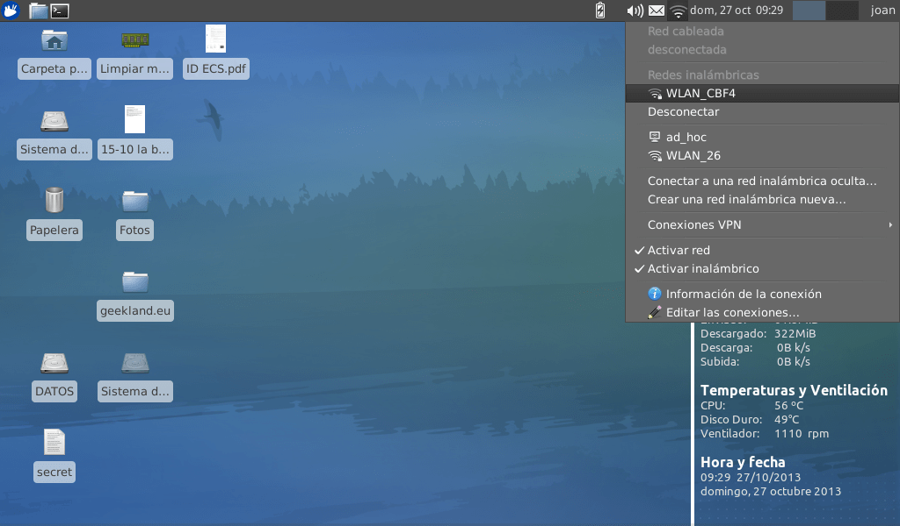
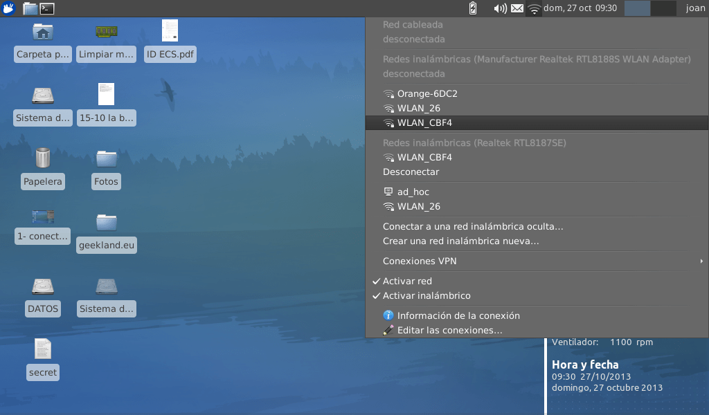
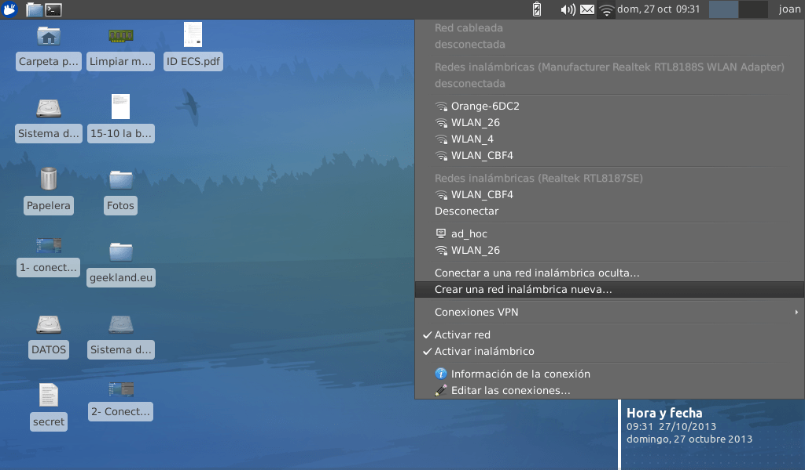
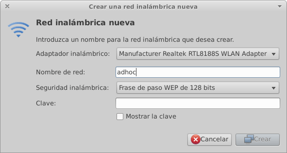
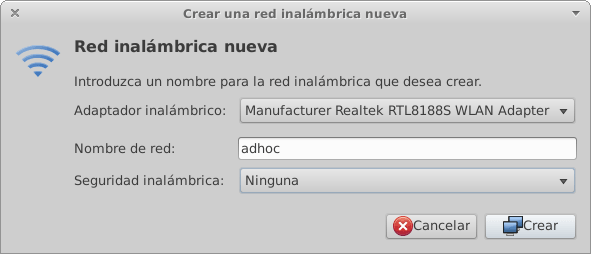
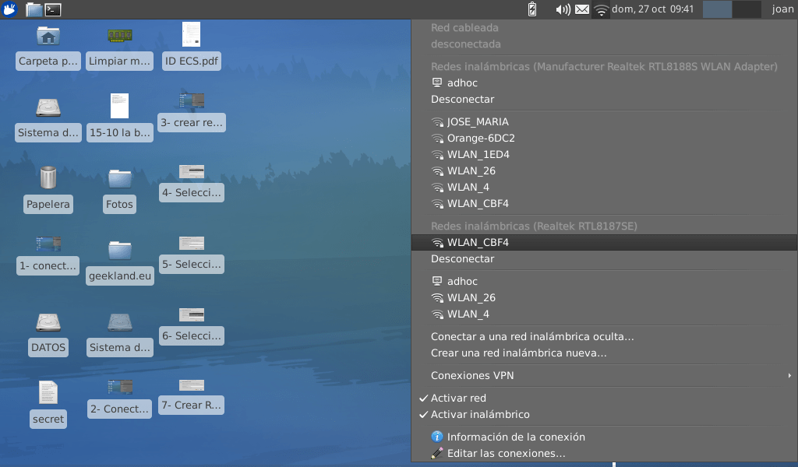
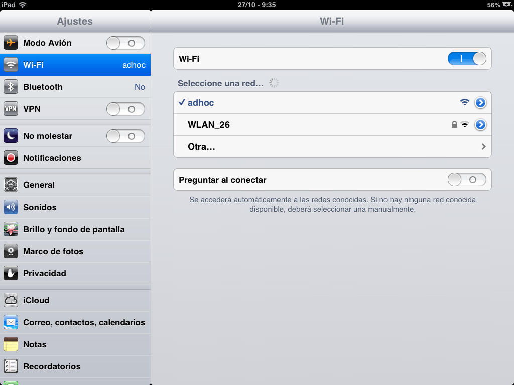

Durante el transcurso del último año he tenido una serie de problemas con Internet y la forma de solucionar el problema provisionalmente ha sido crear una red Ad hoc. Seguidamente compartiré con vosotros las situaciones en las que me ha sido útil crear una red Ad hoc y también les explicaré de forma detallada como podemos crear una red Ad hoc de forma sencilla.<!--more-->

## ¿QUÉ ES UNA RED AD HOC?

Una red Ad hoc, o también conocida como MANET (Mobile ad hoc networks), consiste en disponer de un **grupo de como mínimo 2 ordenadores que se comunican entre si mediante una comunicación punto a punto a través de señales de radio sin la necesidad de usar ningún tipo de infraestructura o punto de acceso** como por ejemplo un Router.

## UTILIDADES DE CREAR UNA RED AD HOC

**El uso que básicamente he dado a las redes Ad hoc es compartir la conexión de internet entre varios equipos**. Las **situaciones en las que alguna vez he necesitado compartir la conexión de Internet son las siguientes**:

1. Hay ciertos **modelos de teléfonos Android que no son compatibles con algunos de los routers existentes en el mercado**. En el caso de tener este problema podemos crear una red Ad hoc. De este modo nuestro teléfono en vez de conectarse al router incompatible se comunicará con el nodo central de la red Ad hoc solucionando nuestro problema.
2. **En el caso que vayamos a un hotel lo más probable es que nuestra habitación solo disponga de conexión a Internet mediante cable**. Esto implica una limitación importante ya que solo podremos disponer de un dispositivo con conexión a Internet. Por lo tanto si tenemos una tablet, teléfono o un compañero de habitación que necesita conectarse a Internet simplemente no será posible. Una solución a este problema será crear una red Ad hoc y de este modo todo el mundo se podrá conectar a Internet.
3. Justo este fin de semana acabo de tener una avería de Internet en mi casa y me he quedado sin Internet. La solución que he aplicado **es pedir permiso al vecino para conectarme a su red wifi. Una vez conectado a la red wifi del vecino he creado una red Ad hoc para poder conectar la totalidad de dispositivos que tengo en mi casa a Internet.**
4. **En nuestro trabajo no acostumbran a existir redes wifi, o si existen están protegidas para que los trabajadores no puedan conectarse a ellas.** Esto implica que durante el entorno laboral estemos consumiendo datos de nuestra tarifa de 3G o 4G en cosas como por ejemplo escuchar la radio, etc. Para evitar este problema **tan solo tenemos que crear una red Ad hoc y de esta forma evitaremos el consumo de datos de nuestra tarifa de teléfono.**

###### Nota: Android 2.3.6 y versiones inferiores no permiten conectarse a redes Ad hoc. Para poderse conectarse a una red Ad hoc necesitamos ser root y parchear el archivo wpa\_supplicant. Es posible que en versiones posteriores de Android este problema ya esté solucionado.

**Otros usos que podemos dar a una red Ad hoc son los siguientes**:

1. **Algunos routers antiguos no disponen de wifi**. Por lo tanto a priori no podemos conectar nuestra tablet, ordenador portátil o teléfono a nuestro Router. Una solución para conectar la totalidad de estos dispositivos a Internet de forma inalámbrica será construyendo una red Ad hoc.
2. **A veces hay zonas de nuestra casa que están muy alejadas del router y por lo tanto no les llega la señal wifi**. Una posible solución a este problema es crear una Red Ad hoc en un punto intermedio entre el router y la habitación que no llega el wifi. De está forma conseguiremos que en la habitación más alejada podamos disponer de conexión a internet.
3. Una vez creada la red Ad hoc podemos **compartir archivos fácilmente entre los distintos ordenadores que están conectados a la misma red Ad hoc**.
4. También es posible usar una red Ad hoc **para jugar a videojuegos en red.**

###### Nota:  Es posible que existan otros usos que podemos dar a una red Ad hoc. Por ejemplo estas redes pueden tener aplicaciones militares, servicios de emergencia en caso de desastres naturales,  domótica, etc. No obstante los usos que describo pienso que son los más frecuentes y los que alguna vez he usado yo mismo.

## ¿QUÉ NECESITAMOS PARA CREAR UNA RED AD HOC?

Para crear una red Ad hoc y poder aplicar los usos que acabamos de describir necesitamos disponer del siguiente equipamiento:

#### EN EL CASO QUE NOS CONECTEMOS A INTERNET VÍA WIFI:

1- Necesitaremos como mínimo **2 [tarjetas de red de red inalámbricas](http://es.wikipedia.org/wiki/Tarjeta_de_red "Explicación de que es una tarjeta de Red")**. Una de las tarjetas servirá para conectarnos a Internet vía wifi y la otra servirá para realizar la comunicación entre equipos.

###### Nota: En el caso de usar un ordenador portátil una de las redes inalámbricas ya está incorporada en el ordenador. Por lo tanto solo necesitaríamos comprar una tarjeta de red inalámbrica USB.

###### Nota: En el caso de tengamos un ordenador de sobremesa tendremos que adquirir 2 tarjetas de red inalámbricas USB ya que los ordenadores de sobremesa no acostumbran a tener ninguna tarjeta de red inalámbrica.

#### EN EL CASO QUE NOS CONECTEMOS A INTERNET VÍA CABLE:

1- Necesitaremos solamente **una [tarjeta de red inalámbrica](http://es.wikipedia.org/wiki/Tarjeta_de_red "Explicación de que es una tarjeta de Red inalámbrica")**.

###### Nota: En el caso de tener un ordenador portátil lo normal es que disponga de una tarjeta de red ethernet y una tarjeta de red inalámbrica. Por lo tanto si disponéis de un portátil no será necesario comprar nada.

###### Nota: En el caso de tener un ordenador de sobremesa seguramente necesitaremos adquirir una tarjeta de red inalámbrica ya que los ordenadores de sobremesa acostumbran a disponer de una tarjeta de red Ethernet pero no acostumbran a disponer una tarjeta de red inalámbrica.

## CREAR UNA RED AD HOC EN LINUX

Existen múltiples tipos de infraestructuras y topologías Ad hoc como pueden en [árbol](http://es.wikipedia.org/wiki/Red_en_%C3%A1rbol "Explicación de la topología en Arbol"),  [en malla](http://es.wikipedia.org/wiki/Red_inal%C3%A1mbrica_mallada "Ad Hoc para red inalámbrica mallada"), [en anillo](http://es.wikipedia.org/wiki/Red_en_anillo "Explicación de la topología en Anillo"),  repetidores, etc. Pero nosotros nos centraremos en la topología de [estrella](http://es.wikipedia.org/wiki/Red_en_estrella "Explicación de la topología de Estrella") que es la más común para poder crear un [hotspot](http://es.wikipedia.org/wiki/Hotspot_\(telecomunicaciones\) "Explicación de que es un hotspot").

Así por lo tanto que queramos crear una red Ad hoc en linux  para funcionar como hotspot ([Topología de estrella](http://es.wikipedia.org/wiki/Red_en_estrella "Explicación de la topología de Estrella")) el procedimiento es muy fácil:

Supongamos que tenemos un ordenador portátil con su tarjeta de red inalámbrica interna y al mismo tiempo también disponemos de otra tarjeta de red inalámbrica USB.

El primer paso será **conectarnos vía wifi a nuestro Router.** Como se puede ver en la captura de pantalla lo haremos así de fácil:

Una vez conectados a la red wifi **enchufamos la tarjeta de red inalámbrica a nuestro USB**. Una vez enchufada veremos que en el [Gnome network manager](https://wiki.gnome.org/NetworkManager "Que es network manager") o [Wicd](http://en.wikipedia.org/wiki/Wicd "Que es Wicd") aparece una tarjeta inalámbrica nueva:

###### Nota: En mi caso la tarjeta inalámbrica USB que acabo de conectar es la RTL8188S

Seguidamente, como se puede apreciar en la siguiente captura de pantalla, **dentro del menú del [Gnome network manager](https://wiki.gnome.org/NetworkManager "Que es Network Manager") o de [wicd](http://en.wikipedia.org/wiki/Wicd "Que es Wicd") seleccionamos la opción crear una red inalámbrica nueva....**

Una vez seleccionada la opción crear una red inalámbrica nueva aparecerá la siguiente ventana:

En la siguiente ventana veremos las siguientes opciones:

**Adaptador inalámbrico:** En este campo tenemos que seleccionar la tarjeta de red inalámbrica que usaremos para crear la red Ad hoc. En mi caso usaré la Realtek RTL8188S ya que la Realtek RTL8187SE es la que tarjeta que estoy usando para conectarme a internet vía wifi.

**Nombre de la red:** En este campo pongo el nombre que quiero que tenga la red Ad hoc que estamos a punto de crear.

**Seguridad inalámbrica:** En este apartado, si abrimos el menú desplegable, tenemos que elegir el tipo de cifrado que queremos que tenga nuestra red Ad hoc o Hotspot. Podemos elegir entre WEP de 128 bits, WEP 40/128-bit o Ninguna. En mi caso elegiré Ninguna ya que solamente estoy realizando pruebas y vivo apartado de la urbe. Por lo tanto la dejaré la red Ad hoc abierta ya que nadie debería porqué conectarse a mi red Ad hoc.

**Clave:** En la celda clave tenemos que seleccionar una clave de acceso para poderse conectar a la red Ad hoc. Podemos elegir una cualquiera. En mi caso como en seguridad inalámbrica he elegido Ninguna en este apartado no tengo definir ninguna clave.

Una vez realizados todos los pasos tendremos la siguiente situación:

Ahora tan solo nos falta **presionar el botón Crear**. Una vez presionado el botón hemos terminado el proceso de creación de la red Ad hoc.

Ahora simplemente tenemos comprobar que todos los pasos realizados son los correctos. Para ello presionamos encima del icono de gnome network manager y tiene que aparecer algo parecido a lo siguiente:

Si todo funciona correctamente, como se puede ver en la captura captura de pantalla, la tarjeta Realtek RTL8187SE está siendo usada para conectarse a la red Wifi WLAN\_CBF4 mientras que la tarjeta de red inalámbrica Realtek RTL8188S está siendo usada para generar la red Ad hoc . Por lo tanto podemos afirmar que a priori todo funciona a la perfección.

## COMPROBACIÓN DEL FUNCIONAMIENTO

Para comprobar que nuestra red Ad hoc funciona a la perfección lo podemos hacer de la siguiente forma. Cogemos un ordenador cualquiera, un teléfono o una tablet. En mi caso cojo una tablet y como se puede ver en la captura de pantalla nos vamos al gestor de redes wifi. **Una vez dentro del gestor de redes wifi vemos que aparece una red que se llama adhoc que es la que acabamos de generar:**

**Presionamos encima de adhoc.** **Unos momentos después de presionar sobre la red Adhoc veremos que nuestro ipad se conecta a la red** sin problema alguno. Una vez conectados a la red abrimos el navegador e ingresamos una página web cualquiera. En mi caso como se puede ver en la captura de pantalla he elegido [https://geeklandlinux.github.io/](https://geeklandlinux.github.io/ "Blog de Linux y nuevas tecnologías"):

Como se puede ver en la captura de pantalla podemos navegar sin problema alguno. Por lo tanto todo lo realizado funciona a la perfección.

## CREAR UNA RED AD HOC EN WINDOWS

Windows no es principalmente santo de mi devoción. Lo tengo que usar por motivos laborales y aquí se termina mi uso. No obstante me gustaría dar un punto de partida a los usuarios de windows para poder crear su propia red Ad Hoc.

Windows de forma nativa permite crear una red Ad hoc pero el proceso es largo y complicado de explicar. Bajo mi punto de vista creo que la forma más fácil para crear una red Ad hoc es instalar un software de terceros, como per ejemplo [Connectify](http://www.connectify.me/ "Connectify"), que nos permitirá crear nuestra red Ad Hoc de forma muy fácil e intuitiva. Connectify lo podéis descargar de la siguiente página web:

[http://www.connectify.me/lite-vs-pro/](http://www.connectify.me/lite-vs-pro/ "Descargar Connectify")

El procedimiento de instalación y uso de Connectify es muy sencillo e intuitivo. Por lo tanto pienso que no requiere de ninguna explicación. No obstante para quien la necesité puede consultar la siguiente pagina web:

[http://www.connectify.me/tutorials-new/](http://www.connectify.me/tutorials-new/ "Tutoriales de Connectify")

###### Nota: Los tutoriales son en inglés pero realmente vale la pena mirarlos ya que te desgranan muy detalladamente todas las opciones que puede ofrecer Connectify,

## LIMITACIONES DE LAS REDES AD HOC

Hemos visto que **las redes ad hoc disponen una utilidad muy amplia y tienen características muy interesantes como por ejemplo una gran flexibilidad, un despliegue rápido de la red, una mínima configuración , etc**. **Pero** el hecho de crear una red Ad hoc **también tendrá una serie de inconvenientes** ya que una red Ad hoc tendrá recursos limitaciones en cuanto a velocidad de procesamiento, ancho de banda, almacenamiento, etc.

Así por lo tanto el hecho de disponer de una red Ad hoc **dispondrá de las siguientes limitaciones**:

1. Una red Ad hoc tendrá a priori **más problemas de seguridad que una red wifi tradicional**. Para poner un ejemplo decir que en una red Ad hoc en principio no será posible ocular el SSID y por lo tanto para un atacante será más fácil intentar iniciar un ataque.
2. En las redes Ad hoc también existirá una **limitación de velocidad** ya que las tarjetas de red acostumbran a disponer de una velocidad  transferencia de datos limitada, que en el caso de las redes ad hoc acostumbra a ser 11Mbps. Esto implica que la velocidad de transferencia en una red Ad hoc es muy posible que sea muy inferior a 1.37 Megas por segundo.
