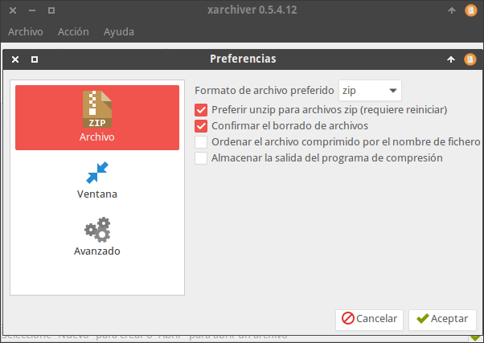
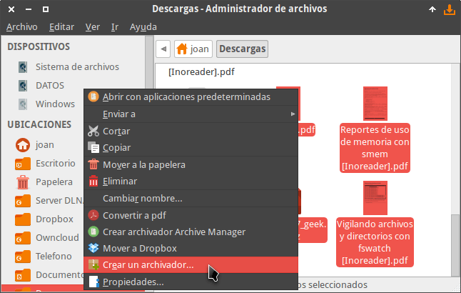
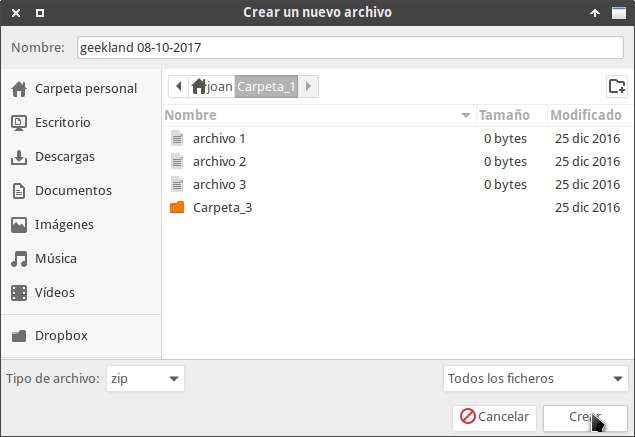
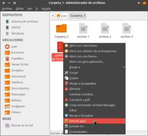

Comprimir y descomprimir archivos en Linux es tan fácil como en Windows. Para hacer comprimir y descomprimir archivos de forma práctica y sencilla tan solo tienen que seguir la siguientes instrucciones.<!--more-->

## PAQUETES A INSTALAR PARA COMPRIMIR Y DESCOMPRIMIR ARCHIVOS

Lo primero que tenemos que realizar es instalar la totalidad de paquetes que nos permitirán comprimir y descomprimir nuestros archivos. Para ello en la terminal ejecutaremos el siguiente comando:

> ```
> sudo apt-get install rar unrar unrar-free zip unzip unace unace-nonfree bzip2 lzop p7zip-full p7zip-rar gzip lzip
> ```

Cada uno de los paquetes instalados servirá para comprimir y descomprimir los siguientes formatos:

   
|   **Paquetes**   |   **Formatos de archivo que comprime**   |   **Formatos de archivo que descomprime**   |   **Naturaleza de los paquetes**   |
| --- | --- | --- | --- |
|   rar, unrar y p7zip-rar   |   .rar   |   .rar   |   Privativo   |
|   unrar-free   |   \- |   .rar   |   Libre   |
|   zip y unzip   |   .zip   |   .zip   |   Libre   |
|   unace y unace-nonfree   |   \- |   .ace   |   Libre y privativo   |
|   bzip2   |   .bz2, .tar.bz2, .tbz2, .tb2   |   .bz2, .tar.bz2, .tbz2, .tb2   |   Libre   |
|   lzop   |   .tar.lzo , .tzo   |   .tar.lzo , .tzo   |   Libre   |
|   p7zip-full   |   .7z, .zip, .gz, .bz, .tar   |   .7z, .zip, .gz, .bz, .tar .rar, .cab, .arj, .Z, .cpio, .rpm, .deb, .lzh, .lha, etc.   |   Libre   |
|   gzip   |   .gz, .tgz y .Z   |   .gz y .Z   |   Libre   |
|   lzip   |   .lz   |   .lz   |   Libre   |
|   tar   |   .tar   |   .tar   |   Libre   |

Una vez instalados los paquetes podremos comprimir y descomprimir en prácticamente cualquier formato de archivo usando la terminal. Si no son amigos de la terminal, en el siguiente apartado veremos como poder instalar un programa para poder comprimir y descomprimir archivos usando únicamente nuestro gestor de archivos.

## COMPRIMIR Y DESCOMPRIMIR ARCHIVOS MEDIANTE NUESTRO GESTOR DE ARCHIVOS

Existen varios programas que nos servirán para comprimir y descomprimir archivos usando nuestro gestor de archivos. Los programas que podemos usar en función del gestor de archivos que usamos son los siguientes:

 
|   **Programas**   |   **Gestor de archivos**   |
| --- | --- |
|   ark   |   Dolphin, PCManFM   |
|   file-roller   |   Nautilus, PCManFM, y Thunar   |
|   nemo-fileroller   |   Nemo   |
|   xarchiver   |   Thunar, PCManFM, Nautilus   |
|   engrampa   |   Caja   |

En mi caso uso el gestor de archivos thunar y uso el programa Xarchiver. Para instalar Xarchiver tan solo tenemos que abrir una terminal y ejecutar el siguiente comando:

> ```
> sudo apt-get install xarchiver
> ```

###### Nota: Si quieren usar otro programa tan solo tienen que reemplazar xarchiver por ark, file-roller, nemo-fileroller o engrampa.

Una vez instalado Xarchiver podemos modificar sus preferencias. Para ello abrimos el programa Xarchiver ejecutando el siguiente comando en la terminal:

> ```
> xarchiver
> ```

Cuando se haya abierto presionamos la combinación de teclas Ctrl +F y nos aparecerá la ventana de preferencias donde podremos configurar el comportamiento del programa.

[](images/preferencias-xarchiver.png)

## COMPRIMIR Y DESCOMPRIMIR ARCHIVOS MEDIANTE NUESTRO GESTOR DE ARCHIVOS

Una vez instalados los paquetes necesarios podemos comprimir y descomprimir archivos y carpetas de forma trivial.

### Comprimir archivo/s y carpeta/s usando el gestor de archivos

Primero seleccionamos los archivo/s y o carpeta/s a comprimir. Seguidamente presionamos el botón derecho del ratón y cuando aparezca el menú contextual clicamos sobre la opción Crear un archivador…

[](images/crear-archivo-comprimido-gestor-archivos.png)

A continuación seleccionamos el formato de archivo que queremos usar para la compresión, definimos la ubicación donde queremos guardar el archivo comprimido, definimos un nombre y finalmente presionamos el botón Crear para crear el archivo comprimido.

[](images/comprimir-archivo-xarchiver.png)

###### Nota: El procedimiento es el mismo para el resto de gestores de archivos. Únicamente encontrarán pequeñas diferencias que utilizando su intuición podrán resolver.

### Descomprimir archivo/s y carpetas usando el gestor de archivos

Descomprimir archivos y carpetas aún es más fácil que comprimirlos. Tan solo tenemos que seleccionar el archivo/s a descomprimir, presionar el botón derecho del ratón y cuando aparezca el menú contextual tan solo hay que clicar encima de las opciones Extraer aquí o Extraer en...

[](images/descomprimir-archivos-en-linux.png)

Así de esta forma tan fácil podemos comprimir y descomprimir archivos en Linux tal y como lo haríamos en Windows.
