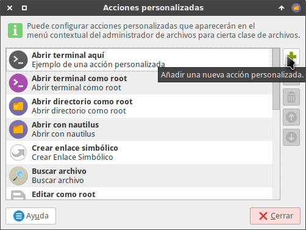
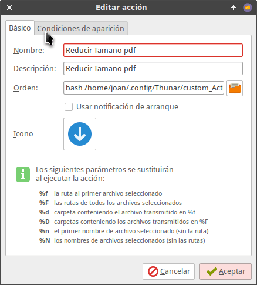
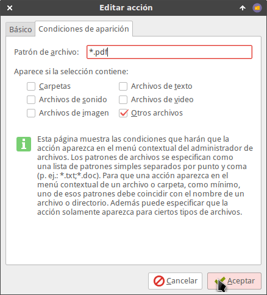

En el presente artículo veremos como podemos comprimir pdf de forma rápida y simple usando el gestor de archivos Thunar. En cuestión de segundos y sin usar la terminal podremos reducir el tamaño de un archivo pdf sin problema alguno.

Para ello tan solo tenemos que seguir las siguientes instrucciones.<!--more-->

## INSTALAR LOS PAQUETES NECESARIOS PARA COMPRIMIR PDF

Para poder poder reducir el tamaño de un pdf siguiendo las instrucciones de este artículo tenemos que instalar los paquetes zenity y ghostscript. Para instalar estos paquetes tenemos que seguir las siguientes instrucciones:

Si usamos Debian o distribuciones derivadas de Debian abrimos una terminal y ejecutamos el siguiente comando:

> ```
> sudo apt-get install zenity ghostscript
> ```

En el caso que seamos usuarios de Fedora o distros derivadas de Fedora tendremos que ejecutar el siguiente comando:

> ```
> sudo dnf install zenity ghostscript
> ```

Si somos usuarios de opensuse ejecutaremos el siguiente comando en la terminal:

> ```
> sudo zypper in zenity ghostscript
> ```

Finalmente si somos usuarios de Arch o distros derivadas de Arch ejecutaremos el siguiente comando en la terminal:

> ```
> sudo pacman -Sy zenity ghostscript
> ```

## CREAR EL SCRIPT PARA REDUCIR EL TAMAÑO DE UN PDF

Una vez instalados los paquetes crearemos el script para poder comprimir archivos pdf.

Inicialmente creamos la ubicación donde guardaremos el script. Para ello ejecutamos el siguiente comando en la terminal:

> ```
> mkdir ~/.config/Thunar/custom_Actions
> ```

A continuación creamos el script comprimir pdf ejecutando el siguiente comando en la terminal:

> ```
> nano ~/.config/Thunar/custom_Actions/Reducir_pdf
> ```

Cuando se abra el editor de textos nano pegamos el siguiente código:

`#!/bin/bash guitool=zenity` `exit_me(){ rm -rf ${tempdir} exit 1 }`

`trap "exit_me 0" 0 1 2 5 15`

`LOCKFILE="/tmp/.${USER}-$(basename $0).lock" [[ -r $LOCKFILE ]] && PROCESS=$(cat $LOCKFILE) || PROCESS=" "` `if (ps -p $PROCESS) >/dev/null 2>&1 then echo "E: $(basename $0) is already running" $guitool --error --text="$(basename $0) is already running" exit 1 else rm -f $LOCKFILE echo $$ > $LOCKFILE fi`

`# Dialog box to choose thumb's size CALIDAD="$( $guitool --list --height=340 --title="Seleccionar la calidad del PDF" --text="Selecciona la calidad que quieres que tenga el PDF" --radiolist --column=$"Marcar" --column=$"Calidad" "" "Calidad 72 dpi" "" "Estándard" "" "Calidad Media 150 dpi" "" "Calidad Alta 300 dpi" "" "Calidad Alta 300 dpi preservando color" || echo cancel )" [[ "$CALIDAD" = "cancel" ]] && exit`

`if [[ "$CALIDAD" = "" ]]; then $guitool --error --text="Calidad no especificada. Selecciona la calidad deseada. " exit 1 fi`

`# precache PROGRESS=0 NUMBER_OF_FILES="$#" let "INCREMENT=100/$NUMBER_OF_FILES"`

`( for i in "$@" do echo "$PROGRESS" file="$i"`

`# precache dd if="$file" of=/dev/null 2>/dev/null`

`# increment progress let "PROGRESS+=$INCREMENT" done ) | $guitool --progress --title "Precaching..." --percentage=0 --auto-close --auto-kill # Creating thumbnails. Specific work on picture should be add there as convert's option`

`# How many files to make the progress bar PROGRESS=0 NUMBER_OF_FILES="$#" let "INCREMENT=100/$NUMBER_OF_FILES"`

`mkdir -p "PDF's Reducidos"`

`( for i in "$@" do echo "$PROGRESS" file="$i" filename="${file##*/}" filenameraw="${filename%.*}" echo -e "# Transformando: \t ${filename}"`

`if [[ "$CALIDAD" = "Estándard" ]] ; then gs -sDEVICE=pdfwrite -dCompatibilityLevel=1.4 -dDetectDuplicateImages=true -dPDFSETTINGS=/default -dNOPAUSE -dQUIET -dBATCH -sOutputFile="PDF's Reducidos/${filename%\.*}.pdf" "${file}" fi if [[ "$CALIDAD" = "Calidad 72 dpi" ]] ; then gs -sDEVICE=pdfwrite -dCompatibilityLevel=1.4 -dDetectDuplicateImages=true -dPDFSETTINGS=/screen -dNOPAUSE -dQUIET -dBATCH -sOutputFile="PDF's Reducidos/${filename%\.*}.pdf" "${file}" fi if [[ "$CALIDAD" = "Calidad Media 150 dpi" ]] ; then gs -sDEVICE=pdfwrite -dCompatibilityLevel=1.4 -dDetectDuplicateImages=true -dPDFSETTINGS=/ebook -dNOPAUSE -dQUIET -dBATCH -sOutputFile="PDF's Reducidos/${filename%\.*}.pdf" "${file}" fi if [[ "$CALIDAD" = "Calidad Alta 300 dpi" ]] ; then gs -sDEVICE=pdfwrite -dCompatibilityLevel=1.4 -dDetectDuplicateImages=true -dPDFSETTINGS=/printer -dNOPAUSE -dQUIET -dBATCH -sOutputFile="PDF's Reducidos/${filename%\.*}.pdf" "${file}" fi if [[ "$CALIDAD" = "Calidad Alta 300 dpi preservando color" ]] ; then gs -sDEVICE=pdfwrite -dCompatibilityLevel=1.4 -dDetectDuplicateImages=true -dPDFSETTINGS=/prepress -dNOPAUSE -dQUIET -dBATCH -sOutputFile="PDF's Reducidos/${filename%\.*}.pdf" "${file}" fi`

`let "PROGRESS+=$INCREMENT" done ) | $guitool --progress --width=450 --title "Transformando PDF..." --percentage=0 --auto-close --auto-kill`

`$guitool --info --text="Finalizado, Puedes encontrar los PDF's en el directorio 'PDF's Reducidos'"`

Una vez pegado el código guardamos los cambios y cerramos el archivo.

Finalmente otorgamos permisos de ejecución al script que acabamos de crear ejecutando el siguiente comando en la terminal:

> ```
> chmod +x ~/.config/Thunar/custom_Actions/Reducir_pdf
> ```

## CREAR LA ACCIÓN PERSONALIZADA PARA COMPRIMIR PDF

A continuación crearemos una acción personalizada para que podamos comprimir los pdf con el gestor de archivos Thunar

Para ello abrimos el gestor de archivos de XFCE, accedemos al menú Editar y clicamos en la opción Configurar acciones personalizadas...

[](images/Configurar-una-acción-personalizada.png)

A continuación clicamos encima del botón + para Añadir una acción personalizada.

[](images/Añadir-nueva-acción-personalizada.png)

Seguidamente aparecerá la ventana Editar acción en la que deberemos configurar la acción personalizada.

[](images/Configurar-acción-personalizada.png)

En los campos de la ventana Editar acción introducimos los siguientes valores:

**Campo Nombre:** Introducimos el nombre que queremos que aparezca en el menú contextual de Thunar. En mi caso elijo el siguiente:

> ```
> Comprimir pdf
> ```

**Campo Descripción:** Simplemente tenemos que escribir una descripción de lo que hace nuestra acción personalizada. En mi caso uso la siguiente descripción:

> ```
> Comprimir pdf
> ```

**Campo Orden:** Tenemos que introducir el comando para que se pueda ejecutar el script seguido de %N. Por lo tanto tenemos que introducir la siguiente orden:

> ```
> bash /home/joan/.config/Thunar/custom_Actions/Reducir_pdf %N
> ```

###### Nota: La orden para ejecutar el script la tendréis que adaptar en función de la ruta donde tenéis guardado el script.

###### Nota: La ruta del script tiene que finalizar con %N para que podamos comprimir pdf en lotes.

**Campo Icono:** Si queremos podemos clicar encima del botón Sin icono. Si lo hacemos aparecerá una ventana en la que podremos seleccionar un icono para la acción personalizada que estamos creando.

Finalmente clicamos en la pestaña Condiciones de aparición. En esta pestaña modificamos los siguientes aspectos:

1. Destildamos la opción Archivos de texto.
2. Tildamos la opción Otros Archivos.
3. En el campo patrón de archivo tenemos que escribir \*.pdf

[](images/Condiciones-de-aparición.png)

Finalmente presionamos le botón Aceptar y el proceso ha concluido. En estos momentos ya podemos comprimir pdf sin ningún tipo de problema.

## DEMOSTRACIÓN DE COMO USAR EL SCRIPT PARA COMPRIMIR UN PDF

En el siguiente vídeo pueden ver una demostración del uso y de los resultados obtenidos:

https://www.youtube.com/watch?v=CDQVTCMNN74

Como pueden ver en el vídeo, en la gran mayoría de casos los resultados obtenidos son excelentes llegando a obtener reducciones de tamaño del orden 40 o 50%.

En función de las características del pdf a comprimir estos valores pueden ser mejores o peores.

## COMENTARIOS SOBRE EL FUNCIONAMIENTO DEL SCRIPT

Como han podido ver en la demostración este método funciona a la perfección.

Es importante que tengan presente los siguientes aspectos a la hora de comprimir archivos pdf con el método mostrado en esta artículo.

### Compatibilidad de los pdf generados

Los pdf comprimidos con este método serán compatibles con todas las versiones de Adobe Acrobat iguales o posteriores a la 5.0. Para modificar este aspecto pueden modificar la opción \-dCompatibilityLevel que aparece en los parámetros de conversión del script:

    
|   \>=Acrobat 4.0   |   \>=Acrobat 5.0   |   \>=Acrobat 6.0   |   \>=Acrobat 7.0   |   \>=Acrobat 8.0 y 9.0   |
| --- | --- | --- | --- | --- |
|   \-dCompatibilityLevel=1.3   |   \-dCompatibilityLevel=1.4   |   \-dCompatibilityLevel=1.5   |   \-dCompatibilityLevel=1.6   |   \-dCompatibilityLevel=1.7   |

### Velocidad de compresión de los archivos pdf

La compresión puede resultar lenta en un archivo pdf de gran tamaño. En ocasiones la conversión puede tardar entre 5 y 10 minutos y el consumo de CPU será alto. No obstante también verán que los resultados obtenidos son satisfactorios.

El tiempo de compresión dependerá de muchos factores como por ejemplo:

1. La potencia de nuestro ordenador.
2. El tamaño y características del archivo pdf a comprimir.
3. Del tipo de compresión que queremos aplicar a un pdf. A mayor reducción de calidad más lenta será la compresión.

### Degradación de la calidad del pdf

Al comprimir un pdf estamos degradando su calidad. Una vez se haya reducido la calidad no podremos volver a recuperar la calidad original. Por lo tanto si reducimos la calidad de un pdf de 300 ppp a 72 ppp ya no podremos deshacer los cambios. Aunque volvamos a incrementar la resolución de 72 ppp a 300 ppp la visualización será como la de un pdf de 72 ppp y lo único que lograremos es incrementar el peso del pdf.

Por este motivo con el método mencionado en este post nunca se sobrescribirá el pdf original. La totalidad de pdf comprimidos se ubicarán en una carpeta llamada PDF's Reducidos.

### Marcas y otros elementos de los archivos pdf

Si un pdf contiene comentarios, anotaciones o cualquier otro tipo de contenido adicional se mantendrá en los archivos comprimidos
