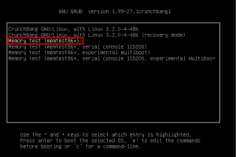
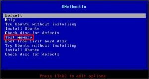
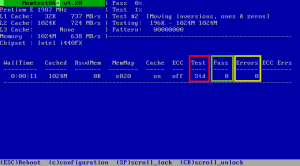
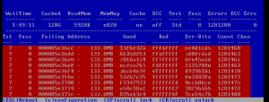

Que recuerde en un par de ocasiones mi ordenador empezó a sufrir cuelgues inesperados e incomprensibles. En las 2 ocasiones después de indagar durante días descubrí que era un módulo de la memoria RAM que estaba dañado.

En el caso de tener síntomas similares a los descritos, para comprobar si el culpable de las incidencias es la memoria RAM del sistema, pueden emplear el método que mostraremos a continuación. Con esté método **en cuestión de horas podrán saber si la memoria RAM de vuestro equipo se encuentra en buenas condiciones**.<!--more-->

###### Nota: Sistemas operativos como Windows traen sus propias herramientas para la comprobación del estado de la memoria RAM. Sin embargo su efectividad y rendimiento dista mucho de la herramienta que presentaremos en este artículo.

###### Nota: Los fallos en la memoria RAM por lo general son aleatorios y difíciles de detectar.

## INFORMACIÓN BÁSICA DE LA HERRAMIENTA MEMTEST86+

**Memtest86+ es el software que vamos a utilizar para realizar la comprobación de la memoria Ram** de nuestro equipo.

Memtest86+ **es un software de código abierto con licencia** [GNU GPL V2.0](https://www.gnu.org/licenses/old-licenses/gpl-2.0-faq.es.html "Explicación licencia GPL V2") desarrollado por Samuel Demeulemeester a partir de memtest86 (**memtest86+ es un fork de memtest86**). **Este software está diseñado para encontrar problemas que pueden los módulos de memoria RAM de nuestro equipo**.

**Memtest86+ está diseñado para arrancar desde una memoria USB, CD o disquete**, por lo tanto para poder usar memetest86+ no necesitamos tener un sistema operativo instalado en nuestro ordenador. **Como consecuencia podemos usar memtest86+ independientemente si nuestro ordenador tiene instalado Linux, Mac o Windows**.

###### Nota: Memtest86+ es un fork de Memtest86. Por lo tanto los 2 software tienen un funcionamiento muy similar. En la actualidad se pueden usar los 2 software y los 2 funcionan a la perfección, no obstante en el post hablaré de Memtest86+ porqué acostumbra a tener soporte para hardware más actual. En el caso que ninguna de las opciones sea compatible con vuestro hardware pueden probar [RAM Probe](http://www.ramprobe.com/ "Web de RAM Probe") que es un fork de Memtest86+.

###### Nota: Actualmente Memtest86+ funciona tanto en sistemas de 32 bits como en sistemas de 64 bits. Memtest86+ soporta prácticamente la totalidad de memorias existentes en el mercado y se puede usar en equipos hasta 64 Gb de RAM.

## FUNCIONAMIENTO DE MEMTEST86+

A grosso el modo funcionamiento de Memtest86+ es fácil de comprender. **Lo que hará es escribir una serie de datos con 10 patrones de escritura distintos a la totalidad de direcciones de la memoria RAM. Una vez se haya realizado la escritura se leerá el contenido escrito en la memoria RAM y se comprobará que sea el mismo que el contenido original**. Para quien quiera información adicional acerca de los patrones de escritura y del funcionamiento de Memtest86+ pueden consultar los sigueintes enlaces:

[Enlace 1:](https://es.wikipedia.org/wiki/Memtest86+ "Explicación de los patrones de escritura de Memtest86+") Información adicional de Memtest86+

[Enlace 2:](http://www.memtest86.com/technical.htm "Explicación técnica del funcionamiento de Memtest86+") Información adicional de Memtest86+

## USOS PRINCIPALES DE MEMTEST86+

Imagino que Memtest86+ tendrá más usos de los que detallaré a continuación, pero les puedo asegurar que **los usos más comunes** que la gran mayoría de personas da a memtest86+ **son los siguientes**:

1. **Comprobar que la memoria RAM de nuestro equipo esté en perfectas condiciones**. Las comprobaciones se pueden realizar **justo en el momento de adquirir una memoria RAM nueva, o también en el caso que nuestro equipo tenga problemas de cuelgues inesperados**.
2. **Comprobar que el funcionamiento de la memoria RAM sea correcto y estable después de realizar** [overclock](https://es.wikipedia.org/wiki/Overclock "Explicación de lo que es el Overclock") a la memoria RAM. En el caso que el incremento de la velocidad provoque errores deberemos disminuir los parámetros de velocidad de la memoria RAM. En case de realizar overclock es importante prolongar la duración de los test ya que muchos de los fallos se producen por el sobrecalentamiento de la memoria RAM. Por lo tanto si los errores se producen a partir de la segunda, de la tercera o de la cuarta pasada en adelante tendremos que contemplar la posibilidad de bajar la velocidad de la memoria o instalar un sistema de ventilación activa para nuestra memoria.
3. **Obtener un listado de las direcciones defectuosas de la memoria para poder parchear el kernel y de esta forma evitar que se usen las direcciones que presentan problemas**.

###### Nota: La utilidad número 3 solamente se puede aplicar en sistemas GNU-Linux.

## EJECUTAR MEMTEST86+ PARA USUARIOS DE GNU-LINUX

En el caso de ser usuarios de GNU-Linux podemos usar Memtest86+ sin ningún tipo de problema. **La forma más fácil de instalar memtest86+ es la que detallamos a continuación**.

**En el caso usar Debian u otras distribuciones derivadas de Debian** como por ejemplo Linux Mint, Ubuntu, etc. Tan solo tienen que **abrir una terminal y teclear el siguiente comando**:

> ```
> sudo apt-get install memtest86+
> ```

**En el caso de usar distribuciones derivadas de Red Had**, como por ejemplo Fedora o CentOS, tenéis que **abrir una terminal y teclear el siguiente comando**:

> ```
> sudo yum install memtest86+
> ```

**En el caso de ser usuario de Archlinux**, o alguna distro derivada de Archlinux como por ejemplo Manjaro, tienen que **escribir el siguiente comando en la terminal**:

> ```
> sudo pacman -S memtest86+
> ```

**Una vez introducido el comando presionan** **Enter** **y memtest86+ se instalará**. Una vez instalado, **la próxima vez que reinicien el ordenador verán que en el Grub aparece una nueva opción**:

[](images/Grub-con-la-opción-de-memtest.png)

Tal y como se puede ver en la captura de pantalla **seleccionan la opción** **Memory Test (memtest86+)** **y** acto seguido **de forma automática** y sin hacer absolutamente nada **empezará la revisión de la memoria RAM**.

###### Nota: Si después de finalizar el uso de memtest86+ queremos que desaparezcan las entradas del grub es muy sencillo, tan solo tenemos que desinstalar memtest86+. Para ello si usan distribuciones derivadas de Debian tienen que usar el comando sudo apt-get remove --purge memtest86+, si utilizan distribuciones derivadas de archlinux tendrán que usar el comando  sudo pacman -Rs memtest86+. Si finalmente usan una distro derivada de Red had tendrán que usar el comando  sudo yum remove memtest86+

## EJECUTAR MEMTEST EN CUALQUIER SISTEMA OPERATIVO

Como hemos comentado anteriormente Memtest86+ está diseñado para funcionar sin necesidad de ningún sistema operativo. Por lo tanto podemos usar memtest86+ en cualquier ordenador independientemente del sistema operativo que esté usando. **El procedimiento que recomiendo seguir para ejecutar memtest86+ en cualquier sistema operativo es mediante un live USB de Ubuntu**.

**Para realizar el Live USB de Ubuntu les recomiendo seguir los pasos que se muestran en el siguiente** [enlace](). **Una vez creado el Live USB** tan solo tenemos que arrancar el ordenador con el Live USB. Para arrancar el ordenador con el live USB debemos **seguir los siguientes pasos**:

1- Lo primero a realizar es **conectar el LiveUSB en el ordenador**.

2- Lo segundo es **reiniciar nuestro ordenador**.

3- Justo al arrancar el sistema operativo y **cuando se está haciendo la comprobación de la memoria RAM, se tiene que presionar la tecla **F8****. En vuestro caso y en función de vuestra placa base es más que probable que la tecla a presionar sea diferente a F8. Tan solo tienen que ir probando hasta encontrar la combinación correcta. Algunas de las teclas a probar pueden ser **F2, F11, F12, F1, Delete**, etc.

4- Una vez presionada la tecla F8 les aparecerá la siguiente pantalla para seleccionar la unidad de arranque de nuestro ordenador:

[](images/5-Seleccionar-la-unidad-de-arranque.jpg)

5- En la pantalla para seleccionar el orden de arranque **seleccionamos la entrada que tenga relación con nuestra memoria USB. En mi caso **USB Flash Disk**.**

6- A los pocos segundos de seleccionar la opción arranque mediante USB, les tiene que aparecer la siguiente pantalla:

[](images/Menú-de-arranque-de-unetbootin.jpg)

7- Tal y como se muestra en la captura de pantalla **seleccionan la opción **Test memory** y presionan la tecla **Enter****. Acto seguido **de forma automática** y sin hacer absolutamente nada **empezará la revisión de la memoria RAM**.

**Si** en el momento de arrancar el test de memoria **obtienen un error** ****"cannot load a ramdisk with an old kernel image****” lo podemos solucionar de la siguiente manera. **Esperamos unos segundos**, y cuando todo vuelva a la normalidad **nos ponemos encima de la opción ****Test memory****, y presionamos la tecla ****TAB******. Después de presionar la tecla tab les **aparecerá el siguiente mensaje de texto:**

> ```
> > /install/mt86plus initrd=/ubninit persistent
> ```

Para solucionar el error tienen que **borrar la parte ********nitrd=/ubninit********. Una vez borrado el mensaje el mensaje de texto quedará de la siguiente forma:**

> ```
> > /install/mt86plus persistent
> ```

Una vez hecha la modificación que detallo tan solo tienen que **presionar **Enter**** y se realizará el test de memoria.

###### Nota: Los usuarios de Windows tienen métodos más fáciles para ejecutar memtest86+ que el mencionado en este apartado. Los usuarios de Windows pueden visitar el siguiente [enlace](http://www.memtest.org/#downiso "Enlace de descarga de Memtest86+") y descargar un autoinstalador de memtest86+ (****Auto-installer for USB Key (Win 9x/2k/xp/7****). Una vez descargado descomprimimos el archivo .zip y ejecutamos el archivo ****memtest86+ USB Installer.exe****. Una vez ejecutado el archivo tan solo hay que ir siguiendo las instrucciones para poder generar la memoria USB con Memtest86+.Una vez creada la memoria tan solo hay que que seguir los pasos indicados en este apartado para arrancar el ordenador con el Live USB que acabamos de crear.

###### Nota: Existen otros métodos para poder ejecutar memtest86+. Algunos de los métodos alternativos son descargarnos la ISO y quemarla en un CD, crear un disquete de autoarranque con memtest86+, etc.

## OBTENCIÓN DEL ESTADO LA MEMORIA RAM

[](images/Memtest86+-trabajando.png)

Como se puede ver en la captura de pantalla el test acaba de iniciar. **Como no hemos especificado nada, y como se indica en el recuadro rojo de la captura de pantalla, el tipo de test que estamos realizando es el estándar**. Lo que hace el test estándar es escribir una serie de datos con 9 patrones de escritura distintos a la totalidad de direcciones de la memoria RAM. Una vez se ha hecho la escritura se comprueba que la lectura del contenido escrito sea correcto.

**La duración de este test es infinita y por lo tanto deberemos ser nosotros mismos cuando decidimos parar el test. Yo aconsejaría realizar 4 o 5 pasadas**. Para saber el número de pasadas realizadas tan solo tenemos que mirar el recuadro de color verde que se muestra en la captura de pantalla. En la captura de pantalla el número es un 0 porqué acabamos de empezar y no se ha realizado ninguna pasada.

###### Nota: Una pasada significa escribir y leer los 9 patrones de escritura distintos una vez. Por lo tanto realizar 5 pasadas es lo mismo que repetir el test estándar 5 veces.

**Si después de realizar cinco pasadas el recuadro de color amarillo de la captura de pantalla hay el número cero, significa que no se han producido errores** y que por lo tanto nuestra memoria está en perfectas condiciones.

**En el caso que se produzcan errores obtendrán unos resultados parecidos a la siguiente captura de pantalla**:

[](images/Errores-memoria-RAM-con-memtest86+.png)

**En el caso que este sea vuestro caso les aconsejo leer el siguiente apartado**.

###### Nota: El test estándar realiza 9 de los 10 test que puede ejecutar memtest86+. Si quieren realizar el último test, Test 9, tendrán que seleccionarlo manualmente en el menú de configuración. La duración de este test es superior a las tres horas.

###### Nota: Aparte de comprobar la memoria RAM, si observamos la captura de pantalla vemos que Memtest también nos está mostrando las especificaciones técnicas de nuestra memoria RAM y de nuestro procesador.

## OPCIONES EN EL CASO QUE LA MEMORIA ESTÉ ESTROPEADA

**Memtest86+ es una herramienta de diagnóstico y en ningún caso reparará la memoria RAM**. **Si** la memoria RAM **está rota la única solución que tenemos es sacarla y limpiar cuidadosamente los pines de conexión con alcohol isopropílico**. Una vez limpios los pines tenemos que **instalar de nuevo la memoria RAM en el ordenador y usar de nuevo Memtest86+ para ver si el problema se ha solucionado**. **Si el problema no se ha solucionado** es posible que la mejor opción sea tirarla y comprar otra memoria nueva. Pero antes de tirar la memoria a la basura es interesante plantearse esta serie de opciones:

1. **Si la memoria presenta problemas en pocas direcciones y somos usuarios de GNU-Linux** tenemos soluciones alternativas a cambiar la memoria RAM. Memtest86+ nos informará de la direcciones defectuosas de la memoria RAM. Si sabemos las direcciones defectuosas **podemos parchear el kernel de nuestro ordenador para deshabilitar las direcciones defectuosas de la memoria RAM, y de esta forma poder usar una memoria dañada sin ningún tipo de problema**. Sin duda seria interesante poder realizar un tutorial detallando el funcionamiento de esta funcionalidad, pero desafortunadamente en estos momentos no dispongo de ningún DIMM defectuoso de memoria.
2. Tenéis que **preguntaros si la refrigeración de vuestro ordenador es correcta**. Para ello en el caso de usar una torre podéis abrir la torre y repetir el test sin la torre. Si entonces los resultados son satisfactorios entonces es posible haya un problema de refrigeración que genera los errores.
3. En el caso de tener errores también **os tenéis que plantear si la fuente de alimentación del equipo es suficientemente potente para alimentar la totalidad de componentes del ordenador**. Una alimentación no adecuada puede generar errores. Este problema es más frecuente de lo que parece ya que puede ser que hayamos cambiado la tarjeta gráfica y no hayamos tenido en cuenta que hay modelos de tarjeta gráfica que tienen un consumo muy elevado.
4. **En el caso de obtener errores no significa que la totalidad de DIMM de memoria RAM estén en mal estado. Lo más probable es que solo uno de los DIMM esté en mal estado**. Para comprobar el DIM de memoria que está en mal estado sacamos todos los DIMM de memoria excepto uno. Hacemos las comprobaciones pertinentes con Memtest86+. Si los resultados son satisfactorios entonces sacamos el módulo de memoria y ponemos otro módulo hasta encontrar cual es el defectuoso.

Para finalizar el post solo indicar que si en alguna ocasión tengo disponible un módulo de memoria RAM defectuoso publicaré un post detallando como parchear el Kernel para deshabilitar las direcciones defectuosas de la memoria RAM.
