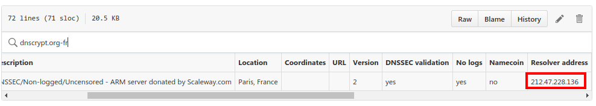
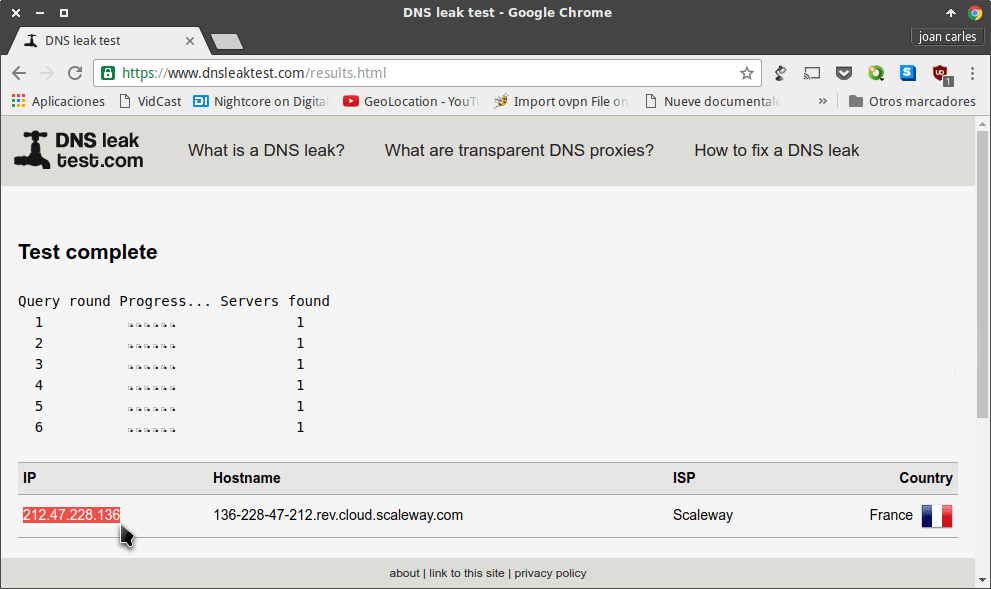
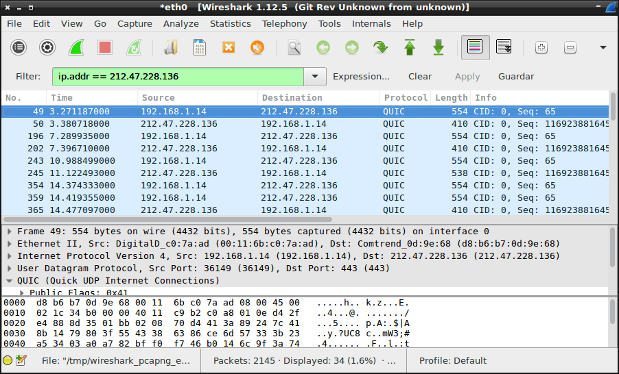

En las pasadas semanas hemos visto como [instalar y configurar DNSCrypt en Linux y en Windows](). Si una vez instalado y configurado queremos comprobar que funcionamiento de forma adecuada tenemos que seguir los siguientes pasos:<!--more-->

## COMPROBAR QUE ESTAMOS USANDO EL SERVIDOR QUE HEMOS CONFIGURADO

Tenemos que ser conscientes del servidor que estamos usando. En mi caso estoy usando el servidor es el **dnscrypt.org-fr**.

Accedemos a la siguiente [URL](https://github.com/jedisct1/dnscrypt-proxy/blob/master/dnscrypt-resolvers.csv "Listado de servidores DNS para averiguar su IP"), buscamos el servidor **dnscrypt.org-fr** y anotamos la IP que tiene el servidor:

[](images/IP-del-servidor-DNS-Elegido.png)

Tal y como se puede ver en la captura de pantalla, la IP del servidor **dnscrypt.org-fr** es la **212.47.228.136**.

Una vez conocemos la IP accedemos a la siguiente URL:

[https://www.dnsleaktest.com/](https://www.dnsleaktest.com/ "Web para comprobar el servidor DNS que estamos usando")

[](images/Iniciar-el-test-extendido.png)

Una vez dentro de la URL clicamos encima del botón **Extended Test**.

Después de clicar sobre el botón se realizaran 6 rondas de 6 peticiones DNS. Por lo tanto se realizarán 36 peticiones DNS al servidor DNS que tenemos configurado en nuestro ordenador.

[](images/Compración-de-quien-resuelve-las-peticiones-DNS.png)

 

Una vez finalizado el test vemos que la totalidad de peticiones DNS han sido resueltas por un solo servidor DNS.

Además este servidor tiene la IP **212.47.228.136** que es la IP del servidor que tenemos configurado en nuestro ordenador.

De este modo podemos tener seguridad que estamos usando el servidor DNS de DNSCRypt, y que la configuración que hemos realizado en nuestro ordenador es correcta.

###### Nota: Si aparece más de un servidor, o un servidor que no coincide con la IP que estamos usando entonces alguna parte de la configuración está fallando.

## COMPROBAR QUE EL TRÁFICO ENTRE NUESTRO ORDENADOR Y EL SERVIDOR DNSCRYPT ESTÁ CIFRADO

Una vez sabemos que estamos usando el servidor que hemos configurado, tan solo falta comprobar que las peticiones DNS se están cifrando correctamente.

Para cumplir con este objectivo esnifaré tráfico del ordenador que está usando DNSCrypt.

Para ello iniciamos Wireshark y realizamos una captura de datos del ordenador que tiene instalado DNSCrypt.

Una vez finalizada la captura aplicaremos un filtro. Para ello en el campo **Filter** introduciremos el siguiente texto:

> ```
> ip.addr == 212.47.228.136
> ```

###### Nota: En vuestro caso deberéis sustituir 212.47.228.136 por la IP de vuestro servidor DNS.

Una vez introducido el texto presionamos la tecla **Enter**.

Después de presionar la tecla **Enter** podremos ver la totalidad de comunicaciones que se han realizado entre nuestro ordenador y el servidor DNS.

[](images/Captura-del-tráfico-entre-el-servidor-DNS-y-nuestro-ordenador.png)

Si observamos la captura de pantalla vemos que la totalidad de tráfico entre nuestro ordenador y el servidor DNS se realiza mediante el protocolo QUIC.

Por lo tanto estoy seguro que las peticiones son cifradas ya que el protocolo QUIC es un protocolo diseñado para proporcionar una seguridad equivalente a TLS/SSL.

## CONCLUSIONES DEL FUNCIONAMIENTO DE DNSCRYPT

Hemos obtenido resultados satisfactorios en las 2 pruebas realizadas.

Por lo tanto podemos tener la total seguridad que DNSCRypt está funcionando de forma adecuada en nuestro ordenador por los siguientes motivos:

1. Estamos usando el servidor de DNSCrypt para resolver todas las peticiones DNS.
2. El tráfico generado entre nuestro ordenador y el servidor DNS está cifrado.
