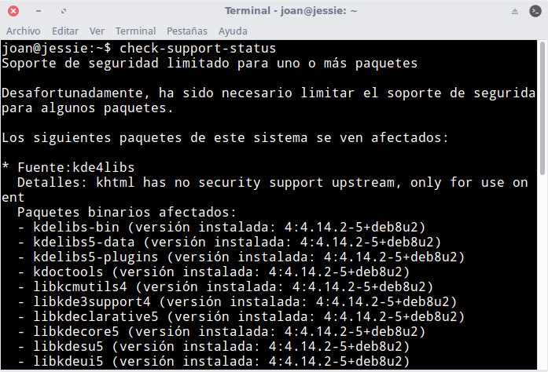

A medida que las versiones de Debian, Ubuntu y Linux Mint se van haciendo viejas existen paquetes que dejan de tener soporte de seguridad. Algunas de las razones por las que esto pasa son las siguientes:

1. En la rama LTS de Debian es posible que algunos de los paquetes dejen de tener soporte. Hay que recordad que la rama LTS no es mantenida por el equipo de Debian y en ocasiones hay falta de  recursos.
2. El desarrollador o el mantenedor del software puede abandonar su creación. En el caso que un paquete o programa esté sin soporte durante mucho tiempo será retirado de los repositorios de Debian.
3. Etc.

<!--more-->

## ¿POR QUÉ ES IMPORTANTE QUE LOS PAQUETES TENGAN SOPORTE DE SEGURIDAD?

Es importante que los programas y paquetes que usamos en nuestro equipo tengan soporte de seguridad por los siguientes motivos:

1. A diario se descubren bugs y fallos de seguridad que el desarrollador de un paquete o programa debe solucionar. Por lo tanto para nuestra seguridad es importante que los paquetes tengan soporte.
2. Para que los programas puedan ir mejorando de forma progresiva día tras día. Siempre es posible optimizar el funcionamiento de un programa.
3. Las tecnologías y los sistemas operativos no paran de evolucionar. Por lo tanto para que un programa funcione adecuadamente es necesario que se vaya actualizando periódicamente.

Una vez somos conscientes de la importancia que nuestros paquetes reciban soporte de seguridad pasaremos a ver un método para saber si nuestro software dispone de soporte y por lo tanto recibe actualizaciones de seguridad.

## INSTALAR DEBIAN-SECURITY-SUPPORT PARA DETECTAR PAQUETES SIN SOPORTE DE SEGURIDAD

Mediante la utilidad **debian-security-support** comprobaremos los paquetes instalados que han dejado de tener soporte de seguridad. Para instalar [debian-security-support](https://packages.debian.org/search?keywords=debian-security-support) tenemos que ejecutar el siguiente comando en la terminal:

> ```
> sudo apt-get install debian-security-support
> ```

Una vez instalado el paquete ya podemos pasar a realizar las comprobaciones oportunas.

## COMPROBAR LOS PAQUETES QUE NO DISPONEN DE SOPORTE EN DEBIAN Y DISTROS DERIVADAS DE DEBIAN

Para comprobar los paquetes instalados que han dejado de tener soporte tenemos que ejecutar el siguiente comando en la terminal:

> ```
> check-support-status
> ```

En mi caso los resultados obtenidos son los que se muestran en la siguiente captura de pantalla:

[](images/paquetes-sin-soporte-en-debian.png)

Como pueden ver en la captura de pantalla, hay una serie de paquetes que han dejado de recibir actualizaciones de seguridad por parte sus desarrolladores.

## ¿QUÉ HACER CON LOS PAQUETES Y PROGRAMAS QUE NO DISPONEN DE SOPORTE DE SEGURIDAD?

Una vez detectados paquetes sin soporte podemos tomar las siguientes decisiones:

1. Puede darse el caso que no haya más remedio que usar los paquetes obsoletos. En esto caso podemos tomar la decisión de mantener los paquetes o servicios obsoletos instalados en nuestro sistema operativo. En caso que tomemos esta decisión se recomienda ejecutar los programas o servicios en un entorno de ejecución seguro. De este modo evitaremos problemas mayores.
2. Reemplazar los paquetes obsoletos por otros que realizan la misma función. De esta forma podremos seguir utilizando nuestros servicios y software con mayor seguridad y eficiencia.
3. Si los paquetes no son necesarios y no los usamos, lo mejor que podemos realizar es desinstalarlos.

En el caso de decidamos desinstalar los paquetes hay que ir con cuidado. En el momento de desinstalar paquetes es posible que ciertos programas o servicios dejen de funcionar. Por lo tanto es importante conocer la funcionalidad que tienen los paquetes que estamos desinstalando.

Una forma útil para averiguar la utilidad de un paquete es ver sus dependencias y dependencias inversas. Si por ejemplo queremos intentar averiguar los programas que usan el paquete libqtwebkit4 podríamos ejecutar el siguiente comando en la terminal:

> ```
> apt-cache showpkg libqtwebkit4
> ```

Al aplicar este comando y observando su salida podrán ver que es un paquete necesario para que por ejemplo funcione el programa Skype, Amarok, etc. Por lo tanto al desinstalar libqtwebkit4 es posible que alguna de las funcionalidades de los programas mencionados deje de funcionar.
