Hace unas semanas escribí un post de como [instalar nuestro propio servidor Owncloud]() con htpps y WebDAV. Con el fin de sacar partido a nuestro servidor Owncloud, en este artículo veremos como conectarse a Owncloud con WebDAV en lo sistemas operativos más comunes.<!--more-->

## UTILIDADES DE CONECTARSE A OWNCLOUD USANDO WEBDAV

La principal utilidad del servidor WebDAV que trae incorporado Owncloud es la de poder **conectarnos, editar y ver el contenido de nuestra nube personal tal y como si se tratará de un disco duro de red en nuestro gestor de archivos**, en aplicaciones terceros, en nuestro navegador, en una carpeta de red, etc. De este modo podemos realizar tareas similares a las siguientes:

1. Visualizar vídeos almacenados en nuestra nube en el televisor, en nuestra tablet, en nuestro ordenador, etc.
2. Escuchar todo tipo de archivos de sonido almacenados en nuestra nube en el televisor, en nuestra tablet, en nuestro ordenador, etc.
3. Visualizar imágenes almacenadas en nuestra nube en el televisor, en nuestra tablet, en nuestro ordenador, etc.
4. Editar todo tipo de documentos en cualquier ordenador teléfono o tablet.

###### Nota: Quien precise información adicional sobre WebDAV puede visitar el siguiente [enlace](https://es.wikipedia.org/wiki/WebDAV "Información adicional sobre Owncloud").

Para hacer posible lo que acabo de comentar tan solo tenemos que seguir los pasos que citamos a continuación:

## CONETARSE A OWNCLOUD MEDIANTE WEBDAV EN LINUX

Si queremos conectarnos a nuestro servidor owncloud por medio de nuestro gestor de archivos es sumamente fácil.

Tan solo tenemos que **abrir el gestor de archivos**. Una vez abierto el gestor de archivos **presionamos la combinación de teclas** **Ctrl+L**. Al presionar esta combinación de teclas aparecerá la ventana de Abrir la Ubicación o el cursor se ubicará en la barra de direcciones. En la ventana Abrir la Ubicación o en la barra de direcciones, tal y como se puede ver en la captura de pantalla, hay que **añadir la siguiente dirección para poder acceder a nuestro servidor WebDAV**:

> ```
> davs://192.168.1.96/owncloud/remote.php/webdav/
> ```

[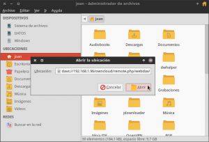](images/URL-de-conexión-con-WebDAV-en-Linux.png)

La parte de color azul de la dirección es común para todo el mundo.

La parte de color rojo se debe adaptar en cada caso. Para adaptar el comando a vuestro caso particular podéis seguir las siguientes indicaciones:

1. Si accedéis desde vuestra red local deberéis reemplazar 192.168.1.96 por la IP interna de vuestro servidor Owncloud.
2. Si accedéis desde fuera de vuestra red local deberéis reemplazar 192.168.1.96 por el dominio de redireccionamiento DNS (No-IP) que usáis en vuestro caso.

###### Nota: En el caso que el servidor al que se quiera acceder no disponga de autenticación SSL hay que reemplazar davs por dav en la dirección de acceso al servidor.

###### Nota: En el caso que se quiera acceder al servidor owncloud a través de Dolphin hay que sustituir davs por webdav en la dirección de acceso al servidor.

Una vez introducida la dirección tan solo hay que **presionar el botón** **Abrir**. Una vez presionado el botón abrir, tal y como se muestra en la captura de pantalla, se nos pregunta el nombre de usuario y contraseña de nuestra cuenta de owncloud:

[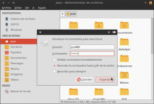](images/Introducir-usuario-y-contraseña.png)

Una vez **introducidos el usuario y la contraseña** hay que **presionar el botón Conectar**. Una vez hayamos presionado sobre el botón, tal y como se puede ver en la captura de pantalla, estaremos conectados a nuestra nube personal de Owncloud y podremos hacer lo que queramos con los archivos presentes en nuestra nube.

[](images/Conectado-a-Owncloud-con-WebDAV-en-Linux.png)

Para no tener que repetir siempre el mismo proceso podemos crear una ubicación o marcador. Para ello, tal y como se puede ver en la captura de pantalla, posicionamos el puntero del mouse encima de la ubicación de red de owncloud:

[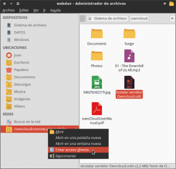](images/Acceso-directo-a-Owncloud.png)

Seguidamente cuando aparezca en menú contextual, tal y como se puede ver en la captura de pantalla, tenemos que clicar encima de la opción **Crear acceso directo**. Después de clicar sobre esta opción aparecerá un acceso directo en el apartado de ubicaciones:

[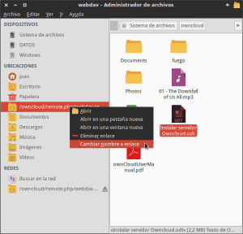](images/Cambiar-Nombre-Acceso-directo-Owncloud.png)

Si queremos cambiar el nombre del acceso directo a nuestra nube de owncloud, tal y como se puede ver en la captura de pantalla, presionamos el botón derecho del mouse encima del acceso directo. Cuando aparezca el menú contextual deberemos seleccionar la opción **Cambiar nombre a enlace**. Seguidamente podremos poner el nombre que queramos que en mi caso será Nube Personal:

[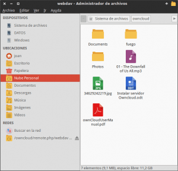](images/Ubicación-de-Owncloud-incluida.png)

###### Nota: Para más información de como crear Ubicaciones y marcadores en Thunar y en Nautilus puede consultar el siguiente [enlace]().

###### Nota: El proceso explicado en este apartado funciona del mismo modo en prácticamente la totalidad de gestores de archivos de Linux. Por lo tanto da igual que usen Caja, Nautilus, Thunar, PcmanFM, etc que el proceso será exactamente el mismo.

## CONECTARSE A OWNCLOUD USANDO WEBDAV EN ANDROID

Si queremos conectarnos a nuestra nube personal a través de WebDAV en Android tenemos multitud de opciones. La opción que acostumbro a utilizar en mi caso es mediante ES Explorador de Archivos.

### Instalar ES Explorer a nuestro dispositivo Android

Tan solo tenemos que acceder a la tienda de Google Play Store e instalar la aplicación ES Explorer. Quien lo prefiera también puede usar este [link](https://play.google.com/store/apps/details?id=com.estrongs.android.pop&hl=es "Link de descarga de ES Explorer") para descargar e instalar la aplicación.

### Ejecutar ES Explorer en nuestro dispositivo Android

Una vez instalado ES Explorer lo ejecutamos en nuestro teléfono móvil o tablet.

### Agregar Owncloud como ubicación de Red

El siguiente paso es agregar nuestro servidor Owncloud en las ubicaciones de red de ES Explorer. Para ello una vez abierto ES Explorer, tal y como se puede ver en la captura de pantalla, hay que **dar un click con nuestro dedo encima de las 3 barras horizontales de color azul**.

[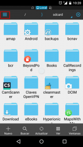](images/Es-Explorer.png)

Después de clicar encima de las 3 barras horizontales aparecerá el siguiente menú:

[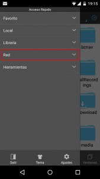](images/Acceder-apartado-red.png)

En el menú que acaba de aparecer hay que **pulsar con el dedo encima de la opción Red**. Después de pulsar sobre la opción Red se desplegará el siguiente menú:

[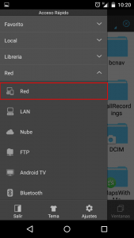](images/Ubicaciones-de-Red.png)

En el menú que se acaba de desplegar, tal y como se puede ver en la captura de pantalla, hay que **volver a clicar de nuevo sobre la opción Red**. Después de clicar sobre la opción Red aparecerá la siguiente ventana:

[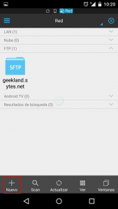](images/Agregar-nueva-ubicación-de-red.png)

En la pantalla de configuración de red hay que **presionar encima del botón Nuevo**. Después de presionar sobre el botón aparecerá la siguiente pantalla para seleccionar el tipo de conexión de red que queremos configurar:

[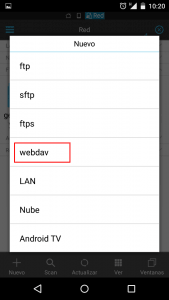](images/Tipo-de-red-WebDAV.png)

En nuestro caso, tal y como se puede ver en la captura de pantalla, hay que **seleccionar la opción webdav**. Al seleccionar esta opción aparecerá la siguiente pantalla:

[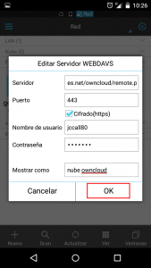](images/Datos-de-conexión-al-servidor-WebDAV.png)

En esta pantalla hay que **introducir la totalidad de datos para que ES Explorer se pueda conectar a nuestro servidor** Owncloud mediante WebDAV. Para ello en cada uno de los apartados tenemos que introducir los siguientes datos:

**SERVIDOR: geekland.sytes.net/owncloud/remote.php/webdav** En este campo hay que introducir la dirección URL para acceder a nuestro servidor Owncloud a través de WebDAV. La parte de color azul del comando es común para todo el mundo.

La parte de color rojo se debe adaptar en cada caso. Para adaptar el comando a vuestro caso particular podéis seguir las siguientes indicaciones:

1. Si accedéis desde vuestra red local deberéis reemplazar geekland.sytes.net por la Ip interna de vuestro servidor Owncloud.
2. Si accedéis de fuera de vuestra red local deberéis reemplazar geekland.sytes.net por el dominio de direccionamiento DNS (No-IP) que uséis en vuestro caso.

**PUERTO: 443** Como estamos accediendo a un servidor owncloud que dispone de un certificado ssl (https) deberemos seleccionar el puerto 443. En caso contrario deberemos seleccionar el puerto 80.

**CIFRADO: Sí** Obviamente en este apartado tenemos que tildar la opción Cifrado. El servidor que configuramos dispone de un certificado de autenticación SSL. Por lo tanto la conexión es cifrada y tenemos que tildar esta opción.

**NOMBRE DE USUARIO: jccall80** En este apartado tan solo tenemos que introducir el nombre de usuario de la cuenta de Owncloud a la que queremos acceder.

**CONTRASEÑA: Micontraseña** En este apartado tenemos que introducir la contraseña del usuario del apartado anterior.

**MOTRAR COMO: Nube Owncloud** Finalmente en mostrar como podemos introducir la palabra/frase que nosotros queramos. Esta frase o palabra tan solo servirá para que nosotros podamos reconocer el servidor al que queremos acceder en el momento de conectarnos.

Una vez introducidos la totalidad de datos tan solo hay que **presionar en el botón OK**. Después de presionar en el botón OK el proceso ha finalizado.

### Conectarse a Owncloud a través de WebDAV en Android

Una vez terminada la configuración ya podemos acceder al servidor owncloud con WebDAV sin ningún tipo de problema. Para ello, tal y como hicimos en apartados anteriores, **accedemos a las ubicaciones de red disponibles en ES Explorer**. Justo al acceder a las ubicaciones de Red verán que les aparece una pantalla parecida a la siguiente:

[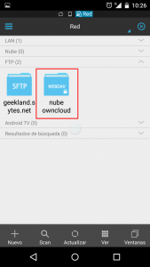](images/Ubicación-de-red-creada.png)

En esta pantalla observaran que aparece la ubicación de Red nube owncloud que es la que acabamos de configurar. Para acceder al servidor Owncloud tan solo hay que **presionar encima de la carpeta nube owncloud**. Después de presionar encima de la carpeta, tal y como se puede ver en la captura de pantalla, accederemos al contenido almacenado en nuestra nube de owncloud.

[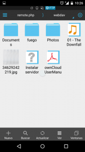](images/Dentro-de-Owncloud-con-WebDAV-en-Android.png)

## CONECTARSE A OWNCLOUD USANDO WEBDAV EN iOS

Al Igual que en Android, en iOS también existen multitud de opciones para conectarnos al contenido de nuestra nube owncloud a través de WebDAV. En mi caso acostumbro a utilizar la aplicación Documents by Readdle.

### Instalar Documents by Readdle en nuestro dispositivo iOS

Tan solo tenemos que acceder a la tienda iTunes Store e instalar la aplicación Documents by Readdle. Quien lo prefiera también puede usar este [link](https://itunes.apple.com/es/app/documents-5-lector-rapido/id364901807?mt=8 "Link de descarga de Documents by Readdle") para descargar e instalar la aplicación.

### Ejecutar Documents by Readdle en nuestro dispositivo iOS

Una vez instalado Documents by Readdle lo ejecutamos en nuestro teléfono móvil o tablet.

### Agregar Owncloud como ubicación de Red

El siguiente paso es agregar nuestro servidor Owncloud en las ubicaciones de red de Documents by Readdle. Para ello una vez abierta la aplicación, tal y como se puede ver en la captura de pantalla, hay que **dar un click con nuestro dedo encima del icono de Red**.

[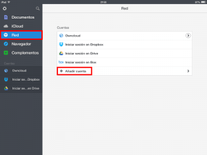](images/Añadir-Ubicación-de-Red.png)

Seguidamente, tal y como se puede ver en la captura de pantalla anterior, tenemos que **presionar encima de la opción** **\+ Añadir cuent**a. En el momento de presionar el botón + Añadir cuenta aparecerá la siguiente pantalla en la que deberemos seleccionar el tipo de red al que nos queremos conectar. En mi caso, tal y como se puede ver en la captura de pantalla, **presiono encima de la opción Servidor WebDAV**.

[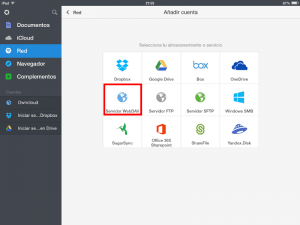](images/Tipo-WebDAV.png)

Después de seleccionar Servidor WebDAV, aparecerá la siguiente pantalla que es donde deberemos introducir la totalidad de datos necesarios para que Documents by Readdle se pueda conectar a nuestro servidor Owncloud.

[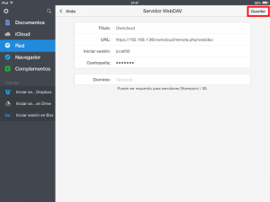](images/Datos-de-acceso-al-servidor.png)

Tal y como se puede ver en la captura de pantalla, **los datos a introducir en cada unos de los apartados son los siguientes**:

**TITULO: Owncloud** En este apartado podemos seleccionar el nombre que nosotros queramos. Este nombre sirve para podamos reconocer el servidor al que queremos acceder en el momento de conectarnos.

**URL: https://192.168.1.96/owncloud/remote.php/webdav** En este campo hay que introducir la dirección URL para acceder a nuestro servidor Owncloud a través de WebDAV. La parte de color azul del comando es común para todo el mundo.

La parte de color rojo se debe adaptar en cada caso. Para adaptar el comando a vuestro caso particular podéis seguir las siguientes indicaciones:

1. Si accedéis desde vuestra red local deberéis reemplazar 192.168.1.96 por la Ip interna de vuestro servidor Owncloud.
2. Si accedéis de fuera de vuestra red local deberéis reemplazar 192.168.1.96 por el dominio de direccionamiento DNS (No-IP) que uséis en vuestro caso.

**INICIAR SESIÓN: jccall80** Seguidamente en iniciar sesión tan solo hay que introducir el nombre de usuario de la cuenta de owncloud a la que nos queremos conectar.

**CONTRASEÑA: Micontraseña** En este último apartado tan solo hay que introducir la contraseña del usuario que introducimos previamente.

Una vez rellenados la totalidad de apartados tan solo hay que **presionar el botón Guardar**. Después de presionar el botón guardar aparecerá una advertencia que nos dice que el sistema no puede verificar la identidad del servidor y nos preguntará si queremos continuar. Frente a esta pregunta nosotros **responderemos Continuar**, porqué el motivo por el cual no puede confirmar la identidad es que el certificado SSL ha sido creado y firmado por nosotros mismos.

Después de presionar el botón Continuar, tal y como se puede ver en la captura de pantalla, accedemos a nuestra nube personal Owncloud mediante WebDAV.

[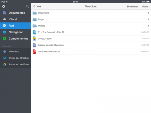](images/Navegando-datos-Owncloud-en-iOS.png)

Si en un futuro queremos acceder de nuevo a nuestro servidor owncloud no hace falta repetir la totalidad de pasos. Tan solo tenemos que abrir la App y fijarnos que en el apartado Cuentas ahora aparece nuestro servidor Owncloud.

Por lo tanto tal y como se puede ver en la captura de pantalla, si queremos acceder de nuevo al servidor Owncloud tan solo tenemos que presionar encima del servidor **Owncloud** que aparece en el apartado de cuentas y automáticamente accederemos a nuestro servidor.

[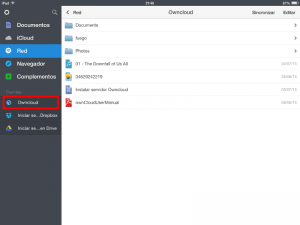](images/Acceso-rápido-a-Owncloud.png)

## CONECTARSE A OWNCLOUD USANDO WEBDAV EN WINDOWS Y OS X

Es increíble pero tanto OS X 10.8 como Windows 7 y 8 presentan problemas a la hora de mapear un servidor WebDAV con autenticación SSL (https). Por lo tanto en el caso de usar alguno de estos 2 sistemas operativos lo más recomendable es usar una aplicación de terceros. En mi caso actualmente estoy probando la aplicación Cyberduck.

###### Nota: El comportamiento que se obtiene con Cyberduck no es el de un disco duro local como se obtiene en Linux. Al usar Cyberduck nos conectamos al servidor. Una vez nos hemos conectado entonces podemos descargar el archivo a nuestro disco duro y editarlo. Una vez editado el archivo lo tendremos que volver a subir al servidor Owncloud. Si lo que pretendemos es tener algo parecido a un disco duro de red, lo más fácil para estos 2 sistemas operativos es instalar la aplicación de escritorio de Owncloud.

### Instalar Cyberduck en Windows o en MacOSX

Tan solo tenemos que acceder a la [página web](https://cyberduck.io/ "Link de descarga de Cyberduck") de Cyberduck y descargar los archivos binarios de instalación disponibles para MAC OS X y Windows. Una vez descargado el archivo binario lo instalan de forma habitual en su sistema operativo.

### Ejecutar Cyberduck en Windows o en MacOSX

Una vez instalado Cyberduck lo ejecutamos en nuestro ordenador.

### Agregar Owncloud como ubicación de Red

Después de ejecutar Cyberduck verán la siguiente pantalla:

[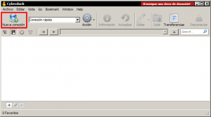](images/Conectado-al-servidor-Owncloud-en-Windows.png)

Lo primero a realizar, tal y como se puede ver en la captura de pantalla, es **presionar sobre el botón Nueva Conexión**. Después de presionar sobre el botón aparecerá la siguiente pantalla en la que deberemos **introducir la totalidad de datos para conectarse a Owncloud**:

[](images/Datos-de-conexión-al-servidor.png)

Los datos a rellenar en cada uno de los campos son los siguientes:

**TIPO DE SERVIDOR: WebDAV (HTTP/SSL)** En tipo de servidor tenemos que seleccionar la opción WebDAV (HTTP/SSL) ya que el servidor al cual nos queremos conectar es un servidor WebDAV

**SERVER: 192.168.1.96** En este campo hay que introducir nuestro nombre de dominio o la IP interna del servidor que tiene instalado Owncloud.

Como en mi caso estoy accediendo desde mi red local pongo la IP 192.168.1.96 que corresponde a la IP interna del servidor que tiene instalado Owncloud.

Si quisiera acceder a mi nube owncloud desde fuera de mi red local debería sustituir 192.168.1.96 por mi dominio de redireccionamiento DNS que en mi caso es geekland.sytes.net.

**PUERTO: 443** Como estamos accediendo a un servidor owncloud que dispone de un certificado ssl (https) deberemos seleccionar el puerto 443. En caso contrario deberemos seleccionar el puerto 80.

**NOMBRE DE USUARIO: jccall80** Seguidamente en Nombre de Usuario tan solo hay que introducir el nombre de usuario de la cuenta de owncloud a la que nos queremos conectar.

**CONTRASEÑA: Micontraseña** En el apartado contraseña tan solo hay que introducir la contraseña del usuario que introducimos previamente.

**GUARDAR CONTRASEÑA: Sí** Si tildamos esta opción, cada vez que nos conectemos a Cyberduck la conexión al servidor Owncloud se realizará de forma automática sin que tengamos que introducir nuestra contraseña.

**PATH: owncloud/remote.php/webdav** Finalmente en el campo Path deberemos introducir el resto de la dirección para conectarse a Owncloud mediante WebDAV. Como en mi caso la dirección de conexión a mi servidor es https://192.168.1.96/owncloud/remote.php/webdav en este apartado escribiré **owncloud/remote.php/webdav**

Una vez rellenados la totalidad de campos tan solo hay que **presionar encima del botón Connect**. Después de presionar el botón Connect aparecerán 2 advertencias referentes al certificado que creamos para nuestro servidor Owncloud. En la primera de las advertencias **respondemos Continuar** **y** en la segunda respondemos que **Sí** para proceder a la instalación del certificado. Seguidamente tal y como se puede ver en la captura de pantalla ya estaremos conectados a nuestro servidor Owncloud.

[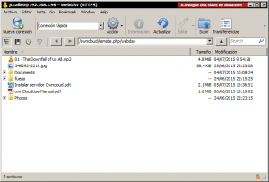](images/Conectado-al-servidor-con-Windows.png)

###### Nota: No nos deben preocupar las advertencias de seguridad referentes a nuestro certificado. Las advertencias se deben a que el certificado lo creamos y lo firmamos nosotros mismos.
