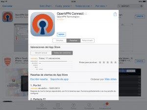
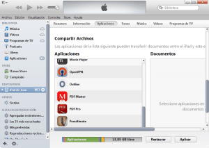
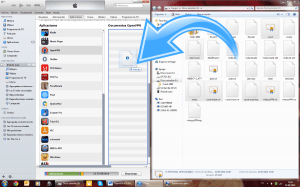
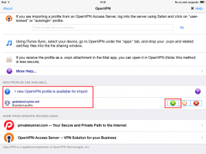
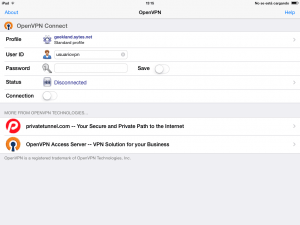
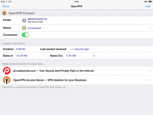

En pasados post vimos de forma muy detallada como crear y configurar nuestro propio servidor OpenVPN con cualquier distribución derivada de Debian. Una vez instalado y configurado nuestro servidor OpenVPN lo único que falta es configurar los clientes en los distintos sistemas operativos que existen para podernos conectar al servidor OpenVPN.

El primer sistema operativo en que veremos como podemos utilizar nuestro servidor OpenVPN es iOS. Los pasos para poder utilizar nuestro Servidor OpenVPN en iOS son los siguientes:<!--more-->

## PASO 1: RECOPILAR LAS CLAVES NECESARIAS PARA LA CONEXIÓN AL SERVIDOR

En su día ya vimos que OpenVPN funciona mediante mediante certificados y claves RSA construidas con Openssl. También creamos la totalidad de claves para que los clientes puedan conectarse al servidor OpenVPN. Por lo tanto si seguimos la totalidad de pasos que se detallan en el siguiente [enlace](), en la ubicación **/etc/openvpn/keys** tenéis que tener las siguientes claves:

   
|   **Archivo**   |   **Descripción**   |   **Ubicación**   |   **Secreto**   |
| --- | --- | --- | --- |
|   _ca.crt_   |   Certificado raíz de la entidad certificadora   |   Servidor (/etc/openvpn) y cliente   |   No   |
|   whezzyVPN.crt   |   Certificado del servidor VPN   |   Servidor (/etc/openvpn) y cliente   |   No   |
|   usuariovpn.key   |   Clave privada del cliente VPN   |   Cliente   |   Sí   |
|   usuariovpn.crt   |   Certificado del cliente VPN   |   Cliente   |   No   |
|   ta.key   |   Clave para la Autentificación TLS   |   Servidor (/etc/openvpn) y cliente   |   Sí   |

Ahora tan solo tenemos que copiar las claves detalladas en la tabla en el cliente, que en este caso será un iPad con iOS 7.1. Para hacer el traslado existen muchos métodos y pueden usar el que más les convenga.

Al tratarse de un tutorial lo haré mediante una memoria USB porqué considero que es la forma que requiere de menos conocimientos informáticos. Si no tuviera que hacer el tutorial extraería las claves fácilmente conectándome al servidor OpenVPN vía SSH.

Por lo tanto **enchufamos la memoria USB a nuestro servidor OpenVPN**. Una vez enchufada tendremos tendremos que montarla. **Para montarla les recomiendo seguir las instrucciones que se muestran en el siguiente enlace**:

[https://geekland.eu/montar-la-memoria-usb-en-la-terminal/]()

###### Nota: Si vuestro servidor dispone de un entorno gráfico la memoria USB se montará automáticamente.

Una vez montada la memoria USB tan solo tenemos que **copiar las claves del servidor a la memoria USB**. Para ello en el caso que no tengan entorno gráfico puede **utilizar el siguiente comando:**

> ```
> cp /etc/openvpn/keys/* /media/usb
> ```

###### Nota: Este comando copia la totalidad de contenido de la ubucación /etc/openvpn/keys, que es donde estan nuestras claves, a nuestra memoria USB que hemos montado en la carpeta /media/usb.

## PASO 2: COPIAR EL FICHERO DE CONFIGURACIÓN DEL CIENTE

Cuando configuramos el servidor también creamos un fichero de configuración para el cliente. Este fichero lo guardamos en la ubicación **/etc/openvpn** con el nombre **client.conf**.

Este fichero también lo copiaremos a nuestra memoria USB. Para ellos **introduciremos el siguiente comando en la terminal:**

> ```
> cp /etc/openvpn/client.conf /media/usb
> ```

###### Nota: Este comando copia el fichero client.conf ubicado en /etc/openvpn/keys a nuestra memoria USB que hemos montado en la carpeta /media/usb.

Para si a alguien le puede servir de ayuda les dejo la captura de pantalla del procedimiento que he seguido en mi caso:

[](images/1-Copia-de-los-archivos-para-la-conexión.png)

## PASO 3: INSTALAR EL PROGRAMA CLIENTE DE OPENVPN EN iOS

Este paso es el más sencillo de todos. Tan solo tienen que ir a la AppStore e instalar el programa OpenVPN. Si clican en el siguiente [enlace](https://itunes.apple.com/app/openvpn-connect/id590379981 "Descarga de OpenVPN para iOS") accederán directamente a la descarga del programa.

Para que no tengan ningún tipo de duda del programa que se trata les dejo esta captura de pantalla en la que pueden ver información relativa al programa.

[](images/2-Instalar-cliente-OpenVPN.png)

###### Nota:  Si en la appstore hacen una búsqueda por openvpn también encontrarán fácilmente el cliente openvpn que tenemos que descargar.

## PASO 4: RENOMBRAR EL FICHERO DE CONFIGURACIÓN DEL CLIENTE

El paso número 4 consiste en **enchufar la memoria USB que contiene todas las claves y el fichero de configuración del cliente en un ordenador que tenga instalado iTunes**.

Una vez hemos enchufado el pendrive a nuestro ordenador lo abrimos y consultamos su contenido:

[](images/3-Renombar-archivo-configuración-cliente.png)

Tal y como se puede ver en la captura de pantalla **tenemos que localizar el fichero** **client.conf**. **Una vez localizado el fichero** **client.conf** **deberemos cambiar su extensión a** **client.ovpn**

Una vez realizado esto ya podemos pasar al siguiente punto.

###### Nota: Si tienen problemas en cambiar la extensión del archivo en windows pueden consultar el siguiente [enlace](http://windows.microsoft.com/es-es/windows/show-hide-file-name-extensions#show-hide-file-name-extensions=windows-vista "Cambiar extensión de un archivo en Windows").

## PASO 5: CONECTAR EL IPAD O IPHONE EN NUESTRO ORDENADOR Y SINCRONIZARLO CON ITUNES

El quinto paso es **abrir Itunes** en nuestro ordenador con Windows o Mac. Una vez hemos abierto iTunes **enchufamos el Ipad o Iphone y esperamos a que se sincronice**.

**Una vez sincronizado**, tal y como pueden ver en la captura de pantalla, **En la columna de la izquierda tienen que clicar donde dice** **iPad de Joan**.

###### Nota: En vuestro caso en vez de iPad de Joan aparecerá otro nombre.

[](images/4-Pasos-a-realizar-en-iTunes.png)

Seguidamente, tal y como también vemos en la captura de pantalla, **en la parte central superior de la pantalla tenemos que clicar en el botón** **Aplicaciones**. Una vez presionado el botón aplicaciones, en la pantalla aparecerán la totalidad de aplicaciones que tenemos instaladas en nuestro iPad o iPhone.

Ahora que tenemos todas las aplicaciones en pantalla **tenemos ir al apartado** **Compartir Archivos** **y clicar encima de la aplicación que tiene como nombre** **OpenVPN**.

Una vez hayáis clicado encima de aplicación OpenVPN, **en la columna de más a la derecha aparecerá una recuadro que pondrá** **Documentos OpenVPN**.

[](images/5-Copiar-claves-al-iPad-o-iPhone.png)

Tal y como se puede ver en la captura de pantalla, **volvemos a la ventana donde podemos visualizar el contenido de nuestro pendrive**, y por lo tanto podemos ver la totalidad de claves y el archivo de configuración del cliente. **Una vez tenemos visible la ventana seleccionamos los siguientes archivos:**

1. ca.crt   "Certificado raíz de la entidad certificadora"
2. whezzyVPN.crt   "Certificado del servidor VPN"
3. usuariovpn.key   "Clave privada del cliente VPN"
4. usuariovpn.crt   "Certificado del cliente VPN"
5. ta.key   "Clave de Autentificación TLS"
6. client.ovpn   "Fichero de configuración del cliente"

Seguidamente, tal y como también podemos ver en la captura de pantalla, tenemos que **arrastrar los 6 archivos seleccionados dentro del recuadro** **Documentos OpenVPN** de iTunes. Una vez arrastrados y copiados nuestros archivos ya podemos pasar al siguiente paso.

###### Nota: El procedimiento seguido es considerando que tenemos un dispositivo sin el Jailbreak. En el caso de disponer de Jailbreak el proceso se podría simplificar bastante mediante el uso de SSH.

###### Nota: En el Ejemplo solo he considerado un usuario que es el usuariovpn. En vuestro caso podéis añadir más usuarios si lo consideráis conveniente.

## PASO 6: CONECTARSE AL SERVIDOR OPENVPN EN iOS

Después de copiar la claves y el fichero de configuración del cliente ya nos podemos conectar a nuestro servidor OpenVPN en iOS. Por lo tanto **cogemos nuestro iPad o iPhone y abrimos el cliente OpenVPN**. **Justo al abrir la App OpenVPN** tienen que ver una pantalla parecida a la siguiente:

[](images/6-Importar-Perfil.png)

Como se puede ver en la captura de pantalla, **hay un mensaje que se ha detectado un nuevo perfil para importar** ya que acabamos de traspasar la totalidad de claves y configuración del cliente en el iPad o el iPhone.

**Para importar el perfil que se ha detectado únicamente tienen que presionar encima del circulo verde que tiene el símbolo** **+**.

Una vez presionado el botón el perfil se importará y les aparecerá una pantalla parecida a la siguiente:

[](images/7-Introducir-usuario-y-contraseña.png)

En esta pantalla tan solo tienen que **introducir su nombre de usuario y su contraseña**. Una vez los hayan introducido **presionan la tecla** **Intro** y el Ipad o iPhone iniciará la conexión a nuestro propio servidor OpenPVN. A los pocos segundos la conexión se habrá establecido tal y como se puede ver en la siguiente captura de pantalla:

[](images/8-Conectado-al-servidor-OpenVPN.png)

Una vez terminado todo el proceso ya solo nos falta disfrutar de las ventajas que nos otorga tener nuestro propio servidor VPN.
