En este post detallaremos como conectarse a un servidor web proxy con el fin de poder navegar anónimamente. Este post guarda relación con el post de como conectarse a un VPN que postee en el pasado y podéis consultar en el siguiente enlace:

[https://geeklandlinux.github.io/posts/conectarse-a-un-servidor-vpn-gratis/]()

<!--more-->En el post de VPN vimos su funcionamiento teórico, las beneficios que nos puede proporcionar y finalmente vimos como establecer conexión con una serie de servidores VPN gratuitos que podemos encontrar en internet.

Ahora la idea es realizar lo mismo pero esta vez con un servidor proxy. Así que empezaremos detallando lo que es un Servidor Proxy y como funciona:

## ¿QUÉ ES UN SERVIDOR HTTP PROXY?

Básicamente es una máquina o dispositivo que hace de pasarela a clientes para conectarse a servidores web.

Por lo tanto cuando nosotros estamos en el navegador y queremos conectarnos a una página web primero hacemos la petición al servidor proxy. Entonces el servidor proxy hará la petición de conexión al servidor web o página web al que queremos conectarnos.

Si después de leer este apartado aún tenéis dudas leer el siguiente apartado. Después de leer el siguiente apartado todo os quedará completamente claro.

###### Nota: Este post se centra en servidores http proxy o proxy web. Existen otros servidores proxy como por ejemplo los servidores Proxy socks o Forward Proxy.

## COMO FUNCIONA UN SERVIDOR PROXY

En el siguiente gráfico se puede ver el funcionamiento de un servidor proxy:

[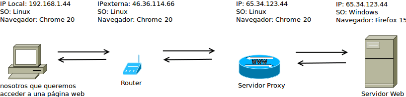](images/Funcionamiento-servidor-Proxy.png)

En el gráfico vemos que nosotros queremos visitar una página web alojada en un servidor web. Por lo tanto realizamos la petición a través del servidor proxy. Por lo tanto el servidor proxy recibirá una petición de nuestro ordenador con una ip externa **46.36.114.66**.

Una vez se haya recibido nuestra petición el servidor proxy realizara la misma petición que acabamos de realizar al servidor web, pero con la particularidad que la petición la hará con la IP **65.34.123.44** que es la IP del servidor proxy. Con esto conseguiremos que ocultar nuestra IP al personal que esta gestionando la página web a la que nos queremos conectar.

En otras palabras y para simplificarlo aun más. Imaginemos que tenemos que pedir prestado dinero a una persona y no queremos que sepa que nos lo está prestando a nosotros. Lo que haríamos en este caso es pedir a una tercera persona que pida el dinero por nosotros. Entonces la persona que está prestando el dinero nunca sabría que nosotros estamos en poder del dinero que ha prestado.

## VENTAJAS QUE OBTENEMOS AL CONECTARNOS A TRAVÉS DE UN SERVIDOR PROXY

Como acabamos de ver la utilidad principal de conectarnos a través de un servidor proxy es ocultar información a la gente que nos está rastreando. Por lo tanto en cierto modo un servidor proxy no esta convirtiendo en anónimos.

Ser anónimo es sumamente importante por varios motivos. En el momento que que estamos proporcionando nuestra IP estamos revelando entre otras cosas nuestra ubicación. Para que podáis ver que lo que digo es verdad solamente tenéis que acceder a la siguiente página web:

[http://myip.es](http://myip.es "Myip.es")

Cuando accedas a la web obtendrás una información similar a la siguiente:

[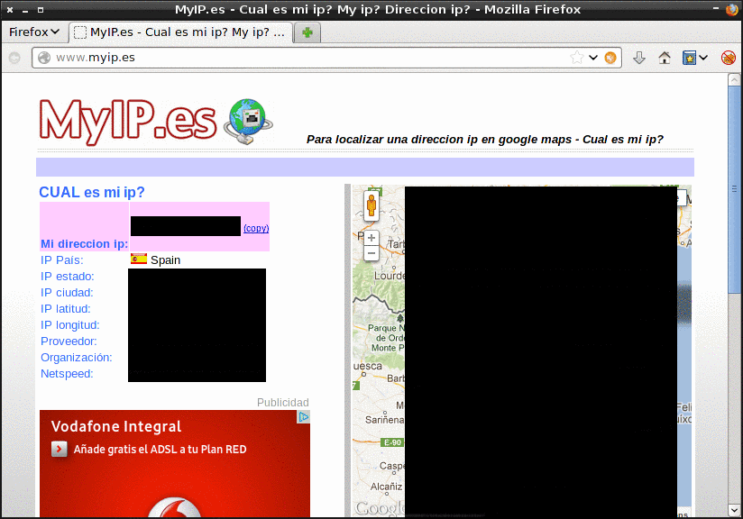](images/Servicio-Myip-1.png)

###### Nota:  Por motivos obvios he ocultado la información que aparece en la captura de pantalla.

Como podéis ver en la captura de pantalla cualquier persona que tenga nuestra IP pueder saber nuestra localización exacta y nuestro proveedor de Internet de forma muy fácil.

Aparte de lo que acabamos de ver aún hay mas. Cada vez que visitamos una página web estamos entregando más información aparte de nuestra ip. Para que tengáis una idea de la totalidad de información que estáis proporcionando os podéis conectar a la siguiente página web:

[www.xhaus.com/headers](http://xhaus.com/headers "xhaus")

Al conectaros obtendréis una pantalla similar a la siguiente:

[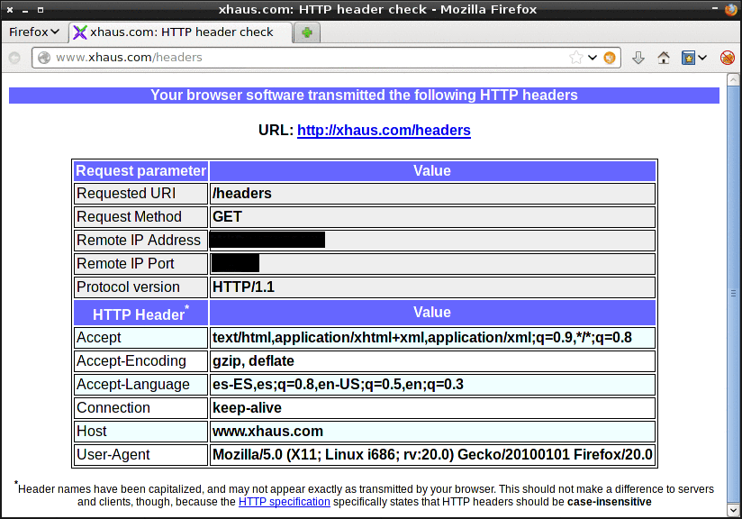](images/Servicio-xhaus-1.png)

###### Nota:  En la captura de pantalla podéis ver la totalidad de información que entegamos al visitar una página web. Parte de la información que entregamos es necesaria para hacer que el servidor web interprete nuestra petición. La gente que esté interesada en el protocolo de comunicación http les dejo el siguiente enlace de introducción: [http://es.kioskea.net/contents/264-el-protocolo-http](http://es.kioskea.net/contents/264-el-protocolo-http "Protocolo de Comunicación http")

Por lo tanto la información que nuestro navegador esta proporcionando en cada uno de los sitios web que nos conectamos es la siguiente:

1. La **dirección de la página** web a la que estamos accediendo.
2. El método de conexión que en este caso es el **GET**. El método GET es el que solicita un recurso ubicado en la URL que nos conectamos.
3. Nuestra **dirección IP** y el puerto por el que nuestra máquina está transmitiendo.
4. La versión de protocolo solicitado que en la mayoría de casos es **HTTP/1.1.**
5. El **tipo de contenido** que acepta nuestro navegador.
6. Información acerca de si nuestro navegador acepta páginas con compresión gzip, etc.
7. Nuestro **idioma de preferencia**. Este punto por ejemplo es útil en el caso que accedamos a páginas web multi idioma. Con está característica el servidor web sabrá que tendrá que darnos una respuesta en español.
8. El **tipo de conexión** que en la mayoría de será **Keep alive**. El protocolo http al realizar la conexión da una respuesta. Al dar la respuesta desconecta la conexión automáticamente. Con el parámetro keep alive hacemos que esta la conexión se mantenga viva para soportar futuras peticiones al servidor al que estamos conectados.
9. Información acerca de nuestro **tipo de navegador y del sistema operativo** que estamos utilizando.
10. Otra información adicional que no se muestra en la captura de pantalla como por ejemplo la fuente por la cual hemos accedido a la página web, etc.

Como podéis ver con la información que estamos dando cualquier hacker tendrá la información suficiente para acceder a nuestro ordenador y amargarnos la existencia. Pensad que le estamos dando muchos datos cruciales como por ejemplo nuestra IP, el sistema operativo que usamos, la versión de un navegador, la versión del navegador, etc. Tan solo con saber nuestra IP y la versión del navegador que usamos puede ser suficiente para que alguien acceda a nuestro ordenador.

Otras ventajas que obtenemos al conectarnos a Internet a través de un servidor proxy son:

1. Tener **acceso a servicios que no están disponibles en nuestro país**. Por ejemplo si estamos en España podríamos acceder a servicios como Pandora o Netflix.
2. Posibilidad de **saltarse las restricciones de los  servidores proxy** **que acostumbran existir  en muchas empresas** para que no nos conectemos a nuestro correo personal, Youtube, Facebook, etc. En función de la infraestructura que tenga la empresa es posible que no sea posible saltarse las restricciones
3. **Ocultar lo sitios que visitamos mientras trabajamos**. Puede ser que el departamento informático, del sitio donde trabajáis, este registrando las páginas web a las que se conecta cada uno de los empleados. En el caso de usar un servidor proxy solo podrán registrar que nos hemos conectado a un servidor proxy pero no podrán saber en las páginas web que ingresamos.
4. **Saltarse restricciones que imponen ciertos servicios de Internet**. Por ejemplo los servidores de descarga directa que permiten un número limitado de descargas por IP.
5. **Acceso a foros o en páginas web en que se ha baneado nuestra dirección IP**.

Además en el caso que nosotros tuviéramos un servidor, por ejemplo squid, y lo pudiéramos configurar como un forward proxy podríamos obtener las siguientes prestaciones del servidor proxy:

1. **Proporcionar un servicio de proxy cache http**. Así la segunda vez que queramos acceder a un sitio web la velocidad de conexión será mucho más rápida. Un servidor proxy cache es especialmente útil en el caso de tener varios usuarios que visitan páginas comunes. Si estos usuarios están conectados a través del mismo proxy la carga de las páginas se incrementará enormemente.
2. **Denegar ciertos a usuarios como por ejemplo p2p, skype, email**, etc.
3. **Prohibir el acceso a determinadas páginas we**b.
4. **Registrar el tráfico de un usuario de la red en concreto**.
5. **Denegar el acceso a ciertas submáscaras de red**.

## COMO CONECTARSE A UN SERVIDOR PROXY

### Paso 1: Buscar un servidor proxy al que conectarnos

El primer paso para conectarse a un servidor proxy es buscar un servidor proxy. Para buscar un servidor proxy gratuito al que poder conectarnos es muy fácil. Solamente tenéis que entrar en google y poner proxy list. En mi caso lo he hecho y veo por ejemplo que existe el siguiente servicio que es el que usado para escribir el post:

[www.ip-adress.com/proxy\_list/](http://ip-adress.com/proxy_list/ "Listado Servidores Proxy")

Otras páginas web similares a las que acabo de citar son las siguientes:

[http://www.hidemyass.com/](http://www.hidemyass.com/ "Listado de Proxy") [http://www.atomintersoft.com/free\_proxy\_list](http://www.atomintersoft.com/free_proxy_list "Listado de Proxy")

###### Nota: Si buscáis en google hay un gran número de páginas web con servidores proxy

### Paso 2: Elegir el tipo de servidor proxy al que nos queremos conectar

Una vez hemos accedido dentro de la página web veremos información que se asemeja a la que podéis ver en la siguiente captura de pantalla:

[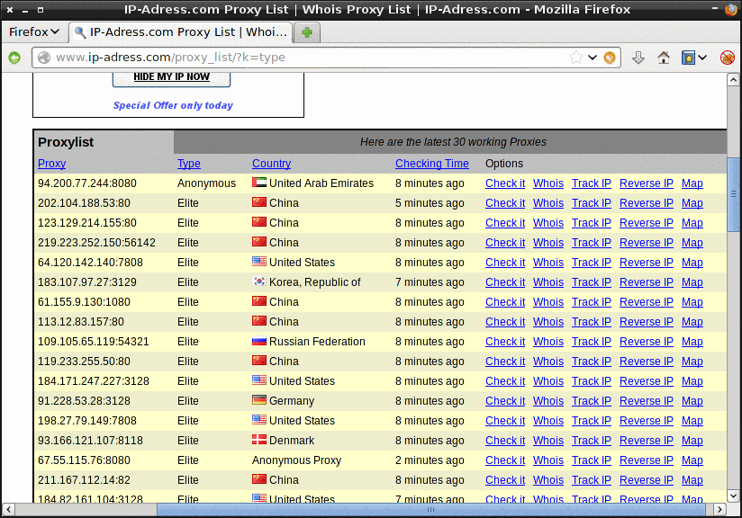](images/Listado-de-servidores-Proxy.png)

Cada una de las lineas que vemos en la captura de pantalla muestra un servidor proxy distinto. Ahora tenemos que elegir uno de los servidores que se muestran en el listado. En lo primero que nos tenemos que fijar en en el tipo de servidor. En la captura de pantalla vemos que hay de 2 tipos. **Anónimo y Elite**. También existe un tercer tipo que es el **transparente**. De entre los 3 tipos solo aconsejo utilizar los Anónimos y los Elite. Los motivos son los siguientes:

_**Proxy Transparante**_: A toda costa hay que **evitar este tipo de proxy**. El principal motivo de conectarse a través de un proxy es conseguir ser anónimo y con los proxy transparentes no conseguiremos nuestro objetivo en absoluto. No lo conseguiremos porqué este tipo de proxy proporciona la totalidad de datos mencionados en el apartado anterior al servidor web al cual nos conectamos. Por lo tanto nuestra IP será visible en todo momento.

_**Proxy Anónimo**_: Este tipo de proxy ya es más **recomendable**. Si queremos usar un proxy solo para navegar es más que suficiente para nosotros. Este tipo de proxy ya no revela nuestra ip real ya que esta enmascarando la variable http\_x\_forwarded\_for. Por lo tanto con el uso de este proxy ya podemos afirmar que somos anónimos. Este tipo de proxy tiene el inconveniente que el servidor web tendrá la capacidad de saber que nos estamos conectando a través de un servidor proxy pero no podrá saber nunca nuestra ip.

_**Proxy Elite o altamente anónimo**_: Este tipo de proxy al igual que que el proxy anónimo está enmascarando la variable http\_x\_forwarded\_for, pero además también otras variables como pueden ser la http\_via y http\_proxy\_connection, etc. Por lo tanto estaremos falseando la totalidad de información que entregamos al servidor web y además no podrán detectar que nos estamos conectando a través de un servidor proxy. A priori el servidor proxy tampoco guardará un registro de las IP conectadas al servidor proxy.

### Paso 3: Elegir el servidor Proxy al que nos vamos a conectar

Una vez vistos los tipos de servidor proxy existente ahora debemos elegir al que nos conectaremos. Nos conectaremos al primer proxy de la lista. Se trata de un proxy ubicado en los Emiratos árabes y es de tipo anónimo. Como se puede ver en la captura de pantalla tiene un campo en que se indica una IP y un puerto que son: **94.200.77.244 y 8080**. Estos son los dos únicos datos necesarios para conectarnos al servidor.

###### Nota: Hay páginas web que indican si el proxy ofrece un servicio de cifrado SSL. Por norma general los servidores proxy no acostumbran a ofrecer un servicio de cifrado SSL.

###### Nota: Por lo tanto la conclusión es que elijáis servidores del tipo anónimo o élite. Si además estos servidores ofrecen un servicio de cifrado SSL mejor. Una vez conectados al servidor proxy podremos analizar si la velocidad que ofrecen es aceptable o no.

### Paso 4: Configurar el navegador para conectarse al servidor Proxy

En este apartado veremos como configurar el navegador para conectarnos al servidor Proxy. En el ejemplo usamos Firefox. Lo mas aconsejable para realizar la conexión es usar el complemento Foxy Proxy Standard. Para instalar Foxy Proxy standard abrimos al navegador. Una vez vez abierto el navegador como podéis ver en la captura de pantalla vamos al menú de complementos.

[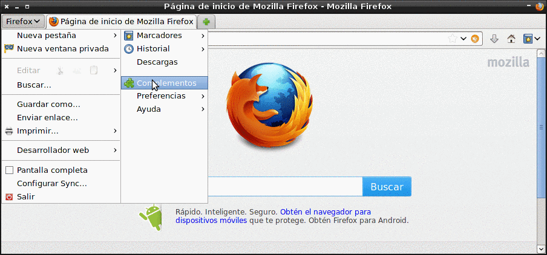](images/Instalar-Foxy-Proxy-1.png)

Seguidamente se abrirá una pestaña. En el cuadro de búsqueda tal y como podéis ver la captura de pantalla tecleamos foxyproxy y tecleamos Enter:

[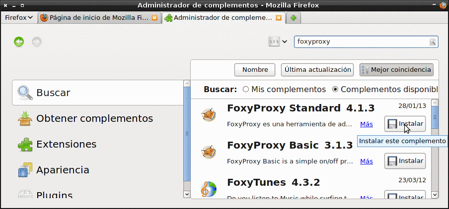](images/Instalar-Foxy-Proxy-2.png)

Una vez terminada la búsqueda solo tenemos que apretar el botón instalar de la extensión **FoxyProxy Standard** 4.1.3. Empezará el proceso de instalación y una vez terminado tendremos que reiniciar el navegador.

Una vez abierto el navegador veremos un pequeño icono. Le damos un click tal y como se puede ver en la siguiente captura:

[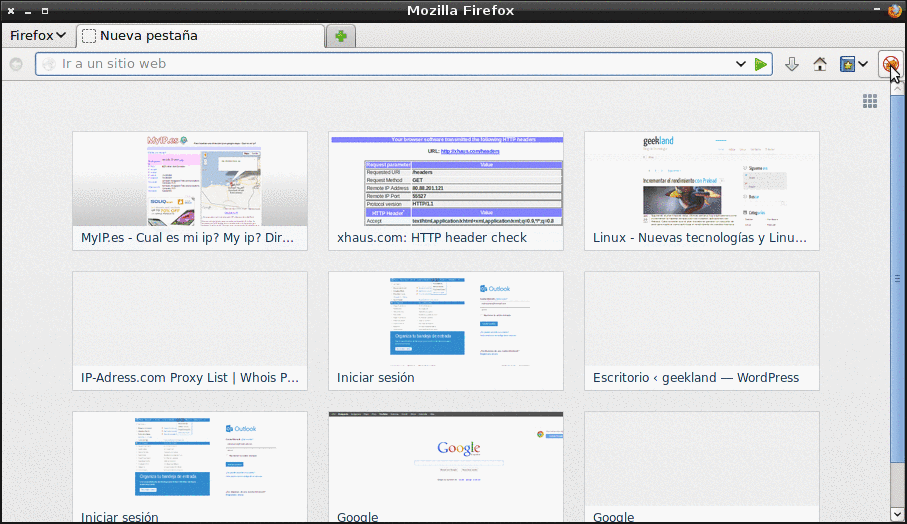](images/Configurar-Proxy-1.png)

Una vez le hayamos dado click al botón del complemento instalado se abrirá la siguiente ventana:

[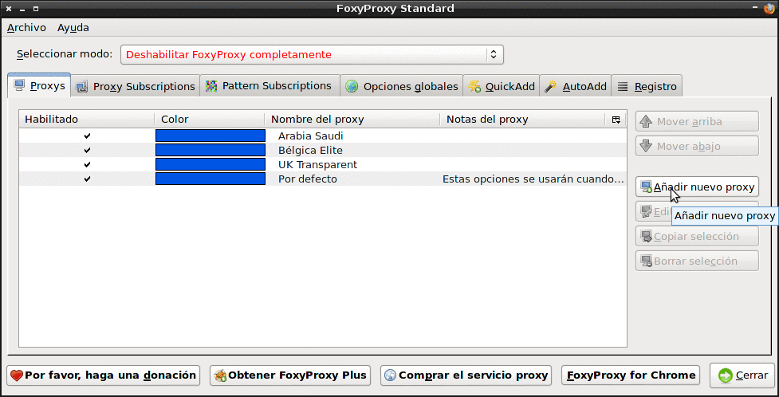](images/Configurar-Proxy-2.png)

Ahora tenemos que apretar el botón añadir nuevo proxy. Una vez apretado el botón aparecerá la siguiente pantalla:

[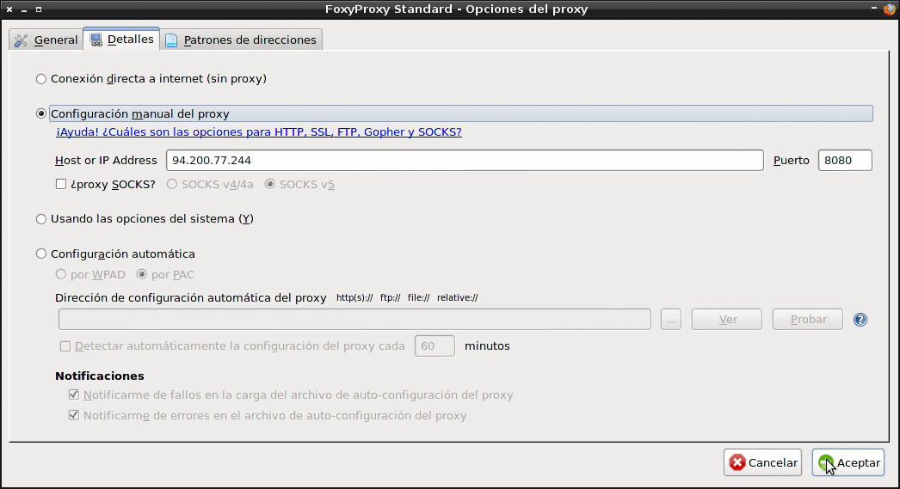](images/Configurar-Proxy-3.png)

En el paso 3 hemos decido que queríamos conectarnos al servidor proxy de Emiratos Árabos de tipo anónimo con **IP 94.200.77.244 a través del servidor 8080**. Por lo tanto lo único que tenemos que hacer es **rellenar el campo Host or IP Address y Puerto** tal y como se muestra en la captura de pantalla. Una vez realizado apretamos el botón de aceptar. Justo al darle aceptar aparecerá otra ventana al cual tenemos que darle otra vez aceptar. En estos momento ya tenemos configurado nuestro proxy.

Ahora para activar la conexión arrancamos el navegador y tal como se puede ver en la captura de pantalla y damos un click encima del botón del complemento que hemos instalado:

Una vez accionado el botón aparecerá la siguiente pantalla:

[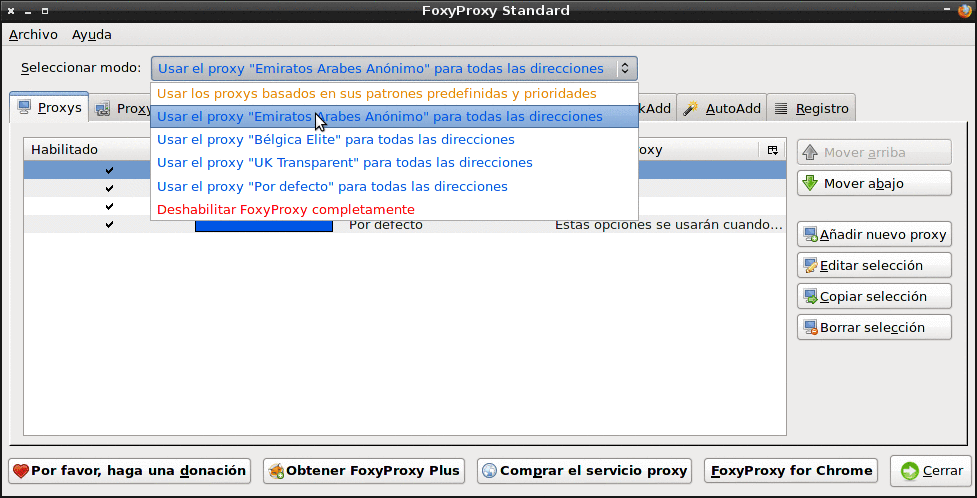](images/conexion-al-servidor.png)

Tal y como veis en la captura de pantalla vamos a **seleccionar modo**. En seleccionar modo elegimos el proxy que acabamos de configurar que es el de los Emiratos Árabes. Una vez seleccionado apretamos el botón cerrar. En estos momentos ya estamos conectados a través del servidor proxy.

Si queremos desactivar la conexión a través del servidor proxy es muy fácil. Solamente tenemos que ir al campo **seleccionar el modo** y elegir la opción **Deshabilitar FoxyProxy completamente**. Simplemente haciendo esto nuestra conexión volverá a ser la misma que teníamos anteriormente.

###### Nota: En Chrome también existe la misma extensión y los pasos a seguir son equivalentes. Existen otras extensiones que realizan exactamente la misma función. En caso que no queráis instalar extensiones también existe la posibilidad de configurar manualmente el navegador.

###### Nota: En el caso conectarse a menudo a través de un proxy es bueno tener varios servidores proxy configurados. Si solo tenemos uno activado puede ser que en el momento que queramos usarlo no esté disponible o ya no exista. También hay servidores que ofrecerán mayor velocidad que otros. En definitiva es bueno tener varios por si uno falla.

## COMPROBAR QUE EL SERVIDOR PROXY FUNCIONA CORRECTAMENTE

Una vez conectados al proxy tenemos que comprobar si funciona y el nivel de seguridad que nos está ofreciendo. Es bueno hacerlo o ya que a veces los servidores dicen que son anónimos y en realidad son transparentes.

Para saber si el proxy funciona solamente tenéis que ingresar una dirección en el navegador y ver si nos podemos conectar. En el caso de no ir bien tendremos que probar otro servidor proxy. No todos los servidores proxy funcionan. Para configurar otro servidor proxy tendremos que seguir los pasos 2, 3 y 4 de nuevo.

Para poder testear el nivel de protección que ofrece el proxy una vez nos hemos conectando solamente tenemos que acceder a las páginas que nos habíamos conectado anteriormente.

[http://myip.es](http://myip.es "Myip.es") [http://xhaus.com/headers](http://xhaus.com/headers "xhaus")

Ahora los resultados son los siguientes:

[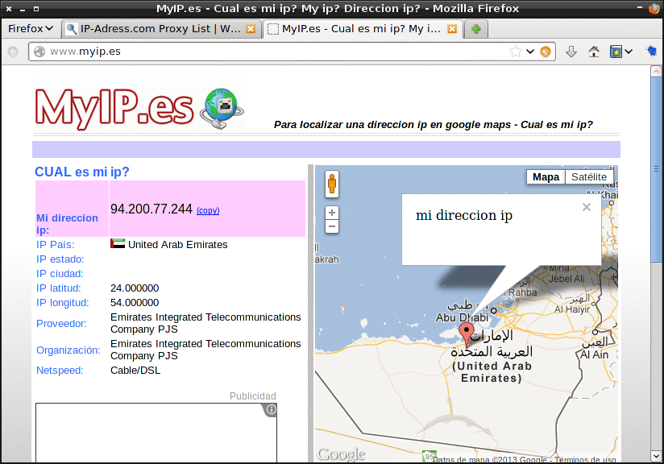](images/Servicio-Myip-2.png)

[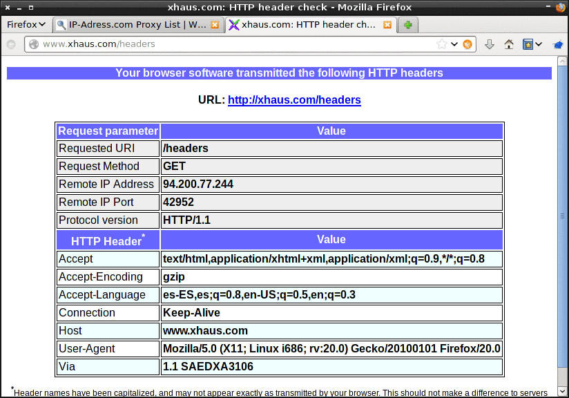](images/Servicio-xhaus-2.png)

Como se puede ver en las capturas de pantalla la IP esta completamente oculta. Ahora mi IP y mi ubicación pertenecen a los Emiratos Árabes. En la última captura de pantalla se puede ver que aparece la variable Via. Esto es un indicativo que los sitios donde me conecto pueden detectar que estoy conectando a través de un servidor proxy.

Otras páginas a las que nos podemos conectar para realizar comprobaciones son las siguientes:

[http://checker.samair.ru/](http://checker.samair.ru/ "Comprobación Funcionamiento del Servidor proxy") [http://www.internautas.org/w-testproxy.php](http://www.internautas.org/w-testproxy.php "Comprobación del funcionamiento de un servidor Proxy")

## LIMITACIONES DE LOS SERVIDORES PROXY

La principal limitación de los servidores proxy es que nos permiten ser anónimo pero no garantizan nuestra privacidad. La totalidad de tráfico que generamos viajará por la red sin cifrar. Por lo tanto nuestro tráfico es susceptible de ser esnifado. No obstante quien esnife nuestro tráfico no podrá saber nuestra IP. Una opción para este problema es pagar o buscar un servidor proxy que ofrezca un servicio de cifrado SSL. Otra opción podría ser conectarse a través de un servidor VPN.

Otros problemas que puede generar la conexión a través de un servidor proxy son los siguientes:

1. **Hay que ir muy en cuenta quien está detrás de un servidor proxy o un servidor VPN**. Si no son servicios confiables pueden registrar la totalidad de nuestro tráfico, registrar nuestras contraseñas, robar nuestros número de cuentas bancarias, inyectarnos código malicioso para pasar a formar parte de una Botnet. etc.
2. **La Navegación es más lenta** que en el caso que usemos un servidor VPN.
3. **Cada aplicación se tiene que configuración específicamente para que se conecte a través del servidor proxy**. Por lo tanto si seguimos las indicaciones del post solo se obtendrá una navegación anónima. En el caso que realicemos una descarga P2P o chateemos no seremos anónimo

Alternativas que tenemos a los servidores proxy son las servidores VPN y la red Tor. En el caso que precisen información de servidores VPN o de la red Tor pueden consultar los siguientes enlances:

[https://geeklandlinux.github.io/posts/conectarse-a-un-servidor-vpn-gratis/]()

[https://geeklandlinux.github.io/posts/acceder-a-la-deep-web/]()

[https://geeklandlinux.github.io/posts/instalar-tails-para-ser-anonimo/]()

## FUENTES

El contenido de este post se ha generado a raíz de un podcast que escuche. Se llama Reality cracking y su Autor es Julio Serrano (@mhyst). Seguidamente les dejo el feed de Ivoox para las personas que quieran seguir este podcast.

[http://www.ivoox.com/podcast-reality-cracking\_fg\_f159955\_filtro\_1.xml](http://www.ivoox.com/podcast-reality-cracking_fg_f159955_filtro_1.xml "Feed Podcast Reality Cracking")

Para quien quiera visitar el blog de @mhyst les dejo su dirección.

[https://logicademhyst.blogspot.com/](https://logicademhyst.blogspot.com/ "Blog de @mhyst")
