En el siguiente post comentaremos como conectarse a un servidor VPN externo gratuito, pero antes de ir al grano creo que es altamente recomendable explicar las ventajas que nos proporcionará VPN así como también su funcionamiento. Lo primero que deberíamos saber lógicamente es que es una red VPN.<!--more-->

## ¿QUÉ ES UNA RED VPN?

Una red VPN es una red privada a la que nos podemos conectar desde cualquier ubicación geográfica. El medio utilizado para realizar esta conexión entre la red Vpn y nuestro equipo es internet. De esta forma estamos extendiendo geográficamente la red privada a la que nos conectamos ya que multitud de equipos se pondrán conectar a ella independientemente de donde se encuentren ubicados los equipos.

Una vez estamos conectados al servidor Vpn nuestro ordenador pasará a formar parte de la red privada virtual pudiendo comunicarnos con ella como si se tratará de una red local y pudiendo acceder a los servicios e información de la red a la que nos conectamos.

Así por ejemplo en el caso que nosotros estemos en casa y necesitamos conectarnos a la red local de nuestra empresa lo podemos realizar de forma segura. El mecanismo se describe el siguiente diagrama:

[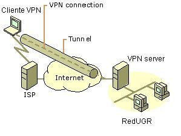](images/Ejemplo-conexion.jpg)

En el caso de disponer de los permisos, autorizaciones y autentificaciones necesarias se generará un túnel entre el cliente VPN, que somos nosotros, y el Servidor VPN que es nuestra empresa. Una vez establecido el túnel ya podremos realizar el trabajo en cuestión siempre y cuando dispongamos de los permisos necesarios. Además tendremos la tranquilidad que la totalidad de tráfico que se genera entre el cliente VPN y el Servidor VPN viajará por el túnel de forma cifrada y por lo tanto en teoría nadie podría tener acceso a ella.

## USOS Y VENTAJAS AL CONECTARNOS A LA RED A TRAVES DE UN SERVIDOR VPN

###### Nota: Cabe considerar que el uso principal de VPN es laboral y es el que justamente acabamos de describir en el apartado anterior. No obstante en este post no nos queremos focalizarnos en este uso. Nos focalizaremos en las ventajas que un usuario doméstico puede obtener en el caso que se conecte a la red a través de un servidor VPN externo o uno que se pueda montar en su casa. Las ventajas se pueden resumir en las siguientes:

1. Hay ciertos países, como por ejemplo china, en que no podemos acceder a servicios como por ejemplo facebook o youtube. Si nuestra conexión a Internet se establece mediante un servidor VPN ubicado en el exterior del país podremos acceder a estos servicios. Por la misma regla de tres en el caso de vivir en España podríamos tener acceso a servicios como Netflix o Pandora que solo operan en Estados unidos o Canadá.
2. Mantener el anonimato en la totalidad de operaciones que realizamos en Internet. Con una VPN nuestra IP externa siempre estará oculta y la totalidad de tráfico que generamos viajará de forma cifrada con una única excepción. El tráfico que generamos entre servidor VPN y la conexión final no estará encriptado y por lo tanto es susceptible de ser esnifado.
3. Saltarse las restricciones de los  servidores proxy que acostumbran existir  en muchas empresas para que no nos conectemos a nuestro correo, a youtube, facebook, etc.
4. El anonimato que conseguimos con VPN es total. Por ejemplo con un servidor proxy solamente podremos conseguir navegar anonimamente pero con Vpn además podremos además enviar correos, chatear, etc.
5. Evitar ser rastreado en la mayoría de página web que entramos y por lo tanto evitar que obtengan información sobre nuestro comportamiento online.
6. En cierto modo y gracias al anonimato que proporciona potencia la libertad de expresión.
7. La velocidad de navegación con VPN es mucho mayor que si por ejemplo nos conectamos a la red Tor o cualquier servidor Proxy existente.
8. Para proteger nuestra privacidad en el caso que nos conectemos a una red pública o Hotspot.

## ¿POR QUÉ A TRAVÉS DE UNA RED VPN SOMOS ANÓNIMOS?

[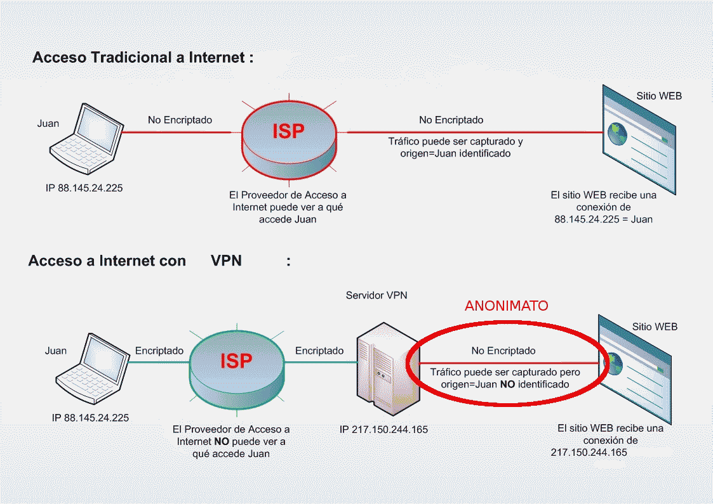](images/tuvpn-funcionamiento.png)

Como se puede ver en el esquema en el caso de una conexión a Internet de forma convencional nuestra ip siempre está al descubierto. Además nuestro Internet Service provider puede fácilmente saber lo que estamos realizando en todo momento.

En el caso de acceder a internet mediante VPN se creará un túnel ente el servidor VPN y nuestro equipo. La totalidad de información viajará por el interior de este túnel de forma cifrada y por lo tanto nuestro proveedor de Internet nunca podrá tener acceso a nuestro contenido. Además una vez conectado al servidor VPN estaremos camuflando nuestra identidad por la cual cosa nadie nos debería poder identificar.

###### Nota: No obstante hay que tener muy en cuenta que ciertos servicios VPN, y más aquellos que son gratuitos, pueden guardar logs de nuestra actividad. Si fuera este el caso nuestro anonimato quedaría desprotegido. Frente a esta tesitura lo mejor es que nosotros mismos montemos nuestro propio servidor VPN o pasar por caja y contratar un servicio fiable.

## ¿CÓMO CONECTARSE A UN SERVIDOR VPN?

Seguidamente detallo como poder establecer una conexión a Internet mediante un servicio VPN Gratuito. Si buscáis por la red encontrareis opciones alternativas a la que estoy presentando. Algunas de ellas de pago y algunas gratuitas. Como acabamos de detallar puede darse el caso que algunos servicios Vpn capturen logs de nuestra actividad y nos rastreen. Es lo que tiene lo gratuito.

Para establecer la conexión el primer paso a realizar es conectarnos a:

[http://www.vpnbook.com/freevpn](http://www.vpnbook.com/freevpn "vpnbook")

###### Nota: En la página web informa que no se van a guardar logs de nuestra actividad ni tampoco se intentará recopilación información. Los únicos logs que se guardarán es la IP de conexión y el tiempo de conexión. Estos logs a los 3 días se borrarán y por lo tanto aunque las autoridades pidan los logs estos no deberían existir.

###### Nota: Si buscáis por Internet fácilmente encontrareis proveedores vpn gratuitos al estilo de vpnbook.com

Una vez abierta la página de vpnbook veremos la información que se puede ver en la siguiente captura de pantalla:

[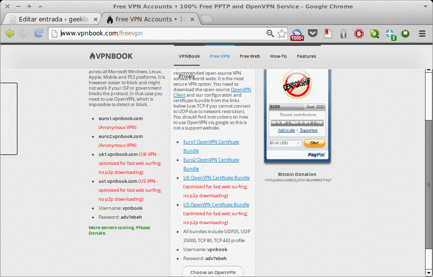](images/Vpnbook-web.png)

Lo primero que tenemos que realizar es anotar el username y password que figuran en la columna central. Seguidamente debemos elegir el servidor el cual nos vamos a conectar. Actualmente la página de vpnbook ofrece 4 servidores. Lo servidores ofrecidos son los siguientes:

> 1. **Euro1 OpenVPN Certificate Bundle**
> 2. **Euro2 OpenVPN Certificate Bundle**
> 3. **UK OpenVPN Certificate Bundle**
> 4. **US OpenVPN Certificate Bundle**

En mi caso elegiré el servidor  US OpenVPN Certificate Bundle. Una vez elegido nos descargaremos los archivos de configuración del VPN. Para descargar los archivos de configuración damos click encima de US OpenVPN Certificate Bundle  y se descargará un archivo Zip. Una vez descargado el archivo Zip podéis crear una carpeta en vuestra home que se llame OpenVPN. Dentro de la carpeta creada guardáis el zip y lo descomprimís obteniendo un resultado parecido al siguiente:

[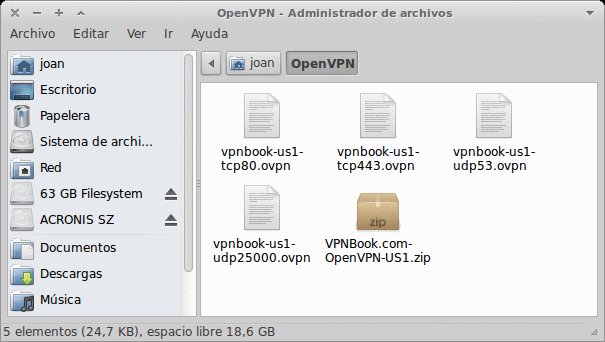](images/Carpeta-Open-VPN.png)

El siguiente paso es generar el certificado de conexión. Para generar el certificado de conexión CA se puede hacer de la siguiente forma. Primero copiamos cualquiera de los archivos .opvn y lo pegamos. Como se puede ver en la captura de pantalla la situación actual es la siguiente:

[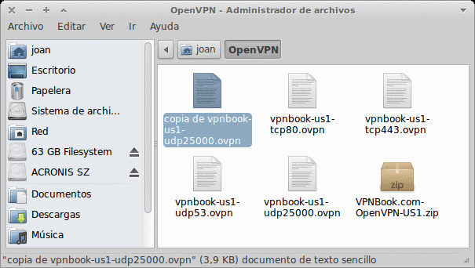](images/Certificado-CA.png)

Seguidamente el archivo que acabamos de copia lo renombramos. El nombre que le tenemos que poner es el siguiente:

> ```
> vpnbook-ca.crt
> ```

Una vez renombrado el archivo tenemos que aseguramos de tener instalados los siguientes paquetes en nuestro ordenador. Para ello abrimos una terminal y tecleamos:

###### Nota: Solo hay que instalar estos paquetes en el caso que estemos usando gnome network manager. En el caso de estar usando Wicd los paquetes a instalar serán otros diferentes a los que a continuación cito:

> ```
> sudo apt-get install libpkcs11-helper1 network-manager-openvpn openvpn libpkcs11-helper1 openvpn resolvconf network-manager-pptp pptp-linux network-manager-openvpn-gnome network-manager-pptp-gnome
> ```

###### Nota: La gran mayoría de vosotros pueden omitir este paso ya que prácticamente la totalidad de distros linux instalan estos paquetes automáticamente cuando instalamos el Sistema operativo. Solamente tendrán que instalar los paquetes aquellos que hayan instalado su sistema operativo a partir de una netinstall,

Seguidamente vamos al icono de red de nuestro escritorio. Le damos un click con el botón derecho. Elegimos la opción Conexiones VPN y seguidamente elegimos la opción Configurar VPN.

[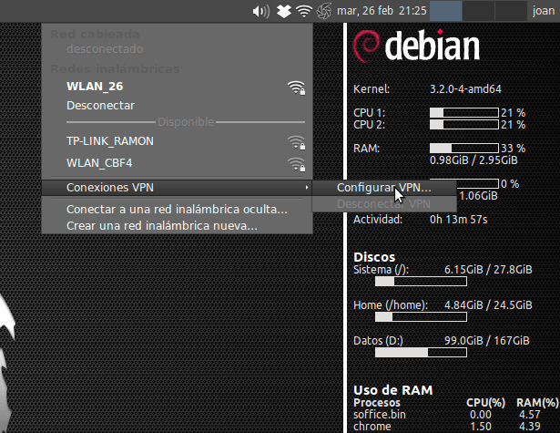](images/vpn3.png)

Seguidamente aparecerá la siguiente pantalla. Le damos click a la pestaña importar.

[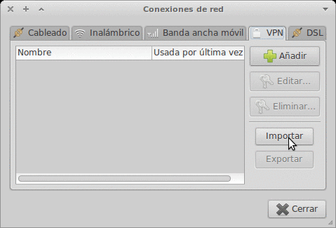](images/vpn4.png)

Al darle click a la pestaña importar se abrirá el navegador de archivos. Seguidamente tenemos que seleccionar el fichero de configuración del servicio VPN y clicar al botón añadir. En función del fichero de configuración que elegimos nos vamos a conectar a través del puerto **TCP80, TCP443, UDP53** o **UDP25000**. Recomiendo usar los ficheros que tienen la nomenclatura **TCP80** o **TCP443** ya que son los más comunes y los que menos problemas de conexión suelen generar. Como podéis ver en la captura de pantalla en mi caso elijo el fichero vpnbook-us1-tcp443.ovpn y presiono en el botón abrir:

[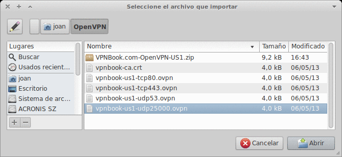](images/Configurar-VPN-Puerto.png)

Aparecerá otra pantalla. Podemos observarla a continuación:

[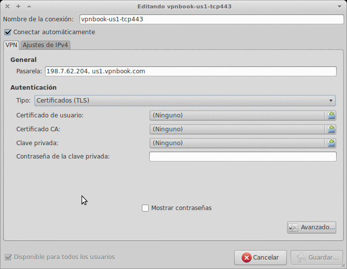](images/VPN-Sin-configurar.png)

En esta pantalla lo primero que tenemos que hacer es cambiar el tipo de Autentificación. Hay que cambiarlo de Certificado (TLS) a Contraseña. Seguidamente hay que anotar el usuario y la contraseña que anotamos en el principio de este apartado del post. Para finalizar en el campo certificado CA tenemos que clicar sobre el e ir a buscar el archivo **vpnbook-ca.crt** que habíamos creado anteriormente.

Si hemos seguido los pasos correctamente el resultado obtenido tiene que ser el siguiente:

[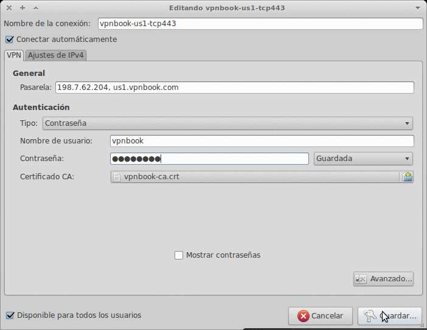](images/VPN-Configurado.png)  

Para finalizar apretamos al botón guardar.

En principio la totalidad de pasos ya han finalizado. Solamente falta conectarnos a la red VPN. Para conectarnos vamos al icono del gestor de redes de nuestro escritorio. Click derecho con el mouse, Conexiones VPN y finalmente le damos click a la red VPN que acabamos de configurar.

## [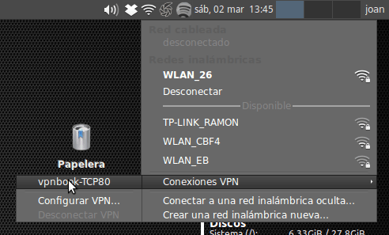](images/Conectar-VPNa.png)

Dentro de pocos segundos como se puede ver en la imagen la conexión se habrá establecido y podremos navegar disponiendo de la totalidad de ventajas que se detallan en este post.

[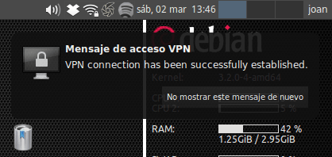](images/Conexion-establecidaa.png)

###### Nota: En el caso de no poderse establecer la conexión hay que mirar que los puertos, TCP80, TCP443, UDP53 o UDP25000 estén debidamente abiertos en nuestro firewall. También tenéis que tener en cuenta que ciertos proveedores de Internet restringen y capan funciones. En el caso que esto no funcione podemos entrar en la configuración de nuestro Router y activar UPnP. No obstante los puertos TCP80 o TCP443, bajo mi punto de vista, no debería ofrecer problemas a nadie. 

###### Nota: Con el tiempo puede ser que vpnbook, o cualquier otro servicio vpn, os deje de funcionar. Esto seguramente es debido a que las páginas que ofrecen este tipo de servicio han cambiado el password de acceso. Si es este vuestro caso tan solo tenéis que entrar de nuevo en la página web y descargar los certificados y ficheros de configuración de nuevo y tomar nota del nuevo password. Reemplazáis los certificados, ponéis el nuevo password y con total seguridad el servicio VPN volverá a funcionar.

## OTRAS OPCIONES PARA CONSEGUIR EL ANONIMATO EN LA RED

Existen muchos otros servicios para ocultar la identidad  en la red como por ejemplo la red Tor, servidores proxy, etc. En futuros post se comentaran los distintos sistemas y se intentará analizar las ventajas e inconvenientes que nos ofrecen cada uno de los sistemas de los sistemas descritos. En el caso de estar interesado en ser anónimos pueden consultar los siguientes links:

[https://geeklandlinux.github.io/posts/acceder-a-la-deep-web/]()

[https://geeklandlinux.github.io/posts/conectarse-a-un-servidor-proxy/]()

[https://geeklandlinux.github.io/posts/instalar-tails-para-ser-anonimo/]()

## ¿DÓNDE PODEMOS ENCONTRAR SERVICIOS GRATUITOS SIMILARES A VPNBOOK?

Seguidamente les dejo una serie de links donde podrán encontrar servicios VPN similares a vpnbook.  Vpnbook funciona muy bien pero si quieren buscar otras alternativas o tener IP de distintos países podéis consultar:

[http://www.hackplayers.com/2013/01/25-servicios-vpn-gratuitos.html](http://www.hackplayers.com/2013/01/25-servicios-vpn-gratuitos.html)

[http://elinformatico.eu/9-servicios-vpn-gratuitos-20120210](http://elinformatico.eu/9-servicios-vpn-gratuitos-20120210)

[http://cyberghostvpn.com](http://cyberghostvpn.com "VPN Cyberghost")

[http://hotspotshield.com](http://hotspotshield.com "VPN Hotspotshield")

[http://www.securitykiss.com](http://www.securitykiss.com "Vpn Securitykiss")

[http://proxpn.com](http://proxpn.com "VPN Proxpn")

Y finalmente el último enlace que merece una mención especial:

[http://www.vpngate.net/en/](http://www.vpngate.net/en/ "Redes VPN Universitarias")

El enlace me lo facilito Manuel P. y en el podréis encontrar centenares de redes VPN universitarias de distintos países  He realizado un par de pruebas con un servidor de Nueza Zelanda y otro de Estados Unidos y os puedo decir que funcionan de maravilla.

## ¿QUÉ PASA SI NO ME FIO DE ESTOS SERVICIOS?

Es lógico y licito pensar que detrás de todo servicio gratuito hay alguien que puede estar intentando sacar provecho de la información que puede capturar. Por lo tanto para la gente que no se fíe de este tipo de servicios siempre puede montar su propio servidor VPN en su casa. Para ello les dejo 2 enlaces que si siguen al pie de la letra no deberían tener problemas:

[https://geeklandlinux.github.io/posts/crear-un-servidor-vpn-pptp/]()

[https://geeklandlinux.github.io/posts/crear-y-configurar-servidor-openvpn/]()

Para finalizar el post comentar que en la página web [http://www.vpnbook.com/](http://www.vpnbook.com/ "conectarse a VPN") pueden realizar sus donaciones para poder mantener este servicio activo.
