En este post instalaremos OpenSSH en nuestro iPad o iPhone y seguidamente veremos los pasos a seguir para conectarse a nuestro iPad o iPhone usando SSH.<!--more-->

## VENTAJAS DE USAR SSH EN UN IPAD O UN IPHONE

Las ventajas que tendremos después de tener instalado SSH en nuestro sistema operativo iOS son las siguientes:

1. Nos ayuda a **prescindir de iTunes**. iTunes es un software que nunca me ha gustado y es realmente una pena que Apple te fuerce a realizar ciertas tareas a través de iTunes. ITunes es un jardín cerrado y su único fin es limitar a sus usuarios y vender.
2. Podremos **pasar información del ordenador al iPad o del iPad al ordenador** sin ningún tipo de problema y sin ningún tipo de restricción. Además el tráfico entre ambos dispositivos estará cifrado y nádie lo podrá interceptar.
3. Podremos **conectar el iPad o el iPhone a cualquier ordenador o teléfono sin necesidad de usar ningún cable**. El único requisito es que ambos equipos estén en la misma red Wifi.

## REQUISITOS PREVIOS

Los requisitos básicos que tenemos que cumplir para poder seguir este tutorial son los siguientes:

1. Disponer de un iPad, un iPhone o un iPod touch con el Jailbreak realizado satisfactoriamente.
2. En el momento de conectarnos a nuestro dispositivo iOS con OpenSSH, los dispositivos que actúan como servidor o como cliente deben estar conectados a la misma red local. En el caso que quisiéramos hacerlo fuera de nuestra red local deberíamos disponer de una IP pública fija o usar un servicio de redireccionamiento DNS.

## CONFIGURAR UNA IP ESTÁTICA

Para facilitar la conexión al iPad o al iPhone mediante SSH es recomendable disponer de una IP fija ya que de esta forma nuestro dispositivo siempre estará identificado dentro de nuestra red local.

Para disponer de una IP fija lo único que tenemos que hacer es seguir los pasos que se detallan en el siguiente post:

[https://geekland.eu/asignar-una-ip-estatica-en-el-iphone-o-en-el-ipad/]()

Si siguen al pie de la letra las instrucciones mencionadas en el post, nuestro dispositivo con iOS dispondrá de una IP estática que será la **198.168.1.18**.

## INSTALAR OPENSSH EN EL IPAD

Una vez disponemos de una IP fija ya podemos instalar OpenSSH.

Para instalar OpenSSH tenemos que acceder a Cydia y buscar el paquete **OpenSSH**.

[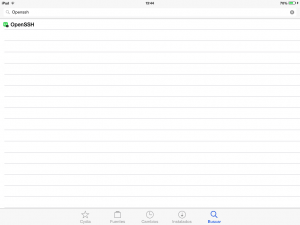](images/Buscar-OpeSSH-en-Cydia.png)

Una vez encontrado el paquete tan solo tenemos que presionar el botón **Instalar**.

[](images/App-OpenSSH-en-iOS.png)

Seguidamente aparecerá una ventana parecida a la siguiente en la que tendremos que presionar el botón **Confirmar**.

[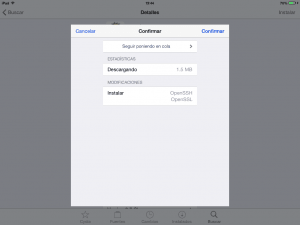](images/Instalar-OpenSSH-en-iOS.png)

Después de presionar el botón confirmar se instalará OpenSSH en nuestro dispositivo.

Una vez realizados todos los pasos ya estamos en condiciones de conectarnos vía SSH a nuestro dispositivo e introducir contenido a nuestro iPad o iPhone.

## CONECTARSE A UN IPHONE O IPAD MEDIANTE SSH EN LINUX

Si queremos conectarnos a nuestro iPad o iPhone usando Linux lo podemos realizar de forma sumamente fácil.

Abrimos nuestro gestor de archivos, que en mi caso es Thunar, y presionamos la combinación de teclas **Ctrl + L**.

Seguidamente aparecerá la ventana **Abrir ubicación** en la que tenemos que escribir la siguiente dirección:

> ```
> ssh://root@192.168.1.18
> ```

\[caption id="attachment\_7558" align="alignnone" width="345"\][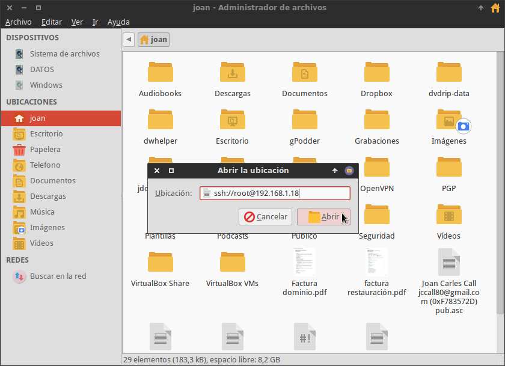](images/Comando-conexión-SSH-en-Linux.png) Muestra del comando para conectarse a nuestro iPad o iPhone\[/caption\]

El significado de los parámetros introducidos en la ventana Abrir la ubicación es el siguiente:

**ssh://**  : Es el comando a usar para indicar que queremos realizar una conexión a un servidor ssh.

**root@192.168.1.18**  : Es la dirección del dispositivo iOS al que nos queremos conectar. **root** es el nombre de usuario del dispositivo y **192.168.1.18** es la dirección IP del dispositivo. Como podéis observar la ip se trata de una IP interna. En caso de tener necesidad de acceder al dispositivo iOS desde fuera de la red local, deberemos sustituir la ip interna por la ip pública o por un dominio de redireccionamiento DNS.

Una vez introducida la dirección presionaremos el botón **Abrir** y aparecerá la siguiente ventana:

[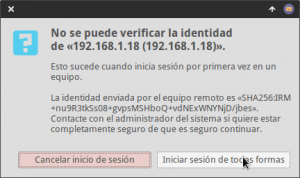](images/Verificar-la-identidad-del-servidor-SSH.png)

###### Nota: Esta ventana solo aparecerá la primera vez que nos conectemos al iPad o iPhone mediante SSH. El motivo que aparezca es para prevenir conectarnos a un dispositivo malicioso y de esta forma evitar ataques man in the middle.

Como estamos seguros que el dispositivo al que nos estamos conectando es a nuestro dispositivo presionamos el botón **iniciar sesión de todas formas**. Seguidamente aparecerá la siguiente ventana en la que deberemos introducir la contraseña de conexión:

[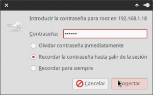](images/Contraseña-para-conectarse-al-servidor-SSH.png)

La contraseña de conexión por defecto es **alpine**. Por lo tanto escribimos **alpine** y presionamos el botón **Conectar**.

Justo después de presionar el botón podremos ver el contenido de nuestro dispositivo iOS en nuestro navegador de archivos.

[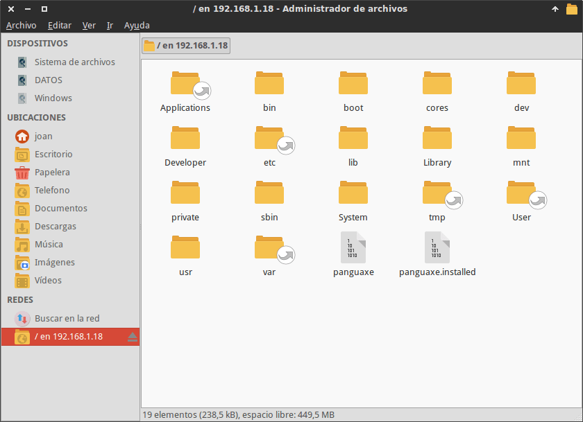](images/Conectado-a-nuestro-dispositivo-iOS.png)

En estos momentos de forma muy fácil y muy sencilla podemos transferir archivos de nuestro ordenador a nuestro dispositivo iOS o viceversa.

Con un simple copiar y pegar en el gestor de archivos de nuestro ordenador podemos pasar películas, música o imágenes de nuestro ordenador a nuestro dispositivo iOS sin necesidad de usar iTunes.

## CONECTARSE A UN IPHONE O IPAD EN LINUX, MAC OS O WINDOWS

Existe una solución para conectarnos a nuestro dispositivo con iOS válida para la totalidad de sistemas operativos de escritorio. Esta opción es usar el software Filezilla.

### Instrucciones para instalar Filezilla

Para instalar Filezilla en Linux tenemos que abrir una terminal y ejecutar el siguiente comando:

> ```
> sudo apt-get install filezilla
> ```

Después de ejecutar el comando el programa se instalará sin ningún tipo de problema.

**En el caso de usar Windows** pueden descargar el programa desde este [enlace](http://filehippo.com/es/download_filezilla/tech/ "Link para descargar Filezilla en Windows"). Una vez descargado el ejecutable tan solo tienen que instalarlo tal y como lo hacen normalmente.

**Si usan Mac OS** pueden descargar el programa desde este [enlace](https://filezilla-project.org/download.php?show_all=1 "Link para descargar Filezilla en Mac OS"). Una vez descargado el ejecutable tan solo tienen que instalarlo tal y como lo hacen habitualmente.

###### Nota: Para Windows existen versiones portables del Software Filezilla. Si buscan en Google las encontrarán sin problema alguno.

###### Nota: El proceso de instalación en Linux es válidos para Debian y para la totalidad de distribuciones derivadas de Debian.

### Conectarnos a nuestro dispositivo iOS con Filezilla

Abrimos Filezilla. Una vez abierto presionamos la combinación de teclas **Ctrl+S** para acceder al gestor de sitios.

En el gestor de sitios presionamos el botón **Nuevo sitio**.

[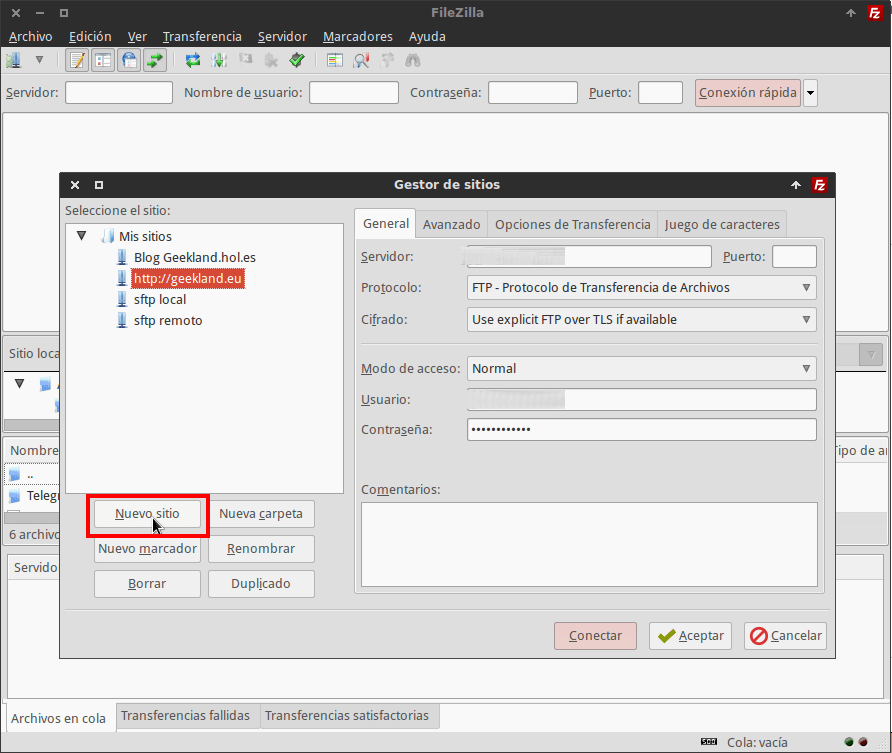](images/Crear-Nuevo-Sitio-en-Filezilla.png)

Seguidamente tenemos que dar un nombre al sitio nuevo que estamos configurando. Tal y como se puede ver en la captura de pantalla, en mi caso he decidido llamar el nuevo sitio **iPad**.

[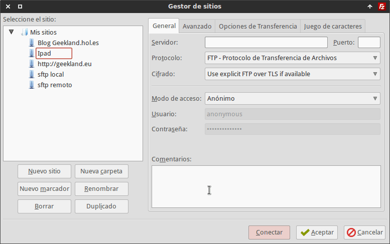](images/Nombre-Nuevo-sitio-Filezilla.png)

### Datos a introducir para conectarnos a nuestro iPhone o iPad

A continuación tenemos que rellenar los datos de conexión en la pestaña General. En mi caso los datos usados para realizar la conexión son los siguientes:

[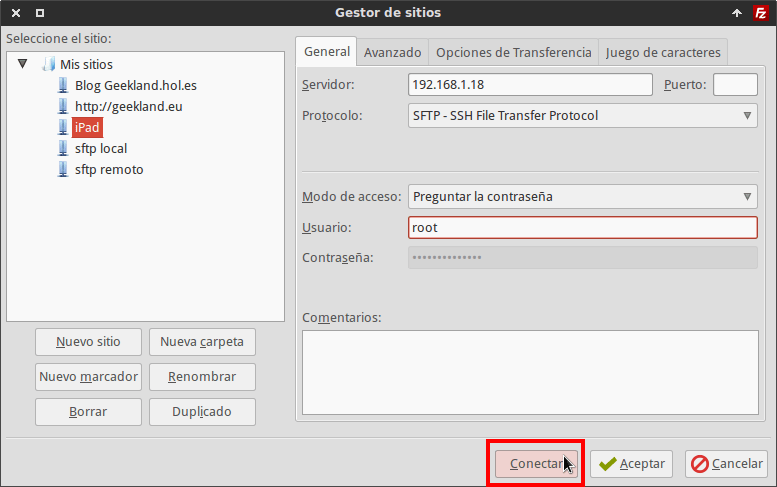](images/Datos-a-introducir-en-Filezilla.png)

**En el campo servidor** hay que introducir la dirección ip del dispositivo iOS que tiene instalado OpenSSH. Por lo tanto en nuestro caso deberemos introducir la ip **192.168.1.18** que es la ip estática que hemos configurado en apartados anteriores. En el caso que quisiera acceder al dispositivo estando ubicado fuera de mi red local, debería sustituir 192.168.1.18 por la ip pública o por un dominio de redireccionamiento DNS.

**En el campo Puerto** hay que introducir el puerto en el que el servidor SSH está escuchando las peticiones. En nuestro caso como estamos usando el puerto estándar lo dejamos en blanco.

**En el campo Protocolo** tenemos que seleccionar la opción **SFTP – SSH File transfer Protocol** porqué nos queremos conectar a un servidor SSH.

**En el campo Modo de acceso** aconsejo seleccionar la opción **Preguntar contraseña**. Si seleccionamos la opción preguntar contraseña, cada vez que nos conectemos al dispositivo iOS se nos preguntará la contraseña del usuario root.

**En el campo Usuario** tan solo tenemos que poner el nombre de usuario del dispositivo móvil en que hemos instalado OpenSSH. Por lo tanto en este caso el nombre de usuario es **root**.

### Introducción de la contraseña para conectarnos al iPhone o al iPad

Una vez rellenados los campos tan solo tenemos que presionar el botón **Conectar**. Justo en el momento de presionar el botón conectar aparecerá la siguiente ventana:

[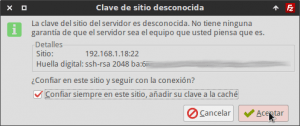](images/Confianza-del-servidor-SSH-al-que-nos-conectamos.png)

Esta ventana solo aparecerá la primera vez que nos conectemos al iPad o al iPhone. El motivo que aparezca este mensaje es prevenir conectarnos a un dispositivo malicioso y de esta forma evitar ataques man in the middle.

Como nuestra red local es segura y estamos seguros que el dispositivo al que nos estamos conectando es el nuestro presionamos el botón **Aceptar**.

Seguidamente aparecerá la siguiente ventana en la que deberemos introducir la contraseña de conexión que por defecto que es **alpine**:

[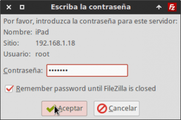](images/Contraeña-Filezilla-para-conectarnos-al-iPad.png)

Una vez introducida la contraseña presionamos el botón **Aceptar** y nos conectaremos a nuestro dispositivo sin ningún tipo de problema.

[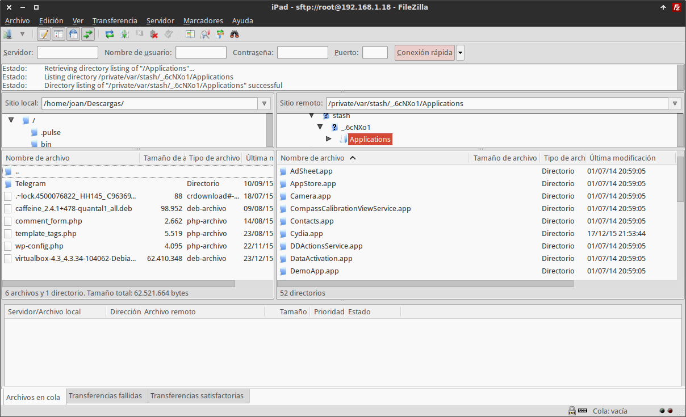](images/Conectados-a-un-dispositvo-iOS-con-Filezilla.png)

En estos momentos de forma muy fácil y muy sencilla podremos introducir lo que necesitemos dentro de nuestro iPad o iPhone. Podremos introducir películas, Música, Imágenes, Documentos de la suite ofimática que usamos, etc.

## CONEXIÓN A UN IPHONE O IPAD CON SSH USANDO ANDROID

En el caso que queramos conectarnos a nuestro dispositivo iOS desde Android lo podemos realizar mediante el software ES Explorer.

Para instalar ES explorer pueden consultar el siguiente enlace:

[https://geekland.eu/extraer-archivo-apk-una-app-instalada/]()

Una vez instalada la aplicación la abrimos y veremos la siguiente ventana:

[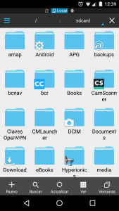](images/1-Accesso-a-opciones.png)

En la pantalla inicial posicionamos el dedo en el centro de la pantalla y lo deslizamos de izquierda a derecha. Justo después de deslizarlo aparecerá la siguiente pantalla en la que deberemos presionar encima del icono **Red**.

[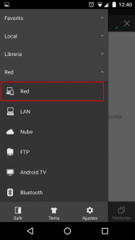](images/2-Opciones-de-Red.png)

Después de presionar el icono Red aparecerá la siguiente pantalla en la que deberemos presionar encima del icono **Nuevo**.

[](images/3-Nueva-conexión-de-Red.png)

Seguidamente aparecerá una ventana en la que debemos seleccionar la opción **sftp**.

[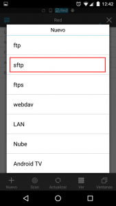](images/4-Conexión-del-tipo-sfpt.png)

### Parámetros a introducir para conectarnos a nuestro dispositivo iOS

Finalmente aparecerá la ventana para introducir los datos para conectarnos a nuestro iPhone, iPad o iPod touch.

[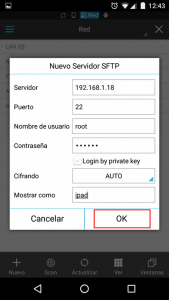](images/5-Campos-a-rellenar-para-conectarse.png)

**En el campo Servidor** hay que introducir la dirección ip del dispositivo iOS que tiene instalado OpenSSH. Por lo tanto en nuestro caso deberemos introducir la ip **192.168.1.18** que es la ip estática que hemos configurado en apartados anteriores. En el caso que quisiera acceder al dispositivo estando ubicado fuera de mi red local, debería sustituir 192.168.1.18 por la ip pública o por un dominio de redireccionamiento DNS.

**En el campo Puerto** hay que introducir el puerto en el que el servidor SSH está escuchando las peticiones. En nuestro caso como estamos usando el puerto estándar tenemos que introducir el puerto **22**.

**En el campo Nombre de usuario** tenemos que poner el nombre de usuario del dispositivo móvil en que hemos instalado OpenSSH. Por lo tanto en este caso el nombre de usuario es **root**.

**En el campo Contraseña** tenemos que escribir la contraseña de conexión al servidor SSH que por defecto es **alpine**.

Finalmente **en el campo Mostrar como** escribimos una palabra cualquiera para identificar la ubicación de red que estamos creando. En mi caso escribo **ipad**.

Una vez rellenados la totalidad de campos hay que presionar el botón **OK**.

Una vez presionado el botón OK, aparecerá una carpeta llamada iPad en las ubicaciones de red.

[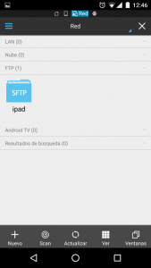](images/6-Ubicaciones-de-Red-Disponibles.png)

Para conectarnos vía SSH a nuestro iPad tan solo tenemos que clicar encima de la ubicación de red con nombre **ipad** que hemos creado.

Justo después de clicar en la ubicación de red podremos ver el contenido de nuestro dispositivo iOS en nuestro gestor de archivos.

[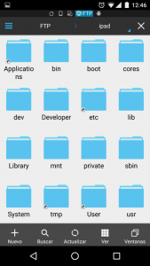](images/7-Conectado-al-iPad-mediante-Android.png)

En estos momentos, de forma muy fácil y muy sencilla, podemos transferir archivos de nuestro dispositivo Android a nuestro dispositivo iOS o viceversa.

## CAMBIAR LA CONTRASEÑA DE CONEXIÓN DE OPENSSH

En los distintos apartados de este tutorial hemos visto que la contraseña por defecto para conectarnos a un dispositivo con iOS a través de OpenSSH es alpine.

Es altamente recomendable cambiar esta contraseña ya que al ser la contraseña por defecto todo el mundo la conoce.

Para cambiar la contraseña tenemos que seguir los siguientes pasos:

### Instalar la App iOS Terminal

Primero tenemos que instalar la App iOS Terminal en nuestro dispositivo iOS. Para ello, tal y como se puede ver en la captura de pantalla, tenemos que acceder a Cydia y buscar el paquete **iOS Terminal**.

[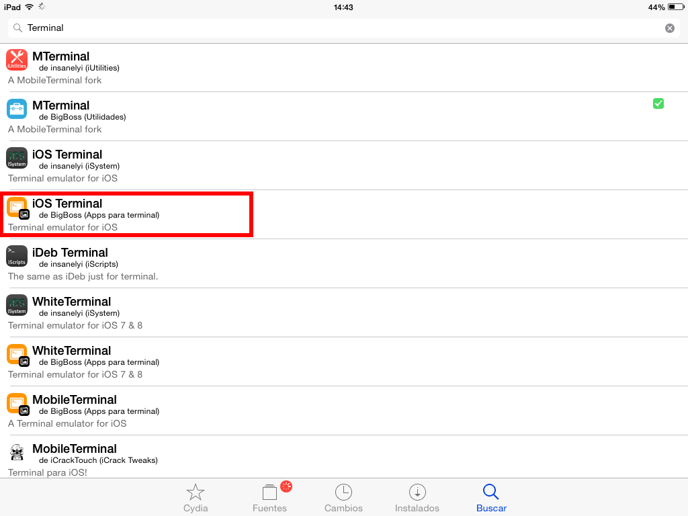](images/Buscar-la-App-iOS-terminal.png)

Una vez encontrado lo instalamos presionando encima del botón **Instalar**.

[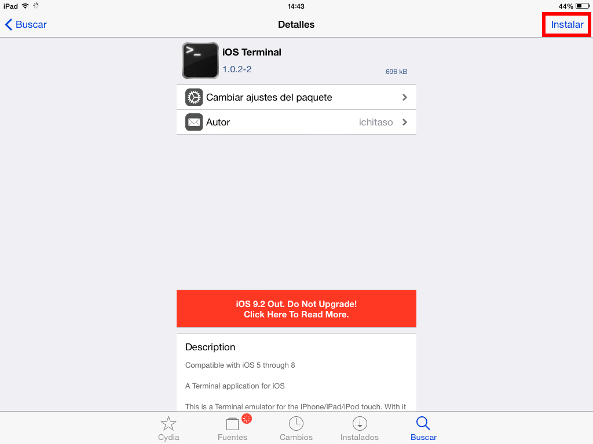](images/Instalar-la-App-iOS-terminal.png)

### Cambiar la contraseña del usuario mobile

Una vez instala la aplicación la abrimos, escribimos la palabra **passwd** y presionamos la tecla **INTRO**.

Justo en el momento de presionar INTRO nos preguntará que introduzcamos la clave actual del usuario mobile. Por lo tanto en nuestro caso teclearemos **alpine** y presionaremos la tecla **INTRO**.

A continuación se nos pedirá que escribamos la nueva clave. Por lo tanto deberemos realizar las siguientes acciones:

1. Escribir la nueva clave para el usuario mobile y presionar INTRO.
2. Seguidamente tendremos que volver a repetir la clave que hemos escrito anteriormente y presionar la tecla INTRO de nuevo.

En estos momentos ya hemos conseguido cambiar la contraseña por defecto del usuario mobile.

A partir de ahora, siempre que nos conectemos vía SSH con el usuario mobile deberemos utilizar la nueva contraseña que acabamos de definir.

### Cambiar la contraseña del usuario root

Una vez hayamos cambiado la contraseña del usuario mobile tendremos que cambiar la clave del usuario root.

Para ello en la terminal de iOS escribimos la palabra **su** y presionamos la tecla **INTRO**.

Justo en el momento de presionar INTRO se nos pedirá que introduzcamos la clave de usuario root. Por lo tanto escribimos **alpine** y presionamos la tecla **INTRO**. Una vez realizadas estas acciones estaremos logueados como usuario root.

A continuación escribimos el comando **passwd** y presionamos **INTRO**. Justo después de presionar Intro tendremos que realizar la siguientes acciones:

1. Escribir la nueva clave para el usuario root y presionar INTRO.
2. Seguidamente tendremos que volver a repetir la clave que hemos escrito en el punto 1 y presionar la tecla INTRO de nuevo.

Una vez realizados estos pasos habremos cambiado la contraseña del usuario root.

A partir de ahora siempre que nos conectemos vía SSH con el usuario root deberemos utilizar la nueva contraseña que acabamos de definir.

Para finalizar les dejo una captura de pantalla donde observar la totalidad de pasos realizados en este apartado.

[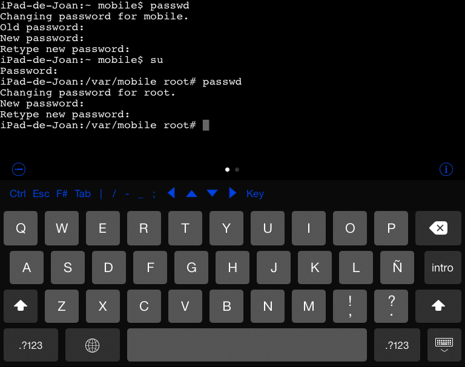](images/Cambiar-la-contraseña-de-SSH-en-iOS.png)

## PUNTOS A TENER EN CUENTA DE OPENSSH

Una vez instalado SSH queda ejecutándose en segundo plano de forma permanente. En el caso que alguien le preocupe este hecho lo puede solucionar mediante el Tweak Sbsettings.

El Tweak Sbsettings dispone de un Toggle que nos permitirá activar y desactivar nuestro sevidor SSH de forma rápida y sencilla.
