En su día instalamos el servidor [VPN Wireguard en un servidor mediante Docker](). A continuación veremos como conectarse al servidor VPN Wireguard en el caso que usemos los sistemas operativos Windows, Android y Linux.<!--more-->

## CONECTARSE A UN SERVIDOR VPN WIREGUARD EN WINDOWS, ANDROID Y LINUX

El procedimiento para conectarse a un servidor VPN Wireguard es relativamente sencillo. Si han realizado una instalación mediante Docker el procedimiento para conectarse a Wireguard en Windows, Android o Linux es el que se detalla a continuación.

### Obtener el fichero de configuración del servidor VPN Wireguard

Para conectarnos a nuestro servidor VPN es indispensable saber donde se guardan los archivos de configuración en el servidor donde tengamos instalado Wireguard. En el ejemplo que veremos a continuación la totalidad de configuración se halla en `~/services/wireguard/appdata/config`.

[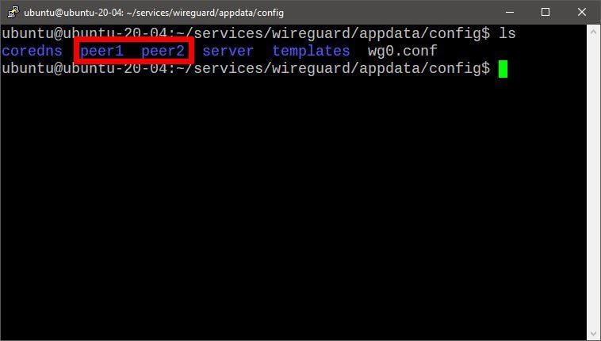](images/clientes-existentes-servidor-wireguard.jpg)

**Nota**: Si el servidor VPN Wireguard se instalo con Docker encontrarán los ficheros de configuración en el volumen de persistencia que hayan configurado. En el caso que hayan realizado una instalación convencional los ficheros de configuración se hallan en la ruta `/etc/wireguard/configs`

Dentro de las carpetas peerX como por ejemplo peer1 y peer2 se hallan todos los ficheros que necesitamos. Si en nuestro caso accedemos dentro del directorio peer1 veremos lo siguiente:

[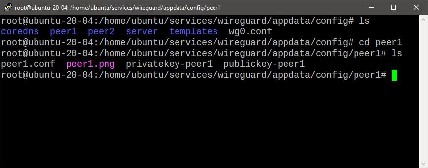](images/contenido-ficheros-configuracion-wireguard.jpg)

De todos los ficheros que vemos el único que necesitamos es el peer1.conf. El fichero peer1.conf nos ayudará a configurar los clientes VPN de forma completamente automática. Por lo tanto deberán copiar el fichero peer1.conf en cada uno de los equipos que quieran usar para conectarse al servidor VPN Wireguard. Para copiar el fichero pueden usar varios métodos. Por ejemplo en mi caso lo he realizado usando el cliente sftp Filezilla, pero si investigan un poco verán que existe una gran variedad de opciones.

**Nota**: Si quisiéramos también podríamos descargar el archivo peer1.png. De este modo también podríamos configurar de forma nuestro cliente de forma totalmente automática.

### Instalar y configurar el cliente de escritorio de Wireguard en Windows

Lo primero que tenemos que realizar es acceder a la siguiente URL para descargar el cliente de escritorio de Windows:

[https://www.wireguard.com/install/#windows-7-8-81-10-2012-2016-2019](https://www.wireguard.com/install/#windows-7-8-81-10-2012-2016-2019)

A continuación clican sobre el botón pertinente para descargar el ejecutable de instalación del cliente Wireguard:

[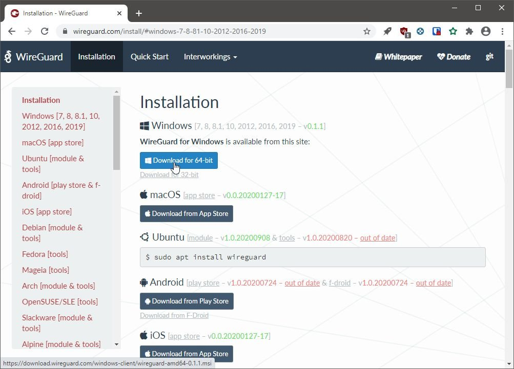](images/Descargar-wireguard-Windows.jpg)

Una vez descargado el ejecutable hacemos doble click sobre él y el proceso de instalación iniciará. El proceso será corto, rápido y automático ya que tan solo tendremos que responder que Sí permitimos la instalación del cliente de Wireguard en nuestro equipo.

Una vez finalizada la instalación abrimos Wireguard y clicamos sobre el botón **Import tunnel(s) from file**.

[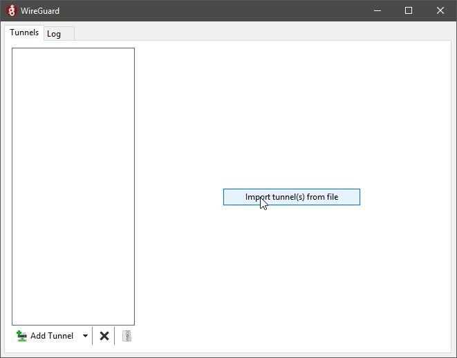](images/Importar-configuracion-cliente-wireguard-windows.jpg)

Acto seguido buscamos el fichero de configuración del cliente VPN que obtuvimos en el apartado _"Obtener el fichero de configuración del servidor VPN Wireguard"_. Lo seleccionamos y presionamos el botón **Abrir**.

[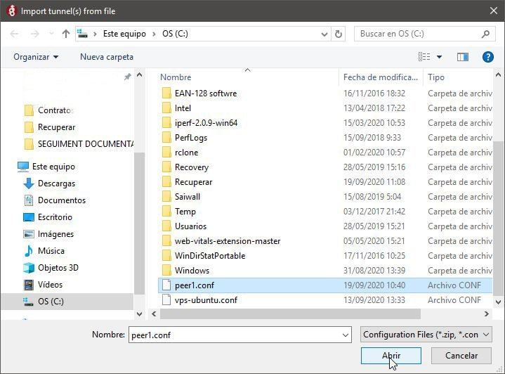](images/Seleccionar-el-fichero-de-configuracion.jpg)

De esta forma tan simple el proceso ha finalizado. Si nos queremos conectar al servidor tan solo tenemos seleccionar el servidor al que nos queremos conectar y presionar encima del botón **Activate**.

[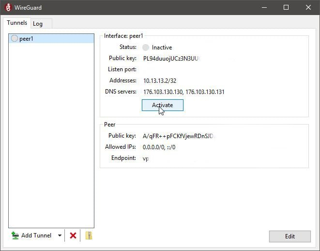](images/Conectarnos-al-servidor-VPN-windows.jpg)

### Como conectarnos al VPN Wireguard en Android

El proceso de instalación y configuración de Wireguard en Android es incluso más sencillo que en Windows. Obviamente lo primero que tenemos que realizar es instalar el cliente de Wireguard desde la Google Play Store. Para ello pueden clicar sobre el siguiente link:

[https://play.google.com/store/apps/details?id=com.wireguard.android&hl=es](https://play.google.com/store/apps/details?id=com.wireguard.android&hl=es)

Una vez dentro de la tienda tan solo tendrán que clicar sobre el botón **Instalar**.

A continuación tendremos que acceder al servidor donde instalamos Wireguard vía SSH. Una vez dentro navegamos en la ubicación donde se almacenan los ficheros de configuración que en mi caso y según vimos en el apartado _"Obtener el fichero de configuración del servidor VPN Wireguard"_ es `~/services/wireguard/appdata/config`

Dentro de mis ficheros de configuración se puede ver que tengo 2 clientes creados. El primero se llama **peer1** y el segundo se llama **peer2**.

[](images/clientes-existentes-servidor-wireguard.jpg)

Para mostrar el código QR que permitirá la conexión al cliente peer1 tan solo tenemos que ejecutar el siguiente comando en la terminal:

> **`docker exec -it wireguard /app/show-peer 1`**

Una vez ejecutado se mostrará el código QR que nos permitirá configurar de forma automática el cliente VPN de Wireguard en Android. El código QR que verán servirá para configurar el cliente peer1.

[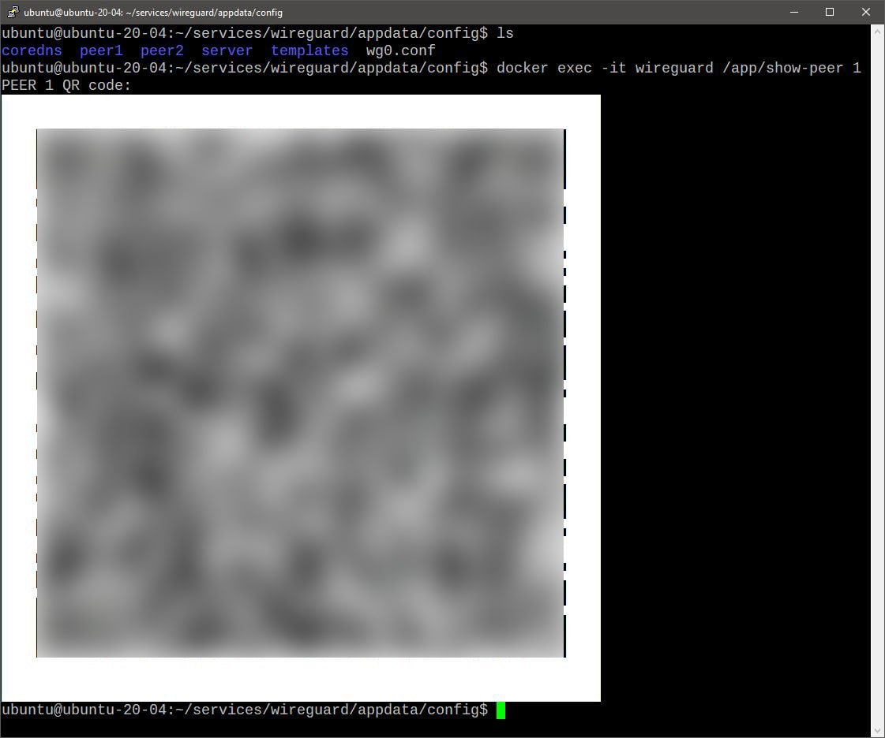](images/qr-para-conectarnos-a-wireguard.jpg)

Acto seguido abrimos el cliente de Wireguard en Android y presionamos el símbolo **+**

[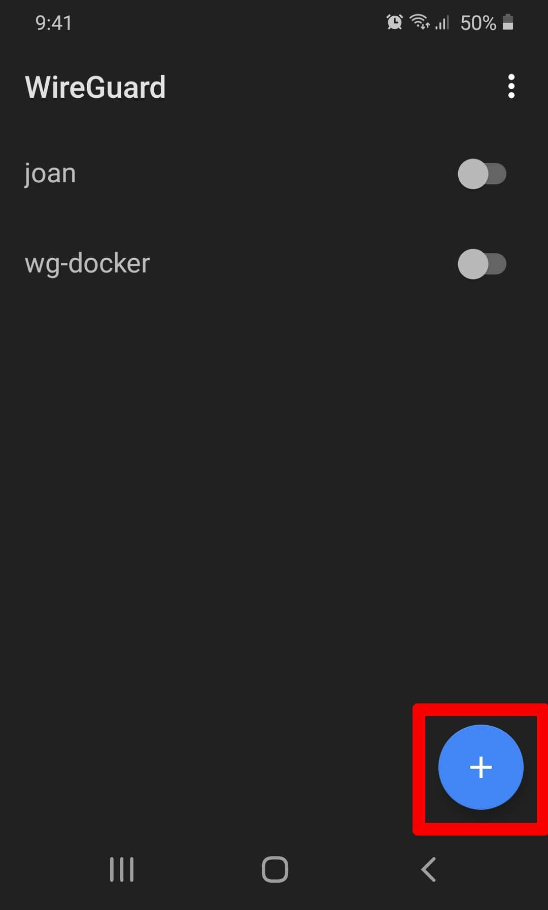](images/opciones-cliente-wireguard-android.jpg)

A continuación presionamos sobre la opción **Scan from QR Code** y escaneamos el código QR que nos aparece en la sesión SSH del servidor en que instalamos Wireguard.

[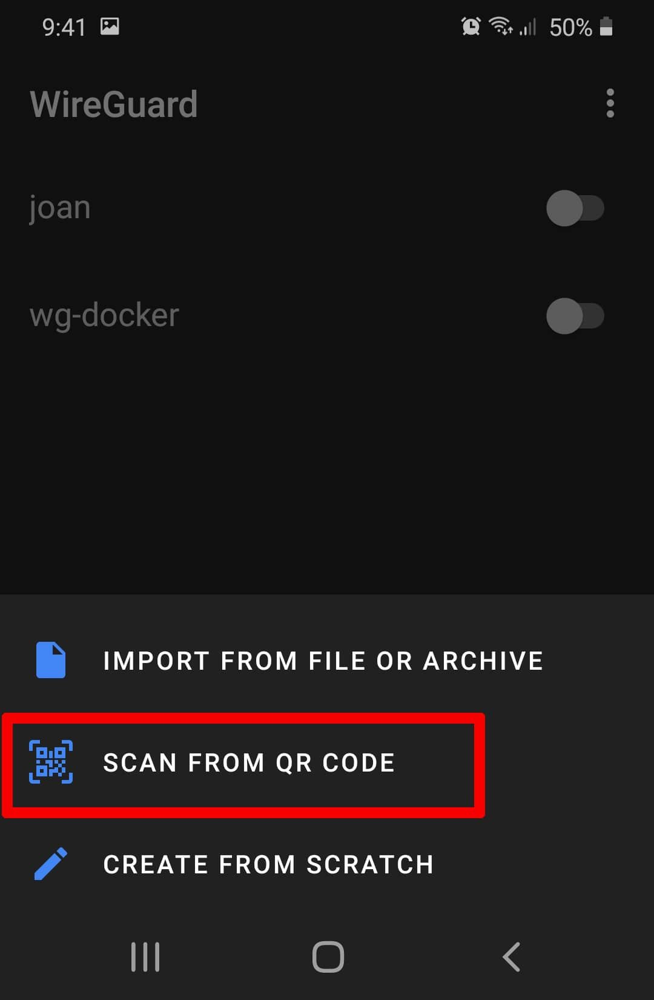](images/escanear-codigo-qr.jpg)

**Nota:** Como ven en la captura de pantalla la aplicación de Android también nos permite conectarnos a través del fichero de configuración. No obstante a mi me parece mucho más práctica la opción del código QR.

Una vez escaneado el código establecemos un nombre para identificar el servidor VPN y presionamos en el botón **Create Tunnel**.

[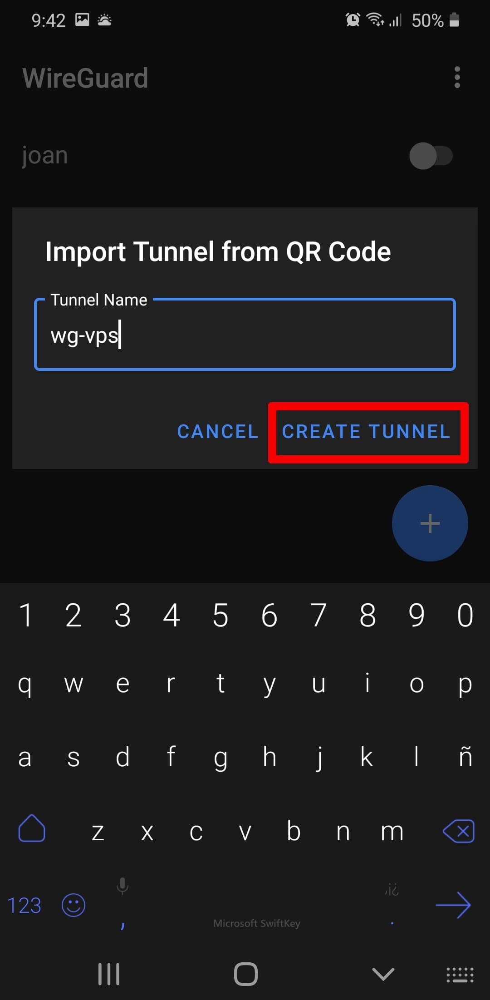](images/importar-configuracion-wireguard-android.jpg)

Acto seguido ya nos aparecerá la conexión que acabamos de configurar en la pantalla principal de la aplicación. Para conectarse al servidor VPN Wireguard tan solo tenemos que clicar encima del interruptor del servidor al que nos queremos conectar.

[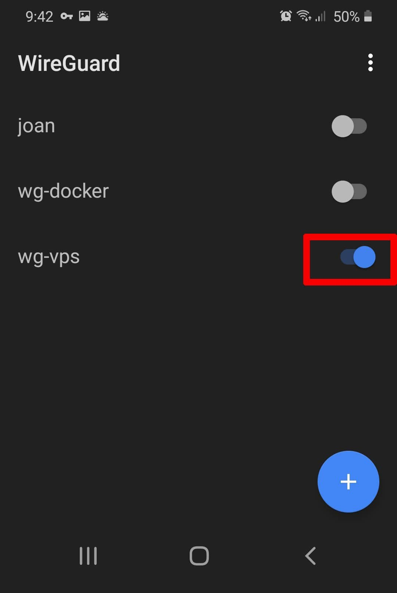](images/conectarse-wireguard-android.jpg)

### Instalar y configurar el cliente Wireguard en Linux

En este caso detallaré el proceso para conectarnos vía terminal. Lo hago vía terminal porque es el procedimiento que uso habitualmente. Además este procedimiento es útil para conectarnos a Wireguard en ocasiones en que no tenemos un entorno gráfico. Por lo tanto podremos usar el siguiente método en una Raspberry Pi o en un servidor VPS.

Para instalar Wireguard en una distribución Linux que usa el gestor de paquetes apt deberán ejecutar el siguiente comando en la terminal:

> ```shell
> sudo apt install wireguard openresolv
> ```

Una vez instalados los paquetes pertinentes reinicien su equipo. A continuación tienen que acceder dentro de la ubicación donde han almacenado el fichero de configuración del cliente que obtuvieron en el apartado _"Obtener el fichero de configuración del servidor VPN Wireguard"_. En mi caso tengo almacenado el fichero de configuración en la ubicación `~/wgclient`:

> **`pi@raspberrypi:~/wgclient $ cd ~/wgclient pi@raspberrypi:~/wgclient $ ls peer1.conf`**

Acto seguido ejecutaremos el siguiente comando para configurar de forma automática el cliente peer1.

> ```shell
> sudo install -o root -g root -m 600 peer1.conf /etc/wireguard/wg0.conf
> ```

Una vez configurado el cliente el proceso ha terminado y ya nos podemos conectar a Wireguard desde por ejemplo nuestra Raspberry Pi. Para comprobar que la conexión se realiza de forma correcta pueden comprobar su IP del siguiente modo:

> ```
> pi@raspberrypi:~/wgclient $ curl ipv4.icanhazip.com
> 178.70.21.14
> ```

Una vez se que mi IP pública es la 178.70.21.14 me conectaré al servidor VPN Wireguard ejecutando el siguiente comando en la terminal:

> ```shell
> sudo systemctl start wg-quick@wg0
> ```

Cuando nuestra conexión se haya establecido volveremos a comprobar nuestra IP y el resultado debería ser diferente al que obtuvimos con anterioridad. Por lo tanto si vuelvo a consultar mi IP pública veré que efectivamente es diferente a la que tenía con anterioridad.

> **`pi@raspberrypi:~ $ curl ipv4.icanhazip.com 120.165.196.56`**

En el caso que quieran **conectarse al servidor VPN Wireguard de forma automática cada vez que inicien su ordenador o servidor** tan solo tienen que ejecutar el siguiente comando en la terminal:

> ```shell
> sudo systemctl enable wg-quick@wg0
> ```

Si una vez habilitada la conexión automática la quieren deshabilitar tendrán que ejecutar el siguiente comando:

> ```shell
> sudo systemctl disable wg-quick@wg0
> ```

En el caso que estemos conectados al servidor VPN Wireguard y queramos desconectarnos deberemos ejecutar el siguiente comando:

> ```shell
> sudo systemctl stop wg-quick@wg0
> ```

En el caso que tengan problemas para establecer la conexión pueden usar el siguiente comando para comprobar que el servicio esté levantado:

> `pi@raspberrypi:~/wgclient $ sudo systemctl status wg-quick@wg0 ● wg-quick@wg0.service - WireGuard via wg-quick(8) for wg0    Loaded: loaded (/lib/systemd/system/wg-quick@.service; enabled; vendor preset: enabled)    Active: active (exited) since Sat 2020-09-19 10:10:40 CEST; 34min ago      Docs: man:wg-quick(8)            man:wg(8)            https://www.wireguard.com/            https://www.wireguard.com/quickstart/            https://git.zx2c4.com/wireguard-tools/about/src/man/wg-quick.8            https://git.zx2c4.com/wireguard-tools/about/src/man/wg.8  Main PID: 567 (code=exited, status=0/SUCCESS)     Tasks: 0 (limit: 2065)    CGroup: /system.slice/system-wg\x2dquick.slice/wg-quick@wg0.service  sep 19 10:10:37 raspberrypi systemd[1]: Starting WireGuard via wg-quick(8) for wg0... sep 19 10:10:39 raspberrypi wg-quick[567]: [#] ip link add wg0 type wireguard sep 19 10:10:39 raspberrypi wg-quick[567]: [#] wg setconf wg0 /dev/fd/63 sep 19 10:10:40 raspberrypi wg-quick[567]: [#] ip -4 address add 10.6.0.1/24 dev wg0 sep 19 10:10:40 raspberrypi wg-quick[567]: [#] ip link set mtu 1420 up dev wg0 sep 19 10:10:40 raspberrypi systemd[1]: Started WireGuard via wg-quick(8) for wg0.`

Finalmente para comprobar que la conexión se ha realizado con éxito pueden ejecutar el siguiente comando en la terminal:

> **`pi@raspberrypi:~/wgclient $ sudo wg interface: wg0   public key: DnNfupos4vHyir0hLsn6JCxjZjBfqNYosf/RzWt+paTQ=   private key: (hidden)   listening port: 51821  peer: KFSdj5dP188ty7jH2QR2w2nYOKQFCUnhL9J61PM5LZ8=   preshared key: (hidden)   allowed ips: 10.6.0.2/32`**

Si quieren usar una interfaz gráfica para conectarse a Wireguard les recomiendo que visiten los siguientes enlaces:

[https://www.atareao.es/podcast/wireguard-en-el-escritorio/](https://www.atareao.es/podcast/wireguard-en-el-escritorio/)

[https://elblogdelazaro.gitlab.io/2020-06-08-configurar-wireguard-utilizando-networkmanager/](https://elblogdelazaro.gitlab.io/2020-06-08-configurar-wireguard-utilizando-networkmanager/)
