En el siguiente artículo veremos una forma fácil y sencilla de conectarnos al servicio VPN de ProtonVPN.

ProtonVPN es un servicio VPN con sede en Suiza y desarrollado por el Consejo Europeo de Investigación Nuclear (CERN). Está enfocado en garantizar la seguridad y la privacidad del usuario y es destacable por las siguientes características:<!--more-->

1. El servicio VPN fue creado y es gestionado por una entidad confiable.
2. Su sede está en Suiza. De todos es conocido que Suiza es uno de los países que dispone de leyes de privacidad que protegen a los usuarios.
3. Todos los servicios VPN dicen no ceder datos a terceros, pero a la hora de la verdad todos lo hacen. Al igual que el resto, ProtonVPN también lo promete, pero son más creíbles por estar ubicados en Suiza y por tratarse de una entidad reconocida que lleva tiempo operando sin incidencias destacables.

Una vez vistas las características más destacadas de ProtonVPN pasaremos a ver como podemos usar este servicio en GNU-Linux.

## INSTALAR LOS PAQUETES NECESARIOS PARA CONECTARNOS A PROTONVPN

Hay que asegurar que disponemos de los paquetes necesarios para conectarnos a ProtonVPN. Para ello ejecutamos el siguiente comando en la terminal:

> ```
> sudo apt-get install network-manager network-manager-openvpn openvpn network-manager network-manager-gnome network-manager-openvpn-gnome
> ```

Una vez instalados la totalidad de paquetes reinicien el equipo. Una vez reiniciado el equipo estaremos en condiciones de conectarnos a un servidor VPN como por ejemplo el de ProtonVPN.

###### Nota: Si usan en gestor de red diferente a Networkmanager tienen que desinstalarlo. No es recomendable tener instalado más de un gestor de red en un mismo sistema operativo.

## DISPONER DE UNA CUENTA DE PROTONVPN O PROTONMAIL

Si disponen de una cuenta de protonmail no es necesario crear ninguna cuenta en ProtonVPN. El nombre de usuario y contraseña de protonmail es útil para acceder y conectarse a ProtonVPN

En el caso que no dispongamos de ninguna cuenta de ProtonMail o ProtonVPN, accederemos a la siguiente URL

[https://protonpvn.com/](https://protonvpn.com/ "Web para crear la cuenta de ProtoVPN")

A continuación presionaremos el botón SIGNUP.

[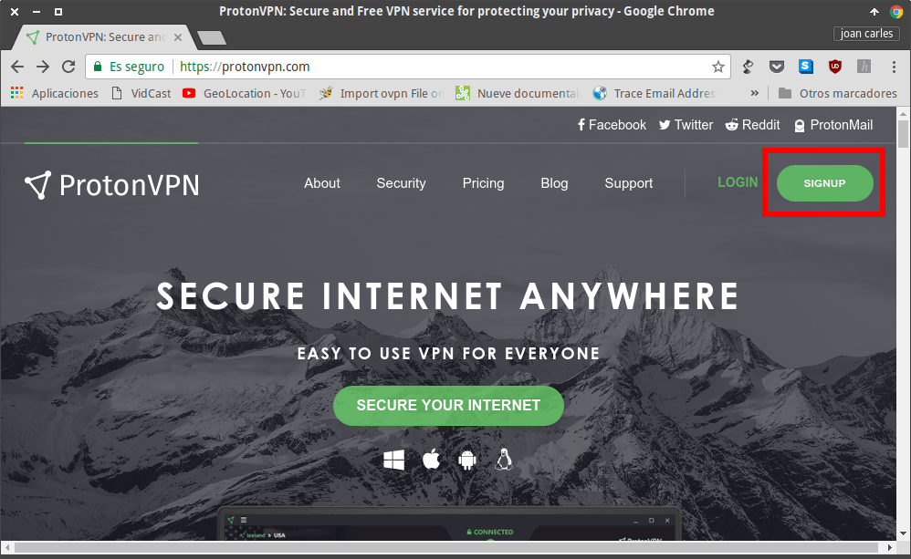](images/iniciar-proceso-crear-cuenta-protonvpn.png)

Seguidamente seleccionaremos el plan de VPN que queremos usar. En mi caso selecciono el plan Free.

[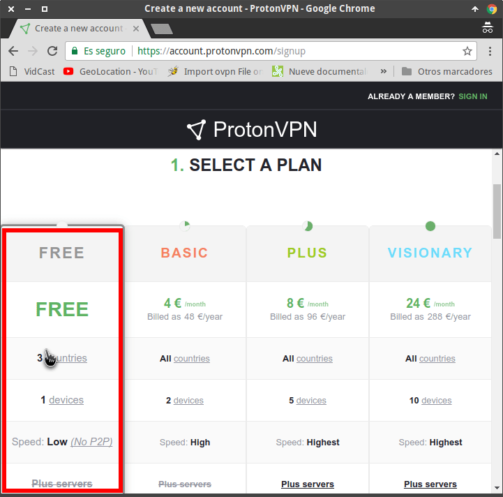](images/seleccionar-el-plan-de-protonvpn.png)

###### Nota: Obviamente el plan Free dispone de limitaciones importantes. No obstante para probar el servicio y usarlo de forma esporádica es más que suficiente.

A continuación escribimos cual queremos que sea nuestro usuario, contraseña y dirección de email.

[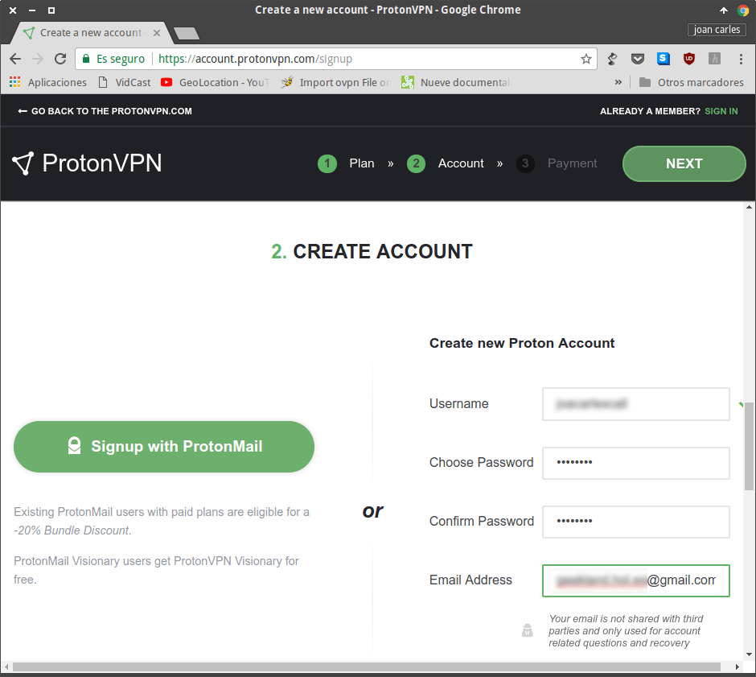](images/definir-usuario-password-email.png)

El siguiente paso consiste en verificar que somos humanos. Para ello tenemos que seguir los siguientes pasos:

1. Seleccionamos el método de verificación que queremos usar. En mi caso uso el Email.
2. A continuación escribimos nuestra dirección de email y presionamos el botón SEND.

[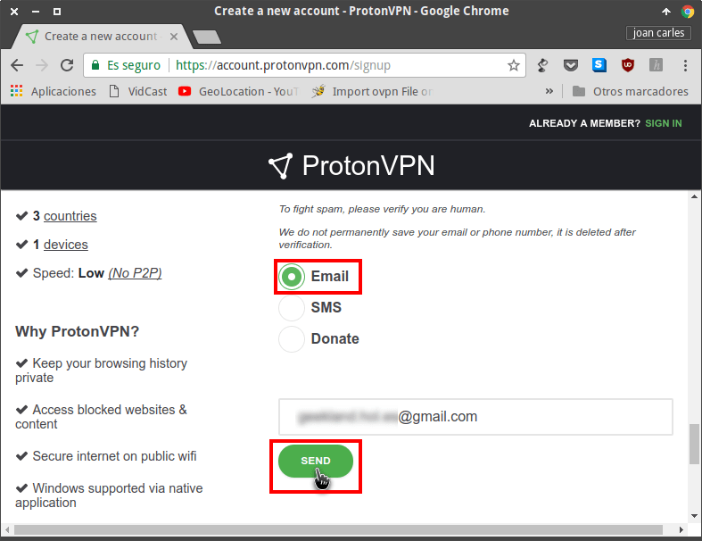](images/obtener-codigo-verificacion-protonvpn.png)

Acto seguido tenemos que ir a consultar nuestro email y encontraremos un código de verificación.

[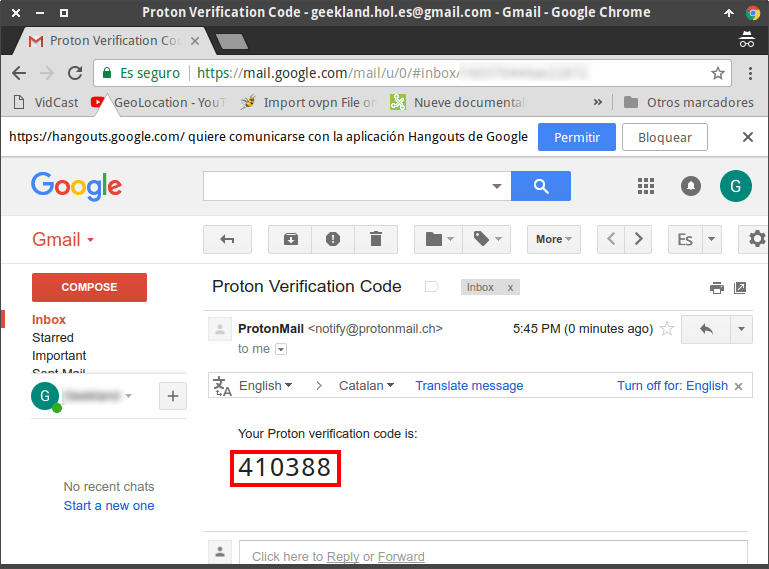](images/codigo-verificacion-email.png)

Finalmente volvemos a ProtonVPN,  introducimos el código de verificación y presionamos el botón Get ProtonVPN.

[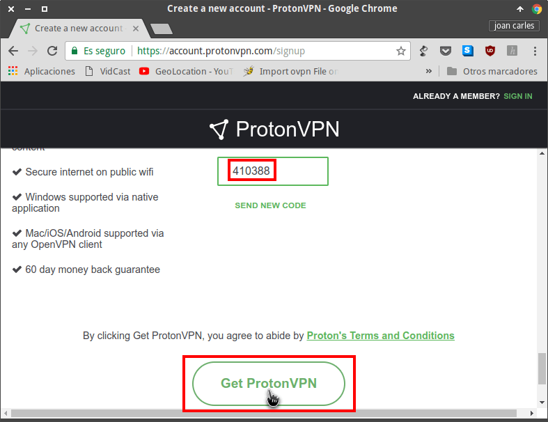](images/cuenta-protonvpn-creada.png)

Después de presionar el botón estaremos dentro de nuestra cuenta de ProtonVPN.

## DESCARGAR EL FICHERO DE CONFIGURACIÓN DE PROTONVPN

Dentro de nuestra cuenta de ProtonVPN clicamos encima de la pestaña Downloads.

A continuación definimos los siguientes aspectos:

1. Seleccionamos el sistema operativo que queremos usar que en mi caso es Linux.
2. Seleccionamos el protocolo de funcionamiento del servicio VPN. En términos de velocidad les recomiendo seleccionar el protocolo UDP.

[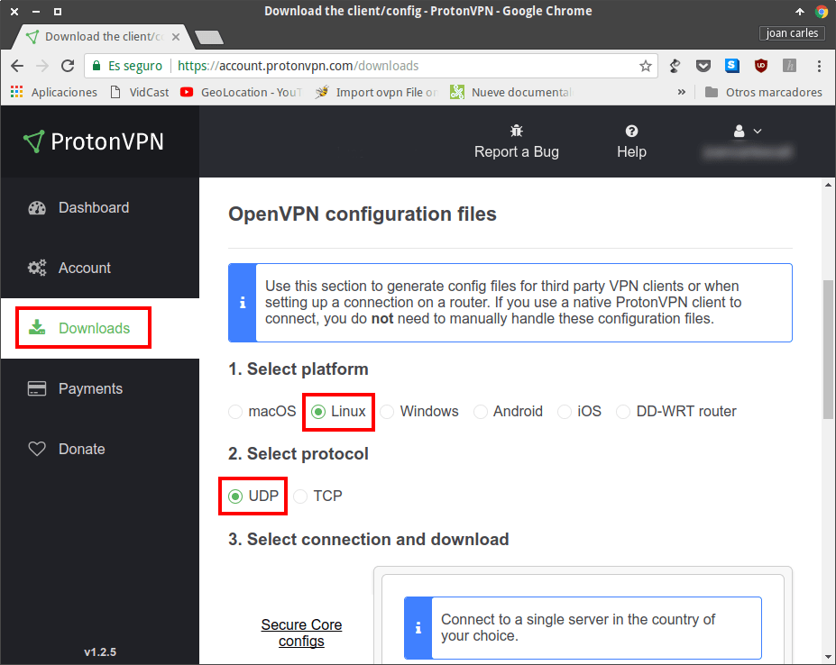](images/seleccionar-so-y-protocolo.png)

Seguidamente, en la pestaña Server configs buscamos un servidor VPN que esté disponible para los usuarios Free. Una vez encontrado descargamos su fichero de configuración clicando encima del icono de Descarga.

[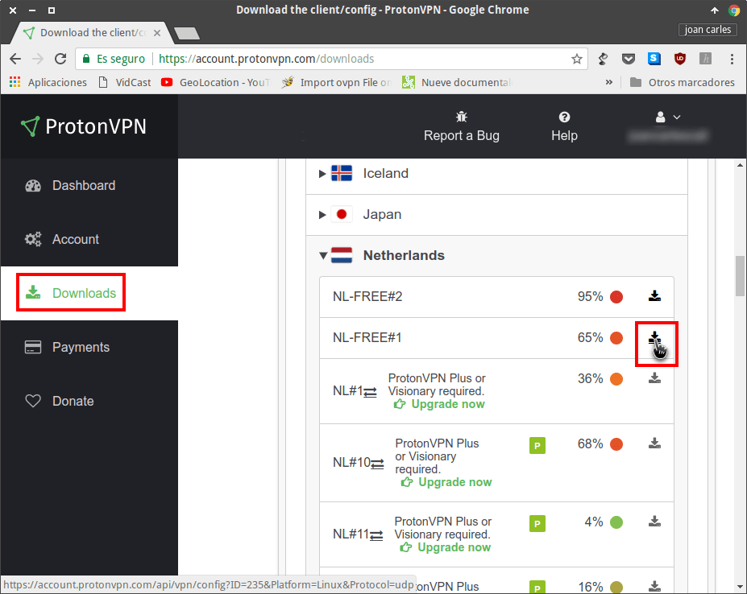](images/descargar-fichero-configuracion-servidor.png)

## AVERIGUAR NUESTRO USUARIO Y CONTRASEÑA

Una vez descargado el fichero de configuración tendremos que anotarnos nuestro nombre de usuario y contraseña para podernos conectarnos al servicio de ProtonVPN.

Para ello, dentro de la cuenta de ProtonVPN clicamos encima de la pestaña Account. Allí encontrarán el usuario y la contraseña que necesitan para conectarse a los servidores VPN.

[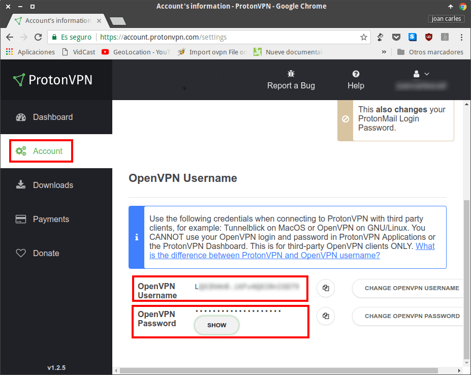](images/nombre-usuario-y-contraseña-protonvpn.png)

## CONFIGURAR NETWORKMANAGER PARA CONECTARSE A PROTONVPN

Ubicamos el puntero del ratón encima del icono del icono de Networmanager ubicado en el panel. Presionamos el botón derecho del ratón y cuando aparezca el menú contextual clicamos en la opción Editar las conexiones...

[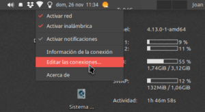](images/editar-las-conexiones-networkmanager.png)

A continuación, en la ventana de conexiones de red clicamos encima del botón Añadir una conexión nueva.

[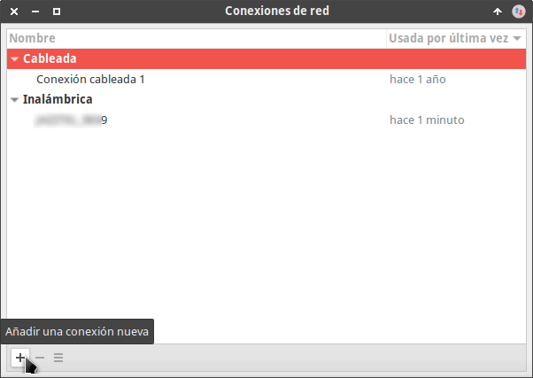](images/anadir-conexion-protonVPN.png)

En la ventana elegir un tipo de conexión deberemos elegir la opción Importar una configuración VPN guardada… y presionar el botón Crear.

[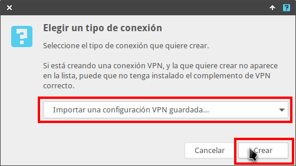](images/importar-fichero-configuracion-protonvpn.png)

Entonces, cuando aparezca la ventana del gestor de archivos seleccionaremos el fichero de configuración de ProtonVPN que descargamos con anterioridad y presionaremos el botón Abrir.

[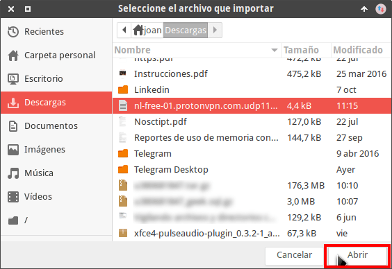](images/abrir-fichero-configuracion-protonvpn.png)

Seguidamente aparecerá la siguiente ventana en la que únicamente deberemos introducir el usuario y la contraseña para conectarnos al servidor VPN. Una vez introducidos el usuario y la contraseña presionamos el botón Guardar y el proceso de configuración ha finalizado.

[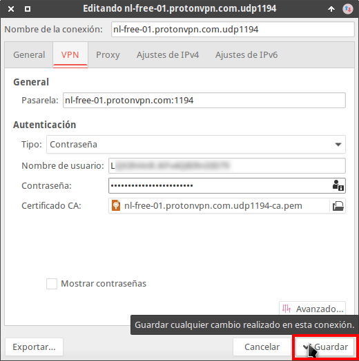](images/introducir-usuario-y-contraseña-conexion.png)

###### Nota: Para saber vuestro nombre de usuario y contraseña consulten el apartado Averiguar nuestro usuario y contraseña.

## CONECTARSE AL SERVIDOR QUE ACABAMOS DE CONFIGURAR

En estos momento ya hemos finalizado el trabajo más importante. Para conectarnos al servidor tan solo tenemos que realizar lo siguiente:

1. Clicar con el botón izquierdo encima del icono de red de Networkmanager
2. Cuando aparezca el menú Networmanger nos vamos encima de la opción Conexiones VPN. Seguidamente aparecerá otro menú en el encontraremos la totalidad de servidores VPN que tenemos configurados.
3. Seleccionamos al servidor al que nos queremos conectar y clicamos sobre él.

[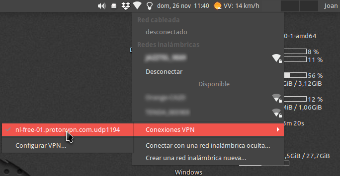](images/conectarse-a-protonvpn.png)

Si es la primera vez que nos conectamos al servidor nos aparecerá la siguiente ventana en la que tendremos que introducir la contraseña para conectarnos a ProtonVPN. La introducen y presionan el botón Aceptar.

[](images/contraseña-conexion-servidor.png)

###### Nota: Para saber vuestro nombre de usuario y contraseña consulten el apartado Averiguar nuestro usuario y contraseña.

Después de realizar estos simples pasos estaremos conectados al servidor VPN de ProtonVPN.

## COMPROBAR QUE LA CONEXIÓN A PROTONVPN SE HA REALIZADO

Para comprobar que la conexión se ha realizado pueden consultar cualquier servicio que se dedique a analizar las huellas de nuestra conexión y nuestro navegador. En mi caso he usado el siguiente servicio:

[https://browserleaks.com/](https://browserleaks.com/ "URL para analizar la privacidad de nuestro navegador")

Si consulto está página web, en mi caso observo lo siguiente:

[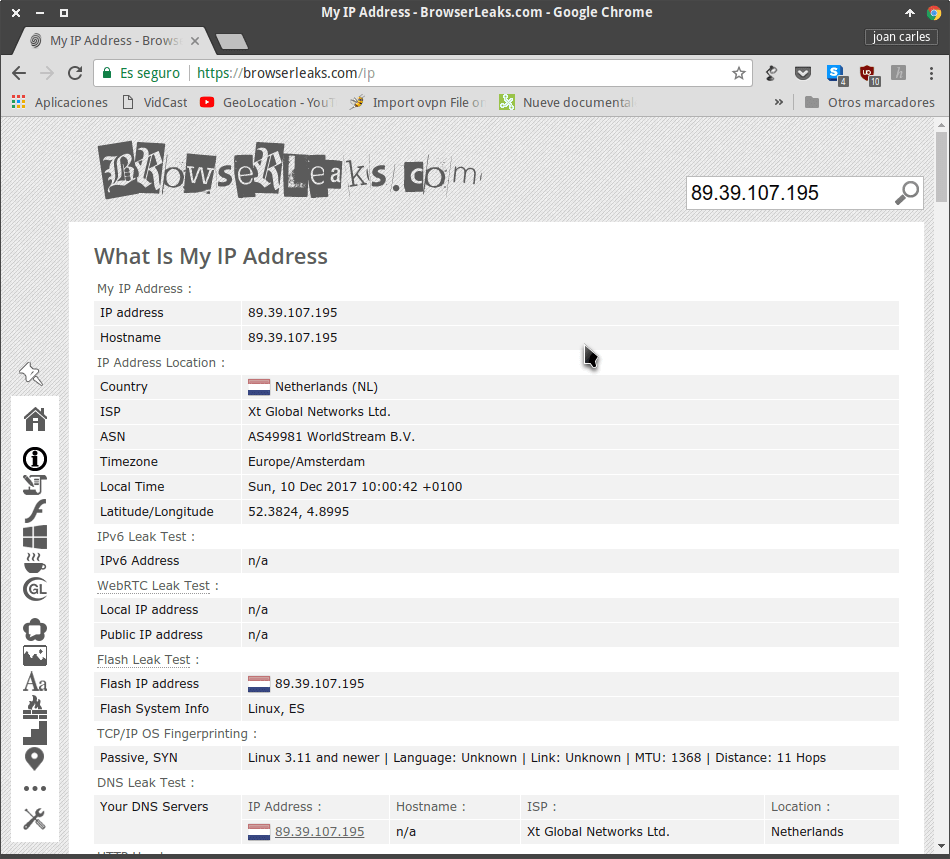](images/analisis-conexion-protonvpn.png)

1. La IP que tengo no es mi IP real. Es una IP Holandesa, por lo tanto tengo garantías que la conexión a ProtonVPN se ha establecido correctamente.
2. La geolocalización IP indica que estoy ubicado en Holanda. Esto sin duda no es correcto y por lo tanto el servidor VPN está actuando correctamente.
3. Mis servidores DNS tampoco son los reales. De este modo aseguro que mi proveedor de Internet no pueda conocer las web que he visitado.

De este modo tan sencillo puedo tener la seguridad que estoy conectado de forma correcta a ProtonVPN.

###### Nota: Si navegan en la página de Browserleaks verán que existen un gran número de herramientas para evaluar la privacidad de nuestra navegación.

## RENDIMIENTO DEL SERVICIO PROTONVPN FREE

En mi caso el rendimiento obtenido es más que aceptable. Después de usar durante días este servicio puedo afirmar lo siguiente.

La diferencia entra la velocidad de conexión con y sin el VPN se puede evaluar en la siguiente tabla:

  
|  |   **Conectado a ProtonVPN**   |   **NO conectado a ProtonVPN**   |
| --- | --- | --- |
|   _Velocidad de descargada (Mbps)_   |   7,97   |   8,22   |
|   _Velocidad de subida (kbps)_   |   503   |   634,8   |
|   _Ping (ms)_   |   140   |   68   |
|   _Jitter (ms)_   |   5   |   2   |

La velocidad cuando estoy conectado al servicio VPN es prácticamente la misma que cuando no lo estoy. Por lo tanto el rendimiento que me proporciona ProtonVPN es excelente. Con la velocidad ofrecida puedo visualizar vídeos de YouTube a 1080p sin mayores problemas.

La diferencia de velocidad es muy pequeña porque en mi caso dispongo de una ADSL lenta. Los usuarios de Fibra óptica, o una ADSL más rápida, notarán que hay una diferencia de velocidad importante. Si quieren obtener mayor velocidad y desbloquear todas las restricciones deberán obtener un plan de pago de ProtonVPN.

Además de obtener una velocidad aceptable también puedo afirmar que no hay cortes. He usado durante horas seguidas el servicio y nunca he llegado a apreciar un corte.
