En pasados post vimos de forma muy detallada como [crear y configurar nuestro propio servidor OpenVPN]() con cualquier distribución derivada de Debian. Una vez instalado y configurado nuestro servidor OpenVPN explique el procedimiento para conectarse a nuestro servidor Openvpn desde iOS y Windows. Ahora finalmente toca el turno de como conectarnos a un servidor OpenVPN en Android.<!--more-->

El procedimiento descrito a continuación lo he realizado con un teléfono Samsung Galaxy S4. De todas formas el procedimiento tiene que ser el mismo para la totalidad de teléfonos o tablets que usen Android como sistema operativo. **Los pasos para poder utilizar nuestro Servidor OpenVPN en Android son los siguientes:**

## PASO 1: RECOPILAR LAS CLAVES NECESARIAS PARA LA CONEXIÓN AL SERVIDOR

En su día ya vimos que OpenVPN funciona mediante certificados y claves RSA construidas con Openssl. También creamos la totalidad de claves para que los clientes puedan conectarse al servidor OpenVPN. Por lo tanto si seguimos la totalidad de pasos que se detallan en el siguiente [enlace](), en la ubicación **/etc/openvpn/keys** tenéis que tener las siguientes claves:


|   **Archivo**   |   **Descripción**   |   **Ubicación**   |   **Secreto**   |
| --- | --- | --- | --- |
|   ca.crt   |   Certificado raíz de la entidad certificadora   |   Servidor (/etc/openvpn) y cliente   |   No   |
|   whezzyVPN.crt   |   Certificado del servidor VPN   |   Servidor (/etc/openvpn) y cliente   |   No   |
|   usuariovpn.key   |   Clave privada del cliente VPN   |   Cliente   |   Sí   |
|   usuariovpn.crt   |   Certificado del cliente VPN   |   Cliente   |   No   |
|   ta.key   |   Clave para la Autentificación TLS   |   Servidor (/etc/openvpn) y cliente   |   Sí    |

Ahora tan solo tenemos que copiar las claves detalladas en la tabla en el cliente, que en este caso será uno de los [móviles Android](https://www.samsung.com/es/consumer/mobile-phone/smartphones/ "Móvil Android") más presentes en el mercado, el Samsung Galaxy S4 con Android 4.3. Para hacer el traslado de claves existen muchos métodos y pueden usar el que más les convenga.

Al tratarse de un tutorial lo haré mediante una memoria USB porqué considero que es la forma que requiere de menos conocimientos informáticos. Si no tuviera que hacer el tutorial extraería las claves fácilmente conectándome al servidor OpenVPN vía SSH.

Por lo tanto **enchufamos la memoria USB a nuestro servidor OpenVPN**. Una vez enchufada tendremos que montarla. **Para montarla les recomiendo seguir las instrucciones que se muestran en el siguiente enlace:**

[https://geeklandlinux.github.io/posts/montar-la-memoria-usb-en-la-terminal/]()

###### Nota: Si vuestro servidor dispone de un entorno gráfico la memoria USB se montará automáticamente y por lo tanto no será necesario seguir los pasos del link que acabo de citar.

Una vez montada la memoria USB tan solo tenemos que **copiar las claves del servidor a la memoria USB**. Para ello en el caso que no tengan entorno gráfico puede **utilizar el siguiente comando:**

> ```
> cp /etc/openvpn/keys/* /media/usb
> ```

###### Nota: Este comando copia la totalidad de contenido de la /etc/openvpn/keys, que es donde están nuestras claves, en nuestra memoria USB que hemos montado en la carpeta /media/usb. En el caso que vuestro servidor disponga de entorno gráfico este paso es mucho más sencillo ya que podéis usar el administrador de archivos en vez de comandos.

## PASO 2: COPIAR EL FICHERO DE CONFIGURACIÓN DEL CLIENTE

Cuando configuramos el servidor también creamos un fichero de configuración para el cliente. Este fichero lo guardamos en la ubicación **/etc/openvpn** con el nombre **client.conf**.

Este fichero también lo copiaremos a nuestra memoria USB. Para ellos **introduciremos el siguiente comando en la terminal:**

> ```
> cp /etc/openvpn/client.conf /media/usb
> ```

###### Nota: Este comando copia el fichero client.conf ubicado en /etc/openvpn/ a nuestra memoria USB que hemos montado en la carpeta /media/usb. En el caso de disponer de entorno gráfico no será necesario el uso de este comando ya que podéis copiar las claves mediante el administrador de archivos.

Por si a alguien le puede servir de ayuda les dejo la captura de pantalla del procedimiento que he seguido en mi caso:

[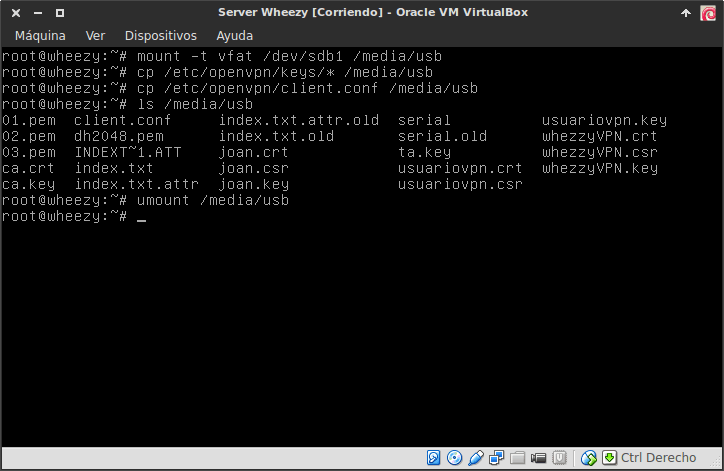](images/1-Copia-de-los-archivos-para-la-conexión.png)

## PASO 3: INSTALAR EL PROGRAMA CLIENTE DE OPENVPN EN ANDROID

Este paso es el más sencillo de todos. Tan solo **tenemos que ir a la Google Play store e instalar el cliente OpenVPN** en nuestro teléfono o tablet Android. La aplicación que tenemos que instalar se llama OpenVPN for Android. **Si clican en el siguiente [enlace](https://play.google.com/store/apps/details?id=de.blinkt.openvpn&hl=es "Link de descarga de OpenVPN for Android") accederán directamente a la descarga del cliente** mencionado.

Para que no tengan ningún tipo de duda de la aplicación que se trata les dejo esta captura de pantalla en la que pueden ver información relativa a este programa.

[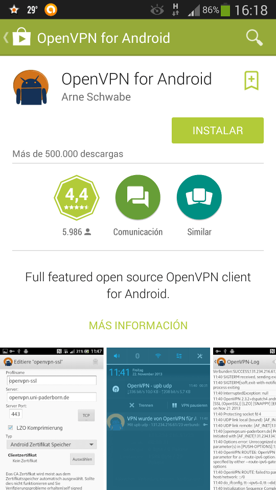](images/1-Cliente-Openvpn-for-Android.png)

###### Nota:  Si en la Google Play Store hacen una búsqueda por Openvpn for Android también encontrarán fácilmente el cliente Openvpn que tenemos que instalar.

## PASO 4: RENOMBRAR EL FICHERO DE CONFIGURACIÓN DEL CLIENTE

El paso número 4 consiste en **enchufar la memoria USB que contiene todas las claves y el fichero de configuración del cliente en un ordenador cualquiera**.

Una vez hemos enchufado el pendrive a nuestro ordenador lo abrimos y consultamos su contenido:

[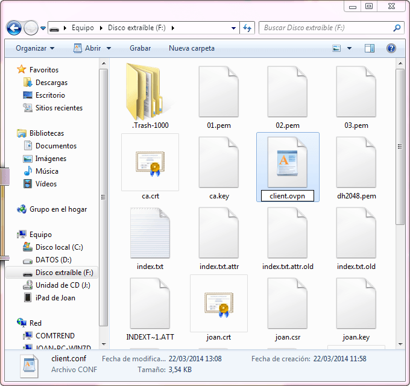](images/3-Renombar-archivo-configuración-cliente.png)

Tal y como se puede ver en la captura de pantalla **tenemos que localizar el fichero** **client.conf**. **Una vez localizado el fichero** **client.conf** **deberemos cambiar su extensión a** **client.ovpn**

Una vez realizado esto ya podemos pasar al siguiente punto.

###### Nota: Si tienen problemas en cambiar la extensión del archivo en Windows pueden consultar el siguiente [enlace](http://windows.microsoft.com/es-es/windows/show-hide-file-name-extensions#show-hide-file-name-extensions=windows-vista "Cambiar la extensión de un Archivo en Windows").

## PASO 5:  TRASLADAR LAS CLAVES Y EL FICHERO DE CONFIGURACIÓN DEL PENDRIVE AL TELÉFONO O TABLET

El quinto paso es trasladar las claves que hemos guardado en el pendrive al teléfono móvil o tablet. Hay muchos procedimientos para realizar este paso. Lo podemos realizar vía Dropbox, vía Google Drive, vía email, etc. Pero al tratarse de un tutorial lo haremos de la forma más simple y de la forma más segura en lo que a seguridad y procedimiento se refiere. Por lo tanto:

1- Primeramente **enchufamos nuestro pendrive en el ordenador**.

2- Seguidamente también **conectamos nuestro teléfono en el ordenador** con su cable Mini USB.

3- Después **abrimos el explorador de archivos de Windows o del sistema operativo que usen**. En el explorador de archivos aparecerán 2 nuevos dispositivos. Uno de ellos es nuestra memoria USB y el otro es nuestro teléfono móvil o Tablet. **Hacemos doble click tanto en la memoria USB como en el teléfono. Al hacer doble click en cada uno de los dispositivos se abrirá el explorador de archivos y seguidamente podremos consultar tanto el contenido que tenemos almacenado dentro de nuestro teléfono móvil, como dentro de nuestra memoria USB**.

4- Ahora, tal y como se puede ver en la captura de pantalla, en el explorador de archivos **en el** que podemos visualizar el contenido del **teléfono móvil o tablet tenemos que crear una carpeta que se llame **Claves OpenVPN**.**

[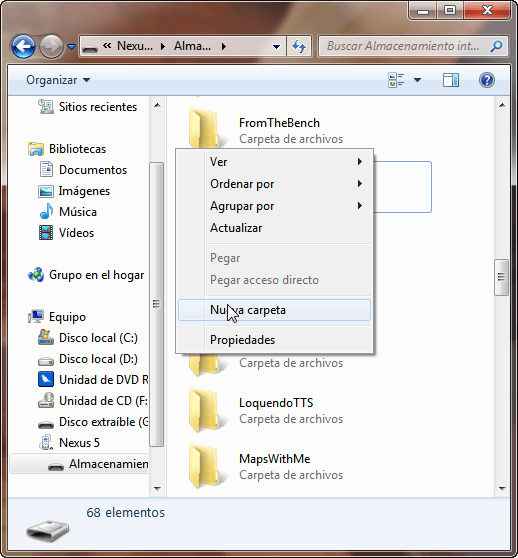](images/2-crear-nueva-carpeta.png)

5- El siguiente paso es **copiar parte de las claves ubicadas en el pendrive, dentro de la carpeta ****Claves OpenVPN****** que acabamos de crear en el teléfono móvil o tablet. **Las claves y archivos de configuración a copiar son las siguientes**:

1. ca.crt    “Certificado raíz de la entidad certificadora”
2. whezzyVPN.crt    “Certificado del servidor VPN”
3. usuariovpn.key    “Clave privada del cliente VPN”
4. usuariovpn.crt    “Certificado del cliente VPN”
5. ta.key    “Clave de Autentificación TLS”
6. client.ovpn    “Fichero de configuración del cliente”

Para copiar las claves, **tal y como también podemos ver en la captura de pantalla, tenemos que arrastrar los 6 archivos que acabamos de mencionar dentro de la carpeta claves OpenVPN**.

[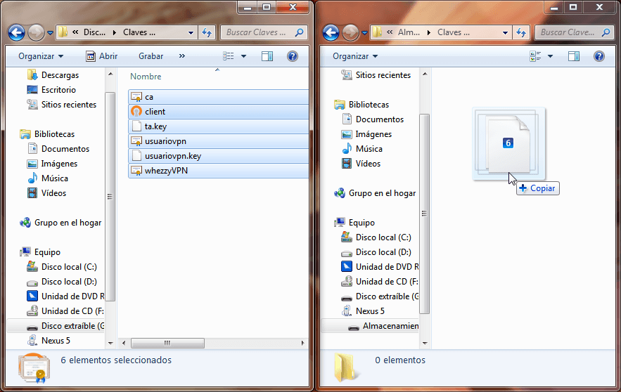](images/3-Traslado-de-los-archivos.png)

Una vez copiadas las claves y el archivo de configuración ya podemos pasar al siguiente paso.

###### Nota: Existen procedimientos alternativos para realizar este paso. A quien no le funcione este método o simplemente quiera probarlo de un modo diferente puede consultar el siguiente [enlace]().

## PASO 6: CONFIGURAR EL CLIENTE OPENVPN EN ANDROID

Para configurar el cliente OpenVPN en Android tan solo tenemos que **abrir el programa OpenVPN for Android** que descargamos e instalamos en el paso número 3. Una vez abierto verán la siguientes pantalla:

[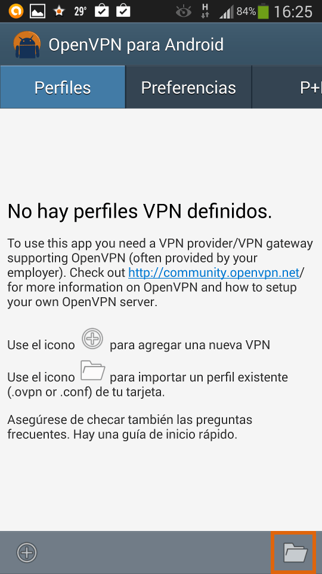](images/4-Importar-perfil-cliente.png)

Tal y como se indica en la captura de pantalla tenemos que **presionar encima del icono de la carpeta**. Al presionar sobre el icono se iniciará el proceso para la importación del fichero de configuración del cliente. Mediante la información contenida en el fichero de configuración del cliente configuraremos de forma automática el cliente OpenVPN en Android para conectarnos a nuestro servidor. Una vez presionado el botón les aparecerá la siguiente pantalla:

[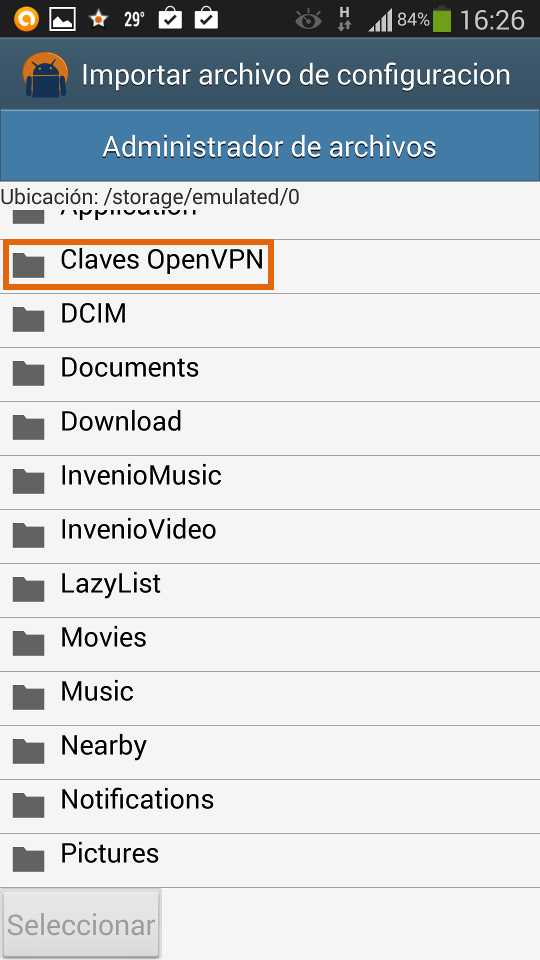](images/5-Buscar-la-carpeta-creada.png)

En está pantalla estamos observando el contenido que tenemos almacenado en la memoria interna de nuestro teléfono. Ahora tenemos que **ir a buscar la carpeta ******Claves OpenVPN****** que creamos en el paso 5.**  Una vez encontrada la carpeta, tal y como se indica en la captura de pantalla, **presionamos sobre ella y aparecerán la totalidad de claves y el archivo de configuración que copiamos dentro del teléfono o tablet**.

[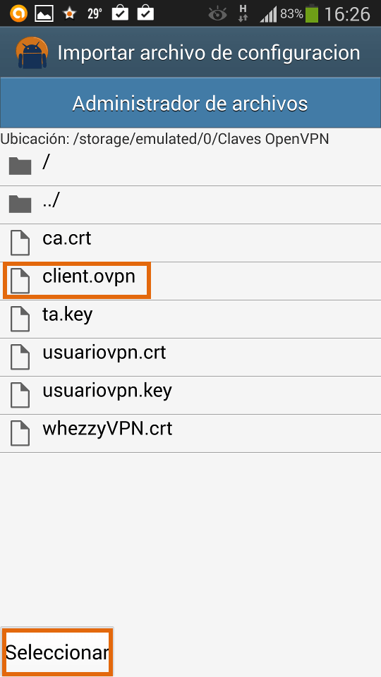](images/6-Seleccionar-el-archivo-de-configuración-ovpn.png)

Tal y como se indica en la captura de pantalla **presionamos encima del archivo ****client.ovpn,****** ya que es el archivo que contiene la configuración del cliente, y **seguidamente presionamos el botón** ******Seleccionar******. Después de hacer estos pasos les les aparecerá la siguiente pantalla:

[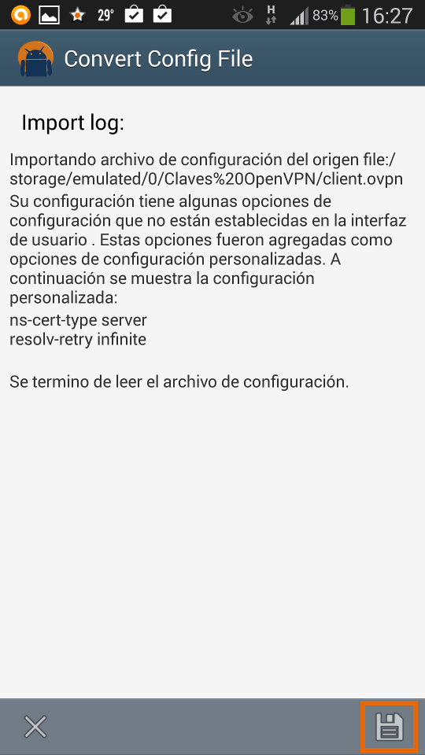](images/7-Guardar-el-perfil-de-configuración.png)

En esta pantalla se nos está informando que **la configuración contenido en el archivo** ******client.ovpn****** **se ha importado correctamente al cliente OpenVPN**. Ahora para guardar el perfil y la configuración tan solo tenemos que **presionar en el botón guardar  de la parte inferior derecha que se muestra en la última captura de pantalla**. Una vez realizado esto el proceso de configuración a terminado y ya podemos conectarnos a nuestro servidor.

## PASO 7: CONECTARSE AL SERVIDOR OPENVPN EN ANDROID

Ahora la próxima vez que abran el cliente OpenVPN en Android les aparecerá la siguiente pantalla:

[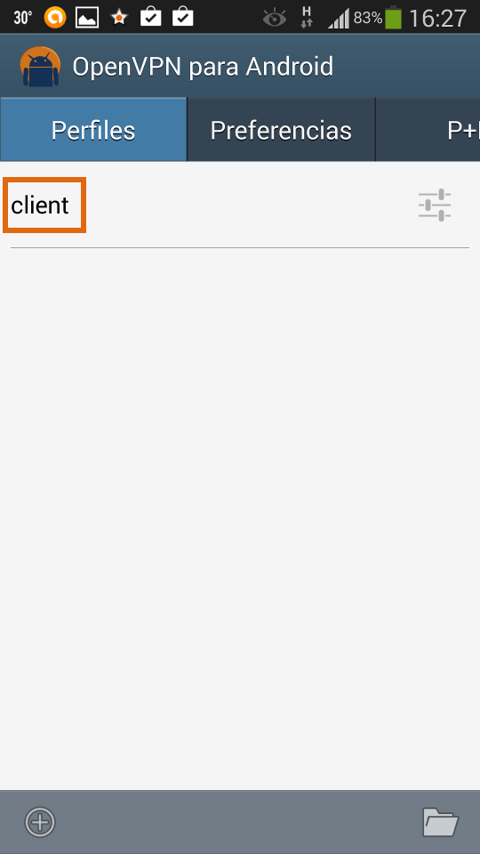](images/8-Conectarse-al-perfil-generado.png)

client es el perfil del cliente que acabamos de importar. Ahora, tal y como se indica en la captura de pantalla, **presionamos encima del perfil importado que en nuestro caso es ******client********. Seguidamente **nos preguntará nuestro nombre de usuario y contraseña** para conectarnos al servidor OpenPVN.

[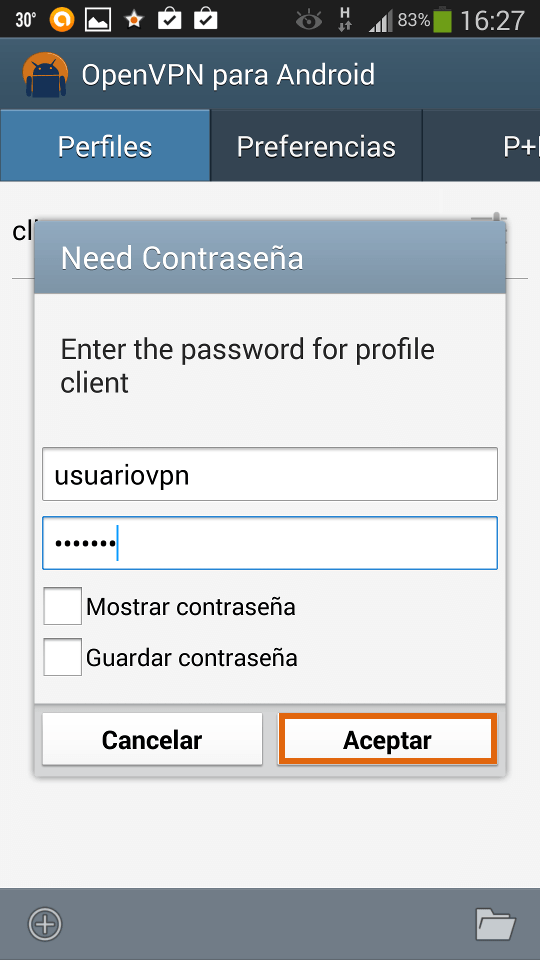](images/9-Introducir-el-usuario-y-contraseña.png)

**Una vez introducidos los datos**, tal y como se muestra en la captura de pantalla, **presionamos sobre el botón ******Aceptar********. Ahora tan solo tenemos que esperar unos segundos y si todo va bien podremos ver que nos conectaremos a nuestro servidor OpenVPN:

[](images/10-Conectado-al-servidor.png)
