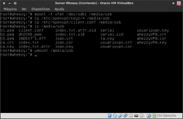
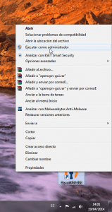
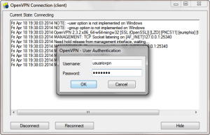

Hace ya semanas vimos como montar nuestro propio servidor OpenVPN en distribuciones derivadas de Debian y posteriormente vimos como podíamos conectarnos a nuestro servidor OpenVPN a través de iOS. Por lo tanto **ahora toca el turno de ver como nos podemos conectar a nuestro servidor OpenVPN en Windows**. Los pasos para seguir para poder utilizar nuestro Servidor OpenVPN en Windows son los siguientes:<!--more-->

## PASO 1: RECOPILAR LAS CLAVES NECESARIOS PARA LA CONEXIÓN AL SERVIDOR OPENVPN EN WINDOWS

En su día ya vimos que OpenVPN funciona mediante certificados y claves RSA construidas con Openssl. También creamos la totalidad de claves para que los clientes puedan conectarse al servidor OpenVPN. Por lo tanto si seguimos la totalidad de pasos que se detallan en el siguiente [enlace](), en la ubicación **/etc/openvpn/keys** tenéis que tener las siguientes claves:

   
|   **Archivo**   |   **Descripción**   |   **Ubicación**   |   **Secreto**   |
| --- | --- | --- | --- |
|   _ca.crt_   |   Certificado raíz de la entidad certificadora   |   Servidor (/etc/openvpn) y cliente   |   No   |
|   whezzyVPN.crt   |   Certificado del servidor VPN   |   Servidor (/etc/openvpn) y cliente   |   No   |
|   usuariovpn.key   |   Clave privada del cliente VPN   |   Cliente   |   Sí   |
|   usuariovpn.crt   |   Certificado del cliente VPN   |   Cliente   |   No   |
|   ta.key   |   Clave para la Autentificación TLS   |   Servidor (/etc/openvpn) y cliente   |   Sí   |

Ahora tan solo tenemos que copiar las claves detalladas en la tabla en el cliente que en este caso será un sistema operativo Windows 7. Para hacer el traslado existen muchos métodos y pueden usar el que más les convenga.

Al tratarse de un tutorial lo haré mediante una memoria USB porqué considero que es la forma que requiere de menos conocimientos informáticos. Si no tuviera que hacer el tutorial extraería las claves fácilmente conectándome al servidor OpenVPN vía SSH.

Por lo tanto **conectamos la memoria USB a nuestro servidor**. Una vez enchufada tendremos tendremos que montarla. **Para montarla les recomiendo seguir las instrucciones que se muestran en el siguiente enlace:**

[https://geekland.eu/montar-la-memoria-usb-en-la-terminal/]()

###### Nota: Si vuestro servidor dispone de un entorno gráfico la memoria USB se montará automáticamente.

Una vez montada la memoria USB tan solo tenemos que **copiar las claves del servidor a la memoria USB**. Para ello en el caso que no tengan entorno gráfico puede **utilizar el siguiente comando**:

> ```
> cp /etc/openvpn/keys/* /media/usb
> ```

###### Nota: Este comando copia la totalidad de contenido de la /etc/openvpn/keys, que es donde estan nuestras claves, en nuestra memoria USB que hemos montado en la carpeta /media/usb

## PASO 2: COPIAR EL FICHERO DE CONFIGURACIÓN DEL CLIENTE

Cuando configuramos el servidor también creamos un fichero de configuración para el cliente. Este fichero lo guardamos en la ubicación **/etc/openvpn** con el nombre **client.conf**.

Este fichero también lo copiaremos a nuestra memoria USB. Para ellos **introduciremos el siguiente comando en la terminal**:

> ```
> cp /etc/openvpn/client.conf /media/usb
> ```

###### Nota: Este comando copia el fichero client.conf ubicado en /etc/openvpn/keys a nuestra memoria USB que hemos montado en la carpeta /media/usb.

Si a alguien le puede servir de ayuda les dejo la captura de pantalla del procedimiento que he seguido en mi caso:

[](images/1-Copia-de-los-archivos-para-la-conexión.png)

## PASO 3: INSTALAR EL PROGRAMA CLIENTE DE OPENVPN EN WINDOWS

Este paso a priori es de los más sencillos. Tan solo tienen **entrar en el siguiente** [enlace](http://openvpn.net/index.php/open-source/downloads.html "Web para descargar OpenVPN") **para poder descargar el cliente Openvpn para Windows 7** que nos permitirá conectarnos a nuestro servidor OpenVPN:

[](images/1-Descargar-cliente-openvpn.png)

Tal y como se puede ver en la captura de pantalla, **una vez hayan ingresado en el enlace disponen de varios links para descargar el cliente OpenVPN en Windows**:

1. Si vuestro **sistema operativo es de 32 bits** tendréis que **seleccionar el link de descarga que corresponde a Windows Installer (32-bit)**.
2. Si vuestro **sistema operativo es de 64 bits** tendréis que **seleccionar el link de descarga que corresponde a Windows Installer (64-bit)**.

###### Nota: En el caso de tener dudas si vuestro sistema operativo es el de 32 bits o 64 bits pueden consultar el siguiente [enlace](http://windows.microsoft.com/es-es/windows/32-bit-and-64-bit-windows#1TC=windows-7 "Como diferenciar windows de 32 bits y 64 bits"). Otra opción en caso de tener dudas es instalar el de 32 bits ya que cliente OpenVPN de 32 bits funcionará adecuadamente en las 2 arquitecturas.

Una vez descargado el instalador **nos vamos a la ubicación donde lo hemos descargado el archivo .exe**:

[](images/2-Instalar-cliente-Openvpn.png)

Tal y como se puede ver en la captura de pantalla **clicamos el botón derecho del mouse y elegimos la opción “Ejecutar como administrador”**. Una vez realizado esto empezará la instalación del cliente. Las etapas de la instalación serán las siguientes:

**1-** Primero saldrá un mensaje de si deseamos que el programa que vamos a instalar realice cambios en el equipo. Nosotros debemos **responder que Sí**.

**2-** Seguidamente aparecerá una ventana que bienvenida. Tan solo tenemos que **presionar el botón Next**.

**3-** Seguidamente, tal y como se puede ver en la captura de pantalla, aparecerá una ventana para **seleccionar los componentes que instalaremos**:

[](images/3-Elegir-opciones-por-defecto-Instalación-OpenVPN.png)

Frente a esta ventana **dejaremos las opciones por defecto sin modificar nada y presionaremos el botón Next**.

**4-** En el cuarto paso aparecerá una ventana para seleccionar la ruta de instalación del programa. **Dejamos la ruta por defecto, que en mi caso es C:/**Archivos de programa**/OpenVPN**, **y presionamos el botón Next** y empezará la instalación que será cuestión de segundos.

###### Nota: Es posible que durante la instalación os aparezca una ventana para que aceptéis la instalación de un nuevo adaptador virtual de Red con nombre (TAP-Windows Provider). En el caso que aparezca la ventana tan solo tiene que presionar el botón Instalar.

**5-** Una vez finalizada la instalación tan solo tenemos que **presionar en el botón Next y en la siguiente ventana que aparezca presionamos el botón Finish**.

Una vez realizados estos pasos hemos finalizado la instalación del cliente. También observarán que en el escritorio de windows habrá aparecido un icono de acceso directo al cliente OpenVPN.

## PASO 4: RENOMBRAR EL FICHERO DE CONFIGURACIÓN DEL CLIENTE

El paso número 4 consiste en **enchufar la memoria USB que contiene todas las claves y el ficheros de configuración del cliente en el ordenador con Windows**.

Una vez hemos enchufado el pendrive a nuestro ordenador lo abrimos y consultamos su contenido:

[](images/3-Renombar-archivo-configuración-cliente.png)

Tal y como se puede ver en la captura de pantalla **tenemos que localizar el fichero** **client.conf**. **Una vez localizado el fichero** **client.conf** **deberemos cambiar su extensión a** **client.ovpn**

Una vez realizado esto ya podemos pasar al siguiente punto.

###### Nota:  Si tienen problemas en cambiar la extensión del archivo client.conf pueden consultar el siguiente [enlace](http://windows.microsoft.com/es-es/windows/show-hide-file-name-extensions#show-hide-file-name-extensions=windows-vista "Explicación de como cambiar la extensión de un archivo en Windows").

## PASO 5: TRASLADAR LAS CLAVES Y FICHERO DE CONFIGURACIÓN DEL PENDRIVE AL CLIENTE OPENVPN

El quinto paso es tan simple como copiar las claves y el fichero de configuración del cliente del pendrive a la ubicación **C:/Archivos de programa/OpenVPN/config**

[](images/4-Traspasar-archivos.png)

Para ello tal y como podemos ver en la captura de tan solo tenemos que seleccionar los siguientes archivos del pendrive.

1. ca.crt    “Certificado raíz de la entidad certificadora”
2. whezzyVPN.crt    “Certificado del servidor VPN”
3. usuariovpn.key    “Clave privada del cliente VPN”
4. usuariovpn.crt    “Certificado del cliente VPN”
5. ta.key    “Clave de Autentificación TLS”
6. client.ovpn    “Fichero de configuración del cliente”

Seguidamente, tal y como también podemos ver en la captura de pantalla, tenemos que **arrastrar los 6 archivos seleccionados dentro de la ventana con ubicación C:/Archivos de programa/OpenVPN/config**.

Una vez realizados estos pasos ya tenemos copiadas las claves y ficheros de configuración necesarios en nuestro cliente OpenVPN.

## PASO 6: CONECTARSE AL SERVIDOR OPENVPN EN WINDOWS

Después de copiar la claves y el fichero de configuración del cliente ya nos podemos conectar al servidor OpenVPN en Windows. Pero antes de conectarnos analizaremos cual es nuestra IP. Para ello **abrimos nuestro navegador y accedemos a la siguiente** [URL](http://www.vermiip.es/ "Link para comprobar la IP Pública actual").

[](images/5-Ip-Antes-de-conectarnos-al-servidor.png)

En la captura de pantalla vemos que **nuestra IP termina en 5.6**. Una vez conectados al servidor OpenVPN en Windows esta terminación tiene que cambiar. En el caso que no cambie querrá decir que algo no esta funcionando de forma adecuada y que no estamos conectados al servidor OpenVPN de forma correcta.

Para conectarnos al servidor OpenVPN en Windows **nos vamos a nuestro escritorio en el que encontraremos un icono de acceso directo al cliente OpenVPN**.

[](images/6-Conectarse-al-servidor-OpenVPN.png)

Tal y como se puede ver en la captura de pantalla **presionamos con el botón derecho del mouse encima del icono del programa OpenVPN. Aparecerá una lista desplegable de opciones en la que deberemos seleccionar la opción** “**Ejecutar como administador**”

Una vez seleccionada esta opción aparecerá la siguiente pantalla:

[](images/7-Intoducir-contraseña.png)

**Introducen el usuario y contraseña** que creamos en la configuración del servidor **y presionan el botón** **OK**. Una vez presionado el botón **OK** esperan unos segundos y en la parte inferior de la pantalla les tiene que aparecer un mensaje similar al que se muestra en la siguiente captura de pantalla:

[](images/8-Conectado-al-servidor-OpenVPN.png)

En estos momentos ya estamos conectados al servidor OpenVPN en Windows. Pero para tener la seguridad total que estamos conectados al servidor OpenVPN de forma correcta vamos a comprobar de nuevo nuestra dirección IP. Para ello **abrimos el navegador e ingresamos en la siguiente** [URL](http://www.vermiip.es/ "Web para comprobar nuestra IP Pública"):

[](images/9-Comprobación-IP.png) Tal y como se puede observar en la captura de pantalla **nuestra IP pública ahora termina en 235.137**. **Anteriormente terminaba en 5.6**. **Por lo tanto podemos tener cierta seguridad que la conexión al servidor Openvpn en Windows se ha realizado de forma adecuada.**
