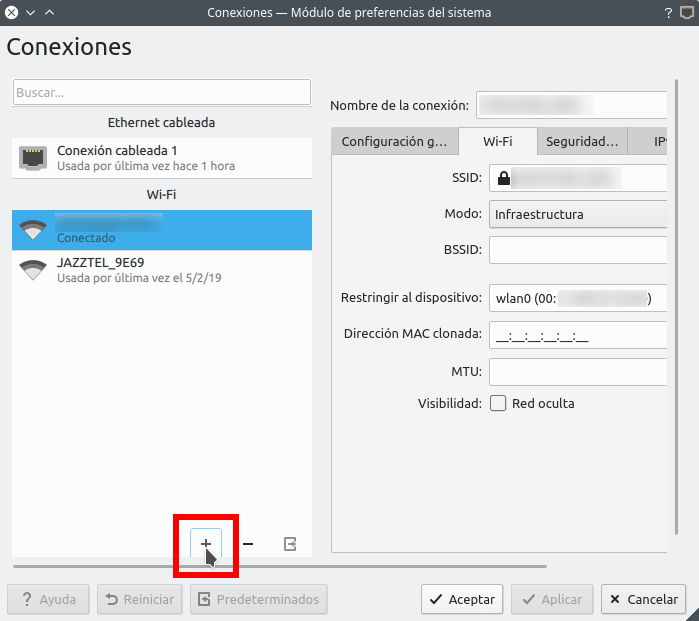
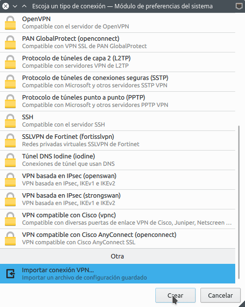
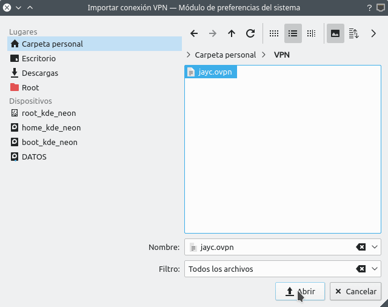
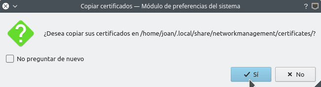
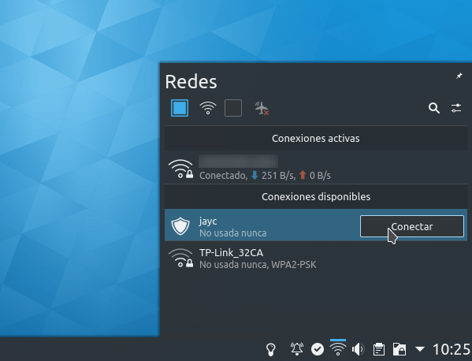
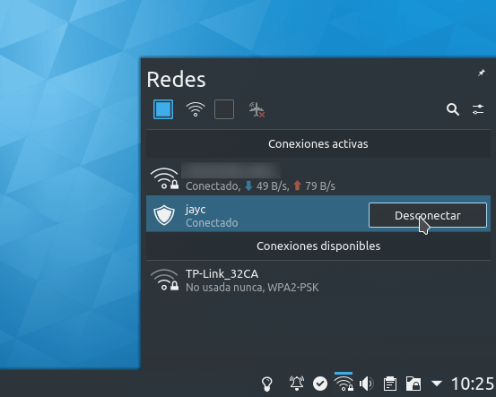

En el pasado detallamos como [montar nuestro servidor VPN en tan solo 3 comandos](). A continuación detallaremos como conectarse a un servidor OpenVPN en Linux usando la terminal y usando NetworkManager.<!--more-->

## CONECTARSE A UN SERVIDOR OPENVPN USANDO AL TERMINAL

Para conectarse a un servidor OpenVPN desde la terminal de Linux necesitamos 2 cosas:

1. El archivo de configuración del cliente.
2. Tener instalado el paquete openvpn.

Para instalar el paquete openvpn en Debian y distribuciones derivadas de Debian ejecutaremos el siguiente comando:

> ```
> sudo apt install openvpn
> ```

###### Nota: Si usan otros gestores de paquetes diferentes a apt deberán reemplazar apt install por el comando pertinente.

Acto seguido deberán almacenar el fichero de configuración del servidor OpenVPN en una ubicación que nos sea fácil de recordar. En mi caso he almacenado el archivo jayc.ovpn en la siguiente ubicación:

> ```
> /home/joan/VPN/jayc.ovpn
> ```

Una vez finalizada la preparación ya nos podemos conectar al servidor OpenVPN.

### Establecer la conexión al servidor OpenVPN desde la terminal

Conectarse al servidor OpenVPN en Linux mediante la terminal es extremadamente fácil y sencillo. Tan solo tenemos que ejecutar un comando del siguiente tipo:

> ```
> sudo openvpn --config ruta_fichero_configuración
> ```

La ruta donde almacenamos nuestro fichero de configuración era /home/joan/VPN/jayc.ovpn. Por lo tanto el comando a usar **para conectarnos a nuestro servicio OpenVPN** en primer plano será el siguiente:

> ```
> sudo openvpn --config /home/joan/VPN/geekland.ovpn
> ```

Una vez ejecutado el comando se procederá a la conexión.

###### Nota: Es posible que el momento de conectarse tengáis que introducir el usuario y la contraseña del servicio VPN. Dependerá del servicio VPN que estéis usando.

**Si queréis que la conexión se realice en segundo plano** y de este modo continuar usando la terminal deberán añadir el carácter **&** al final del comando:

> ```
> sudo openvpn --config /home/joan/VPN/geekland.ovpn &
> ```

###### Nota: Si aun quieren facilitar más el proceso de conexión pueden crear un alias.

### Desconectarse del servidor OpenVPN desde la terminal en Linux

Para desconectarnos del servidor tenemos varias opciones.

**Si la conexión al servidor se ha realizado en primero plano** tenemos que presionar la siguiente combinación de teclas:

> ```
> Ctrl + C
> ```

**Si la conexión al servidor OpenVPN se ha realizado en segundo plano** tendremos que listar los trabajos mediante el comando jobs:

> ```
> joan@kde-neon:~$ jobs
> [1]- Ejecutando sleep 200 & 
> [2]+ Ejecutando sudo openvpn --config /home/joan/VPN/jayc.ovpn &
> ```

En mi caso existen dos trabajos ejecutándose y el que hace referencia a la conexión VPN es el 2. Por lo tanto traeremos el trabajo 2 en primer plano ejecutando el siguiente comando:

> ```
> fg 2
> ```

Una vez tengamos la conexión OpenVPN en primer plano presionaremos la combinación de teclas:

> ```
> Ctrl + C
> ```

**Otra opción alternativa para desconectarnos del servidor OpenVPN** es ejecutar el siguiente comando en cualquier emulador de terminal:

> ```
> sudo killall openvpn
> ```

## CONECTARNOS A UN SERVIDOR OPENVPN EN LINUX CON NETWORKMANAGER

Prácticamente la totalidad de distribuciones Linux usan el gestor de red [NetworkManager](https://wiki.archlinux.org/index.php/NetworkManager_\(Espa%C3%B1ol\)), por lo tanto lo único que tendremos que realizar es asegurar que NetworkManager tiene instalado los complementos necesarios para conectarnos al servidor OpenVPN. Para ello ejecutaremos el siguiente comando en la terminal:

> ```
> sudo apt install network-manager-openvpn openvpn network-manager-openvpn-gnome
> ```

###### Nota: Si usan un gestor de paquetes diferente a apt deberán reemplazar “apt install” por el comando pertinente.

Acto seguido irán al icono del gestor de red de su panel, presionarán el botón derecho del ratón y cuando aparezca el menú contextual clicarán sobre la opción Configurar conexiones de red...

[](images/acceder-configuracion-red.png)

Seguidamente cliquen en el icono de Añadir nueva conexión:

[](images/añadir-nueva-conexion-de-red.png)

A continuación, cuando aparezca la ventana de **Escoja un tipo de conexión** seleccionan la opción Importar conexión VPN… y presionan el botón Crear.

[](images/importar-configuracion-conexion-servidor-openvpn-linux.png)

El siguiente paso consistirá en navegar para seleccionar el fichero de configuración del servidor VPN. Una vez encontrado lo seleccionan y presionan el botón Abrir.

[](images/abrir-el-perfil-de-conexion-al-servicio-vpn.png)

Finalmente tan solo tenemos que clicar sobre el botón Sí para que se copien la claves y certificados en la ubicación correspondiente.

[](images/copiar-los-certificados-conexion-servidor-vpn.png)

En estos momentos el proceso de configuración ha finalizado. **Para conectarnos al servidor OpenVPN en Linux realizaremos lo siguiente**:

1. Clicaremos encima del gestor de red de nuestro panel con el botón derecho del ratón.
2. Cuando se desplieguen las opciones nos vamos a la que se refiere a la conexión VPN que acabamos de configurar y presionamos sobre le botón Conectar. Acto seguido se realizará la conexión al servidor OpenVPN.

[](images/conectarse-servidor-openvpn-linux-networkmanager.png)

###### Nota: Es posible que en el momento de conectarse se pidan las credenciales para conectarse al servicio VPN. Dependerá del servicio VPN que estén usando.

El proceso **para desconectarnos del servidor VPN** es sumamente sencillo. Tan solo tenemos que realizar los siguientes pasos:

1. Clicaremos encima del gestor de red de nuestro panel con el botón derecho del ratón.
2. Cuando se desplieguen las opciones iremos a la que hace referencia a nuestra conexión VPN y presionamos sobre el botón Desconectar. Acto seguido se abortará la conexión al servidor OpenVPN.

[](images/desconectarse-servidor-openpvn-linux.png)

Por lo tanto han podido ver que conectarse a un servicio OpenVPN es extremadamente sencillo.
