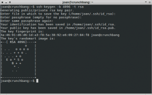
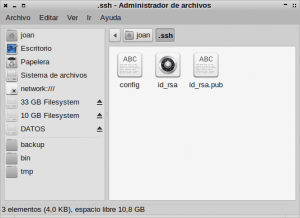
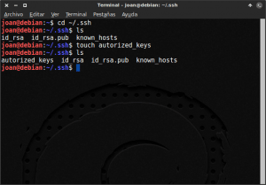
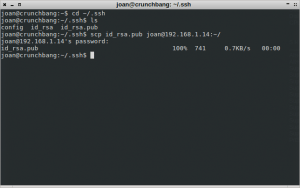
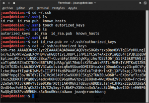
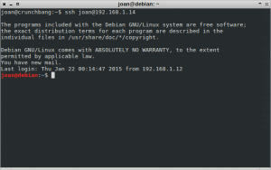

En este artículo mostraremos como un cliente se puede conectar a un servidor SSH, sin la necesidad de estar introduciendo la contraseña cada vez que nos queremos conectar al servidor. La forma de conseguir esto será mediante el uso de un par claves asimétricas.<!--more-->

Las utilidades que puede tener el hecho conectarse a un servidor SSH sin la necesidad de introducir una contraseña son las que mostraremos a continuación.

## UTILIDADES DE CONECTARSE A UN SERVIDOR SSH SIN CONTRASEÑA

El hecho de conectarse a un servidor SSH de forma segura, y sin la necesidad de introducir contraseña, tiene numerosas ventajas. Algunas de las ventajas que tendremos son las siguientes:

1. **No tendremos que estar estar recordando e introduciendo contraseñas** para conectarnos a un servidor SSH. Además al no introducir nuestra contraseña al autentificarnos, **evitaremos que nuestra contraseña pueda ser robada mediante un ataque man in the middle**.
2. Es sumamente **útil para automatizar tareas de copias de seguridad dentro o fuera nuestra red local**. De este modo con Rsync u otras utilidades, podríamos automatizar la tarea de realizar una copia de seguridad semanal del contenido generado en una oficina de Estados Unidos, y que se guarde en una oficina ubicada en España. El envío del contenido de Estados Unidos a España se haría de forma cifrada por medio de SSH, y el proceso seria completamente automático porqué para conectarnos a la oficina de España no tendríamos que introducir ninguna contraseña.
3. Es **útil en el caso que necesitemos montar un sistema de archivos remoto con SSHFS**. Al poder acceder al servidor SSHFS sin contraseñas podremos hacer que el servidor SSHFS se automonte cuando arranquemos nuestro ordenador.
4. **Para automatizar cualquier tipo de conexión remota y de tarea entre un servidor y un cliente**. Como ejemplo a lo que acabamos de citar podemos leer el punto 2 de este apartado.

Además existen múltiples servidores git que utilizan autenticación mediante claves públicas SSH. Por lo tanto el par de claves asimétricas que crearemos para conectarnos a un servidor SSH, pueden tener otras utilidades, como por ejemplo **autentificarnos cuando nos conectamos a nuestro servidor Git**.

Si queremos disponer de las ventajas que acabo de citar, u otras que ustedes puedan imaginar, tan solo tienen que seguir los pasos que mostramos a continuación.

## PASO 1: ASEGURAR QUE EL SERVIDOR SSH ESTÁ INSTALADO

Lo primero que tenemos que realizar es asegurarnos que el ordenador que actuará como servidor tiene instalado un servidor SSH. Para ello tan solo tenemos que **abrir una terminal y teclear el siguiente comando**:

> ```
> sudo apt-get install openssh-server
> 
> ```

Si no se instala ningún paquete nuevo en nuestro sistema operativo, quiere decir que el ordenador que actuará como servidor ya tenía instalado y funcionando el servidor SSH. En el caso de instalarse el paquete openssh-server el servidor SSH se instalará y estará operativo de forma inmediata.

###### Nota: Hoy en día prácticamente el 100% de distribuciones Linux disponen de un servidor SSH instalado de serie. Por lo tanto este paso casi nadie lo deberia realizar.

## PASO 2: ASEGURAR QUE EL CLIENTE PODRÁ CONECTARSE AL SERVIDOR

También tenemos que asegurarnos que el ordenador que actuará como cliente tenga el software necesario para poderse conectar al servidor SSH. Para ello **abrimos una terminal y escribimos el siguiente comando**:

> ```
> sudo apt-get install openssh-client
> 
> ```

En el caso de no instalarse ningún paquete nuevo, quiere decir que el cliente ya tenia disponibles los paquetes necesarios para conectarse al servidor SSH. Si se instalan paquetes nuevos, en el momento que finalice la instalación el ordenador cliente se podrá conectar al servidor ssh sin problema alguno.

###### Nota: Hoy en día prácticamente el 100% de distribuciones Linux disponen de un servidor SSH instalado de serie. Por lo tanto este paso casi nadie lo deberá realizar.

## PASO 3: CREAR LOS PARES DE CLAVES ASIMÉTRICAS

Una vez estamos seguros que el servidor SSH y el cliente tengan los paquetes necesarios, ya podemos generar las claves asimétricas para poder acceder a nuestro servidor SSH sin necesidad de introducir ninguna contraseña.

Para ello en el ordenador que actuará como cliente **tenemos que abrir una terminal y teclear el siguiente comando:**

> ```
> ssh-keygen -b 4096 -t rsa
> ```

El significado de cada unos de los parámetros del comando es el siguientes:

**ssh-keygen :** Es el comando que genera el par de claves.

**\-b 4096 :** Estamos indicando que la clave asimétrica que se generará tenga un tamaño de 4096 bits. Otros tamaños que podemos elegir por ejemplo son 1024 o 2048.

**\-t rsa :** Indica que el algoritmo usado para generar el par de claves tiene que ser el rsa. Otros algoritmos que podemos usar son el dsa, ecdsa, rsa1 y ed25519.

Justo después de ejecutar el comando, se nos preguntará la ubicación donde queremos guardar las claves y el nombre que les queremos poner. Cuando nos haga esta pregunta **presionaremos la tecla** ****Enter****. De este modo las claves que generaremos se guardaran en la ubicación estandard que es la ****/home/usuario/.ssh/****, y tendrán el nombre estandard que es  ****id\_rsa****.

Seguidamente se nos preguntará si queremos introducir una contraseña para cifrar nuestra clave privada. Como queremos conectarnos al servidor sin necesidad de introducir ninguna contraseña, **presionamos la tecla** ****Enter**** sin introducir ninguna contraseña.

Finalmente se nos pregunta que volvamos a introducir la contraseña que acabamos de introducir. Como no hemos introducido ninguna contraseña volvemos a **presionar la tecla** ****Enter****.

###### Nota: Al no introducir un password, la clave privada se guarda en nuestro disco duro sin cifrar. Esto veremos más adelante que supone un riesgo de seguridad.

Después de realizar estos pasos se crearan las claves asimétricas en la ubicación ****~/.ssh****. En la siguiente captura de pantalla se puede ver un resumen de todos los pasos realizados.

[](images/clave-creada-en-el-cliente.png)

Si queremos, tal y como se puede ver en la captura de pantalla, podemos ir a la ubicación ****~/.ssh**** y comprobar que efectivamente se ha creado una clave privada con nombre ****id\_rsa****, y una clave pública con nombre ****id\_rsa.pub**** que es la que deberemos exportar al servidor ssh.

[](images/claves-generadas-en-el-cliente.png)

## PASO 4: AGREGAR LA CLAVE PÚBLICA DEL CLIENTE AL SERVIDOR

El siguiente paso es exportar la clave pública del ordenador que actúa como cliente, al ordenador que actúa como servidor. Para ello tenemos que realizar los siguientes pasos.

### Crear el archivo donde se guardaran las claves públicas autorizadas (acción en el servidor)

**En el servidor SSH abrimos una terminal.** Una vez abierta la terminal **accedemos al directorio** ****~/.ssh**** **con el siguiente comando**:

> ```
> cd ~/.ssh
> ```

Una vez dentro del directorio ****~/.ssh****, vamos a crear un archivo donde se van a guardar las claves públicas que nuestro servidor aceptará. Para ello **tecleamos el siguiente comando en la terminal:**

> ```
> touch authorized_keys
> ```

Una vez tecleado el comando se creará el archivo ****authorized\_keys**** en la ubicación ****~/.ssh****, y todos los pasos a realizar en el servidor habrán terminado. En la siguiente captura de pantalla se pueden ver los pasos realizados hasta el momento en el servidor:

[](images/paso-1-autorizar-clave-cliente.png)

### Copiar la clave pública del cliente al servidor SSH (acción en el cliente)

Una vez terminado con el servidor, ahora tenemos que trabajar en el ordenador que actuará como cliente.

**En el ordenador cliente abrimos una terminal**. Una vez abierta la terminal **accedemos al directorio** ****~/.ssh****, que es la que contiene nuestra clave pública, **con el siguiente comando:**

> ```
> cd ~/.ssh
> ```

Una vez dentro de la carpeta ****~/.ssh**** **exportaremos la clave pública al servidor usando el siguiente comando:**

> ```
> scp id_rsa.pub joan@192.168.1.14:~/
> ```

El significado de cada unos de los parámetros del comando es el siguiente:

**scp :** Es el comando scp (secure copy) sirve para copiar archivos de forma cifrada entre un sistema local y un servidor remoto.

**id\_rsa.pub :** Es el nombre de la clave pública que queremos copiar al servidor.

**joan@192.168.1.14:~/** : Es la dirección del servidor donde queremos copiar la clave pública. El usuario del servidor es joan, la ip del servidor es 192.168.1.14 y queremos que la clave pública se guarde en la ubicación home (****~/****).

###### Nota: Obviamente los comandos de este apartado hay que adaptarlos en función de las características de vuestra red local o de vuestra red externa.

Una vez se haya ejecutado el comando, **se nos preguntará la contraseña del servidor SSH al que queremos copiar la clave pública. Introducimos la contraseña** y justo después de introducirla, la clave pública del cliente se copiara la ubicación home (****~/****) del servidor SSH. Seguidamente se muestra una captura de pantalla de los pasos realizados en este apartado:

[](images/paso-2-clave-transferida-a-la-home-del-servidor.png)

### Autorizar la clave pública del cliente en el servidor (acción en el servidor)

Una vez tenemos la clave pública del cliente en la home del servidor, tan solo nos queda introducir la clave pública del cliente a la lista de claves autorizadas del servidor ****authorized\_keys****, que creamos en el inicio del paso 4. Para ello seguimos los siguientes pasos.

**En el servidor tenemos que ir a la ubicación donde hemos copiado la clave pública del cliente**. Para ello en la terminal **ejecutamos el siguiente comando:**

> ```
> cd ~/
> ```

Una vez ubicados en la home, que es donde copiamos la clave pública, **ejecutamos el siguiente comando** para añadir la clave pública en el fichero de autorización de claves públicas ****authorized\_keys****:

> ```
> cat id_rsa.pub >> ~/.ssh/authorized_keys
> ```

El significado de cada unos de los parámetros del comando es el siguiente:

**cat :** El Comando cat lo usaremos para añadir la clave pública dentro del fichero authorized\_keys.

**id\_rsa.pub :** Es el nombre de la clave pública que queremos autorizar.

**\>> ~/.ssh/authorized\_keys :** Es la ruta del archivo que almacenará las claves públicas autorizadas. La parte del comando >> es importante ya que es la parte posibilita que se añada la clave pública al fichero authorized\_keys.

Una vez ejecutado el comando, la clave pública se copiará al fichero de claves autorizadas. Para comprobar que es que así podemos usar el siguiente comando:

> ```
> cat ~/.ssh/authorized_keys
> ```

Si después de ejecutar el comando nos aparece una clave en pantalla, el proceso ha sido un existo y ya nos podremos conectar al servidor SSH sin necesidad de introducir ninguna contraseña. En la siguiente captura de pantalla se muestran los pasos que se han seguido para autorizar la clave pública:

[](images/Paso-4-Comprobación-que-la-clave-ha-sido-introducida.png)

###### Nota: Una vez autorizada la clave pública, si queremos podemos borrar el archivo id\_rsa.pub ubicado en la home del servidor.

## COMPROBACIÓN DEL FUNCIONAMIENTO

Para comprobar el funcionamiento tan solo tenemos que intentar acceder a nuestro servidor SSH, tal y como lo hacemos de forma habitual. Si lo hacemos, tal y como se puede ver en la captura de pantalla de este apartado, veremos que no se nos pide ninguna contraseña para acceder al servidor SSH.

[](images/Acceso-al-servidor-sin-contraseña.png)

## FUNCIONAMIENTO DEL PROCESO DE AUTENTIFICACIÓN

Una vez implementados los pasos citados en este artículo, es interesante comentar como funciona el proceso de autentificación entre cliente y servidor. E**l procedimiento de autentificación a grandes rasgos funciona de la siguiente forma**:

1. Cuando el cliente intenta acceder al servidor SSH. Lo primero que hace el servidor es comprobar si la clave pública del cliente está autorizada. Si está autorizada el proceso de autentificación sigue adelante. Si no está autorizada el proceso termina y no podemos acceder al servidor.
2. Si la clave pública del cliente está autorizada por el servidor, el servidor cifra un mensaje con la clave pública del cliente. Una vez el servidor ha cifrado el mensaje lo envía al cliente.
3. El cliente recibe el mensaje del servidor. Una vez recibido el mensaje, el cliente intenta descifrar este mensaje con la clave privada. Si usando la clave privada el cliente descifra el mensaje, el servidor lo detectará y se establecerá la conexión con el servidor SSH. Si el cliente no puede descifrar el mensaje enviado por el servidor, se abortará el proceso de conexión al servidor.

## CUESTIONES DE SEGURIDAD QUE TENEMOS QUE TENER EN CUENTA

Si analizamos el proceso de autentificación del apartado anterior **vemos que existe un riesgo** importante. **Cualquier persona que se apodere de nuestra clave pública y privada, es muy posible que tenga la posibilidad de acceder a nuestro servidor SSH**. Sin duda esto es un riesgo en lo que a seguridad se refiere.

**La solución al problema** que acabamos de describir es relativamente sencilla. Lo que deberíamos realizar **es introducir una contraseña a nuestra clave privada**. De este modo cada vez que quisiéramos entrar en nuestro servidor SSH tendríamos que añadir una contraseña, y aunque alguien pudiera obtener nuestro par de claves no se podría autentificar porqué no sabría la contraseña. Si aplicamos lo que acabo de comentar, para intentar evitar estar poniendo la contraseña constantemente, deberíamos usar ssh-agent para que únicamente tengamos que introducir la contraseña de la clave privada una vez por sesión. Para realizar lo que acabo de describir, y para implementar otras medidas de seguridad, publicaré otro post en un futuro muy cercano.

A pesar de los riesgos de seguridad existentes, estoy seguro que la gran mayoría de usuarios preferirán usar el método descrito en este post, y por lo tanto no cifrar la clave privada. Por esto he preferido escribir el post de esta forma y dejar el método técnicamente más seguro para más adelante.

## FUENTES DE INFORMACIÓN

[https://wiki.archlinux.org/index.php/SSH\_keys](https://wiki.archlinux.org/index.php/SSH_keys "Fuente de información usada para elaborar el post")
