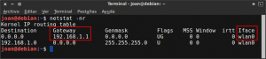
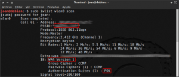

**Hace unos días** tuve serios problemas con los drivers de mi tarjeta gráfica. Como consecuencia **me quedé sin entorno gráfico y solo podía arrancar mi sistema operativo Debian con el modo de recuperación**. **Con el modo de recuperación me di cuenta que mi tarjeta de red wifi no funcionaba** porqué al fallar la carga del entorno gráfico nunca llegaba a cargarse el gestor de redes Network Manager.<!--more-->

Lo primero que pensé es en buscar un cable de red para conectar mi ordenador de sobremesa directamente al Router pero la verdad es que ninguno de los que disponía era suficientemente largo. Como esta solución no era factible entonces intenté buscar la forma que mi tarjeta de red Wifi funcionará sin disponer de ningún gestor de redes como por ejemplo network manager o wicd.

## SOLUCIÓN AL PROBLEMA

**Lo único que tenemos que hacer** para que nuestra tarjeta de red inalámbrica o wifi funcione sin la necesidad de disponer de un entorno gráfico, **es configurar de forma adecuada el archivo**:

> ```
> /etc/network/interfaces
> ```

Para configurar este archivo de forma adecuada tan solo tenemos que seguir los pasos que veremos a continuación.

## COPIA DE SEGURIDAD DEL ARCHIVO DE CONFIGURACIÓN

Antes de empezar a modificar la configuración **deberemos realizar una copia de seguridad de la configuración actual**. Para realizar la copia de seguridad de la configuración actual tan solo **tenemos que abrir una terminal y teclear el siguiente comando**:

> ```
> cp /etc/network/interfaces /etc/network/interfaces.bak
> ```

Una vez realizada la copia de seguridad ya podemos pasar a modificar la configuración del archivo **/etc/network/interfaces** para que nuestra tarjeta de red wifi funcione de nuevo.

## IDENTIFICAR LA SEGURIDAD Y EL ESSID DE NUESTRA RED INALÁMBRICA

**Para configurar nuestra tarjeta de red Inalámbrica, lo primero que tenemos que conocer es el tipo de seguridad que implementa nuestra red ya que en función del tipo de seguridad variaran los comandos de configuración** que tenemos que usar.

En el caso de desconocer el tipo de seguridad que tiene nuestra red inalámbrica podemos aplicar el siguiente método para obtenerla.

Abren un ordenador cualquiera que disponga de GNU-Linux. **Se conectan a la red Inalámbrica y abren una terminal. En la terminal teclean el comando:**

> ```
> netstat -nr
> ```

**Presionan** **Enter** y seguidamente les aparecerá una pantalla parecida a la siguiente:

[](images/puerta-de-enlace-y-nombre-de-interfaz.png)

Si observan cuidadosamente **veremos que se nos informa de dos datos de interés**. El primero es que **nuestra** **Gateway** o puerta de enlace de nuestro Router **que es la** **192.168.1.1**, **y** el segundo dato es que **nuestra interfaz de red es reconocida como** **wlan0**.

Una vez conocida la interfaz de red **tecleamos el siguiente comando en la terminal**:

> ```
> sudo iwlist wlan0 scan
> ```

###### Nota: En mi caso en el comando pongo wlan0 porqué, como hemos visto anteriormente, mi interfaz de red se reconoce como wlan0. Si en vuestro caso la interfaz de red tiene un nombre diferente a wlan0 deberán modificar el comando sustituyendo wlan0 por vuestra interfaz de red.

Una vez ejecutado el comando **presionan** **Enter** y obtendrán la siguiente información:

[](images/Seguridad-Red-inalámbrica.png)

**En el campo** **ESSID** **podremos ver que el ESSID el nuestra Red inalámbrica es** **WLAN\_1540**.

También si observamos detalladamente la imagen veremos que **en el apartado** **IE** **se detalla la seguridad de mi red inalámbrica es** **WPA-PSK**.

## CONFIGURACIÓN DE LA TARJETA DE RED WIFI CON SEGURIDAD WPA-PSK O WPA2-PSK

En la actualidad prácticamente el 100% de los usuarios domésticos disponen de una red inalámbrica con seguridad del tipo WPA o WPA2 (PSK). Por lo tanto existen altas probabilidades que quien esté leyendo este artículo tenga que aplicar la configuración detallada en este apartado.

Para empezar con la configuración lo primero que tenemos que hacer es abrir el archivo **/etc/network/interfaces** con un editor de texto. Para ello **introducimos el siguiente comando en la terminal:**

> ```
> sudo nano /etc/network/interfaces
> ```

Una vez abierto el editor de textos tenemos que **introducir o asegurar que la siguiente información está presente dentro de nuestro archivo de configuración**.

> ```
> # The loopback network interface
> auto lo
> iface lo inet loopback
> 
> auto wlan0
>    iface wlan0 inet static
>    address 192.168.1.144
>    netmask 255.255.255.0
>    broadcast 192.168.1.255
>    gateway 192.168.1.1
>    dns-nameservers 192.168.1.1
>    wpa-ssid WLAN_1540
>    wpa-psk ASCtG4567894538JF43b
> ```

###### Nota: En el archivo de configuración figuran datos como el Essid y nuestra contraseña de conexión Wifi. Obviamente los datos que figuran en este ejemplo de configuración están inventados.

###### Nota: Obviamente quien se limite a copiar y pegar la configuración que he puesto obtendrá un resultado insatisfactorio porqué hay que adaptar la configuración a cada situación en particular. Para poder adaptar la configuración a cada paso particular tienen que leer y comprender el significado que tiene cada uno de los parámetros que ponemos en el archivo de configuración.

El significado de todos y cada uno de los parámetros introducidos en la configuración son los siguientes:

**Comando 1 :** “**auto** **lo**”: Este comando lo que hace es iniciar la interfaz lo ([Loopback](https://es.wikipedia.org/wiki/Loopback "Explicación del significado de Loopback")) automáticamente durante la secuencia de arranque.

**Comando 2 :** “**iface lo inet loopback**”: Con este comando lo que estamos haciendo es **definir los parámetros de la interfaz lo para IP’s del tipo** [IPV4](https://es.wikipedia.org/wiki/IPv4 "Explicación del Significado de IPv4"). Los parámetros de configuración de esta interfaz se introducen automáticamente en el momento de levantar la red.

**Comando 3 :** “**auto** **wlan0**”: Este comando lo que hace es **iniciar la interfaz **wlan0** durante la secuencia de arranque del ordenador**. Si alguien lo cree conveniente puede reemplazar wlan0 por wlan1 o cualquier otro nombre que crea conveniente.

**Comando 4 :** “**iface** **wlan0 inet static**”: Con este comando lo que **estamos indicando es que una vez levantada la interfaz wlan0 se asigne una IP fija o estática del tipo IPV4 a nuestro ordenador**. La IP y tipo de red se nos asignará en función de los parámetros que estableceremos en los comandos que van del 5 al 9.

**Comando 5 :** “**address** **192.168.1.144**”: En el campo address he puesto **192.168.1.144** que se trata de una dirección IP reservada para redes de tipo clase C. **He puesto esta IP porqué es la IP que quiero que se asigne a mi ordenador como ip fija o estática**. En principio podemos elegir cualquier ip comprendida entre la dirección de red (network) y la dirección broadcast.

###### Nota: Las direcciones IP reservadas para redes clase C van desde 192.168.0.0 hasta 192.168.255.255. Por lo tanto en este campo podríamos haber elegido otras IP como por ejemplo 192.168.100.14, 162.168.0.3, etc. En función de la la IP que elijamos hay que tener en cuenta de modificar el resto de parámetros como por ejemplo puede ser la puerta de entrada, la dirección broadcast, etc.

**Comando 6 :** “**netmask** **255.255.255.0**”: **He elegido que mi máscara de red sea 255.255.255.0**. Prácticamente el 100% de redes domésticas utilizan está máscara de red. **La máscara de red define el número máximo de ordenadores o host que puede tener nuestra red**. Al usar 255.255.255.0 el número máximo será de 254 ordenadores. En el caso de necesitar construir una red de más de 254 ordenadores tendríamos que montar una red clase B que nos permitirá llegar a tener hasta 65534 ordenadores.

###### Nota: A modo de ejemplo. Si quisiéramos limitar el número de ordenadores que pueden conectarse a nuestra red a 32, tan solo deberíamos modificar la mascara de red a 225.255.255.224.

###### Nota: Para cambiar a una red tipo B tendríamos que usar una máscara de red del tipo 255.255.0.0. Las IP que tienen reservadas para las redes de tipo B son 172.16.0.0 a 172.31.255.255. Si precisan de más información pueden consultar el siguiente [post](https://es.wikipedia.org/wiki/Red_privada "IP reservadas para cada clase de Red").

**Comando 7 :** “**broadcast** **192.168.1.255**”: **Como dirección broadcast pongo 192.168.1.255**. Esta dirección se podrá usar para comunicarse y enviar paquetes a la totalidad de equipos que forman parte de una misma red. **La dirección broadcast es la dirección más alta de la red**. En nuestro caso como la puerta de entrada es 192.168.1.1 y la mascara de subred es el 255.255.255.0 la dirección broadcast será 192.168.1.255.

**Comando 8 :** “**gateway** **192.168.1.1**”: **En este campo hay que definir la puerta de entrada del router que en mi caso es 192.168.1.1**. Este parámetro se puede modificar en vuestro router pero la gran mayoría de personas acostumbra a tener la dirección 192.168.1.1. En el caso que vuestra puerta de enlace no sea la 192.168.1.1, la pueden averiguar fácilmente siguiendo los consejos que se detallan en el apartado “Identificar el tipo de seguridad y el ESSID de nuestra red inalámbrica” de este mismo post.

**Comando 9 :**”**dns-nameservers** **192.168.1.1**”: En los dns-namservers **he puesto 192.168.1.1** ya que es la puerta de entrada de mi Router. **De está forma estoy definiendo que las peticiones DNS de nuestro ordenador sean resultas mediante los DNS de mi ISP**. En el caso que quiera usar otros DNS, como por ejemplo los de google, tan solo tenemos que reemplazar 192.168.1.1 por 8.8.8.8.

**Comando 10 :**”**wpa-ssid** **WLAN\_1540**”: En el campo wpa-ssid **tenemos que detallar el ESSID de nuestra red inalámbrica que en mi caso es** **WLAN\_1540**. El ESSID es el nombre con que se identifica nuestra red inalámbrica. En el caso poco probable de no saber el ESSID de nuestra red inalámbrica lo podemos averiguar fácilmente siguiendo los consejos que se detallan en el apartado “Identificar el tipo de seguridad y el ESSID de nuestra red inalámbrica” de este mismo post.

###### Nota: Existen muchas otras formas de obtener el ESSID de nuestra red Inalámbrica. Otras formas para poder averiguar el ESSID son mediante el applet de Gnome Network Manager o Wicd, accediendo a la configuración de nuestro router, etc.

**Comando 11 :**”**wpa-psk** **ASCtG4567894538JF43b**”: Después del comando wpa-psk tan solo tenemos que **introducir la clave de nuestra red inalámbrica**. Obviamente la clave que he utilizado para realizar el post es falsa.

**Una vez introducidos la totalidad de los comandos en el archivo de configuración guardan los cambios. La próxima vez que se reinicie el PC la conexión a Internet vía Wifi tiene que funcionar a la perfección**.

## CONFIGURACIÓN DE LA TARJETA DE RED INALÁMBRICA CON SEGURIDAD WEP

**En el caso que vuestra red inalámbrica disponga de seguridad del tipo WEP** el proceso es prácticamente el mismo que acabamos de ver pero con un par de ligeras modificaciones.

Como en el caso anterior abrimos el archivo**/etc/network/interfaces** con un editor de textos. Para ello **introducimos el siguiente comando en la terminal**:

> ```
> sudo nano /etc/network/interfaces
> ```

Una vez abierto el editor de textos tenemos que **introducir o asegurar que la siguiente información está presente en nuestro archivo de configuración.**

> ```
> # The loopback network interface
> auto lo
> iface lo inet loopback
> 
> auto wlan0
>    iface wlan0 inet static
>    address 192.168.1.144
>    netmask 255.255.255.0
>    broadcast 192.168.1.255
>    gateway 192.168.1.1
>    dns-nameservers 192.168.1.1
>    wireless-essid WLAN_1540
>    wireless-key ASCtG4567894538JF43b
> ```

**Si comparan la configuración con seguridad WPA-PSK con esta verán que únicamente los 2 últimos comandos son diferentes. Por lo tanto simplemente que tener en cuenta estas dos modificaciones:**

1. **En el comando 10 hay que reemplazar **wpa-ssid** por **wireless-essid****
2. **En el comando 11 hay que reemplazar **wpa-psk** por **wireless-key****

**Para comprender el significado de cada una de las lineas del archivo de configuración pueden consultar el apartado en el que se detalla la configuración para redes con seguridad WPA-PSK.**

**Una vez introducidos la totalidad de los comandos en el archivo de configuración guardan los cambios. La próxima vez que se reinicie el PC la conexión a Internet vía Wifi tiene que funcionar a la perfección**.

## CONFIGURACIÓN DE LA TARJETA DE RED WIFI CON SEGURIDAD WPA-EAP O WPA2-EAP

**En el caso que vuestra red inalámbrica disponga de seguridad del tipo WPA-EAP** el proceso es prácticamente el mismo que acabamos de ver pero con un par de ligeras modificaciones.

Como en el caso anterior abrimos el archivo**/etc/network/interfaces** con un editor de textos. Para ello **introducimos el siguiente comando en la terminal:**

> ```
> sudo nano /etc/network/interfaces
> ```

Una vez abierto el editor de textos tenemos que **introducir o asegurar que la siguiente información está presente en nuestro archivo de configuración.**

> ```
> # The loopback network interface
> auto lo
> iface lo inet loopback
> 
> auto wlan0
>    iface wlan0 inet static
>    address 192.168.1.144
>    netmask 255.255.255.0
>    broadcast 192.168.1.255
>    gateway 192.168.1.1
>    dns-nameservers 192.168.1.1
>    wpa-ssid WLAN_1540
>    wpa-eap ASCtG4567894538JF43b
> ```

**Si comparan la configuración con seguridad WPA-PSK con esta verán que únicamente el último comando es diferente. Por lo tanto simplemente hay que realizar el siguiente cambio:**

1. **En el comando 11 hay que reemplazar ****wpa-psk**** por ****wpa-eap******

**Para comprender el significado de cada una de las lineas del archivo de configuración pueden consultar el apartado en el que se detalla la configuración para redes con seguridad WPA-PSK.**

**Una vez introducidos la totalidad de los comandos en el archivo de configuración guardan los cambios. La próxima vez que se reinicie el PC la conexión a Internet vía Wifi tiene que funcionar a la perfección**.

## SITUACIONES EN LAS QUE PUEDE SER ÚTIL

Finalmente solo quiero citar **situaciones en las que lo citado en este post puede ser de utilidad**. Algunas de las situaciones que se me ocurren son las siguientes:

1. **En el caso de querer realizar una net install de un sistema operativo y no dispongamos de un cable de red**. En este caso lo que cuento en este post puede ser de suma utilidad.
2. **En el caso que tengáis una avería similar a la que he comentado en el inicio de este post**. Una vez conseguí que funcionará la tarjeta de red inalámbrica puede reparar sin problema mi tarjeta de red. Lo que hice fue desinstalar el Driver privativo de Nvidia y usar el Libre.
3. **Cualquier tipo de operación que tengamos que hacer en el caso que no dispongamos de entorno gráfico y no dispongamos de un cable de red** o del que dispongamos sea demasiado corto.

Es posible que existan más utilidades de las que acabo de mencionar. Así que si alguien se anima puede escribir posibles utilidades en los comentarios del post.
