[](images/Configurar-DNSCrypt-en-Linux.png)En las pasadas semanas vimos la [importancia que tiene cifrar nuestras peticiones DNS]() y además vimos el procedimiento para [instalar DNSCrypt]() en Linux y en Windows. Una vez tenemos instalado DNSCrypt en nuestro ordenador, ahora veremos los pasos a seguir para configurar DNSCRypt de forma adecuada y segura.<!--more-->

## CONFIGURAR DNSCRYPT EN EL CASO QUE LO HAYAMOS INSTALADO MEDIANTE REPOSITORIOS

Los pasos a seguir para configurar DNSCrypt son los siguientes:

### Comprobar que DNSCrypt está activo

Para comprobar que el servicio DNSCrypt está activo tan solo tenemos que acceder a la terminal y ejecutar el siguiente comando:

> ```
> sudo systemctl status dnscrypt-proxy.socket
> ```

En mi caso obtengo el siguiente resultado:

> ```
> ● dnscrypt-proxy.socket - dnscrypt-proxy listening socket
>  Loaded: loaded (/lib/systemd/system/dnscrypt-proxy.socket; enabled; vendor pr
>  Active: active (running) since dom 2016-05-22 00:31:58 CEST; 1 months 11 days
>  Docs: man:dnscrypt-proxy(8)
>  Listen: 127.0.2.1:53 (Stream)
>  127.0.2.1:53 (Datagram)
> ```

Por lo tanto el servicio está activo y todo está funcionando correctamente.

Si el comando que acabamos de ejecutar nos dijera que dnscrypt está inactivo, tendremos que activarlo ejecutando el siguiente comando en la terminal:

> ```
> sudo systemctl start dnscrypt-proxy.socket
> ```

Para asegurar que DNSCrypt se ejecuta de forma automática en el arranque del sistema tenemos que ejecutar el siguiente comando:

> ```
> sudo systemctl enable dnscrypt-proxy.socket
> ```

###### Nota: Los comandos mostrados en este primer apartado son considerando que estamos usando el sistema de inicio Systemd.

### Conocer la IP y el puerto en que escucha DNSCrypt

Lo primero que tenemos que averiguar es la dirección local y el puerto que está usando DNSCrypt.

Para ello consultamos el archivo **dnscrypt-proxy.socket** ejecutando el siguiente comando:

> **sudo nano /etc/systemd/system/sockets.target.wants/dnscrypt-proxy.socket**

Después de ejecutar el comando obtendremos un resultado parecido al siguiente:

[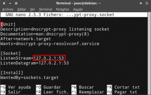](images/Dirección-IP-y-puerto-en-el-que-escucha-DNSCrypt.png)

Si leemos detalladamente veremos que en mi caso, la dirección local en la que DNSCrypt está escuchando es la **127.0.2.1** y el puerto es el **53**.

### Cambiar la IP y el puerto en que escucha DNSCrypt

###### Nota: Este apartado es opcional y únicamente lo deben seguir los usuarios quieren modificar la IP de escucha y la IP estándar.

En el caso que quisiéramos cambiar la IP y el puerto de escucha consultamos el archivo **dnscrypt-proxy.socket** ejecutando el siguiente comando:

> ```
> sudo nano /etc/systemd/system/sockets.target.wants/dnscrypt-proxy.socket
> ```

Una vez abierto el editor de textos reemplazamos la IP **127.0.2.1** por otra del tipo **127.x.x.x** y el puerto **53** por el puerto que nosotros queramos.

Un ejemplo que podríamos probar es el siguiente:

[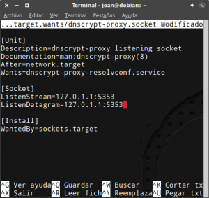](images/Cambiar-el-puerto-y-la-IP-en-dnscrypt.png)

Una vez realizados los cambios los guardamos y cerramos el fichero.

Seguidamente ejecutamos el siguiente comando en la terminal:

> ```
> sudo nano /etc/default/dnscrypt-proxy
> ```

Una vez se abra el editor de texto deberemos comprobar que en el campo **DNSCRYPT\_PROXY\_LOCAL:ADDRESS** figure la misma IP y el mismo puerto que definimos en el fichero /**etc/systemd/system/sockets.target.wants/dnscrypt-proxy.socket**

[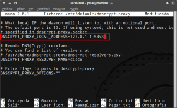](images/Modificar-IP-y-Puerto-en-dnscrypt-proxy.png)

Una vez que ambos ficheros disponen de la misma IP y del mismo puerto guardamos los cambios y cerramos el fichero.

Para que los cambios aplicados surjan efecto tenemos que ejecutar el siguiente comando en la terminal:

> ```
> systemctl daemon-reload
> ```

###### Nota: Este apartado es a modo de ejemplo. En mi caso he usado la IP y el puerto por defecto.

### Configurar el gestor de red para que utilice DNSCrypt

Una vez conocida que la dirección de escucha es la **127.0.2.1**, accedemos a los ajustes de nuestro gestor de red.

Una vez dentro de la configuración de Network manager o Wicd, reemplazamos los DNS actuales por la dirección en la que está escuchando DNSCrypt.

Por lo tanto en mi caso pasaré de tener esta configuración:

[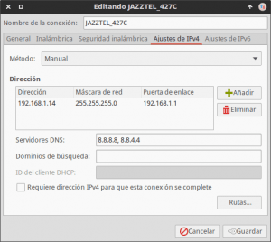](images/Configuración-inicial-de-Network-Manager.png)

A tener la siguiente configuración:

[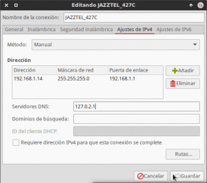](images/Configuración-final-DNSCrypt-Nework-manager.png)

###### Nota: He pasado de usar los DNS de google a usar la dirección local 127.0.2.1 que es en la que está escuchando DNSCrypt.

Una vez realizados los cambios hay que presionar en el botón **Guardar** y el proceso para configurar DNSCrypt ha concluido.

Para que DNSCrypt empiece a funcionar tan solo tenemos que reiniciar nuestro ordenador.

### Seleccionar el servidor para resolver las peticiones dns

###### Nota: Es apartado es opcional. En estos momentos DNSCrypt ya debe estar funcionando y realizando su función.

Por defecto DNSCrypt utiliza los servidores de Cisco. Para comprobar lo que acabo de decir tan solo tenemos que ejecutar el siguiente comando en la terminal:

> ```
> nano /etc/default/dnscrypt-proxy
> ```

[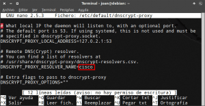](images/Servidor-DNS-por-defecto-de-DNSCrypt.png)

Una vez ejecutado el comando, tal y como se puede ver en la captura de pantalla, estoy usando los DNS de cisco (OpenDNS) para resolver las peticiones DNS.

Los servidores DNS de cisco guardan logs de nuestras peticiones DNS y es algo que no me gusta. Por lo tanto lo reemplazaremos por otro.

Para ver los servidores DNS disponibles ejecutamos el siguiente comando en la terminal:

> ```
> nano /usr/share/dnscrypt-proxy/dnscrypt-resolvers.csv
> ```

###### Nota: Si no tenemos disponible el archivo dnscrypt-resolvers.csv, también podemos consultar servidores DNSCrypt disponibles en la siguiente [URL](https://github.com/jedisct1/dnscrypt-proxy/blob/master/dnscrypt-resolvers.csv "URL para ver los servidores DNSCRypt disponibles")

Una vez ejecutado el comando obtendremos información de todos los servidores disponibles:

[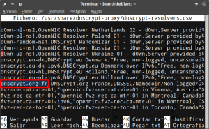](images/Servidores-DNS-disponibles.png)

Elegimos el que nos parezca más oportuno. En mi caso elijo el servidor **dnscrypt.org-fr** por los siguientes motivos:

1. No guarda Logs.
2. Dispone de validación DNSSEC.
3. Es cercano geográficamente.

Para reemplazar el servidor **cisco** por el **dnscrypt.org-fr** abrimos una terminal y tecleamos el siguiente comando:

> ```
> sudo nano /etc/default/dnscrypt-proxy
> ```

Una vez abierto el editor de textos reemplazamos el servidor actual, que en el mi caso es el **cisco**, por el **dnscrypt.org-fr**.

[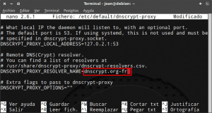](images/Servidor-DNS-reemplazado.png)

Una vez realizadas las modificaciones guardamos los cambios y cerramos el fichero. Ahora tan solo tenemos que reiniciar DNSCrypt ejecutando el siguiente comando en la terminal.

> ```
> sudo systemctl restart dnscrypt-proxy.socket
> ```

### Opciones adicionales para configurar DNSCrypt

###### Nota: Es apartado es opcional. En estos momentos DNSCrypt ya debe estar funcionando y realizando su función.

Si queremos podemos modificar el comportamiento de DNSCrypt para hacerlo más seguro o para adaptarlo más a nuestras necesidades.

Para modificar las opciones de funcionamiento de DNSCrypt ejecutamos el siguiente comando en la terminal:

> ```
> sudo nano /etc/default/dnscrypt-proxy
> ```

Una vez abierto el editor tenemos que rellenar la línea **DNSCRYPT\_PROXY\_OPTIONS=""** con las opciones pertinentes.

Después de añadir las opciones extra de funcionamiento la línea queda de la siguiente forma:

> ```
> DNSCRYPT_PROXY_OPTIONS="--edns-payload-size=4096 --ephemeral-keys --logfile=/var/log/dnscrypt-proxy.log"
> ```

\[caption id="attachment\_7251" align="alignnone" width="544"\][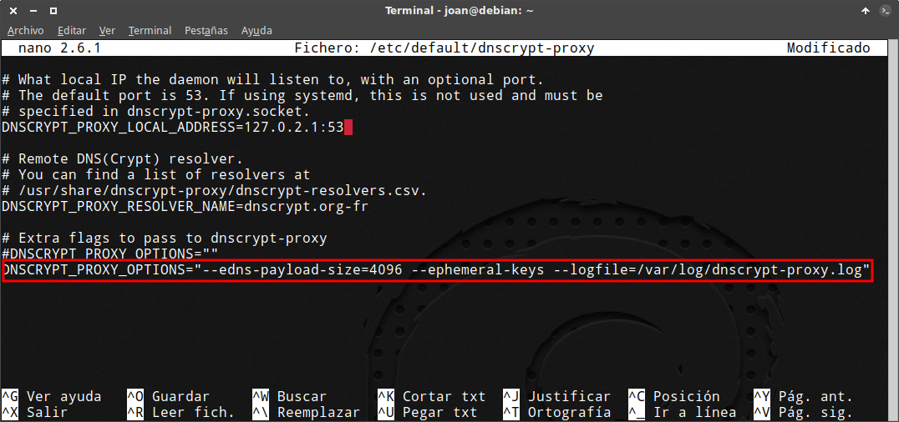](images/Configuración-con-opciones-de-DNSCrypt.png) Muestra de mi fichero de configuración final de DNSCrypt\[/caption\]

Cada una de las opciones de funcionamiento introducidas tiene el siguiente significado:

**\--edns-payload-size=4096:** Opción para habilitar el mecanismo DNSSEC y de este modo obtener protección frente ataques DNS poisoning. 4096 bytes es el tamaño máximo de respuesta que aceptaremos del servidor DNS.

**\--ephemeral-keys:** DNSCrypt siempre usa la misma clave pública para establecer una conexión cifrada con el servidor DNS. Esto en términos de privacidad es malo porque nuestra clave pública puede ser asociada a nuestra IP. Para evitar este problema introducimos el parámetro --ephermal-keys. Introduciendo el parámetro --ephermal-keys cada petición DNS se realizará mediante una clave diferente. De este modo será prácticamente imposible asociar nuestra IP con las peticiones DNS. Esta opción comporta un consumo de CPU adicional que en algunos casos puede llegar a ralentizar nuestro ordenador.

**\--logfile=/var/log/dnscrypt-proxy.log:** Instrucción para indicar la ubicación donde queremos guardar los log de DNSCrypt.

Una vez introducidas las opciones guardamos los cambios y cerramos el fichero.

#### Dar permisos adecuados al usuario \_dnscrypt

En el apartado anterior hemos definido que queremos guardar el log de DNSCRypt en la ubicación **var/log/dnscrypt-proxy.log**  y esto generará un problema por el siguiente motivo.

Dnscrypt por defecto usa el usuario **\_dnscrypt-proxy**. Este usuario no tiene permisos para crear y para escribir en el archivo de logs **var/log/dnscrypt-proxy.log**.

Para solventar este punto creamos el archivo **/var/log/dnscrypt-proxy.log** ejecutando el siguiente comando en la terminal:

> ```
> sudo touch /var/log/dnscrypt-proxy.log
> ```

Seguidamente asignamos un usuario y un grupo al archivo que contendrá los log ejecutando este comando en la terminal:

> ```
> sudo chown _dnscrypt-proxy:nogroup /var/log/dnscrypt-proxy.log
> ```

La función que realiza cada uno de los términos del comando es el siguiente:

**sudo chown:** Es el comando usado para modificar los permisos de archivos y carpetas.

**\_dnscrypt-proxy:nogroup:** **\_dnscrypt-proxy** es el nombre usuario al que queremos que pertenezca el archivo dnscrypt-proxy.log. nogroup es el grupo al que queremos que pertenezca el archivo **dnscrypt-proxy.log**

**var/log/dnscrypt-proxy.log:** Es la ruta del archivo en que queremos modificar el usuario y el grupo.

Una vez realizados los cambios pertinentes reiniciamos dnscrypt ejecutando el siguiente comando en la terminal:

> ```
> sudo systemctl restart dnscrypt
> ```

En este momento el proceso para configurar DNSCrypt ha terminado.

## CONFIGURAR DNSCRYPT EN EL CASO QUE LO HAYAMOS INSTALADO A PARTIR DE UNA COMPILACIÓN

En el caso que se haya instalado DNSCrypt compilando el código fuente del programa, tenemos que seguir las siguientes instrucciones para configurar DNSCrypt.

### Seleccionar un servidor DNS de DNSCrypt

Para seleccionar el servidor DNS abrimos una terminal y ejecutamos el siguiente comando:

> ```
> nano /usr/local/share/dnscrypt-proxy/dnscrypt-resolvers.csv
> ```

###### Nota: Si no tenemos disponible el archivo dnscrypt-resolvers.csv, también podemos consultar servidores DNSCrypt disponibles en la siguiente [URL](https://github.com/jedisct1/dnscrypt-proxy/blob/master/dnscrypt-resolvers.csv "URL para ver los servidores DNSCRypt disponibles").

[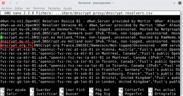](images/porveeedores-DNS-disponibles.png)

Una vez ejecutado el comando obtendremos al totalidad de servidores DNS disponibles.

Elegimos el que nos parezca más oportuno. En mi caso elijo el servidor **dnscrypt.org-fr** por los siguientes motivos:

1. No guarda Logs.
2. Dispone de validación DNSSEC.
3. Es cercano geográficamente.

### Crear un grupo para usar DNSCrypt

Crearemos un grupo llamado dnscrypt que contendrá el usuario que ejecutará DNSCrypt.

Para ello ejecutamos el siguiente comando en la terminal:

> ```
> sudo groupadd dnscrypt
> ```

### Crear un usuario para usar DNSCrypt

En términos de seguridad es recomendable que DNSCrypt sea usado por un usuario que no tenga privilegios, que no tenga acceso a la shell y que disponga de una carpeta home vacía.

Los pasos a seguir para crear este tipo de usuario son los siguientes:

Primero crearemos la carpeta del usuario ejecutando el siguiente comando en la terminal

> ```
> sudo mkdir /home/dnscrypt
> ```

Para finalizar crearemos el nuevo usuario llamado dnscrypt ejecutando el siguiente comando en la terminal.

> ```
> sudo useradd -g dnscrypt -s /bin/false -d /home/dnscrypt dnscrypt
> ```

El significado de cada una de las partes del comando para crear el usuario dnscrypt es el siguiente:

**sudo useradd:** Comando usado para agregar un usuario.

**\-g dnscrypt:** Para indicar que el usuario que estamos creando pertenece al grupo dnscrypt.

**\-s /bin/false:** Para definir que el usuario Dnscrypt no tenga acceso a la terminal o interprete de comandos. Este aspecto es importante por temas de seguridad.

**\-d /home/dnscrypt:** Para indicar la ruta home por defecto del usuario que estamos creando para DNSCRypt.

**dnscrypt:** Es el nombre del usuario que queremos crear.

### Iniciar DNSCrypt

Una vez seleccionado el servidor que queremos usar y creado el usuario, ya podemos configurar el inicio de DNSCrypt.

Para ello ejecutamos el siguiente comando en la terminal:

> ```
> sudo nano /etc/rc.local
> ```

Una vez ejecutado el comando se abrirá el editor de texto nano y deberemos añadir el siguiente comando en el archivo rc.local:

> ```
> dnscrypt-proxy --local-address=127.0.0.1:53 --resolver-name=dnscrypt.org-fr
> ```

No obstante si queremos podemos modificar el comando para añadir opciones adiciones como por ejemplo las siguientes:

> ```
> dnscrypt-proxy --local-address=127.0.0.1:53 --edns-payload-size=4096 --ephemeral-keys --daemonize --resolver-name=dnscrypt.org-fr --user=dnscrypt --logfile=/var/log/dnscrypt-proxy.log
> ```

Una vez introducido el comando se guardan los cambios y cerramos el fichero.

\[caption id="attachment\_7253" align="alignnone" width="472"\][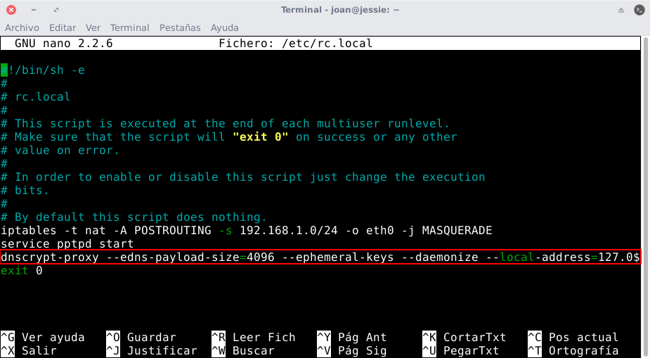](images/Iniciar-DNSCrypt.png) Muestra de la introducción del comando para configurar dnscrypt\[/caption\]

#### Explicación del significado de los parámetros para iniciar DNSCrypt

El significado de los parámetros del comando usado para iniciar DNSCrypt es el siguiente:

**dnscrypt-proxy:** Parte del comando para iniciar DNSCrypt.

**\--local-address=127.0.0.1:53:** Estoy indicando que DNSCrypt esté escuchando en la IP local 127.0.0.1 y en el puerto 53. Si queremos podemos modificar la IP 127.0.0.1 por otra del tipo 127.x.x.x, y el puerto 53 por cualquier otro puerto que no esté en uso.

**\--edns-payload-size=4096:** Parte del comando para habilitar el mecanismo DNSSEC y de este modo obtener protección frente ataques DNS poisoning. 4096 bytes es el tamaño máximo de la respuesta que aceptaremos del servidor DNS.

**\--ephemeral-keys:** DNSCrypt siempre usa la misma clave pública para establecer una conexión cifrada con el servidor DNS. Esto en términos de privacidad es malo porque nuestra clave pública puede ser asociada a nuestra IP. Para evitar este problema introducimos el parámetro --ephermal-keys. Introduciendo el parámetro --ephermal-keys cada petición DNS se realizará mediante una clave diferente. De este modo será prácticamente imposible asociar nuestra IP con las peticiones DNS. Esta opción comporta un consumo de CPU adicional que en algunos casos puede llegar a ralentizar nuestro ordenador.

**\--daemonize:** Parte del comando usada para indicar que DNSCrypt se ejecute en segundo plano.

**\--resolver-name=dnscrypt.org-fr:** Parte del comando usada para indicar el servidor de DNSCrypt que queremos usar. Si queremos usar un servidor diferente al dnscrypt.org-fr tan solo tenemos que reemplazar dnscrypt.org-fr por el servidor que queramos.

**\--user=dnscrypt:** Comando para indicar el usuario que iniciará DNSCrypt. En nuestro caso lo iniciará el usuario dnscrypt que hemos creado anteriormente.

**\--logfile=/var/log/dnscrypt-proxy.log:** Instrucción para indicar la ubicación donde queremos guardar los log de DNSCrypt.

###### Nota: Si omitimos el comando \--logfile=/var/log/dnscrypt-proxy.log los logs se guardarán en /var/log/syslog

###### Nota: Si no establecemos ningún usuario, DNSCrypt será iniciado por el usuario root.

### Configurar el gestor de red para que use DNSCrypt

En estos momentos sabemos que DNSCrypt está escuchando en la IP **127.0.0.1**.

Por lo tanto accedemos a la configuración de nuestro gestor de red y reemplazamos los DNS actuales por la dirección en que está escuchando DNSCrypt.

Una vez dentro del gestor de red, en mi caso pasaré de tener la siguiente configuración:

[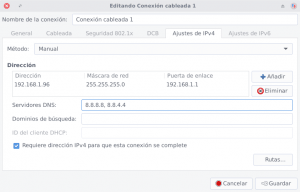](images/Configuración-inicial-del-Gestor-de-Red.png)

A tener la siguiente configuración:

[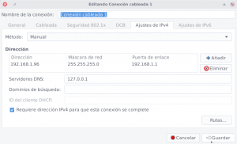](images/Configuración-gestor-de-red-para-DNSCrypt.png)

En estos momentos acaba de finalizar la totalidad del procedimiento para configurar DNSCrypt.

Ahora tan solo tenemos que reiniciar nuestro ordenador y DNSCrypt estará listo para usarse.

## COMPROBAR EL FUNCIONAMIENTO DE DNSCRYPT

Para comprobar que DNSCrypt está funcionando de forma adecuada pueden seguir las instrucciones del siguiente enlace:

https://geekland.eu/comprobar-el-funcionamiento-de-dnscrypt/

## CONFIGURAR DNSCRYPT PARA QUE TRABAJE CONJUNTAMENTE CON DNSMASQ

En el caso que pretendan usar DNSmasq para mejorar el rendimiento de DNSCrypt pueden seguir las instrucciones que encontrarán en el siguiente enlace:

https://geekland.eu/usar-dnsmasq-mejorar-rendimiento-dnscrypt/
