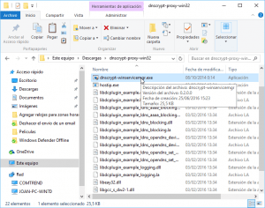
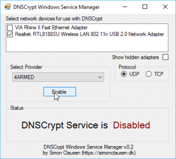
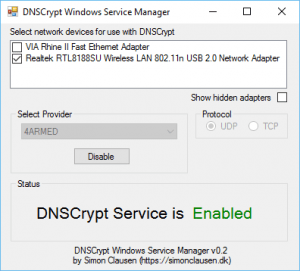
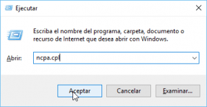
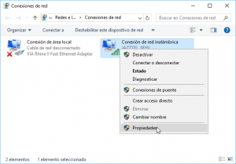
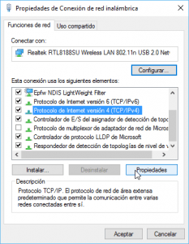
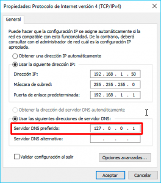
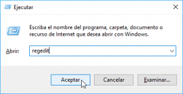
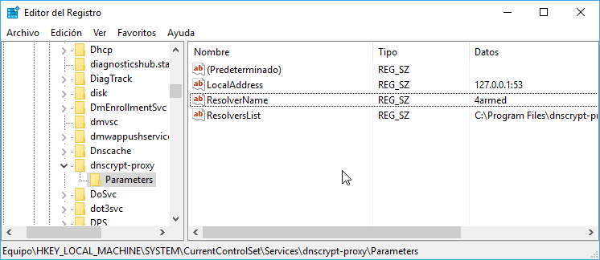
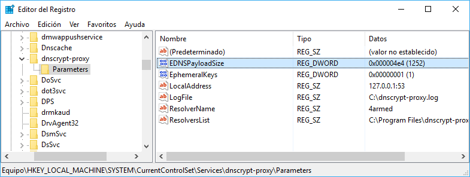

Semanas atrás escribimos un artículo en el que se detallaba el procedimiento a seguir para [instalar DNSCrypt en Windows](). Ahora en el presente artículo veremos los pasos a seguir para configurar DNSCrypt en Windows<!--more-->

## CONFIGURAR DNSCRYPT EN WINDOWS

Para configurar DNSCrypt en windows tenemos que acceder a la carpeta en la que lo instalamos que en mi caso es la **C:\\Program Files\\dnscrypt-proxy-win32**.

Una vez dentro de la carpeta abrimos DNSCrypt haciendo doble click en el archivo **dnscrypt-winservicemgr.exe**

[](images/Abrir-DNSCrypt.png)

Después de abrir el programa seleccionamos el adaptador de red que está en uso, el servidor DNS que queremos usar y el protocolo que usará DNSCrypt.

En mi caso las opciones seleccionadas son las siguientes:

1. Como siempre me conecto vía Wifi selecciono el adaptador de red inalámbrico. Si quieren pueden seleccionar todas los adaptadores y de esto modo estarán seguros que siempre usan DNSCrypt.
2. El servidor DNS seleccionado es **4ARMED** porque no guarda logs, utiliza la validación DNSSEC y es cercano geográficamente.
3. Elijo el protocolo UDP porque es el protocolo más habitual para resolver las peticiones DNS.

\[caption id="attachment\_7354" align="alignnone" width="300"\][](images/Mi-configuración-de-DNSCrypt.png) Muestra de la configuración Aplicada en mi caso\[/caption\]

###### Nota: Para encontrar información sobre los servidores que ofrece DNSCrypt pueden visitar la siguiente [URL](https://github.com/jedisct1/dnscrypt-proxy/blob/master/dnscrypt-resolvers.csv "URL en la que se detalla las características de los servidores de DNSCrypt") o los archivos de la carpeta en que están los archivos de DNSCrypt.

## ACTIVAR DNSCRYPT EN WINDOWS

Una vez finalizada la configuración tan solo tenemos que presionar encima del botón **Enable**.

[](images/Activar-DNSCrypt.png)

Una vez presionado el botón DNSCrypt se activará y podremos visualizar la frase **DNSCrypt Service is Enabled**.

[](images/DNSCrypt-habilitado.png)

Una vez activado, DNSCrypt ya está funcionando sin ningún tipo de problema.

Con estos simples pasos podemos configurar DNSCrypt en Windows de forma muy sencilla. Además la próxima vez que reiniciemos el ordenador DNSCrypt se iniciará de forma completamente automática.

## COMPROBAR QUE LA CONFIGURACIÓN DEL ADAPTADOR DE RED ES CORRECTA

En estos momentos DNSCrypt debe estar funcionando, no obstante procederemos a comprobar que nuestro adaptador de red está bien configurado.

Para ello presionamos la combinación de teclas **Win+R**.

Una vez aparezca la ventana de Ejecutar introducimos el texto **ncpa.cpl** y presionamos el botón **Aceptar**.

[](images/Acceder-a-la-configuración-del-adaptador-de-red.png)

En la ventana **Conexiones de Red** seleccionamos nuestro adaptador de red, presionamos el botón derecho del ratón y clicamos en la opción **Propiedades** del menú contextual.

[](images/Acceder-a-las-propiedades-del-adaptador-de-red.png)

En las propiedades de nuestro adaptador de seleccionamos la opción **Protocolo de Internet versión 4 (TCP/IPv4)** y presionamos el botón **Propiedades**.

[](images/Acceder-a-las-propiedades.png)

Finalmente comprobamos que en el campo Servidor DNS preferido hay la IP **127.0.0.1**.

[](images/Configuración-del-gestor-de-red-para-DNSCrypt.png)

En el caso poco probable que hubiera otra IP diferente a la **127.0.0.1** la tendrán que modificar manualmente y presionar el botón **Aceptar**.

## OPCIONES ADICIONALES PARA CONFIGURAR DNSCRYPT EN WINDOWS

###### Nota: Este apartado es opcional y solo se recomienda que lo apliquen usuarios de nivel medio/avanzado.

Si queremos podemos incluir opciones adicionales para configurar DNSCrypt en Windows. Para ello presionamos la combinación de teclas **Win+R**.

Cuando aparezca la ventana de ejecutar escribimos **regedit** y presionamos el botón **Aceptar**.

[](images/Acceder-al-registro-del-sistema.png)

Una vez dentro del registro del sistema navegamos hacia la siguiente ruta.

> ```
> HKEY_LOCAL_MACHINE\SYSTEM\CurrentControlSet\services\dnscrypt-proxy\Parameters
> ```

Una vez dentro de la ruta mencionada verán las siguientes entradas en el registro:

[](images/Entradas-iniciales-en-el-registro-DNSCrypt.png)

Lo primero que vemos es que modificando los valores de las entradas podemos modificar los siguientes aspectos:

1. La IP local en la que está escuchando DNSCrypt.
2. El servidor DNS que utiliza DNSCrypt. Este valor también lo podemos modificar a través de la interfaz gráfica.

Además podemos añadir entradas adicionales en el registro de DNSCrypt para modificar su funcionamiento.

### Entradas adicionales que podemos añadir al registro de DNSCrypt

Algunas de las entradas adicionales que podemos incluir en el registro de DNSCrypt son las siguientes:

#### Plugins (REG\_MULTI\_SZ)

Opción para añadir prefiltros y postfiltros a las peticiones DNS realizadas al servidor.

Los prefiltros actuarán antes de cifrar el contenido y enviar la petición DNS al servidor DNS.

Los postfiltros se aplicarán una vez se descifre la respuesta enviada por el servidor DNS.

###### Nota: En mi caso no utilizo esta opción. Quien precise mayor información sobre cómo usar los plugins puede consultar el siguiente [enlace](https://github.com/jedisct1/dnscrypt-proxy/blob/master/README-PLUGINS.markdown "Explicación de los plugins de DNSCrypt").

#### LogFile (REG\_SZ)

Entrada para indicar la ubicación donde queremos guardar los log de DNSCrypt. En mi caso elegiré la ubicación **C:\\dnscrypt-proxy.log**

#### EDNSPayloadSize (DWORD)

Entrada que sirve para determinar el tamaño máximo de respuesta que recibiremos por parte del servidor DNS.

En mi caso fijaré el valor de la entrada **ENSPayloadSize** en **1252** bytes.

#### MaxActiveRequests (DWORD)

Nunca he utilizado este parámetro porque en principio en mi caso no resulta útil.

Este parámetro delimita el número máximo de peticiones activas al servidor DNS. Si no introducimos este parámetro en el registro, DNSCrypt considerará que el número máximo de peticiones son 250.

#### TCPOnly (DWORD)

Este parámetro es para forzar que la totalidad de peticiones DNS se hagan a través del protocolo TCP.

Usando el protocolo TCP las peticiones DNS se resuelven de forma más lenta pero más segura.

En el caso poco probable que tengamos que lidiar con respuestas de peticiones DNS mayores a 512 bytes deberemos activar está opción.

Esta opción también puede ser útil en el caso que estemos detrás una red que por ejemplo bloquee todo el tráfico excepto en los puertos 80 y 443 mediante el protocolo TCP.

#### ClientKeyFile (REG\_SZ)

Existen servidores que están configurados para responder las peticiones de los clientes que dispongan de una clave pública determinada.

La entrada ClientKeyFile servirá para introducir la ruta del archivo que contiene la clave pública del servidor DNS. En mi caso nunca he utilizado esta opción.

#### ProviderKey (REG\_SZ)

Existen servidores que están configurados para únicamente responder las peticiones de los clientes que dispongan de una clave pública determinada.

La entrada ClientKeyFile servirá para introducir directamente la clave pública del servidor DNS. En mi caso nunca he utilizado esta opción.

#### EphemeralKeys (DWORD)

DNSCrypt siempre usa la misma clave pública para establecer una conexión cifrada con el servidor DNS. Esto en términos de privacidad es malo porque nuestra clave pública puede ser asociada a nuestra IP.

Para evitar este problema **introducimos la entrada Ephermeralkeys con el valor 1**.

Activando EphemeralKeys, cada petición DNS se realizará mediante una clave diferente. De este modo será prácticamente imposible asociar nuestra IP con las peticiones DNS.

Esta opción comporta un consumo de CPU adicional que en algunos casos puede llegar a ralentizar nuestro ordenador.

### Introducir las entradas adicionales en el registro

En mi caso solo introduciré 3 entradas adicionales que son las que acostumbro a usar.

-  **Logfile** del tipo **valor de Cadena**. Esta entrada en mi caso tiene el valor. C:\\dnscrypt-proxy.log
- **EDNSPayloadSize** del tipo **Valor de Dword (32 bits)** con un valor Decimal de 1252. Si fijamos un valor de 512 o inferior a 512 estaremos desactivando esta opción.
- **EphemeralKeys** del tipo **Valor de Dword (32 bits)** con un valor de 1. Si en vez de usar un valor 1 usamos el valor 0 desactivaremos esta opción.

Una vez introducidas las entradas mencionadas en el registro tendrá el siguiente aspecto:

[](images/Valores-finales-del-registro-de-DNSCrypt.png)

### Reiniciar el servicio DNSCrypt

Una vez introducidos los parámetros adicionales en el registro reiniciaremos el servicio DNSCrypt.

Para ello lo único que tenemos que realizar es reiniciar nuestro ordenador.

###### Nota; No es la forma más elegante para reiniciar un servicio. No obstante tratándose de un tutorial he creído conveniente aplicar este método.

## COMPROBAR QUE DNSCRYPT FUNCIONA DE FORMA CORRECTA

Finalmente ya solo nos queda comprobar que DNSCrypt está funcionando de forma adecuada. Para ello podemos seguir las instrucciones detalladas en el siguiente enlace:

https://geekland.eu/comprobar-el-funcionamiento-de-dnscrypt/
