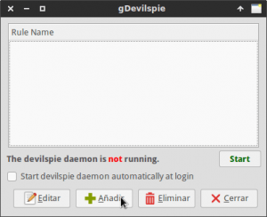
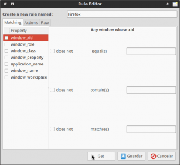
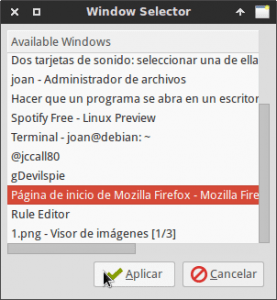
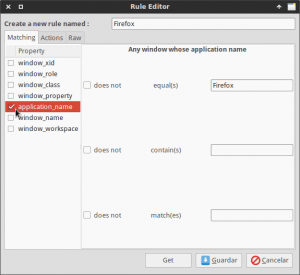
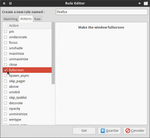
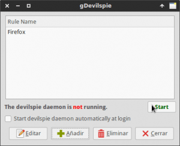
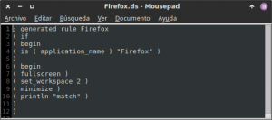
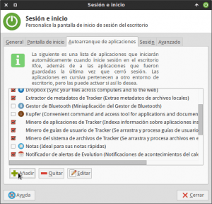
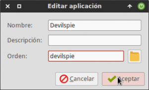

En este post veremos como usar devilspie para configurar el comportamiento de nuestras ventanas y de este modo conseguir ciertos propósitos como por ejemplo los siguientes:<!--more-->

1. Que siempre que iniciamos un programa se abra en un escritorio determinado.
2. Que cuando se abra un programa lo haga en modo pantalla completa.
3. Que cuando se abra un programa se ejecuten de forma automática una serie de instrucciones o scripts ya sea en primer plano o en segundo plano.
4. Que cuando se abra la ventana de un programa lo haga en una zona concreta de nuestra pantalla.
5. Que cuando se abra la ventana de un programa tenga unas dimensiones determinadas.
6. etc.

## ¿QUE ES DEVILSPIE?

Devilspie es **un demonio que sirve para que nosotros podamos configurar el comportamiento que tendrán las ventanas de los programas que nosotros abrimos** en nuestro ordenador.

De esta forma en todo momento podremos controlar como se ven y como se comportan nuestras aplicaciones.

## EXPLICACIÓN DEL FUNCIONAMIENTO DE DEVILSPIE

**Devilspie dispone de una serie de archivos de configuración** con extensión .ds ubicados en la carpeta ~/.devilspie. En el momento que se abre una ventana determinada y existe un archivo de configuración para ella, se ejecutaran las acciones especificadas dentro de los archivos de configuración.

Así por lo tanto, **en el caso de tener un archivo de configuración para Firefox, en el momento de abrirse la ventana de Firefox se aplicarán las acciones definidas dentro del archivo de configuración de Devilspie**.

## INSTALAR DEVILSPIE

Lo más probable es que Devilspie esté disponible en los repositorios de vuestra distribución Linux. Por lo tanto para instalarlo tan solo hay que **abrir una terminal y ejecutar el siguiente comando**:

> ```
> sudo apt-get install devilspie gdevilspie
> ```

El paquete devilspie corresponde al programa que nos permitirá controlar como se abren nuestras ventanas.

El paquete gdevilspie es una interfaz gráfica para que nosotros podamos realizar las configuraciones y definir como se abrirán nuestras ventanas. A pesar de que la interfaz gráfica nos puede limitar a la hora de realizar ciertas tareas, cabe decir que para empezar a trabajar y aprender el funcionamiento de devilspie nos puede ayudar enormemente.

## EMPEZAR A USAR DEVILSPIE

Una vez instalado Devilspie ya podemos empezar a usarlo. Para aprender a usarlo mostraremos varios ejemplos. El primero de ellos será con todo lujo de detalles, mientras que el resto me limitaré a mostrar el código para realizar la función que queremos realizar.

### Hacer que Firefox se abra en pantalla completa en la área de trabajo 2

El primer paso a realizar para configurar esta acción es **abrir el navegador Firefox**.

Seguidamente hay que abrir la interfaz gráfica de configuración de Devilspie. Para ello **en la terminal ejecutamos el siguiente comando**:

> ```
> gdevilspie
> ```

A continuación tenemos que iniciar el proceso para configurar las acciones a realizar cuando abrimos Firefox. Para ello, tal y como se puede ver en la captura de pantalla **clicamos encima del botón Añadir**.

[](images/Añadir-Regla-en-Devilspie.png)

#### Definir cuando se tiene que ejecutar la acción configurada

Después de presionar el botón añadir aparecerá la siguiente ventana en la que tendremos que definir cuando se aplicaran las acciones que vamos a configurar. Para ello, tal y como se puede ver en la captura de pantalla, **el primer paso** a realizar **es seleccionar un nombre para la acción que estamos creando que en mi caso llamaré Firefox**.

[](images/Introducir-el-nombre-de-la-regla.png)

**Como segundo paso** debemos introducir las propiedades de la ventana en la que queremos aplicar las acciones que configuraremos a posteriori. Para ello **presionamos el botón Get**. Seguidamente, tal y como se puede ver en la captura de pantalla, **seleccionamos la ventana en que queremos aplicar las acciones**, que en mi caso es Firefox, y finalmente **presionamos tecla Aplicar**.

[](images/Seleccionar-ventana-para-obtener-sus-propiedades-1.png)

**El tercer paso consiste en seleccionar cuando se aplicará la acción que vamos a configurar**. En mi caso, tal y como se puede ver en la captura de pantalla, **como quiero que la acción se ejecute cada vez que inicio Firefox entonces tildo la celda** **applicaction\_name**.

[](images/Seleccionar-cuando-se-aplicará-la-regla.png)

###### Nota: En el ejemplo que estamos realizando lo único que tenemos que realizar en el paso 3 es tildar la opción correspondiente. El nombre de la aplicación aparece de forma automática porque en el paso 2 de este apartado ya hemos introducido de forma automática las propiedades de la ventana.

###### Nota: Si os fijáis en la parte derecha de cada una de las opciones podemos seleccionar opciones adicionales para especificar cuando se iniciará la acción configurada.

#### Definir la acción/es que queremos realizar al abrir Firefox

Una vez ya hemos definido cuando queremos que se aplique la acción, **la siguiente tarea es definir lo que queremos que pase una vez se abra Firefox**. En nuestro caso queremos que cuando se abra Firefox lo haga en modo pantalla completa y en el escritorio número 2. Para ello, tal y como se puede **Clicamos encima de la pestaña Actions** y seguidamente **tildamos la acción fullscreen** que es la que hará que Firefox se abra en pantalla completa.

[](images/Configurar-comportamiento-de-las-ventanas.png)

Seguidamente, tal y como se muestra en la captura de pantalla, **seleccionaremos el escritorio en el que se abrirá Firefox tildando el campo set\_workspace e indicando que se inicie en el escritorio número 2**. Finalmente una vez realizada la configuración tan solo hay que **presionar el botón Guardar**.

#### Ejecutar Devilspie para poder aplicar nuestra configuración

Para que se aplique la acción que acabamos de configurar, tal y como podemos ver en la captura de pantalla, tenemos que **presionar el botón Start** y seguidamente ya podemos comprobar su funcionamiento abriendo Firefox.

[](images/Iniciar-devilspie.png)

Si todo funciona adecuadamente, en el momento de abrir Firefox se abrirá en el escritorio número 2 en modo pantalla completa.

#### Consultar el código generado por la interfaz gráfica

Si queremos ver el código que hemos generado mediante la interfaz gráfica tan solo tienen que introducir el siguiente comando en la terminal.

> ```
> mousepad ~/.devilspie/Firefox.ds
> ```

###### Nota: La ubicación de la totalidad de archivos de configuración de Devilspie es ~/.devilspie.

El resultado obtenido será el siguiente:

[](images/Código-generado.png)

#### Hacer que devilspie se ejecute de inicio

Para que se ejecute la acción que acabamos de configurar Devilspie tiene que estar activo. Para no tener que estar activando constantemente Devilspie vamos a configurar que se inicie de forma automática cada vez que se inicie la sesión.

Para ello **abrimos una terminal y ejecutamos el siguiente comando**:

> ```
> xfce4-session-settings
> ```

Una vez ejecutado el comando aparecerá la siguiente ventana en la que tendremos que **seleccionar la pestaña Autoarranque de aplicaciones**.

[](images/Sesion-inicio.png)

Una vez dentro de la pestaña de autoarranque de aplicaciones debemos **comprobar si existe una aplicación llamada Devilspie**. **En el caso de existir y estar tildada el proceso ha terminado** y no hay que hacer nada más. **En el caso que no exista debemos** **clicar el botón Añadir** y seguidamente, tal y como se muestra en la captura de pantalla, **rellenar los campos Nombre y Orden con la palabra devilspie**, tal y como se muestra en la siguiente captura de pantalla.

[](images/Iniciar-automático-de-Devilspie.png)

Una vez rellenados los campos tan solo hay que **presionar el botón Aceptar**.

###### Nota: Este apartado solamente es útil para los usuarios que utilicen el entorno de escritorio XFCE. En el caso de usar un entorno de escritorio diferente deberán buscar como realizar los pasos equivalentes.

### Abrir una terminal embebida sin decoración en los 4 escritorios

En el caso que quieran una terminal centrada en el centro de cada uno de los escritorios que tenemos, sin la barra que contiene los botones de las ventanas y que no aparezca en la lista de programas ni en el paginador podemos realizar lo siguiente.

**Abrimos una terminal y tecleamos el siguiente comando**:

> ```
> nano ~/.devilspie/terminal.ds
> ```

Seguidamente cuando se abra el editor de textos nano **pegamos el siguiente código**:

> ```
> ; generated_rule Terminal
> ( if 
> ( begin 
> ( is ( application_name ) "Terminal de Xfce" )
> ) 
> ( begin 
> ( pin )
> ( undecorate )
> ( skip_pager )
> ( skip_tasklist )
> ( wintype "utility" )
> ( center )
> ( println "match" )
> )
> ```

###### Nota: La parte en rojo del texto la deberéis reemplazar en función de la terminal que uséis. En mi caso como uso de la XFCE tengo que poner Terminal de Xfce.

Una vez pegado el texto **guardamos los cambios y cerramos el fichero**. **Finalmente** tan solo tenemos que reiniciar devilspie, para ello **podemos reiniciar el ordenador o abrir una terminal y ejecutar los siguientes comandos**:

> ```
> killall devilspie ; devilspie &
> ```

Una vez ejecutado el comando **presionamos la tecla Enter** **y** seguidamente **ejecutamos el siguiente comando**:

> ```
> disown -h %1
> ```

### Que al abrir el navegador Firefox se abra Writer de Libreoffice

En el caso que queramos que cada vez que se abra Firefox también se abra Libreoffice Writer de forma automática, tan solo hay que **abrir la terminal y teclear el siguiente comando**:

> ```
> nano ~/.devilspie/writer.ds
> ```

Seguidamente cuando se abra el editor de textos nano **pegamos el siguiente código**:

> ```
> ; generated_rule writer
> ( if 
> ( begin 
> ( is ( application_name ) "Firefox" )
> ) 
> ( begin 
> ( maximize )
> ( spawn_async "libreoffice --writer " )
> ( above )
> ( maximize_vertically )
> ( maximize_horizontally )
> ( println "match" )
> )
> )
> ```

Una vez pegado el texto **guardamos los cambios y cerramos el fichero**. Finalmente tan solo tenemos que reiniciar devilspie, para ello podemos **reiniciar el ordenador o abrir una terminal y ejecutar los siguientes comandos**:

> ```
> killall devilspie ; devilspie &
> ```

Una vez ejecutado el comando **presionamos la tecla Enter** **y** seguidamente **ejecutamos el siguiente comando**:

> ```
> disown -h %1
> ```

## OTROS EJEMPLOS DE LO QUE SE PUEDE REALIZAR CON DEVILSPIE

Quien quiera obtener más ejemplos y más información de lo que se puede realizar con Devilspie, tan solo tiene que consultar el siguiente enlace:

[https://foosel.org/linux/devilspie](https://foosel.org/linux/devilspie "Explicación del funcionamiento de Devilspie")

## OPCIONES ALTERNATIVAS A DEVILSPIE

Actualmente devilspie está descontinuado. A pesar de todo a mi funciona a la perfección, no me genera ningún problema y es muchísimo más fácil de utilizar que otras opciones alternativas.

En el caso que a alguien no esté satisfecho con las prestaciones ofrecidas por Devilspie puede probar otras alternativas como por ejemplo [Devilspie 2](http://www.gusnan.se/devilspie2/ "Alternativa a Devilspie") o [Kpie](https://github.com/skx/kpie/ "Otra alternativa a Devilspie").
