Como continuación del post de la semana pasada esta semana vamos a ver como podemos configurar el firewall gufw en linux de forma fácil y rápida. De esta forma en principio se cierra una serie de 2 post que son los siguientes:

1. [**Qué son y para que sirven los Firewall.**]()
2. **Como configurar nuestro firewall adecuadamente.**

<!--more-->

## INTRODUCCIÓN

Todos los sistemas GNU-Linux, a partir de la versión de kernel 2.4, disponen de un firewall integrado en el Kernel que se llama [**Netfilter**](http://es.wikipedia.org/wiki/Netfilter/iptables "Firewall Netfilter"). Esto significa que el firewall está integrado en el mismo corazón del sistema operativo.

Para la configuración de **Netfilter** existe una herramienta que se llama **Iptables** que servirá para introducir las reglas de filtrado mediante una serie de comandos.

Para crear las reglas de iptables deberíamos abrir un fichero de texto con el nombre iptables y crear un script que contenga la totalidad de reglas que queremos que implemente nuestro firewall. Una vez creado el script tan solo tendríamos que darle los permisos correspondientes, guardarlo en /etc/init.d y ejecutarlo con el siguiente comando:

> ```
> /etc/init.d/iptables start
> ```

Pero para usuarios recién llegados a linux no hace falta complicarse tanto la vida. Existen interfaces gráficas para poder introducir las reglas más habituales. Como mínimo existen 2 interfaces que son **Firestarter y Gufw**. Les recomiendo el uso de **Gufw** por su simplicidad. Además Firestarter es un proyecto que hoy en día está más muerto que vivo.

## INSTALAR GUFW

Como hemos comentado anteriormente las reglas del firewall las configuraremos con Gufw. Lo primero que tenemos que hacer es instalar Gufw. Para instalar Gufw abrimos una terminal y tecleamos:

> ```
> sudo apt-get install gufw
> ```

Aunque hayamos instalado gufw el firewall aún sigue inactivo ya que en la mayoría de distros GNU/Linux el firewall viene desactivado por defecto permitiendo la totalidad de tráfico tanto entrante como saliente. Para poner un breve ejemplo de lo acabo de decir tan solo tenéis que abrir una terminal y teclear el siguiente comando:

> ```
> sudo ufw status
> ```

El resultado que obtendréis es el siguiente:

[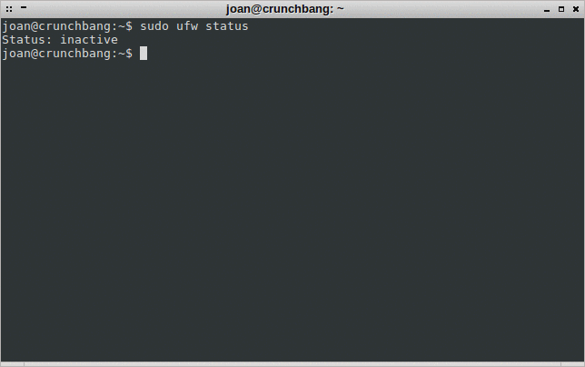](images/Firewall-inactivo.png)

Como se puede leer en la captura de pantalla el estado del firewall **ufw** está en inactivo.

Para reconfirmar que el firewall **Netfilter** no dispone de ninguna regla predefinida podemos teclear el siguiente comando en la terminal:

> ```
> sudo iptables -L
> ```

Y el resultado que obtendréis será el siguiente:

[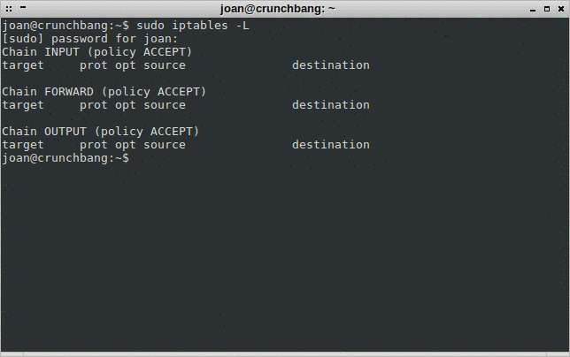](images/Firewall-desactivado.png)

Como se puede ver en la captura de pantalla la totalidad de tráfico existente es aceptado tanto en dirección de entrada como en dirección de salida. Por lo tanto en el estado actual en el caso que un atacante consiguiera acceso root a nuestro equipo podría causar graves daños en nuestro equipo.

## ACTIVAR EL FIREWALL

Una vez instalado ufw lo vamos a activar. Para activar ufw tan solo tenemos que abrir una terminal e introducir el siguiente comando:

> ```
> sudo gufw
> ```

Se abrirá la siguiente pantalla:

[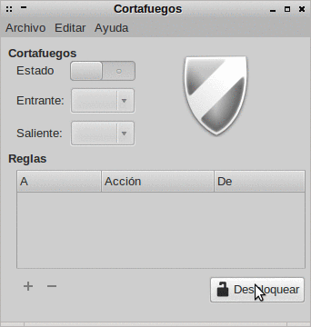](images/Desbloquar-Firewall.png)

Seguidamente tenemos que clicar sobre el botón desbloquear. Una vez desbloqueado el sistema ya podemos Activar el firewall.

[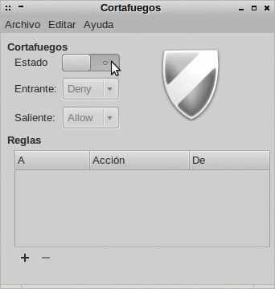](images/Activar-el-Firewall.png)

Para activar el firewall, como se puede ver en la captura de pantalla, tan solo tenemos que clicar encima del botón **Estado**. Seguidamente el Firewall se activará. Para comprobar que se ha activado tan solo tenemos que abrir una terminal y teclear el siguiente comando:

```
sudo ufw status
```

El resultado obtenido será el siguiente:

[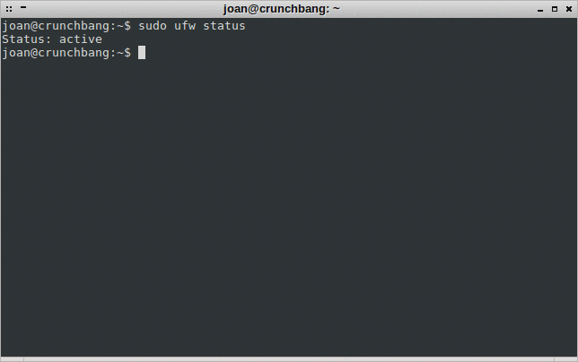](images/Comprobación-Firewall-Activado.png)

Como se puede ver el firewall ya está activado y protegiendo nuestro equipo.

## CONFIGURACIÓN ESTÁNDAR DEL FIREWALL

Una vez se ha activado el firewall ufw este ya dispondrá de una configuración predefinida que será válida para la gran mayoría de usuarios domésticos.

[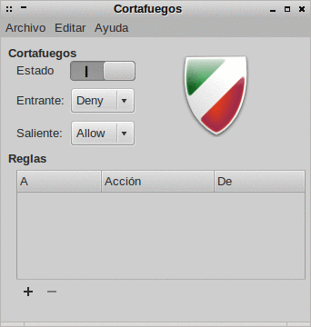](images/Configuración-estandar.png)

Como se puede ver en la captura de pantalla la configuración standard de **ufw** bloquea la totalidad de tráfico entrante y permite la totalidad de tráfico saliente. Pero que quiere decir esto?

**Bloquear el tráfico entrante quiere decir** que cuando alguien haga una petición a nuestra red , servidor u ordenador está será rechazada. Así por ejemplo si intento establecer una conexión ssh a un ordenador que está protegido por un firewall obtendré el siguiente resultado:

[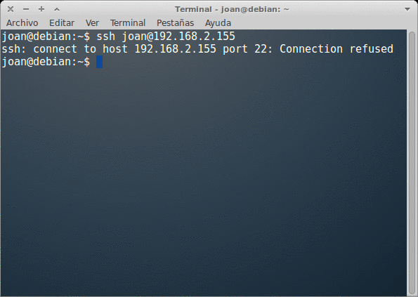](images/conexión-ssh-rechazada.png)

Como se puede ver en la captura de pantalla la conexión se ha rechazado porqué el firewall del equipo al que me quiero conectar no admite conexiones entrantes.

**Aceptar el tráfico saliente quiere decir** que nosotros desde nuestro ordenador podremos realizar cualquier tipo de petición a servidores, redes u ordenadores exteriores. Un tipo de petición que podemos hacer es conectarnos a una página web. Así por lo tanto abrimos el navegador e introducimos una página la página web:

[https://geeklandlinux.github.io](https://geeklandlinux.github.io/posts/ "Geekland")

y el resultado obtenido es el siguiente:

[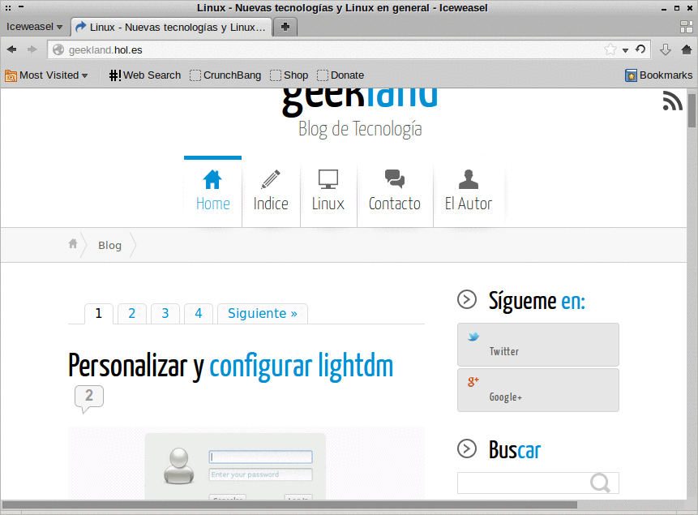](images/tráfico-saliente-aceptado.png)

En el caso que la totalidad de tráfico saliente estuviera bloqueado obtendríamos un resultado parecido al siguiente:

[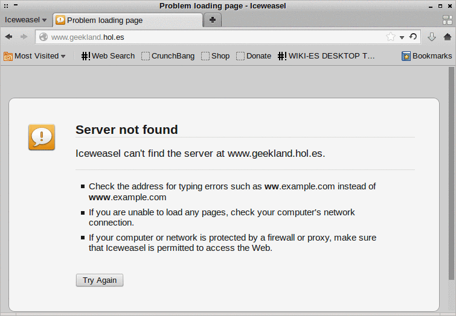](images/tráfico-saliente-rechazado.png)

Por lo tanto la configuración estándar es la apropiada para la gran mayoría de usuarios. Es la más apropiada porqué permitir la totalidad de conexiones entrantes es más que imprudente mientras que tener el tráfico saliente bloqueado y aplicar reglas puede representar una auténtica pesadilla a la hora de simplemente navegar por páginas web.

## CONFIGURAR EL FIREWALL

### DEFINICIÓN DE LA POLÍTICA GENERAL

A estas alturas ya tenemos funcionando el firewall y además hemos visto que la configuración estándar es la adecuada para una gran mayoría de usuarios. Pero está claro que en función de nuestras necesidades podemos modificar la configuración estándar del firewall.

[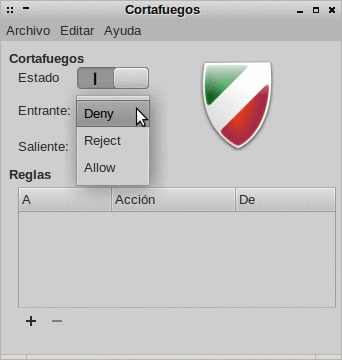](images/opciones-del-trafico-entrante.png)

Como se puede ver en la captura de pantalla, si queremos modificar el comportamiento del tráfico entrante en nuestra red, servidor u ordenador podemos seleccionar 3 opciones. **Las tres opciones de configuración para el tráfico entrante son las siguientes**:

_**DENY:**_ Si elegimos la opción **Deny** simplemente **se deniegan la totalidad de conexiones entrantes**. A priori considero que para un usuario normal esta es la opción más adecuada ya que nadie en principio tiene que acceder a nuestro ordenador. En el caso que nuestra máquina funcionará como servidor entonces el tema seria distinto.

_**REJECT**_: Si elegimos la opción **Reject** **se rechazaran la totalidad de conexiones entrantes**. En el momento que se rechace la conexión se enviará un paquete ICMP al cliente que ha realizado la petición indicándole que la conexión se ha rechazado. Esta opción es menos adecuada que la primera ya que estamos dando información al cliente que intenta acceder a nuestro equipo. La información que le estamos dando es que nuestro servidor está operativo y que esta protegido el acceso mediante un firewall.

_**ALLOW:**_ Si elegimos la opción **Allow** entonces **se aceptaran la totalidad de conexiones entrantes**. Esta opción no es aconsejable ni para un usuario estándar ni para un servidor.

[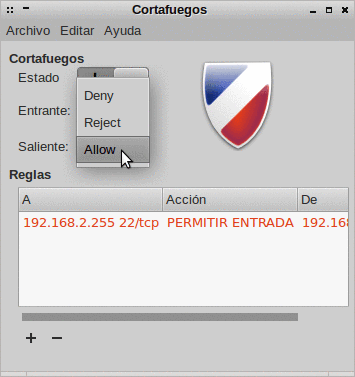](images/Opciones-trafico-saliente.png)

Como se puede ver en la captura de pantalla, en el caso que decidamos o necesitamos actuar sobre el tráfico saliente también tenemos tres opciones. **Las tres opciones de configuración para el tráfico tráfico saliente son las siguientes:**

_**DENY:**_ Si elegimos la opción **Deny estaremos denegando la totalidad de peticiones exteriores que estemos realizando como clientes**. Este opción no es la más adecuada para un usuario doméstico ya que se nos hará prácticamente imposible navegar.

_**REJECT:**_ Si elegimos la opción **Reject** **estaremos denegando la totalidad de peticiones exteriores que estemos realizando como clientes**. Si elegimos Reject, en el momento que se rechace la conexión exterior se informará al cliente que la conexión es rechazada por estar detrás de un firewall.

**_ALLOW:_** Si elegimos la opción **Allow** **estaremos aceptando la totalidad de conexiones salientes**. A priori para un usuario doméstico habitual está es la mejor opción.

### DEFINICIÓN DE EXCEPCIONES Y DE REGLAS

Una vez definida la política general respecto al tráfico entrante y saliente, en el caso que lo necesitemos, podemos establecer excepciones y reglas.

Supongamos que tenemos un ordenador que actúa de servidor ssh y en el firewall hemos definido que rechazamos la totalidad de tráfico entrante a nuestro ordenador. Por lo tanto a priori nadie podrá acceder al servidor ssh de nuestro ordenador. En el caso que alguien se intente conectar al servidor ssh obtendrá el siguiente resultado:

[](images/conexión-ssh-rechazada.png)

Para solucionar este problema y que un determinado rango de usuarios puedan conectarse al servidor ssh podemos aplicar **reglas/excepciones** a nuestro firewall. Para aplicar las reglas, como podemos ver en la siguiente captura de pantalla, vamos al firewall del servidor **y apretamos el botón +**:

[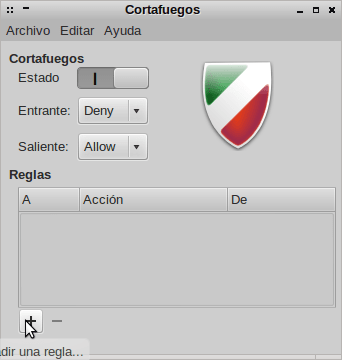](images/Añadir-Regla.png)

**Una vez apretado el botón +** vamos clicamos sobre la pestaña opciones avanzadas y en vuestra pantalla podréis ver una imagen parecida a la siguiente:

[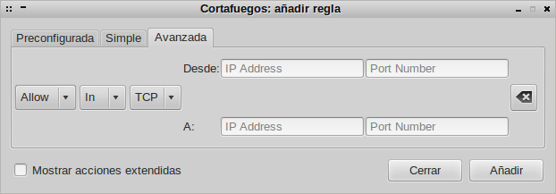](images/Opciones-avanzadas-Firewall.png)

Una vez estamos en esta pantalla tenemos que definir las reglas. Los parámetros a definir son los siguientes:

_**PUNTO 1- Tipo de conexión**_

Las 2 opciones que podemos elegir en este apartado son:

**_In:_** Si queremos aplicar una regla sobre el tráfico entrante tenemos que seleccionar la opción IN.

_**Out**_: Si queremos aplicar una regla sobre el trafico saliente tenemos que seleccionar la opción OUT.

**El objetivo del problema planteado es dar acceso a un determinado número de usuarios a nuestro servidor ssh. Por lo tanto tenemos que seleccionar la opción IN.**

**PUNTO 2- Tipo de acción**

La totalidad de opciones disponibles en este campo son:

_**Allow:**_ Si elegimos la opción Allow estaremos permitiendo las conexiones entrantes o salientes para la serie de usuarios que se especificaran en el punto 4 o 5.

_**Deny:**_ Si elegimos la opción Deny estaremos denegando las conexiones entrantes o salientes para la serie de usuarios que se especificaran en el punto 4 o 5.

_**Reject:**_ Si elegimos la opción Reject estaremos rechazando las conexiones entrantes o salientes para la serie de usuarios que se especificaran en el punto 4 o 5. En el momento que se rechace la conexión se enviará un paquete ICMP al cliente que ha realizado la petición indicándole que la conexión se ha rechazado.

**_Limit:_** Si elegimos la opción Limit se denegará la conexión de entrada o salida a una ip determinada. Se denegará el acceso en el caso que se hagan 6 o más peticiones en el intervalo de menos de 30 segundos. Esta opción es para evitar ataques de fuerza bruta.

**Como nuestra intención es permitir la entrada a un servidor ssh a un determinado número de usuarios elegiremos la opción Allow. En este caso también seria posible elegir la opción Limit.**

_**PUNTO 3 - Tipo de protocolo:**_

El siguiente punto a elegir es el tipo de protocolo. Las opciones disponibles en este apartado son las siguientes:

_**TCP:**_ Si el servicio el cual queremos permitir o denegar a un determinado rango de usuarios trabaja con el protocolo TCP tenemos que elegir la opción TCP. Para quien tenga curiosidad solo apuntar que el protocolo TCP trabaja orientado a la conexión. Esto quiere decir que una máquina A enviará los datos/paquetes a una máquina B. A medida que la máquina B vaya recibiendo los paquetes irá analizando su integridad. Si los paquetes recibidos no son corruptos se informará a la máquina A que la recepción se ha realizado correctamente. En el caso que la máquina B detecte que hay algún paquete corrupto lo que pasará es que la máquina B solicitará de nuevo este paquete a la máquina A.

_**UDP:**_ Si el servicio el cual queremos permitir o denegar a un determinado rango de usuarios trabaja con el protocolo UDP tenemos que elegir el protocolo UDP. Contrariamente al protocolo TCP, UDP no está orientado a la conexión. Por lo tanto las aplicaciones o servicios que trabajan con el protocolo UDP simplemente se limitaran a enviar paquetes a un destinatario. En ningún caso este protocolo realizará una verificación de los paquetes se han recibido correctamente ni se establecerá un flujo bidireccional entre el destinatario y el emisor.

_**Both:**_ En el caso que exista algún servicio que pueda trabajar con los 2 protocolos, TCP y UDP, o en el caso que tengamos dudas o no sabemos con que protocolo trabaja el servicio en el que queremos aplicar la regla seleccionaremos la opción Both.

**El objetivo del problema planteado es dar acceso a un servidor ssh. Sabemos que el servidor ssh trabaja con el protocolo TCP. Por lo tanto en este caso tenemos que elegir la opción TCP.**

###### Nota: En el siguiente enlace encontraran los protocolos que usan los servicios más habituales.

[http://es.wikipedia.org/wiki/Anexo:N%C3%BAmeros\_de\_puerto](http://es.wikipedia.org/wiki/Anexo:N%C3%BAmeros_de_puerto "Protocolos que usan los servidores")

_**PUNTO 4 - Selección de los clientes al que se aplican las reglas**_

[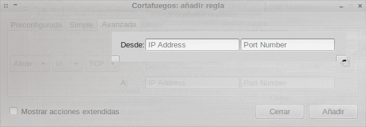](images/Selección-de-clientes.png)

**_Desde:_** En esta celda tenemos que ingresar la IP del cliente/s que queremos permitir, rechazar o limitar la conexión de entrada o de salida.

**En el caso que estamos presentando queremos permitir la entrada a un número de usuarios concretos a nuestro servidor ssh. Por lo tanto en la celda Desde introduciremos la IP de los clientes que queramos que tengan acceso a nuestro servidor.**

Así por ejemplo podemos introducir la siguiente IP:

**192.168.2.18**

Al introducir esta IP estaremos dando acceso al cliente con IP 192.168.2.18 al servidor ssh.

_**Port Number:**_ Este campo hace referencia al puerto de salida que el cliente usa para acceder al servidor.

**En el ejemplo que estamos viendo este campo aconsejo dejarlo en blanco o escribir any. El hecho de dejar el campo en blanco o poner any significa que el cliente puede usar cualquier puerto de salida para conectarse al servidor ssh.**

**_PUNTO 5 - Selección del servidor al que se aplican las reglas_**

[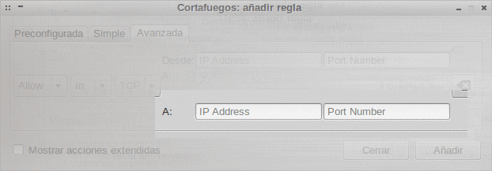](images/Selección-de-servidores.png)

_**a:**_ En esta celda tenemos que ingresar la IP del servidor que queremos permitir, rechazar o limitar la conexión de entrada o de salida.

**Por lo tanto en el caso que estamos poniendo como ejemplo tenemos que escribir la ip de nuestro servidor o simplemente escribir Any. Se escribimos Any el cliente con IP 192.168.2.18 podrá acceder a cualquier servidor ssh que esté detrás del firewall. Si elijamos la opción de poner la IP del servidor entonces el cliente con IP 192.168.2.18 tan solo podrá acceder a este servidor ssh.**

_**Port Number:**_ Este campo hace referencia al puerto de escucha del servidor o servidores que queremos permitir o denegar el acceso.

**En el caso que estamos estudiando queremos permitir el acceso de usuarios a un servidor ssh. Sabemos el que puerto de escucha estándar de un servidor ssh es el 22. Por lo tanto en esta celda escribiremos el número 22.**

###### Nota: En el siguiente enlace se puede encontrar una recopilación extensa de los puertos de escucha estándar acostumbran a usar habitualmente los distintos tipos de servidores existentes.

[http://es.wikipedia.org/wiki/Anexo:N%C3%BAmeros\_de\_puerto](http://es.wikipedia.org/wiki/Anexo:N%C3%BAmeros_de_puerto "Puertos de escucha estándar de los servidores más habituales")

Una vez vistas y comentadas la totalidad de opciones disponibles tan solo queda nos queda ver el resultado final. Si habéis seguido el ejemplo paso por paso tendremos una situación parecida a la siguiente:

[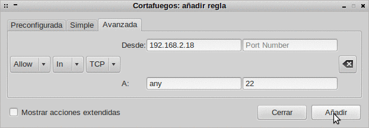](images/Permiso-1-usuario-al-servidor-ssh.png)

Ahora tal y como se puede ver en la captura de pantalla tan solo nos resta clicar al botón añadir. En estos momentos el cliente con IP 192.168.2.18 ya tiene acceso a nuestro servidor ssh. Para demostrar lo que acabo de decir tan solo hay que abrir una terminal y teclear:

> ```
> ssh -p22 joan@192.168.2.155
> ```

El resultado obtenido es el siguiente:

[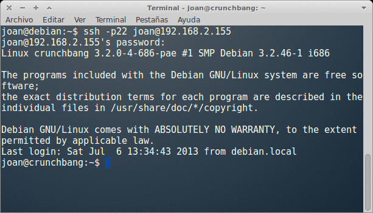](images/acceso-al-servidor-ssh.png)

Como se puede ver en la captura de pantalla ahora podemos acceder sin problema dentro de nuestro servidor ssh.

## OTROS EJEMPLOS DE REGLAS QUE PODEMOS USAR

Acabamos de ver como dar acceso a un usuario a nuestro servidor ssh. En el caso que lo necesitemos podemos introducir muchas más reglas dentro de nuestro firewall. Algunos ejemplos de reglas que podemos introducir son las siguientes:

**1- Dar acceso a la totalidad de usuarios de una red al servidor ssh**:

[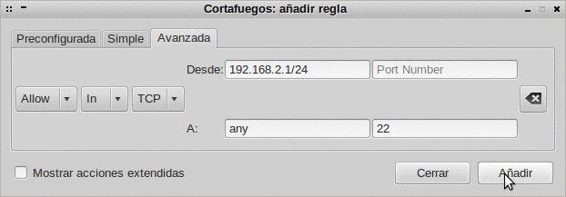](images/Apertura-a-un-rango-de-IP.png)

Con las opciones definidas en la captura de pantalla estaremos permitiendo que la totalidad de usuarios de la red local se conecten a cualquier servidor ssh.

**2- Dar acceso a la totalidad de usuarios de una red a los servidor ssh y ftp**:

[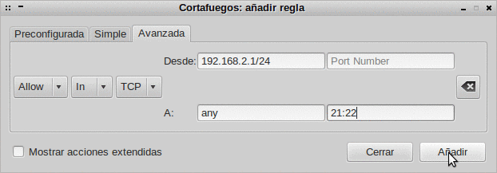](images/acceso-a-los-usuarios-red-local-ftp-ssh.png)

Con las opciones definidas en la captura de pantalla estaremos permitiendo que la totalidad de usuarios de la red local se conecten a cualquier servidor ssh y ftp.

**3- Hacer que un usuario/cliente determinado no se pueda conectar a páginas web que no dispongan de cifrado ssl**:

[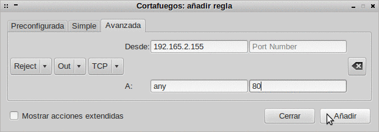](images/Rechazar-Conexión-http1.png)

Con las opciones definidas en la captura de pantalla prohibiremos que el cliente con IP 192.168.2.155 se pueda conectar a páginas que no dispongan cifrado ssl (http).

**4- Hacer que un usuario/cliente determinado no se pueda conectar a páginas web que dispongan de cifrado ssl:**

[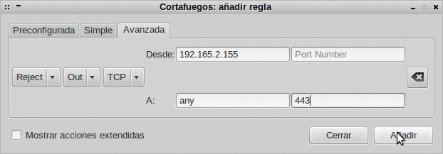](images/rechazar-peticiones-a-https.png)

Con las opciones definidas en la captura de pantalla prohibiremos que el cliente con IP 192.168.2.155 se pueda conectar a páginas que contengan cifrado ssl. (https)

**5- Prohibir a un cliente que se conecte a cualquier servidor ftp o ssh:**

[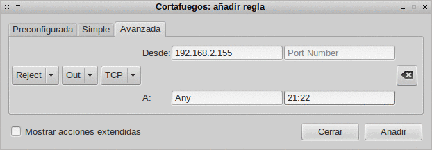](images/acceso-prohibido-a-ftp-y-ssh.png)

Con las opciones definidas en la captura de pantalla prohibiremos que el cliente con IP 192.168.2.155 se pueda conectar a servidores ssh y ftp.

**6- Prohibir que una red local que se conecte a cualquier servidor ftp o ssh:**

[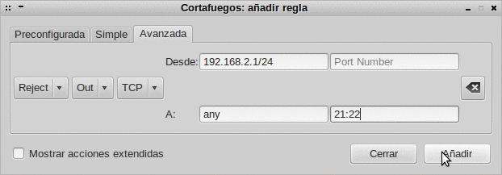](images/rechazar-conexiones-a-la-red-local.png)

Con las opciones definidas en la captura de pantalla prohibiremos que nuestra red local se pueda conectar a servidores ssh y ftp.

###### Nota:  Con las explicaciones realizadas y con los ejemplos que se exponen, en principio cualquier usuario debería ser capaz de configurar adecuadamente un firewall.

###### Nota: En este post solo cito como trabajar con las opciones avanzadas de Gufw. La razón es simple. Si domináis las opciones avanzadas el resto de opciones carecen de importancia.

## REGISTRO DE EVENTOS

Gufw nos permite registrar los eventos que van sucediendo. Para habilitar esta opción en el menú de Gufw tenemos que seleccionar la opción editar/preferencias. Una vez seleccionada la opción veremos la siguiente pantalla:

[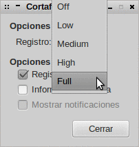](images/Nivel-de-registro.png)

Como se puede ver en la captura de pantalla podemos habilitar el registro de acciones clicando sobre registro. Para ello en el apartado Opciones de ufw tenemos que fijar el alcance del registro. Seguidamente en opciones de Gufw tenemos que clicar la muesca Registro. A partir de este momento se registraran la totalidad de eventos que se producen en el cortafuegos. En el hipotético caso que se necesite revisar los eventos, como se puede ver en la captura de pantalla, tan solo tenemos que ir al menú Archivo/registro.

Como se puede ver en la anterior captura de pantalla también tenemos una opción denominada informe de escucha. Si la activamos cuando estemos en la pantalla general del firewall podemos observar que aparece un nuevo apartado que se llama informe de escucha:

[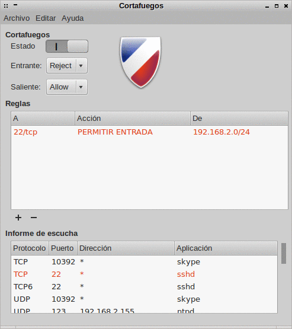](images/informe-de-escucha.png)

Activando esta opción. Como podemos ver en la captura de pantalla podremos ver información del tipo que el puerto 22 que es el del SSH está activado y en escucha a la espera de una conexión entrante.
