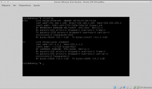
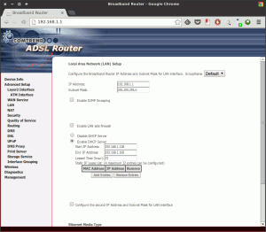

Cuando queremos que nuestro ordenador actúe como un servidor, ya sea para conectarnos desde el exterior o desde nuestra propia red, será extremadamente útil disponer de una IP fija o estática.<!--more-->

###### Nota: Antes de continuar quiero dejar muy claro que el procedimiento usado en este post es indicado para servidores que no dispongan de entorno gráfico, o para servidores que dispongan de entorno gráfico pero sin ningún gestor de red como por ejemplo [Network manager](https://projects.gnome.org/NetworkManager/ "Network Manager") o [Wicd](http://wicd.sourceforge.net/ "Wicd"). En el caso de tener alguno de estos gestores de red instalado aconsejo no seguir el tutorial ya que la configuración que definiremos no se llevará a término debido a que los gestores de red previamente citados tendrán preferencia sobre la configuración que vamos a introducir.

## UTILIDAD DE DISPONER DE UNA IP FIJA O ESTÁTICA

Disponer de una IP fija o estática es extremadamente útil básicamente por dos motivos:

1. **Si no disponemos de una IP fija, cuando se reciba una petición a nuestro servidor desde el exterior, nuestro router no sabrá donde tiene que redireccionarla ya que la IP del servidor puede ser cualquiera**.
2. **En el caso que necesitemos conectarnos a un ordenador de nuestra red local, si nuestros ordenadores no disponen de ip fija o estática entonces no sabremos a que equipo estamos dirigiendo nuestra petición.**

## COPIA DE SEGURIDAD DEL ARCHIVO DE CONFIGURACIÓN

Para conseguir que nuestro servidor o equipo disponga de una IP fija o estática tan solamente tenemos que seguir unos pasos muy simples. No obstante para evitar todo tipo de riesgo lo primero que realizaremos es realizar una copia de seguridad del fichero **/etc/network/interfaces**.

Para generar la copia de seguridad lo que haremos es introducir el siguiente comando en la terminal:

> ```
> cp /etc/network/interfaces /etc/network/interfaces.bak
> ```

Una vez realizada la copia de seguridad en la terminal pasaremos a la configurar nuestra IP fija.

## PASOS PARA LA CONFIGURACIÓN DE UNA IP FIJA O ESTÁTICA

Una vez realizados los pasos iniciales pasamos a configurar nuestra red con IP fija o estática. Para ello e**n la terminal tecleamos el siguiente comando:**

> ```
> sudo nano /etc/network/interfaces
> ```

Una vez tecleado el comando en la terminal se abrirá el editor de textos. **Una vez abierto el editor de texto tendremos que reemplazar el contenido existente por el que se muestra en la siguiente captura de pantalla:**

[](images/configurar-interfaz-de-red.png)

**El significado de cada uno de los parámetros que se pueden ver en la captura de pantalla es el siguiente:**

_Comando 1 :_ “**auto lo**”: Este comando lo que hace es iniciar la interfaz **lo** ([Loopback](https://es.wikipedia.org/wiki/Loopback "Significado de Loopback")) automáticamente durante la secuencia de arranque.

_Comando 2 :_ “**iface lo inet loopback**”: Con este comando lo que estamos haciendo es **definir los parámetros de la interfaz** **lo** **para IP's del tipo** [IPV4](https://es.wikipedia.org/wiki/IPv4 "Significado de IPv4"). Los parámetros de configuración de esta interfaz se introducen automáticamente en el momento de levantar la red

_Comando 3 :_ “**auto** **eth0**”: Este comando lo que hace es **iniciar la interfaz** **eth0 durante la secuencia de arranque del ordenador**.

###### Nota: Es posible que en vuestro caso tengáis que modificar el parámetro eth0 por otro diferente como por ejemplo wlan0, eth0, eth1, etc. Para saber el nombre de interfaz lo podemos hacer introduciendo el siguiente comando en la terminal:

> ```
> sudo ifconfig -a
> ```

[](images/resultados-de-ifconfig.png)

Como se puede ver en la captura de pantalla nosotros disponemos únicamente de una interfaz configurable que se reconoce con el nombre eth0. También observamos que nuestra IP actual es la **192.168.1.188** y que nuestra máscara de subred es la **255.255.255.0**. Con esta información deducimos que estamos a conectados a una [red de clase C](https://es.wikipedia.org/wiki/M%C3%A1scara_de_red "Explicación de lo que es una red Clase C") que podrá admitir 254 host o usuarios.

_Comando 4 :_ “**iface eth0 inet** **static**”: Con este comando lo que **estamos indicando es que una vez levantada la interfaz eth0 se asigne una IP fija o estática del tipo IPV4 a nuestro ordenador**. La IP y tipo de red se nos asignará en función de los parámetros que estableceremos en los comandos que van del 5 al 10.

_Comando 5 :_ “**address:** **192.168.1.188**”: En el campo address he puesto **192.168.1.188** que se trata de una dirección IP reservada para redes de tipo clase C. **He puesto esta IP porqué es la IP que quiero que se asigne a mi ordenador como ip fija o estática**. En principio podemos elegir cualquier ip comprendida entre la dirección de red (network) y la dirección broadcast.

###### Nota:  Las direcciones IP reservadas para redes clase C van desde 192.168.0.0 hasta 192.168.255.255. Por lo tanto en este campo podríamos haber elegido otras IP como por ejemplo 192.168.100.14, 162.168.0.3, etc. En función de la la IP que elijamos hay que tener en cuenta de modificar el resto de parámetros como por ejemplo puede ser la puerta de entrada, la dirección broadcast, etc.

_Comando 6 :_ “**netmask:** **255.255.255.0**”: **He elegido que mi máscara de red sea** **255.255.255.0**. Prácticamente el 100% de redes domésticas utilizan está máscara de red. La **máscara de red define el número máximo de ordenadores o host que puede tener nuestra red**. Al usar 255.255.255.0 el número máximo será de 254 ordenadores. **En el caso de necesitar construir una red de más de 254 ordenadores tendríamos que montar una red clase B que nos permitirá llegar a tener hasta 65534 ordenadores**.

###### Nota: A modo de ejemplo. Si quisiéramos limitar el número de ordenadores que pueden conectarse a nuestra red a 32, tan solo deberíamos modificar la mascara de red a 225.255.255.224.

###### Nota: Para cambiar a una red tipo B tendríamos que usar una máscara de red del tipo 255.255.0.0. Las IP que tienen reservadas para las redes de tipo B son 172.16.0.0 a 172.31.255.255. Si precisan de más información pueden consultar el siguiente [post](https://es.wikipedia.org/wiki/Red_privada).

_Comando 7 :_ “**network: 192.168.1.0**”: En el campo dirección de red **he puesto 192.168.1.0 ya que quiero que la IP que identifique la totalidad de la red sea 192.168.1.0**. En otras palabras 192.168.1.0 representará a la totalidad de dispositivos conectados a nuestra red. Normalmente **con IPv4 la dirección más baja del rango de IP se reserva para hacer referencia a la totalidad de host de la red**.

_Comando 8 :_ “**broadcast:** **192.168.1.255**”: **Como dirección broadcast pongo 192.168.1.255**. Esta dirección se podrá usar para comunicarse y enviar paquetes a la totalidad de equipos que forman parte de una misma red. **La dirección broadcast es la dirección más alta de la red**. En nuestro caso como la puerta de entrada es 192.168.1.1 y la mascara de subred es el 255.255.255.0 la dirección broadcast será 192.168.1.255.

_Comando 9 :_ “**gateway:** **192.168.1.1**”: E**n este campo hay que definir la puerta de entrada del router que en mi caso es 192.168.1.1**. Este parámetro se puede modificar en vuestro router pero la gran mayoría de personas acostumbra a tener IP 192.168.1.1. **Para poder consultar o modificar la puerta de entrada tan solo tienen que acceder al apartado LAN de la configuración de vuestro router:**

[](images/Puerta-de-entrada-Router.png)

_Comando 10 :_”**dns-nameservers:** **192.168.1.1**:” En los dns-namservers **he puesto 192.168.1.1** ya que es la puerta de entrada de mi Router. **De está forma estoy definiendo que las peticiones DNS de nuestro ordenador sean resultas mediante los DNS de mi ISP**. En el caso que quiera usar otros DNS, como por ejemplo los de google, tan solo tenemos que reemplazar 192.168.1.1 por 8.8.8.8.

Una vez realizados todos los pasos podemos estar seguros que tendremos una IP fija. Por lo tanto siempre que arranquemos nuestro servidor tendremos la misma IP.

## APLICAR LOS CAMBIOS DE LA CONFIGURACIÓN

**Una finalizada la configuración tan solo tenemos que reinicializar nuestra red. Para ello tecleamos el siguiente comando en la terminal:**

> ```
> sudo service networking restart
> ```

En el caso que se precise levantar o bajar alguna interfaz tan solo tenemos que teclear la siguiente serie de comandos en la terminal.

Para bajar una interfaz teclearemos:

> ```
> sudo ifdown “nombre de la interfaz”
> ```

Para subir una interfaz teclearemos:

> ```
> sudo ifup “nombre de la interfaz”
> ```

Por lo tanto si queremos bajar la interfaz eth0 teclearemos:

> ```
> sudo ifdown eth0
> ```

Si a posteriori queremos subir de nuevo la interfaz eth0 teclearemos el siguiente comando en la terminal:

> ```
> sudo ifup eth0
> ```

###### Nota: Una solución alternativa a todo lo propuesto en este apartado es asignar una ip fija o estática a una MAC en el panel de configuración del router. No obstante a mi modo de ver está solución presenta algunos inconvenientes ya que si el router falla implica que la red local entera se caiga.
