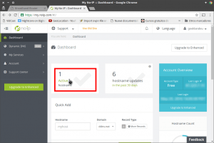
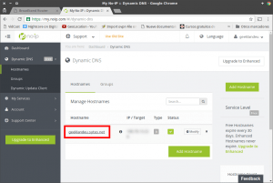
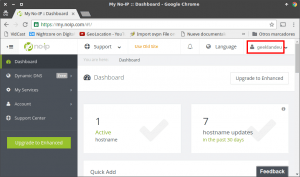
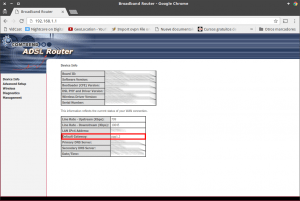
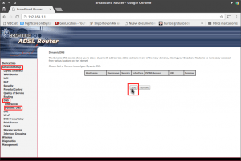
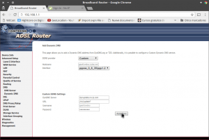
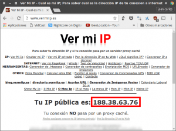

Antiguamente escribí un post en el que comentaba el [funcionamiento de los servicios de DNS dinámico y como crearse y configurar una cuenta NO-IP](). Uno de los pasos de la configuración era instalar y configurar un software cliente en nuestro ordenador con el fin de ir refrescando la nuestra IP. En este artículo veremos como evitar este paso del siguiente modo. Vamos a configurar No-IP en nuestro Router para que de forma automática vaya actualizando nuestra IP pública al servicio DNS dinámico de NO-IP.<!--more-->

## CONFIGURAR NO-IP PARA REFRESCAR NUESTRA IP EN UN ROUTER COMTREND

Los pasos a seguir para conseguir nuestro objetivo son los siguientes:

### Paso 1: Conocer y anotar nuestro Hostname de NO-IP

Imagino que quien este leyendo este artículo sabrá perfectamente el hostname de su cuenta de NO-IP. No obstante, en el caso que haya alguien que no lo sepa tan solo tiene que **entrar en su cuenta de NO-IP**. Justo al entrar, tal y como se puede ver en la captura de pantalla, hay que **clicar encima del botón Active hostname**.

[](images/Conocer-el-hostname.png)

Después de clicar sobre el botón, tal y como se puede ver en la captura de pantalla, podrán ver su nombre de hostname:

[](images/Obtención-de-nuestro-hostname.png)

**En mi caso**, tal y como se puede ver en la captura de pantalla, **mi Hostname es geeklandeu.sytes.net**

### Paso 2: Conocer el Username de nuestra cuenta de NO-IP

Al igual que en el paso anterior imagino que también sabrán el Username o nombre de usuario de su cuenta de NO-IP. En el caso que no lo sepan tan solo tienen que **acceder dentro de su cuenta de NO-IP y observar la parte superior derecha de la pantalla**.

[](images/Obtención-del-Username.png)

**En mi caso**, tal y como se puede ver en la captura de pantalla, **mi Username es geeklandeu**

### Paso 3: Acceder a la configuración de nuestro Router

A continuación accedemos a la configuración de nuestro. Para ello **abrimos nuestro navegador, en la barra direcciones tecleamos 192.168.1.1 y presionamos la tecla Enter**. Seguidamente aparecerá una ventana en la que deberemos **ingresar el nombre de usuario y de nuestro router y la contraseña**. Una vez introducidos **presionamos sobre el botón Iniciar Sesión**.

[](images/Acceder-a-la-configuración-de-nuestro-router-1.png)

### Paso 4: Averiguar la interfaz WAN que usamos

Justo al acceder a la configuración del Router podréis ver una pantalla parecida a la siguiente:

[](images/Averiguar-nombre-de-la-interfaz-WAN.png)

En esta pantalla nos deberemos fijar **en el apartado Default Gateway** en el que **podremos ver la interfaz WAN** que estamos usando actualmente. **En mi caso**, si observáis la captura de pantalla, veréis que **estoy usando la interfaz ppp1.2**

### Paso 5: Acceder a la configuración del DNS Dinámico de nuestro Router

Una vez conocemos el nombre de nuestra interfaz WAN ya disponemos de la totalidad de datos necesarios para configurar no-ip en nuestro router. Por lo tanto en el menú de navegación de la izquierda de nuestra pantalla **clicamos encima de Advanced Setup**, seguidamente **clicamos encima de DNS** y finalmente **clicamos encima de Dynamic DNS**.

[](images/Acceder-a-la-configuración-DNS-dinámico.png)

A continuación, tal y como se puede ver en la captura de pantalla, **clicamos encima del botón Add**.

### Paso 6: Configurar NO-IP en nuestro Router Comtrend

Una vez dentro del menú de configuración verán varios campos que deberemos cumplimentar para configurar no-ip. El contenido a introducir en cada uno de los campos es el siguiente:

**DDNS Provider:** En este campo se nos pregunta la empresa que nos proporciona el servicio de DNS dinámico. Como en nuestra caso no encontraremos la opción NO-IP tenemos que **seleccionar la opción Custom**

**Hostname:** En este campo tenemos que escribir nuestro hostname. En el paso número 1 hemos visto como averiguar nuestro hostname. **En mi caso el hostname es geeklandeu.sytes.net**

**Interface:** Seguidamente tenemos que indicar el nombre y el tipo de interfaz WAN que estamos usando. En el paso número 4 hemos visto que el nombre de mi interfaz WAN es ppp1.2. Por lo tanto en esta campo **seleccionaré la opción que contenga el nombre de la interfaz WAN que estoy usando que en mi caso es pppoe:0\_8\_35/ppp1.2**

**DynDNS Server:** En este campo debemos **escribir parte de la URL que se usa usa para actualizar nuestra IP pública** al servicio DNS dinámico de NO-IP. **Está URL es dynupdate.no-ip.com**

**URL:** En el campo URL se debe **escribir la otra parte de la URL que se usa para actualizar nuestra IP pública** al servicio DNS dinámico de NO-IP. **Está URL es /nic/update?**

**Username:** En el campo username tan solo tenemos que poner el nombre de usuario de nuestra cuenta de NO-IP. Para saber su nombre de usuario tan solo tienen que consultar el paso 2. **En mi caso uso el nombre de usuario geeklandeu**

**Password:** En el último campo tan solo tenemos que e**scribir la contraseña de nuestra cuenta de no IP**.

Una vez realizados todos los cambios, tal y como se puede ver en la captura de pantalla, **presionamos el botón Apply/Save**

\[caption id="attachment\_7045" align="alignnone" width="300"\][](images/Configurar-NO-IP-en-Router-Comtrend.png) Muestra de la configuración realizada en mi caso\[/caption\]

Una vez realizados todos estos pasos habremos terminado el proceso de configurar no-ip en nuestro Router. Por lo tanto en estos momentos nuestro Router actualizará de forma periódica y automática nuestra IP Pública al servicio DNS dinámico de NO-IP sin necesidad de tener que instalar un cliente NO-IP en un ordenador que tendríamos que tener permanentemente abierto.

## COMPROBACIÓN QUE EL ROUTER ESTA BIEN CONFIGURADO

En estos momentos el procedimiento ha finalizado. Para comprobar que nuestro router está refrescando nuestra IP Pública al servicio NO-IP lo haremos de la siguiente forma:

**El primer paso consiste en abrir una terminal**, o una línea de comandos, **y ejecutar** el comando ping seguido del Hostname de nuestra cuenta de NO-IP. Por lo tanto en mi caso ejecutaré **el siguiente comando**:

> ```
> ping geeklandeu.sytes.net
> ```

[](images/IP-del-Hostname.png)

Si observáis los resultados obtenidos vemos que en mi caso **el hostname geeklandeu.sytes.net está asociado a la IP 188.38.63.76**.

**El segundo paso consiste** comprobar nuestra IP Pública. Para ello abrimos nuestro navegador preferido y **accedemos a la siguiente página web**:

[http://www.vermiip.es/](http://www.vermiip.es/ "Web para ver nuestra IP Pública")

Justo al acceder a la página web, tal y como se puede ver en la captura de pantalla, podremos ver nuestra IP Pública

[](images/Ip-Pública.png) Tal y como podéis ver **en mi caso la IP Pública es la 188.38.63.76 y es exactamente la misma IP que está asociada con el hostname de NO-IP geeklandeu.sytes.net**. **Por lo tanto podemos estar seguros que la configuración realizada es correcta** y nuestro router está refrescando nuestra IP al servicio NO-IP.

## ENLACES DE INTERÉS

Si lo consideran oportuno también podemos actualizar nuestra IP a través de una petición http. Para ello tan solo hay que seguir las instrucciones que se muestran en el siguiente enlace:

[https://www.noip.com/integrate/request](https://www.noip.com/integrate/request "Refrescar nuestra IP mediante una petición http")
